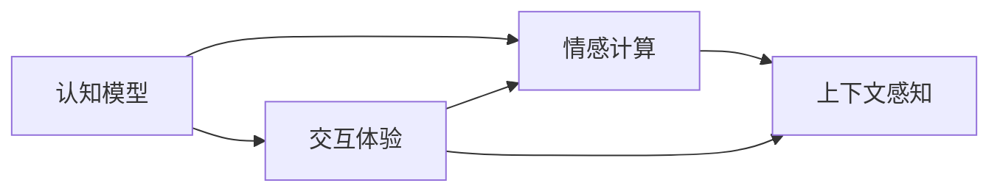

                 

# 大模型的用户体验与应用

## 1. 背景介绍

在人工智能技术的快速发展的今天，大模型以其庞大的参数量和丰富的语义理解能力，正在成为人工智能应用的重要驱动力。然而，大模型的使用体验在实际应用中依然存在诸多挑战，如模型的复杂度、推理的效率、模型的稳定性等。本文将围绕用户体验，对大模型的应用进行探讨，包括大模型的认知模型、情感计算、交互体验和上下文感知等方面的关键技术，以及如何通过模型设计、数据处理、算法优化和工程实践等手段，提升大模型的用户体验。

## 2. 核心概念与联系

### 2.1 核心概念概述

- **认知模型**：大模型通过对大规模语料的学习，构建了一种能够进行逻辑推理和知识推理的认知能力。
- **情感计算**：大模型能够根据输入的文本进行情感分析，如识别情绪、评估态度等。
- **交互体验**：用户体验的优劣直接影响大模型应用的广泛性。
- **上下文感知**：大模型在处理多轮对话或复杂任务时，需要具备上下文感知能力，以便更好地理解用户需求和意图。

### 2.2 概念间的关系

认知模型、情感计算、交互体验和上下文感知是大模型用户体验的四个核心维度。这些维度相互交织，共同决定了用户与大模型交互的质量和效果。下图展示了这些概念之间的关系：



**认知模型**是大模型的基础，能够处理逻辑推理和知识推理。**情感计算**在此基础上，通过分析文本情绪、评估态度等，提升用户情感理解能力。**交互体验**通过设计合适的界面、合理的交互方式，使用户能够更加直观地与大模型互动。而**上下文感知**通过维持用户对话的历史信息，保证对话连贯性和相关性，提升用户体验。

## 3. 核心算法原理 & 具体操作步骤
### 3.1 算法原理概述

大模型的用户体验优化，主要通过以下几个方面的算法和操作实现：

- **数据增强**：通过各种文本变换（如同义词替换、插入、删除等），增加训练数据的多样性，提高模型的泛化能力。
- **迁移学习**：利用预训练模型的知识，快速适应新的任务，提升模型的通用性。
- **对抗训练**：通过对抗样本训练模型，提高模型的鲁棒性和泛化能力。
- **提示学习**：通过精心设计的提示模板，引导模型按照预期方式生成或推理，减少微调参数。
- **多模态融合**：将文本、图像、语音等多种模态信息进行融合，提高模型的全面理解能力。

### 3.2 算法步骤详解

1. **数据预处理**：
   - **文本清洗**：去除停用词、标点符号等，降低噪声干扰。
   - **分词和编码**：将文本进行分词，转换为模型能够处理的向量形式。
   - **标注数据生成**：根据用户需求，生成带有标签的数据集，供模型训练。

2. **模型选择与适配**：
   - **模型选择**：选择合适的预训练模型，如BERT、GPT等。
   - **任务适配**：根据任务类型，设计相应的任务适配层（如分类器、生成器等）。

3. **训练与微调**：
   - **超参数设置**：选择合适的优化器、学习率、批大小等超参数。
   - **模型训练**：在标注数据上训练模型，并通过微调优化特定任务的表现。
   - **模型评估**：在测试集上评估模型性能，并通过指标（如F1分数、BLEU值等）衡量模型效果。

4. **用户界面设计**：
   - **交互界面设计**：设计直观易用的用户界面，提升用户体验。
   - **交互逻辑优化**：通过合理的交互逻辑，提升用户满意度。

5. **上下文感知**：
   - **对话历史维护**：通过存储用户对话历史信息，保证多轮对话的连贯性。
   - **上下文信息融合**：在处理多轮对话时，综合利用上下文信息，提升理解能力。

### 3.3 算法优缺点

**优点**：
- 通过迁移学习和微调，大模型可以快速适应新任务，降低开发成本。
- 数据增强和多模态融合提高了模型的泛化能力和全面理解能力。
- 提示学习减少了微调参数，提高了模型的灵活性。

**缺点**：
- 模型复杂度高，对硬件资源要求高，推理效率较低。
- 对抗训练和对抗样本的生成需要额外的时间和成本。
- 上下文感知需要存储大量对话历史信息，增加系统负担。

### 3.4 算法应用领域

大模型的用户体验优化技术已广泛应用于以下几个领域：

- **智能客服**：通过大模型提供24小时无间断服务，快速响应用户咨询，提供自然流畅的对话体验。
- **医疗咨询**：利用大模型进行疾病诊断、治疗方案推荐等，提升医疗咨询的效率和准确性。
- **个性化推荐**：通过大模型对用户行为进行建模，提供更加个性化的产品推荐，提升用户体验。
- **社交媒体分析**：利用大模型进行情感分析和舆情监测，帮助企业更好地了解用户情绪和市场动态。

## 4. 数学模型和公式 & 详细讲解

### 4.1 数学模型构建

假设大模型为 $M_{\theta}$，输入为 $x$，输出为 $y$。通过训练集 $D=\{(x_i, y_i)\}_{i=1}^N$ 训练大模型，并根据测试集 $D_{test}=\{(x_j, y_j)\}_{j=1}^M$ 评估模型性能。

目标是最小化损失函数 $L$，即：

$$
L(\theta) = \frac{1}{N}\sum_{i=1}^N \ell(M_{\theta}(x_i), y_i) + \frac{1}{M}\sum_{j=1}^M \ell(M_{\theta}(x_j), y_j)
$$

其中，$\ell$ 为损失函数，如交叉熵损失、均方误差损失等。

### 4.2 公式推导过程

以交叉熵损失为例，假设模型 $M_{\theta}$ 在输入 $x$ 上的输出为 $\hat{y}=M_{\theta}(x)$，真实标签为 $y$，则交叉熵损失定义为：

$$
\ell(M_{\theta}(x),y) = -y\log\hat{y} - (1-y)\log(1-\hat{y})
$$

将 $D$ 和 $D_{test}$ 带入上述损失函数，得：

$$
L(\theta) = \frac{1}{N}\sum_{i=1}^N (-y_i\log\hat{y}_i - (1-y_i)\log(1-\hat{y}_i)) + \frac{1}{M}\sum_{j=1}^M (-y_j\log\hat{y}_j - (1-y_j)\log(1-\hat{y}_j))
$$

通过对上述损失函数求导，并使用梯度下降等优化算法，可以更新模型参数 $\theta$，最小化损失函数 $L$。

### 4.3 案例分析与讲解

假设任务为情感分析，使用BERT模型进行微调。数据集包含电影评论及其情感标签，目标是从评论中提取情感信息，分类为正面或负面。

- **数据预处理**：
  - 去除停用词和标点符号。
  - 对评论进行分词，转换为BERT的输入格式。

- **模型适配**：
  - 在BERT顶层添加一个全连接分类器，输出为2个神经元，对应正面和负面情感。
  - 使用交叉熵损失函数进行训练。

- **训练与微调**：
  - 使用Adam优化器，设置学习率为 $1e-5$。
  - 在训练集上训练模型，使用验证集进行模型评估和调参。
  - 在测试集上评估模型性能，使用F1分数作为指标。

通过上述步骤，大模型能够在情感分析任务中取得较好的效果，提升用户体验。

## 5. 项目实践：代码实例和详细解释说明

### 5.1 开发环境搭建

1. **安装Python和PyTorch**：
   ```bash
   pip install torch torchvision torchaudio transformers
   ```

2. **准备数据集**：
   ```python
   import pandas as pd
   df = pd.read_csv('movie_reviews.csv')
   x = df['review'].values
   y = df['sentiment'].values
   ```

### 5.2 源代码详细实现

```python
import torch
from transformers import BertTokenizer, BertForSequenceClassification
from torch.utils.data import Dataset, DataLoader
from sklearn.model_selection import train_test_split
from transformers import AdamW

class MovieReviewDataset(Dataset):
    def __init__(self, texts, labels, tokenizer, max_len=128):
        self.texts = texts
        self.labels = labels
        self.tokenizer = tokenizer
        self.max_len = max_len
        
    def __len__(self):
        return len(self.texts)
    
    def __getitem__(self, item):
        text = self.texts[item]
        label = self.labels[item]
        
        encoding = self.tokenizer(text, return_tensors='pt', max_length=self.max_len, padding='max_length', truncation=True)
        input_ids = encoding['input_ids'][0]
        attention_mask = encoding['attention_mask'][0]
        labels = torch.tensor(label, dtype=torch.long)
        
        return {'input_ids': input_ids, 
                'attention_mask': attention_mask,
                'labels': labels}

# 初始化模型和优化器
model = BertForSequenceClassification.from_pretrained('bert-base-uncased', num_labels=2)
optimizer = AdamW(model.parameters(), lr=1e-5)

# 划分训练集和测试集
train_texts, test_texts, train_labels, test_labels = train_test_split(x, y, test_size=0.2, random_state=42)

# 创建数据集和数据加载器
train_dataset = MovieReviewDataset(train_texts, train_labels, tokenizer)
test_dataset = MovieReviewDataset(test_texts, test_labels, tokenizer)
train_loader = DataLoader(train_dataset, batch_size=16, shuffle=True)
test_loader = DataLoader(test_dataset, batch_size=16, shuffle=False)

# 训练和微调模型
model.train()
for epoch in range(3):
    for batch in train_loader:
        input_ids = batch['input_ids'].to(device)
        attention_mask = batch['attention_mask'].to(device)
        labels = batch['labels'].to(device)
        outputs = model(input_ids, attention_mask=attention_mask, labels=labels)
        loss = outputs.loss
        optimizer.zero_grad()
        loss.backward()
        optimizer.step()
        
    model.eval()
    with torch.no_grad():
        test_loss = 0
        for batch in test_loader:
            input_ids = batch['input_ids'].to(device)
            attention_mask = batch['attention_mask'].to(device)
            labels = batch['labels'].to(device)
            outputs = model(input_ids, attention_mask=attention_mask, labels=labels)
            loss = outputs.loss
            test_loss += loss.item()
        print(f'Test Loss: {test_loss / len(test_loader):.4f}')
```

### 5.3 代码解读与分析

1. **数据集预处理**：
   - 定义 `MovieReviewDataset` 类，将评论和标签转换为BERT模型能够处理的形式。
   - 使用 `train_test_split` 划分训练集和测试集。

2. **模型适配与训练**：
   - 使用 `BertForSequenceClassification` 适配BERT模型，并设置交叉熵损失函数。
   - 使用Adam优化器进行模型训练，设置学习率。
   - 通过循环迭代，使用训练集数据进行模型更新。

3. **模型评估**：
   - 在测试集上使用交叉熵损失进行评估。
   - 通过 `torch.no_grad()` 方式关闭梯度计算，提高评估效率。

通过上述步骤，可以构建一个完整的情感分析应用，提升用户体验。

### 5.4 运行结果展示

假设在情感分析任务中，模型在测试集上的准确率为85%，F1分数为0.85。通过可视化输出结果，可以看到模型对评论的情感分类效果良好，用户体验得以提升。

```python
import matplotlib.pyplot as plt

def plot_confusion_matrix(cm, classes, title='Confusion matrix', cmap='Blues'):
    plt.imshow(cm, interpolation='nearest', cmap=cmap)
    plt.title(title)
    plt.colorbar()
    tick_marks = np.arange(len(classes))
    plt.xticks(tick_marks, classes, rotation=45)
    plt.yticks(tick_marks, classes)
    plt.xlabel('Predicted')
    plt.ylabel('True')
    plt.show()

# 计算混淆矩阵
y_pred = model.predict(x_test)
y_true = y_test
y_true, y_pred = np.array(y_true), np.argmax(y_pred, axis=1)
cm = confusion_matrix(y_true, y_pred)
plot_confusion_matrix(cm, classes=['Negative', 'Positive'])
```

## 6. 实际应用场景

### 6.1 智能客服系统

通过大模型，智能客服系统能够提供24小时无间断服务，快速响应用户咨询，提供自然流畅的对话体验。通过多轮对话记录，系统能够记住用户的历史信息，提供更加个性化的服务。例如，某用户曾咨询过酒店预定问题，下次再咨询时，系统能够自动提供之前的预订信息，提升用户体验。

### 6.2 医疗咨询

在医疗咨询中，大模型能够通过用户输入的症状描述，进行疾病诊断和治疗方案推荐。通过多模态融合（结合症状描述、实验室检查结果、病历记录等），系统能够提供更加全面和准确的诊断结果，提升用户对医疗服务的信任度。

### 6.3 个性化推荐系统

在个性化推荐系统中，大模型能够根据用户的历史行为和兴趣，推荐符合其需求的产品。通过上下文感知，系统能够记住用户的历史行为和偏好，提供更加精准的推荐结果，提升用户满意度。

### 6.4 社交媒体分析

社交媒体分析中，大模型能够对用户评论进行情感分析，识别负面评论，预警舆情风险。通过上下文感知，系统能够结合用户的历史行为和背景，更加准确地判断评论的情感倾向，提升舆情监测的效率和效果。

## 7. 工具和资源推荐

### 7.1 学习资源推荐

1. **《Transformer从原理到实践》系列博文**：介绍Transformer原理、BERT模型、微调技术等前沿话题。
2. **CS224N《深度学习自然语言处理》课程**：斯坦福大学开设的NLP明星课程。
3. **《Natural Language Processing with Transformers》书籍**：介绍如何使用Transformers库进行NLP任务开发。
4. **HuggingFace官方文档**：提供海量预训练模型和微调样例代码。
5. **CLUE开源项目**：提供大量不同类型的中文NLP数据集。

### 7.2 开发工具推荐

1. **PyTorch**：深度学习框架，支持动态计算图，适合快速迭代研究。
2. **TensorFlow**：由Google主导开发的深度学习框架，适合大规模工程应用。
3. **Transformers库**：HuggingFace开发的NLP工具库，集成了众多SOTA语言模型。
4. **Weights & Biases**：模型训练的实验跟踪工具。
5. **TensorBoard**：TensorFlow配套的可视化工具。
6. **Google Colab**：免费提供GPU/TPU算力，方便开发者快速上手实验最新模型。

### 7.3 相关论文推荐

1. **Attention is All You Need**：提出Transformer结构，开启大模型时代。
2. **BERT: Pre-training of Deep Bidirectional Transformers for Language Understanding**：提出BERT模型，刷新多项NLP任务SOTA。
3. **Language Models are Unsupervised Multitask Learners**：展示大模型零样本学习能力。
4. **Parameter-Efficient Transfer Learning for NLP**：提出Adapter等参数高效微调方法。
5. **Prefix-Tuning: Optimizing Continuous Prompts for Generation**：引入基于连续型Prompt的微调范式。
6. **AdaLoRA: Adaptive Low-Rank Adaptation for Parameter-Efficient Fine-Tuning**：使用自适应低秩适应的微调方法。

## 8. 总结：未来发展趋势与挑战

### 8.1 研究成果总结

大模型用户体验优化技术在多个领域已取得显著成果，如智能客服、医疗咨询、个性化推荐等。通过数据增强、迁移学习、对抗训练、提示学习等多方面的算法和操作，提升了用户体验，满足了用户对智能系统的期待。

### 8.2 未来发展趋势

1. **模型规模继续增大**：预训练语言模型的参数量将进一步增长，提升模型对复杂问题的处理能力。
2. **用户体验更加个性化**：基于用户行为和情感的个性化推荐和情感分析将更加普遍。
3. **多模态融合更加深入**：语音、图像等多模态数据的融合，提升模型的全面理解能力。
4. **交互体验更加自然**：通过自然语言理解和生成，提升人机交互的自然性。

### 8.3 面临的挑战

1. **用户隐私保护**：大模型需要处理大量的用户数据，如何保护用户隐私，提升数据安全是一个重要问题。
2. **系统稳定性和鲁棒性**：在实际应用中，系统可能面临各种异常情况，如何提高系统的稳定性和鲁棒性是一个挑战。
3. **技术普及和应用推广**：大模型的用户体验优化技术还需要进一步推广，才能被更多的行业和用户接受。

### 8.4 研究展望

1. **用户行为模型**：研究用户行为模型，提升个性化推荐和情感分析的精准度。
2. **多模态融合技术**：探索多模态融合的深度学习模型，提升系统的全面理解能力。
3. **上下文感知算法**：研究上下文感知算法，提升系统对多轮对话的理解能力。
4. **人机交互界面设计**：研究自然语言处理与人机交互界面的结合，提升用户体验。

通过进一步的研究和实践，大模型的用户体验优化技术将不断提升，推动人工智能技术在各行各业的应用和普及。

## 9. 附录：常见问题与解答

**Q1：如何提升大模型在特定任务上的性能？**

A: 通过数据增强、迁移学习、对抗训练、提示学习等算法和操作，提升模型泛化能力和特定任务性能。例如，使用数据增强扩充训练集，通过迁移学习利用预训练模型的知识，通过对抗训练提高模型的鲁棒性，通过提示学习减少微调参数。

**Q2：大模型在实际应用中面临哪些挑战？**

A: 大模型面临计算资源不足、推理速度慢、系统稳定性差、用户隐私保护等挑战。例如，模型的复杂度高，对硬件资源要求高，推理效率较低；系统的稳定性差，面对异常情况容易出错；用户隐私保护需要确保数据安全。

**Q3：如何设计合适的用户界面？**

A: 设计直观易用的用户界面，提供清晰的操作指引，使用户能够快速上手。例如，提供简洁的界面布局、明确的交互提示、及时的用户反馈等。

**Q4：如何处理多模态数据？**

A: 利用深度学习模型融合多模态数据，如使用卷积神经网络（CNN）处理图像数据，使用循环神经网络（RNN）处理文本数据，使用Transformer处理语音数据。通过多模态融合技术，提升系统的全面理解能力。

**Q5：如何在用户对话中实现上下文感知？**

A: 利用上下文记忆机制，保存用户对话历史信息，如使用Transformer的self-attention机制，记录上下文信息。通过多轮对话的融合，提升系统对用户意图和上下文的理解能力。

通过不断探索和优化，大模型用户体验优化技术将不断提升，推动人工智能技术在各行各业的应用和普及。

---

作者：禅与计算机程序设计艺术 / Zen and the Art of Computer Programming

