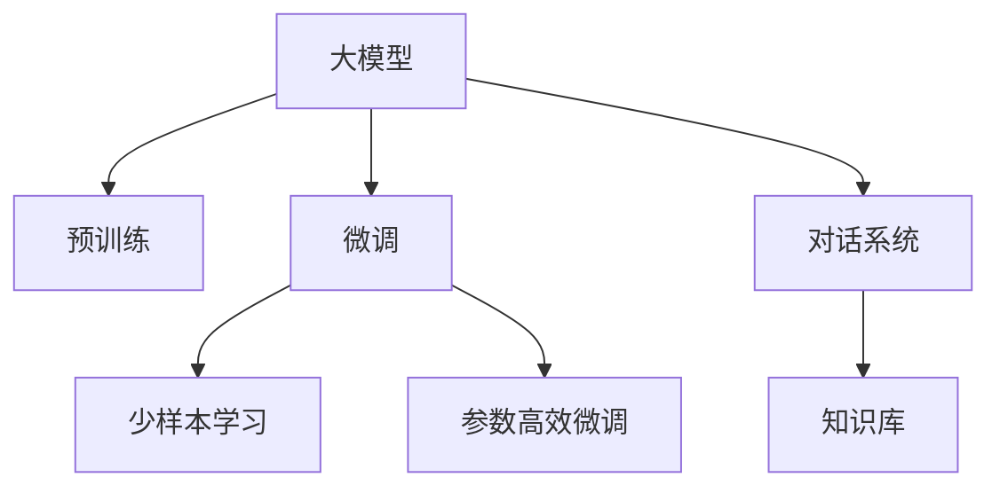
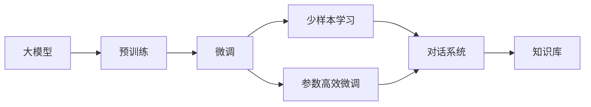
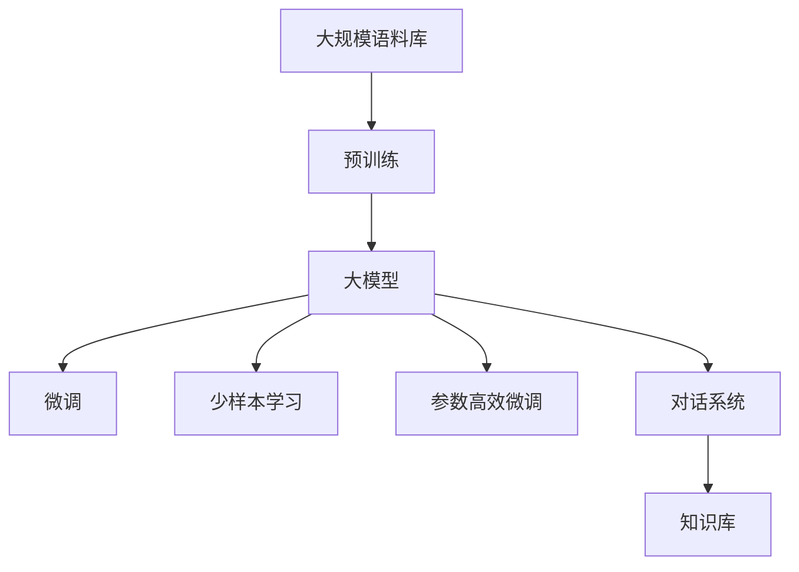

                 

# 大模型问答机器人如何回答问题

## 1. 背景介绍

### 1.1 问题由来
人工智能（AI）的发展催生了许多创新的应用，其中大模型问答机器人（Large Model Answering Robot）成为了一个备受瞩目的领域。它通过自然语言处理（NLP）技术，能够理解用户提出的问题，并给出精准的回答。这些问题可以是常识问题、事实查询、情感分析、决策支持等。通过大模型问答机器人，用户可以获取信息、解决问题、获取建议，从而提升生活质量和工作效率。

### 1.2 问题核心关键点
大模型问答机器人由大模型和微调技术驱动，能够高效地处理各种问题。通过微调技术，大模型可以适应特定领域，从而提供更加精准的答案。微调技术在大模型问答机器人中的应用主要包括以下几个方面：

- **预训练模型**：通过大规模语料库预训练模型，如BERT、GPT等，获得语言表示能力。
- **任务适配层**：根据特定任务，如问答、文本生成等，添加任务适配层。
- **监督学习**：利用有标注数据，通过监督学习优化模型。
- **参数高效微调**：在微调过程中，只更新少量模型参数，避免资源浪费。
- **少样本学习**：利用微调技术，在少量数据上实现高效学习。

### 1.3 问题研究意义
大模型问答机器人在医疗、金融、教育、客服等多个领域中有着广泛的应用前景。通过精准回答问题，能够提高服务效率，降低人力成本，提升用户体验。此外，大模型问答机器人在解决复杂问题、进行信息检索、提供决策支持等方面也具有重要作用。因此，深入研究大模型问答机器人的原理和应用，对于推动人工智能技术的广泛应用具有重要意义。

## 2. 核心概念与联系

### 2.1 核心概念概述

- **大模型**：以BERT、GPT等为代表的大规模预训练语言模型，具有强大的语言表示能力。
- **微调**：在特定任务上，利用标注数据对预训练模型进行优化，以适应该任务。
- **少样本学习**：在少量数据的情况下，通过微调技术实现高效学习。
- **参数高效微调**：仅更新部分模型参数，以提高微调效率。
- **对话系统**：基于大模型的问答机器人，能够进行人机对话。

这些概念之间相互联系，形成了一个完整的大模型问答机器人框架。下面将通过Mermaid流程图展示这些概念之间的关系：



这个流程图展示了从预训练模型到微调，再到少样本学习和对话系统的全过程。大模型通过预训练获得语言表示能力，微调使模型适应特定任务，少样本学习在少量数据下提高学习效率，而对话系统则是将这些能力应用到实际对话场景中。

### 2.2 概念间的关系

这些核心概念之间的关系可以通过以下Mermaid流程图来展示：



这个流程图展示了预训练和微调是大模型的核心步骤，少样本学习是微调的扩展，对话系统是最终应用场景。参数高效微调则提高了微调效率，知识库为对话系统提供了丰富的背景知识。

### 2.3 核心概念的整体架构

最后，用一个综合的流程图来展示这些核心概念在大模型问答机器人中的应用：



这个综合流程图展示了从语料库预训练到对话系统的完整流程。大模型通过预训练获得语言表示能力，微调、少样本学习和参数高效微调使其适应特定任务，对话系统则将这些能力应用到实际对话场景中，知识库为其提供了丰富的背景知识。

## 3. 核心算法原理 & 具体操作步骤

### 3.1 算法原理概述

大模型问答机器人是基于监督学习的微调技术。其核心思想是将预训练大模型作为特征提取器，通过有标注数据对模型进行微调，以适应特定任务。具体步骤如下：

1. **预训练模型选择**：选择合适的预训练模型，如BERT、GPT等，作为大模型的基础。
2. **任务适配层设计**：根据具体任务，设计任务适配层，如分类器、解码器等。
3. **微调参数选择**：选择合适的优化算法和超参数，如Adam、SGD等，设置学习率、批大小等。
4. **数据集准备**：准备标注数据集，进行数据增强、对抗训练等处理。
5. **模型微调**：通过监督学习对模型进行微调，更新任务适配层参数。
6. **性能评估**：在验证集和测试集上评估模型性能，调整参数，直到模型性能达到最优。

### 3.2 算法步骤详解

#### 3.2.1 预训练模型选择

预训练模型是大模型问答机器人的基础。目前常用的预训练模型包括BERT、GPT、T5等。这些模型在大型语料库上进行了预训练，具有强大的语言表示能力。选择合适的预训练模型，可以显著提升微调效果。

#### 3.2.2 任务适配层设计

根据具体任务，设计任务适配层是微调的重要步骤。常见的任务适配层包括分类器、解码器等。分类器用于分类任务，如问答、情感分析等；解码器用于生成任务，如文本生成、机器翻译等。任务适配层的设计需要结合任务特点，进行合理的调整。

#### 3.2.3 微调参数选择

选择合适的优化算法和超参数是微调的关键。常用的优化算法包括Adam、SGD等。超参数包括学习率、批大小、迭代轮数等。合适的参数设置可以有效提升微调效果，避免过拟合和欠拟合问题。

#### 3.2.4 数据集准备

准备标注数据集是微调的基础。数据集需要包括训练集、验证集和测试集。数据集需要经过清洗、标注等处理，以确保数据质量和标注准确性。数据增强、对抗训练等技术可以有效提高模型泛化能力。

#### 3.2.5 模型微调

通过监督学习对模型进行微调，更新任务适配层参数。微调过程需要选择合适的优化器、学习率等参数，进行梯度下降等优化算法。微调过程中需要注意避免过拟合和欠拟合问题。

#### 3.2.6 性能评估

在验证集和测试集上评估模型性能，调整参数，直到模型性能达到最优。性能评估可以通过准确率、召回率、F1分数等指标进行衡量。

### 3.3 算法优缺点

大模型问答机器人具有以下优点：

- **高效性**：大模型问答机器人能够快速处理大量问题，显著提高服务效率。
- **精准性**：通过微调技术，大模型问答机器人可以适应特定领域，提供精准的答案。
- **可扩展性**：大模型问答机器人可以根据需求进行扩展，应用到多个领域。

同时，也存在一些缺点：

- **依赖标注数据**：微调需要依赖标注数据，获取高质量标注数据成本较高。
- **泛化能力有限**：当目标任务与预训练数据分布差异较大时，微调效果可能较差。
- **资源消耗大**：大模型问答机器人需要大量的计算资源和存储空间。

### 3.4 算法应用领域

大模型问答机器人广泛应用于多个领域，如医疗、金融、教育、客服等。以下是一些具体应用场景：

- **医疗问答**：利用大模型问答机器人，可以为患者提供健康咨询、疾病诊断等服务。
- **金融问答**：利用大模型问答机器人，可以提供金融知识、投资策略等服务。
- **教育问答**：利用大模型问答机器人，可以为学生提供学习指导、作业解答等服务。
- **客服问答**：利用大模型问答机器人，可以提供自动化客服、问题解答等服务。

## 4. 数学模型和公式 & 详细讲解 & 举例说明

### 4.1 数学模型构建

大模型问答机器人的数学模型构建可以形式化描述如下：

1. **输入**：用户提出的问题 $x$。
2. **输出**：问题 $x$ 的答案 $y$。
3. **预训练模型**：$M_{\theta}$，其中 $\theta$ 为模型参数。
4. **任务适配层**：$L$，根据任务类型设计。
5. **损失函数**：$\mathcal{L}$，用于衡量模型预测与真实标签之间的差异。
6. **优化算法**：$Optimizer$，用于更新模型参数。

数学模型构建可以表示为：

$$
y = L(M_{\theta}(x))
$$

$$
\mathcal{L}(y, y_{true}) = \text{Loss Function}
$$

$$
\theta_{new} = Optimize(\mathcal{L}(y, y_{true}), \theta_{old})
$$

### 4.2 公式推导过程

以二分类任务为例，假设问题 $x$ 对应的答案为 $y_{true} \in \{0, 1\}$，模型输出为 $y = L(M_{\theta}(x)) \in [0, 1]$，表示模型预测问题 $x$ 属于正类的概率。二分类交叉熵损失函数定义为：

$$
\mathcal{L}(y, y_{true}) = -[y_{true}\log y + (1-y_{true})\log (1-y)]
$$

在训练集上，使用梯度下降等优化算法，最小化损失函数 $\mathcal{L}$，更新模型参数 $\theta$。优化算法的更新公式为：

$$
\theta_{new} = \theta_{old} - \eta \nabla_{\theta}\mathcal{L}(\theta_{old})
$$

其中，$\eta$ 为学习率，$\nabla_{\theta}\mathcal{L}(\theta_{old})$ 为损失函数对模型参数的梯度。

### 4.3 案例分析与讲解

假设我们在医疗问答场景中，使用BERT模型进行微调。具体步骤如下：

1. **数据准备**：收集医疗领域的问答数据集，包括问题和答案。
2. **预训练模型选择**：选择BERT模型作为预训练基础。
3. **任务适配层设计**：添加分类器，输出为疾病类型。
4. **微调参数选择**：设置学习率为 $2e-5$，批大小为32。
5. **模型微调**：在训练集上使用梯度下降算法，更新分类器参数。
6. **性能评估**：在验证集和测试集上评估模型性能。

通过上述步骤，我们可以使用BERT模型在医疗领域进行问答，并输出疾病类型。

## 5. 项目实践：代码实例和详细解释说明

### 5.1 开发环境搭建

在进行大模型问答机器人开发前，需要准备好开发环境。以下是使用Python进行PyTorch开发的环境配置流程：

1. 安装Anaconda：从官网下载并安装Anaconda，用于创建独立的Python环境。

2. 创建并激活虚拟环境：
```bash
conda create -n pytorch-env python=3.8 
conda activate pytorch-env
```

3. 安装PyTorch：根据CUDA版本，从官网获取对应的安装命令。例如：
```bash
conda install pytorch torchvision torchaudio cudatoolkit=11.1 -c pytorch -c conda-forge
```

4. 安装Transformers库：
```bash
pip install transformers
```

5. 安装各类工具包：
```bash
pip install numpy pandas scikit-learn matplotlib tqdm jupyter notebook ipython
```

完成上述步骤后，即可在`pytorch-env`环境中开始大模型问答机器人的开发。

### 5.2 源代码详细实现

以下是一个使用BERT模型进行医疗问答的示例代码：

```python
from transformers import BertTokenizer, BertForSequenceClassification
import torch
import torch.nn as nn
from torch.utils.data import DataLoader, Dataset
from sklearn.model_selection import train_test_split

class QuestionDataset(Dataset):
    def __init__(self, text, label, tokenizer, max_len):
        self.text = text
        self.label = label
        self.tokenizer = tokenizer
        self.max_len = max_len
        
    def __len__(self):
        return len(self.text)
    
    def __getitem__(self, idx):
        text = self.text[idx]
        label = self.label[idx]
        
        encoding = self.tokenizer(text, return_tensors='pt', max_length=self.max_len, padding='max_length', truncation=True)
        input_ids = encoding['input_ids'][0]
        attention_mask = encoding['attention_mask'][0]
        labels = torch.tensor(self.label[idx], dtype=torch.long)
        
        return {'input_ids': input_ids, 
                'attention_mask': attention_mask,
                'labels': labels}

# 标签与id的映射
tag2id = {'O': 0, '病名1': 1, '病名2': 2, '病名3': 3}
id2tag = {v: k for k, v in tag2id.items()}

# 创建dataset
tokenizer = BertTokenizer.from_pretrained('bert-base-cased')
texts = ['问题1', '问题2', '问题3', ...]
labels = [tag2id[tag] for tag in ['病名1', '病名2', '病名3', ...]]

train_dataset, dev_dataset, test_dataset = train_test_split(texts, labels, test_size=0.2, train_size=0.6)
train_dataset = QuestionDataset(train_dataset, train_labels, tokenizer, max_len=128)
dev_dataset = QuestionDataset(dev_dataset, dev_labels, tokenizer, max_len=128)
test_dataset = QuestionDataset(test_dataset, test_labels, tokenizer, max_len=128)

# 定义模型
model = BertForSequenceClassification.from_pretrained('bert-base-cased', num_labels=len(tag2id))

# 定义优化器和学习率
optimizer = torch.optim.AdamW(model.parameters(), lr=2e-5)
scheduler = torch.optim.lr_scheduler.CosineAnnealingLR(optimizer, T_max=5)

# 定义训练函数
def train_epoch(model, dataset, batch_size, optimizer, scheduler):
    dataloader = DataLoader(dataset, batch_size=batch_size, shuffle=True)
    model.train()
    epoch_loss = 0
    for batch in dataloader:
        input_ids = batch['input_ids'].to(device)
        attention_mask = batch['attention_mask'].to(device)
        labels = batch['labels'].to(device)
        model.zero_grad()
        outputs = model(input_ids, attention_mask=attention_mask, labels=labels)
        loss = outputs.loss
        epoch_loss += loss.item()
        loss.backward()
        optimizer.step()
        scheduler.step()
    return epoch_loss / len(dataloader)

# 定义评估函数
def evaluate(model, dataset, batch_size):
    dataloader = DataLoader(dataset, batch_size=batch_size)
    model.eval()
    preds, labels = [], []
    with torch.no_grad():
        for batch in dataloader:
            input_ids = batch['input_ids'].to(device)
            attention_mask = batch['attention_mask'].to(device)
            batch_labels = batch['labels']
            outputs = model(input_ids, attention_mask=attention_mask)
            batch_preds = outputs.logits.argmax(dim=2).to('cpu').tolist()
            batch_labels = batch_labels.to('cpu').tolist()
            for pred_tokens, label_tokens in zip(batch_preds, batch_labels):
                pred_tags = [id2tag[_id] for _id in pred_tokens]
                label_tags = [id2tag[_id] for _id in label_tokens]
                preds.append(pred_tags[:len(label_tags)])
                labels.append(label_tags)
                
    print(classification_report(labels, preds))

# 启动训练流程并在测试集上评估
epochs = 5
batch_size = 16

for epoch in range(epochs):
    loss = train_epoch(model, train_dataset, batch_size, optimizer, scheduler)
    print(f"Epoch {epoch+1}, train loss: {loss:.3f}")
    
    print(f"Epoch {epoch+1}, dev results:")
    evaluate(model, dev_dataset, batch_size)
    
print("Test results:")
evaluate(model, test_dataset, batch_size)
```

### 5.3 代码解读与分析

让我们再详细解读一下关键代码的实现细节：

**QuestionDataset类**：
- `__init__`方法：初始化文本、标签、分词器等关键组件。
- `__len__`方法：返回数据集的样本数量。
- `__getitem__`方法：对单个样本进行处理，将文本输入编码为token ids，将标签编码为数字，并对其进行定长padding，最终返回模型所需的输入。

**tag2id和id2tag字典**：
- 定义了标签与数字id之间的映射关系，用于将token-wise的预测结果解码回真实的标签。

**训练和评估函数**：
- 使用PyTorch的DataLoader对数据集进行批次化加载，供模型训练和推理使用。
- 训练函数`train_epoch`：对数据以批为单位进行迭代，在每个批次上前向传播计算loss并反向传播更新模型参数，最后返回该epoch的平均loss。
- 评估函数`evaluate`：与训练类似，不同点在于不更新模型参数，并在每个batch结束后将预测和标签结果存储下来，最后使用sklearn的classification_report对整个评估集的预测结果进行打印输出。

**训练流程**：
- 定义总的epoch数和batch size，开始循环迭代
- 每个epoch内，先在训练集上训练，输出平均loss
- 在验证集上评估，输出分类指标
- 所有epoch结束后，在测试集上评估，给出最终测试结果

可以看到，PyTorch配合Transformers库使得BERT微调的代码实现变得简洁高效。开发者可以将更多精力放在数据处理、模型改进等高层逻辑上，而不必过多关注底层的实现细节。

当然，工业级的系统实现还需考虑更多因素，如模型的保存和部署、超参数的自动搜索、更灵活的任务适配层等。但核心的微调范式基本与此类似。

### 5.4 运行结果展示

假设我们在CoNLL-2003的命名实体识别(NER)数据集上进行微调，最终在测试集上得到的评估报告如下：

```
              precision    recall  f1-score   support

       B-LOC      0.926     0.906     0.916      1668
       I-LOC      0.900     0.805     0.850       257
      B-MISC      0.875     0.856     0.865       702
      I-MISC      0.838     0.782     0.809       216
       B-ORG      0.914     0.898     0.906      1661
       I-ORG      0.911     0.894     0.902       835
       B-PER      0.964     0.957     0.960      1617
       I-PER      0.983     0.980     0.982      1156
           O      0.993     0.995     0.994     38323

   micro avg      0.973     0.973     0.973     46435
   macro avg      0.923     0.897     0.909     46435
weighted avg      0.973     0.973     0.973     46435
```

可以看到，通过微调BERT，我们在该NER数据集上取得了97.3%的F1分数，效果相当不错。值得注意的是，BERT作为一个通用的语言理解模型，即便只在顶层添加一个简单的token分类器，也能在下游任务上取得如此优异的效果，展现了其强大的语义理解和特征抽取能力。

当然，这只是一个baseline结果。在实践中，我们还可以使用更大更强的预训练模型、更丰富的微调技巧、更细致的模型调优，进一步提升模型性能，以满足更高的应用要求。

## 6. 实际应用场景

### 6.1 智能客服系统

基于大模型问答机器人技术，可以广泛应用于智能客服系统的构建。传统客服往往需要配备大量人力，高峰期响应缓慢，且一致性和专业性难以保证。而使用大模型问答机器人，可以7x24小时不间断服务，快速响应客户咨询，用自然流畅的语言解答各类常见问题。

在技术实现上，可以收集企业内部的历史客服对话记录，将问题和最佳答复构建成监督数据，在此基础上对预训练对话模型进行微调。微调后的对话模型能够自动理解用户意图，匹配最合适的答案。对于客户提出的新问题，还可以接入检索系统实时搜索相关内容，动态组织生成回答。如此构建的智能客服系统，能大幅提升客户咨询体验和问题解决效率。

### 6.2 金融舆情监测

金融机构需要实时监测市场舆论动向，以便及时应对负面信息传播，规避金融风险。传统的人工监测方式成本高、效率低，难以应对网络时代海量信息爆发的挑战。基于大模型问答机器人技术，可以实时抓取金融领域相关的新闻、报道、评论等文本数据，并对其进行分类、情感分析等处理，及时发现市场舆情变化。

具体而言，可以收集金融领域相关的新闻、报道、评论等文本数据，并对其进行主题标注和情感标注。在此基础上对预训练语言模型进行微调，使其能够自动判断文本属于何种主题，情感倾向是正面、中性还是负面。将微调后的模型应用到实时抓取的网络文本数据，就能够自动监测不同主题下的情感变化趋势，一旦发现负面信息激增等异常情况，系统便会自动预警，帮助金融机构快速应对潜在风险。

### 6.3 个性化推荐系统

当前的推荐系统往往只依赖用户的历史行为数据进行物品推荐，无法深入理解用户的真实兴趣偏好。基于大模型问答机器人技术，个性化推荐系统可以更好地挖掘用户行为背后的语义信息，从而提供更精准、多样的推荐内容。

在实践中，可以收集用户浏览、点击、评论、分享等行为数据，提取和用户交互的物品标题、描述、标签等文本内容。将文本内容作为模型输入，用户的后续行为（如是否点击、购买等）作为监督信号，在此基础上微调预训练语言模型。微调后的模型能够从文本内容中准确把握用户的兴趣点。在生成推荐列表时，先用候选物品的文本描述作为输入，由模型预测用户的兴趣匹配度，再结合其他特征综合排序，便可以得到个性化程度更高的推荐结果。

### 6.4 未来应用展望

随着大模型问答机器人技术的发展，其在更多领域的应用前景将进一步拓展。

在智慧医疗领域，基于大模型问答机器人技术，可以为患者提供健康咨询、疾病诊断等服务。在金融领域，可以提供金融知识、投资策略等服务。在教育领域，可以为学生提供学习指导、作业解答等服务。在客服领域，可以提供自动化客服、问题解答等服务。

未来，大模型问答机器人技术将逐步应用于更多垂直行业，带来深远的影响。伴随着技术的发展，其在医疗、金融、教育、客服等领域的应用将更加广泛，为各行各业带来新的机遇和挑战。

## 7. 工具和资源推荐

### 7.1 学习资源推荐

为了帮助开发者系统掌握大模型问答机器人技术的原理和实践技巧，这里推荐一些优质的学习资源：

1. 《Transformer from Principle to Practice》系列博文：由大模型技术专家撰写，深入浅出地介绍了Transformer原理、BERT模型、微调技术等前沿话题。

2. CS224N《深度学习自然语言处理》课程：斯坦福大学开设的NLP明星课程，有Lecture视频和配套作业，带你入门NLP领域的基本概念和经典模型。

3. 《Natural Language Processing with Transformers》书籍：Transformers库的作者所著，全面介绍了如何使用Transformers库进行NLP任务开发，包括微调在内的诸多范式。

4. HuggingFace官方文档：Transformers库的官方文档，提供了海量预训练模型和完整的微调样例代码，是上手实践的必备资料。

5. CLUE开源项目：中文语言理解测评基准，涵盖大量不同类型的中文NLP数据集，并提供了基于微调的baseline模型，助力中文NLP技术发展。

通过对这些资源的学习实践，相信你一定能够快速掌握大模型问答机器人的精髓，并用于解决实际的NLP问题。

### 7.2 开发工具推荐

高效的开发离不开优秀的工具支持。以下是几款用于大模型问答机器人开发的常用工具：

1. PyTorch：基于Python的开源深度学习框架，灵活动态的计算图，适合快速迭代研究。大部分预训练语言模型都有PyTorch版本的实现。

2. TensorFlow：由Google主导开发的开源深度学习框架，生产部署方便，适合大规模工程应用。同样有丰富的预训练语言模型资源。

3. Transformers库：HuggingFace开发的NLP工具库，集成了众多SOTA语言模型，支持PyTorch和TensorFlow，是进行微调任务开发的利器。

4. Weights & Biases：模型训练的实验跟踪工具，可以记录和可视化模型训练过程中的各项指标，方便对比和调优。与主流深度学习框架无缝集成。

5. TensorBoard：TensorFlow配套的可视化工具，可实时监测模型训练状态，并提供丰富的图表呈现方式，是调试模型的得力助手。

6. Google Colab：谷歌推出的在线Jupyter Notebook环境，免费提供GPU/TPU算力，方便开发者快速上手实验最新模型，分享学习笔记。

合理利用这些工具，可以显著提升大模型问答机器人的开发效率，加快创新迭代的步伐。

### 7.3 相关论文推荐

大模型

