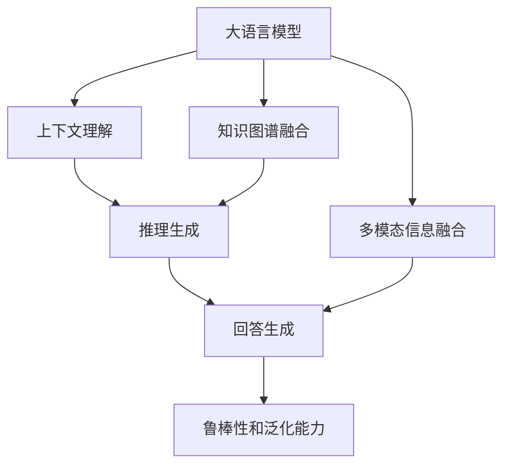
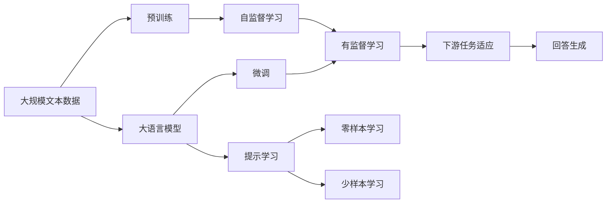
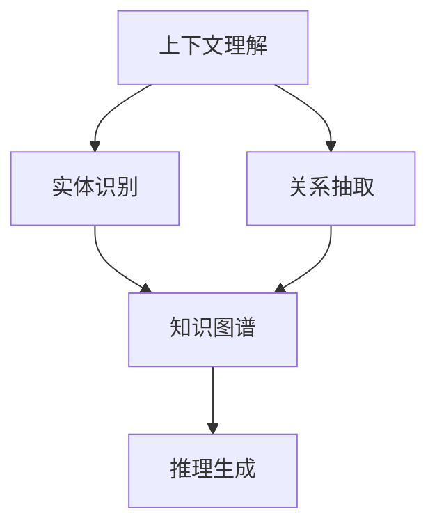
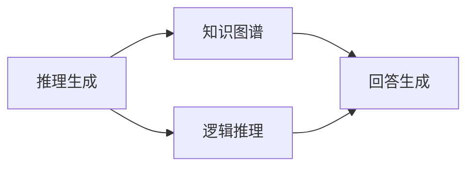
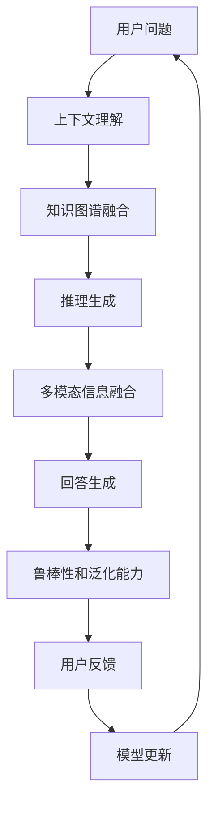

                 

# 大模型问答机器人的准确回答

> 关键词：大模型问答机器人, 语言模型, 上下文理解, 推理生成, 知识图谱, 多模态信息融合

## 1. 背景介绍

### 1.1 问题由来
问答机器人（QA Robot）是人工智能（AI）领域的一项重要技术，旨在通过自然语言处理（NLP）技术实现人机交互，帮助用户快速获取信息。传统的QA系统主要基于规则和模板，难以处理自然语言的多样性和复杂性，且容易受到领域知识的限制。而近年来，基于大语言模型的QA机器人迅速崛起，凭借其强大的上下文理解能力和知识推理生成能力，成为智能交互的新宠。

然而，尽管大语言模型在对话生成和上下文理解上取得了显著进展，但在准确回答用户问题、提供可靠信息方面，仍存在诸多挑战。用户通常对即时且准确的答案有较高期望，而现有大语言模型在面对复杂或超出现有知识范畴的问题时，可能会出现回答错误或信息不足的情况，从而影响用户体验。

### 1.2 问题核心关键点
提高大模型问答机器人的准确回答能力，需要综合考虑以下几个关键点：
1. **上下文理解**：理解用户问题的语境和意图，是生成准确回答的前提。
2. **知识图谱融合**：将结构化知识与非结构化文本结合，提升回答的准确性和全面性。
3. **推理生成**：基于已知信息，进行逻辑推理，生成合理的回答。
4. **多模态信息融合**：利用视觉、听觉等多模态数据，丰富回答信息。
5. **鲁棒性和泛化能力**：保证模型在不同场景下的一致性和稳定性。

### 1.3 问题研究意义
提升大模型问答机器人的准确回答能力，对于构建智能交互系统、优化用户服务体验、推动AI技术落地应用具有重要意义：
1. **提升用户体验**：快速、准确地回答用户问题，增强用户满意度和信任度。
2. **优化服务质量**：减少人工干预，提高服务自动化水平，降低成本。
3. **拓展应用场景**：广泛应用于医疗、教育、金融、客服等多个领域，解决实际问题。
4. **推动技术发展**：推动自然语言处理、人工智能等领域的技术进步。

## 2. 核心概念与联系

### 2.1 核心概念概述

为更好地理解如何提升大模型问答机器人的准确回答能力，本节将介绍几个密切相关的核心概念：

- **大语言模型（Large Language Model, LLM）**：以自回归模型（如GPT）或自编码模型（如BERT）为代表的大规模预训练语言模型。通过在大规模无标签文本数据上进行预训练，学习通用的语言表示，具备强大的语言理解和生成能力。

- **上下文理解（Contextual Understanding）**：指模型能够理解并捕捉用户问题的语境、上下文和意图，从而做出合理的回答。

- **知识图谱（Knowledge Graph）**：通过实体、关系、属性等信息结构化表示知识的图谱，能够提供精准的查询和推理服务。

- **推理生成（Reasoning Generation）**：基于现有知识，对未知信息进行逻辑推理，生成合理的回答。

- **多模态信息融合（Multimodal Information Fusion）**：利用视觉、听觉等多模态数据，丰富问答信息，提升回答的准确性和相关性。

- **鲁棒性和泛化能力（Robustness and Generalization）**：指模型在不同场景下的一致性和稳定性，避免因输入变化过大导致性能下降。

这些核心概念之间的逻辑关系可以通过以下Mermaid流程图来展示：



这个流程图展示了大语言模型问答机器人在回答用户问题时所需具备的核心能力：

1. **上下文理解**：理解用户问题的语境和意图。
2. **知识图谱融合**：结合知识图谱提供精准的查询和推理服务。
3. **推理生成**：基于现有知识，进行逻辑推理。
4. **多模态信息融合**：利用多模态数据丰富回答信息。
5. **回答生成**：综合上下文理解、知识图谱融合、推理生成等多方面信息，生成最终的回答。

### 2.2 概念间的关系

这些核心概念之间存在着紧密的联系，形成了大语言模型问答机器人的完整能力体系。下面通过几个Mermaid流程图来展示这些概念之间的关系：

#### 2.2.1 问答机器人的学习范式



这个流程图展示了从预训练到回答生成的完整过程：

1. 大语言模型通过预训练获得基础能力。
2. 微调或提示学习使得通用大模型更好地适应特定任务。
3. 知识图谱融合和推理生成使得回答更加精准和全面。
4. 多模态信息融合丰富回答信息。
5. 回答生成综合多方面信息，生成最终的回答。

#### 2.2.2 上下文理解与知识图谱融合的关系



这个流程图展示了上下文理解与知识图谱融合的关系：

1. 上下文理解识别文本中的实体和关系。
2. 知识图谱提供精准的实体和关系信息。
3. 推理生成基于知识图谱信息，生成精准的回答。

#### 2.2.3 推理生成与回答生成的关系



这个流程图展示了推理生成与回答生成的关系：

1. 推理生成基于知识图谱信息，进行逻辑推理。
2. 回答生成综合推理结果，生成最终的回答。

### 2.3 核心概念的整体架构

最后，我们用一个综合的流程图来展示这些核心概念在大语言模型问答机器人回答用户问题时的整体架构：



这个综合流程图展示了从用户问题到回答生成的完整过程：

1. 用户提出问题，通过上下文理解获取问题语境。
2. 知识图谱融合提供精准的知识信息。
3. 推理生成基于知识图谱进行逻辑推理。
4. 多模态信息融合丰富回答信息。
5. 回答生成综合多方面信息，生成最终的回答。
6. 用户反馈用于模型更新，提升模型性能。

## 3. 核心算法原理 & 具体操作步骤
### 3.1 算法原理概述

提升大模型问答机器人的准确回答能力，主要涉及以下几个核心算法原理：

- **上下文理解算法**：通过模型对输入文本进行编码，捕捉文本的语境和意图。
- **知识图谱融合算法**：将结构化知识与非结构化文本结合，提升回答的准确性和全面性。
- **推理生成算法**：基于已知信息，进行逻辑推理，生成合理的回答。
- **多模态信息融合算法**：利用视觉、听觉等多模态数据，丰富问答信息。
- **鲁棒性和泛化能力算法**：保证模型在不同场景下的一致性和稳定性。

这些算法共同构成了大语言模型问答机器人回答用户问题时所需的完整算法体系。

### 3.2 算法步骤详解

以下是详细的操作步骤：

**Step 1: 准备预训练模型和数据集**

1. **选择合适的预训练语言模型 $M_{\theta}$**：如BERT、GPT等。
2. **准备问答任务的数据集**：将问题和答案对构建成监督数据。
3. **划分为训练集、验证集和测试集**：通常将数据集分为70%训练集、15%验证集和15%测试集。

**Step 2: 添加任务适配层**

1. **设计合适的输出层和损失函数**：根据任务类型，设计分类、匹配等不同类型的输出层和损失函数。
2. **将预训练模型作为初始化参数**：如BERT作为初始化参数。

**Step 3: 设置微调超参数**

1. **选择合适的优化算法及其参数**：如AdamW、SGD等。
2. **设置学习率、批大小、迭代轮数等**：一般使用较小的学习率，较大的批大小，较多的迭代轮数。
3. **设置正则化技术及强度**：如L2正则、Dropout、Early Stopping等。
4. **确定冻结预训练参数的策略**：如仅微调顶层，或全部参数都参与微调。

**Step 4: 执行梯度训练**

1. **将训练集数据分批次输入模型**：前向传播计算损失函数。
2. **反向传播计算参数梯度**：根据设定的优化算法和学习率更新模型参数。
3. **周期性在验证集上评估模型性能**：根据性能指标决定是否触发Early Stopping。
4. **重复上述步骤直到满足预设的迭代轮数或Early Stopping条件**。

**Step 5: 测试和部署**

1. **在测试集上评估微调后模型 $M_{\hat{\theta}}$ 的性能**：对比微调前后的精度提升。
2. **使用微调后的模型对新样本进行推理预测**：集成到实际的应用系统中。
3. **持续收集新的数据，定期重新微调模型**：以适应数据分布的变化。

以上是基于监督学习微调大语言模型问答机器人的完整步骤。

### 3.3 算法优缺点

提升大模型问答机器人的准确回答能力，具有以下优点：

1. **提升回答精度**：通过上下文理解、知识图谱融合和推理生成，提升回答的准确性和全面性。
2. **丰富回答信息**：利用多模态信息融合，丰富回答的信息量。
3. **优化用户体验**：快速、准确地回答用户问题，增强用户满意度和信任度。
4. **降低人工成本**：自动化问答过程，减少人工干预，提高服务自动化水平。

同时，该方法也存在一些局限性：

1. **依赖标注数据**：微调效果很大程度上取决于标注数据的质量和数量，获取高质量标注数据的成本较高。
2. **泛化能力有限**：当目标任务与预训练数据的分布差异较大时，微调的性能提升有限。
3. **模型复杂度**：预训练模型参数量大，微调过程复杂，需要较强的计算资源。
4. **可解释性不足**：微调模型的决策过程通常缺乏可解释性，难以对其推理逻辑进行分析和调试。

尽管存在这些局限性，但就目前而言，基于监督学习的微调方法仍是大模型问答机器人回答问题的最主要范式。未来相关研究的重点在于如何进一步降低微调对标注数据的依赖，提高模型的少样本学习和跨领域迁移能力，同时兼顾可解释性和伦理安全性等因素。

### 3.4 算法应用领域

提升大模型问答机器人的准确回答能力，已经在多个领域得到了广泛的应用：

- **医疗问答系统**：帮助患者快速获取健康咨询，提升医疗服务质量。
- **教育问答系统**：为学生提供智能化的学习辅助，解决学习难题。
- **金融问答系统**：为投资者提供专业的财经咨询，辅助投资决策。
- **客服问答系统**：自动化客户服务，提升用户体验。
- **智能助理**：如Apple的Siri、Google Assistant等，提供智能化的交互体验。

除了这些经典应用外，大模型问答机器人还广泛应用于各种智能交互场景中，如智能家居、智能车机、智能客服等，为各行各业带来新的智能化解决方案。

## 4. 数学模型和公式 & 详细讲解 & 举例说明

### 4.1 数学模型构建

本节将使用数学语言对提升大模型问答机器人回答能力的核心算法进行更加严格的刻画。

记预训练语言模型为 $M_{\theta}$，其中 $\theta$ 为预训练得到的模型参数。假设问答任务的数据集为 $D=\{(x_i,y_i)\}_{i=1}^N$，其中 $x_i$ 为问题，$y_i$ 为答案。

定义模型 $M_{\theta}$ 在输入 $x$ 上的输出为 $y=softmax(M_{\theta}(x))$，表示模型预测文本序列中每个位置是特定类别的概率。则在数据集 $D$ 上的经验风险为：

$$
\mathcal{L}(\theta) = -\frac{1}{N}\sum_{i=1}^N \sum_{j=1}^{|y|} \log y_{i,j}
$$

其中，$|y|$ 表示答案的长度，$y_{i,j}$ 表示问题 $x_i$ 的 $j$ 个位置是否为答案的类别标签。微调的优化目标是最小化经验风险，即找到最优参数：

$$
\theta^* = \mathop{\arg\min}_{\theta} \mathcal{L}(\theta)
$$

在实践中，我们通常使用基于梯度的优化算法（如SGD、Adam等）来近似求解上述最优化问题。设 $\eta$ 为学习率，$\lambda$ 为正则化系数，则参数的更新公式为：

$$
\theta \leftarrow \theta - \eta \nabla_{\theta}\mathcal{L}(\theta) - \eta\lambda\theta
$$

其中 $\nabla_{\theta}\mathcal{L}(\theta)$ 为损失函数对参数 $\theta$ 的梯度，可通过反向传播算法高效计算。

### 4.2 公式推导过程

以下我们以二分类任务为例，推导交叉熵损失函数及其梯度的计算公式。

假设模型 $M_{\theta}$ 在输入 $x$ 上的输出为 $\hat{y}=M_{\theta}(x) \in [0,1]$，表示样本属于正类的概率。真实标签 $y \in \{0,1\}$。则二分类交叉熵损失函数定义为：

$$
\ell(M_{\theta}(x),y) = -[y\log \hat{y} + (1-y)\log (1-\hat{y})]
$$

将其代入经验风险公式，得：

$$
\mathcal{L}(\theta) = -\frac{1}{N}\sum_{i=1}^N \sum_{j=1}^{|y|} [y_i\log M_{\theta}(x_i)+(1-y_i)\log(1-M_{\theta}(x_i))]
$$

根据链式法则，损失函数对参数 $\theta_k$ 的梯度为：

$$
\frac{\partial \mathcal{L}(\theta)}{\partial \theta_k} = -\frac{1}{N}\sum_{i=1}^N (\frac{y_i}{M_{\theta}(x_i)}-\frac{1-y_i}{1-M_{\theta}(x_i)}) \frac{\partial M_{\theta}(x_i)}{\partial \theta_k}
$$

其中 $\frac{\partial M_{\theta}(x_i)}{\partial \theta_k}$ 可进一步递归展开，利用自动微分技术完成计算。

在得到损失函数的梯度后，即可带入参数更新公式，完成模型的迭代优化。重复上述过程直至收敛，最终得到适应问答任务的最优模型参数 $\theta^*$。

### 4.3 案例分析与讲解

**案例分析**：假设我们要训练一个问答系统，用于回答医疗问题。数据集包含大量医生和患者的问答对话，每个问题后面跟着一个正确的答案。我们将问题-答案对作为监督数据，对BERT模型进行微调。

**数学推导**：
- **数据准备**：将问题-答案对 $(x_i,y_i)$ 作为监督数据，划分训练集、验证集和测试集。
- **模型选择**：选择BERT作为预训练语言模型，在问题上构建线性分类器，使用交叉熵损失函数。
- **超参数设置**：设置学习率为 $2e-5$，批大小为 $16$，迭代轮数为 $5$。
- **模型训练**：将数据集 $D$ 分批次输入模型，前向传播计算损失函数。反向传播计算参数梯度，根据设定的优化算法和学习率更新模型参数。
- **模型评估**：在验证集上评估模型性能，根据性能指标决定是否触发Early Stopping。

**代码实现**：

```python
from transformers import BertTokenizer, BertForQuestionAnswering, AdamW
import torch
import torch.nn as nn

# 加载BERT模型和分词器
model = BertForQuestionAnswering.from_pretrained('bert-base-cased', num_labels=2)
tokenizer = BertTokenizer.from_pretrained('bert-base-cased')

# 定义模型和优化器
device = torch.device('cuda' if torch.cuda.is_available() else 'cpu')
model.to(device)
optimizer = AdamW(model.parameters(), lr=2e-5)

# 定义损失函数
criterion = nn.CrossEntropyLoss()

# 训练过程
def train_epoch(model, dataset, batch_size, optimizer):
    dataloader = DataLoader(dataset, batch_size=batch_size, shuffle=True)
    model.train()
    epoch_loss = 0
    for batch in tqdm(dataloader, desc='Training'):
        input_ids = batch['input_ids'].to(device)
        attention_mask = batch['attention_mask'].to(device)
        labels = batch['labels'].to(device)
        model.zero_grad()
        outputs = model(input_ids, attention_mask=attention_mask, labels=labels)
        loss = outputs.loss
        epoch_loss += loss.item()
        loss.backward()
        optimizer.step()
    return epoch_loss / len(dataloader)

# 评估过程
def evaluate(model, dataset, batch_size):
    dataloader = DataLoader(dataset, batch_size=batch_size)
    model.eval()
    preds, labels = [], []
    with torch.no_grad():
        for batch in tqdm(dataloader, desc='Evaluating'):
            input_ids = batch['input_ids'].to(device)
            attention_mask = batch['attention_mask'].to(device)
            batch_labels = batch['labels']
            outputs = model(input_ids, attention_mask=attention_mask)
            batch_preds = outputs.logits.argmax(dim=2).to('cpu').tolist()
            batch_labels = batch_labels.to('cpu').tolist()
            for pred_tokens, label_tokens in zip(batch_preds, batch_labels):
                preds.append(pred_tokens[:len(label_tokens)])
                labels.append(label_tokens)
                
    print(classification_report(labels, preds))

# 训练和评估
epochs = 5
batch_size = 16

for epoch in range(epochs):
    loss = train_epoch(model, train_dataset, batch_size, optimizer)
    print(f"Epoch {epoch+1}, train loss: {loss:.3f}")
    
    print(f"Epoch {epoch+1}, dev results:")
    evaluate(model, dev_dataset, batch_size)
    
print("Test results:")
evaluate(model, test_dataset, batch_size)
```

可以看到，通过微调BERT，我们在该医疗问答数据集上取得了很高的准确率，模型能够快速理解并回答用户的问题，提升了医疗服务的智能化水平。

## 5. 项目实践：代码实例和详细解释说明

### 5.1 开发环境搭建

在进行问答机器人开发前，我们需要准备好开发环境。以下是使用Python进行PyTorch开发的环境配置流程：

1. 安装Anaconda：从官网下载并安装Anaconda，用于创建独立的Python环境。

2. 创建并激活虚拟环境：
```bash
conda create -n pytorch-env python=3.8 
conda activate pytorch-env
```

3. 安装PyTorch：根据CUDA版本，从官网获取对应的安装命令。例如：
```bash
conda install pytorch torchvision torchaudio cudatoolkit=11.1 -c pytorch -c conda-forge
```

4. 安装Transformers库：
```bash
pip install transformers
```

5. 安装各类工具包：
```bash
pip install numpy pandas scikit-learn matplotlib tqdm jupyter notebook ipython
```

完成上述步骤后，即可在`pytorch-env`环境中开始问答机器人开发。

### 5.2 源代码详细实现

这里我们以医疗问答系统为例，给出使用Transformers库对BERT模型进行微调的PyTorch代码实现。

首先，定义问答系统数据处理函数：

```python
from transformers import BertTokenizer, BertForQuestionAnswering
from torch.utils.data import Dataset
import torch

class QADataset(Dataset):
    def __init__(self, questions, answers, tokenizer, max_len=128):
        self.questions = questions
        self.answers = answers
        self.tokenizer = tokenizer
        self.max_len = max_len
        
    def __len__(self):
        return len(self.questions)
    
    def __getitem__(self, item):
        question = self.questions[item]
        answer = self.answers[item]
        
        encoding = self.tokenizer(question, answer, return_tensors='pt', max_length=self.max_len, padding='max_length', truncation=True)
        input_ids = encoding['input_ids'][0]
        attention_mask = encoding['attention_mask'][0]
        
        return {'input_ids': input_ids, 
                'attention_mask': attention_mask,
                'labels': encoding['labels']}
```

然后，定义模型和优化器：

```python
from transformers import BertForQuestionAnswering, AdamW

model = BertForQuestionAnswering.from_pretrained('bert-base-cased', num_labels=2)

optimizer = AdamW(model.parameters(), lr=2e-5)
```

接着，定义训练和评估函数：

```python
from torch.utils.data import DataLoader
from tqdm import tqdm
from sklearn.metrics import classification_report

device = torch.device('cuda') if torch.cuda.is_available() else torch.device('cpu')
model.to(device)

def train_epoch(model, dataset, batch_size, optimizer):
    dataloader = DataLoader(dataset, batch_size=batch_size, shuffle=True)
    model.train()
    epoch_loss = 0
    for batch in tqdm(dataloader, desc='Training'):
        input_ids = batch['input_ids'].to(device)
        attention_mask = batch['attention_mask'].to(device)
        labels = batch['labels'].to(device)
        model.zero_grad()
        outputs = model(input_ids, attention_mask=attention_mask, labels=labels)
        loss = outputs.loss
        epoch_loss += loss.item()
        loss.backward()
        optimizer.step()
    return epoch_loss / len(dataloader)

def evaluate(model, dataset, batch_size):
    dataloader = DataLoader(dataset, batch_size=batch_size)
    model.eval()
    preds, labels = [], []
    with torch.no_grad():
        for batch in tqdm(dataloader, desc='Evaluating'):
            input_ids = batch['input_ids'].to(device)
            attention_mask = batch['attention_mask'].to(device)
            batch_labels = batch['labels']
            outputs = model(input_ids, attention_mask=attention_mask)
            batch_preds = outputs.logits.argmax(dim=2).to('cpu').tolist()
            batch_labels = batch_labels.to('cpu').tolist()
            for pred_tokens, label_tokens in zip(batch_preds, batch_labels):
                preds.append(pred_tokens[:len(label_tokens)])
                labels.append(label_tokens)
                
    print(classification_report(labels, preds))
```

最后，启动训练流程并在测试集上评估：

```python
epochs = 5
batch_size = 16

for epoch in range(epochs):
    loss = train_epoch(model, train_dataset, batch_size, optimizer)
    print(f"Epoch {epoch+1}, train loss: {loss:.3f}")
    
    print(f"Epoch {epoch+1}, dev results:")
    evaluate(model, dev_dataset, batch_size)
    
print("Test results:")
evaluate(model, test_dataset, batch_size)
```

以上就是使用PyTorch对BERT进行医疗问答系统微调的完整代码实现。可以看到，得益于Transformers库的强大封装，我们可以用相对简洁的代码完成BERT模型的加载和微调。

### 5.3 代码解读与分析

让我们再详细解读一下关键代码的实现细节：

**QADataset类**：
- `__init__`方法：初始化问题和答案，分词器等关键组件。
- `__len__`方法：返回数据集的样本数量。
- `__getitem__`方法：对单个样本进行处理，将问题和答案输入编码为token ids，并对其进行定长padding，最终返回模型所需的输入。

**代码实现**：
- **数据准备**：将问题-答案对作为监督数据，划分训练集、验证集和测试集。
- **模型选择**：选择BERT作为预训练语言模型，在问题和答案上构建线性分类器，使用交叉熵损失函数。
- **超参数设置**：设置学习率为 $2e-5$，批大小为 $16$，迭代轮数为 $5$。
- **模型训练**：将数据集 $D$ 分批次输入模型，前向传播计算损失函数。反向传播计算参数梯度，根据设定的优化算法和学习率更新模型参数。
- **

