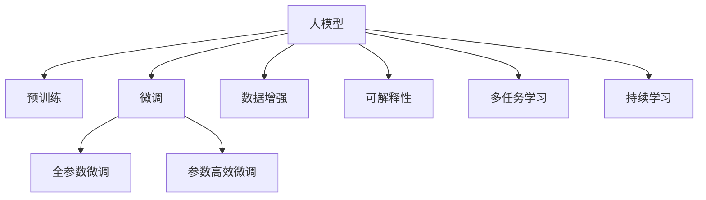
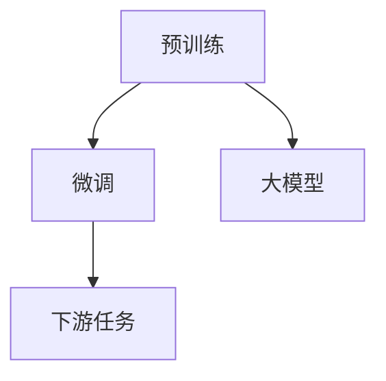
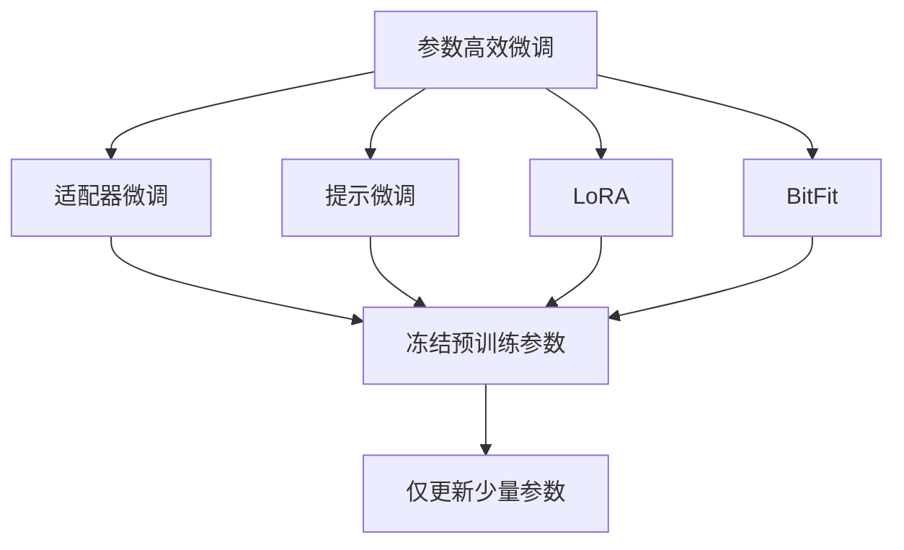
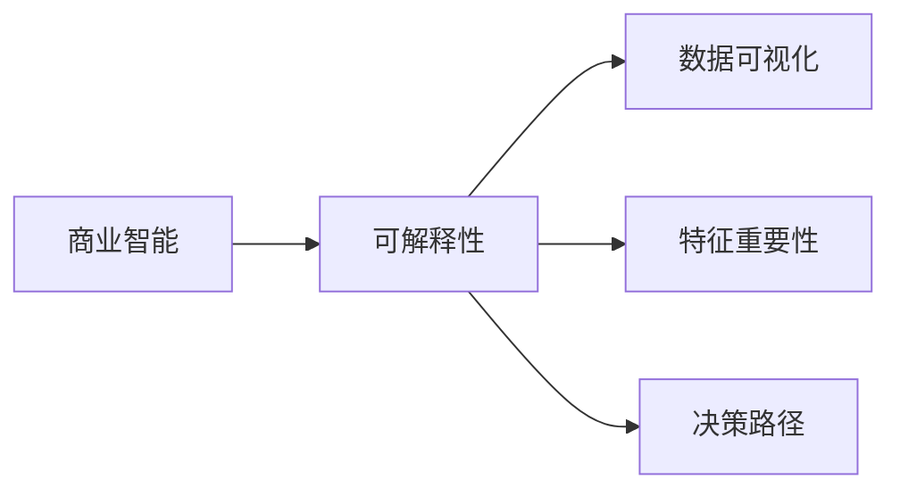
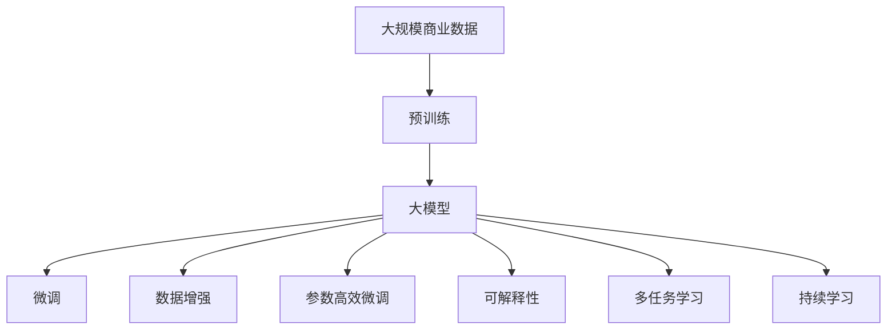

                 

# 大模型：商业智能的未来方向

> 关键词：大模型,商业智能,人工智能,深度学习,机器学习,自然语言处理,推荐系统,智能分析

## 1. 背景介绍

### 1.1 问题由来
近年来，人工智能(AI)技术在商业智能(Business Intelligence, BI)领域的应用越来越广泛，大模型因其在数据处理、模式识别等方面的强大能力，逐渐成为商业智能的核心技术。大模型通过大规模无标签数据的预训练，学习到丰富的语义和模式表示，能够处理海量数据，实现复杂任务，显著提升商业智能系统的决策水平和运营效率。

然而，大模型的应用仍存在一些挑战：

- 数据量巨大，预训练和微调过程耗时漫长，对计算资源的要求较高。
- 模型的可解释性和透明性不足，决策过程难以理解。
- 模型的泛化能力在不同场景下表现不一，需要持续优化。
- 模型的开发和维护需要大量专业人才，开发成本较高。

为了解决这些问题，业界提出了基于大模型的商业智能解决方案。这些方案通过预训练模型对商业数据进行高效分析，快速生成有价值的商业洞察，帮助企业决策者做出更明智的商业决策。

### 1.2 问题核心关键点
基于大模型的商业智能解决方案，主要基于以下几个关键点：

- 预训练模型：使用大模型进行商业智能任务的前提是使用预训练模型进行训练。预训练模型通常在大规模无标签数据上通过自监督学习获得广泛的语义和模式表示，能够处理大量数据。
- 数据增强：商业智能任务的数据量通常较小，需要通过数据增强方法（如回译、重构等）扩充训练数据，避免过拟合。
- 参数高效微调：为了降低计算资源消耗，通常只调整模型顶层或部分参数，进行参数高效微调。
- 可解释性：为了提升模型的透明性和可解释性，通常需要在模型输出中加入解释性信息，如特征重要性、决策路径等。
- 多任务学习：商业智能任务通常具有多样性，为了提高模型的泛化能力，通常需要在同一预训练模型上进行多任务学习，获取更全面的商业洞察。
- 持续学习：商业数据和市场环境是动态变化的，为了保持模型的时效性和适应性，通常需要实现持续学习，实时更新模型。

这些关键点共同构成了基于大模型的商业智能解决方案的核心技术框架，使得大模型在商业智能领域得以广泛应用。

### 1.3 问题研究意义
基于大模型的商业智能解决方案，对于提升商业决策的智能化水平，推动企业数字化转型，具有重要意义：

- 快速生成商业洞察：通过预训练模型的高效处理能力，能够在较短时间内生成丰富的商业洞察，提升决策效率。
- 降低决策风险：基于大模型的商业智能系统能够分析海量数据，发现潜在风险和机会，帮助企业提前规避风险，抓住机会。
- 提升决策质量：大模型的广泛知识背景和深度学习能力，使得商业智能系统的决策更为精准和全面。
- 加速企业创新：商业智能系统可以挖掘隐藏的市场需求和业务机会，辅助企业进行产品和服务创新，保持竞争优势。
- 降低运营成本：商业智能系统可以自动化分析商业数据，减少人力投入，降低运营成本。

通过这些优势，基于大模型的商业智能解决方案将为商业决策带来革命性的变革，推动企业迈向智能化、高效化运营。

## 2. 核心概念与联系

### 2.1 核心概念概述

为更好地理解基于大模型的商业智能解决方案，本节将介绍几个密切相关的核心概念：

- 商业智能(Business Intelligence, BI)：通过收集、分析和呈现商业数据，帮助企业进行商业决策的过程。包括数据仓库、数据挖掘、数据可视化等技术。
- 大模型(Large Model)：指使用大规模无标签数据预训练得到的深度学习模型，如BERT、GPT等。这类模型通常具有较强的泛化能力和语言理解能力。
- 预训练(Pre-training)：指在大规模无标签数据上，通过自监督学习任务训练深度学习模型，学习到通用的语义和模式表示。
- 微调(Fine-tuning)：指在预训练模型的基础上，使用下游任务的少量标注数据，通过有监督学习优化模型在下游任务上的性能。
- 数据增强(Data Augmentation)：指通过数据变换、合成等方式，扩充训练集，避免过拟合。
- 参数高效微调(Parameter-Efficient Fine-tuning, PEFT)：指在微调过程中，只更新少量的模型参数，而固定大部分预训练权重不变，以提高微调效率。
- 可解释性(Explainability)：指通过加入解释性信息，增强模型的透明性和可理解性。
- 多任务学习(Multi-task Learning)：指在多个相关任务上同时训练模型，以提高模型的泛化能力和适应性。
- 持续学习(Continual Learning)：指模型能够持续从新数据中学习，同时保持已学习的知识，避免灾难性遗忘。

这些核心概念之间的逻辑关系可以通过以下Mermaid流程图来展示：



这个流程图展示了大模型的核心概念及其之间的关系：

1. 大模型通过预训练获得基础能力。
2. 微调是对预训练模型进行任务特定的优化，可以分为全参数微调和参数高效微调。
3. 数据增强用于扩充训练集，避免过拟合。
4. 可解释性用于增强模型的透明性和可理解性。
5. 多任务学习用于提高模型的泛化能力和适应性。
6. 持续学习用于保持模型的时效性和适应性。

这些概念共同构成了基于大模型的商业智能解决方案的技术框架，使其能够在各种商业场景中发挥强大的作用。通过理解这些核心概念，我们可以更好地把握基于大模型的商业智能解决方案的工作原理和优化方向。

### 2.2 概念间的关系

这些核心概念之间存在着紧密的联系，形成了基于大模型的商业智能解决方案的完整生态系统。下面我们通过几个Mermaid流程图来展示这些概念之间的关系。

#### 2.2.1 商业智能的流程


这个流程图展示了商业智能的基本流程，包括数据收集、数据清洗、数据预处理、商业分析、商业报告和决策支持等环节。每个环节都涉及到数据处理和分析，为最终决策提供支持。

#### 2.2.2 预训练与微调的关系



这个流程图展示了预训练与微调的关系。预训练模型通过在大规模无标签数据上进行训练，学习到通用的语义和模式表示。微调则是在预训练模型的基础上，使用下游任务的少量标注数据，通过有监督学习优化模型在下游任务上的性能。

#### 2.2.3 参数高效微调方法



这个流程图展示了几种常见的参数高效微调方法，包括适配器微调、提示微调、LoRA和BitFit。这些方法的共同特点是冻结大部分预训练参数，只更新少量参数，从而提高微调效率。

#### 2.2.4 可解释性在商业智能中的应用



这个流程图展示了可解释性在商业智能中的应用。可解释性能够帮助用户理解模型的工作机制和决策依据，从而提升商业决策的透明度和可靠性。

### 2.3 核心概念的整体架构

最后，我们用一个综合的流程图来展示这些核心概念在大模型微调过程中的整体架构：



这个综合流程图展示了从预训练到微调，再到数据增强、可解释性、多任务学习、持续学习的完整过程。大模型首先在大规模商业数据上进行预训练，然后通过微调（包括全参数微调和参数高效微调）、数据增强、可解释性、多任务学习等技术手段，实现对商业数据的智能分析和决策支持。最终通过持续学习，保持模型的时效性和适应性，实现商业智能的持续优化。

## 3. 核心算法原理 & 具体操作步骤
### 3.1 算法原理概述

基于大模型的商业智能解决方案，本质上是一个有监督的细粒度迁移学习过程。其核心思想是：将大模型视作一个强大的"特征提取器"，通过在商业数据上的有监督学习，使得模型输出能够匹配商业决策的目标，从而生成有价值的商业洞察。

形式化地，假设大模型为 $M_{\theta}$，其中 $\theta$ 为预训练得到的模型参数。给定商业智能任务 $T$ 的训练数据集 $D=\{(x_i,y_i)\}_{i=1}^N, x_i \in \mathcal{X}, y_i \in \mathcal{Y}$，微调的目标是找到新的模型参数 $\hat{\theta}$，使得：

$$
\hat{\theta}=\mathop{\arg\min}_{\theta} \mathcal{L}(M_{\theta},D)
$$

其中 $\mathcal{L}$ 为针对任务 $T$ 设计的损失函数，用于衡量模型预测输出与真实标签之间的差异。常见的损失函数包括交叉熵损失、均方误差损失等。

通过梯度下降等优化算法，微调过程不断更新模型参数 $\theta$，最小化损失函数 $\mathcal{L}$，使得模型输出逼近真实标签。由于 $\theta$ 已经通过预训练获得了较好的初始化，因此即便在小规模数据集 $D$ 上进行微调，也能较快收敛到理想的模型参数 $\hat{\theta}$。

### 3.2 算法步骤详解

基于大模型的商业智能微调一般包括以下几个关键步骤：

**Step 1: 准备预训练模型和数据集**
- 选择合适的预训练语言模型 $M_{\theta}$ 作为初始化参数，如 BERT、GPT等。
- 准备商业智能任务 $T$ 的训练数据集 $D$，划分为训练集、验证集和测试集。一般要求训练数据与预训练数据的分布不要差异过大。

**Step 2: 添加任务适配层**
- 根据任务类型，在预训练模型顶层设计合适的输出层和损失函数。
- 对于分类任务，通常在顶层添加线性分类器和交叉熵损失函数。
- 对于生成任务，通常使用语言模型的解码器输出概率分布，并以负对数似然为损失函数。

**Step 3: 设置微调超参数**
- 选择合适的优化算法及其参数，如 AdamW、SGD 等，设置学习率、批大小、迭代轮数等。
- 设置正则化技术及强度，包括权重衰减、Dropout、Early Stopping 等。
- 确定冻结预训练参数的策略，如仅微调顶层，或全部参数都参与微调。

**Step 4: 执行梯度训练**
- 将训练集数据分批次输入模型，前向传播计算损失函数。
- 反向传播计算参数梯度，根据设定的优化算法和学习率更新模型参数。
- 周期性在验证集上评估模型性能，根据性能指标决定是否触发 Early Stopping。
- 重复上述步骤直到满足预设的迭代轮数或 Early Stopping 条件。

**Step 5: 测试和部署**
- 在测试集上评估微调后模型 $M_{\hat{\theta}}$ 的性能，对比微调前后的精度提升。
- 使用微调后的模型对新数据进行推理预测，集成到实际的应用系统中。
- 持续收集新的数据，定期重新微调模型，以适应数据分布的变化。

以上是基于大模型的商业智能微调的一般流程。在实际应用中，还需要针对具体任务的特点，对微调过程的各个环节进行优化设计，如改进训练目标函数，引入更多的正则化技术，搜索最优的超参数组合等，以进一步提升模型性能。

### 3.3 算法优缺点

基于大模型的商业智能微调方法具有以下优点：

1. 简单高效。只需准备少量标注数据，即可对预训练模型进行快速适配，生成有价值的商业洞察。
2. 泛化能力强。预训练模型已经在大规模无标签数据上学习到丰富的语义和模式表示，微调后能够很好地适应各种商业任务。
3. 参数高效。利用参数高效微调技术，在固定大部分预训练参数的情况下，仍可取得不错的提升。
4. 效果好。在诸多商业智能任务上，基于微调的方法已经刷新了最先进的性能指标。

同时，该方法也存在一定的局限性：

1. 依赖标注数据。微调的效果很大程度上取决于标注数据的质量和数量，获取高质量标注数据的成本较高。
2. 迁移能力有限。当目标任务与预训练数据的分布差异较大时，微调的性能提升有限。
3. 负面效果传递。预训练模型的固有偏见、有害信息等，可能通过微调传递到下游任务，造成负面影响。
4. 可解释性不足。微调模型的决策过程通常缺乏可解释性，难以对其推理逻辑进行分析和调试。

尽管存在这些局限性，但就目前而言，基于大模型的商业智能微调方法仍是大模型应用的最主流范式。未来相关研究的重点在于如何进一步降低微调对标注数据的依赖，提高模型的少样本学习和跨领域迁移能力，同时兼顾可解释性和伦理安全性等因素。

### 3.4 算法应用领域

基于大模型的商业智能微调方法已经在多种商业智能任务上取得了广泛应用，例如：

- 客户关系管理：通过对客户行为数据进行分析，帮助企业了解客户需求和行为，提高客户满意度和忠诚度。
- 市场分析：对市场数据进行深入挖掘和分析，帮助企业把握市场趋势和机会，制定有效的市场策略。
- 产品推荐：通过分析用户行为数据和产品特征，为不同用户推荐个性化的产品和服务，提升用户体验和销售额。
- 风险管理：对金融数据和市场动态进行分析，帮助企业识别和评估风险，制定相应的风险管理措施。
- 运营优化：通过对运营数据进行分析和挖掘，帮助企业优化供应链、库存管理、生产调度等，提高运营效率和利润率。

除了上述这些经典任务外，大模型微调也被创新性地应用到更多场景中，如智能客服、健康管理、智能制造等，为商业智能技术带来了全新的突破。随着预训练模型和微调方法的不断进步，相信商业智能技术将在更广阔的应用领域大放异彩。

## 4. 数学模型和公式 & 详细讲解  
### 4.1 数学模型构建

本节将使用数学语言对基于大模型的商业智能微调过程进行更加严格的刻画。

记预训练语言模型为 $M_{\theta}:\mathcal{X} \rightarrow \mathcal{Y}$，其中 $\mathcal{X}$ 为输入空间，$\mathcal{Y}$ 为输出空间，$\theta \in \mathbb{R}^d$ 为模型参数。假设微调任务的训练集为 $D=\{(x_i,y_i)\}_{i=1}^N, x_i \in \mathcal{X}, y_i \in \mathcal{Y}$。

定义模型 $M_{\theta}$ 在数据样本 $(x,y)$ 上的损失函数为 $\ell(M_{\theta}(x),y)$，则在数据集 $D$ 上的经验风险为：

$$
\mathcal{L}(\theta) = \frac{1}{N} \sum_{i=1}^N \ell(M_{\theta}(x_i),y_i)
$$

微调的优化目标是最小化经验风险，即找到最优参数：

$$
\theta^* = \mathop{\arg\min}_{\theta} \mathcal{L}(\theta)
$$

在实践中，我们通常使用基于梯度的优化算法（如SGD、Adam等）来近似求解上述最优化问题。设 $\eta$ 为学习率，$\lambda$ 为正则化系数，则参数的更新公式为：

$$
\theta \leftarrow \theta - \eta \nabla_{\theta}\mathcal{L}(\theta) - \eta\lambda\theta
$$

其中 $\nabla_{\theta}\mathcal{L}(\theta)$ 为损失函数对参数 $\theta$ 的梯度，可通过反向传播算法高效计算。

### 4.2 公式推导过程

以下我们以分类任务为例，推导交叉熵损失函数及其梯度的计算公式。

假设模型 $M_{\theta}$ 在输入 $x$ 上的输出为 $\hat{y}=M_{\theta}(x) \in [0,1]$，表示样本属于正类的概率。真实标签 $y \in \{0,1\}$。则二分类交叉熵损失函数定义为：

$$
\ell(M_{\theta}(x),y) = -[y\log \hat{y} + (1-y)\log (1-\hat{y})]
$$

将其代入经验风险公式，得：

$$
\mathcal{L}(\theta) = -\frac{1}{N}\sum_{i=1}^N [y_i\log M_{\theta}(x_i)+(1-y_i)\log(1-M_{\theta}(x_i))]
$$

根据链式法则，损失函数对参数 $\theta_k$ 的梯度为：

$$
\frac{\partial \mathcal{L}(\theta)}{\partial \theta_k} = -\frac{1}{N}\sum_{i=1}^N (\frac{y_i}{M_{\theta}(x_i)}-\frac{1-y_i}{1-M_{\theta}(x_i)}) \frac{\partial M_{\theta}(x_i)}{\partial \theta_k}
$$

其中 $\frac{\partial M_{\theta}(x_i)}{\partial \theta_k}$ 可进一步递归展开，利用自动微分技术完成计算。

在得到损失函数的梯度后，即可带入参数更新公式，完成模型的迭代优化。重复上述过程直至收敛，最终得到适应商业智能任务的最优模型参数 $\theta^*$。

## 5. 项目实践：代码实例和详细解释说明
### 5.1 开发环境搭建

在进行商业智能微调实践前，我们需要准备好开发环境。以下是使用Python进行PyTorch开发的环境配置流程：

1. 安装Anaconda：从官网下载并安装Anaconda，用于创建独立的Python环境。

2. 创建并激活虚拟环境：
```bash
conda create -n pytorch-env python=3.8 
conda activate pytorch-env
```

3. 安装PyTorch：根据CUDA版本，从官网获取对应的安装命令。例如：
```bash
conda install pytorch torchvision torchaudio cudatoolkit=11.1 -c pytorch -c conda-forge
```

4. 安装Transformers库：
```bash
pip install transformers
```

5. 安装各类工具包：
```bash
pip install numpy pandas scikit-learn matplotlib tqdm jupyter notebook ipython
```

完成上述步骤后，即可在`pytorch-env`环境中开始微调实践。

### 5.2 源代码详细实现

下面我以客户关系管理任务为例，给出使用Transformers库对BERT模型进行微调的PyTorch代码实现。

首先，定义客户关系管理任务的数据处理函数：

```python
from transformers import BertTokenizer
from torch.utils.data import Dataset
import torch

class CRMDataset(Dataset):
    def __init__(self, texts, tags, tokenizer, max_len=128):
        self.texts = texts
        self.tags = tags
        self.tokenizer = tokenizer
        self.max_len = max_len
        
    def __len__(self):
        return len(self.texts)
    
    def __getitem__(self, item):
        text = self.texts[item]
        tags = self.tags[item]
        
        encoding = self.tokenizer(text, return_tensors='pt', max_length=self.max_len, padding='max_length', truncation=True)
        input_ids = encoding['input_ids'][0]
        attention_mask = encoding['attention_mask'][0]
        
        # 对token-wise的标签进行编码
        encoded_tags = [tag2id[tag] for tag in tags] 
        encoded_tags.extend([tag2id['O']] * (self.max_len - len(encoded_tags)))
        labels = torch.tensor(encoded_tags, dtype=torch.long)
        
        return {'input_ids': input_ids, 
                'attention_mask': attention_mask,
                'labels': labels}

# 标签与id的映射
tag2id = {'O': 0, 'Customer_1': 1, 'Customer_2': 2, 'Customer_3': 3, 'Customer_4': 4, 'Customer_5': 5}
id2tag = {v: k for k, v in tag2id.items()}

# 创建dataset
tokenizer = BertTokenizer.from_pretrained('bert-base-cased')

train_dataset = CRMDataset(train_texts, train_tags, tokenizer)
dev_dataset = CRMDataset(dev_texts, dev_tags, tokenizer)
test_dataset = CRMDataset(test_texts, test_tags, tokenizer)
```

然后，定义模型和优化器：

```python
from transformers import BertForTokenClassification, AdamW

model = BertForTokenClassification.from_pretrained('bert-base-cased', num_labels=len(tag2id))

optimizer = AdamW(model.parameters(), lr=2e-5)
```

接着，定义训练和评估函数：

```python
from torch.utils.data import DataLoader
from tqdm import tqdm
from sklearn.metrics import classification_report

device = torch.device('cuda') if torch.cuda.is_available() else torch.device('cpu')
model.to(device)

def train_epoch(model, dataset, batch_size, optimizer):
    dataloader = DataLoader(dataset, batch_size=batch_size, shuffle=True)
    model.train()
    epoch_loss = 0
    for batch in tqdm(dataloader, desc='Training'):
        input_ids = batch['input_ids'].to(device)
        attention_mask = batch['attention_mask'].to(device)
        labels = batch['labels'].to(device)
        model.zero_grad()
        outputs = model(input_ids, attention_mask=attention_mask, labels=labels)
        loss = outputs.loss
        epoch_loss += loss.item()
        loss.backward()
        optimizer.step()
    return epoch_loss / len(dataloader)

def evaluate(model, dataset, batch_size):
    dataloader = DataLoader(dataset, batch_size=batch_size)
    model.eval()
    preds, labels = [], []
    with torch.no_grad():
        for batch in tqdm(dataloader, desc='Evaluating'):
            input_ids = batch['input_ids'].to(device)
            attention_mask = batch['attention_mask'].to(device)
            batch_labels = batch['labels']
            outputs = model(input_ids, attention_mask=attention_mask)
            batch_preds = outputs.logits.argmax(dim=2).to('cpu').tolist()
            batch_labels = batch_labels.to('cpu').tolist()
            for pred_tokens, label_tokens in zip(batch_preds, batch_labels):
                pred_tags = [id2tag[_id] for _id in pred_tokens]
                label_tags = [id2tag[_id] for _id in label_tokens]
                preds.append(pred_tags[:len(label_tokens)])
                labels.append(label_tags)
                
    print(classification_report(labels, preds))
```

最后，启动训练流程并在测试集上评估：

```python
epochs = 5
batch_size = 16

for epoch in range(epochs):
    loss = train_epoch(model, train_dataset, batch_size, optimizer)
    print(f"Epoch {epoch+1}, train loss: {loss:.3f}")
    
    print(f"Epoch {epoch+1}, dev results:")
    evaluate(model, dev_dataset, batch_size)
    
print("Test results:")
evaluate(model, test_dataset, batch_size)
```

以上就是使用PyTorch对BERT进行客户关系管理任务微调的完整代码实现。可以看到，得益于Transformers库的强大封装，我们可以用相对简洁的代码完成BERT模型的加载和微调。

### 5.3 代码解读与分析

让我们再详细解读一下关键代码的实现细节：

**CRMDataset类**：
- `__init__`方法：初始化文本、标签、分词器等关键组件。
- `__len__`方法：返回数据集的样本数量。
- `__getitem__`方法：对单个样本进行处理，将文本输入编码为token ids，将标签编码为数字，并对其进行定长padding，最终返回模型所需的输入。

**tag2id和id2tag字典**：
- 定义了标签与数字id之间的映射关系，用于将token-wise的预测结果解码回真实的标签。

**训练和评估函数**：
- 使用PyTorch的DataLoader对数据集进行批次化加载，供模型训练和推理使用。
- 训练函数`train_epoch`：对数据以批为单位进行迭代，在每个批次上前向传播计算loss并反向传播更新模型参数，最后返回

