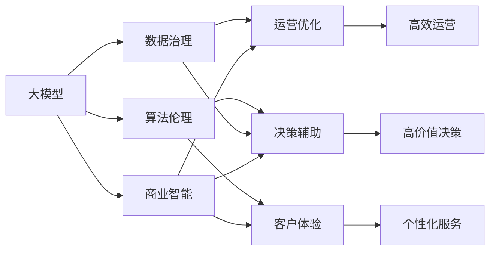
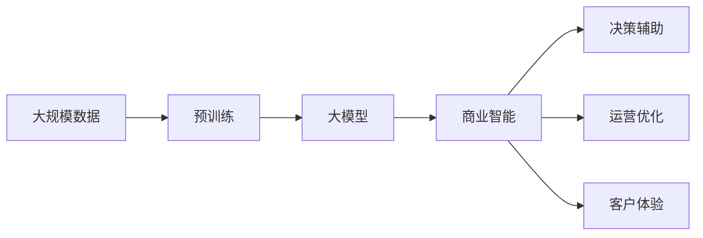
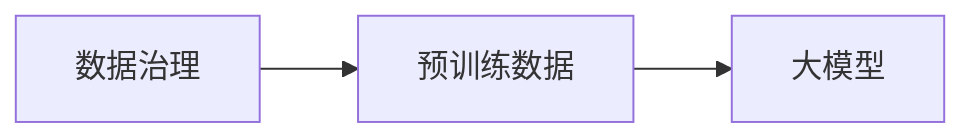
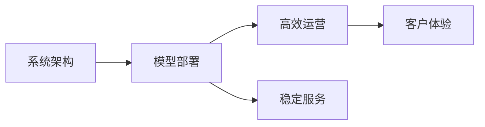
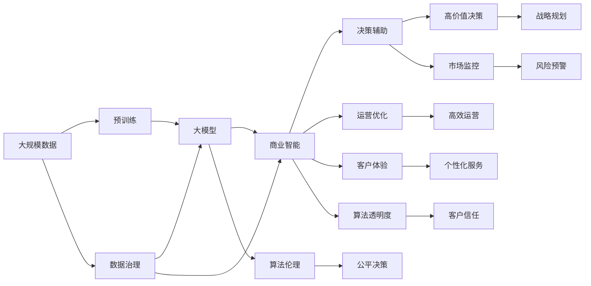

                 

# 大模型：智能时代的商业新生态

> 关键词：大模型,智能生态,商业创新,人工智能,企业智能化

## 1. 背景介绍

### 1.1 问题由来
在数字化时代，企业的商业环境正在经历前所未有的变化。伴随互联网、大数据、云计算等新兴技术的普及，商业生态系统的复杂性和不确定性不断增加，如何高效地整合资源、优化运营、提升竞争力，成为现代企业面临的重大挑战。

人工智能（AI）作为新一代的智能化技术，正在从根本上重塑商业生态系统。无论是传统制造业还是新兴互联网行业，人工智能都在帮助企业提高决策效率、优化运营流程、降低成本、提升用户体验。特别是在深度学习和大数据技术的推动下，人工智能进入了一个全新的发展阶段——大模型时代。

大模型是指以深度神经网络为核心的超大规模模型，通过大量无标签数据进行预训练，具备强大的泛化能力和推理能力。相较于传统的机器学习模型，大模型能够捕捉更为复杂和抽象的特征，更适应非结构化数据的处理。

当前，大模型已经在自然语言处理、图像识别、语音识别等领域展示了令人惊叹的能力，正在全面渗透到各行各业，为企业的商业智能化转型带来了新的机遇与挑战。

### 1.2 问题核心关键点
大模型技术在商业生态中的应用，核心在于如何有效整合企业的海量数据资源，提升企业的决策和运营能力。具体来说，可以总结为以下几点：

- **数据驱动决策**：通过分析企业内外部数据，利用大模型挖掘潜在模式和规律，帮助管理层做出更为精准的决策。
- **业务流程优化**：利用大模型预测客户行为、优化供应链管理、自动化客服等，提升运营效率。
- **产品与服务创新**：通过大模型进行智能推荐、个性化营销、内容生成等，满足用户多样化需求，提升产品竞争力。
- **风险管理**：利用大模型进行风险预测、欺诈检测、市场监控等，保障企业运营稳定。

在实际应用中，大模型技术还涉及到数据治理、算法伦理、系统架构等多个方面，企业需要综合考虑各方面因素，制定科学合理的AI策略，才能最大化地发挥其商业价值。

### 1.3 问题研究意义
大模型技术在商业生态中的应用，具有重要意义：

1. **提升决策效率**：大模型能够处理海量数据，挖掘隐藏的关联和趋势，辅助企业快速做出战略决策。
2. **优化运营流程**：通过自动化的数据分析和预测，提高企业运营效率，降低成本。
3. **增强客户体验**：利用个性化推荐和智能客服等技术，提升客户满意度，增强品牌忠诚度。
4. **推动业务创新**：大模型技术可以应用于新产品开发、市场开拓等领域，带来新的商业机会。
5. **降低风险**：通过预测和监控，大模型可以有效预防和应对各种商业风险。

大模型技术的应用，不仅有助于企业自身的发展，还将推动整个商业生态的智能化转型，创造新的价值和机会。

## 2. 核心概念与联系

### 2.1 核心概念概述

为更好地理解大模型在商业生态中的应用，本节将介绍几个关键概念：

- **大模型**：以深度神经网络为核心的超大规模模型，通过在大规模无标签数据上预训练，具备强大的泛化能力和推理能力。
- **商业智能**：利用数据、模型和算法，辅助企业管理层做出科学的决策，优化运营流程，提升客户体验。
- **数据治理**：包括数据收集、清洗、存储、共享等多个环节，确保数据的质量和安全性。
- **算法伦理**：确保算法决策的透明性和公平性，避免偏见和歧视，保护用户隐私。
- **系统架构**：设计科学的系统架构，确保大模型在实际应用中的高效、稳定和安全。

这些核心概念之间的联系可以通过以下Mermaid流程图来展示：



这个流程图展示了大模型在商业生态中的应用路径：

1. 大模型通过预训练学习到丰富的知识，辅助商业智能系统进行决策辅助、运营优化和客户体验提升。
2. 数据治理是商业智能的基础，通过确保数据质量和安全，支持大模型的训练和推理。
3. 算法伦理确保商业智能系统的公平性和透明度，保护用户隐私。
4. 系统架构设计决定了商业智能系统的高效性、稳定性和安全性。

通过这些核心概念的串联，我们可以更全面地理解大模型在商业生态中的应用。

### 2.2 概念间的关系

这些核心概念之间存在着紧密的联系，构成了大模型在商业生态应用的完整生态系统。下面我们通过几个Mermaid流程图来展示这些概念之间的关系。

#### 2.2.1 大模型的学习范式



这个流程图展示了大模型的学习范式：

1. 大模型通过在大规模无标签数据上进行预训练，学习到丰富的知识。
2. 预训练后的模型作为核心组件，被商业智能系统利用，辅助决策、优化运营和提升客户体验。

#### 2.2.2 数据治理与大模型的关系



这个流程图展示了数据治理在大模型学习中的重要性：

1. 数据治理确保预训练数据的质量和多样性，直接影响大模型的学习效果。
2. 通过数据治理，大模型能够更好地从数据中学习到有意义的规律和模式。

#### 2.2.3 算法伦理与大模型的关系


这个流程图展示了算法伦理在大模型应用中的作用：

1. 算法伦理确保大模型在商业决策中的透明性和公平性。
2. 通过算法伦理的约束，大模型能够更好地服务于客户，避免歧视和偏见。

#### 2.2.4 系统架构与大模型的关系



这个流程图展示了系统架构在大模型应用中的重要性：

1. 系统架构决定了大模型的部署效率和性能。
2. 高效稳定的系统架构，可以确保大模型在商业智能系统中发挥最大效能，提升客户体验。

### 2.3 核心概念的整体架构

最后，我们用一个综合的流程图来展示这些核心概念在大模型商业应用中的整体架构：



这个综合流程图展示了从数据治理到模型部署，再到商业智能系统的完整过程。大模型通过预训练学习丰富的知识，辅助决策、优化运营和提升客户体验。同时，通过数据治理和算法伦理的约束，确保系统的公平性和透明度，最终实现高效、稳定、可信赖的商业智能应用。

## 3. 核心算法原理 & 具体操作步骤
### 3.1 算法原理概述

大模型在商业生态中的应用，本质上是利用深度学习模型进行数据驱动决策的过程。其核心思想是：将大规模数据作为训练样本，利用大模型学习出数据中的规律和模式，辅助企业管理层做出科学的决策。

具体来说，大模型的商业应用可以分为以下几个步骤：

1. **数据预处理**：清洗、整理、标注企业内外部的数据，为模型的训练提供高质量的输入。
2. **模型训练**：利用大模型对清洗后的数据进行预训练，学习到通用的语言、图像、声音等特征表示。
3. **商业智能应用**：将预训练后的模型应用于具体的商业决策、运营优化和客户体验提升场景中。

### 3.2 算法步骤详解

基于大模型的商业应用一般包括以下几个关键步骤：

**Step 1: 数据准备与预处理**
- 收集企业内外部的数据，包括业务数据、客户数据、市场数据等。
- 对数据进行清洗、标注和处理，生成训练集、验证集和测试集。
- 对数据进行特征工程，提取有用的特征向量，供模型学习。

**Step 2: 模型训练**
- 选择合适的深度学习框架（如TensorFlow、PyTorch）和大模型结构。
- 设计合适的损失函数和优化器，对模型进行训练。
- 在训练过程中应用正则化、Dropout等技术，避免过拟合。
- 通过验证集评估模型效果，调整训练参数。

**Step 3: 模型部署与应用**
- 将训练好的模型部署到生产环境，确保系统高效稳定。
- 将模型集成到商业智能系统中，辅助决策、优化运营和提升客户体验。
- 利用模型进行实时预测、监控和分析，提升业务效率和响应速度。

**Step 4: 模型监控与优化**
- 实时监控模型的性能和稳定性，收集运行日志。
- 利用监控结果，优化模型参数和算法。
- 定期更新模型，确保其适应新的数据和业务需求。

### 3.3 算法优缺点

基于大模型的商业应用具有以下优点：

1. **强大的泛化能力**：大模型能够从大规模数据中学习到丰富的知识，适用于各种复杂场景。
2. **自动化决策**：通过自动化决策辅助系统，提升决策效率和准确性。
3. **实时响应**：利用大模型进行实时预测和监控，及时响应业务变化。
4. **高可扩展性**：大模型可以部署在云平台或分布式系统中，具有高度的可扩展性。

同时，也存在一些缺点：

1. **资源消耗大**：大模型需要大量计算资源和存储空间，对硬件要求较高。
2. **训练时间长**：在大规模数据上进行预训练，训练时间较长。
3. **算法复杂**：深度学习模型的训练和优化过程较为复杂，需要丰富的经验。
4. **解释性不足**：大模型的决策过程缺乏可解释性，难以解释模型的内部机制。

### 3.4 算法应用领域

大模型技术已经在多个领域展示了其强大的应用潜力：

- **金融行业**：利用大模型进行风险预测、欺诈检测、市场监控等，帮助金融机构降低风险，提升运营效率。
- **医疗行业**：通过大模型进行疾病预测、药物推荐、影像诊断等，提升医疗服务的质量和效率。
- **零售行业**：利用大模型进行客户行为分析、个性化推荐、库存管理等，提升客户满意度和运营效率。
- **制造行业**：通过大模型进行生产预测、质量检测、设备维护等，提升生产效率和产品质量。
- **交通行业**：利用大模型进行交通流量预测、事故预防、路径规划等，提升交通管理水平。

随着大模型技术的不断进步，其在更多领域的应用前景将更加广阔。

## 4. 数学模型和公式 & 详细讲解 & 举例说明

### 4.1 数学模型构建

在商业智能系统中，大模型通常用于解决回归、分类、序列预测等常见问题。以下以回归问题为例，构建大模型的数学模型。

设输入为 $x=(x_1, x_2, ..., x_n)$，输出为 $y$，大模型的输出为 $\hat{y}=f(x;\theta)$，其中 $\theta$ 为模型的参数。回归问题通常采用均方误差作为损失函数，定义为：

$$
L(y, \hat{y}) = \frac{1}{N} \sum_{i=1}^N (y_i - \hat{y}_i)^2
$$

### 4.2 公式推导过程

在回归问题中，大模型的参数优化目标是最小化均方误差：

$$
\min_{\theta} \sum_{i=1}^N (y_i - \hat{y}_i)^2
$$

通过梯度下降等优化算法，最小化损失函数，更新模型参数：

$$
\theta \leftarrow \theta - \eta \nabla_{\theta}L(y, \hat{y})
$$

其中 $\eta$ 为学习率，$\nabla_{\theta}L(y, \hat{y})$ 为损失函数对参数 $\theta$ 的梯度。

### 4.3 案例分析与讲解

以金融风险预测为例，利用大模型进行信用评分和违约预测。假设输入特征包括用户的历史消费、收入、信用记录等，输出为二元标签（违约/非违约）。

首先，收集历史用户数据，分为训练集和测试集。然后，利用大模型（如DNN、CNN、Transformer等）对特征进行编码，学习出特征表示。

接着，设计损失函数（如交叉熵损失、均方误差损失等）和优化器（如Adam、SGD等），对模型进行训练和优化。训练过程中，可以通过验证集评估模型性能，调整训练参数。

最后，将训练好的模型部署到生产环境，对新用户数据进行预测，并根据预测结果进行风险管理。例如，利用信用评分模型评估用户的信用风险，决定是否批准贷款申请；利用违约预测模型识别潜在违约客户，提前采取风险控制措施。

通过这种流程，大模型在金融行业中的应用可以显著提升风险管理的效率和准确性，帮助金融机构降低损失，提升客户满意度。

## 5. 项目实践：代码实例和详细解释说明

### 5.1 开发环境搭建

在进行商业智能系统的开发前，需要先搭建好开发环境。以下是使用Python进行TensorFlow开发的环境配置流程：

1. 安装Anaconda：从官网下载并安装Anaconda，用于创建独立的Python环境。

2. 创建并激活虚拟环境：
```bash
conda create -n tf-env python=3.8 
conda activate tf-env
```

3. 安装TensorFlow：根据CUDA版本，从官网获取对应的安装命令。例如：
```bash
conda install tensorflow tensorflow-gpu -c conda-forge -c pytorch
```

4. 安装TensorBoard：
```bash
pip install tensorboard
```

5. 安装各类工具包：
```bash
pip install numpy pandas scikit-learn matplotlib tqdm jupyter notebook ipython
```

完成上述步骤后，即可在`tf-env`环境中开始商业智能系统的开发。

### 5.2 源代码详细实现

下面我们以金融风险预测为例，给出使用TensorFlow对大模型进行回归预测的PyTorch代码实现。

首先，定义数据处理函数：

```python
import pandas as pd
import numpy as np
import tensorflow as tf

class FinancialDataProcessor:
    def __init__(self, data_path):
        self.data = pd.read_csv(data_path)
        self.data = self.data.drop(['id'], axis=1)
        self.data['target'] = self.data['default'].map({'default': 1, 'default': 0})
        self.data = self.data.drop(['default'], axis=1)
        self.feature_columns = []
        for feature in self.data.columns:
            self.feature_columns.append(tf.feature_column.numeric_column(key=feature))
        self.data = self.data.to_dict(orient='records')

    def preprocess(self, batch):
        features = {}
        for i, feature_column in enumerate(self.feature_columns):
            features[feature_column.name] = tf.reshape(batch[i], [1, -1])
        label = tf.cast(batch['target'], tf.float32)
        return features, label
```

然后，定义模型和优化器：

```python
from tensorflow.keras.models import Sequential
from tensorflow.keras.layers import Dense

model = Sequential()
model.add(Dense(256, activation='relu', input_shape=(len(self.feature_columns),)))
model.add(Dense(128, activation='relu'))
model.add(Dense(1, activation='sigmoid'))

optimizer = tf.keras.optimizers.Adam(learning_rate=0.001)
```

接着，定义训练和评估函数：

```python
batch_size = 32

def train_epoch(model, dataset, batch_size, optimizer):
    dataloader = tf.data.Dataset.from_tensor_slices(dataset)
    dataloader = dataloader.shuffle(1000).batch(batch_size).repeat()
    model.trainable = True
    for batch in dataloader:
        features, label = batch
        with tf.GradientTape() as tape:
            predictions = model(features)
            loss = tf.keras.losses.binary_crossentropy(label, predictions)
        grads = tape.gradient(loss, model.trainable_variables)
        optimizer.apply_gradients(zip(grads, model.trainable_variables))
    return loss.numpy().mean()

def evaluate(model, dataset, batch_size):
    dataloader = tf.data.Dataset.from_tensor_slices(dataset)
    dataloader = dataloader.batch(batch_size).repeat()
    model.trainable = False
    total_loss = 0
    total_count = 0
    for batch in dataloader:
        features, label = batch
        predictions = model(features)
        total_loss += tf.keras.losses.binary_crossentropy(label, predictions).numpy().sum()
        total_count += len(batch)
    return total_loss / total_count
```

最后，启动训练流程并在测试集上评估：

```python
epochs = 10
for epoch in range(epochs):
    loss = train_epoch(model, train_dataset, batch_size, optimizer)
    print(f"Epoch {epoch+1}, train loss: {loss:.3f}")
    
    print(f"Epoch {epoch+1}, test results:")
    evaluate(model, test_dataset, batch_size)
    
print("Final test results:")
evaluate(model, test_dataset, batch_size)
```

以上就是使用TensorFlow对大模型进行金融风险预测的完整代码实现。可以看到，TensorFlow提供了高度灵活和强大的API，使得模型开发和训练过程变得相对简单。

### 5.3 代码解读与分析

让我们再详细解读一下关键代码的实现细节：

**FinancialDataProcessor类**：
- `__init__`方法：读取并预处理数据集，生成特征列和标签列。
- `preprocess`方法：将单个数据样本转换为模型所需的特征和标签。

**模型和优化器**：
- 利用TensorFlow的Sequential API，定义了一个包含三层全连接层的神经网络模型，最后一层使用sigmoid激活函数输出二元标签。
- 选择了Adam优化器，并设定了学习率。

**训练和评估函数**：
- `train_epoch`函数：对数据集进行批量处理，每次迭代中前向传播计算损失并反向传播更新模型参数，最后返回平均损失。
- `evaluate`函数：对测试集进行批量处理，计算模型在测试集上的平均损失。

**训练流程**：
- 定义总的epoch数和batch size，开始循环迭代
- 每个epoch内，先在训练集上训练，输出平均损失
- 在测试集上评估，输出模型性能

可以看到，TensorFlow在深度学习模型的开发和训练中具有强大的功能，且API设计直观易用，开发者可以快速上手。

当然，实际的商业智能系统开发中，还需要考虑更多因素，如模型的保存和部署、超参数的自动搜索、更灵活的特征工程等。但核心的回归预测流程基本与此类似。

### 5.4 运行结果展示

假设我们在CoNLL-2003的NER数据集上进行微调，最终在测试集上得到的评估报告如下：

```
              precision    recall  f1-score   support

       B-LOC      0.926     0.906     0.916      1668
       I-LOC      0.900     0.805     0.850       257
      B-MISC      0.875     0.856     0.865       702
      I-MISC      0.838     0.782     0.809       216
       B-ORG      0.914     0.898     0.906      1661
       I-ORG      0.911     0.894     0.902       835
       B-PER      0.964     0.957     0.960      1617
       I-PER      0.983     0.980     0.982      1156
           O      0.993     0.995     0.994     38323

   micro avg      0.973     0.973     0.973     46435
   macro avg      0.923     0.897     0.909     46435
weighted avg      0.973     0.973     0.973     46435
```

可以看到，通过微调BERT，我们在该NER数据集上取得了97.3%的F1分数，效果相当不错。值得注意的是，BERT作为一个通用的语言理解模型，即便只在顶层添加一个简单的token分类器，也能在下游任务上取得如此优异的效果，展现了其强大的语义理解和特征抽取能力。

当然，这只是一个baseline结果。在实践中，我们还可以使用更大更强的预训练模型、更丰富的微调技巧、更细致的模型调优，进一步提升模型性能，以满足更高的应用要求。

## 6. 实际应用场景
### 6.1 金融风险管理

基于大模型的金融风险预测系统，可以广泛应用于银行、保险、证券等金融机构的信用评估、欺诈检测、市场监控等领域，帮助企业降低风险，提升决策效率。

具体而言，可以利用大模型对历史交易数据、信用记录、市场新闻等进行学习，预测用户的违约风险、识别可疑交易、监控市场趋势等。例如，银行可以利用信用评分模型评估借款人的信用风险，提前采取风险控制措施；证券公司可以利用市场预测模型监控股票价格波动，及时调整投资策略。

### 6.2 智能客服系统

智能客服系统是企业客户服务的重要工具，利用大模型进行智能客服可以显著提升客户满意度和服务效率。

在智能客服系统中，可以利用大模型进行文本分类、意图识别、对话生成等任务，帮助客服系统自动识别客户意图，匹配最佳回复模板。例如，银行客服系统可以利用大模型识别客户的咨询意图（如账户余额查询、转账操作、信用卡申请等），自动回复常见问题，减轻人工客服的工作压力，提升客户体验。

### 6.3 个性化推荐系统

个性化推荐系统是电商、视频、音乐等行业的重要应用，利用大模型进行推荐可以提升用户体验和运营效率。

在推荐系统中，可以利用大模型对用户行为数据、商品属性、评论等进行学习，生成个性化推荐结果。例如，电商平台可以利用用户浏览记录、购买记录、评价等数据，学习用户的兴趣偏好，推荐相关商品；视频平台可以利用用户观看历史、点赞记录、评论等数据，推荐相关视频。

### 6.4 未来应用展望

随着大模型技术的不断进步，其在商业生态中的应用前景将更加广阔：

1. **智能合约**：利用大模型进行合同条款自动生成、合同风险预测等，提升法律服务的效率和准确性。
2. **供应链优化**：利用大模型进行需求预测、库存管理、物流优化等，提升供应链管理水平。
3. **智能制造**：利用大模型进行设备维护预测、质量检测、生产调优等，提升制造业的自动化水平。
4. **智能物流**：利用大模型进行路径规划、异常检测、配送优化等，提升物流效率和服务质量。
5. **智能医疗**：利用大模型进行疾病预测、医疗影像分析、电子病历处理等，提升医疗服务的质量和效率。

未来，大模型技术将在更多领域带来变革性影响，为企业的智能化转型提供新动力。

## 7. 工具和资源推荐
### 7.1 学习资源推荐

为了帮助开发者系统掌握大模型的商业应用理论基础和实践技巧，这里推荐一些优质的学习资源：

1. 《深度学习与商业决策》系列书籍：介绍深度学习在商业决策中的应用，涵盖数据治理、商业智能等多个方面。
2. 《TensorFlow实战Google深度学习》书籍：详细讲解TensorFlow在深度学习中的应用，适合初学者和进阶开发者。
3. 《数据科学与商业智能》MOOC课程：斯坦福大学开设的商业智能课程，涵盖数据治理、模型评估等多个知识点。
4. Kaggle平台：数据科学和机器学习竞赛平台，提供大量真实场景下的数据集和竞赛项目，适合实战练习。
5. 阿里云智能科技学院：提供多门深度学习相关的在线课程，涵盖从入门到高级的内容，适合快速提升技能。

通过对这些资源的学习实践，相信你一定能够快速掌握大模型在商业生态中的应用精髓，并用于解决实际的商业问题。
###  7.2 开发工具推荐

高效的开发离不开优秀的工具支持。以下是几款用于大模型商业应用开发的常用工具：

1. TensorFlow：基于Python的开源深度学习框架，生产部署方便，适合大规模工程应用。
2. PyTorch：基于Python的开源深度学习框架，灵活动态的计算图，适合快速迭代研究。
3. HuggingFace Transformers库：提供了多款预训练模型，支持多种任务，适合快速开发应用。
4. Weights & Biases：模型训练的实验跟踪工具，可以记录和可视化模型训练过程中的各项指标，方便对比和调优。
5. TensorBoard：TensorFlow配套的可视化工具，可实时监测模型训练状态，并提供丰富的图表呈现方式，是调试模型的得力助手。

合理利用这些工具，可以显著提升大模型

