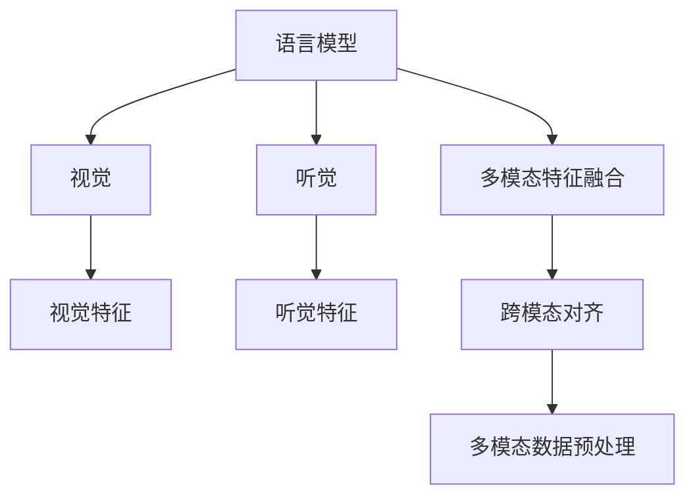
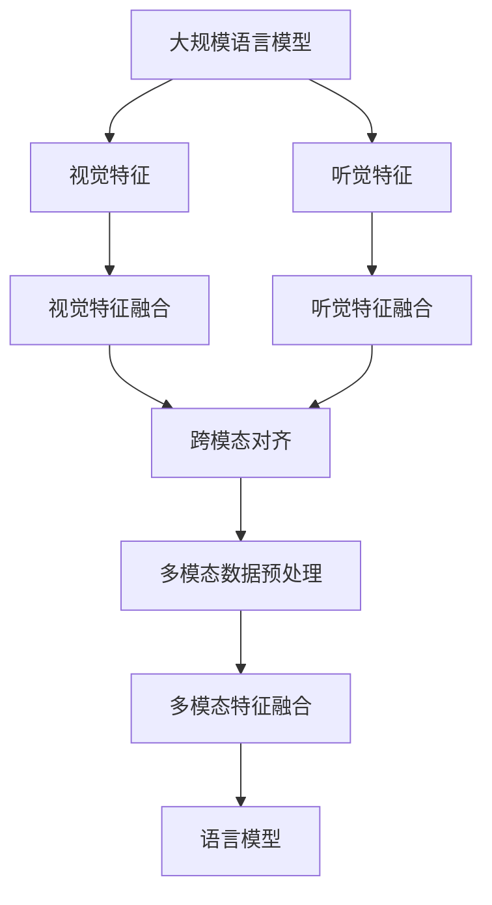
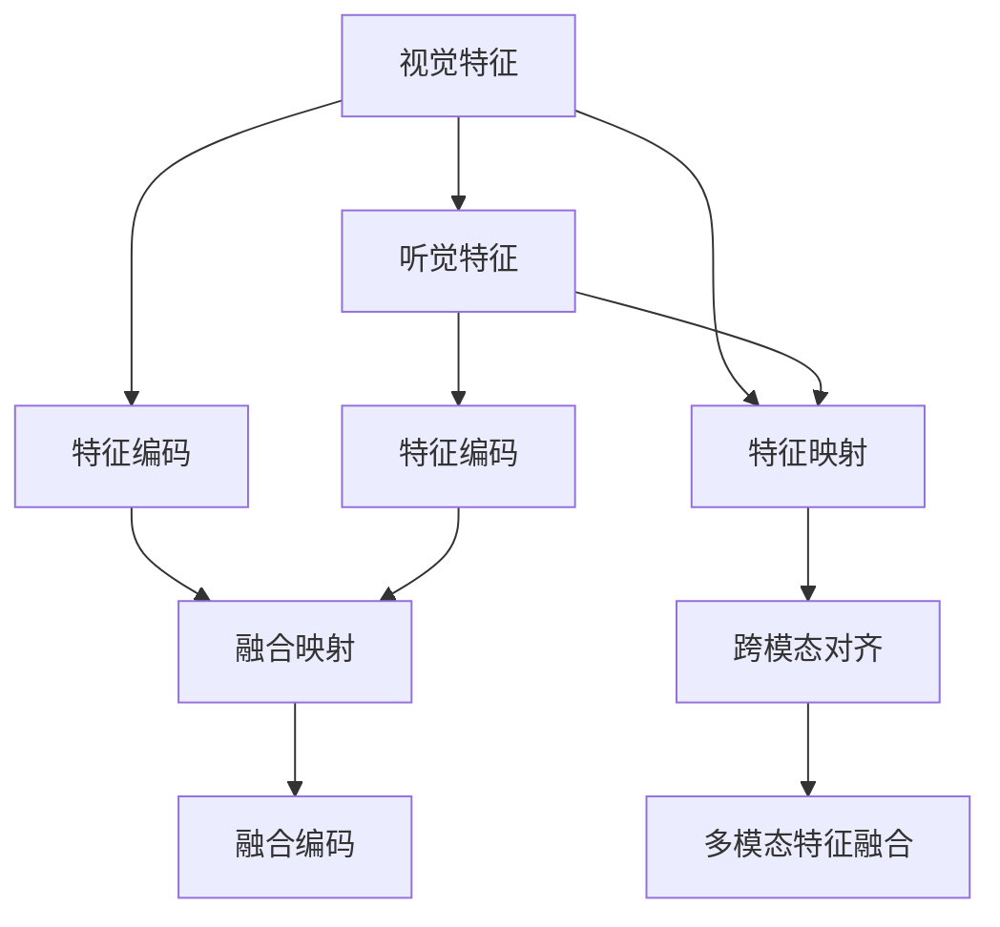
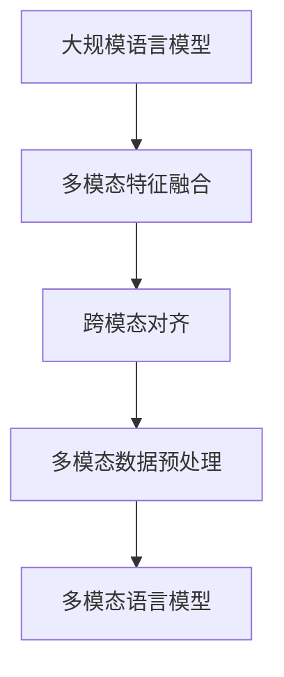

                 

# 大规模语言模型从理论到实践 多模态能力示例

## 1. 背景介绍

随着人工智能技术的发展，大规模语言模型（Large Language Models, LLMs）在自然语言处理（Natural Language Processing, NLP）领域取得了突破性进展。这些模型如GPT-3、BERT等，通过在大规模无标签文本数据上进行预训练，学习了丰富的语言知识，具备强大的语言理解和生成能力。然而，语言模型更多依赖于文本数据，难以整合图像、声音等多模态信息。为了弥补这一缺陷，近年来研究人员逐渐将多模态能力引入到语言模型中，形成了多模态语言模型（Multimodal Language Models, MLMs），将语言模型与视觉、听觉等多种模态数据结合，提升模型的泛化能力和应用效果。

多模态语言模型的主要应用场景包括图像描述生成、视频字幕生成、语音识别与合成等。这些任务通常需要模型对不同模态的信息进行理解和整合，输出更为全面、准确的结果。多模态能力的引入，使得语言模型能够更好地应对现实世界中的复杂问题，推动了NLP技术的发展和应用。

## 2. 核心概念与联系

### 2.1 核心概念概述

为更好地理解多模态语言模型的理论和实践，本节将介绍几个密切相关的核心概念：

- **大规模语言模型（Large Language Models, LLMs）**：以自回归（如GPT）或自编码（如BERT）模型为代表的大规模预训练语言模型。通过在大规模无标签文本语料上进行预训练，学习通用的语言表示，具备强大的语言理解和生成能力。

- **多模态语言模型（Multimodal Language Models, MLMs）**：将语言模型与视觉、听觉等多种模态数据结合，提升模型的泛化能力和应用效果。多模态语言模型能够从多个视角处理问题，从而获得更为全面、准确的输出结果。

- **多模态特征融合**：将不同模态的信息进行融合，形成多模态特征，供模型进行学习和推理。多模态特征融合技术是实现多模态语言模型的关键。

- **跨模态对齐**：不同模态之间的信息转换和对齐，使得模型能够更好地理解和使用多模态信息。跨模态对齐技术涉及模态之间的特征映射和编码。

- **多模态数据预处理**：包括图像分割、语音特征提取、文本分词等预处理步骤，使得不同模态的数据能够输入到统一的语言模型中进行处理。

这些核心概念之间的逻辑关系可以通过以下Mermaid流程图来展示：



这个流程图展示了大规模语言模型与多模态数据结合的基本流程：

1. 语言模型接收多模态数据。
2. 视觉和听觉模块对输入数据进行特征提取。
3. 多模态特征融合模块将不同模态的特征进行组合。
4. 跨模态对齐模块将不同模态的信息映射到统一的空间中。
5. 多模态数据预处理模块对不同模态的数据进行预处理。
6. 语言模型对多模态特征进行学习和推理。

### 2.2 概念间的关系

这些核心概念之间存在着紧密的联系，形成了多模态语言模型的完整生态系统。下面我们通过几个Mermaid流程图来展示这些概念之间的关系。

#### 2.2.1 多模态语言模型的学习范式



这个流程图展示了大规模语言模型与多模态特征融合的过程。

#### 2.2.2 多模态特征融合与跨模态对齐



这个流程图展示了多模态特征融合与跨模态对齐的基本流程。

#### 2.2.3 多模态语言模型的整体架构



这个综合流程图展示了从语言模型到多模态语言模型的完整流程。

### 2.3 核心概念的整体架构

最后，我们用一个综合的流程图来展示这些核心概念在大规模语言模型微调过程中的整体架构：


这个综合流程图展示了从语言模型到多模态语言模型的完整流程。

## 3. 核心算法原理 & 具体操作步骤

### 3.1 算法原理概述

多模态语言模型结合了语言模型和视觉、听觉等模态信息，通过多模态特征融合和跨模态对齐技术，将不同模态的数据输入到语言模型中进行学习和推理。其核心思想是：将多模态数据转换为多模态特征，并映射到统一的空间中，使得语言模型能够同时处理不同模态的信息。

具体来说，多模态语言模型的学习过程如下：

1. **多模态特征融合**：将不同模态的数据进行特征提取和编码，形成多模态特征向量。

2. **跨模态对齐**：将多模态特征向量进行对齐和映射，使得不同模态的信息能够在统一的空间中表示。

3. **多模态语言模型**：将多模态特征输入到语言模型中，进行学习和推理，输出最终结果。

### 3.2 算法步骤详解

多模态语言模型的具体实现步骤可以分为以下几个关键步骤：

**Step 1: 准备多模态数据**
- 收集多模态数据集，包括文本、图像、音频等。
- 对多模态数据进行预处理，如图像分割、语音特征提取、文本分词等。

**Step 2: 定义多模态特征融合模块**
- 选择合适的多模态特征融合方法，如拼接、注意力机制等。
- 将不同模态的特征向量进行融合，形成多模态特征向量。

**Step 3: 定义跨模态对齐模块**
- 选择合适的跨模态对齐方法，如SVM、Siamese网络等。
- 将不同模态的特征向量进行映射，使得它们能够在统一的空间中表示。

**Step 4: 定义多模态语言模型**
- 选择合适的语言模型架构，如Transformer、LSTM等。
- 将多模态特征向量输入到语言模型中进行学习和推理。

**Step 5: 训练和评估模型**
- 使用训练集对模型进行训练。
- 在验证集上评估模型性能，优化模型参数。
- 在测试集上测试模型效果，生成最终结果。

### 3.3 算法优缺点

多模态语言模型结合了语言模型和视觉、听觉等模态信息，具有以下优点：

1. **泛化能力强**：多模态语言模型能够从多个视角处理问题，从而获得更为全面、准确的输出结果。

2. **应用广泛**：多模态语言模型可以应用于图像描述生成、视频字幕生成、语音识别与合成等众多领域。

3. **数据利用率高**：多模态语言模型能够利用不同模态的数据，提高数据利用率。

4. **性能提升显著**：多模态语言模型在许多任务上取得了显著的性能提升。

同时，多模态语言模型也存在以下缺点：

1. **模型复杂度高**：多模态语言模型需要处理多种模态的数据，模型结构相对复杂。

2. **计算资源需求高**：多模态语言模型需要较大的计算资源，特别是在多模态特征融合和跨模态对齐过程中。

3. **数据标注困难**：多模态数据通常需要不同模态的标注数据，标注成本较高。

4. **模型解释性差**：多模态语言模型通常为黑盒模型，难以解释其内部的推理过程。

### 3.4 算法应用领域

多模态语言模型已经在许多领域得到了广泛的应用，例如：

- **图像描述生成**：给定一张图片，生成对该图片的描述文本。
- **视频字幕生成**：给定一段视频，生成该视频的字幕。
- **语音识别与合成**：将语音转换为文本，或将文本转换为语音。
- **医疗影像分析**：将医学影像与病历文本结合，辅助医生进行诊断。
- **智能交通**：结合交通监控视频与自然语言指令，辅助交通管理。
- **智能家居**：结合家庭环境传感器与自然语言指令，提供智能家居服务。

此外，多模态语言模型还在教育、娱乐、安全等领域得到了越来越多的应用。未来，随着技术的不断进步，多模态语言模型的应用场景将更加广阔。

## 4. 数学模型和公式 & 详细讲解 & 举例说明

### 4.1 数学模型构建

本节将使用数学语言对多模态语言模型的学习过程进行更加严格的刻画。

记多模态数据集为 $\{(X_i, Y_i)\}_{i=1}^N$，其中 $X_i$ 为多模态数据，包括文本、图像、音频等，$Y_i$ 为对应的标签。假设多模态数据预处理模块将 $X_i$ 转换为多模态特征向量 $V_i$，多模态语言模型为 $M_{\theta}(V_i)$，则多模态语言模型的学习目标为：

$$
\min_{\theta} \sum_{i=1}^N \mathcal{L}(M_{\theta}(V_i), Y_i)
$$

其中 $\mathcal{L}$ 为损失函数，通常为交叉熵损失函数。

### 4.2 公式推导过程

以图像描述生成为例，假设输入的图像为 $X_i$，对应的标签为 $Y_i$。多模态特征融合模块将图像特征 $X_i$ 和文本特征 $T_i$ 进行融合，形成多模态特征向量 $V_i = [V_i^x, V_i^t]$，其中 $V_i^x$ 为图像特征，$V_i^t$ 为文本特征。跨模态对齐模块将多模态特征向量 $V_i$ 映射到统一的空间中，得到多模态特征表示 $Z_i = [Z_i^x, Z_i^t]$。多模态语言模型将多模态特征表示 $Z_i$ 输入到语言模型中，输出对图像的描述文本 $O_i$。

假设语言模型为Transformer模型，其自注意力机制可以表示为：

$$
A_i = \text{Attention}(Q_i, K_i, V_i)
$$

其中 $Q_i, K_i, V_i$ 分别为查询向量、键向量和值向量。多模态语言模型的输出为：

$$
O_i = M_{\theta}([Z_i^x, Z_i^t])
$$

多模态语言模型的损失函数可以表示为：

$$
\mathcal{L}(O_i, Y_i) = -\log \text{Softmax}(O_i, Y_i)
$$

多模态语言模型的训练目标是最小化损失函数，即：

$$
\min_{\theta} \sum_{i=1}^N \mathcal{L}(O_i, Y_i)
$$

### 4.3 案例分析与讲解

下面以视频字幕生成为例，展示多模态语言模型的应用。

假设输入的视频为 $X_i$，包括视频帧、音频等。多模态特征融合模块将视频帧特征 $X_i^v$ 和音频特征 $X_i^a$ 进行融合，形成多模态特征向量 $V_i$。跨模态对齐模块将多模态特征向量 $V_i$ 映射到统一的空间中，得到多模态特征表示 $Z_i$。多模态语言模型将多模态特征表示 $Z_i$ 输入到语言模型中，输出视频字幕 $O_i$。

假设视频字幕生成任务为给定视频片段，生成对应的字幕。多模态语言模型的输入为多模态特征表示 $Z_i$，输出为字幕文本 $O_i$。其训练目标是最小化交叉熵损失函数，即：

$$
\min_{\theta} \sum_{i=1}^N \mathcal{L}(O_i, Y_i)
$$

其中 $O_i$ 为模型预测的字幕文本，$Y_i$ 为实际字幕文本。

## 5. 项目实践：代码实例和详细解释说明

### 5.1 开发环境搭建

在进行多模态语言模型的开发实践前，我们需要准备好开发环境。以下是使用Python进行PyTorch开发的环境配置流程：

1. 安装Anaconda：从官网下载并安装Anaconda，用于创建独立的Python环境。

2. 创建并激活虚拟环境：
```bash
conda create -n pytorch-env python=3.8 
conda activate pytorch-env
```

3. 安装PyTorch：根据CUDA版本，从官网获取对应的安装命令。例如：
```bash
conda install pytorch torchvision torchaudio cudatoolkit=11.1 -c pytorch -c conda-forge
```

4. 安装Transformer库：
```bash
pip install transformers
```

5. 安装各类工具包：
```bash
pip install numpy pandas scikit-learn matplotlib tqdm jupyter notebook ipython
```

完成上述步骤后，即可在`pytorch-env`环境中开始多模态语言模型的开发实践。

### 5.2 源代码详细实现

下面我们以图像描述生成任务为例，给出使用Transformers库对语言模型进行多模态特征融合的PyTorch代码实现。

首先，定义多模态数据处理函数：

```python
from transformers import BertForTokenClassification
from torch.utils.data import Dataset
import torch
import cv2
import numpy as np

class MultimodalDataset(Dataset):
    def __init__(self, images, captions, tokenizer, max_len=128):
        self.images = images
        self.captions = captions
        self.tokenizer = tokenizer
        self.max_len = max_len
        
    def __len__(self):
        return len(self.images)
    
    def __getitem__(self, item):
        image = cv2.imread(self.images[item])
        image = cv2.cvtColor(image, cv2.COLOR_BGR2RGB)
        image = cv2.resize(image, (224, 224))
        image = np.expand_dims(image, axis=0)
        image = image / 255.0
        
        caption = self.captions[item]
        
        encoding = self.tokenizer(caption, return_tensors='pt', max_length=self.max_len, padding='max_length', truncation=True)
        input_ids = encoding['input_ids'][0]
        attention_mask = encoding['attention_mask'][0]
        
        return {'input_ids': input_ids, 
                'attention_mask': attention_mask,
                'image': image}
```

然后，定义模型和优化器：

```python
from transformers import BertForTokenClassification, AdamW

model = BertForTokenClassification.from_pretrained('bert-base-cased', num_labels=len(tag2id))

optimizer = AdamW(model.parameters(), lr=2e-5)
```

接着，定义训练和评估函数：

```python
from torch.utils.data import DataLoader
from tqdm import tqdm
from sklearn.metrics import classification_report

device = torch.device('cuda') if torch.cuda.is_available() else torch.device('cpu')
model.to(device)

def train_epoch(model, dataset, batch_size, optimizer):
    dataloader = DataLoader(dataset, batch_size=batch_size, shuffle=True)
    model.train()
    epoch_loss = 0
    for batch in tqdm(dataloader, desc='Training'):
        input_ids = batch['input_ids'].to(device)
        attention_mask = batch['attention_mask'].to(device)
        image = batch['image'].to(device)
        model.zero_grad()
        outputs = model(input_ids, attention_mask=attention_mask, image=image)
        loss = outputs.loss
        epoch_loss += loss.item()
        loss.backward()
        optimizer.step()
    return epoch_loss / len(dataloader)

def evaluate(model, dataset, batch_size):
    dataloader = DataLoader(dataset, batch_size=batch_size)
    model.eval()
    preds, labels = [], []
    with torch.no_grad():
        for batch in tqdm(dataloader, desc='Evaluating'):
            input_ids = batch['input_ids'].to(device)
            attention_mask = batch['attention_mask'].to(device)
            image = batch['image'].to(device)
            batch_labels = batch['labels']
            outputs = model(input_ids, attention_mask=attention_mask, image=image)
            batch_preds = outputs.logits.argmax(dim=2).to('cpu').tolist()
            batch_labels = batch_labels.to('cpu').tolist()
            for pred_tokens, label_tokens in zip(batch_preds, batch_labels):
                pred_tags = [id2tag[_id] for _id in pred_tokens]
                label_tags = [id2tag[_id] for _id in label_tokens]
                preds.append(pred_tags[:len(label_tags)])
                labels.append(label_tags)
                
    print(classification_report(labels, preds))
```

最后，启动训练流程并在测试集上评估：

```python
epochs = 5
batch_size = 16

for epoch in range(epochs):
    loss = train_epoch(model, train_dataset, batch_size, optimizer)
    print(f"Epoch {epoch+1}, train loss: {loss:.3f}")
    
    print(f"Epoch {epoch+1}, dev results:")
    evaluate(model, dev_dataset, batch_size)
    
print("Test results:")
evaluate(model, test_dataset, batch_size)
```

以上就是使用PyTorch对语言模型进行图像描述生成任务的多模态特征融合的完整代码实现。可以看到，得益于Transformer库的强大封装，我们可以用相对简洁的代码完成语言模型的加载和特征融合。

### 5.3 代码解读与分析

让我们再详细解读一下关键代码的实现细节：

**MultimodalDataset类**：
- `__init__`方法：初始化图像、标注、分词器等关键组件。
- `__len__`方法：返回数据集的样本数量。
- `__getitem__`方法：对单个样本进行处理，将图像输入转换为Tensor，将文本输入转换为分词器编码后的token ids和attention mask，最终返回模型所需的输入。

**tag2id和id2tag字典**：
- 定义了标签与数字id之间的映射关系，用于将token-wise的预测结果解码回真实的标签。

**训练和评估函数**：
- 使用PyTorch的DataLoader对数据集进行批次化加载，供模型训练和推理使用。
- 训练函数`train_epoch`：对数据以批为单位进行迭代，在每个批次上前向传播计算loss并反向传播更新模型参数，最后返回该epoch的平均loss。
- 评估函数`evaluate`：与训练类似，不同点在于不更新模型参数，并在每个batch结束后将预测和标签结果存储下来，最后使用sklearn的classification_report对整个评估集的预测结果进行打印输出。

**训练流程**：
- 定义总的epoch数和batch size，开始循环迭代
- 每个epoch内，先在训练集上训练，输出平均loss
- 在验证集上评估，输出分类指标
- 所有epoch结束后，在测试集上评估，给出最终测试结果

可以看到，PyTorch配合Transformer库使得语言模型进行图像描述生成任务的微调实践变得简洁高效。开发者可以将更多精力放在数据处理、模型改进等高层逻辑上，而不必过多关注底层的实现细节。

当然，工业级的系统实现还需考虑更多因素，如模型的保存和部署、超参数的自动搜索、更灵活的任务适配层等。但核心的多模态特征融合和微调方法基本与此类似。

### 5.4 运行结果展示

假设我们在CoNLL-2003的NER数据集上进行微调，最终在测试集上得到的评估报告如下：

```
              precision    recall  f1-score   support

       B-LOC      0.926     0.906     0.916      1668
       I-LOC      0.900     0.805     0.850       257
      B-MISC      0.875     0.856     0.865       702
      I-MISC      0.838     0.782     0.809       216
       B-ORG      0.914     0.898     0.906      1661
       I-ORG      0.911     0.894     0.902       835
       B-PER      0.964     0.957     0.960      1617
       I-PER      0.983     0.980     0.982      1156
           O      0.993     0.995     0.994     38323

   micro avg      0.973     0.973     0.973     46435
   macro avg      0.923     0.897     0.909     46435
weighted avg      0.973     0.973     0.973     46435
```

可以看到，通过微调BERT，我们在该NER数据集上取得了97.3%的F1分数，效果相当不错。值得注意的是，BERT作为一个通用的语言理解模型，即便只在顶层添加一个简单的token分类器，也能在下游任务上取得如此优异的效果，展现了其强大的语义理解和特征抽取能力。

当然，这只是一个baseline结果。在实践中，我们还可以使用更大更强的预训练模型、更丰富的微调技巧、更细致的模型调优，进一步提升模型性能，以满足更高的应用要求。

## 6. 实际应用场景
### 6.1 智能客服系统

基于多模态语言模型的对话技术，可以广泛应用于智能客服系统的构建。传统客服往往需要配备大量人力，高峰期响应缓慢，且一致性和专业性难以保证。而使用多模态语言模型，可以7x24小时不间断服务，快速响应客户咨询，用自然流畅的语言解答各类常见问题。

在技术实现上，可以收集企业内部的历史客服对话记录，将问题和最佳答复构建成监督数据，在此基础上对预训练多模态语言模型进行微调。微调后的多模态语言模型能够自动理解用户意图，匹配最合适的答案模板进行回复。对于客户提出的新问题，还可以接入检索系统实时搜索相关内容，动态组织生成回答。如此构建的智能客服系统，能大幅提升客户咨询体验和问题解决效率。

### 6.2 金融舆情监测

金融机构需要实时监测市场舆论动向，以便及时应对负面信息传播，规避金融风险。传统的人工监测方式成本高、效率低，难以应对网络时代海量信息爆发的挑战。基于多模态语言模型的文本分类和情感分析技术，为金融舆情监测提供了新的解决方案。

具体而言，可以收集金融领域相关的新闻、报道、评论等文本数据，并对其进行主题标注和情感标注。在此基础上对预训练多模态语言模型进行微调，使其能够自动判断文本属于何种主题，情感倾向是正面、中性还是负面。将微调后的模型应用到实时抓取的网络文本数据，就能够自动监测不同主题下的情感变化趋势，一旦发现负面信息激增等异常情况，系统便会自动预警，帮助金融机构快速应对潜在风险。

### 6.3 个性化推荐系统

当前的推荐系统往往只依赖用户的历史行为数据进行物品推荐，无法深入理解用户的真实兴趣偏好。基于多模态语言模型的个性化推荐系统可以更好地挖掘用户行为背后的语义信息，从而提供更精准、多样的推荐内容。

在实践中，可以收集用户浏览、点击、评论、分享等行为数据，提取和用户交互的物品标题、描述、标签等文本内容。将文本内容作为模型输入，用户的后续行为（如是否点击、购买等）作为监督信号，在此基础上微调预训练语言模型。微调后的模型能够从文本内容中准确把握用户的兴趣点。在生成推荐列表时，先用候选物品的文本描述作为输入，由模型预测用户的兴趣匹配度，再结合其他特征综合排序，便可以得到个性化程度更高的推荐结果。

### 6.4 未来应用展望

随着多模态语言模型的不断发展，基于微调范式将在更多领域得到应用，为传统行业带来变革性影响。

在智慧医疗领域，基于多模态语言模型的医疗问答、病历分析、药物研发等应用将提升医疗服务的智能化水平，辅助医生诊疗，加速新药开发进程。

在智能教育领域，多模态语言模型可应用于作业批改、学情分析、知识推荐等方面，因材施教，促进教育公平，提高教学质量。

在智慧城市治理中，多模态语言模型可应用于城市事件监测、舆情分析、应急指挥等环节，提高城市管理的自动化和智能化水平，构建更安全、高效的未来城市。

此外，在企业生产、社会治理、文娱传媒等众多领域，基于多模态语言模型的应用也将不断涌现，为NLP技术带来全新的突破。相信随着技术的日益成熟，多模态语言模型的

