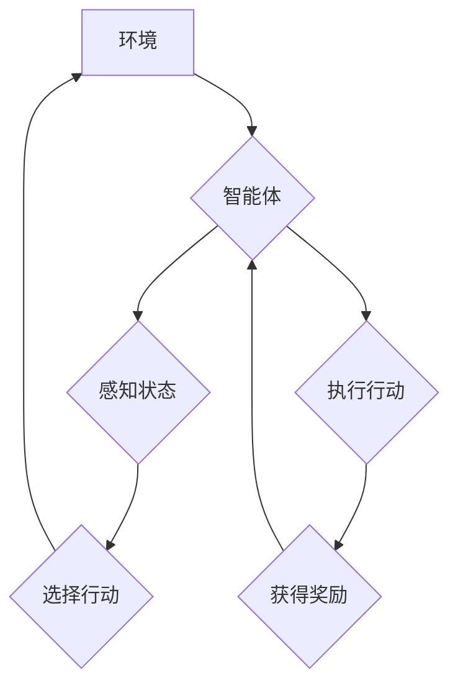

## AI人工智能 Agent：智能体策略迭代与优化

> 关键词：人工智能，智能体，策略迭代，强化学习，动态规划，价值函数，策略梯度，深度强化学习

### 1. 背景介绍

在人工智能领域，智能体（Agent）扮演着至关重要的角色。智能体是指能够感知环境、做出决策并与环境交互的系统。其目标通常是通过与环境的交互最大化累积的奖励。策略迭代与优化是智能体学习和决策的核心机制之一，尤其在强化学习领域得到了广泛应用。

强化学习是一种机器学习范式，它通过试错学习，让智能体在与环境交互的过程中不断优化其策略，以获得最大的长期奖励。策略迭代算法的核心思想是通过反复更新策略，使得智能体在每次决策时都能选择最优的行动，从而最终达到最大化的奖励目标。

### 2. 核心概念与联系

**2.1 核心概念**

* **智能体 (Agent):**  能够感知环境、做出决策并与环境交互的系统。
* **环境 (Environment):** 智能体所处的外部世界，它会根据智能体的行动产生相应的反馈。
* **状态 (State):** 环境在某个特定时刻的描述。
* **行动 (Action):** 智能体可以采取的可选操作。
* **奖励 (Reward):** 环境对智能体行动的反馈，通常是一个标量值，表示智能体行为的好坏。
* **策略 (Policy):**  智能体在不同状态下选择行动的规则。
* **价值函数 (Value Function):**  评估智能体在特定状态下采取特定策略的长期奖励的能力。

**2.2  架构流程图**



**2.3 核心联系**

智能体通过感知环境的状态，选择行动并与环境交互，从而获得奖励。策略决定了智能体在不同状态下选择行动的方式。价值函数评估了策略在不同状态下的长期奖励潜力。策略迭代算法通过不断更新策略，使得智能体能够在与环境交互的过程中不断优化其决策，最终达到最大化的奖励目标。

### 3. 核心算法原理 & 具体操作步骤

**3.1 算法原理概述**

策略迭代算法的核心思想是通过迭代更新策略，使得智能体在每次决策时都能选择最优的行动，从而最终达到最大化的奖励目标。

该算法通常包含以下步骤：

1. **初始化策略:**  随机初始化一个策略。
2. **评估策略:** 使用价值函数评估当前策略的性能。
3. **策略更新:** 根据价值函数的评估结果，更新策略，使得智能体在每个状态下选择能够获得最大奖励的行动。
4. **重复步骤2和3:**  重复评估和更新策略，直到策略收敛，即不再发生显著变化。

**3.2 算法步骤详解**

1. **初始化策略:**  随机初始化一个策略，例如，对于每个状态，随机选择一个行动。
2. **评估策略:** 使用价值函数评估当前策略的性能。价值函数可以是基于动态规划的，也可以是基于蒙特卡罗方法的。
3. **策略更新:** 根据价值函数的评估结果，更新策略。策略更新方法有很多种，例如，贪婪策略更新、softmax策略更新等。
4. **重复步骤2和3:**  重复评估和更新策略，直到策略收敛。

**3.3 算法优缺点**

**优点:**

* 理论上可以找到最优策略。
* 适用于离散状态和行动空间的强化学习问题。

**缺点:**

* 计算复杂度较高，尤其是在状态空间和行动空间较大时。
* 容易陷入局部最优解。

**3.4 算法应用领域**

策略迭代算法广泛应用于各种强化学习问题，例如：

* 游戏人工智能
* 自动控制
* 机器人导航
* 医疗决策支持

### 4. 数学模型和公式 & 详细讲解 & 举例说明

**4.1 数学模型构建**

强化学习问题可以建模为马尔可夫决策过程 (MDP)。MDP 由以下要素组成：

* 状态空间 S: 所有可能的系统状态的集合。
* 行动空间 A: 在每个状态下智能体可以采取的行动的集合。
* 转移概率矩阵 P: 描述从一个状态到另一个状态的概率，取决于采取的行动。
* 奖励函数 R: 描述在每个状态采取每个行动后获得的奖励。
* 折扣因子 γ:  表示未来奖励的价值。

**4.2 公式推导过程**

策略迭代算法的核心是价值函数的更新。价值函数 Vπ(s) 表示在策略 π 下，从状态 s 开始的期望累积奖励。

价值函数的更新公式为：

$$V^{\pi'}(s) = \max_{a \in A} \left[ R(s, a) + \gamma \sum_{s' \in S} P(s' | s, a) V^{\pi'}(s') \right]$$

其中：

* Vπ'(s) 是策略 π' 下状态 s 的价值函数。
* R(s, a) 是在状态 s 采取行动 a 后获得的奖励。
* P(s' | s, a) 是从状态 s 采取行动 a 到状态 s' 的转移概率。
* γ 是折扣因子。

**4.3 案例分析与讲解**

假设有一个简单的强化学习问题，智能体在一个环境中移动，目标是到达终点状态。环境由四个状态组成，智能体可以采取向上、向下、向左、向右四个行动。每个状态的奖励为 0，到达终点状态的奖励为 1。

使用策略迭代算法，我们可以通过迭代更新策略，使得智能体能够找到到达终点状态的最优路径。

### 5. 项目实践：代码实例和详细解释说明

**5.1 开发环境搭建**

本示例使用 Python 语言和 OpenAI Gym 库进行实现。

* 安装 Python 3.x 及其相关库：pip install gym

**5.2 源代码详细实现**

```python
import gym
import numpy as np

# 创建环境
env = gym.make('FrozenLake-v1')

# 定义策略
policy = np.zeros((env.observation_space.n, env.action_space.n))

# 学习参数
gamma = 0.9  # 折扣因子
alpha = 0.1  # 学习率
episodes = 1000  # 训练轮数

# 策略迭代
for episode in range(episodes):
    state = env.reset()
    done = False
    while not done:
        # 根据策略选择行动
        action = np.argmax(policy[state])
        
        # 执行行动并获得奖励和下一个状态
        next_state, reward, done, _ = env.step(action)
        
        # 更新价值函数
        policy[state, action] += alpha * (reward + gamma * np.max(policy[next_state]) - policy[state, action])
        
        # 更新状态
        state = next_state

# 打印策略
print(policy)
```

**5.3 代码解读与分析**

* 代码首先创建了一个 FrozenLake 环境，这是一个经典的强化学习问题。
* 策略初始化为一个全零矩阵，表示所有状态下所有行动的价值都为 0。
* 训练过程使用策略迭代算法，通过迭代更新策略，使得智能体能够找到到达终点状态的最优路径。
* 每个训练轮数中，智能体从初始状态开始，根据策略选择行动，执行行动并获得奖励和下一个状态。
* 根据 Bellman 方程更新策略，使得智能体在每个状态下选择能够获得最大奖励的行动。
* 训练完成后，打印策略，可以看出智能体已经学会了到达终点状态的最优路径。

**5.4 运行结果展示**

运行代码后，会输出一个策略矩阵，其中每个元素表示在对应状态下采取对应行动的价值。

### 6. 实际应用场景

策略迭代算法在许多实际应用场景中发挥着重要作用，例如：

* **游戏人工智能:**  策略迭代算法可以用于训练游戏 AI，使其能够在游戏中做出最优决策，例如，在围棋、象棋等游戏中。
* **自动控制:**  策略迭代算法可以用于训练自动控制系统，使其能够在复杂环境中稳定运行，例如，无人驾驶汽车、工业机器人等。
* **机器人导航:**  策略迭代算法可以用于训练机器人导航系统，使其能够在未知环境中找到目标位置，例如，在仓库、工厂等环境中。
* **医疗决策支持:**  策略迭代算法可以用于训练医疗决策支持系统，使其能够根据患者的病情和医疗历史提供最优的治疗方案。

**6.4 未来应用展望**

随着人工智能技术的不断发展，策略迭代算法在未来将有更广泛的应用前景。例如，

* **深度强化学习:**  将策略迭代算法与深度神经网络结合，可以训练更强大的强化学习模型，解决更复杂的问题。
* **多智能体强化学习:**  将策略迭代算法应用于多智能体系统，可以训练多个智能体协同合作完成任务。
* **迁移学习:**  利用策略迭代算法进行迁移学习，可以将已训练好的模型应用于新的任务或环境。

### 7. 工具和资源推荐

**7.1 学习资源推荐**

* **书籍:**
    * Reinforcement Learning: An Introduction by Richard S. Sutton and Andrew G. Barto
    * Deep Reinforcement Learning Hands-On by Maxim Lapan
* **在线课程:**
    * Coursera: Reinforcement Learning Specialization by David Silver
    * Udacity: Deep Reinforcement Learning Nanodegree

**7.2 开发工具推荐**

* **OpenAI Gym:**  一个用于强化学习研究和开发的开源库。
* **TensorFlow:**  一个用于深度学习的开源库。
* **PyTorch:**  另一个用于深度学习的开源库。

**7.3 相关论文推荐**

* Deep Q-Network (DQN)
* Policy Gradient Methods for Reinforcement Learning
* Proximal Policy Optimization (PPO)

### 8. 总结：未来发展趋势与挑战

**8.1 研究成果总结**

策略迭代算法是强化学习领域的重要算法，它为智能体学习和决策提供了有效的机制。近年来，随着深度学习技术的进步，深度强化学习算法取得了显著的成果，在许多实际应用场景中取得了突破。

**8.2 未来发展趋势**

* **更强大的模型:**  研究更强大的深度强化学习模型，能够解决更复杂的问题。
* **更有效的算法:**  研究更有效的策略迭代算法，提高学习效率和收敛速度。
* **更广泛的应用:**  将策略迭代算法应用于更多实际应用场景，例如，医疗、金融、教育等领域。

**8.3 面临的挑战**

* **样本效率:**  深度强化学习算法通常需要大量的样本数据进行训练，这在现实世界中可能难以实现。
* **可解释性:**  深度强化学习模型的决策过程通常难以解释，这可能导致模型的信任度降低。
* **安全性和可靠性:**  强化学习算法在实际应用中需要保证安全性和可靠性，避免出现不可预知的错误。

**8.4 研究展望**

未来，策略迭代算法的研究将继续朝着更强大、更有效、更安全的方向发展。


### 9. 附录：常见问题与解答

**9.1 Q: 策略迭代算法的计算复杂度很高吗？**

**A:**  是的，策略迭代算法的计算复杂度较高，尤其是在状态空间和行动空间较大时。

**9.2 Q: 策略迭代算法容易陷入局部最优解吗？**

**A:**  是的，策略迭代算法容易陷入局部最优解。

**9.3 Q: 策略迭代算法适用于哪些强化学习问题？**

**A:**  策略迭代算法适用于离散状态和行动空间的强化学习问题。


作者：禅与计算机程序设计艺术 / Zen and the Art of Computer Programming 
