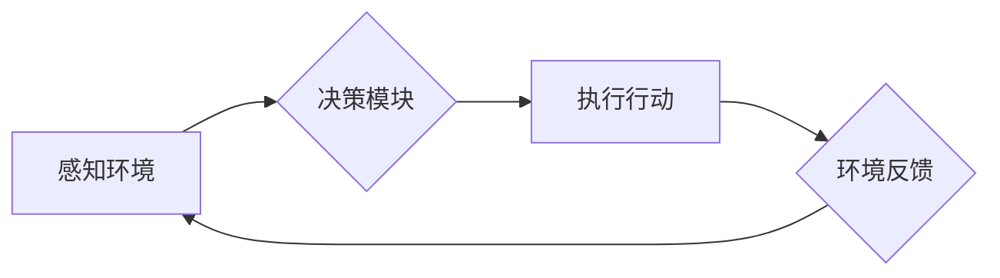

## AI人工智能代理工作流AI Agent WorkFlow：仿真环境中AI代理的实验与评估

> 关键词：人工智能代理、工作流、仿真环境、实验评估、机器学习、强化学习、决策算法

## 1. 背景介绍

随着人工智能技术的飞速发展，人工智能代理（AI Agent）在各个领域展现出巨大的应用潜力。AI代理是指能够感知环境、做出决策并执行行动的智能体，它们可以自动完成各种任务，例如自动驾驶、机器人控制、游戏策略制定等。

在实际应用中，AI代理通常需要在复杂的环境中进行操作，需要能够有效地感知环境信息、制定决策并执行行动。为了更好地研究和评估AI代理的性能，仿真环境成为了一个重要的工具。仿真环境可以模拟真实世界或特定场景，提供一个安全、可控的环境来测试和训练AI代理。

## 2. 核心概念与联系

### 2.1  人工智能代理

人工智能代理是一个能够感知环境、做出决策并执行行动的智能体。它通常由以下几个部分组成：

* **感知模块:** 用于获取环境信息，例如传感器数据、图像、文本等。
* **决策模块:** 用于根据环境信息和目标进行决策，选择最优的行动。
* **执行模块:** 用于执行决策，与环境进行交互。

### 2.2  工作流

工作流是一种自动化执行任务的流程，它由一系列步骤组成，每个步骤都对应一个特定的任务。工作流可以帮助我们将复杂的任务分解成更小的、可管理的步骤，并提高任务执行的效率和可靠性。

### 2.3  仿真环境

仿真环境是一种模拟真实世界或特定场景的虚拟环境，它可以提供一个安全、可控的环境来测试和训练AI代理。仿真环境通常包含以下几个方面：

* **环境模型:** 描述环境的结构、规则和行为的模型。
* **代理模型:** 描述AI代理的感知、决策和执行能力的模型。
* **交互机制:** 描述AI代理与环境进行交互的方式。

### 2.4  AI代理工作流

AI代理工作流是指在仿真环境中，AI代理执行的一系列自动化任务流程。它将AI代理的工作流程与工作流的概念结合起来，可以帮助我们更好地理解和控制AI代理在复杂环境中的行为。

**Mermaid 流程图**



## 3. 核心算法原理 & 具体操作步骤

### 3.1  算法原理概述

AI代理工作流的实现需要依赖于各种算法，例如机器学习、强化学习、决策树等。这些算法可以帮助AI代理感知环境、做出决策并执行行动。

* **机器学习:** 用于从数据中学习模式和规律，可以帮助AI代理预测环境变化和做出更智能的决策。
* **强化学习:** 用于训练AI代理在环境中学习最优策略，通过奖励和惩罚机制来引导AI代理的行为。
* **决策树:** 用于将决策问题分解成一系列的判断条件，可以帮助AI代理快速做出决策。

### 3.2  算法步骤详解

具体的操作步骤取决于所使用的算法，但一般来说，AI代理工作流的实现过程可以分为以下几个步骤：

1. **环境建模:** 建立仿真环境的模型，包括环境的结构、规则和行为。
2. **代理建模:** 建立AI代理的模型，包括感知模块、决策模块和执行模块。
3. **算法训练:** 使用机器学习、强化学习等算法训练AI代理，使其能够感知环境、做出决策并执行行动。
4. **工作流设计:** 设计AI代理在仿真环境中执行的任务流程，即AI代理工作流。
5. **仿真实验:** 在仿真环境中运行AI代理工作流，并收集实验数据。
6. **实验评估:** 对实验数据进行分析，评估AI代理工作流的性能。

### 3.3  算法优缺点

不同的算法具有不同的优缺点，需要根据具体应用场景选择合适的算法。

* **机器学习:** 优点是能够从数据中学习模式和规律，缺点是需要大量的训练数据，并且训练过程可能比较耗时。
* **强化学习:** 优点是能够训练AI代理在环境中学习最优策略，缺点是训练过程可能比较复杂，并且需要设计合理的奖励和惩罚机制。
* **决策树:** 优点是能够快速做出决策，缺点是难以处理复杂决策问题。

### 3.4  算法应用领域

AI代理工作流的应用领域非常广泛，例如：

* **自动驾驶:** AI代理可以感知道路环境、做出驾驶决策并控制车辆行驶。
* **机器人控制:** AI代理可以感知周围环境、做出运动决策并控制机器人执行任务。
* **游戏策略制定:** AI代理可以学习游戏规则、制定策略并与人类玩家进行对抗。
* **金融交易:** AI代理可以分析市场数据、做出交易决策并进行自动交易。

## 4. 数学模型和公式 & 详细讲解 & 举例说明

### 4.1  数学模型构建

在AI代理工作流中，可以使用数学模型来描述环境、代理和交互机制。例如，可以使用状态空间模型来描述环境的状态，可以使用马尔可夫决策过程（MDP）来描述代理的行为和决策。

**状态空间模型:**

$$
S = \{s_1, s_2,..., s_n\}
$$

其中，$S$表示环境的状态空间，$s_i$表示环境的第$i$个状态。

**马尔可夫决策过程 (MDP):**

$$
MDP = (S, A, P, R, γ)
$$

其中，$S$表示状态空间，$A$表示动作空间，$P$表示状态转移概率，$R$表示奖励函数，$γ$表示折扣因子。

### 4.2  公式推导过程

在强化学习中，可以使用Bellman方程来推导价值函数。Bellman方程描述了状态价值函数和动作价值函数之间的关系。

**状态价值函数:**

$$
V(s) = max_a \sum_{s'} P(s'|s,a) [R(s,a,s') + γ V(s')]
$$

其中，$V(s)$表示状态$s$的价值函数，$a$表示动作，$P(s'|s,a)$表示从状态$s$执行动作$a$后转移到状态$s'$的概率，$R(s,a,s')$表示执行动作$a$从状态$s$转移到状态$s'$获得的奖励，$γ$表示折扣因子。

### 4.3  案例分析与讲解

例如，在自动驾驶场景中，可以使用MDP模型来描述车辆的运动决策。状态空间可以包含车辆的位置、速度、方向等信息，动作空间可以包含加速、减速、转向等动作。

通过训练强化学习模型，可以学习到车辆在不同状态下执行不同动作的价值函数，从而帮助车辆做出最优的驾驶决策。

## 5. 项目实践：代码实例和详细解释说明

### 5.1  开发环境搭建

为了实现AI代理工作流，需要搭建一个合适的开发环境。常用的开发环境包括：

* **Python:** Python是一种流行的编程语言，拥有丰富的机器学习和深度学习库，例如TensorFlow、PyTorch等。
* **仿真环境平台:** 常见的仿真环境平台包括Gazebo、Unity、Unreal Engine等。

### 5.2  源代码详细实现

以下是一个简单的AI代理工作流的代码示例，使用Python和OpenAI Gym库实现：

```python
import gym
import numpy as np

# 创建环境
env = gym.make('CartPole-v1')

# 定义代理
class Agent:
    def __init__(self):
        self.state_size = env.observation_space.shape[0]
        self.action_size = env.action_space.n
        self.weights = np.random.randn(self.state_size, self.action_size)

    def act(self, state):
        return np.argmax(self.weights.dot(state))

# 创建代理实例
agent = Agent()

# 训练代理
for episode in range(100):
    state = env.reset()
    done = False
    total_reward = 0

    while not done:
        action = agent.act(state)
        next_state, reward, done, _ = env.step(action)
        total_reward += reward
        state = next_state

    print(f'Episode {episode+1}, Total Reward: {total_reward}')

# 关闭环境
env.close()
```

### 5.3  代码解读与分析

这段代码定义了一个简单的AI代理，它使用线性回归模型来预测动作价值。代理在环境中进行交互，根据环境状态选择动作，并根据奖励信号更新模型参数。

### 5.4  运行结果展示

运行这段代码后，可以观察到代理在CartPole环境中的表现。代理会逐渐学习到控制杆的策略，并能够保持平衡杆的时间越来越长。

## 6. 实际应用场景

AI代理工作流在各个领域都有着广泛的应用场景，例如：

### 6.1  自动驾驶

AI代理可以感知道路环境、做出驾驶决策并控制车辆行驶。

### 6.2  机器人控制

AI代理可以感知周围环境、做出运动决策并控制机器人执行任务。

### 6.3  游戏策略制定

AI代理可以学习游戏规则、制定策略并与人类玩家进行对抗。

### 6.4  未来应用展望

随着人工智能技术的不断发展，AI代理工作流的应用场景将会更加广泛，例如：

* **医疗保健:** AI代理可以辅助医生诊断疾病、制定治疗方案。
* **金融服务:** AI代理可以进行风险评估、投资决策。
* **教育:** AI代理可以提供个性化的学习辅导。

## 7. 工具和资源推荐

### 7.1  学习资源推荐

* **书籍:**
    * 《Reinforcement Learning: An Introduction》 by Richard S. Sutton and Andrew G. Barto
    * 《Artificial Intelligence: A Modern Approach》 by Stuart Russell and Peter Norvig
* **在线课程:**
    * Coursera: Reinforcement Learning Specialization
    * Udacity: Intro to Artificial Intelligence

### 7.2  开发工具推荐

* **Python:** 
    * TensorFlow
    * PyTorch
    * OpenAI Gym
* **仿真环境平台:**
    * Gazebo
    * Unity
    * Unreal Engine

### 7.3  相关论文推荐

* **Deep Reinforcement Learning with Double Q-learning** by Hasselt et al. (2015)
* **Proximal Policy Optimization Algorithms** by Schulman et al. (2017)
* **Asynchronous Methods for Deep Reinforcement Learning** by Mnih et al. (2016)

## 8. 总结：未来发展趋势与挑战

### 8.1  研究成果总结

近年来，AI代理工作流领域取得了显著的进展，例如：

* 强化学习算法取得了突破性进展，能够训练出更智能的AI代理。
* 仿真环境技术不断发展，能够模拟更复杂的环境场景。
* AI代理工作流的应用场景不断扩展，覆盖了越来越多的领域。

### 8.2  未来发展趋势

未来，AI代理工作流领域将朝着以下几个方向发展：

* **更智能的AI代理:** 发展更先进的机器学习和深度学习算法，训练出能够解决更复杂问题的AI代理。
* **更逼真的仿真环境:** 建立更逼真的仿真环境，能够更好地模拟真实世界，提高AI代理的泛化能力。
* **更广泛的应用场景:** 将AI代理工作流应用到更多领域，例如医疗保健、金融服务、教育等。

### 8.3  面临的挑战

AI代理工作流领域也面临着一些挑战：

* **数据获取和标注:** 训练AI代理需要大量的训练数据，获取和标注