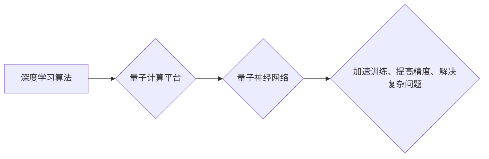

## AI人工智能深度学习算法：在量子计算中的应用

> 关键词：深度学习、量子计算、量子神经网络、量子卷积神经网络、量子支持向量机、量子优化、量子算法

## 1. 背景介绍

深度学习作为人工智能领域最具突破性的技术之一，在图像识别、自然语言处理、语音识别等领域取得了令人瞩目的成就。然而，传统深度学习算法在处理海量数据和复杂模式时仍然面临着计算效率和资源消耗的瓶颈。量子计算作为一种新兴的计算 paradigm，拥有超越经典计算的强大潜力，为深度学习算法的突破提供了新的方向。

量子计算利用量子力学原理，例如叠加和纠缠，构建出能够处理大量信息并进行并行计算的量子比特。与经典计算机的比特不同，量子比特可以同时处于0和1的叠加态，从而实现指数级的计算能力提升。将深度学习算法移植到量子计算平台，可以有效解决传统深度学习算法的瓶颈，并开拓新的应用领域。

## 2. 核心概念与联系

**2.1 深度学习算法**

深度学习算法是一种基于多层神经网络的机器学习算法。神经网络由多个相互连接的节点（神经元）组成，每个节点进行简单的计算并传递信息。通过训练，神经网络可以学习复杂的模式和关系，从而实现对数据的预测、分类和识别等任务。

**2.2 量子计算**

量子计算是一种利用量子力学原理进行计算的新型计算模型。其核心部件是量子比特，它可以同时处于0和1的叠加态，并通过量子纠缠实现信息之间的关联。量子计算拥有超越经典计算的强大潜力，能够解决一些经典算法难以处理的复杂问题。

**2.3 量子神经网络**

量子神经网络是将深度学习算法移植到量子计算平台的一种实现方式。它利用量子比特的叠加和纠缠特性，构建出能够进行量子计算的网络结构。量子神经网络可以学习更加复杂的模式和关系，并具有更高的计算效率。

**2.4 量子深度学习的联系**

深度学习算法和量子计算相结合，可以实现以下优势：

* **加速训练速度:** 量子计算的并行计算能力可以显著加速深度学习模型的训练速度。
* **提高模型精度:** 量子神经网络可以学习更加复杂的模式和关系，从而提高模型的预测精度。
* **解决传统算法难以处理的问题:** 量子计算可以解决一些传统深度学习算法难以处理的复杂问题，例如大规模数据分析和优化问题。

**2.5  Mermaid 流程图**



## 3. 核心算法原理 & 具体操作步骤

### 3.1  算法原理概述

量子神经网络的算法原理基于量子力学原理，例如叠加和纠缠。量子比特可以同时处于0和1的叠加态，从而实现对信息的并行处理。量子神经网络的层级结构类似于传统神经网络，但每个节点使用量子比特进行计算，并通过量子门实现信息传递。

### 3.2  算法步骤详解

1. **量子比特初始化:** 将量子比特初始化为特定的状态，例如|0⟩或|1⟩。
2. **量子层构建:** 使用量子门构建量子层，每个层包含多个量子比特和量子门。
3. **量子计算:** 对量子比特进行量子计算，例如量子加法、量子乘法等。
4. **量子测量:** 对量子比特进行测量，获得经典比特的结果。
5. **反向传播:** 使用反向传播算法调整量子门参数，优化网络性能。

### 3.3  算法优缺点

**优点:**

* **加速训练速度:** 量子计算的并行计算能力可以显著加速深度学习模型的训练速度。
* **提高模型精度:** 量子神经网络可以学习更加复杂的模式和关系，从而提高模型的预测精度。
* **解决传统算法难以处理的问题:** 量子计算可以解决一些传统深度学习算法难以处理的复杂问题，例如大规模数据分析和优化问题。

**缺点:**

* **技术难度高:** 量子计算技术还处于发展初期，量子神经网络的构建和训练需要高度的专业知识和技术能力。
* **硬件资源限制:** 量子计算硬件资源仍然稀缺，难以满足大规模量子神经网络训练的需求。
* **算法研究尚未完善:** 量子神经网络的算法研究还处于探索阶段，需要进一步的理论和实践研究。

### 3.4  算法应用领域

* **药物研发:** 利用量子神经网络加速药物分子设计和筛选。
* **材料科学:** 利用量子神经网络预测材料的性能和结构。
* **金融建模:** 利用量子神经网络进行风险评估和投资决策。
* **人工智能安全:** 利用量子神经网络增强人工智能系统的安全性。

## 4. 数学模型和公式 & 详细讲解 & 举例说明

### 4.1  数学模型构建

量子神经网络的数学模型基于量子力学和线性代数。量子比特可以用复数表示，量子门可以用矩阵表示。

**量子比特状态:**

$$
|q\rangle = \alpha |0\rangle + \beta |1\rangle
$$

其中，|0⟩和|1⟩是量子比特的基本状态，α和β是复数系数，满足|α|² + |β|² = 1。

**量子门:**

量子门是一个将量子比特从一个状态变换到另一个状态的线性变换。例如，Hadamard门可以将|0⟩变换为(1/√2)(|0⟩ + |1⟩)。

**量子层:**

量子层由多个量子门组成，每个门作用于特定的量子比特。

### 4.2  公式推导过程

量子神经网络的训练过程类似于传统神经网络的训练过程，使用反向传播算法调整量子门参数。

反向传播算法的核心是计算损失函数对每个参数的梯度，然后使用梯度下降法更新参数。

**损失函数:**

$$
L = \frac{1}{N} \sum_{i=1}^{N} \left\| y_i - \hat{y}_i \right\|^2
$$

其中，N是样本数量，y_i是真实标签，$\hat{y}_i$是预测标签。

**梯度:**

$$
\frac{\partial L}{\partial \theta} = \frac{1}{N} \sum_{i=1}^{N} \frac{\partial L}{\partial \hat{y}_i} \cdot \frac{\partial \hat{y}_i}{\partial \theta}
$$

其中，θ是需要优化的参数。

### 4.3  案例分析与讲解

例如，可以使用量子神经网络进行图像分类任务。

1. 将图像数据编码为量子比特状态。
2. 将量子比特输入到量子神经网络中。
3. 使用量子门进行计算，提取图像特征。
4. 将量子比特测量结果转换为经典比特，进行分类预测。

通过反向传播算法，调整量子门参数，优化网络性能。

## 5. 项目实践：代码实例和详细解释说明

### 5.1  开发环境搭建

搭建量子神经网络开发环境需要以下软件和硬件：

* **量子计算平台:** 例如IBM Quantum Experience、Google Quantum AI等。
* **量子编程语言:** 例如Qiskit、Cirq等。
* **深度学习框架:** 例如TensorFlow、PyTorch等。

### 5.2  源代码详细实现

以下是一个简单的量子神经网络代码示例，使用Qiskit框架实现：

```python
from qiskit import QuantumCircuit, Aer, execute

# 创建量子电路
qc = QuantumCircuit(2, 2)

# 应用量子门
qc.h(0)
qc.cx(0, 1)

# 测量量子比特
qc.measure([0, 1], [0, 1])

# 模拟运行
simulator = Aer.get_backend('qasm_simulator')
job = execute(qc, simulator, shots=1024)
result = job.result()
counts = result.get_counts(qc)

# 打印结果
print(counts)
```

### 5.3  代码解读与分析

这段代码创建了一个简单的量子电路，包含两个量子比特和两个经典比特。

* `QuantumCircuit(2, 2)` 创建一个包含两个量子比特和两个经典比特的量子电路。
* `qc.h(0)` 应用Hadamard门到第一个量子比特。
* `qc.cx(0, 1)` 应用CNOT门到第一个量子比特和第二个量子比特。
* `qc.measure([0, 1], [0, 1])` 测量两个量子比特并将其结果存储到两个经典比特中。
* `Aer.get_backend('qasm_simulator')` 获取一个模拟器后端。
* `execute(qc, simulator, shots=1024)` 在模拟器上运行量子电路1024次。
* `result.get_counts(qc)` 获取运行结果的计数。

### 5.4  运行结果展示

运行这段代码后，会输出两个量子比特测量结果的计数。

## 6. 实际应用场景

### 6.1  药物研发

量子神经网络可以加速药物分子设计和筛选。通过模拟分子结构和相互作用，量子神经网络可以预测药物的活性、毒性和其他特性，从而缩短药物研发周期。

### 6.2  材料科学

量子神经网络可以预测材料的性能和结构。通过分析材料的原子结构和电子配置，量子神经网络可以预测材料的强度、导电性、热稳定性等特性，从而帮助开发新型材料。

### 6.3  金融建模

量子神经网络可以进行风险评估和投资决策。通过分析市场数据和金融指标，量子神经网络可以预测股票价格、利率和汇率等变化，从而帮助金融机构进行风险管理和投资决策。

### 6.4  未来应用展望

量子神经网络在人工智能领域具有巨大的潜力，未来应用场景将更加广泛。例如，可以用于自然语言处理、图像识别、机器人控制等领域。随着量子计算技术的不断发展，量子神经网络将成为人工智能领域的重要驱动力。

## 7. 工具和资源推荐

### 7.1  学习资源推荐

* **Qiskit:** https://qiskit.org/
* **Cirq:** https://quantumai.google/cirq
* **PennyLane:** https://pennylane.ai/
* **Microsoft Quantum:** https://www.microsoft.com/en-us/quantum

### 7.2  开发工具推荐

* **IBM Quantum Experience:** https://quantum-computing.ibm.com/
* **Google Quantum AI:** https://quantumai.google/
* **Rigetti Forest:** https://www.rigetti.com/forest

### 7.3  相关论文推荐

* **Quantum Neural Networks** by Schuld et al. (2019)
* **Quantum Machine Learning** by Lloyd (2019)
* **Quantum Supremacy Using a Programmable Superconducting Processor** by Arute et al. (2019)

## 8. 总结：未来发展趋势与挑战

### 8.1  研究成果总结

量子神经网络的研究取得了显著进展，例如量子卷积神经网络、量子支持向量机等算法的提出。这些算法在图像识别、分类、预测等任务中展现出优异的性能。

### 8.2  未来发展趋势

* **算法创新:** 探索新的量子神经网络算法，提高模型的性能和效率。
* **硬件发展:** 量子计算硬件的不断发展将为量子神经网络的训练和应用提供更强大的支持。
* **应用拓展:** 将量子神经网络应用到更多领域，例如药物研发、材料科学、金融建模等。

### 8.3  面临的挑战

* **技术难度高:** 量子神经网络的构建和训练需要高度的专业知识和技术能力。
* **硬件资源限制:** 量子计算硬件资源仍然稀缺，难以满足大规模量子神经网络训练的需求。
* **算法研究尚未完善:** 量子