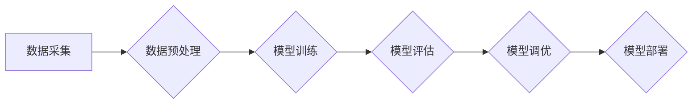

## AI大模型题材的追捧潮

> 关键词：大模型、深度学习、Transformer、自然语言处理、计算机视觉、生成式AI、伦理问题、未来趋势

### 1. 背景介绍

近年来，人工智能（AI）领域取得了令人瞩目的进展，其中大模型（Large Language Models，LLMs）的兴起无疑是其中最耀眼的明星。从 GPT-3 的惊艳亮相到 DALL-E 2 的图像生成能力，大模型正在以惊人的速度改变着我们与世界交互的方式。

大模型的出现，源于深度学习技术的飞速发展以及海量数据资源的积累。深度学习算法能够从海量数据中学习复杂的模式和关系，而大模型则通过拥有数亿甚至数十亿个参数，能够捕捉更精细、更抽象的知识。

### 2. 核心概念与联系

**2.1  大模型的概念**

大模型是指参数量巨大、训练数据规模庞大的深度学习模型。通常，参数量超过 100 Million 的模型被认为是大模型。

**2.2  大模型的类型**

大模型主要分为以下几种类型：

* **自然语言处理（NLP）大模型:** 主要用于处理文本数据，例如文本生成、翻译、问答、摘要等任务。代表模型包括 GPT-3、BERT、LaMDA 等。
* **计算机视觉（CV）大模型:** 主要用于处理图像和视频数据，例如图像识别、物体检测、图像生成等任务。代表模型包括 DALL-E 2、Stable Diffusion、Imagen 等。
* **多模态大模型:** 可以处理多种类型的数据，例如文本、图像、音频等。代表模型包括 CLIP、FLAN-T5 等。

**2.3  大模型的架构**

大模型通常基于 Transformer 架构，Transformer 是一种新型的神经网络架构，能够有效地处理序列数据，并具有强大的并行计算能力。

**2.4  大模型的训练**

大模型的训练需要大量的计算资源和时间。通常，需要使用分布式训练技术，将模型参数分布在多个机器上进行训练。

**Mermaid 流程图**



### 3. 核心算法原理 & 具体操作步骤

**3.1  算法原理概述**

Transformer 是一种基于注意力机制的神经网络架构，能够有效地处理序列数据。其核心思想是通过注意力机制，学习不同词语之间的关系，从而更好地理解文本的语义。

**3.2  算法步骤详解**

1. **输入嵌入:** 将输入的文本序列转换为向量表示。
2. **多头注意力:** 使用多头注意力机制，学习不同词语之间的关系。
3. **前馈神经网络:** 对每个词语的向量表示进行非线性变换。
4. **位置编码:** 添加位置信息，使模型能够理解词语在句子中的顺序。
5. **输出层:** 将模型的输出向量转换为目标语言的词语表示。

**3.3  算法优缺点**

**优点:**

* 能够有效地处理长序列数据。
* 具有强大的并行计算能力。
* 可以学习到复杂的语义关系。

**缺点:**

* 训练成本高，需要大量的计算资源和时间。
* 模型参数量大，容易过拟合。

**3.4  算法应用领域**

Transformer 架构在自然语言处理领域得到了广泛应用，例如：

* 机器翻译
* 文本摘要
* 问答系统
* 情感分析
* 代码生成

### 4. 数学模型和公式 & 详细讲解 & 举例说明

**4.1  数学模型构建**

Transformer 模型的数学模型主要基于以下几个核心组件：

* **注意力机制:** 用于学习不同词语之间的关系。
* **多头注意力:** 使用多个注意力头，学习不同类型的语义关系。
* **前馈神经网络:** 用于对每个词语的向量表示进行非线性变换。

**4.2  公式推导过程**

注意力机制的核心公式如下：

$$
Attention(Q, K, V) = softmax(\frac{QK^T}{\sqrt{d_k}})V
$$

其中：

* $Q$：查询矩阵
* $K$：键矩阵
* $V$：值矩阵
* $d_k$：键向量的维度
* $softmax$：softmax 函数

**4.3  案例分析与讲解**

假设我们有一个句子 "The cat sat on the mat"，我们需要计算 "cat" 和 "mat" 之间的注意力权重。

1. 将句子中的每个词语转换为向量表示。
2. 计算查询矩阵 $Q$ 和键矩阵 $K$。
3. 计算注意力分数 $QK^T/\sqrt{d_k}$。
4. 使用 softmax 函数将注意力分数归一化。
5. 将归一化后的注意力分数与值矩阵 $V$ 相乘，得到最终的注意力权重。

### 5. 项目实践：代码实例和详细解释说明

**5.1  开发环境搭建**

* Python 3.7+
* PyTorch 或 TensorFlow
* CUDA 和 cuDNN

**5.2  源代码详细实现**

```python
import torch
import torch.nn as nn

class Transformer(nn.Module):
    def __init__(self, vocab_size, embedding_dim, num_heads, num_layers):
        super(Transformer, self).__init__()
        self.embedding = nn.Embedding(vocab_size, embedding_dim)
        self.transformer_layers = nn.ModuleList([
            nn.TransformerEncoderLayer(embedding_dim, num_heads)
            for _ in range(num_layers)
        ])
        self.linear = nn.Linear(embedding_dim, vocab_size)

    def forward(self, x):
        x = self.embedding(x)
        for layer in self.transformer_layers:
            x = layer(x)
        x = self.linear(x)
        return x
```

**5.3  代码解读与分析**

* `__init__` 方法初始化模型参数，包括词嵌入层、Transformer 层和输出层。
* `forward` 方法定义模型的正向传播过程，将输入序列转换为输出序列。

**5.4  运行结果展示**

使用训练好的模型，可以对新的文本序列进行预测，例如生成文本、翻译文本等。

### 6. 实际应用场景

大模型在各个领域都有着广泛的应用场景：

* **自然语言处理:** 机器翻译、文本摘要、问答系统、聊天机器人、代码生成等。
* **计算机视觉:** 图像识别、物体检测、图像生成、视频分析等。
* **语音识别:** 语音转文本、语音合成等。
* **推荐系统:** 商品推荐、内容推荐等。
* **医疗保健:** 疾病诊断、药物研发等。

### 7. 工具和资源推荐

**7.1  学习资源推荐**

* **书籍:**
    * 《深度学习》
    * 《自然语言处理》
    * 《Transformer 详解》
* **在线课程:**
    * Coursera: 深度学习
    * Udacity: 自然语言处理
    * fast.ai: 深度学习

**7.2  开发工具推荐**

* **PyTorch:** 深度学习框架
* **TensorFlow:** 深度学习框架
* **Hugging Face Transformers:** 预训练 Transformer 模型库

**7.3  相关论文推荐**

* 《Attention Is All You Need》
* 《BERT: Pre-training of Deep Bidirectional Transformers for Language Understanding》
* 《GPT-3: Language Models are Few-Shot Learners》

### 8. 总结：未来发展趋势与挑战

**8.1  研究成果总结**

近年来，大模型在各个领域取得了令人瞩目的成果，例如在机器翻译、文本摘要、图像生成等任务上取得了显著的性能提升。

**8.2  未来发展趋势**

* **模型规模的进一步扩大:** 预计未来大模型的规模将继续扩大，参数量将达到数万亿甚至数千亿。
* **多模态大模型的开发:** 多模态大模型能够处理多种类型的数据，例如文本、图像、音频等，将更加广泛地应用于各个领域。
* **模型训练成本的降低:** 研究人员正在探索新的训练方法和硬件架构，以降低大模型的训练成本。
* **模型可解释性的提升:** 如何理解和解释大模型的决策过程是一个重要的研究方向。

**8.3  面临的挑战**

* **数据安全和隐私问题:** 大模型的训练需要大量的训练数据，如何保证数据安全和隐私是一个重要的挑战。
* **模型偏见和歧视问题:** 大模型可能存在偏见和歧视，需要采取措施来 mitigate 这些问题。
* **模型的可靠性和安全性:** 大模型的决策可能存在错误，需要确保模型的可靠性和安全性。

**8.4  研究展望**

未来，大模型研究将继续朝着更强大、更安全、更可解释的方向发展。


### 9. 附录：常见问题与解答

**9.1  什么是大模型？**

大模型是指参数量巨大、训练数据规模庞大的深度学习模型。

**9.2  大模型有哪些类型？**

大模型主要分为 NLP 大模型、CV 大模型和多模态大模型。

**9.3  大模型的训练成本高吗？**

是的，大模型的训练成本很高，需要大量的计算资源和时间。

**9.4  大模型有哪些应用场景？**

大模型在各个领域都有着广泛的应用场景，例如自然语言处理、计算机视觉、语音识别等。


作者：禅与计算机程序设计艺术 / Zen and the Art of Computer Programming 
