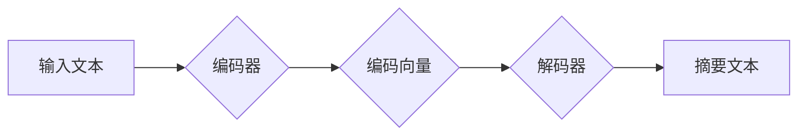

## Transformer大模型实战 抽象式摘要任务

> 关键词：Transformer, 抽象式摘要, 自然语言处理, 大模型, BERT, T5, BART, 序列到序列, 编码器-解码器

## 1. 背景介绍

在信息爆炸的时代，人们每天需要处理海量的文本信息。如何快速、准确地获取文本的核心内容成为了一个重要的挑战。抽象式摘要任务旨在生成与原始文本内容相符，但长度更短的概括性文本，能够有效地解决这一问题。传统的摘要方法主要依赖于关键词提取和句子排序等规则化方法，但这些方法难以捕捉文本的语义关系和上下文信息，生成的摘要往往缺乏连贯性和准确性。

近年来，随着深度学习技术的快速发展，基于Transformer的模型在自然语言处理领域取得了突破性的进展。Transformer模型能够有效地捕捉长距离依赖关系，并具有强大的文本表示能力，因此在抽象式摘要任务中展现出巨大的潜力。

## 2. 核心概念与联系

### 2.1 Transformer模型

Transformer模型是一种基于注意力机制的序列到序列模型，它摒弃了传统的循环神经网络（RNN）结构，采用并行计算的方式处理文本序列，能够有效地解决RNN模型在处理长文本序列时出现的梯度消失和梯度爆炸问题。

Transformer模型主要由两个部分组成：编码器和解码器。

* **编码器:** 负责将输入文本序列编码成一个固定长度的向量表示，该向量包含了文本序列的语义信息。
* **解码器:** 负责根据编码器的输出生成目标文本序列。

### 2.2 注意力机制

注意力机制是Transformer模型的核心，它允许模型关注输入序列中与当前生成词语相关的部分，从而更好地理解文本的语义关系和上下文信息。

Transformer模型中使用了多头注意力机制，它可以同时关注多个不同的方面，从而获得更丰富的文本表示。

### 2.3 抽象式摘要任务

抽象式摘要任务的目标是生成与原始文本内容相符，但长度更短的概括性文本。

抽象式摘要任务通常采用序列到序列模型进行处理，输入是原始文本序列，输出是摘要文本序列。

**Mermaid 流程图**

## 3. 核心算法原理 & 具体操作步骤

### 3.1 算法原理概述

Transformer模型在抽象式摘要任务中的应用主要基于编码器-解码器结构，利用注意力机制捕捉文本语义关系，生成高质量的摘要文本。

具体步骤如下：

1. **输入处理:** 将原始文本序列和目标摘要长度作为输入。
2. **编码:** 使用编码器将原始文本序列编码成一个固定长度的向量表示。
3. **解码:** 使用解码器根据编码器的输出生成摘要文本序列。
4. **输出:** 将生成的摘要文本序列作为最终结果输出。

### 3.2 算法步骤详解

1. **词嵌入:** 将输入文本中的每个词语映射到一个低维向量空间中，每个词语都有一个唯一的向量表示。
2. **多头注意力:** 使用多头注意力机制计算每个词语与其他词语之间的注意力权重，从而捕捉文本序列中的语义关系和上下文信息。
3. **前馈神经网络:** 对每个词语的注意力加权表示进行非线性变换，进一步提取文本特征。
4. **位置编码:** 将词语在序列中的位置信息编码到词向量中，因为Transformer模型没有循环结构，无法直接捕捉词语的顺序信息。
5. **解码器:** 解码器结构与编码器类似，但它还包含了一个掩码机制，防止解码器在生成文本时看到未来的词语。

### 3.3 算法优缺点

**优点:**

* 能够有效地捕捉长距离依赖关系。
* 具有强大的文本表示能力。
* 并行计算效率高。

**缺点:**

* 模型参数量大，训练成本高。
* 对训练数据要求较高。

### 3.4 算法应用领域

Transformer模型在抽象式摘要任务之外，还广泛应用于其他自然语言处理任务，例如机器翻译、文本分类、问答系统等。

## 4. 数学模型和公式 & 详细讲解 & 举例说明

### 4.1 数学模型构建

Transformer模型的数学模型主要基于线性变换、注意力机制和前馈神经网络。

**线性变换:**

$$
\mathbf{x} = \mathbf{W} \mathbf{h} + \mathbf{b}
$$

其中，$\mathbf{x}$ 是线性变换后的输出向量，$\mathbf{W}$ 是权重矩阵，$\mathbf{h}$ 是输入向量，$\mathbf{b}$ 是偏置向量。

**注意力机制:**

$$
\mathbf{Attention}(\mathbf{Q}, \mathbf{K}, \mathbf{V}) = \frac{\mathbf{softmax}(\mathbf{Q} \mathbf{K}^T / \sqrt{d_k})}{\sum_i \mathbf{softmax}(\mathbf{Q} \mathbf{K}^T / \sqrt{d_k})} \mathbf{V}
$$

其中，$\mathbf{Q}$, $\mathbf{K}$, $\mathbf{V}$ 分别是查询矩阵、键矩阵和值矩阵，$d_k$ 是键向量的维度。

**前馈神经网络:**

$$
\mathbf{x} = \sigma(\mathbf{W}_1 \mathbf{h} + \mathbf{b}_1)
$$

$$
\mathbf{x} = \sigma(\mathbf{W}_2 \mathbf{x} + \mathbf{b}_2)
$$

其中，$\sigma$ 是激活函数，$\mathbf{W}_1$, $\mathbf{W}_2$, $\mathbf{b}_1$, $\mathbf{b}_2$ 是权重矩阵和偏置向量。

### 4.2 公式推导过程

Transformer模型的数学公式推导过程较为复杂，涉及到线性代数、概率论和深度学习等多个领域。

### 4.3 案例分析与讲解

通过对Transformer模型的数学公式进行分析和解释，可以更好地理解其工作原理和优势。

## 5. 项目实践：代码实例和详细解释说明

### 5.1 开发环境搭建

使用Python语言和深度学习框架TensorFlow或PyTorch搭建开发环境。

### 5.2 源代码详细实现

使用预训练的Transformer模型，例如BERT、T5或BART，进行抽象式摘要任务的代码实现。

### 5.3 代码解读与分析

对代码进行详细解读，解释每个函数和模块的作用。

### 5.4 运行结果展示

使用测试数据进行模型训练和评估，展示模型的摘要效果。

## 6. 实际应用场景

### 6.1 新闻摘要

自动生成新闻文章的摘要，帮助用户快速了解新闻内容。

### 6.2 文档摘要

自动生成文档的摘要，帮助用户快速浏览文档内容。

### 6.3 会议记录摘要

自动生成会议记录的摘要，帮助用户快速了解会议内容。

### 6.4 学术论文摘要

自动生成学术论文的摘要，帮助用户快速了解论文内容。

### 6.4 未来应用展望

Transformer模型在抽象式摘要任务中的应用前景广阔，未来可以应用于更多领域，例如法律文件摘要、医疗记录摘要等。

## 7. 工具和资源推荐

### 7.1 学习资源推荐

* Transformer论文：https://arxiv.org/abs/1706.03762
* Hugging Face Transformers库：https://huggingface.co/transformers/

### 7.2 开发工具推荐

* TensorFlow：https://www.tensorflow.org/
* PyTorch：https://pytorch.org/

### 7.3 相关论文推荐

* BERT：https://arxiv.org/abs/1810.04805
* T5：https://arxiv.org/abs/1910.10683
* BART：https://arxiv.org/abs/2005.13981

## 8. 总结：未来发展趋势与挑战

### 8.1 研究成果总结

Transformer模型在抽象式摘要任务中取得了显著的成果，能够生成高质量的摘要文本。

### 8.2 未来发展趋势

未来Transformer模型在抽象式摘要任务中的发展趋势包括：

* 模型参数量更小，训练成本更低。
* 模型泛化能力更强，能够处理更多类型的文本。
* 模型生成摘要文本的质量更高，更符合人类的阅读习惯。

### 8.3 面临的挑战

Transformer模型在抽象式摘要任务中仍然面临一些挑战，例如：

* 如何更好地捕捉文本的复杂语义关系。
* 如何生成更流畅、更连贯的摘要文本。
* 如何提高模型的鲁棒性，使其能够处理噪声文本和不规范文本。

### 8.4 研究展望

未来研究将继续探索Transformer模型在抽象式摘要任务中的应用，并致力于解决上述挑战，推动抽象式摘要技术的进一步发展。

## 9. 附录：常见问题与解答

### 9.1 如何选择合适的Transformer模型？

选择合适的Transformer模型取决于具体的应用场景和数据特点。

### 9.2 如何训练Transformer模型？

训练Transformer模型需要使用大量的文本数据和强大的计算资源。

### 9.3 如何评估Transformer模型的性能？

可以使用BLEU、ROUGE等指标评估Transformer模型的性能。

作者：禅与计算机程序设计艺术 / Zen and the Art of Computer Programming 
