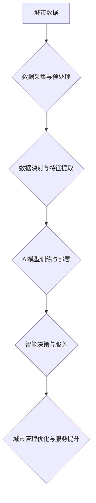

## 一切皆是映射：AI在智慧城市构建中的作用

> 关键词：人工智能、智慧城市、数据映射、预测建模、优化算法、机器学习、深度学习

### 1. 背景介绍

智慧城市，一个充满未来感的概念，正在逐渐从愿景走向现实。它旨在通过信息技术和数据驱动，提升城市管理效率、改善居民生活品质，构建更加宜居、可持续的城市环境。在这个过程中，人工智能（AI）扮演着越来越重要的角色，成为智慧城市建设的核心驱动力。

传统城市管理模式往往面临着数据孤岛、信息不对称、决策效率低等问题。而AI技术，凭借其强大的数据处理、分析和预测能力，能够有效解决这些痛点。AI算法可以从海量城市数据中挖掘出隐藏的规律和趋势，为城市规划、交通管理、环境监测、公共安全等领域提供精准的决策支持。

### 2. 核心概念与联系

**2.1 智慧城市概念**

智慧城市是一个以信息技术为基础，融合多种技术手段，实现城市资源优化配置、城市管理智能化、城市服务便捷化、城市生活智慧化和城市发展可持续化的新型城市形态。

**2.2 人工智能概念**

人工智能是指模拟人类智能行为的计算机系统。它涵盖了多个领域，包括机器学习、深度学习、自然语言处理、计算机视觉等。

**2.3 数据映射与AI**

数据映射是将现实世界中的实体、事件、关系等映射到数字模型的过程。在智慧城市建设中，数据映射是AI应用的基础。通过将城市数据进行标准化、结构化和可视化处理，可以为AI算法提供有效的输入，从而实现智能决策和服务。

**2.4 AI在智慧城市中的应用场景**

AI技术在智慧城市中的应用场景非常广泛，例如：

* **智慧交通:** 智能交通信号灯、自动驾驶、交通流量预测、拥堵路段预警等。
* **智慧城市管理:** 城市环境监测、资源管理、公共安全监控、应急预警等。
* **智慧生活:** 智能家居、智慧医疗、智慧教育、智慧娱乐等。

**2.5 AI应用架构**



### 3. 核心算法原理 & 具体操作步骤

**3.1 算法原理概述**

在智慧城市建设中，常用的AI算法包括机器学习、深度学习、强化学习等。

* **机器学习:** 通过训练模型，让算法从数据中学习规律，并对新数据进行预测或分类。
* **深度学习:** 基于多层神经网络，能够学习更复杂的特征，适用于图像识别、自然语言处理等领域。
* **强化学习:** 通过奖励机制，让算法在环境中学习最佳策略。

**3.2 算法步骤详解**

以机器学习为例，其基本步骤包括：

1. **数据收集与预处理:** 收集相关城市数据，并进行清洗、转换、特征工程等预处理工作。
2. **模型选择:** 根据具体应用场景选择合适的机器学习算法，例如线性回归、逻辑回归、决策树、支持向量机等。
3. **模型训练:** 使用训练数据训练模型，调整模型参数，使其能够准确预测或分类。
4. **模型评估:** 使用测试数据评估模型性能，例如准确率、召回率、F1-score等。
5. **模型部署:** 将训练好的模型部署到实际应用场景中，用于进行预测或分类。

**3.3 算法优缺点**

不同的AI算法具有不同的优缺点，需要根据具体应用场景进行选择。

* **机器学习:** 优点：易于理解和实现，适用于数据量较小的场景。缺点：对数据质量要求较高，难以学习复杂特征。
* **深度学习:** 优点：能够学习复杂特征，适用于数据量较大的场景。缺点：训练成本高，需要大量数据和计算资源。
* **强化学习:** 优点：能够学习最佳策略，适用于动态环境。缺点：训练过程复杂，需要设计合理的奖励机制。

**3.4 算法应用领域**

AI算法在智慧城市建设中应用广泛，例如：

* **交通预测:** 使用机器学习算法预测交通流量、拥堵路段等，为交通管理提供决策支持。
* **环境监测:** 使用机器学习算法分析环境数据，监测空气质量、水质等，及时预警环境问题。
* **公共安全:** 使用计算机视觉算法进行人脸识别、行为分析等，提高公共安全水平。

### 4. 数学模型和公式 & 详细讲解 & 举例说明

**4.1 数学模型构建**

在AI算法中，数学模型是描述算法逻辑和关系的抽象表示。例如，线性回归模型可以用以下公式表示：

$$y = mx + c$$

其中，$y$ 是预测值，$x$ 是输入特征，$m$ 是斜率，$c$ 是截距。

**4.2 公式推导过程**

线性回归模型的训练过程是通过最小化预测值与真实值的误差来调整模型参数。常用的误差函数是均方误差（MSE）：

$$MSE = \frac{1}{n} \sum_{i=1}^{n} (y_i - \hat{y}_i)^2$$

其中，$n$ 是样本数量，$y_i$ 是真实值，$\hat{y}_i$ 是预测值。

通过梯度下降算法，可以迭代更新模型参数，使得MSE最小化。

**4.3 案例分析与讲解**

假设我们想要预测城市人口增长率，可以使用线性回归模型。

* 输入特征：城市GDP、城市面积、城市人口等。
* 预测值：城市人口增长率。

通过训练模型，我们可以得到模型参数，并使用这些参数预测未来城市人口增长率。

### 5. 项目实践：代码实例和详细解释说明

**5.1 开发环境搭建**

* 操作系统：Windows/Linux/macOS
* Python版本：3.6+
* 必要的库：pandas、numpy、scikit-learn等

**5.2 源代码详细实现**

```python
import pandas as pd
from sklearn.linear_model import LinearRegression
from sklearn.model_selection import train_test_split

# 加载数据
data = pd.read_csv('city_data.csv')

# 划分训练集和测试集
X = data[['GDP', 'area', 'population']]
y = data['population_growth']
X_train, X_test, y_train, y_test = train_test_split(X, y, test_size=0.2, random_state=42)

# 创建线性回归模型
model = LinearRegression()

# 训练模型
model.fit(X_train, y_train)

# 预测测试集数据
y_pred = model.predict(X_test)

# 评估模型性能
from sklearn.metrics import mean_squared_error
mse = mean_squared_error(y_test, y_pred)
print(f'Mean Squared Error: {mse}')
```

**5.3 代码解读与分析**

* 代码首先加载城市数据，并划分训练集和测试集。
* 然后创建线性回归模型，并使用训练集训练模型。
* 训练完成后，使用测试集数据进行预测，并评估模型性能。

**5.4 运行结果展示**

运行代码后，会输出模型的均方误差（MSE）值，该值越小，模型的预测精度越高。

### 6. 实际应用场景

**6.1 智慧交通**

* **智能交通信号灯:** 使用AI算法分析交通流量数据，动态调整信号灯的绿灯时间，优化交通流量，减少拥堵。
* **自动驾驶:** 使用深度学习算法训练自动驾驶汽车，使其能够感知周围环境，做出安全驾驶决策。
* **交通流量预测:** 使用机器学习算法预测交通流量，为交通管理提供决策支持，例如预警拥堵路段、调整交通路线等。

**6.2 智慧城市管理**

* **城市环境监测:** 使用传感器数据和机器学习算法监测空气质量、水质、噪音等环境指标，及时预警环境问题。
* **资源管理:** 使用AI算法优化城市资源配置，例如水资源、能源资源等，提高资源利用效率。
* **公共安全监控:** 使用计算机视觉算法进行人脸识别、行为分析等，提高公共安全水平，例如监控犯罪行为、预防公共安全事故等。

**6.3 智慧生活**

* **智能家居:** 使用AI算法控制家居设备，例如灯光、空调、电视等，实现智能家居场景。
* **智慧医疗:** 使用机器学习算法辅助医生诊断疾病、预测患者风险，提高医疗服务质量。
* **智慧教育:** 使用AI算法个性化推荐学习资源，辅助学生学习，提高教育效率。

**6.4 未来应用展望**

随着AI技术的不断发展，其在智慧城市建设中的应用场景将更加广泛。例如：

* **城市规划:** 使用AI算法分析城市数据，预测城市发展趋势，为城市规划提供决策支持。
* **城市运营:** 使用AI算法优化城市运营流程，提高城市管理效率。
* **城市服务:** 使用AI算法提供更加个性化、智能化的城市服务。

### 7. 工具和资源推荐

**7.1 学习资源推荐**

* **在线课程:** Coursera、edX、Udacity等平台提供丰富的AI课程。
* **书籍:** 《深度学习》、《机器学习实战》等书籍是学习AI的基础教材。
* **开源社区:** TensorFlow、PyTorch等开源社区提供丰富的学习资源和代码示例。

**7.2 开发工具推荐**

* **Python:** 作为AI开发的主要语言，Python拥有丰富的AI库和工具。
* **Jupyter Notebook:** 用于编写和运行Python代码，方便进行数据分析和模型开发。
* **TensorFlow/PyTorch:** 深度学习框架，用于训练和部署深度学习模型。

**7.3 相关论文推荐**

* **AlphaGo论文:** 《Mastering the Game of Go with Deep Neural Networks and Tree Search》
* **BERT论文:** 《BERT: Pre-training of Deep Bidirectional Transformers for Language Understanding》
* **GPT-3论文:** 《Language Models are Few-Shot Learners》

### 8. 总结：未来发展趋势与挑战

**8.1 研究成果总结**

近年来，AI技术在智慧城市建设领域取得了显著成果，例如智能交通、环境监测、公共安全等领域取得了突破性进展。

**8.2 未来发展趋势**

* **边缘计算:** 将AI模型部署到边缘设备，实现更快速的决策和响应。
* **联邦学习:** 在不共享原始数据的情况下，训练联合模型，保护数据隐私。
* **跨模态学习:** 融合不同模态数据，例如文本、图像、音频等，实现更全面的城市理解。

**8.3 面临的挑战**

* **数据质量:** 智慧城市建设需要海量高质量数据，而数据质量问题仍然是一个挑战。
* **算法解释性:** 许多AI算法难以解释其决策过程，这可能会导致信任问题。
* **伦理问题:** AI技术的发展也带来了伦理问题，例如算法偏见、数据隐私等，需要认真思考和解决。

**8.4 研究展望**

未来，AI技术在智慧城市建设领域将继续发挥重要作用，我们需要不断探索新的应用场景，解决技术挑战，并关注AI技术的伦理问题，推动智慧城市建设朝着更加可持续、可信赖的方向发展。

### 9. 附录：常见问题与解答

**9.1 如何获取城市数据？**

城市数据可以从政府开放数据平台、第三方数据提供商、传感器网络等渠道获取。

**9.2 如何选择合适的AI算法？**

选择合适的AI算法需要根据具体应用场景、数据特点、模型性能等因素进行综合考虑。

**9.3 如何解决AI算法的解释性问题？**

可以使用可解释AI技术，例如LIME、SHAP等，解释AI算法的决策过程。


作者：禅与