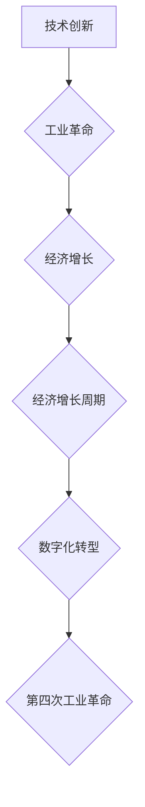

## 三次工业革命与经济增长周期

> 关键词：工业革命、经济增长、技术创新、数字化转型、人工智能、自动化、可持续发展

### 1. 背景介绍

人类社会的发展历程，可以被概括为一系列由技术创新驱动的经济增长周期。每一次工业革命都标志着生产方式、生活方式和社会结构的重大变革，并为经济增长注入新的动力。从蒸汽机到电力，再到互联网和人工智能，每一次革命都带来了前所未有的机遇和挑战。

回顾历史，我们可以看到三次工业革命对人类社会产生了深远的影响：

* **第一次工业革命（18世纪末-19世纪中期）：** 以蒸汽机为代表的新能源和新技术，推动了纺织、冶金、矿业等行业的机械化生产，标志着人类从农业社会向工业社会的过渡。
* **第二次工业革命（19世纪末-20世纪中期）：** 电力、内燃机、化学工业等技术的出现，加速了工业生产的规模化和自动化，促进了交通运输、通讯和消费品生产的发展。
* **第三次工业革命（20世纪末至今）：** 计算机、互联网、通讯技术等信息技术的飞速发展，开启了数字化时代，推动了全球经济一体化和信息化进程。

当前，我们正处于第四次工业革命的浪潮中，人工智能、物联网、云计算、大数据等新兴技术正在深刻地改变着生产方式、生活方式和社会结构。

### 2. 核心概念与联系

**2.1  工业革命的本质**

工业革命的核心是技术创新，它打破了传统生产方式的局限，带来了生产力的飞跃。每一次工业革命都伴随着新的能源、新的材料、新的生产工具和新的组织形式的出现，这些创新相互作用，共同推动了经济增长和社会进步。

**2.2  经济增长周期**

经济增长周期是指经济活动在一段时间内呈现的波动性变化，通常包括扩张期、顶峰期、衰退期和低谷期四个阶段。每一次工业革命都伴随着经济增长周期的加速和延长，但同时也带来了新的经济风险和挑战。

**2.3  技术创新与经济增长**

技术创新是经济增长的关键驱动力。每一次工业革命都带来了大量的技术创新，这些创新推动了生产力的提高、成本的降低、产品质量的提升和市场需求的扩大，最终促进了经济增长。

**2.4  数字化转型与第四次工业革命**

第四次工业革命的核心是数字化转型，它将信息技术与物理世界深度融合，创造出新的生产模式、商业模式和生活方式。数字化转型正在改变着各个行业和领域，为经济增长带来了新的机遇和挑战。

**Mermaid 流程图**



### 3. 核心算法原理 & 具体操作步骤

**3.1  算法原理概述**

在每一次工业革命中，都伴随着新的算法和计算模型的出现，这些算法和模型推动了生产力的提高和效率的提升。例如，第一次工业革命中，蒸汽机的原理推动了机械化生产；第二次工业革命中，内燃机的原理推动了交通运输的发展；第三次工业革命中，计算机算法推动了信息处理和数据分析的发展。

**3.2  算法步骤详解**

每一次工业革命的算法发展都遵循一定的步骤：

1. **问题识别:** 首先需要识别出需要解决的实际问题，例如提高生产效率、降低成本、改善产品质量等。
2. **模型构建:** 根据问题特点，构建相应的数学模型和算法框架。
3. **算法设计:** 设计具体的算法步骤和计算方法，并进行优化和改进。
4. **算法实现:** 将算法转化为可执行的代码，并进行测试和验证。
5. **应用推广:** 将算法应用到实际生产中，并进行评估和改进。

**3.3  算法优缺点**

每一次工业革命的算法都具有其独特的优缺点。例如，蒸汽机的算法简单易懂，但效率较低；内燃机的算法更加复杂，但效率更高；计算机算法则更加灵活和强大，但需要更高的计算能力和数据处理能力。

**3.4  算法应用领域**

每一次工业革命的算法都应用于不同的领域。例如，蒸汽机的算法应用于纺织、冶金、矿业等行业；内燃机的算法应用于交通运输、农业机械等行业；计算机算法应用于信息处理、数据分析、人工智能等领域。

### 4. 数学模型和公式 & 详细讲解 & 举例说明

**4.1  数学模型构建**

经济增长周期可以用数学模型来描述。例如，一个简单的经济增长模型可以表示为：

$$
Y_t = Y_{t-1} + g \cdot Y_{t-1}
$$

其中：

* $Y_t$ 表示时间t的经济产出
* $Y_{t-1}$ 表示时间t-1的经济产出
* $g$ 表示经济增长率

**4.2  公式推导过程**

这个公式表明，时间t的经济产出等于前一期的经济产出加上经济增长率乘以前一期的经济产出。

**4.3  案例分析与讲解**

如果经济增长率为5%，那么时间t的经济产出将是前一期的经济产出的1.05倍。

$$
Y_t = 1.05 \cdot Y_{t-1}
$$

例如，如果前一期的经济产出为1000亿元，那么时间t的经济产出将为1050亿元。

### 5. 项目实践：代码实例和详细解释说明

**5.1  开发环境搭建**

为了实现经济增长模型的计算，我们可以使用Python语言进行编程。需要安装Python环境和相关的库，例如NumPy和Matplotlib。

**5.2  源代码详细实现**

```python
import numpy as np
import matplotlib.pyplot as plt

# 设置初始经济产出和经济增长率
Y0 = 1000
g = 0.05

# 设置时间步长
t = np.arange(0, 10, 0.1)

# 计算经济产出
Y = Y0 * (1 + g)**t

# 绘制经济增长曲线
plt.plot(t, Y)
plt.xlabel('时间')
plt.ylabel('经济产出')
plt.title('经济增长模型')
plt.show()
```

**5.3  代码解读与分析**

这段代码首先定义了初始经济产出和经济增长率，然后使用NumPy库计算了不同时间点的经济产出。最后使用Matplotlib库绘制了经济增长曲线。

**5.4  运行结果展示**

运行这段代码后，会生成一个显示经济产出随时间变化的曲线图。

### 6. 实际应用场景

经济增长模型可以应用于以下场景：

* **宏观经济预测:** 预测未来经济产出的增长趋势。
* **政策制定:** 为制定经济政策提供参考依据。
* **企业投资决策:** 评估投资项目的风险和回报。

### 7. 工具和资源推荐

**7.1  学习资源推荐**

* **书籍:** 《经济学原理》、《宏观经济学》
* **在线课程:** Coursera、edX、Udacity

**7.2  开发工具推荐**

* **Python:** 语言环境、数据分析库、可视化库
* **R:** 统计分析语言

**7.3  相关论文推荐**

* **Solow Growth Model:** Robert Solow, 1956
* **Romer's Endogenous Growth Model:** Paul Romer, 1986

### 8. 总结：未来发展趋势与挑战

**8.1  研究成果总结**

三次工业革命和经济增长周期研究成果表明，技术创新是经济增长的关键驱动力，而每一次工业革命都伴随着新的算法和计算模型的出现。

**8.2  未来发展趋势**

第四次工业革命将继续推动经济增长和社会进步，人工智能、物联网、云计算等新兴技术将带来新的机遇和挑战。

**8.3  面临的挑战**

* **技术伦理:** 人工智能等新兴技术的应用需要考虑伦理问题，例如算法偏见、数据隐私等。
* **社会公平:** 技术进步带来的收益需要公平地分配，避免加剧社会不平等。
* **可持续发展:** 需要关注技术进步对环境和资源的利用，实现可持续发展。

**8.4  研究展望**

未来研究需要关注以下方面：

* **人工智能算法的优化和改进:** 开发更智能、更安全、更可靠的人工智能算法。
* **数据驱动的经济增长模型:** 建立更精准、更有效的经济增长模型，为政策制定提供更科学的依据。
* **技术与社会融合:** 研究技术进步对社会的影响，并探索技术与社会和谐共生的路径。

### 9. 附录：常见问题与解答

**9.1  问题:** 如何衡量经济增长的速度？

**9.2  解答:** 经济增长的速度通常用经济增长率来衡量，经济增长率是指一段时间内经济产出的增长率。

**9.3  问题:**  第四次工业革命会带来哪些新的机遇？

**9.4  解答:** 第四次工业革命将带来许多新的机遇，例如：

* **智能制造:** 利用人工智能和自动化技术提高生产效率和产品质量。
* **个性化服务:** 利用大数据和人工智能技术提供更加个性化的产品和服务。
* **远程医疗:** 利用远程医疗技术提高医疗服务的可及性和效率。

**9.5  问题:** 第四次工业革命会带来哪些新的挑战？

**9.6  解答:** 第四次工业革命也带来了一些新的挑战，例如：

* **就业问题:** 自动化技术可能会导致部分工作岗位消失。
* **数据安全:** 大数据时代，数据安全问题更加突出。
* **伦理问题:** 人工智能等新兴技术的应用需要考虑伦理问题。


作者：禅与计算机程序设计艺术 / Zen and the Art of Computer Programming 
