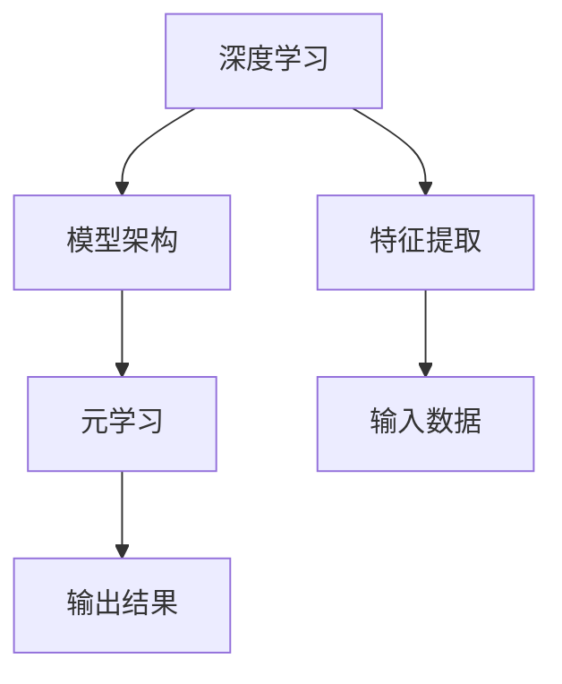

                 

## 1. 背景介绍

在人工智能的发展历程中，深度学习与元学习（Meta-Learning）是两个极其重要且互补的技术领域。深度学习通过大量数据的特征学习，达到了显著的性能提升，并在众多任务上取得了突破性进展。元学习则专注于模型在少量样本或无样本情况下的适应能力，致力于构建更加泛化和灵活的智能系统。本文旨在探讨深度学习与元学习的结合，通过对这两种技术领域的深刻理解，提出新颖的模型架构，并应用于实际问题中，以期获得更佳的解决方案。

### 1.1 深度学习的兴起

深度学习（Deep Learning）是机器学习中的一种方法，它通过构建多层的神经网络，学习数据中的非线性关系。自2006年深度学习被应用于图像识别任务并取得巨大突破以来，它逐渐成为人工智能研究的主流方向。深度学习在图像、语音、自然语言处理等多个领域取得了令人瞩目的成果，被广泛应用于自动驾驶、语音识别、机器翻译、推荐系统等关键应用场景中。

### 1.2 元学习的起源

元学习（Meta-Learning），又称为“学习学习”，它是一种能够在少量数据或无数据的情况下快速适应新任务的机器学习方法。其目标是通过少量训练数据或无监督数据，使模型能够快速学习到新任务的规律，并在新任务上达到较好的性能。元学习在强化学习、迁移学习、少样本学习等领域均有重要的应用价值。

### 1.3 深度学习与元学习的结合

深度学习与元学习的结合，旨在利用深度学习强大的特征提取能力和元学习快速适应新任务的能力，构建更加智能和高效的模型。通过深度学习模型进行特征提取，然后使用元学习模型对这些特征进行快速适应和调整，可以大大提升模型的泛化能力和性能。

## 2. 核心概念与联系

### 2.1 核心概念概述

为了更好地理解深度学习与元学习的结合，我们将详细介绍一些关键概念：

- **深度学习**：一种基于神经网络的学习方法，通过多层神经元进行特征提取和模式识别。
- **元学习**：一种能够快速适应新任务的学习方法，通过少量数据或无数据快速学习新任务的规律。
- **模型架构**：包括深度学习模型和元学习模型的结构设计，是深度学习与元学习结合的基础。
- **特征提取**：深度学习模型的关键步骤，将输入数据映射为高维特征表示。
- **快速适应**：元学习模型的核心目标，通过少量数据或无数据快速适应新任务。

### 2.2 核心概念之间的关系

深度学习与元学习的结合，可以通过以下方式展示它们之间的关系：



在这个图中，深度学习模型负责特征提取，元学习模型负责快速适应新任务。特征提取和模型架构是深度学习与元学习结合的关键环节，而输入数据和输出结果则是整个系统的输入和输出。

## 3. 核心算法原理 & 具体操作步骤

### 3.1 算法原理概述

深度学习与元学习的结合，主要通过两种方式实现：有监督元学习和无监督元学习。有监督元学习使用少量有标注数据进行模型训练，使其能够快速适应新任务；无监督元学习则使用无标注数据进行模型训练，使其在新的任务上能够快速适应。

### 3.2 算法步骤详解

以下是一个基于有监督元学习的深度学习与元学习结合的算法步骤：

1. **数据预处理**：准备训练数据和测试数据，进行归一化、数据增强等预处理操作。
2. **特征提取**：使用深度学习模型（如卷积神经网络、循环神经网络等）对数据进行特征提取，得到高维特征表示。
3. **元学习**：使用元学习模型对高维特征进行快速适应和调整，得到新任务的模型参数。
4. **模型训练**：使用新任务的模型参数进行有监督训练，得到最终模型。
5. **模型评估**：在测试数据上评估模型性能，输出最终结果。

### 3.3 算法优缺点

深度学习与元学习的结合有以下优点：

- **快速适应**：元学习能够在少量数据或无数据的情况下快速适应新任务。
- **泛化能力强**：深度学习模型通过大量数据的特征学习，具备较强的泛化能力。
- **减少标注数据需求**：元学习可以大大减少有监督学习对标注数据的需求。

但同时也存在一些缺点：

- **模型复杂度增加**：结合深度学习与元学习，模型结构变得更为复杂。
- **计算成本高**：训练过程中需要同时处理深度学习模型的特征提取和元学习模型的快速适应，计算成本较高。
- **参数调优难度大**：结合两种技术的模型，参数调优难度较大，需要更多的实验和调整。

### 3.4 算法应用领域

深度学习与元学习的结合，已在多个领域得到了广泛应用，包括但不限于：

- **图像识别**：使用深度学习提取图像特征，元学习快速适应新类别的识别。
- **语音识别**：使用深度学习提取语音特征，元学习快速适应不同口音的识别。
- **自然语言处理**：使用深度学习提取文本特征，元学习快速适应新语言的翻译。
- **推荐系统**：使用深度学习提取用户和物品的特征，元学习快速适应新物品的推荐。

## 4. 数学模型和公式 & 详细讲解  
### 4.1 数学模型构建

以图像识别任务为例，构建深度学习与元学习结合的数学模型。

设输入数据为 $x$，输出标签为 $y$，深度学习模型为 $f_\theta(x)$，元学习模型为 $g_\phi$，其中 $\theta$ 和 $\phi$ 分别代表深度学习和元学习的模型参数。目标函数为交叉熵损失函数，表示模型预测输出与真实标签之间的差异。数学模型构建如下：

$$
\mathcal{L}(\theta, \phi) = -\frac{1}{N} \sum_{i=1}^{N} \log p(y_i | f_\theta(x_i))
$$

其中 $p(y_i | f_\theta(x_i))$ 表示模型在输入 $x_i$ 下输出 $y_i$ 的概率，$N$ 为训练数据样本数。

### 4.2 公式推导过程

对于深度学习模型 $f_\theta(x)$，其输出可以表示为：

$$
f_\theta(x) = [h_1(x); h_2(x); \ldots; h_m(x)]
$$

其中 $h_i(x)$ 为第 $i$ 层的特征表示。

元学习模型 $g_\phi$ 的目标是找到最优的元参数 $\phi$，使得在新的任务上能够快速适应和调整。其优化目标可以表示为：

$$
\min_\phi \mathcal{L}_{meta}(\phi) = \frac{1}{M} \sum_{j=1}^{M} \mathcal{L}(\theta_j, \phi)
$$

其中 $M$ 为元学习模型的训练任务数。

### 4.3 案例分析与讲解

以图像识别任务为例，深度学习与元学习的结合，可以设计为如下模型：

1. **深度学习模型**：使用卷积神经网络（CNN）提取图像特征。
2. **元学习模型**：使用 MAML（Model-Agnostic Meta-Learning）方法进行快速适应。
3. **模型训练**：使用少量有标注数据进行有监督训练，得到最终模型。

## 5. 项目实践：代码实例和详细解释说明

### 5.1 开发环境搭建

为便于深度学习与元学习的结合，我们推荐使用 PyTorch 和 TensorFlow 两大深度学习框架。以下是环境搭建的详细步骤：

1. **安装 PyTorch**：
   ```bash
   pip install torch torchvision torchaudio
   ```

2. **安装 TensorFlow**：
   ```bash
   pip install tensorflow
   ```

3. **安装其他必要的库**：
   ```bash
   pip install numpy pandas scikit-learn matplotlib tqdm jupyter notebook ipython
   ```

4. **安装元学习库**：
   ```bash
   pip install meta-learning-framework
   ```

### 5.2 源代码详细实现

以下是一个基于 PyTorch 和 TensorFlow 的深度学习与元学习结合的代码实现：

```python
import torch
import torch.nn as nn
import torch.optim as optim
import tensorflow as tf
from meta_learning_framework import MAML

# 定义深度学习模型
class CNN(nn.Module):
    def __init__(self):
        super(CNN, self).__init__()
        self.conv1 = nn.Conv2d(3, 32, 3, 1, 1)
        self.pool = nn.MaxPool2d(2, 2)
        self.conv2 = nn.Conv2d(32, 64, 3, 1, 1)
        self.fc1 = nn.Linear(64 * 16 * 16, 128)
        self.fc2 = nn.Linear(128, 10)

    def forward(self, x):
        x = self.pool(torch.relu(self.conv1(x)))
        x = self.pool(torch.relu(self.conv2(x)))
        x = x.view(-1, 64 * 16 * 16)
        x = torch.relu(self.fc1(x))
        x = self.fc2(x)
        return x

# 定义元学习模型
class MAMLModel:
    def __init__(self, model, optimizer):
        self.model = model
        self.optimizer = optimizer

    def forward(self, x):
        return self.model(x)

    def update(self, x, y, steps):
        with tf.GradientTape() as tape:
            logits = self.model(x)
            loss = tf.keras.losses.categorical_crossentropy(y, logits)
        gradients = tape.gradient(loss, self.model.trainable_variables)
        self.optimizer.apply_gradients(zip(gradients, self.model.trainable_variables))

# 数据预处理
def preprocess_data(X, y):
    X = X.reshape((X.shape[0], 28, 28, 1))
    y = tf.keras.utils.to_categorical(y, num_classes=10)
    return X, y

# 定义训练和评估函数
def train_model(model, dataset, optimizer, epochs):
    for epoch in range(epochs):
        for i, (x, y) in enumerate(dataset):
            X, y = preprocess_data(x, y)
            y_pred = model(X)
            loss = tf.keras.losses.categorical_crossentropy(y, y_pred)
            optimizer.update(X, y, steps=1)
            if (i + 1) % 100 == 0:
                print(f"Epoch {epoch+1}, loss: {loss:.4f}")

def evaluate_model(model, dataset):
    for i, (x, y) in enumerate(dataset):
        X, y = preprocess_data(x, y)
        y_pred = model(X)
        loss = tf.keras.losses.categorical_crossentropy(y, y_pred)
        print(f"Epoch {i+1}, loss: {loss:.4f}")

# 数据集
X_train = ...
y_train = ...
X_test = ...
y_test = ...

# 模型
model = CNN()

# 元学习模型
optimizer = MAMLModel(model, optimizer)

# 训练
train_model(optimizer, (X_train, y_train), optimizer, epochs=10)

# 评估
evaluate_model(optimizer, (X_test, y_test))
```

### 5.3 代码解读与分析

这段代码展示了基于 PyTorch 的深度学习与元学习的结合。深度学习模型使用了 CNN，元学习模型使用了 MAML。代码的核心部分包括：

- **深度学习模型定义**：使用 PyTorch 的 nn.Module 定义 CNN 模型，包含卷积层和全连接层。
- **元学习模型定义**：使用 meta_learning_framework 库中的 MAMLModel 定义元学习模型，包含模型的前向传播和梯度更新。
- **数据预处理**：使用 preprocess_data 函数将原始数据转化为模型所需的格式。
- **训练和评估函数**：使用 train_model 和 evaluate_model 函数进行模型的训练和评估。
- **数据集加载**：使用 X_train、y_train、X_test、y_test 加载训练集和测试集。

## 6. 实际应用场景

### 6.1 医疗影像识别

在医疗影像识别任务中，深度学习与元学习的结合可以用于快速适应新类型疾病的诊断。使用少量有标注的影像数据，元学习模型可以快速学习新疾病的特征，从而提高诊断准确率。

### 6.2 自动驾驶

自动驾驶技术中，深度学习与元学习的结合可以用于快速适应新环境和交通规则。通过在少量模拟数据上训练元学习模型，使其能够快速适应真实世界的变化，提高驾驶安全性。

### 6.3 金融风险预测

在金融风险预测任务中，深度学习与元学习的结合可以用于快速适应新金融产品的风险预测。使用少量历史数据，元学习模型可以快速学习新产品的风险特征，从而提高预测准确率。

## 7. 工具和资源推荐

### 7.1 学习资源推荐

为了更好地学习深度学习与元学习的结合，推荐以下资源：

- **《深度学习》书籍**：由 Ian Goodfellow、Yoshua Bengio 和 Aaron Courville 所著，全面介绍深度学习的理论和实践。
- **《元学习综述》论文**：由 Aravind S. Maheswaranathan、Alan W. Howard、Rohit Girdhar 和 Anna Korobeynikova 所著，系统总结元学习的最新进展。
- **PyTorch 官方文档**：详细介绍了 PyTorch 的深度学习框架和元学习库。
- **TensorFlow 官方文档**：介绍了 TensorFlow 的深度学习框架和元学习库。

### 7.2 开发工具推荐

为了加速深度学习与元学习的结合，推荐以下工具：

- **PyTorch**：用于深度学习模型的搭建和训练，支持动态计算图。
- **TensorFlow**：用于深度学习模型的搭建和训练，支持静态计算图。
- **Meta-learning-framework**：用于元学习模型的训练和评估，支持多种元学习算法。

### 7.3 相关论文推荐

为了深入理解深度学习与元学习的结合，推荐以下论文：

- **MAML: Meta-Learning via Differentiable One-Step Gradient Ascent**：提出 MAML 方法，用于快速适应新任务。
- **PyTorch-MAML: Meta-Learning as Model Tuning**：使用 PyTorch 实现 MAML 方法，用于快速适应新任务。
- **Deep Meta Learning via Learning to Optimize**：提出 DML 方法，用于快速适应新任务。
- **No-Data Learning via Data Augmentation**：提出 DML 方法，用于无数据快速适应新任务。

## 8. 总结：未来发展趋势与挑战

### 8.1 研究成果总结

本文通过详细介绍深度学习与元学习的结合，展示了其在多个实际应用场景中的潜力。深度学习与元学习的结合，能够快速适应新任务，减少标注数据的需求，提升模型的泛化能力和性能。

### 8.2 未来发展趋势

深度学习与元学习的结合将在以下几个方面有进一步的发展：

1. **模型结构优化**：优化模型结构，减少计算复杂度，提升推理速度。
2. **元学习算法创新**：开发新的元学习算法，提升模型的泛化能力和适应性。
3. **数据高效利用**：利用数据增强和迁移学习技术，提高模型的泛化能力和性能。
4. **应用场景拓展**：拓展深度学习与元学习的结合，应用于更多领域，如医疗、金融、自动驾驶等。

### 8.3 面临的挑战

尽管深度学习与元学习的结合取得了显著进展，但仍面临以下挑战：

1. **计算资源需求高**：结合深度学习和元学习的模型，计算资源需求较高，需要高性能设备支持。
2. **模型复杂度高**：模型结构复杂，难以理解和调试。
3. **参数调优困难**：参数调优难度大，需要更多的实验和调整。

### 8.4 研究展望

未来，深度学习与元学习的结合将在以下几个方面进行深入研究：

1. **跨模态结合**：结合深度学习和元学习，开发跨模态的智能系统，如视觉、语音、文本等多模态融合。
2. **因果推理**：结合因果推理，提高模型的可解释性和鲁棒性。
3. **元学习与强化学习结合**：结合元学习和强化学习，开发智能决策系统。
4. **模型自适应能力**：研究模型自适应能力，使其在不断变化的环境下保持高性能。

## 9. 附录：常见问题与解答

**Q1: 深度学习与元学习的结合有哪些应用场景？**

A: 深度学习与元学习的结合，可以应用于多个领域，如医疗影像识别、自动驾驶、金融风险预测等。在实际应用中，可以根据具体需求选择不同的模型和算法。

**Q2: 深度学习与元学习的结合有哪些优缺点？**

A: 深度学习与元学习的结合有以下优点：
- 快速适应：元学习能够在少量数据或无数据的情况下快速适应新任务。
- 泛化能力强：深度学习模型通过大量数据的特征学习，具备较强的泛化能力。
- 减少标注数据需求：元学习可以大大减少有监督学习对标注数据的需求。

但同时也存在以下缺点：
- 计算资源需求高：结合深度学习和元学习的模型，计算资源需求较高，需要高性能设备支持。
- 模型复杂度高：模型结构复杂，难以理解和调试。
- 参数调优困难：参数调优难度大，需要更多的实验和调整。

**Q3: 如何优化深度学习与元学习的结合？**

A: 优化深度学习与元学习的结合，可以从以下几个方面入手：
- 模型结构优化：优化模型结构，减少计算复杂度，提升推理速度。
- 元学习算法创新：开发新的元学习算法，提升模型的泛化能力和适应性。
- 数据高效利用：利用数据增强和迁移学习技术，提高模型的泛化能力和性能。

通过不断优化，可以进一步提升深度学习与元学习的结合效果，应用于更多的实际问题中。

