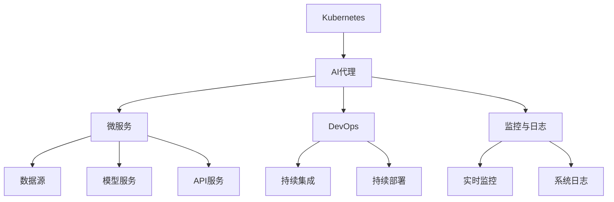

                 

## 1. 背景介绍

### 1.1 问题由来

随着人工智能（AI）技术的迅猛发展，云计算环境中越来越多地部署和使用AI模型，以提升自动化处理和决策能力。然而，大规模分布式环境中AI模型的设计、开发、部署、运维、更新和监控变得越来越复杂。

AI模型的执行通常涉及到多个组件，如数据源、API服务、模型服务、计算资源、存储等。各组件之间的通信和协调需要严谨的编排，才能确保模型执行的效率和可靠性。

因此，需要一种高效、灵活、可扩展的AI代理工作流系统，以实现自动化管理这些组件。AI代理工作流系统旨在帮助开发人员和运维人员更加方便地设计、执行、监控和优化AI模型。

### 1.2 问题核心关键点

目前，云计算环境中AI代理工作流的主要挑战包括：

- 复杂性：在分布式环境中设计、构建和部署AI模型具有很高的复杂度。
- 效率：模型训练和推理需要高效的资源管理，才能保证执行效率。
- 可靠性：需要确保系统的高可用性和稳定性，才能提供可靠的服务。
- 可扩展性：模型服务需要支持大规模和多样化的任务，具有较强的可扩展性。
- 监控和调试：实时监控和调试系统性能，及时发现和修复问题。

针对这些问题，本文将介绍一种基于Kubernetes的AI代理工作流设计方案，该方案具有灵活、高效、可扩展的特点。

## 2. 核心概念与联系

### 2.1 核心概念概述

为更好地理解基于Kubernetes的AI代理工作流方案，我们首先介绍几个核心概念：

- **Kubernetes**：容器编排系统，用于自动化部署、扩展和管理容器化应用。
- **AI代理**：自动化管理AI模型执行的系统，通常包括数据源、模型服务、API服务等组件。
- **微服务架构**：将AI代理拆分为多个小服务，每个服务负责单一功能模块，提升系统的可扩展性和灵活性。
- **DevOps**：集成开发（Dev）和持续集成/持续交付（Ops），通过持续构建和部署，提升系统交付速度和质量。
- **监控与日志**：实时监控系统性能和资源使用情况，记录系统运行日志，以便调试和优化。

这些概念共同构成了基于Kubernetes的AI代理工作流方案的基础。下面我们通过一个Mermaid流程图来展示这些概念之间的联系：



这个流程图展示了大规模分布式环境中AI代理工作流各个组件之间的关系：

1. **Kubernetes**作为容器编排系统，提供自动化部署、扩展和管理容器的能力。
2. **AI代理**通过微服务架构拆分，增强系统灵活性和可扩展性。
3. **DevOps**用于自动化构建、测试和部署AI模型。
4. **监控与日志**实时监控系统性能和记录系统运行日志，用于调试和优化。
5. **数据源、模型服务、API服务**等是AI代理的核心组件，负责具体任务的处理。

## 3. 核心算法原理 & 具体操作步骤

### 3.1 算法原理概述

基于Kubernetes的AI代理工作流主要遵循以下设计原则：

- **容器化**：将AI模型和其依赖项打包为容器，方便管理和部署。
- **微服务化**：将AI代理拆分为多个微服务，每个微服务负责单一功能模块，提高系统的可扩展性和灵活性。
- **编排自动化**：通过Kubernetes进行容器编排，自动化管理容器的生命周期，提升系统效率和可靠性。
- **DevOps**：采用持续集成和持续部署的自动化流程，快速构建和部署AI模型，提升系统交付速度和质量。
- **监控与日志**：实时监控系统性能和记录系统运行日志，以便调试和优化。

### 3.2 算法步骤详解

基于Kubernetes的AI代理工作流一般包括以下几个关键步骤：

**Step 1: 准备环境**

- 安装Kubernetes集群，并配置好所需的资源。
- 部署数据源、模型服务、API服务等组件，确保它们能够相互通信。
- 配置持续集成和持续部署工具，如Jenkins、GitLab CI/CD等。
- 配置监控与日志系统，如Prometheus、Grafana、ELK Stack等。

**Step 2: 设计微服务架构**

- 将AI代理拆分为多个小服务，每个服务负责单一功能模块。
- 确定各个微服务之间的接口和通信协议。
- 设计微服务之间的数据流和依赖关系。

**Step 3: 实现AI模型部署**

- 将AI模型及其依赖项打包为容器镜像，并上传到容器仓库。
- 在Kubernetes中创建服务定义（Service）和部署定义（Deployment）。
- 通过Deployment定义容器镜像，并设置必要的参数（如CPU、内存、磁盘等）。
- 通过Service定义服务端点（Endpoint），配置服务发现机制。

**Step 4: 实施持续集成与持续部署**

- 在开发环境中部署持续集成（CI）工具，配置自动化测试流程。
- 通过CI工具自动构建和测试AI模型，生成容器镜像。
- 部署持续部署（CD）工具，自动将新构建的镜像推送到容器仓库。
- 通过CD工具在生产环境中自动部署新镜像，替换旧镜像。

**Step 5: 实施监控与日志**

- 部署监控系统，如Prometheus，监控各个服务的资源使用情况。
- 部署日志收集系统，如Elasticsearch、Logstash、Kibana（ELK Stack），收集和分析系统日志。
- 配置报警规则，设置阈值，一旦系统性能异常，自动触发报警。

**Step 6: 优化性能**

- 定期评估系统性能，通过监控数据和日志分析系统瓶颈。
- 优化资源分配，调整容器参数，提升系统效率。
- 优化模型执行流程，减少资源消耗，提升推理速度。

### 3.3 算法优缺点

基于Kubernetes的AI代理工作流具有以下优点：

- **高效性**：自动化管理和编排容器，提升系统部署和扩展效率。
- **灵活性**：微服务架构，增强系统可扩展性和灵活性。
- **可靠性**：通过Kubernetes保证容器的高可用性和稳定性。
- **可扩展性**：支持大规模和多样化的任务，满足不同业务需求。
- **监控和调试**：实时监控和记录系统运行日志，便于调试和优化。

同时，该方案也存在一些缺点：

- **复杂性**：需要熟悉Kubernetes、微服务架构、持续集成、持续部署等技术。
- **学习曲线**：系统设计复杂，需要较长时间的学习和实践。
- **部署成本**：需要搭建和管理Kubernetes集群，增加了硬件和运维成本。
- **性能损耗**：过多的容器和网络通信可能会带来一定的性能损耗。

### 3.4 算法应用领域

基于Kubernetes的AI代理工作流适用于以下场景：

- **大规模数据处理**：如机器学习模型训练和推理。
- **分布式任务管理**：如多用户数据同步和任务调度。
- **实时计算**：如视频流处理和实时分析。
- **自动化运维**：如监控、日志管理、自动化告警。
- **人工智能应用**：如推荐系统、智能客服、智能语音等。

## 4. 数学模型和公式 & 详细讲解 & 举例说明

### 4.1 数学模型构建

本节将使用数学语言对基于Kubernetes的AI代理工作流进行更加严格的刻画。

记Kubernetes集群的节点数为N，资源池（Resource Pool）的资源为C，AI代理服务的负载为L。则系统整体的性能瓶颈点可能出现在以下三个方面：

- **资源池**：当资源池资源不足时，会影响所有AI代理服务的运行。
- **AI代理**：当某AI代理服务负载过重时，会影响其吞吐量和响应时间。
- **网络通信**：当网络通信瓶颈时，会影响服务之间的通信效率。

系统整体性能可以用瓶颈点理论来建模：

$$
\text{系统性能} = \min(\text{资源池性能}, \text{AI代理性能}, \text{网络通信性能})
$$

其中，资源池性能、AI代理性能和网络通信性能的计算公式如下：

- **资源池性能**：
  $$
  \text{资源池性能} = \min(C/L, C/N)
  $$
  表示资源池资源充足时的性能瓶颈点可能出现在负载L或节点数N上。

- **AI代理性能**：
  $$
  \text{AI代理性能} = \min(L/C, L/N)
  $$
  表示AI代理服务资源充足时的性能瓶颈点可能出现在资源池资源C或节点数N上。

- **网络通信性能**：
  $$
  \text{网络通信性能} = \min(带宽/网络延迟, 带宽/服务数量)
  $$
  表示网络带宽和延迟共同决定的网络性能瓶颈点可能出现在带宽、网络延迟或服务数量上。

### 4.2 公式推导过程

以下我们以资源池性能为例，推导瓶颈点公式的计算过程。

假设资源池的总资源为C，单个AI代理服务的资源需求为L。则每个AI代理服务的性能计算公式为：

$$
\text{AI代理性能} = \frac{C}{L}
$$

当资源池资源充足时，系统整体性能瓶颈点可能出现在单个AI代理服务性能和节点数之间。假设AI代理服务数量为N，则系统整体性能瓶颈点计算公式为：

$$
\text{系统性能} = \min(\frac{C}{L}, \frac{C}{L}\frac{1}{N})
$$

其中，$\frac{C}{L}$表示单个AI代理服务的性能瓶颈点，$\frac{C}{L}\frac{1}{N}$表示节点数N对系统性能的影响。

在实际系统中，需要根据具体的资源配置和负载情况，计算系统性能瓶颈点，从而制定相应的优化策略。

### 4.3 案例分析与讲解

假设我们有一个AI代理工作流系统，部署在Kubernetes集群中，运行两个AI代理服务，每个服务资源需求为1核CPU、1GB内存。资源池总资源为3核CPU、3GB内存。系统负载为2。

根据瓶颈点理论，系统性能瓶颈点计算如下：

- 单个AI代理服务的性能瓶颈点为$\frac{3}{1}=3$（CPU），$\frac{3}{1}=3$（内存）。
- 两个AI代理服务的性能瓶颈点为$\frac{3}{2}=1.5$（CPU），$\frac{3}{2}=1.5$（内存）。
- 网络通信性能瓶颈点为$\frac{3}{2}=1.5$（带宽），$\frac{3}{2}=1.5$（网络延迟）。

综合考虑三个方面的性能瓶颈点，系统整体性能瓶颈点可能出现在CPU或网络通信性能上。为了优化系统性能，可以采取以下措施：

- 增加CPU资源，满足AI代理服务的需求。
- 优化网络通信，提高网络带宽和降低延迟。
- 增加节点数，分散负载，提升系统整体性能。

## 5. 项目实践：代码实例和详细解释说明

### 5.1 开发环境搭建

在进行AI代理工作流实践前，我们需要准备好开发环境。以下是使用Python进行Kubernetes开发的环境配置流程：

1. 安装Kubernetes集群：按照官方文档搭建Kubernetes集群，包括Minikube、Rancher等。
2. 安装Kubernetes客户端工具：安装kubectl命令行工具，配置集群连接。
3. 安装Helm：Helm是Kubernetes的包管理工具，用于封装和管理Kubernetes资源。

完成上述步骤后，即可在Kubernetes集群中开始AI代理工作流实践。

### 5.2 源代码详细实现

下面我们以数据同步和模型训练为例，给出使用Kubernetes实现AI代理工作流的PyTorch代码实现。

首先，定义数据同步和模型训练的Kubernetes资源定义：

```python
# data-sync.yaml
apiVersion: v1
kind: ServiceAccount
metadata:
  name: data-sync-sa
  labels:
    hello: world
---

# model-train.yaml
apiVersion: v1
kind: Deployment
metadata:
  name: model-train
spec:
  replicas: 3
  selector:
    matchLabels:
      hello: world
  template:
    metadata:
      labels:
        hello: world
    spec:
      containers:
      - name: model-train
        image: <model-train-image>
        ports:
        - containerPort: 8080
        resources:
          requests:
            cpu: "1"
            memory: "1Gi"
---
# training-service.yaml
apiVersion: v1
kind: Service
metadata:
  name: model-train-service
spec:
  selector:
    hello: world
  ports:
    - port: 8080
      targetPort: 8080
```

然后，使用Helm部署这些资源定义：

```bash
helm repo add hello-world https://charts.hello-world.example.com
helm install data-sync --set data-sync.image=<data-sync-image> hello-world/data-sync
helm install model-train --set model-train.image=<model-train-image> hello-world/model-train
helm install training-service --set training-service.image=<training-service-image> hello-world/training-service
```

最后，启动数据同步和模型训练：

```bash
kubectl apply -f data-sync.yaml
kubectl apply -f model-train.yaml
kubectl apply -f training-service.yaml

kubectl get pods
kubectl get svc
```

可以看到，通过Helm可以快速部署和启动数据同步和模型训练服务。同时，通过kubectl可以查看服务状态和容器资源使用情况，便于监控和调试。

### 5.3 代码解读与分析

让我们再详细解读一下关键代码的实现细节：

**data-sync.yaml**：
- 定义了一个ServiceAccount，用于授权数据同步任务。
- 设置标签hello: world，方便资源管理。

**model-train.yaml**：
- 定义了一个Deployment，用于运行模型训练任务。
- 设置3个副本，保证服务高可用性。
- 设置CPU和内存请求，保证资源充足。
- 容器镜像使用<model-train-image>，需要提前构建并推送到容器仓库。

**training-service.yaml**：
- 定义了一个Service，用于暴露模型训练服务的端口。
- 设置标签hello: world，与Deployment保持一致。
- 端口8080，对应模型训练服务内部的端口8080。

**helm命令**：
- 使用helm repo添加Helm仓库，方便下载和管理Helm包。
- 使用helm install部署Helm包，指定所需的资源配置，如镜像、CPU、内存等。
- 使用kubectl命令查看服务状态和容器资源使用情况，方便监控和调试。

可以看到，通过Kubernetes和Helm，我们可以非常方便地实现AI代理工作流的自动化部署和运维。Helm作为Kubernetes的包管理工具，大大简化了资源部署和配置的管理工作，提升了系统开发和运维效率。

## 6. 实际应用场景

### 6.1 智能推荐系统

智能推荐系统需要实时处理海量用户数据，推荐系统模型的训练和推理需要高效的资源管理。使用基于Kubernetes的AI代理工作流，可以构建一个高效、灵活、可扩展的智能推荐系统。

在数据同步阶段，通过Kubernetes定时同步用户数据，保证推荐系统模型能够获取最新的数据。在模型训练阶段，通过Helm和Kubernetes实现自动化构建、测试和部署，快速迭代和优化推荐模型。在模型推理阶段，通过Kubernetes集群管理计算资源，保证推理服务的稳定性和可靠性。

### 6.2 医疗影像分析

医疗影像分析需要处理海量医学影像数据，并进行复杂的图像分析和推理。使用基于Kubernetes的AI代理工作流，可以构建一个高效的医疗影像分析系统。

在数据同步阶段，通过Kubernetes定时同步医学影像数据，保证模型能够实时获取最新的数据。在模型训练阶段，通过Helm和Kubernetes实现自动化构建、测试和部署，快速迭代和优化医学影像分析模型。在模型推理阶段，通过Kubernetes集群管理计算资源，保证推理服务的稳定性和可靠性。

### 6.3 实时视频分析

实时视频分析需要处理实时视频流，并进行复杂的视频分析和推理。使用基于Kubernetes的AI代理工作流，可以构建一个高效的实时视频分析系统。

在数据同步阶段，通过Kubernetes定时同步视频流数据，保证模型能够实时获取最新的数据。在模型训练阶段，通过Helm和Kubernetes实现自动化构建、测试和部署，快速迭代和优化视频分析模型。在模型推理阶段，通过Kubernetes集群管理计算资源，保证推理服务的稳定性和可靠性。

## 7. 工具和资源推荐

### 7.1 学习资源推荐

为了帮助开发者系统掌握基于Kubernetes的AI代理工作流技术，这里推荐一些优质的学习资源：

1. Kubernetes官方文档：Kubernetes官方文档提供了详细的API、部署、管理等指导，是学习Kubernetes的基础资源。
2. Kubernetes中文社区：Kubernetes中文社区提供丰富的学习资源和交流平台，涵盖Kubernetes的各个方面。
3. Helm官方文档：Helm官方文档提供了详细的Helm包管理工具使用指南，帮助开发者快速部署和管理Kubernetes资源。
4. Ansible官方文档：Ansible是一种自动化配置管理工具，可以方便地管理Kubernetes集群。
5. Minikube官方文档：Minikube是一种轻量级的Kubernetes集群工具，方便在本地测试和开发Kubernetes应用。

通过对这些资源的学习实践，相信你一定能够快速掌握基于Kubernetes的AI代理工作流技术，并用于解决实际的AI问题。

### 7.2 开发工具推荐

高效的开发离不开优秀的工具支持。以下是几款用于基于Kubernetes的AI代理工作流开发的常用工具：

1. Kubernetes：容器编排系统，用于自动化部署、扩展和管理容器化应用。
2. Helm：Kubernetes的包管理工具，用于封装和管理Kubernetes资源。
3. Ansible：自动化配置管理工具，用于部署和管理Kubernetes集群。
4. Minikube：轻量级的Kubernetes集群工具，方便在本地测试和开发Kubernetes应用。
5. Prometheus：监控系统，用于实时监控系统性能和资源使用情况。
6. ELK Stack：日志收集和分析系统，用于记录和分析系统运行日志。

合理利用这些工具，可以显著提升基于Kubernetes的AI代理工作流任务的开发效率，加快创新迭代的步伐。

### 7.3 相关论文推荐

基于Kubernetes的AI代理工作流技术的研究方向涉及多个领域，以下是几篇奠基性的相关论文，推荐阅读：

1. Kubernetes: A Container Orchestration System for Generalized Large-Scale System Management：Kubernetes的原创论文，介绍了Kubernetes的设计理念和实现细节。
2. Helm: Kubernetes package manager：Helm的原创论文，介绍了Helm的设计理念和实现细节。
3. Ansible: An Open Source Playbook-Based Automation Framework：Ansible的原创论文，介绍了Ansible的设计理念和实现细节。
4. Prometheus: The monitoring and alerting toolkit：Prometheus的官方文档，介绍了Prometheus的设计理念和实现细节。
5. ELK Stack: The Log Management and Search Platform：ELK Stack的官方文档，介绍了ELK Stack的设计理念和实现细节。

这些论文代表了大规模分布式环境中AI代理工作流技术的发展脉络。通过学习这些前沿成果，可以帮助研究者把握学科前进方向，激发更多的创新灵感。

除上述资源外，还有一些值得关注的前沿资源，帮助开发者紧跟基于Kubernetes的AI代理工作流技术的最新进展，例如：

1. Kubernetes官网：Kubernetes官网提供了最新的版本更新、API变更、社区动态等，是获取最新技术信息的可靠来源。
2. Kubernetes中文社区：Kubernetes中文社区提供丰富的学习资源和交流平台，涵盖Kubernetes的各个方面。
3. Helm中文社区：Helm中文社区提供丰富的学习资源和交流平台，涵盖Helm的各个方面。
4. Ansible中文社区：Ansible中文社区提供丰富的学习资源和交流平台，涵盖Ansible的各个方面。
5. Prometheus中文社区：Prometheus中文社区提供丰富的学习资源和交流平台，涵盖Prometheus的各个方面。
6. ELK Stack中文社区：ELK Stack中文社区提供丰富的学习资源和交流平台，涵盖ELK Stack的各个方面。

总之，对于基于Kubernetes的AI代理工作流技术的学习和实践，需要开发者保持开放的心态和持续学习的意愿。多关注前沿资讯，多动手实践，多思考总结，必将收获满满的成长收益。

## 8. 总结：未来发展趋势与挑战

### 8.1 总结

本文对基于Kubernetes的AI代理工作流方法进行了全面系统的介绍。首先阐述了基于Kubernetes的AI代理工作流的设计背景和意义，明确了微服务架构和DevOps在提升系统性能和可扩展性方面的独特价值。其次，从原理到实践，详细讲解了基于Kubernetes的AI代理工作流的设计和实现方法，给出了完整的代码实例。同时，本文还广泛探讨了基于Kubernetes的AI代理工作流在智能推荐、医疗影像分析、实时视频分析等实际应用场景中的应用前景，展示了该方法的应用潜力。此外，本文精选了基于Kubernetes的AI代理工作流的各类学习资源，力求为读者提供全方位的技术指引。

通过本文的系统梳理，可以看到，基于Kubernetes的AI代理工作流方法在分布式系统中具有广阔的应用前景。该方法通过微服务架构和DevOps技术，能够自动化管理大规模分布式环境中的AI模型，提升系统性能和可扩展性。未来，随着云计算技术的不断发展，基于Kubernetes的AI代理工作流方法必将在更多领域得到应用，为人工智能技术落地应用提供新的解决方案。

### 8.2 未来发展趋势

展望未来，基于Kubernetes的AI代理工作流方法将呈现以下几个发展趋势：

1. **容器化技术不断成熟**：Kubernetes等容器化技术将不断成熟和完善，提升系统的可扩展性和灵活性。
2. **微服务架构广泛应用**：微服务架构将成为企业系统架构的标配，提升系统的可扩展性和维护性。
3. **DevOps自动化程度提高**：DevOps工具和流程将更加自动化和智能化，提升系统的交付速度和质量。
4. **监控与日志系统不断优化**：实时监控和日志系统将不断优化和完善，提升系统的稳定性和可维护性。
5. **云原生生态不断丰富**：云原生生态将不断丰富和完善，提升系统的应用体验和开发效率。

以上趋势凸显了基于Kubernetes的AI代理工作流方法的广阔前景。这些方向的探索发展，必将进一步提升系统的性能和应用范围，为人工智能技术的落地应用提供新的解决方案。

### 8.3 面临的挑战

尽管基于Kubernetes的AI代理工作流方法已经取得了显著进展，但在向更广泛应用领域拓展的过程中，仍面临诸多挑战：

1. **复杂性**：系统设计复杂，需要熟悉Kubernetes、微服务架构、DevOps等技术。
2. **学习曲线**：系统设计复杂，需要较长时间的学习和实践。
3. **部署成本**：需要搭建和管理Kubernetes集群，增加了硬件和运维成本。
4. **性能损耗**：过多的容器和网络通信可能会带来一定的性能损耗。
5. **系统安全**：需要保证系统的安全性和可靠性，避免漏洞和攻击。
6. **跨平台支持**：需要支持多种平台和环境，提升系统的通用性和兼容性。

这些挑战需要进一步解决，才能使基于Kubernetes的AI代理工作流方法更好地应用于实际场景中。

### 8.4 研究展望

面对基于Kubernetes的AI代理工作流方法所面临的挑战，未来的研究需要在以下几个方面寻求新的突破：

1. **优化容器资源管理**：通过资源调度算法和优化策略，提升系统资源利用率和性能。
2. **提升系统可扩展性**：通过分布式计算和负载均衡技术，支持更大规模的任务处理。
3. **增强系统安全性**：通过安全策略和防护措施，提升系统的安全性和可靠性。
4. **支持多平台和多环境**：通过跨平台和多环境适配，提升系统的通用性和兼容性。
5. **结合AI优化工具**：通过AI优化工具，如自动调参、模型压缩等，提升系统的效率和效果。

这些研究方向的探索，必将引领基于Kubernetes的AI代理工作流方法迈向更高的台阶，为构建高效、可靠、可扩展的AI系统提供新的思路和方案。面向未来，基于Kubernetes的AI代理工作流方法还需要与其他人工智能技术进行更深入的融合，如知识表示、因果推理、强化学习等，多路径协同发力，共同推动人工智能技术的进步。只有勇于创新、敢于突破，才能不断拓展AI代理工作流方法的边界，为人类社会的发展带来深远影响。

## 9. 附录：常见问题与解答

**Q1: 如何优化基于Kubernetes的AI代理工作流的性能？**

A: 可以通过以下几个方面优化基于Kubernetes的AI代理工作流的性能：

1. **资源调度优化**：通过Kubernetes的资源调度算法，优化容器资源分配，提升系统效率。
2. **容器压缩和稀疏化**：使用容器压缩和稀疏化技术，减少容器镜像大小，提升部署速度和资源利用率。
3. **网络优化**：使用网络优化技术，如负载均衡、网络加速等，提升网络通信效率。
4. **模型优化**：使用模型压缩、剪枝等技术，减少模型大小，提升推理速度。
5. **并发度优化**：通过增加容器数量或使用多

