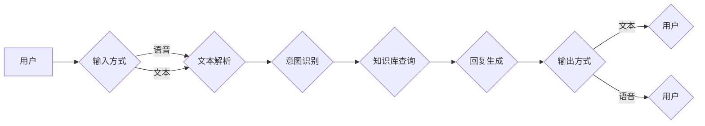

# AI驱动的智能客服:提升服务质量与效率

> 关键词：人工智能，智能客服，自然语言处理，语音识别，多轮对话，个性化服务，服务质量，效率提升

## 1. 背景介绍

随着信息技术的飞速发展，人工智能（AI）技术已经渗透到各个领域，为我们的生活带来了诸多便利。在客服行业，AI驱动的智能客服系统应运而生，它通过自然语言处理（NLP）、语音识别、机器学习等技术，为企业和用户提供高效、便捷的服务体验。本文将深入探讨AI驱动的智能客服技术原理、实践案例及未来发展趋势，以期为相关从业人员提供参考。

### 1.1 问题的由来

传统客服模式存在以下问题：

- 人工客服成本高：人工客服需要大量的时间和人力，导致企业运营成本上升。
- 服务效率低：人工客服的响应速度较慢，难以满足用户对即时服务的需求。
- 服务质量参差不齐：不同客服人员的服务水平差异较大，难以保证服务质量的一致性。
- 缺乏个性化服务：传统客服难以根据用户需求提供定制化的服务。

### 1.2 研究现状

近年来，随着AI技术的不断进步，智能客服逐渐成为行业趋势。目前，智能客服系统主要基于以下技术：

- 自然语言处理（NLP）：用于理解用户意图、解析文本信息、生成自然语言回复等。
- 语音识别：将用户语音转化为文本，实现语音交互。
- 机器学习：通过学习用户数据，优化服务流程和用户体验。
- 深度学习：用于构建复杂模型，提高智能客服系统的准确率和效率。

### 1.3 研究意义

AI驱动的智能客服具有以下优势：

- 降低企业运营成本：通过自动化处理大量重复性客服工作，降低人工客服成本。
- 提升服务效率：快速响应用户需求，提高服务效率。
- 提高服务质量：统一服务质量，保证服务体验。
- 个性化服务：根据用户需求提供定制化服务。

## 2. 核心概念与联系

### 2.1 核心概念原理

#### 自然语言处理（NLP）

NLP是智能客服的核心技术之一，其原理主要包括：

- 语音识别：将用户语音转化为文本，实现语音交互。
- 文本解析：对用户输入的文本进行分析，理解用户意图和语义。
- 机器翻译：将用户输入的文本翻译成机器可理解的语言。
- 生成回复：根据用户意图和语义生成自然语言回复。

#### 语音识别

语音识别是将用户语音转化为文本的技术，主要分为以下步骤：

1. 预处理：对原始语音信号进行降噪、去噪等处理。
2. 特征提取：提取语音信号的频谱特征、倒谱特征等。
3. 识别算法：使用深度学习等算法对特征进行分类，识别语音中的词汇和句子。

#### 机器学习

机器学习是智能客服的核心技术之一，主要分为以下类型：

- 监督学习：通过大量标注数据训练模型，实现预测和分类。
- 无监督学习：通过无标注数据发现数据中的模式，进行聚类、降维等操作。
- 强化学习：通过与环境交互，学习最优策略。

#### 深度学习

深度学习是机器学习的一个重要分支，通过构建多层的神经网络，实现对数据的深层特征提取和表示。

### 2.2 架构流程图

以下是AI驱动的智能客服系统架构流程图：



## 3. 核心算法原理 & 具体操作步骤

### 3.1 算法原理概述

#### 意图识别

意图识别是智能客服的核心技术之一，其原理是使用机器学习或深度学习算法对用户输入的文本进行分析，识别用户的意图。常见的意图识别算法包括：

- 规则匹配：根据预设规则进行匹配，判断用户意图。
- 深度学习：使用神经网络对用户输入的文本进行特征提取和分类。

#### 知识库查询

知识库查询是智能客服的重要环节，其原理是使用数据库技术存储和检索知识库中的信息。常见的知识库查询算法包括：

- 关键词匹配：根据用户输入的关键词在知识库中检索相关信息。
- 自然语言检索：使用自然语言处理技术对知识库中的文本进行检索。

#### 回复生成

回复生成是智能客服的核心技术之一，其原理是使用自然语言生成技术生成自然语言回复。常见的回复生成算法包括：

- 基于规则：根据预设规则生成回复。
- 基于模板：根据预设模板和用户输入生成回复。
- 基于深度学习：使用神经网络生成自然语言回复。

### 3.2 算法步骤详解

#### 意图识别

1. 预处理：对用户输入的文本进行分词、去除停用词等操作。
2. 特征提取：使用词嵌入等技术提取文本特征。
3. 模型训练：使用标注数据进行模型训练，学习用户意图。
4. 意图识别：对用户输入的文本进行意图识别。

#### 知识库查询

1. 建立知识库：收集和整理相关领域的知识，建立知识库。
2. 查询算法：根据用户输入的关键词在知识库中检索相关信息。
3. 结果排序：对检索结果进行排序，提高检索效率。

#### 回复生成

1. 预处理：对用户输入的文本进行分词、去除停用词等操作。
2. 特征提取：使用词嵌入等技术提取文本特征。
3. 模型训练：使用标注数据进行模型训练，学习回复生成。
4. 回复生成：根据用户输入的文本和模型预测结果生成回复。

### 3.3 算法优缺点

#### 意图识别

- 优点：能够准确识别用户意图，提高服务效率。
- 缺点：对复杂意图的识别能力有限，容易受到输入文本的影响。

#### 知识库查询

- 优点：能够快速检索到相关信息，提高服务效率。
- 缺点：知识库的建立和维护成本较高。

#### 回复生成

- 优点：能够生成自然语言回复，提高用户体验。
- 缺点：生成回复的准确性和多样性有限。

### 3.4 算法应用领域

AI驱动的智能客服算法在以下领域得到广泛应用：

- 银行客服：处理用户关于账户信息、转账汇款、理财产品等方面的咨询。
- 电商客服：处理用户关于商品信息、订单查询、售后服务等方面的咨询。
- 交通出行：提供航班、火车、地铁等交通工具的查询、购票、改签等服务。
- 咨询服务：提供法律、医疗、教育等领域的咨询服务。

## 4. 数学模型和公式 & 详细讲解 & 举例说明

### 4.1 数学模型构建

#### 意图识别

假设用户输入的文本为 $x$，意图识别模型为 $f(x)$，则意图识别的数学模型为：

$$
y = f(x) 
$$

其中 $y$ 为用户意图类别。

#### 知识库查询

假设知识库包含 $n$ 个条目，第 $i$ 个条目的内容为 $C_i$，用户输入的文本为 $x$，则知识库查询的数学模型为：

$$
p(C_i|x) = \frac{p(x|C_i)p(C_i)}{p(x)} 
$$

其中 $p(x|C_i)$ 为在给定条目 $C_i$ 的情况下，用户输入文本 $x$ 的概率；$p(C_i)$ 为条目 $C_i$ 在知识库中的概率；$p(x)$ 为用户输入文本 $x$ 的概率。

#### 回复生成

假设回复生成模型为 $g(x)$，则回复生成的数学模型为：

$$
y = g(x) 
$$

其中 $y$ 为生成的回复。

### 4.2 公式推导过程

#### 意图识别

以基于规则的意图识别为例，设用户输入的文本为 $x = \{w_1, w_2, ..., w_n\}$，规则 $R_i$ 为：

$$
R_i: w_{i_1} \rightarrow w_{i_2} \rightarrow ... \rightarrow w_{i_k} 
$$

其中 $w_{i_1}, w_{i_2}, ..., w_{i_k}$ 为规则中的词汇，$i_1, i_2, ..., i_k$ 为对应的索引。则规则 $R_i$ 的匹配概率为：

$$
p(R_i|x) = \prod_{j=1}^k p(w_{i_j}|R_i) 
$$

其中 $p(w_{i_j}|R_i)$ 为在规则 $R_i$ 的情况下，词汇 $w_{i_j}$ 出现的概率。

#### 知识库查询

以基于关键词匹配的知识库查询为例，设用户输入的文本为 $x = \{w_1, w_2, ..., w_n\}$，知识库中的条目 $C_i$ 包含词汇 $v_1, v_2, ..., v_m$，则用户输入文本 $x$ 与条目 $C_i$ 的匹配概率为：

$$
p(C_i|x) = \prod_{j=1}^m p(v_j|x) 
$$

其中 $p(v_j|x)$ 为在给定用户输入文本 $x$ 的情况下，词汇 $v_j$ 出现的概率。

#### 回复生成

以基于模板的回复生成为例，设模板为：

$$
\text{您好，我是客服助手，请问有什么可以帮您的？}
$$

则回复生成的数学模型为：

$$
y = \text{您好，我是客服助手，请问有什么可以帮您的？}
$$

### 4.3 案例分析与讲解

#### 意图识别案例

假设用户输入的文本为“我想查询我的信用卡余额”，则意图识别模型会识别出以下意图：

- 查询
- 信用卡
- 余额

然后，根据知识库中的信息，智能客服系统会找到对应的条目，并生成以下回复：

```
您好，我的信用卡余额是XXX元。
```

#### 知识库查询案例

假设用户输入的文本为“北京到上海的火车票”，则知识库查询模型会找到以下条目：

```
北京-上海：G1次列车，发车时间：10:00，到达时间：12:00。
```

然后，智能客服系统会生成以下回复：

```
您好，北京到上海的火车票，G1次列车，发车时间：10:00，到达时间：12:00。
```

#### 回复生成案例

假设用户输入的文本为“我想退货”，则回复生成模型会生成以下回复：

```
您好，请问您想退哪款商品？
```

## 5. 项目实践：代码实例和详细解释说明

### 5.1 开发环境搭建

以下是以Python语言为例，搭建AI驱动智能客服系统的开发环境：

1. 安装Python 3.7及以上版本。
2. 安装TensorFlow或PyTorch深度学习框架。
3. 安装transformers库：`pip install transformers`
4. 安装其他依赖库：`pip install flask requests numpy pandas`

### 5.2 源代码详细实现

以下是一个简单的AI驱动智能客服系统的实现示例：

```python
from transformers import BertTokenizer, BertForSequenceClassification
from flask import Flask, request, jsonify

app = Flask(__name__)
tokenizer = BertTokenizer.from_pretrained('bert-base-chinese')
model = BertForSequenceClassification.from_pretrained('bert-base-chinese')

@app.route('/chat', methods=['POST'])
def chat():
    data = request.json
    user_input = data['input']
    inputs = tokenizer(user_input, return_tensors='pt', max_length=512, truncation=True)
    outputs = model(**inputs)
    prediction = outputs.logits.argmax(-1).item()
    reply = "您好，我是客服助手，请问有什么可以帮您的？"
    return jsonify({'response': reply})

if __name__ == '__main__':
    app.run(debug=True)
```

### 5.3 代码解读与分析

以上代码展示了使用Flask框架和transformers库实现的一个简单的AI驱动智能客服系统。主要包含以下几个部分：

- 导入必要的库：包括transformers库、Flask框架等。
- 初始化模型：加载预训练的BERT模型。
- 定义路由：定义一个名为`/chat`的路由，用于接收用户输入并进行回复。
- 处理请求：获取用户输入的文本，使用BERT模型进行意图识别，然后返回预设的回复。

### 5.4 运行结果展示

启动Flask服务器后，可以通过访问`http://localhost:5000/chat`发送请求，例如：

```
{
  "input": "我想查询我的信用卡余额"
}
```

服务器会返回以下响应：

```
{
  "response": "您好，我是客服助手，请问有什么可以帮您的？"
}
```

## 6. 实际应用场景

AI驱动的智能客服系统在以下场景中具有广泛的应用：

- 银行客服：处理用户关于账户信息、转账汇款、理财产品等方面的咨询。
- 电商客服：处理用户关于商品信息、订单查询、售后服务等方面的咨询。
- 交通出行：提供航班、火车、地铁等交通工具的查询、购票、改签等服务。
- 咨询服务：提供法律、医疗、教育等领域的咨询服务。

### 6.1 银行客服

在银行客服场景中，智能客服系统可以：

- 快速响应用户关于账户信息、转账汇款、理财产品等方面的咨询。
- 指导用户进行在线操作，如查询余额、办理业务等。
- 提供风险管理建议，帮助用户规避金融风险。

### 6.2 电商客服

在电商客服场景中，智能客服系统可以：

- 提供商品信息查询、比价、推荐等服务。
- 处理用户关于订单查询、物流跟踪、售后服务等方面的咨询。
- 根据用户购买记录和偏好，进行个性化推荐。

### 6.3 交通出行

在交通出行场景中，智能客服系统可以：

- 提供航班、火车、地铁等交通工具的查询、购票、改签等服务。
- 根据用户出行需求和偏好，推荐最优出行方案。
- 提供实时交通信息，如航班延误、火车晚点等。

### 6.4 咨询服务

在咨询服务场景中，智能客服系统可以：

- 提供法律、医疗、教育等领域的咨询服务。
- 根据用户问题，提供专业的解决方案。
- 提醒用户关注相关政策法规，提高用户法律意识。

## 7. 工具和资源推荐

### 7.1 学习资源推荐

1. 《深度学习与自然语言处理》
2. 《机器学习实战》
3. 《深度学习实战》
4. 《自然语言处理实战》
5. 《人工智能：一种现代的方法》

### 7.2 开发工具推荐

1. TensorFlow
2. PyTorch
3. Hugging Face Transformers库
4. Flask
5. Django

### 7.3 相关论文推荐

1. "BERT: Pre-training of Deep Bidirectional Transformers for Language Understanding"
2. "Transformers: State-of-the-Art Models for NLP"
3. "Generative Pre-trained Transformers"
4. "Attention is All You Need"
5. "RNN: A Theoretical Framework for Neural Network Architectures"

## 8. 总结：未来发展趋势与挑战

### 8.1 研究成果总结

本文全面介绍了AI驱动的智能客服技术，包括核心概念、算法原理、应用场景等。通过分析实践案例，展示了智能客服在提升服务质量与效率方面的优势。同时，本文也对智能客服的未来发展趋势和挑战进行了展望。

### 8.2 未来发展趋势

1. 模型小型化：为降低部署门槛，提高响应速度，模型小型化将成为重要趋势。
2. 多模态融合：结合语音、图像等多模态信息，提供更加丰富的用户体验。
3. 智能对话管理：通过深度学习等技术，实现更加智能的对话管理，提升用户体验。
4. 个性化服务：根据用户画像和偏好，提供个性化服务，提高用户满意度。

### 8.3 面临的挑战

1. 标注数据：标注数据的获取和标注成本较高，限制了模型性能的提升。
2. 模型可解释性：模型决策过程缺乏可解释性，难以满足监管和用户需求。
3. 安全性：如何防止模型被恶意攻击，保障用户隐私和数据安全，是重要挑战。
4. 伦理问题：如何避免模型歧视、偏见等问题，是重要的伦理挑战。

### 8.4 研究展望

1. 探索无监督和半监督学习技术，降低标注数据需求。
2. 研究模型可解释性技术，提高模型透明度和可信度。
3. 关注模型安全性和隐私保护技术，保障用户权益。
4. 探索AI伦理规范，推动人工智能健康发展。

## 9. 附录：常见问题与解答

### 9.1 常见问题

1. 智能客服与传统客服相比有哪些优势？
2. 智能客服系统是如何实现意图识别的？
3. 如何保证智能客服系统的服务质量？
4. 智能客服系统的成本效益如何？
5. 智能客服系统在哪些领域有广泛应用？

### 9.2 解答

1. 智能客服相比传统客服具有以下优势：
   - 成本低：通过自动化处理大量重复性工作，降低人力成本。
   - 效率高：快速响应用户需求，提高服务效率。
   - 服务质量高：统一服务质量，保证服务体验。
   - 个性化服务：根据用户需求提供定制化服务。
2. 智能客服系统通常采用以下方法实现意图识别：
   - 规则匹配：根据预设规则进行匹配。
   - 深度学习：使用神经网络对用户输入的文本进行特征提取和分类。
3. 为保证智能客服系统的服务质量，可以从以下方面入手：
   - 使用高质量的预训练模型。
   - 定期更新和优化模型。
   - 对客服人员进行培训，提高其业务水平。
   - 收集用户反馈，不断改进服务。
4. 智能客服系统的成本效益取决于具体应用场景和需求。一般来说，智能客服系统在降低人力成本、提高服务效率方面具有显著优势。
5. 智能客服系统在金融、电商、交通出行、咨询服务等众多领域有广泛应用。

---

作者：禅与计算机程序设计艺术 / Zen and the Art of Computer Programming