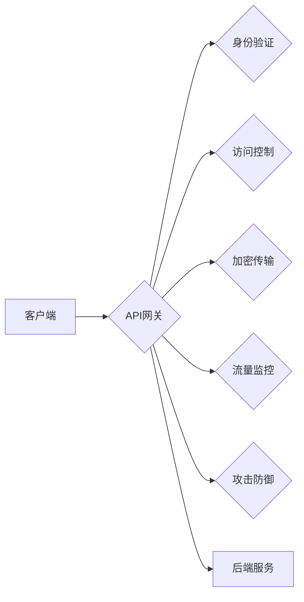

> 关键词：API网关，安全防护，身份验证，访问控制，加密传输，流量监控，攻击防御，安全策略

# API 网关的安全功能

在当今的数字化时代，API（应用程序编程接口）已成为连接前后端、服务间交互的关键桥梁。随着API的广泛应用，API网关作为服务治理和流量控制的核心组件，其安全功能的重要性日益凸显。本文将深入探讨API网关的安全功能，分析其原理、操作步骤、应用领域，并展望未来的发展趋势与挑战。

## 1. 背景介绍

### 1.1 API网关的兴起

随着云计算、微服务架构的普及，企业内部及企业间的服务交互日益频繁。API网关作为服务治理的中心，负责接收客户端请求，处理后转发至后端服务，并统一处理诸如鉴权、路由、限流、监控等任务。API网关的出现，使得服务间通信更加高效、安全、可靠。

### 1.2 API网关的安全挑战

API网关作为服务交互的核心节点，面临着诸多安全挑战：

- 未经授权的访问：攻击者可能尝试未授权访问API资源，窃取敏感数据。
- 网络攻击：SQL注入、XSS攻击、DDoS攻击等网络攻击可能导致服务瘫痪。
- 数据泄露：敏感数据如用户密码、信用卡信息等可能被泄露。
- 系统漏洞：API网关自身可能存在安全漏洞，被攻击者利用。

## 2. 核心概念与联系

### 2.1 核心概念原理

API网关安全功能的核心概念包括：

- **身份验证**：验证用户身份，确保请求者有权访问API资源。
- **访问控制**：根据用户身份和权限，控制对API资源的访问。
- **加密传输**：保护数据在传输过程中的安全性，防止数据被窃听、篡改。
- **流量监控**：实时监控API流量，发现异常行为并及时响应。
- **攻击防御**：防御各种网络攻击，保障API网关的稳定运行。
- **安全策略**：制定安全策略，对API资源进行统一管理。

### 2.2 架构流程图



客户端请求经过API网关，API网关依次进行身份验证、访问控制、加密传输、流量监控和攻击防御，然后将请求转发至后端服务。

## 3. 核心算法原理 & 具体操作步骤

### 3.1 算法原理概述

API网关安全功能主要基于以下算法原理：

- **身份验证**：使用OAuth、JWT等协议，验证用户身份。
- **访问控制**：基于用户角色、权限等，控制对API资源的访问。
- **加密传输**：使用TLS/SSL等协议，加密数据传输。
- **流量监控**：使用Prometheus、ELK等技术，实时监控API流量。
- **攻击防御**：使用WAF、IPS等技术，防御SQL注入、XSS攻击等。

### 3.2 算法步骤详解

#### 3.2.1 身份验证

1. 客户端向API网关发送请求，携带身份验证信息（如用户名、密码、令牌等）。
2. API网关验证身份信息，如果验证通过，则允许访问；否则，返回错误信息。

#### 3.2.2 访问控制

1. API网关根据用户角色和权限，判断用户是否有权访问特定API资源。
2. 如果用户有权访问，则允许访问；否则，返回错误信息。

#### 3.2.3 加密传输

1. API网关与客户端之间使用TLS/SSL协议进行加密通信。
2. 加密传输确保数据在传输过程中的安全性。

#### 3.2.4 流量监控

1. API网关使用Prometheus、ELK等技术，实时监控API流量。
2. 当发现异常流量时，及时采取措施，如限流、阻断等。

#### 3.2.5 攻击防御

1. API网关使用WAF、IPS等技术，防御SQL注入、XSS攻击等。
2. 当检测到攻击行为时，立即采取措施，如记录日志、阻断攻击者等。

### 3.3 算法优缺点

#### 3.3.1 优点

- 提高安全性：有效防止未经授权的访问、数据泄露和攻击。
- 统一管理：集中管理API资源，便于控制和维护。
- 提高效率：简化开发流程，提高开发效率。

#### 3.3.2 缺点

- 增加复杂性：引入新的组件，增加系统复杂性。
- 带宽消耗：加密传输等安全功能会增加网络带宽消耗。
- 性能损耗：安全检查等操作会增加计算开销。

### 3.4 算法应用领域

API网关安全功能在以下领域得到广泛应用：

- 金融服务：保护用户金融信息，防止欺诈行为。
- 电子商务：保护用户购物信息，防止恶意下单。
- 社交媒体：保护用户隐私，防止垃圾信息传播。
- 企业内部系统：保护企业内部数据，防止数据泄露。

## 4. 数学模型和公式 & 详细讲解 & 举例说明

### 4.1 数学模型构建

API网关安全功能的数学模型可以表示为：

$$
安全模型 = 身份验证 \times 访问控制 \times 加密传输 \times 流量监控 \times 攻击防御
$$

### 4.2 公式推导过程

由于安全模型的各个组成部分相互独立，因此可以将其视为独立的乘积。

### 4.3 案例分析与讲解

以一个电子商务平台为例，其API网关安全功能如下：

- **身份验证**：使用OAuth 2.0协议，验证用户身份。
- **访问控制**：根据用户角色和权限，控制对订单、支付等API资源的访问。
- **加密传输**：使用TLS/SSL协议，加密订单信息和支付信息。
- **流量监控**：使用Prometheus和ELK，监控API流量，发现异常行为。
- **攻击防御**：使用WAF和IPS，防御SQL注入、XSS攻击等。

通过以上安全措施，电子商务平台的API网关可以有效地保护用户信息和支付数据安全。

## 5. 项目实践：代码实例和详细解释说明

### 5.1 开发环境搭建

1. 安装API网关框架，如Zuul、Kong等。
2. 安装身份验证、访问控制、加密传输、流量监控、攻击防御等插件。
3. 配置API网关，包括路由规则、权限配置、安全策略等。

### 5.2 源代码详细实现

以Zuul为例，以下代码展示了如何配置身份验证、访问控制和加密传输：

```java
zuul:
  routes:
    - path: /api/**
      serviceId: my-service
      stripPrefix: true

  authentication:
    oAuth2:
      providers:
        - accessToken:
            authorizationServer: my-auth-server
            clientId: my-client-id
            clientSecret: my-client-secret

  securityFilters:
    - Pre:
      name: my-identity-filter
      order: 1

  routes:
    - path: /api/**
      serviceId: my-service
      stripPrefix: true
      predicates:
        - Authenticated()
```

### 5.3 代码解读与分析

以上代码配置了Zuul网关，使其在转发请求时进行身份验证和访问控制。其中：

- `routes` 配置了API路由规则。
- `authentication` 配置了OAuth 2.0身份验证。
- `securityFilters` 配置了前置过滤器，用于进行身份验证。

### 5.4 运行结果展示

当客户端请求 `/api/` 开头的URL时，Zuul网关会自动进行身份验证和访问控制。如果验证通过，则转发请求至后端服务；否则，返回错误信息。

## 6. 实际应用场景

### 6.1 金融行业

在金融行业，API网关安全功能主要用于：

- **保护用户信息**：防止用户信息泄露，如身份证号、银行账号等。
- **防止欺诈**：检测和阻止恶意交易，如洗钱、信用卡欺诈等。
- **合规性检查**：确保API调用符合相关法律法规。

### 6.2 电子商务

在电子商务领域，API网关安全功能主要用于：

- **保护用户支付信息**：防止支付信息泄露，如信用卡号、密码等。
- **防止恶意下单**：检测和阻止恶意下单，如刷单、套现等。
- **促销活动安全**：保障促销活动的公平性，防止作弊行为。

### 6.3 社交媒体

在社交媒体领域，API网关安全功能主要用于：

- **保护用户隐私**：防止用户隐私泄露，如姓名、地址、电话等。
- **防止垃圾信息传播**：检测和阻止垃圾信息传播，如广告、欺诈信息等。
- **社区管理**：保障社区环境的健康，防止恶意攻击和骚扰。

## 7. 工具和资源推荐

### 7.1 学习资源推荐

- 《API网关实战》
- 《微服务安全指南》
- 《OAuth 2.0身份验证与授权》

### 7.2 开发工具推荐

- zuul
- kong
- spring cloud gateway

### 7.3 相关论文推荐

- "API Gateway Security: Threats, Solutions, and Best Practices"
- "Securing Microservices with API Gateways"
- "OAuth 2.0: The Missing Specs"

## 8. 总结：未来发展趋势与挑战

### 8.1 研究成果总结

本文深入探讨了API网关的安全功能，分析了其原理、操作步骤、应用领域，并给出了实际项目实践的示例。通过本文的学习，读者可以了解API网关安全功能的重要性，掌握其实现方法，并将其应用到实际项目中。

### 8.2 未来发展趋势

未来，API网关安全功能将呈现以下发展趋势：

- **自动化安全**：通过自动化工具，实现安全策略的自动化部署、监控和审计。
- **智能化安全**：利用人工智能技术，实现异常检测、攻击防御等方面的智能化。
- **云原生安全**：结合云原生技术，实现API网关安全功能的弹性伸缩和高效部署。

### 8.3 面临的挑战

API网关安全功能在发展过程中也面临着以下挑战：

- **安全与性能的平衡**：如何在保证安全的同时，保证系统性能。
- **安全策略的复杂性**：随着业务的发展，安全策略的复杂度不断增加，如何有效管理。
- **安全风险的动态变化**：随着攻击手段的不断演变，如何及时更新安全策略，应对新的安全风险。

### 8.4 研究展望

未来，API网关安全功能的研究将聚焦于以下方向：

- **安全防御体系的构建**：建立完善的API网关安全防御体系，提高系统整体安全性。
- **安全技术的创新**：研究新的安全技术和算法，提高安全防护能力。
- **安全生态的构建**：构建API网关安全生态，促进安全技术的交流和共享。

## 9. 附录：常见问题与解答

**Q1：API网关安全功能有哪些类型？**

A：API网关安全功能主要包括身份验证、访问控制、加密传输、流量监控和攻击防御。

**Q2：如何实现API网关的身份验证？**

A：可以使用OAuth 2.0、JWT等协议进行身份验证。

**Q3：如何实现API网关的访问控制？**

A：可以根据用户角色和权限，使用条件路由、过滤器等技术进行访问控制。

**Q4：如何实现API网关的加密传输？**

A：可以使用TLS/SSL协议进行加密传输。

**Q5：如何实现API网关的流量监控？**

A：可以使用Prometheus、ELK等技术进行流量监控。

**Q6：如何实现API网关的攻击防御？**

A：可以使用WAF、IPS等技术进行攻击防御。

作者：禅与计算机程序设计艺术 / Zen and the Art of Computer Programming