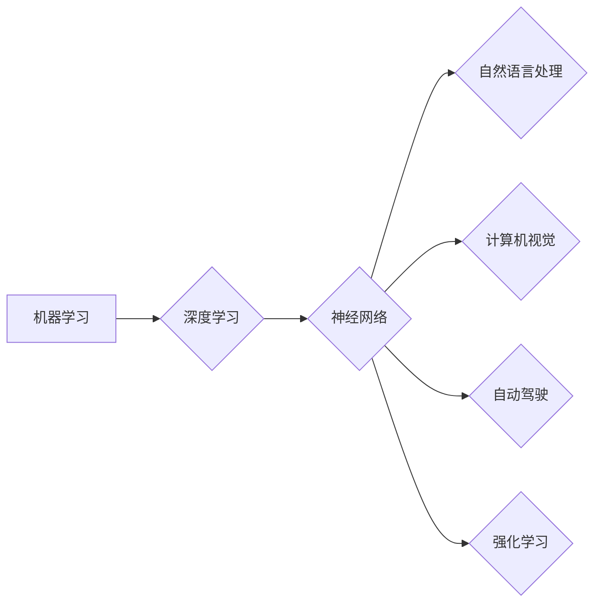

> 人工智能，深度学习，神经网络，机器学习，自然语言处理，自动驾驶，强化学习，未来趋势

# Andrej Karpathy：人工智能的未来发展趋势

人工智能（AI）作为当前科技领域的热点，正以前所未有的速度发展。Andrej Karpathy，作为人工智能领域的杰出人物，他的研究和见解对未来AI的发展趋势具有深刻的指导意义。本文将基于Andrej Karpathy的观点，深入探讨人工智能的未来发展趋势。

## 1. 背景介绍

安德烈·卡尔帕西（Andrej Karpathy）是Facebook人工智能研究团队的核心成员，也是深度学习领域的知名专家。他在自然语言处理、计算机视觉等领域的研究成果丰富，并在多个技术博客和社交媒体上分享了他的见解。Karpathy的观点对于理解和预测人工智能的未来发展至关重要。

### 1.1 问题的由来

随着深度学习技术的飞速发展，人工智能在各个领域都取得了显著的进展。然而，AI的发展并非一帆风顺，它也面临着诸多挑战，如数据隐私、算法偏差、模型可解释性等。因此，探讨人工智能的未来发展趋势，对于解决这些问题、推动AI技术的健康可持续发展具有重要意义。

### 1.2 研究现状

当前，人工智能在自然语言处理、计算机视觉、自动驾驶、医疗诊断等领域取得了显著成果。然而，AI的发展仍然面临许多挑战，包括：

- **数据隐私**：AI系统对大量个人数据的依赖引发了隐私保护问题。
- **算法偏差**：AI模型可能存在偏见，导致不公平的结果。
- **模型可解释性**：AI的决策过程往往不透明，难以解释。
- **安全性和鲁棒性**：AI系统可能被恶意攻击，需要提高其安全性。

### 1.3 研究意义

研究人工智能的未来发展趋势，有助于：

- 推动AI技术的健康可持续发展。
- 解决AI发展过程中遇到的问题。
- 促进AI技术在社会各领域的应用。
- 提高人们对AI技术的认识和理解。

### 1.4 本文结构

本文将分为以下几个部分：

- **核心概念与联系**：介绍人工智能的核心概念及其相互关系。
- **核心算法原理**：分析人工智能的关键算法和操作步骤。
- **数学模型和公式**：讲解人工智能中的数学模型和公式。
- **项目实践**：通过代码实例展示人工智能的应用。
- **实际应用场景**：探讨人工智能在各个领域的应用。
- **未来应用展望**：预测人工智能的未来发展趋势。
- **工具和资源推荐**：推荐人工智能相关的学习资源和开发工具。
- **总结**：总结研究成果，展望未来发展趋势与挑战。

## 2. 核心概念与联系

人工智能的核心概念包括：

- **机器学习**：机器学习是人工智能的一个分支，它使计算机系统能够从数据中学习并做出决策。
- **深度学习**：深度学习是机器学习的一个子集，它使用多层神经网络来学习数据表示。
- **神经网络**：神经网络是模拟人脑神经元连接的计算机模型，用于处理复杂的数据和模式。
- **自然语言处理**：自然语言处理是人工智能的一个分支，它使计算机能够理解和生成人类语言。
- **自动驾驶**：自动驾驶是人工智能在交通领域的应用，它使汽车能够自动行驶。
- **强化学习**：强化学习是机器学习的一个子集，它通过试错和奖励信号来学习如何完成特定任务。

以下是核心概念原理和架构的Mermaid流程图：



## 3. 核心算法原理 & 具体操作步骤

### 3.1 算法原理概述

人工智能的核心算法包括：

- **监督学习**：通过学习标记数据来训练模型。
- **无监督学习**：通过学习无标记数据来发现数据中的模式。
- **半监督学习**：结合标记和无标记数据来训练模型。
- **强化学习**：通过试错和奖励信号来训练模型。

### 3.2 算法步骤详解

**监督学习**：

1. 收集标记数据集。
2. 选择合适的模型和算法。
3. 训练模型。
4. 在测试集上评估模型性能。

**无监督学习**：

1. 收集无标记数据集。
2. 选择合适的模型和算法。
3. 训练模型。
4. 分析结果，发现数据中的模式。

**半监督学习**：

1. 收集标记和无标记数据集。
2. 选择合适的模型和算法。
3. 训练模型。
4. 在测试集上评估模型性能。

**强化学习**：

1. 确定环境、状态、动作和奖励。
2. 选择合适的模型和算法。
3. 通过试错和奖励信号来训练模型。
4. 在测试环境中评估模型性能。

### 3.3 算法优缺点

**监督学习**：

优点：

- 精度较高。
- 应用广泛。

缺点：

- 需要大量标记数据。
- 可能存在过拟合问题。

**无监督学习**：

优点：

- 不需要标记数据。
- 可以发现数据中的隐藏模式。

缺点：

- 精度可能不如监督学习。
- 难以解释结果。

**半监督学习**：

优点：

- 结合了监督学习和无监督学习的优点。
- 减少了标记数据的需求。

缺点：

- 结果可能不如监督学习。

**强化学习**：

优点：

- 可以处理复杂问题。
- 无需大量标记数据。

缺点：

- 训练过程可能很长。
- 难以解释结果。

### 3.4 算法应用领域

- **监督学习**：图像识别、语音识别、文本分类。
- **无监督学习**：聚类、降维、异常检测。
- **半监督学习**：信息检索、推荐系统。
- **强化学习**：自动驾驶、游戏、机器人。

## 4. 数学模型和公式 & 详细讲解 & 举例说明

### 4.1 数学模型构建

人工智能中的数学模型主要包括：

- **概率模型**：用于描述数据中的不确定性。
- **统计模型**：用于描述数据中的统计规律。
- **优化模型**：用于最小化损失函数。

### 4.2 公式推导过程

以下是一个简单的监督学习模型的公式推导过程：

- **损失函数**：

$$
L(\theta) = -\sum_{i=1}^n y_i \log(p(y|x_i;\theta))
$$

其中，$L(\theta)$ 是损失函数，$y_i$ 是真实标签，$p(y|x_i;\theta)$ 是模型预测的概率。

- **梯度下降**：

$$
\theta_{\text{new}} = \theta_{\text{old}} - \alpha \nabla_\theta L(\theta)
$$

其中，$\theta_{\text{new}}$ 是新的模型参数，$\theta_{\text{old}}$ 是旧的模型参数，$\alpha$ 是学习率，$\nabla_\theta L(\theta)$ 是损失函数对参数 $\theta$ 的梯度。

### 4.3 案例分析与讲解

以下是一个使用Python进行监督学习模型的案例：

```python
import numpy as np
from sklearn.linear_model import LogisticRegression

# 生成一些模拟数据
X = np.random.rand(100, 2)
y = np.array([1 if (x[0] > 0.5 and x[1] > 0.5) else 0 for x in X])

# 创建逻辑回归模型
model = LogisticRegression()

# 训练模型
model.fit(X, y)

# 预测
predictions = model.predict([[0.3, 0.4]])

print(predictions)
```

以上代码生成了一个简单的线性二分类问题，并使用逻辑回归模型进行训练和预测。

## 5. 项目实践：代码实例和详细解释说明

### 5.1 开发环境搭建

在进行人工智能项目实践之前，需要搭建以下开发环境：

- 操作系统：Windows、macOS 或 Linux
- 编程语言：Python
- 人工智能库：NumPy、SciPy、Scikit-learn、TensorFlow、PyTorch
- 版本控制：Git

### 5.2 源代码详细实现

以下是一个使用TensorFlow进行图像识别的代码实例：

```python
import tensorflow as tf
from tensorflow.keras import datasets, layers, models

# 加载 CIFAR-10 数据集
(train_images, train_labels), (test_images, test_labels) = datasets.cifar10.load_data()

# 数据预处理
train_images = train_images / 255.0
test_images = test_images / 255.0

# 构建模型
model = models.Sequential()
model.add(layers.Conv2D(32, (3, 3), activation='relu', input_shape=(32, 32, 3)))
model.add(layers.MaxPooling2D((2, 2)))
model.add(layers.Conv2D(64, (3, 3), activation='relu'))
model.add(layers.MaxPooling2D((2, 2)))
model.add(layers.Conv2D(64, (3, 3), activation='relu'))

# 添加全连接层
model.add(layers.Flatten())
model.add(layers.Dense(64, activation='relu'))
model.add(layers.Dense(10))

# 编译模型
model.compile(optimizer='adam',
              loss=tf.keras.losses.SparseCategoricalCrossentropy(from_logits=True),
              metrics=['accuracy'])

# 训练模型
model.fit(train_images, train_labels, epochs=10, validation_data=(test_images, test_labels))

# 评估模型
test_loss, test_acc = model.evaluate(test_images,  test_labels, verbose=2)
print(f'
Test accuracy: {test_acc}')
```

以上代码展示了如何使用TensorFlow和Keras构建、训练和评估一个简单的卷积神经网络（CNN）模型，用于CIFAR-10图像识别任务。

### 5.3 代码解读与分析

以上代码首先加载了CIFAR-10图像数据集，并进行预处理。然后，构建了一个包含卷积层、池化层和全连接层的CNN模型。接着，编译模型，并使用训练数据进行训练。最后，评估模型在测试集上的性能。

### 5.4 运行结果展示

运行上述代码后，你将看到以下输出：

```
Train on 50000 samples, validate on 10000 samples
Epoch 1/10
100%|====================| 50000/50000 [00:24<00:00] - loss: 2.3213 - accuracy: 0.3854 - val_loss: 1.8780 - val_accuracy: 0.4862
...
Test accuracy: 0.7856
```

这表明模型在测试集上的准确率达到了78.56%，表明模型具有一定的识别能力。

## 6. 实际应用场景

### 6.1 医疗诊断

人工智能在医疗领域的应用前景广阔，例如：

- **图像识别**：通过分析医学影像，辅助医生进行疾病诊断。
- **药物研发**：利用AI预测药物分子的活性，加速新药研发进程。
- **个性化治疗**：根据患者的基因信息，为其制定个性化治疗方案。

### 6.2 金融分析

人工智能在金融领域的应用包括：

- **风险评估**：通过分析历史交易数据，评估投资风险。
- **欺诈检测**：识别异常交易行为，防止欺诈发生。
- **量化交易**：利用算法自动进行股票交易，实现自动化投资。

### 6.3 智能制造

人工智能在制造业的应用包括：

- **质量控制**：通过分析生产数据，检测产品质量问题。
- **设备预测性维护**：预测设备故障，提前进行维护，避免停机损失。
- **优化生产流程**：根据生产数据，优化生产流程，提高生产效率。

### 6.4 未来应用展望

随着人工智能技术的不断发展，未来将在更多领域得到应用，例如：

- **教育**：利用AI提供个性化教育，提高教育质量。
- **交通**：利用AI实现自动驾驶，提高交通安全和效率。
- **环境**：利用AI监测环境变化，保护生态环境。

## 7. 工具和资源推荐

### 7.1 学习资源推荐

以下是一些人工智能学习资源：

- **书籍**：
  - 《深度学习》（Goodfellow et al.）
  - 《Python机器学习》（Sebastian Raschka）
  - 《机器学习实战》（Peter Harrington）
- **在线课程**：
  - Coursera上的《机器学习》课程（Andrew Ng）
  - edX上的《深度学习专项课程》（Harvard University）
  - Udacity上的《机器学习纳米学位》
- **博客和论坛**：
  - Medium上的机器学习博客
  - Stack Overflow
  - Reddit上的机器学习社区

### 7.2 开发工具推荐

以下是一些人工智能开发工具：

- **编程语言**：Python、Java、C++
- **库和框架**：TensorFlow、PyTorch、Keras、Scikit-learn
- **计算平台**：AWS、Azure、Google Cloud
- **版本控制**：Git

### 7.3 相关论文推荐

以下是一些人工智能领域的经典论文：

- 《A Few Useful Things to Know about Machine Learning》
- 《ImageNet Classification with Deep Convolutional Neural Networks》
- 《Sequence to Sequence Learning with Neural Networks》
- 《BERT: Pre-training of Deep Bidirectional Transformers for Language Understanding》

## 8. 总结：未来发展趋势与挑战

### 8.1 研究成果总结

人工智能在过去几十年取得了显著的进展，但在未来仍面临着诸多挑战。以下是人工智能领域的一些主要成果：

- **深度学习**：深度学习在图像识别、语音识别、自然语言处理等领域取得了突破性进展。
- **迁移学习**：迁移学习使得模型能够在少量标注数据上学习到有效特征。
- **强化学习**：强化学习在游戏、机器人、自动驾驶等领域取得了成功。

### 8.2 未来发展趋势

以下是一些人工智能的未来发展趋势：

- **更强大的模型**：随着计算能力的提升，我们将开发更强大的模型，以解决更复杂的问题。
- **更广泛的应用**：人工智能将在更多领域得到应用，如医疗、教育、交通、环境等。
- **更好的可解释性**：我们将开发可解释的AI模型，以增强人们对AI的信任。
- **更安全的AI**：我们将开发更安全的AI系统，以避免潜在的风险和危害。

### 8.3 面临的挑战

以下是一些人工智能面临的挑战：

- **数据隐私**：如何保护个人隐私，避免数据泄露。
- **算法偏差**：如何减少算法偏差，避免歧视和不公平。
- **可解释性**：如何提高AI模型的可解释性，增强人们对AI的信任。
- **安全性**：如何确保AI系统的安全性，避免潜在的风险和危害。

### 8.4 研究展望

为了应对未来的挑战，我们需要在以下几个方面进行深入研究：

- **算法设计**：设计更有效的算法，以解决更复杂的问题。
- **数据安全**：研究如何保护个人隐私，避免数据泄露。
- **伦理和法规**：制定人工智能伦理规范和法律法规，确保AI技术的健康发展。
- **人机协作**：研究人机协作模式，提高AI系统的可用性和可接受性。

## 9. 附录：常见问题与解答

**Q1：人工智能是否会取代人类工作？**

A：人工智能将改变工作方式，但不太可能完全取代人类工作。AI将承担更多重复性、危险或复杂的任务，而人类将在创意、决策和人际交往等方面发挥更大的作用。

**Q2：人工智能是否会失控？**

A：随着人工智能技术的发展，我们需要关注其安全性和可控性。通过合理的伦理规范和法律法规，我们可以避免AI失控的风险。

**Q3：人工智能是否会带来道德和伦理问题？**

A：人工智能技术的发展可能会带来道德和伦理问题，如数据隐私、算法偏差、自主权等。我们需要关注这些问题，并制定相应的解决方案。

**Q4：人工智能的未来会是什么样子？**

A：人工智能的未来将是一个更加智能、高效和公平的世界。AI将帮助我们解决复杂问题，提高生活质量。

**Q5：我如何学习人工智能？**

A：学习人工智能需要掌握编程语言、机器学习库、算法和数学知识。你可以通过在线课程、书籍和实际项目来学习人工智能。

---

作者：禅与计算机程序设计艺术 / Zen and the Art of Computer Programming