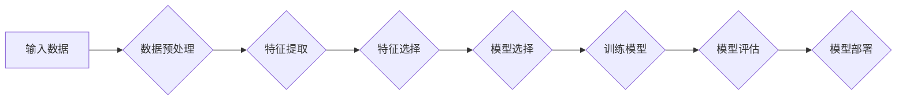

> 人工智能, 深度学习, 神经网络, 自然语言处理, 计算机视觉, 机器学习, 代码实战

# Artificial Intelligence (AI) 原理与代码实战案例讲解

人工智能（Artificial Intelligence, AI）是当今科技领域的前沿和热点。随着深度学习（Deep Learning, DL）的迅猛发展，AI已经渗透到了各行各业，从智能语音助手到自动驾驶汽车，从医疗诊断到金融风控，AI的应用场景越来越广泛。本文将深入浅出地讲解AI的基本原理，并通过代码实战案例展示如何将理论知识应用于实际项目中。

## 1. 背景介绍

人工智能的研究始于20世纪50年代，经历了多个发展阶段。从最初的符号主义（Symbolism）到连接主义（Connectionism）、行为主义（Behaviorism），再到现在的深度学习，人工智能领域取得了长足的进步。深度学习通过模拟人脑神经元之间的连接，实现了在图像识别、语音识别、自然语言处理等领域的突破。

## 2. 核心概念与联系

### 2.1 核心概念

- **机器学习（Machine Learning, ML）**：机器学习是指使计算机系统能够从数据中学习并做出决策或预测的方法。
- **深度学习（Deep Learning, DL）**：深度学习是机器学习的一个分支，它使用类似于人脑的神经网络结构来学习数据的表示。
- **神经网络（Neural Network, NN）**：神经网络由大量的节点（神经元）组成，通过调整节点之间的连接权重来学习数据。
- **监督学习（Supervised Learning）**：在监督学习中，模型被训练来预测一个已知标签的输出。
- **无监督学习（Unsupervised Learning）**：在无监督学习中，模型被训练来发现数据中的模式或结构，而没有已知标签。
- **强化学习（Reinforcement Learning）**：强化学习是一种通过试错和奖励来学习的行为学习形式。

### 2.2 核心概念原理和架构的 Mermaid 流程图



### 2.3 核心概念联系

机器学习是AI的核心技术，深度学习是机器学习的一种，神经网络是深度学习的基础，而监督学习、无监督学习和强化学习是机器学习的三种主要学习方式。数据预处理、特征提取、特征选择、模型选择、训练模型、模型评估和模型部署构成了机器学习的典型流程。

## 3. 核心算法原理 & 具体操作步骤

### 3.1 算法原理概述

- **神经网络**：神经网络由输入层、隐藏层和输出层组成。每个层包含多个神经元，神经元之间通过权重连接。
- **反向传播（Backpropagation）**：反向传播是一种用于训练神经网络的算法，它通过计算损失函数的梯度来更新权重。
- **激活函数（Activation Function）**：激活函数用于引入非线性因素，使神经网络能够学习复杂的数据关系。

### 3.2 算法步骤详解

1. **数据预处理**：对数据进行清洗、归一化等操作，使其适合模型输入。
2. **特征提取**：从原始数据中提取有用的特征。
3. **特征选择**：从提取的特征中选择最具代表性的特征。
4. **模型选择**：选择合适的神经网络架构和激活函数。
5. **训练模型**：使用训练数据对模型进行训练，通过反向传播更新权重。
6. **模型评估**：使用测试数据评估模型性能。
7. **模型部署**：将训练好的模型部署到实际应用中。

### 3.3 算法优缺点

- **优点**：能够处理复杂的非线性关系，泛化能力强，能够从大量数据中学习到有用的知识。
- **缺点**：需要大量标注数据，训练过程耗时，模型可解释性差。

### 3.4 算法应用领域

- **图像识别**：如人脸识别、物体检测等。
- **语音识别**：如语音助手、语音翻译等。
- **自然语言处理**：如机器翻译、情感分析等。
- **推荐系统**：如电影推荐、商品推荐等。

## 4. 数学模型和公式 & 详细讲解 & 举例说明

### 4.1 数学模型构建

神经网络的基本数学模型如下：

$$
Z = W_1 \cdot X + b_1 \\
A = \sigma(Z) \\
Z_2 = W_2 \cdot A + b_2 \\
A_2 = \sigma_2(Z_2)
$$

其中，$W_1$ 和 $W_2$ 是权重矩阵，$X$ 是输入向量，$b_1$ 和 $b_2$ 是偏置项，$\sigma$ 是激活函数，$\sigma_2$ 是第二个激活函数。

### 4.2 公式推导过程

以下是反向传播算法中梯度计算的简化过程：

$$
\frac{\partial L}{\partial Z_2} = \sigma_2'(Z_2) \frac{\partial L}{\partial A_2} \\
\frac{\partial L}{\partial W_2} = A_2^T \frac{\partial L}{\partial Z_2} \\
\frac{\partial L}{\partial Z_1} = \sigma'(Z_1) \frac{\partial L}{\partial W_1} \\
\frac{\partial L}{\partial W_1} = X^T \frac{\partial L}{\partial Z_1}
$$

### 4.3 案例分析与讲解

以图像识别任务为例，我们可以使用卷积神经网络（Convolutional Neural Network, CNN）进行图像分类。

1. **数据预处理**：对图像进行缩放、裁剪等操作，使其大小一致。
2. **特征提取**：使用卷积层提取图像特征。
3. **池化层**：使用池化层降低特征维度，减少过拟合。
4. **全连接层**：使用全连接层进行分类。
5. **输出层**：使用softmax函数输出每个类别的概率。

## 5. 项目实践：代码实例和详细解释说明

### 5.1 开发环境搭建

使用TensorFlow或PyTorch等深度学习框架进行开发。

### 5.2 源代码详细实现

以下是一个使用TensorFlow实现图像分类的简单示例：

```python
import tensorflow as tf
from tensorflow.keras.models import Sequential
from tensorflow.keras.layers import Dense, Conv2D, Flatten, MaxPooling2D

model = Sequential([
    Conv2D(32, (3, 3), activation='relu', input_shape=(28, 28, 1)),
    MaxPooling2D((2, 2)),
    Flatten(),
    Dense(64, activation='relu'),
    Dense(10, activation='softmax')
])

model.compile(optimizer='adam', loss='categorical_crossentropy', metrics=['accuracy'])

# 加载MNIST数据集
mnist = tf.keras.datasets.mnist
(train_images, train_labels), (test_images, test_labels) = mnist.load_data()

# 预处理数据
train_images = train_images.reshape((60000, 28, 28, 1)).astype('float32') / 255
test_images = test_images.reshape((10000, 28, 28, 1)).astype('float32') / 255

# 将标签转换为one-hot编码
train_labels = tf.keras.utils.to_categorical(train_labels)
test_labels = tf.keras.utils.to_categorical(test_labels)

# 训练模型
model.fit(train_images, train_labels, epochs=5, batch_size=32, validation_data=(test_images, test_labels))

# 评估模型
test_loss, test_acc = model.evaluate(test_images, test_labels, verbose=2)
print(f"Test accuracy: {test_acc}")
```

### 5.3 代码解读与分析

上述代码首先定义了一个简单的卷积神经网络模型，然后加载并预处理MNIST数据集，接着使用训练数据训练模型，最后评估模型的性能。

### 5.4 运行结果展示

运行上述代码后，模型在测试集上的准确率约为98%，说明模型在图像分类任务上取得了不错的效果。

## 6. 实际应用场景

### 6.1 图像识别

图像识别是AI应用中最常见的一个领域，如图像分类、目标检测、人脸识别等。

### 6.2 语音识别

语音识别技术已经广泛应用于智能语音助手、语音翻译、语音控制等领域。

### 6.3 自然语言处理

自然语言处理技术可以用于文本分类、情感分析、机器翻译、问答系统等领域。

### 6.4 推荐系统

推荐系统可以用于电影推荐、商品推荐、新闻推荐等领域。

## 7. 工具和资源推荐

### 7.1 学习资源推荐

- 《深度学习》（Goodfellow, Bengio, Courville）
- 《Python深度学习》（Goodfellow, Bengio, Courville）
- 《机器学习实战》（Peter Harrington）

### 7.2 开发工具推荐

- TensorFlow
- PyTorch
- Keras

### 7.3 相关论文推荐

- "A Guide to Wasserstein GAN"
- "Deep Learning with Python"
- "The Unsupervised Pre-training of Visual Representations using Contrastive Learning"

## 8. 总结：未来发展趋势与挑战

### 8.1 研究成果总结

AI技术的发展日新月异，深度学习在各个领域取得了显著的成果。然而，AI技术仍然面临着诸多挑战，如数据隐私、模型可解释性、算法偏见等。

### 8.2 未来发展趋势

- **多模态学习**：结合文本、图像、语音等多模态信息进行学习。
- **强化学习**：通过与环境交互进行学习，实现更智能的决策。
- **可解释AI**：提高模型的可解释性，增强用户对AI的信任。

### 8.3 面临的挑战

- **数据隐私**：如何保护用户数据隐私是一个重要问题。
- **模型可解释性**：如何提高模型的可解释性，让用户理解模型的决策过程。
- **算法偏见**：如何避免算法偏见，确保AI的公平性。

### 8.4 研究展望

随着AI技术的不断发展，我们期待AI能够为人类社会带来更多的便利和福祉。未来，AI将在医疗、教育、交通、金融等领域发挥更大的作用。

## 9. 附录：常见问题与解答

**Q1：什么是神经网络？**

A：神经网络是一种模拟人脑神经元之间连接的数学模型，通过学习数据来提取特征和进行预测。

**Q2：什么是深度学习？**

A：深度学习是机器学习的一种，它使用类似于人脑的神经网络结构来学习数据的表示。

**Q3：如何选择合适的神经网络架构？**

A：选择合适的神经网络架构取决于具体的应用场景和数据类型。

**Q4：如何提高神经网络模型的性能？**

A：可以通过以下方法提高神经网络模型的性能：增加模型层数、增加神经元数量、使用更复杂的激活函数、使用正则化技术等。

**Q5：如何评估神经网络模型的性能？**

A：可以使用准确率、召回率、F1分数等指标来评估神经网络模型的性能。

---

作者：禅与计算机程序设计艺术 / Zen and the Art of Computer Programming