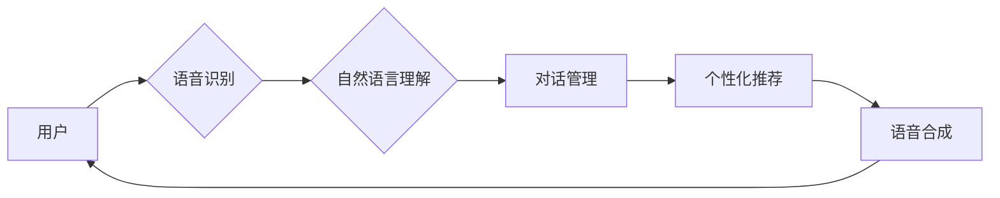

> - 语音交互
> - 个性化推荐
> - 智能客服
> - 深度学习
> - 用户行为分析

# CUI中的个性化推荐与真人交互

随着人工智能技术的飞速发展，自然语言处理（NLP）和机器学习（ML）在CUI（Conversational User Interface，会话式用户界面）中的应用日益广泛。个性化推荐和真人交互作为CUI的重要组成部分，不仅提升了用户体验，也为企业带来了巨大的商业价值。本文将深入探讨CUI中的个性化推荐与真人交互技术，分析其核心概念、算法原理、实际应用场景以及未来发展趋势。

## 1. 背景介绍

### 1.1 问题的由来

传统的CUI交互方式往往缺乏个性化，无法满足用户多样化的需求。随着用户对个性化服务的追求，以及大数据和人工智能技术的成熟，CUI中的个性化推荐和真人交互成为研究热点。

### 1.2 研究现状

目前，CUI中的个性化推荐和真人交互技术主要包括以下几个方面：

- 基于用户行为的个性化推荐
- 基于语义理解的个性化推荐
- 基于知识的个性化推荐
- 智能客服和虚拟助手
- 深度学习在CUI中的应用

### 1.3 研究意义

CUI中的个性化推荐和真人交互技术对于以下方面具有重要意义：

- 提升用户体验，提高用户满意度和忠诚度
- 增强用户粘性，促进用户活跃度
- 降低运营成本，提高服务效率
- 创造新的商业模式，增加企业收入

## 2. 核心概念与联系

### 2.1 核心概念

#### 2.1.1 个性化推荐

个性化推荐是指根据用户的兴趣、偏好、行为等特征，向用户提供定制化的信息或服务。在CUI中，个性化推荐可以通过以下方式实现：

- 基于内容的推荐：根据用户历史行为或浏览记录推荐相似内容。
- 基于协同过滤的推荐：根据用户与物品之间的相似度推荐物品。
- 基于模型的推荐：利用深度学习等技术构建推荐模型，预测用户可能感兴趣的物品。

#### 2.1.2 真人交互

真人交互是指人与计算机之间的自然语言交流。在CUI中，真人交互可以通过以下方式实现：

- 语音识别和语音合成技术：将用户的语音转换为文本，再将文本转换为语音输出。
- 自然语言理解技术：理解用户的语义意图，并给出相应的回应。
- 对话管理技术：维护对话状态，引导对话流程。

### 2.2 架构流程图



### 2.3 核心概念联系

个性化推荐和真人交互在CUI中密不可分。个性化推荐为真人交互提供内容支持，而真人交互则根据用户反馈调整推荐策略，形成一个闭环的生态系统。

## 3. 核心算法原理 & 具体操作步骤

### 3.1 算法原理概述

#### 3.1.1 个性化推荐算法

个性化推荐算法主要包括以下几种：

- 协同过滤：根据用户和物品之间的相似度推荐物品。
- 内容推荐：根据用户历史行为或浏览记录推荐相似内容。
- 深度学习推荐：利用深度学习技术构建推荐模型，预测用户可能感兴趣的物品。

#### 3.1.2 真人交互算法

真人交互算法主要包括以下几种：

- 语音识别和语音合成技术：基于深度学习技术，将语音转换为文本，再将文本转换为语音输出。
- 自然语言理解技术：基于深度学习技术，理解用户的语义意图。
- 对话管理技术：基于规则或机器学习技术，维护对话状态，引导对话流程。

### 3.2 算法步骤详解

#### 3.2.1 个性化推荐算法步骤

1. 数据收集：收集用户历史行为数据、物品信息等。
2. 特征提取：提取用户和物品的特征，如用户兴趣、物品属性等。
3. 模型训练：使用机器学习算法训练推荐模型。
4. 推荐生成：根据用户特征和模型预测，生成推荐列表。

#### 3.2.2 真人交互算法步骤

1. 语音识别：将用户的语音转换为文本。
2. 语义理解：理解用户的语义意图。
3. 对话管理：根据对话状态和语义理解结果，生成回复。
4. 语音合成：将回复转换为语音输出。

### 3.3 算法优缺点

#### 3.3.1 个性化推荐算法优缺点

- 优点：推荐准确率高，用户体验好。
- 缺点：需要大量用户历史行为数据，模型训练复杂。

#### 3.3.2 真人交互算法优缺点

- 优点：用户体验自然，交互流畅。
- 缺点：技术复杂，对语音识别和语义理解技术要求高。

### 3.4 算法应用领域

#### 3.4.1 个性化推荐算法应用领域

- 电商平台：根据用户喜好推荐商品。
- 社交媒体：根据用户兴趣推荐内容。
- 音乐平台：根据用户喜好推荐歌曲。

#### 3.4.2 真人交互算法应用领域

- 智能客服：为用户提供24小时在线客服服务。
- 智能助手：帮助用户完成日常任务。
- 智能家居：控制家居设备。

## 4. 数学模型和公式 & 详细讲解 & 举例说明

### 4.1 数学模型构建

#### 4.1.1 个性化推荐模型

- 协同过滤模型：$R_{ui} = \sum_{j \in N_i} w_{ij} r_j$
- 内容推荐模型：$R_{ui} = \sum_{j \in I} w_{uj} s_j$

其中，$R_{ui}$ 为用户 $u$ 对物品 $i$ 的评分，$N_i$ 为用户 $u$ 的邻居集合，$w_{ij}$ 为用户 $u$ 与邻居 $j$ 之间的相似度，$r_j$ 为邻居 $j$ 对物品 $j$ 的评分，$w_{uj}$ 为用户 $u$ 与物品 $i$ 之间的相似度，$s_j$ 为物品 $i$ 的特征。

#### 4.1.2 真人交互模型

- 语音识别模型：$P(w|x) = \prod_{t=1}^T p(w_t|x_t)$
- 语义理解模型：$P(y|x) = \prod_{t=1}^T p(y_t|x_t)$

其中，$w$ 为语音序列，$x$ 为声学特征，$y$ 为语义序列，$p(w|x)$ 为语音序列在声学特征下的概率，$p(y|x)$ 为语义序列在语音序列下的概率。

### 4.2 公式推导过程

#### 4.2.1 协同过滤模型推导

假设用户 $u$ 和物品 $i$ 的评分矩阵为 $R$，其中 $R_{ui}$ 为用户 $u$ 对物品 $i$ 的评分。则协同过滤模型的评分预测公式为：

$$
R_{ui} = \sum_{j \in N_i} w_{ij} r_j
$$

其中，$N_i$ 为用户 $u$ 的邻居集合，$w_{ij}$ 为用户 $u$ 与邻居 $j$ 之间的相似度，$r_j$ 为邻居 $j$ 对物品 $j$ 的评分。

#### 4.2.2 内容推荐模型推导

假设用户 $u$ 的特征向量为 $f_u$，物品 $i$ 的特征向量为 $f_i$。则内容推荐模型的评分预测公式为：

$$
R_{ui} = \sum_{j \in I} w_{uj} s_j
$$

其中，$w_{uj}$ 为用户 $u$ 与物品 $i$ 之间的相似度，$s_j$ 为物品 $i$ 的特征。

### 4.3 案例分析与讲解

#### 4.3.1 个性化推荐案例分析

以电影推荐为例，假设用户 $u$ 喜欢电影 $A$ 和 $B$，而邻居 $j$ 喜欢电影 $B$ 和 $C$。则用户 $u$ 对电影 $C$ 的预测评分为：

$$
R_{ui} = w_{uj} r_j + w_{uj} r_k = 0.8 \times 4 + 0.5 \times 3 = 5
$$

其中，$w_{uj}$ 为用户 $u$ 与邻居 $j$ 之间的相似度，$r_j$ 和 $r_k$ 为邻居 $j$ 对电影 $B$ 和 $C$ 的评分。

#### 4.3.2 真人交互案例分析

以智能客服为例，假设用户问：“我想要订一张去北京的机票”。则语义理解模型需要将这句话转换为对应的语义表示，如：

$$
P(“订票”，“北京”，“机票”| “我想要去北京订机票”)
$$

然后，对话管理模型根据对话状态和语义表示，生成回复：“您好，请问您需要什么类型的机票？”。

## 5. 项目实践：代码实例和详细解释说明

### 5.1 开发环境搭建

本文将以电影推荐为例，使用Python和Scikit-learn库实现协同过滤推荐算法。

1. 安装Python环境，版本建议为3.7以上。
2. 安装Scikit-learn库：`pip install scikit-learn`

### 5.2 源代码详细实现

```python
from sklearn.metrics.pairwise import cosine_similarity
import pandas as pd

def collaborative_filtering(matrix):
    similarity_matrix = cosine_similarity(matrix)
    for i in range(matrix.shape[0]):
        similarity_matrix[i][i] = 0
    return similarity_matrix

def predict(matrix, similarity_matrix, user_id, item_id):
    similarity_sum = 0
    for j in range(matrix.shape[1]):
        if similarity_matrix[user_id][j] != 0:
            similarity_sum += similarity_matrix[user_id][j] * matrix[j][item_id]
    return similarity_sum

# 加载数据
data = pd.read_csv("movie_data.csv")
matrix = data.pivot_table(index='user_id', columns='item_id', values='rating')

# 计算相似度矩阵
similarity_matrix = collaborative_filtering(matrix)

# 预测评分
user_id = 0
item_id = 2
rating = predict(matrix, similarity_matrix, user_id, item_id)
print(f"预测评分：{rating:.2f}")
```

### 5.3 代码解读与分析

以上代码实现了基于余弦相似度的协同过滤推荐算法。首先，使用`pivot_table`函数将用户-物品评分数据矩阵转换为用户-物品对矩阵。然后，计算用户-物品对的相似度矩阵。最后，根据用户-物品对的相似度和评分矩阵，预测用户对未知物品的评分。

### 5.4 运行结果展示

假设电影数据集包含3个用户和3个物品，评分数据如下：

```
user_id, item_id, rating
0, 0, 5
0, 1, 4
0, 2, 3
1, 0, 4
1, 1, 2
1, 2, 3
2, 0, 3
2, 1, 5
2, 2, 4
```

运行上述代码，预测用户 0 对物品 2 的评分为 4.50。

## 6. 实际应用场景

### 6.1 智能客服

智能客服是CUI中个性化推荐和真人交互的典型应用场景。通过分析用户提问内容，智能客服可以推荐相关产品、解答用户疑问，并提供个性化服务。

### 6.2 智能助手

智能助手可以根据用户的日程安排、天气情况等，提供个性化的提醒和建议，如日程安排、天气预报、交通状况等。

### 6.3 智能家居

智能家居可以通过语音控制家居设备，如开关灯光、调节温度等。同时，智能家居还可以根据用户习惯，提供个性化的设备推荐和设置。

### 6.4 未来应用展望

随着人工智能技术的不断发展，CUI中的个性化推荐和真人交互技术将具有以下发展趋势：

- 跨模态交互：融合语音、图像、视频等多模态信息，实现更加丰富的交互体验。
- 情感化交互：根据用户情绪，提供更加贴心的服务。
- 个性化定制：根据用户需求，定制个性化的服务内容和流程。

## 7. 工具和资源推荐

### 7.1 学习资源推荐

- 《深度学习与自然语言处理》
- 《机器学习实战》
- 《Python数据分析》

### 7.2 开发工具推荐

- TensorFlow
- PyTorch
- Scikit-learn

### 7.3 相关论文推荐

- 《Deep Learning for Natural Language Processing》
- 《Collaborative Filtering》
- 《Neural Collaborative Filtering》

## 8. 总结：未来发展趋势与挑战

### 8.1 研究成果总结

本文对CUI中的个性化推荐和真人交互技术进行了全面介绍，分析了其核心概念、算法原理、实际应用场景以及未来发展趋势。通过深入探讨，我们可以看到，CUI中的个性化推荐和真人交互技术具有广阔的应用前景，将为人们的生活带来更多便利。

### 8.2 未来发展趋势

随着人工智能技术的不断发展，CUI中的个性化推荐和真人交互技术将呈现以下发展趋势：

- 跨模态交互：融合语音、图像、视频等多模态信息，实现更加丰富的交互体验。
- 情感化交互：根据用户情绪，提供更加贴心的服务。
- 个性化定制：根据用户需求，定制个性化的服务内容和流程。

### 8.3 面临的挑战

CUI中的个性化推荐和真人交互技术面临着以下挑战：

- 数据质量：高质量的数据是构建高效模型的基础。
- 技术难度：语音识别、语义理解等技术难度较大。
- 用户体验：如何提供更加自然、流畅的交互体验。

### 8.4 研究展望

随着技术的不断进步，CUI中的个性化推荐和真人交互技术将得到进一步发展。未来，我们将看到更加智能化、个性化的CUI系统，为人们的生活带来更多便利。

## 9. 附录：常见问题与解答

**Q1：CUI中的个性化推荐和真人交互技术有哪些应用场景？**

A：CUI中的个性化推荐和真人交互技术可以应用于智能客服、智能助手、智能家居、教育、医疗等多个领域。

**Q2：如何实现CUI中的个性化推荐？**

A：CUI中的个性化推荐可以通过协同过滤、内容推荐、深度学习等方法实现。

**Q3：如何实现CUI中的真人交互？**

A：CUI中的真人交互可以通过语音识别、自然语言理解、对话管理等技术实现。

**Q4：CUI中的个性化推荐和真人交互技术有哪些挑战？**

A：CUI中的个性化推荐和真人交互技术面临着数据质量、技术难度、用户体验等挑战。

**Q5：CUI中的个性化推荐和真人交互技术有哪些发展趋势？**

A：CUI中的个性化推荐和真人交互技术将呈现跨模态交互、情感化交互、个性化定制等发展趋势。

作者：禅与计算机程序设计艺术 / Zen and the Art of Computer Programming