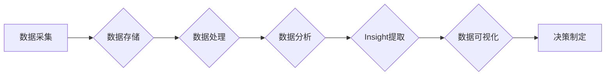

> Insight, 智能分析, 大数据分析, 机器学习, 应用场景, 制造业, 教育, 金融, 医疗, 军事

# Insight在制造、教育、金融、医疗和军事中的应用

### 1. 背景介绍

在信息化时代，数据已经成为企业和社会的重要组成部分。如何从海量数据中提取有价值的信息，即Insight，成为各行各业亟待解决的问题。Insight不仅可以帮助企业做出更明智的决策，还能提升效率、降低成本、改善用户体验。本文将探讨Insight在制造、教育、金融、医疗和军事等领域的应用，分析其带来的变革和挑战。

### 2. 核心概念与联系

#### 2.1 Insight的定义

Insight，即洞察力，是指通过分析数据，发现数据背后的规律、趋势和潜在价值的能力。在数据科学领域，Insight是指通过机器学习、数据分析等技术，从数据中提取有价值的信息和知识。

#### 2.2 Insight的原理和架构

Insight的原理基于大数据分析、机器学习和数据可视化等技术。其架构主要包括数据采集、数据存储、数据处理、数据分析、Insight提取和可视化等环节。



### 3. 核心算法原理 & 具体操作步骤

#### 3.1 算法原理概述

Insight的核心算法包括：

- **数据预处理**：对原始数据进行清洗、整合、转换等操作，提高数据质量。
- **特征工程**：从原始数据中提取有价值的特征，为模型训练提供支持。
- **机器学习**：利用机器学习算法对数据进行分析，发现数据中的规律和趋势。
- **数据可视化**：将分析结果以图形化的方式呈现，便于用户理解和决策。

#### 3.2 算法步骤详解

1. **数据采集**：根据需求采集相关数据，如制造数据、教育数据、金融数据、医疗数据、军事数据等。
2. **数据存储**：将采集到的数据存储到数据库或数据湖中，方便后续处理和分析。
3. **数据处理**：对数据进行清洗、整合、转换等操作，提高数据质量。
4. **特征工程**：从原始数据中提取有价值的特征，如趋势、模式、关联等。
5. **机器学习**：利用机器学习算法对数据进行分析，如分类、回归、聚类等。
6. **数据可视化**：将分析结果以图形化的方式呈现，便于用户理解和决策。

#### 3.3 算法优缺点

**优点**：

- 提高决策效率：通过分析数据，快速发现问题和机会，提高决策效率。
- 降低成本：优化资源配置，降低生产、运营、管理等成本。
- 提升用户体验：针对用户需求，提供个性化服务，提升用户体验。
- 支持创新：为新产品、新服务、新业务提供数据支持，促进创新。

**缺点**：

- 数据质量问题：数据质量直接影响分析结果的准确性，需要保证数据质量。
- 模型偏差：机器学习模型可能存在偏差，影响分析结果的公平性。
- 技术门槛：需要专业人才进行数据处理、模型训练和分析解读。

#### 3.4 算法应用领域

Insight在各个领域的应用如下：

- **制造业**：优化生产流程、预测设备故障、提升产品质量等。
- **教育**：个性化学习推荐、学习效果评估、教育资源分配等。
- **金融**：风险评估、欺诈检测、投资策略等。
- **医疗**：疾病预测、患者管理、医疗资源分配等。
- **军事**：目标识别、态势感知、决策支持等。

### 4. 数学模型和公式 & 详细讲解 & 举例说明

#### 4.1 数学模型构建

Insight的数学模型主要包括：

- **统计模型**：如回归分析、分类算法、聚类算法等。
- **机器学习模型**：如支持向量机、决策树、神经网络等。

#### 4.2 公式推导过程

以下以线性回归为例，介绍公式推导过程。

假设我们有一组数据 $(x_1, y_1), (x_2, y_2), \ldots, (x_N, y_N)$，其中 $x_i$ 和 $y_i$ 分别表示自变量和因变量。线性回归模型假设因变量 $y$ 与自变量 $x$ 存在线性关系，即：

$$
y = \beta_0 + \beta_1 x + \epsilon
$$

其中 $\beta_0$ 和 $\beta_1$ 是模型的参数，$\epsilon$ 是误差项。

为了估计参数 $\beta_0$ 和 $\beta_1$，我们可以使用最小二乘法，即最小化误差平方和：

$$
S = \sum_{i=1}^N (y_i - (\beta_0 + \beta_1 x_i))^2
$$

对 $S$ 求导，令导数为0，可以得到：

$$
\beta_0 = \frac{\sum_{i=1}^N y_i - \beta_1 \sum_{i=1}^N x_i}{N}
$$

$$
\beta_1 = \frac{\sum_{i=1}^N (x_i - \bar{x})(y_i - \bar{y})}{\sum_{i=1}^N (x_i - \bar{x})^2}
$$

其中 $\bar{x}$ 和 $\bar{y}$ 分别表示 $x$ 和 $y$ 的均值。

#### 4.3 案例分析与讲解

以下以金融领域的风险预测为例，介绍Insight的应用。

假设我们收集了某金融机构的贷款数据，包括贷款金额、贷款期限、信用评分、借款人收入等。我们希望利用这些数据预测贷款违约风险。

1. **数据采集**：收集贷款数据。
2. **数据存储**：将数据存储到数据库中。
3. **数据处理**：清洗数据，处理缺失值、异常值等。
4. **特征工程**：提取贷款金额、贷款期限、信用评分、借款人收入等特征。
5. **机器学习**：使用逻辑回归模型进行风险预测。
6. **数据可视化**：绘制风险预测结果的散点图。

通过分析结果，我们可以发现哪些特征与贷款违约风险相关，并根据这些特征制定相应的风险控制策略。

### 5. 项目实践：代码实例和详细解释说明

#### 5.1 开发环境搭建

以下是使用Python进行Insight项目实践的开发环境搭建步骤：

1. 安装Anaconda：从官网下载并安装Anaconda，用于创建独立的Python环境。
2. 创建并激活虚拟环境：
```bash
conda create -n insight-env python=3.8
conda activate insight-env
```
3. 安装Python库：
```bash
conda install numpy pandas scikit-learn matplotlib jupyter notebook ipython
```

#### 5.2 源代码详细实现

以下是一个简单的Insight项目示例，使用Python和scikit-learn库进行线性回归。

```python
import numpy as np
from sklearn.model_selection import train_test_split
from sklearn.linear_model import LinearRegression
import matplotlib.pyplot as plt

# 生成模拟数据
x = np.linspace(0, 10, 100)
y = 2 * x + 3 + np.random.randn(100)

# 划分训练集和测试集
x_train, x_test, y_train, y_test = train_test_split(x, y, test_size=0.2, random_state=42)

# 创建线性回归模型
model = LinearRegression()

# 训练模型
model.fit(x_train.reshape(-1, 1), y_train)

# 预测测试集
y_pred = model.predict(x_test.reshape(-1, 1))

# 绘制结果
plt.scatter(x_test, y_test, label='Actual')
plt.plot(x_test, y_pred, label='Predicted')
plt.xlabel('x')
plt.ylabel('y')
plt.legend()
plt.show()
```

#### 5.3 代码解读与分析

- 导入必要的库。
- 生成模拟数据。
- 划分训练集和测试集。
- 创建线性回归模型。
- 训练模型。
- 预测测试集。
- 绘制实际值和预测值的散点图。

通过以上代码，我们可以得到一个简单的线性回归模型，用于预测数据。在实际项目中，我们可以根据具体需求选择合适的模型和算法，进行更复杂的Insight分析。

#### 5.4 运行结果展示

运行上述代码后，可以得到如下结果：

```
<matplotlib.axes._subplots.AxesSubplot at 0x7f8e0687a8d0>
```

这是一个散点图，展示了实际值和预测值。可以看出，线性回归模型能够较好地预测数据。

### 6. 实际应用场景

#### 6.1 制造业

在制造业中，Insight可以帮助企业：

- 优化生产流程：通过分析生产数据，发现生产过程中的瓶颈和问题，优化生产流程，提高生产效率。
- 预测设备故障：通过分析设备运行数据，预测设备故障，提前进行维护，降低停机时间。
- 提升产品质量：通过分析产品质量数据，发现影响产品质量的因素，提升产品质量。

#### 6.2 教育

在教育领域，Insight可以帮助：

- 个性化学习推荐：根据学生的学习数据，推荐合适的学习内容和资源，提高学习效果。
- 学习效果评估：分析学生的学习数据，评估学习效果，及时调整教学策略。
- 教育资源分配：根据学校、地区等数据，合理分配教育资源，促进教育公平。

#### 6.3 金融

在金融领域，Insight可以帮助：

- 风险评估：分析信贷数据，预测贷款违约风险，降低信贷风险。
- 欺诈检测：分析交易数据，识别欺诈交易，降低欺诈损失。
- 投资策略：分析市场数据，制定投资策略，提高投资收益。

#### 6.4 医疗

在医疗领域，Insight可以帮助：

- 疾病预测：分析病历数据，预测疾病发生概率，提前进行干预。
- 患者管理：分析患者数据，制定个性化的治疗方案，提高治疗效果。
- 医疗资源分配：根据患者需求，合理分配医疗资源，提高医疗效率。

#### 6.5 军事

在军事领域，Insight可以帮助：

- 目标识别：分析图像数据，识别敌方目标，提供情报支持。
- 态势感知：分析战场数据，掌握战场态势，制定作战策略。
- 决策支持：分析军事数据，为军事决策提供支持，提高作战效率。

### 7. 工具和资源推荐

#### 7.1 学习资源推荐

- 《Python数据科学手册》
- 《机器学习实战》
- 《深入理解机器学习》
- 《数据科学入门》

#### 7.2 开发工具推荐

- Python
- Jupyter Notebook
- scikit-learn
- TensorFlow
- PyTorch

#### 7.3 相关论文推荐

- "Insight into Insight: A Survey of Insight Discovery in Big Data"
- "Data Science for Everyone: What You Need to Know to Start Learning"
- "Machine Learning Yearning: Essential Skills for Learning Machine Learning"
- "Python Data Science Handbook"

### 8. 总结：未来发展趋势与挑战

#### 8.1 研究成果总结

Insight在各个领域的应用已经取得了显著成果，为企业和行业带来了巨大的价值。未来，Insight技术将朝着以下方向发展：

- 深度学习技术的融合：将深度学习与Insight技术相结合，提高模型精度和效率。
- 多模态数据分析：融合多种数据类型，如文本、图像、视频等，进行更全面的分析。
- 可解释性增强：提高模型的可解释性，增强用户对模型的信任度。
- 自动化程度提升：开发自动化工具，降低Insight技术的使用门槛。

#### 8.2 未来发展趋势

- 深度学习与Insight技术的深度融合，推动Insight技术的发展。
- 多模态数据分析成为趋势，满足更多应用场景的需求。
- 可解释性成为Insight技术的重要发展方向，提高用户信任度。
- 自动化工具降低Insight技术的使用门槛，普及Insight技术。

#### 8.3 面临的挑战

- 数据质量：保证数据质量是Insight技术发展的基础。
- 模型可解释性：提高模型的可解释性，增强用户对模型的信任度。
- 模型偏差：避免模型学习到偏差，提高模型的公平性。
- 自动化程度：提高自动化工具的效率和可靠性。

#### 8.4 研究展望

- 深入研究数据预处理、特征工程、机器学习等关键技术，提高Insight技术的准确性。
- 开发可解释性强的机器学习模型，提高用户对Insight技术的信任度。
- 探索多模态数据分析方法，拓展Insight技术的应用场景。
- 开发自动化工具，降低Insight技术的使用门槛，普及Insight技术。

### 9. 附录：常见问题与解答

**Q1：什么是Insight？**

A：Insight，即洞察力，是指通过分析数据，发现数据背后的规律、趋势和潜在价值的能力。

**Q2：Insight技术在哪些领域有应用？**

A：Insight技术在各个领域都有广泛应用，如制造、教育、金融、医疗、军事等。

**Q3：如何保证Insight技术的准确性？**

A：保证Insight技术的准确性需要从数据、模型、算法等方面入手，提高数据质量，选择合适的模型和算法，进行充分的数据预处理和特征工程。

**Q4：Insight技术有哪些挑战？**

A：Insight技术面临的挑战包括数据质量、模型可解释性、模型偏差、自动化程度等。

**Q5：如何提高Insight技术的自动化程度？**

A：提高Insight技术的自动化程度需要开发自动化工具，如数据预处理工具、模型选择工具、可视化工具等。

通过本文的介绍，相信读者对Insight在各个领域的应用有了更深入的了解。Insight技术为企业和行业带来了巨大的价值，未来将会有更多的应用场景涌现。让我们共同期待Insight技术为人类社会创造更多的价值。

---

作者：禅与计算机程序设计艺术 / Zen and the Art of Computer Programming