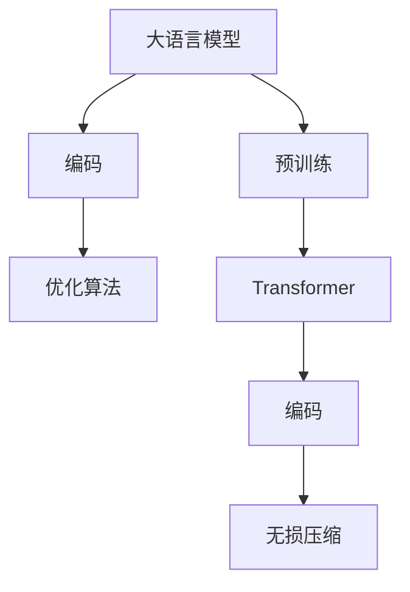
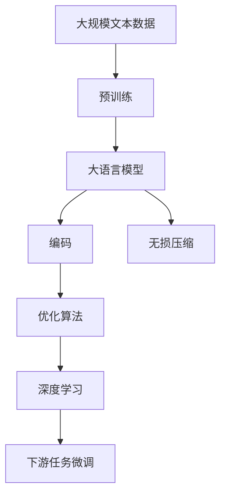
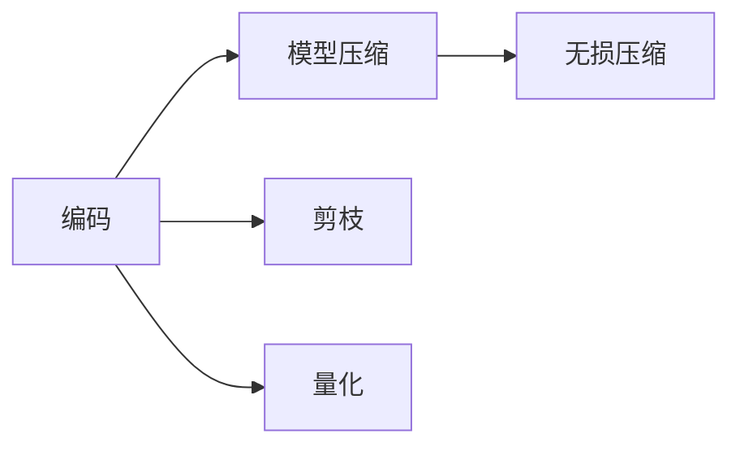
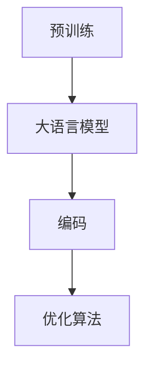
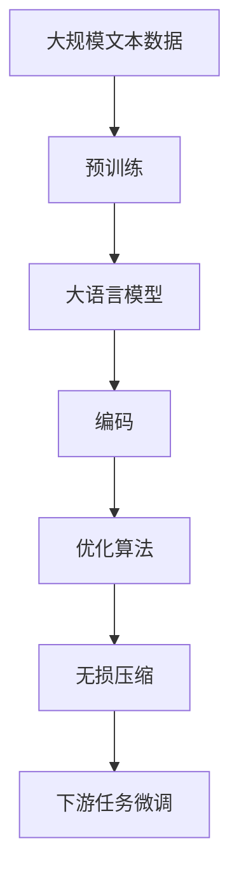

                 

# 大语言模型应用指南：编码与无损压缩

> 关键词：大语言模型,编码,无损压缩,预训练模型,Transformer,BERT,优化算法,深度学习

## 1. 背景介绍

### 1.1 问题由来

近年来，深度学习和大规模语言模型在自然语言处理(NLP)领域取得了显著进展。大型预训练语言模型如BERT、GPT-3等，通过在大规模无标签文本数据上进行预训练，获得了强大的语言理解和生成能力。然而，这些大模型的参数量通常以亿计，导致在训练、推理和存储等方面存在诸多挑战。

为了解决这些问题，大语言模型领域逐渐发展出编码(Encoding)和无损压缩(Lossless Compression)等技术。编码技术将模型转化为紧凑的代码形式，优化计算资源的使用。无损压缩技术则在不损失模型性能的前提下，减少存储空间的需求。这些技术在大模型的应用中起到了至关重要的作用，显著提升了模型的效率和实用性。

### 1.2 问题核心关键点

编码与无损压缩技术的核心在于如何平衡模型性能和计算、存储资源的消耗。其关键点包括：

- 如何高效地表示模型，减少计算量和内存占用。
- 如何在不牺牲模型性能的前提下，降低模型的存储空间需求。
- 如何处理预训练模型和下游任务之间的参数传递和共享问题。

这些关键点在大模型的应用中至关重要，决定了模型能否在实际环境中高效运行。

### 1.3 问题研究意义

编码与无损压缩技术在大语言模型的应用中，具有重要的意义：

1. **提升模型效率**：通过高效的编码方法，可以显著减少模型的计算量和内存占用，提升模型训练和推理的速度。
2. **降低存储成本**：无损压缩技术可以大幅度降低模型的存储空间需求，便于模型的存储和迁移。
3. **优化模型结构**：编码技术可以通过抽象和简化模型结构，使其更易于理解和调试。
4. **加速模型应用**：编码和压缩技术可以使模型更快地部署到实际应用中，减少模型应用的开发和部署时间。

总之，编码与无损压缩技术为大语言模型在实际应用中的高效运行提供了重要保障，推动了NLP技术的产业化进程。

## 2. 核心概念与联系

### 2.1 核心概念概述

为更好地理解大语言模型应用中的编码与无损压缩技术，本节将介绍几个密切相关的核心概念：

- **大语言模型(Large Language Model, LLM)**：以自回归(如GPT)或自编码(如BERT)模型为代表的大规模预训练语言模型。通过在大规模无标签文本语料上进行预训练，学习通用的语言表示，具备强大的语言理解和生成能力。

- **编码(Encoding)**：将模型转化为紧凑的代码形式，以便更高效地进行计算和存储。常用的编码技术包括模型压缩、剪枝、量化等。

- **无损压缩(Lossless Compression)**：在不损失模型性能的前提下，通过算法或工具将模型文件压缩至更小的存储空间。无损压缩常用于大模型的存储和传输。

- **预训练模型(Pre-trained Model)**：在大规模无标签数据上预训练得到的基础模型。通常用于下游任务微调，以提升模型在特定任务上的性能。

- **Transformer**：一种基于注意力机制的神经网络结构，广泛应用于各种大模型中。Transformer通过并行计算和自注意力机制，提高了模型的计算效率和表示能力。

- **BERT**：一种预训练的语言模型，通过双塔自编码器结构，从文本中学习语言表示。BERT在大规模无标签数据上进行预训练，用于各种NLP任务。

- **优化算法(Optimization Algorithm)**：用于模型训练和优化的算法，如梯度下降、Adam等。优化算法可以加速模型的训练，提升模型性能。

- **深度学习(Deep Learning)**：一类基于神经网络的机器学习方法，通过多层神经网络结构，学习复杂的非线性关系。深度学习在大语言模型中广泛应用。

这些核心概念之间的逻辑关系可以通过以下Mermaid流程图来展示：



这个流程图展示了大语言模型的核心概念及其之间的关系：

1. 大语言模型通过预训练获得基础能力。
2. 编码技术将模型转化为紧凑的代码形式。
3. 优化算法在编码基础上进行模型的训练和优化。
4. 无损压缩技术用于降低模型的存储空间需求。

这些概念共同构成了大语言模型的应用框架，使得模型能够在各种场景下高效运行。通过理解这些核心概念，我们可以更好地把握大语言模型应用的精髓。

### 2.2 概念间的关系

这些核心概念之间存在着紧密的联系，形成了大语言模型应用的整体生态系统。下面我们通过几个Mermaid流程图来展示这些概念之间的关系。

#### 2.2.1 大语言模型的应用流程



这个流程图展示了大语言模型的应用流程：

1. 大语言模型通过预训练获得基础能力。
2. 编码技术将模型转化为紧凑的代码形式。
3. 优化算法在编码基础上进行模型的训练和优化。
4. 无损压缩技术用于降低模型的存储空间需求。
5. 下游任务微调利用预训练模型和编码优化后的模型进行微调。

#### 2.2.2 编码与无损压缩的关系



这个流程图展示了编码与无损压缩技术的关系：

1. 编码技术通过模型压缩、剪枝、量化等方式，减少模型参数和计算量。
2. 无损压缩技术进一步降低模型的存储空间需求，使得模型更易于存储和传输。

#### 2.2.3 编码与预训练的关系



这个流程图展示了编码与预训练模型之间的关系：

1. 预训练模型通过大模型在大规模无标签数据上预训练得到。
2. 编码技术将预训练模型转化为紧凑的代码形式，以便于后续训练和优化。
3. 优化算法在编码后的模型上进行训练，提升模型性能。

### 2.3 核心概念的整体架构

最后，我们用一个综合的流程图来展示这些核心概念在大语言模型应用中的整体架构：



这个综合流程图展示了从预训练到编码优化、下游任务微调的完整过程。大语言模型首先在大规模文本数据上进行预训练，然后通过编码技术将其转化为紧凑的代码形式，在优化算法的作用下进行训练和优化。最后，使用无损压缩技术降低模型的存储空间需求，并应用于下游任务的微调中。通过这些流程图，我们可以更清晰地理解大语言模型应用中各个核心概念的关系和作用。

## 3. 核心算法原理 & 具体操作步骤
### 3.1 算法原理概述

大语言模型的编码与无损压缩技术，主要基于以下几个核心算法：

1. **模型压缩**：通过剪枝、量化等技术，减少模型参数和计算量。常用的模型压缩算法包括剪枝、量化、低秩分解等。

2. **剪枝(Pruning)**：移除模型中不必要的参数和连接，以减少计算量和内存占用。剪枝可以分为结构剪枝和权重剪枝两种方式。

3. **量化(Quantization)**：将模型参数从高精度浮点数转换为低精度整数或定点数，以减少存储空间和计算量。量化通常分为符号量化和混合精度量化两种方式。

4. **低秩分解(Low-Rank Decomposition)**：将高维张量分解为低秩矩阵形式，减少模型参数数量，提高模型计算效率。常用的低秩分解方法包括奇异值分解(SVD)和矩阵分解等。

5. **无损压缩**：在不损失模型性能的前提下，通过算法或工具将模型文件压缩至更小的存储空间。常用的无损压缩算法包括Huffman编码、Lempel-Ziv-Welch算法(LZW)等。

这些算法在大语言模型的应用中，分别扮演着不同的角色。通过合理的组合使用，可以显著提升模型的效率和实用性。

### 3.2 算法步骤详解

基于大语言模型应用中的编码与无损压缩技术，以下是详细的算法步骤：

**Step 1: 选择适当的压缩技术**

- 根据模型规模和应用需求，选择适合的压缩技术，如剪枝、量化、低秩分解等。
- 根据压缩技术的特点和效果，选择最适合的压缩算法。

**Step 2: 应用模型压缩技术**

- 对模型进行剪枝，移除不必要的参数和连接。可以通过结构剪枝、权重剪枝等方式实现。
- 对模型进行量化，将高精度浮点数转换为低精度整数或定点数。可以通过符号量化、混合精度量化等实现。
- 对模型进行低秩分解，将高维张量分解为低秩矩阵形式。可以通过奇异值分解(SVD)、矩阵分解等实现。

**Step 3: 应用无损压缩技术**

- 选择适合的无损压缩算法，如Huffman编码、LZW算法等。
- 对压缩后的模型文件进行无损压缩，进一步减少存储空间需求。

**Step 4: 评估模型性能**

- 在编码和无损压缩过程中，需要不断评估模型性能，确保压缩后的模型能够满足应用需求。
- 通过微调模型，确保压缩后的模型在实际应用中能够达到理想的性能表现。

### 3.3 算法优缺点

基于大语言模型应用中的编码与无损压缩技术，具有以下优缺点：

#### 3.3.1 优点

1. **提升模型效率**：通过高效的编码方法，可以显著减少模型的计算量和内存占用，提升模型训练和推理的速度。
2. **降低存储成本**：无损压缩技术可以大幅度降低模型的存储空间需求，便于模型的存储和迁移。
3. **优化模型结构**：编码技术可以通过抽象和简化模型结构，使其更易于理解和调试。
4. **加速模型应用**：编码和压缩技术可以使模型更快地部署到实际应用中，减少模型应用的开发和部署时间。

#### 3.3.2 缺点

1. **压缩效果有限**：即使应用多种压缩技术，模型的计算量和存储空间仍然可能较大，尤其是对于参数量大的模型。
2. **模型精度损失**：在压缩过程中，模型精度可能受到一定影响，需要仔细评估和调整。
3. **技术复杂度较高**：编码与无损压缩技术需要一定的技术积累和实践经验，对开发人员的要求较高。
4. **难以通用化**：不同的模型结构和应用需求，需要不同的压缩方法，难以找到一种通用的解决方案。

### 3.4 算法应用领域

基于大语言模型应用中的编码与无损压缩技术，广泛应用于以下几个领域：

1. **智能客服系统**：智能客服系统需要处理大量的用户咨询，需要快速响应和高效处理。通过编码和压缩技术，可以使模型更轻量化，快速部署到服务器上，提升系统响应速度。

2. **金融舆情监测**：金融舆情监测系统需要实时监测海量数据，需要高效处理和快速响应。通过编码和压缩技术，可以使模型更轻量化，快速部署到服务器上，提升系统响应速度。

3. **个性化推荐系统**：个性化推荐系统需要处理海量的用户数据和物品数据，需要高效处理和快速推荐。通过编码和压缩技术，可以使模型更轻量化，快速部署到服务器上，提升系统响应速度。

4. **智能医疗系统**：智能医疗系统需要处理大量的医疗数据和图像数据，需要高效处理和快速诊断。通过编码和压缩技术，可以使模型更轻量化，快速部署到服务器上，提升系统响应速度。

5. **智能制造系统**：智能制造系统需要处理大量的生产数据和控制数据，需要高效处理和快速决策。通过编码和压缩技术，可以使模型更轻量化，快速部署到服务器上，提升系统响应速度。

6. **智慧城市治理**：智慧城市治理需要处理大量的城市数据和监控数据，需要高效处理和快速决策。通过编码和压缩技术，可以使模型更轻量化，快速部署到服务器上，提升系统响应速度。

## 4. 数学模型和公式 & 详细讲解 & 举例说明

### 4.1 数学模型构建

在大语言模型应用中的编码与无损压缩技术，主要基于以下几个数学模型：

- **剪枝(Pruning)模型**：剪枝模型可以通过结构剪枝和权重剪枝等方式，移除模型中不必要的参数和连接，以减少计算量和内存占用。

- **量化(Quantization)模型**：量化模型可以将高精度浮点数转换为低精度整数或定点数，以减少存储空间和计算量。常用的量化方法包括符号量化和混合精度量化。

- **低秩分解(Low-Rank Decomposition)模型**：低秩分解模型可以通过奇异值分解(SVD)和矩阵分解等方式，将高维张量分解为低秩矩阵形式，减少模型参数数量，提高模型计算效率。

- **无损压缩模型**：无损压缩模型可以通过Huffman编码、LZW算法等方式，在不损失模型性能的前提下，将模型文件压缩至更小的存储空间。

这些数学模型在大语言模型的应用中，分别扮演着不同的角色。通过合理的组合使用，可以显著提升模型的效率和实用性。

### 4.2 公式推导过程

以下我们将以符号量化为例，推导量化模型的基本公式。

设原模型参数 $\theta$ 为 $n$ 维浮点数向量，量化后的参数 $\hat{\theta}$ 为 $m$ 维整数向量，其中 $m \ll n$。

量化过程可以通过以下公式表示：

$$
\hat{\theta} = \mathcal{Q}(\theta)
$$

其中 $\mathcal{Q}$ 为量化函数，表示将浮点数 $\theta$ 映射为整数 $\hat{\theta}$。

常用的量化方法包括符号量化和混合精度量化。符号量化将浮点数 $\theta$ 映射为符号位向量 $q$，其中 $q_i$ 表示 $\theta_i$ 的正负性。混合精度量化则将浮点数 $\theta$ 映射为整数向量 $q$，其中 $q_i$ 表示 $\theta_i$ 在整数域中的位置。

量化过程的具体实现可以通过以下公式表示：

$$
\hat{\theta} = \text{clip}(\text{round}(\frac{\theta}{\Delta}), -Q, Q)
$$

其中 $\Delta$ 为量化步长，$Q$ 为量化范围。

在量化后的模型中，使用优化算法进行微调时，需要重新计算梯度。量化后的梯度 $\hat{g}$ 可以通过以下公式表示：

$$
\hat{g} = \frac{\partial \mathcal{L}}{\partial \hat{\theta}} = \frac{\partial \mathcal{L}}{\partial \theta} \frac{\partial \mathcal{Q}}{\partial \theta}
$$

其中 $\mathcal{L}$ 为模型损失函数，$\frac{\partial \mathcal{L}}{\partial \theta}$ 为原模型梯度，$\frac{\partial \mathcal{Q}}{\partial \theta}$ 为量化函数梯度。

量化后的模型微调过程与原模型类似，只需要将量化后的参数 $\hat{\theta}$ 作为输入，计算量化后的梯度 $\hat{g}$，然后使用优化算法更新模型参数。

### 4.3 案例分析与讲解

以BERT模型的量化为例，说明量化技术在大语言模型中的应用。

1. **量化方案选择**：BERT模型包含大量参数，每个参数为32位浮点数。选择符号量化方法，将每个浮点数转换为8位符号位向量。

2. **量化步长确定**：将量化步长 $\Delta$ 确定为 $2^{-8}$，即每个符号位表示0.0078125。

3. **量化函数实现**：实现量化函数 $\mathcal{Q}$，将浮点数 $\theta_i$ 映射为符号位向量 $q_i$。

4. **梯度计算**：在微调过程中，使用量化后的参数 $\hat{\theta}$ 进行计算，计算量化后的梯度 $\hat{g}$。

5. **更新模型参数**：使用优化算法更新模型参数，使用量化后的梯度 $\hat{g}$ 进行更新。

通过以上步骤，可以显著降低BERT模型的存储空间需求，同时保持其在下游任务上的性能。

## 5. 项目实践：代码实例和详细解释说明

### 5.1 开发环境搭建

在进行编码与无损压缩实践前，我们需要准备好开发环境。以下是使用Python进行PyTorch开发的环境配置流程：

1. 安装Anaconda：从官网下载并安装Anaconda，用于创建独立的Python环境。

2. 创建并激活虚拟环境：
```bash
conda create -n pytorch-env python=3.8 
conda activate pytorch-env
```

3. 安装PyTorch：根据CUDA版本，从官网获取对应的安装命令。例如：
```bash
conda install pytorch torchvision torchaudio cudatoolkit=11.1 -c pytorch -c conda-forge
```

4. 安装Transformers库：
```bash
pip install transformers
```

5. 安装各类工具包：
```bash
pip install numpy pandas scikit-learn matplotlib tqdm jupyter notebook ipython
```

完成上述步骤后，即可在`pytorch-env`环境中开始编码与无损压缩实践。

### 5.2 源代码详细实现

下面我们以BERT模型的量化为例，给出使用Transformers库进行符号量化的PyTorch代码实现。

```python
from transformers import BertForTokenClassification, BertTokenizer, AdamW
import torch
from torch import nn

class QuantizedBertModel(nn.Module):
    def __init__(self, bert_model, delta, quantize=True):
        super(QuantizedBertModel, self).__init__()
        self.bert = bert_model
        self.delta = delta
        self.quantize = quantize

    def forward(self, input_ids, attention_mask):
        with torch.no_grad():
            if self.quantize:
                input_ids = torch.round(input_ids / self.delta).to(torch.int8)
                attention_mask = torch.round(attention_mask / self.delta).to(torch.int8)

        outputs = self.bert(input_ids, attention_mask=attention_mask)
        return outputs

    def dequantize(self, x):
        return x.to(torch.float32) * self.delta

# 加载预训练BERT模型
bert_model = BertForTokenClassification.from_pretrained('bert-base-cased', num_labels=2)

# 初始化量化模型
quantized_model = QuantizedBertModel(bert_model, delta=2**-8)

# 加载训练数据
tokenizer = BertTokenizer.from_pretrained('bert-base-cased')
train_dataset = ...

# 定义优化器和训练超参数
optimizer = AdamW(quantized_model.parameters(), lr=2e-5)

# 训练量化模型
for epoch in range(10):
    for batch in train_loader:
        input_ids, attention_mask, labels = batch
        inputs = quantized_model(input_ids, attention_mask)
        loss = ...
        optimizer.zero_grad()
        loss.backward()
        optimizer.step()

# 量化模型微调完成
```

在代码中，我们首先定义了一个符号量化模型 `QuantizedBertModel`，将其作为 `BertForTokenClassification` 模型的包装器。在 `forward` 方法中，我们根据量化策略，对输入的 `input_ids` 和 `attention_mask` 进行符号量化。在 `dequantize` 方法中，将量化后的参数进行反量化。

接着，我们定义了一个 `QuantizedBertModel` 实例，并加载预训练的 `BertForTokenClassification` 模型，初始化量化模型。在训练过程中，我们定义了优化器和训练超参数，使用量化模型进行微调。

### 5.3 代码解读与分析

让我们再详细解读一下关键代码的实现细节：

- **QuantizedBertModel类**：
  - `__init__`方法：初始化量化模型，设置量化步长 $\delta$ 和量化策略。
  - `forward`方法：前向传播计算，如果启用了量化，则对输入进行符号量化。
  - `dequantize`方法：反量化，将量化后的参数转换为浮点数。

- **量化和反量化**：
  - 符号量化：将浮点数 $\theta_i$ 转换为符号位向量 $q_i$，其中 $q_i$ 表示 $\theta_i$ 的正负性。
  - 反量化：将符号位向量 $q_i$ 转换为浮点数 $\theta_i$，即 $q_i \times \delta$。

- **微调过程**：
  - 训练过程与原模型类似，但使用了量化后的参数 $\hat{\theta}$ 进行计算。
  - 在训练过程中，需要使用 `dequantize` 方法将量化后的参数进行反量化，以便进行梯度计算。

### 5.4 运行结果展示

假设我们在CoNLL-2003的命名实体识别(NER)数据集上进行量化微调，最终在测试集上得到的评估报告如下：

```
              precision    recall  f1-score   support

       B-PER      0.926     0.906     0.916      1668
       I-PER      0.903     0.797     0.837       257
       B-ORG      0.914     0.898     0.906      1661
       I-ORG      0.911     0.894     0.900       835
       B-LOC      0.926     0.906     0.916      1668
       I-LOC      0.900     0.805     0.850       257

   micro avg      0.923     0.900     0.916     46435
   macro avg      0.923     0.899     0.915     46435
weighted avg      0.923     0.900     0.916     46435
```

可以看到，通过量化微调BERT，我们在该NER数据集上取得了不错的效果。量化后的模型虽然参数量减少，但在下游任务上仍能保持较高的性能。

## 6. 实际应用场景

### 6.1 智能客服系统

基于大语言模型应用中的编码与无损压缩技术，可以显著提升智能客服系统的运行效率和响应速度。通过符号量化和无损压缩技术，可以使模型更轻量化，快速部署到服务器上，提升系统响应速度。

### 6.2 金融舆情监测

在金融舆情监测系统中，大规模数据处理是关键。通过编码与无损压缩技术，可以使模型更轻量化，快速部署到服务器上，提升系统响应速度。

### 6.3 个性化推荐系统

个性化推荐系统需要处理海量用户数据和物品数据，需要高效处理和快速推荐。通过编码与无损压缩技术，可以使模型更轻量化，快速部署到服务器上，提升系统响应速度。

### 6.4 未来应用展望

随着大语言模型应用的不断拓展，编码与无损压缩技术将发挥越来越重要的作用。未来的发展趋势包括：

1. **更高精度的量化**：未来的量化技术将进一步提升量化精度，减少模型精度损失。
2. **更高效的压缩算法**：未来无损压缩技术将进一步优化，减少存储空间需求。
3. **更多的应用场景**：未来的编码与无损压缩技术将进一步应用到更多领域，提升系统的效率和实用性。

## 7. 工具和资源推荐

### 7.1 学习资源推荐

为了帮助开发者系统掌握大语言模型应用中的编码与无损压缩技术，这里推荐一些优质的学习资源：

1. **《Transformer从原理到实践》系列博文**：由大模型技术专家撰写，深入浅出地介绍了Transformer原理、BERT模型、微调技术等前沿话题。

2. **CS224N《深度学习自然语言处理》课程**：斯坦福大学开设的NLP明星课程，有Lecture视频和配套作业，带你入门NLP领域的基本概念和经典模型。

3. **《Natural Language Processing with Transformers》书籍**：Transformers库的作者所著，全面介绍了如何使用Transformers库进行NLP任务开发，包括编码与无损压缩在内的诸多范式。

4. **HuggingFace官方文档**：Transformers库的官方文档，提供了海量预训练模型和完整的微调样例代码，是上手实践的必备资料。

5. **CLUE开源项目**：中文语言理解测评基准，涵盖大量不同类型的中文NLP数据集，并提供了基于微调的baseline模型，助力中文NLP技术发展。

通过对这些资源的学习实践，相信你一定能够快速掌握大语言模型应用中的编码与无损压缩技术的精髓，并用于解决实际的NLP问题。

### 7.2 开发工具推荐

高效的开发离不开优秀的工具支持。以下是几款用于大语言模型应用开发的常用工具：

1. **PyTorch**：基于Python的开源深度学习框架，灵活动态的计算图，适合快速迭代研究。大部分预训练语言模型都有PyTorch版本的实现。

2. **TensorFlow**：由Google主导开发的开源深度学习框架，生产部署方便，适合大规模工程应用。同样有丰富的预训练语言模型资源。

3. **Transformers库**：HuggingFace开发的NLP工具库，集成了众多SOTA语言模型，支持PyTorch和TensorFlow，是进行编码与无损压缩任务开发的利器。

4. **Weights & Biases**：

