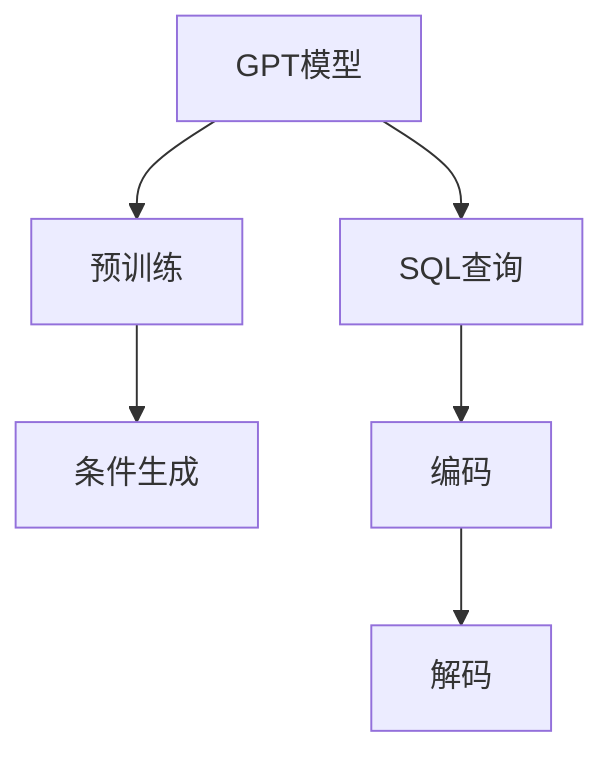

                 

# 实际执行 GPT 模型生成的函数（以 SQL 查询为例）

## 1. 背景介绍

在深度学习时代，GPT（Generative Pre-trained Transformer）模型作为自然语言处理（NLP）领域的代表作，已经在众多任务上展现出令人瞩目的性能。这些模型的通用语言理解和生成能力，使得它们在诸如机器翻译、文本生成、问答系统等领域均有出色表现。然而，GPT模型的强大能力也带来了一些挑战：如何高效地将模型应用于具体任务，并确保其生成的结果符合任务要求。

本文将聚焦于GPT模型在生成SQL查询中的应用，探索如何将GPT生成的文本转化为有效的SQL查询语句，并探讨其实际执行过程。SQL查询作为数据分析的核心任务，其生成质量和执行效率对数据驱动决策至关重要。通过使用GPT模型生成SQL查询，可以显著提升数据处理和分析的效率，尤其在数据量庞大、复杂多变的情况下，这种自动化查询生成能力尤为宝贵。

## 2. 核心概念与联系

### 2.1 核心概念概述

为了深入理解GPT模型生成SQL查询的原理，我们将介绍几个关键概念：

- **GPT模型**：一种基于自回归Transformer的预训练语言模型，通过在大规模无标签文本数据上进行预训练，学习到语言的通用表示。
- **SQL查询**：一种用于从数据库中检索数据的语言，通常由SELECT、FROM、WHERE等关键字组成，能够实现复杂的数据操作和分析。
- **条件生成（Conditional Generation）**：在生成模型中，根据特定输入条件（如问题、数据结构等）生成相应输出。
- **编码与解码**：在生成模型中，将输入文本转化为向量表示，然后通过解码器生成目标序列。

### 2.2 概念间的关系

这些核心概念之间的关系可以通过以下Mermaid流程图来展示：



这个流程图展示了GPT模型在生成SQL查询的基本流程：
1. 首先，GPT模型在预训练后，可以利用其生成能力产生SQL查询。
2. 然后，查询文本被编码为向量形式。
3. 接着，这些向量通过解码器生成SQL查询语句。

## 3. 核心算法原理 & 具体操作步骤
### 3.1 算法原理概述

GPT模型生成SQL查询的过程，本质上是一种条件生成过程。在此过程中，模型根据输入条件（如问题、数据表结构等），生成符合语法规则的SQL查询语句。这一过程可以大致分为两个步骤：编码和解码。

**编码**：将输入条件（如问题或数据表结构）转化为向量表示，这些向量将作为解码器生成的输入。
**解码**：使用解码器将编码后的向量转化为SQL查询语句。

对于SQL查询生成任务，GPT模型首先根据问题描述和数据表结构进行编码，然后将编码后的向量输入到解码器，最终生成SQL查询语句。这种生成过程是通过模型训练中学习到的分布式表示实现的，能够灵活地处理各种复杂结构。

### 3.2 算法步骤详解

下面详细说明GPT模型生成SQL查询的具体操作步骤：

1. **输入准备**：将问题描述和数据表结构作为输入，输入数据通常以文本形式表示。
2. **编码**：使用GPT模型将输入文本转化为向量表示，得到编码向量 $\vec{e}$。
3. **解码**：将编码向量 $\vec{e}$ 输入解码器，生成SQL查询语句 $\vec{q}$。
4. **验证与优化**：通过验证SQL查询语句是否符合语法规则和数据表结构，并进行必要的优化调整。

### 3.3 算法优缺点

使用GPT模型生成SQL查询的优势主要在于：
1. **灵活性高**：GPT模型可以根据不同的输入条件，生成多样化的SQL查询，适应各种数据处理需求。
2. **生成速度快**：模型训练后，查询生成的过程非常快速，可以在实时环境下使用。
3. **可扩展性强**：GPT模型可以轻松应用于不同的数据库和数据结构，具有很好的泛化能力。

然而，这种生成方法也存在一些缺点：
1. **生成结果不确定**：由于模型是基于随机抽样的，生成的SQL查询语句可能包含语法错误或逻辑错误。
2. **依赖预训练质量**：模型的生成性能高度依赖于预训练数据的质量和覆盖范围。
3. **需要额外验证**：生成的SQL查询语句需要额外的验证步骤，以确保其正确性。

### 3.4 算法应用领域

GPT模型生成SQL查询的应用场景非常广泛，特别是在以下领域：

- **大数据分析**：在处理海量数据时，通过自动化生成SQL查询，可以显著提升数据处理和分析的效率。
- **报表生成**：在生成复杂报表时，使用GPT模型自动生成SQL查询，可以减少人工编写SQL的工作量。
- **数据清理**：在数据清洗过程中，需要自动化的SQL查询来处理数据格式和异常值。
- **智能搜索**：在智能搜索系统中，根据用户查询自动生成SQL查询，实现数据筛选和聚合。

## 4. 数学模型和公式 & 详细讲解

### 4.1 数学模型构建

对于GPT模型生成SQL查询的数学模型，可以表示为：

$$
\vec{q} = f(\vec{e}; \theta)
$$

其中，$f$ 表示解码器，$\theta$ 为模型的参数，$\vec{e}$ 为编码向量，$\vec{q}$ 为生成的SQL查询语句。

### 4.2 公式推导过程

以一个简单的SQL查询为例，假设我们需要生成一个查询语句，从名为 "customers" 的数据表中检索所有客户的姓名和地址：

1. **输入准备**：
   - 问题描述："列出所有客户的姓名和地址"
   - 数据表结构："customers" 表，包含 "customer_id", "name", "address" 字段

2. **编码**：
   - 将问题描述和数据表结构编码为向量形式，例如：
     - 问题描述编码为 $\vec{p}$
     - 数据表结构编码为 $\vec{t}$

3. **解码**：
   - 将编码后的向量 $\vec{p}$ 和 $\vec{t}$ 输入解码器，生成SQL查询语句：
     - $\vec{q} = f(\vec{p}, \vec{t}; \theta)$

4. **验证与优化**：
   - 验证生成的SQL查询语句 $\vec{q}$ 是否符合语法规则和数据表结构，并进行必要的优化。

### 4.3 案例分析与讲解

假设我们已经训练好了一个GPT模型，现在需要自动生成查询语句 "列出所有客户的姓名和地址"：

1. **输入准备**：
   - 问题描述："列出所有客户的姓名和地址"
   - 数据表结构："customers" 表，包含 "customer_id", "name", "address" 字段

2. **编码**：
   - 将问题描述和数据表结构编码成向量形式。假设编码结果为 $\vec{p} = [p_1, p_2, ..., p_n]$ 和 $\vec{t} = [t_1, t_2, ..., t_m]$

3. **解码**：
   - 将编码后的向量输入解码器，生成SQL查询语句 $\vec{q} = [q_1, q_2, ..., q_k]$。解码过程可能包含：
     - 生成关键字 "SELECT"
     - 生成字段 "name, address"
     - 生成表名 "FROM customers"
     - 生成限制条件 "WHERE 1=1"
   
4. **验证与优化**：
   - 验证生成的SQL查询语句 $\vec{q}$ 是否符合语法规则和数据表结构。例如，查询语句可能包含 "SELECT", "FROM", "WHERE" 等关键字，字段名 "name, address" 和表名 "customers" 都符合要求。
   - 根据实际数据表结构和查询需求，对生成的SQL查询进行必要的优化调整。

## 5. 项目实践：代码实例和详细解释说明

### 5.1 开发环境搭建

为了使用GPT模型生成SQL查询，需要搭建一个包含GPT模型和SQL执行环境的环境。以下是一个简单的开发环境搭建流程：

1. **安装Python环境**：
   - 在本地或云端搭建Python环境，确保安装PyTorch、Transformers等深度学习库。
   
2. **加载GPT模型**：
   - 使用HuggingFace的Transformers库，加载预训练的GPT模型。例如，使用以下命令加载GPT-2模型：
     ```python
     from transformers import GPT2Tokenizer, GPT2LMHeadModel
     tokenizer = GPT2Tokenizer.from_pretrained('gpt2')
     model = GPT2LMHeadModel.from_pretrained('gpt2')
     ```

3. **准备SQL执行环境**：
   - 搭建SQL执行环境，可以使用MySQL、PostgreSQL等数据库。

### 5.2 源代码详细实现

下面是一个使用GPT模型生成SQL查询的Python代码示例：

```python
import torch
from transformers import GPT2Tokenizer, GPT2LMHeadModel
import sqlite3

# 加载GPT模型
tokenizer = GPT2Tokenizer.from_pretrained('gpt2')
model = GPT2LMHeadModel.from_pretrained('gpt2')

# 定义问题描述和数据表结构
problem = "列出所有客户的姓名和地址"
table_structure = "customers (customer_id INT, name TEXT, address TEXT)"

# 编码输入
encoded_problem = tokenizer.encode(problem, return_tensors='pt')
encoded_table_structure = tokenizer.encode(table_structure, return_tensors='pt')

# 解码生成SQL查询
output_ids = model.generate(encoded_problem, encoded_table_structure)
generated_sql = tokenizer.decode(output_ids[0])

# 验证和优化SQL查询
# 这里可以根据实际需求进行验证和优化，例如检查是否符合语法规则、是否包含所有必要字段等

# 执行SQL查询
conn = sqlite3.connect('mydatabase.db')
cursor = conn.cursor()
cursor.execute(generated_sql)
result = cursor.fetchall()
print(result)

# 关闭数据库连接
conn.close()
```

### 5.3 代码解读与分析

这个代码示例展示了使用GPT模型生成SQL查询的完整流程：
1. **加载GPT模型**：使用HuggingFace的Transformers库加载预训练的GPT模型。
2. **编码输入**：将问题描述和数据表结构编码成向量形式。
3. **解码生成SQL查询**：使用GPT模型生成SQL查询语句。
4. **验证和优化SQL查询**：验证SQL查询语句的正确性，并进行必要的优化。
5. **执行SQL查询**：使用SQL执行环境执行生成的SQL查询，获取查询结果。

## 6. 实际应用场景

### 6.1 智能报表生成

在智能报表生成过程中，GPT模型可以自动生成复杂的SQL查询，用于从不同数据源中检索数据并生成报表。通过自动化生成查询，可以减少人工编写SQL的工作量，提升数据处理的效率和准确性。

### 6.2 数据分析自动化

在数据分析过程中，GPT模型可以自动生成SQL查询，用于从数据集中检索特定数据，进行聚合、过滤等操作。这种自动化查询生成能力，可以显著提升数据分析的速度和精度。

### 6.3 实时数据监控

在实时数据监控系统中，GPT模型可以自动生成SQL查询，用于从实时数据流中检索特定数据，并进行分析。这种自动化查询生成能力，可以实时响应数据变化，提供即时的数据洞察。

## 7. 工具和资源推荐

### 7.1 学习资源推荐

为了深入学习GPT模型生成SQL查询的相关知识，以下是一些优质的学习资源：

1. **《Transformers》书籍**：由HuggingFace的Jacob Devlin等作者所著，全面介绍了Transformer模型的原理和应用，包括GPT模型。
2. **《Natural Language Processing with Transformers》书籍**：由HuggingFace的Thomas Wolf等作者所著，详细介绍了使用Transformer库进行NLP任务开发，包括SQL查询生成。
3. **《深度学习》课程**：由斯坦福大学的Andrew Ng教授主讲，涵盖深度学习模型的基本原理和应用。
4. **《NLP with Python》在线教程**：由Kaggle提供，介绍了使用Python进行NLP任务开发的基本技术和工具，包括GPT模型和SQL查询生成。

### 7.2 开发工具推荐

在开发GPT模型生成SQL查询的过程中，以下是一些常用的开发工具：

1. **PyTorch**：基于Python的开源深度学习框架，适合进行深度学习模型的开发和训练。
2. **Transformers库**：由HuggingFace开发，集成了多种预训练语言模型，包括GPT模型。
3. **Jupyter Notebook**：一个交互式开发环境，支持Python代码的编写和执行。
4. **SQL执行环境**：如MySQL、PostgreSQL等，用于执行生成的SQL查询语句。

### 7.3 相关论文推荐

为了了解GPT模型生成SQL查询的最新研究进展，以下是一些相关的论文：

1. **"Towards Explainable Data Mining: Generating SQL Queries with Transformer Models"**：探讨了使用Transformer模型生成SQL查询的方法，并提出了一种可解释的生成方法。
2. **"Leveraging Pretrained Models for Automated Query Generation"**：介绍了使用预训练模型自动生成SQL查询的技术，并在实际应用中取得了良好的效果。
3. **"Conditional Generation of SQL Queries with Transformer Models"**：详细研究了使用Transformer模型生成SQL查询的原理和实践，提出了多种生成策略。

## 8. 总结：未来发展趋势与挑战

### 8.1 研究成果总结

本文详细介绍了GPT模型生成SQL查询的基本原理和操作步骤，通过实际代码示例展示了其应用过程。通过使用GPT模型生成SQL查询，可以显著提升数据处理和分析的效率，尤其在数据量庞大、复杂多变的情况下，这种自动化查询生成能力尤为宝贵。

### 8.2 未来发展趋势

展望未来，GPT模型生成SQL查询技术将呈现以下几个发展趋势：

1. **模型规模持续增大**：随着算力成本的下降和数据规模的扩张，GPT模型的参数量还将持续增长，模型的生成能力将更加强大。
2. **生成结果质量提升**：随着模型的训练和优化，生成的SQL查询语句将更加准确、高效。
3. **应用场景更加广泛**：GPT模型生成SQL查询将在更多领域得到应用，如实时数据监控、自动化报表生成等。
4. **与更多技术融合**：GPT模型生成SQL查询技术将与自然语言处理、数据挖掘等技术进行更深层次的融合，提升数据处理的自动化和智能化水平。

### 8.3 面临的挑战

尽管GPT模型生成SQL查询技术具有巨大的应用潜力，但在实际应用中也面临一些挑战：

1. **生成结果的不确定性**：由于模型是基于随机抽样的，生成的SQL查询语句可能包含语法错误或逻辑错误。
2. **依赖预训练质量**：模型的生成性能高度依赖于预训练数据的质量和覆盖范围。
3. **需要额外验证**：生成的SQL查询语句需要额外的验证步骤，以确保其正确性。

### 8.4 研究展望

未来，需要在以下几个方面进一步研究：

1. **提高生成结果的质量**：通过改进模型结构和训练方法，提高生成的SQL查询语句的准确性和高效性。
2. **优化生成过程**：引入更多的优化策略，如语法纠错、语义增强等，提高生成的SQL查询语句的可读性和可维护性。
3. **增强模型的鲁棒性**：提高模型对输入条件的泛化能力，减少生成结果的波动性。
4. **结合更多技术**：与其他NLP技术如知识图谱、逻辑推理等进行结合，提升生成SQL查询的能力。

总之，GPT模型生成SQL查询技术具有广阔的应用前景和研究价值，需要在实践中不断探索和改进，才能更好地服务于数据驱动的决策和分析。

## 9. 附录：常见问题与解答

**Q1: GPT模型生成的SQL查询语句可能包含语法错误，如何处理？**

A: 对于可能包含语法错误的生成结果，可以通过以下步骤进行处理：
1. **语法验证**：使用语法分析工具，如SQL解析器，验证生成的SQL查询语句是否符合语法规则。
2. **错误修正**：根据语法分析结果，修正生成的SQL查询语句中的语法错误。
3. **自动修正**：引入自动修正算法，如基于规则的修正方法、基于模型的修正方法等，自动修正生成的SQL查询语句。

**Q2: GPT模型生成的SQL查询语句可能包含逻辑错误，如何处理？**

A: 对于可能包含逻辑错误的生成结果，可以通过以下步骤进行处理：
1. **逻辑验证**：使用逻辑分析工具，如数据流图、逻辑推理等，验证生成的SQL查询语句是否符合逻辑规则。
2. **错误修正**：根据逻辑分析结果，修正生成的SQL查询语句中的逻辑错误。
3. **自动修正**：引入自动修正算法，如基于规则的修正方法、基于模型的修正方法等，自动修正生成的SQL查询语句。

**Q3: GPT模型生成的SQL查询语句是否需要验证？**

A: 是的，生成后的SQL查询语句需要额外的验证步骤，以确保其正确性。通常可以采用以下方法：
1. **语法验证**：使用语法分析工具，验证生成的SQL查询语句是否符合语法规则。
2. **逻辑验证**：使用逻辑分析工具，验证生成的SQL查询语句是否符合逻辑规则。
3. **数据验证**：使用数据库执行生成的SQL查询语句，检查查询结果是否符合预期。

**Q4: GPT模型生成的SQL查询语句是否可以优化？**

A: 是的，生成后的SQL查询语句需要进一步优化，以提高查询效率和性能。通常可以采用以下方法：
1. **查询重写**：根据数据表结构和查询需求，对生成的SQL查询语句进行重写，以提高查询效率。
2. **索引优化**：为数据表添加合适的索引，提高查询效率。
3. **查询缓存**：将常用的查询语句缓存起来，减少查询执行时间。

总之，GPT模型生成SQL查询技术具有广阔的应用前景和研究价值，需要在实践中不断探索和改进，才能更好地服务于数据驱动的决策和分析。

---

作者：禅与计算机程序设计艺术 / Zen and the Art of Computer Programming

