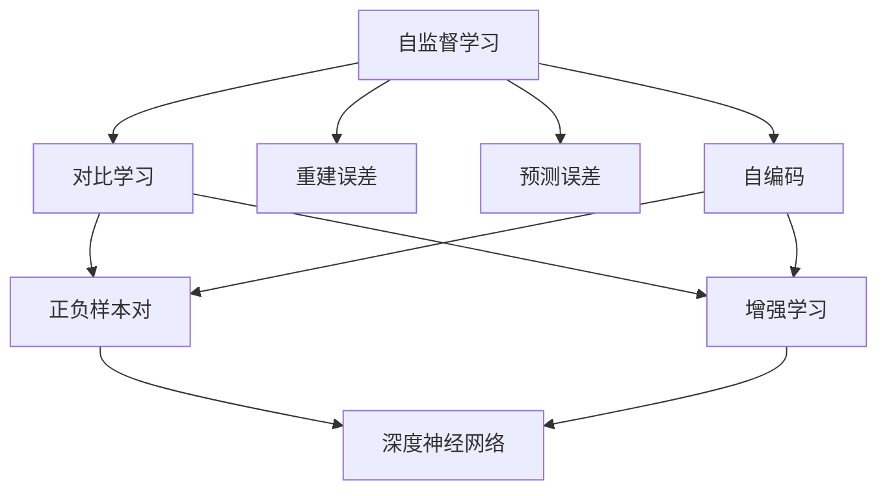
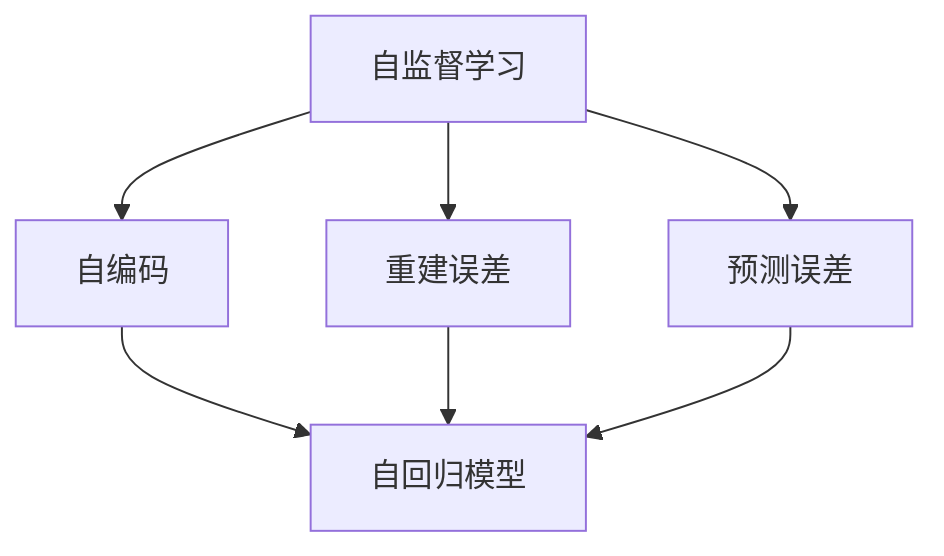
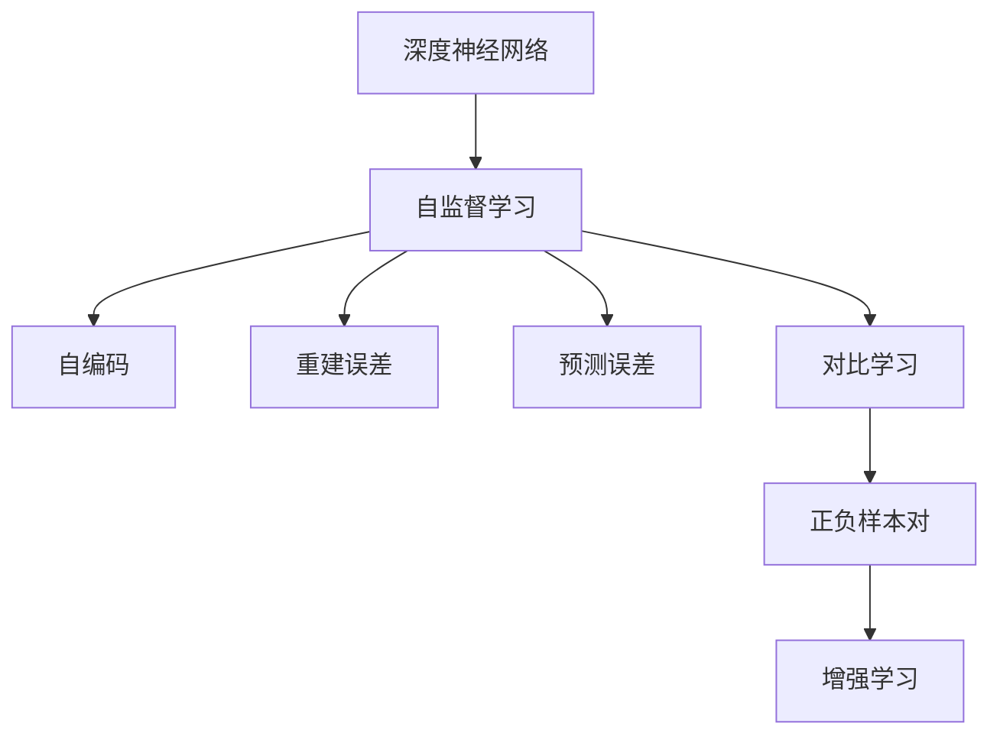
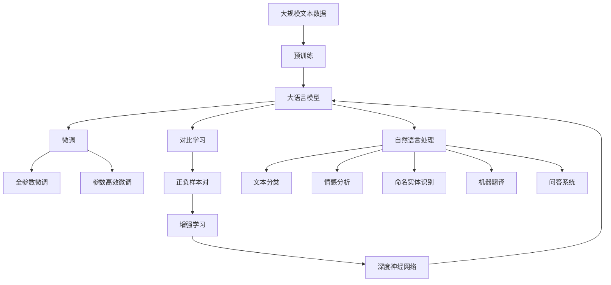

                 

# 对比学习Contrastive Learning原理与代码实例讲解

> 关键词：对比学习,正负样本,自监督学习,强化学习,auto-encoder,自回归模型,深度神经网络

## 1. 背景介绍

### 1.1 问题由来
随着深度学习技术的快速发展，自监督学习（Self-Supervised Learning）成为了一种重要的模型训练方法。传统的监督学习需要大量标注数据，而自监督学习则可以在无标签数据上训练模型，获得良好的泛化能力。

对比学习（Contrastive Learning）作为一种特殊的自监督学习范式，通过构造正负样本对（positive-negative pairs），使模型学习如何区分不同的样本，从而达到自监督学习的目标。这种方法不需要标签数据，也不需要复杂的任务设计，因此受到了研究者的广泛关注。

对比学习最早可以追溯到20世纪60年代，但其在深度学习中的实际应用直到近几年的研究表明，对比学习能够在不同领域、不同任务上获得优秀的性能。

## 2. 核心概念与联系

### 2.1 核心概念概述

为更好地理解对比学习的核心思想，本节将介绍几个密切相关的核心概念：

- 自监督学习（Self-Supervised Learning）：指在没有标签数据的情况下，通过利用数据的内在结构和特征，训练深度神经网络模型的方法。常见的自监督学习方法包括重建误差（Reconstruction Error）、预测误差（Predictive Error）、自编码（Auto-Encoder）等。
- 正负样本对（Positive-negative Pair）：指由一个样本及其相似样本和不同样本组成的一对样本。在对比学习中，模型通过学习区分正负样本对，从而学习到特征表示。
- 增强学习（Reinforcement Learning）：通过与环境交互，基于奖励信号（Reward Signal）不断调整模型策略，以实现特定的优化目标。
- 自回归模型（Autoregressive Model）：一种建模时间序列数据的方法，通过预测未来的数据点来拟合过去的数据点。常见的自回归模型包括ARIMA、LSTM等。
- 深度神经网络（Deep Neural Network）：由多个神经元组成的网络结构，具有很强的非线性拟合能力。对比学习中的模型通常都是深度神经网络。

这些核心概念之间的逻辑关系可以通过以下Mermaid流程图来展示：



这个流程图展示了自己监督学习、自监督学习、对比学习、正负样本对、增强学习等概念之间的关系：

1. 自监督学习可以通过重建误差、预测误差等方法，训练深度神经网络。
2. 对比学习是一种特殊的自监督学习方法，通过学习正负样本对，训练模型特征表示。
3. 增强学习通过与环境交互，基于奖励信号调整模型策略。
4. 自回归模型用于建模时间序列数据。
5. 深度神经网络是实现上述学习方法和模型结构的载体。

这些概念共同构成了深度学习中对比学习的核心思想和框架，使其能够有效地在无标签数据上训练出高质量的模型。

### 2.2 概念间的关系

这些核心概念之间存在着紧密的联系，形成了对比学习的完整生态系统。下面我通过几个Mermaid流程图来展示这些概念之间的关系。

#### 2.2.1 自监督学习的范式



这个流程图展示了自监督学习的基本方法，包括自编码、重建误差和预测误差。

#### 2.2.2 对比学习与增强学习的联系


这个流程图展示了对比学习和增强学习之间的联系。通过学习正负样本对，模型可以生成样本之间的奖励信号，从而指导模型优化策略。

#### 2.2.3 深度神经网络的结构



这个流程图展示了深度神经网络在自监督学习、自编码、重建误差、预测误差和对比学习中的作用。

### 2.3 核心概念的整体架构

最后，我们用一个综合的流程图来展示这些核心概念在大语言模型微调过程中的整体架构：



这个综合流程图展示了从预训练到微调，再到对比学习的完整过程。大语言模型首先在大规模文本数据上进行预训练，然后通过微调（包括全参数微调和参数高效微调）或对比学习（包括正负样本对和增强学习）来适应下游任务。最终，通过深度神经网络模型，实现自然语言处理任务，如文本分类、情感分析、命名实体识别、机器翻译、问答系统等。

## 3. 核心算法原理 & 具体操作步骤
### 3.1 算法原理概述

对比学习是一种特殊的自监督学习方法，其核心思想是通过学习样本之间的相似性和差异性，训练模型的特征表示。具体来说，对比学习通过构造正负样本对，使模型学习如何区分不同的样本，从而达到自监督学习的目标。

形式化地，假设样本空间为 $X$，特征表示为 $z$。对于样本 $x_1, x_2$，通过一个可微函数 $f: X \rightarrow z$ 将其映射到特征空间 $z$。则正负样本对可以表示为：

$$
(x_1^+, x_1^-) = (f(x_1), f(x_1))
$$

$$
(x_2^-, x_2^+) = (f(x_2), f(x_2))
$$

其中，$x_1^+$ 表示与 $x_1$ 相似的样本，$x_1^-$ 表示与 $x_1$ 不相似的样本。类似地，$x_2^-$ 表示与 $x_2$ 相似的样本，$x_2^+$ 表示与 $x_2$ 不相似的样本。

对比学习的目标是通过最大化正样本相似性，最小化负样本相似性，训练模型特征表示 $z$。具体地，对比学习的损失函数可以表示为：

$$
L = \frac{1}{N}\sum_{i=1}^N L_i
$$

$$
L_i = \max_{i'} [\log \sigma(f(x_i), f(x_i^+)) - \log(1-\sigma(f(x_i), f(x_i^-))]
$$

其中，$\sigma$ 为softmax函数，$L_i$ 表示样本 $i$ 的损失函数，$x_i^+$ 和 $x_i^-$ 分别为样本 $i$ 的正负样本对。整个损失函数 $L$ 最大化正样本相似性，最小化负样本相似性。

### 3.2 算法步骤详解

基于对比学习的核心思想，接下来我们详细介绍对比学习的具体操作步骤。

**Step 1: 准备训练数据**

- 收集训练数据 $X$，每个样本 $x_i$ 都是一个向量。
- 选择正负样本对 $(x_i^+, x_i^-)$。通常可以采用随机采样、K近邻、余弦相似度等方法来构造正负样本对。

**Step 2: 映射到特征空间**

- 使用一个深度神经网络 $f: X \rightarrow z$ 将训练数据 $X$ 映射到特征空间 $z$。
- 映射函数 $f$ 通常是一个多层感知器（MLP）或卷积神经网络（CNN）。

**Step 3: 计算正负样本相似性**

- 对于每个样本 $x_i$，计算其正负样本在特征空间 $z$ 上的相似性。
- 正样本相似性 $s_i^+$ 可以表示为 $f(x_i)$ 和 $f(x_i^+)$ 的余弦相似度、欧式距离等。
- 负样本相似性 $s_i^-$ 可以表示为 $f(x_i)$ 和 $f(x_i^-)$ 的余弦相似度、欧式距离等。

**Step 4: 计算对比损失**

- 对于每个样本 $x_i$，计算其对比损失 $L_i$。
- 对比损失 $L_i$ 可以表示为 $s_i^+$ 和 $s_i^-$ 的差值。
- 整个对比学习的损失函数 $L$ 可以表示为所有样本 $x_i$ 的对比损失之和。

**Step 5: 优化模型参数**

- 使用梯度下降等优化算法，最小化对比损失 $L$，更新模型参数 $f$。
- 优化算法可以使用AdamW、SGD等。

通过上述步骤，对比学习可以最大化正样本相似性，最小化负样本相似性，从而训练模型特征表示 $z$。在训练过程中，正负样本对的构造和相似性计算都是关键因素，其选择和优化直接影响对比学习的效果。

### 3.3 算法优缺点

对比学习作为一种自监督学习方法，具有以下优点：

1. 不需要标签数据。对比学习可以在无标签数据上训练模型，有效利用数据的内在结构和特征，提升模型的泛化能力。
2. 可扩展性强。对比学习可以应用于各种不同的任务和领域，通过构造正负样本对，模型可以学习到特定的特征表示。
3. 鲁棒性强。对比学习可以自动排除噪声和异常值，增强模型的鲁棒性。
4. 可解释性强。对比学习的训练过程和目标函数都是直观的，便于理解和调试。

同时，对比学习也存在一些缺点：

1. 计算复杂度高。对比学习需要计算大量的正负样本对，计算复杂度较高。
2. 正负样本对难以构造。正负样本对的构造需要精心设计，如果正负样本对选择不当，可能会影响对比学习的效果。
3. 可能存在梯度消失问题。在训练过程中，如果正负样本对差异过大，可能会影响模型的梯度更新，导致梯度消失问题。
4. 无法处理多模态数据。对比学习通常只适用于单一模态数据，无法处理多模态数据。

尽管存在这些局限性，但对比学习仍然是一种非常有效的自监督学习方法，在深度学习中被广泛应用。

### 3.4 算法应用领域

对比学习作为一种自监督学习方法，可以应用于各种不同的任务和领域。以下是对比学习的一些典型应用领域：

1. 计算机视觉：在图像分类、目标检测、图像生成等任务上，对比学习可以学习图像的特征表示，提升模型的泛化能力。
2. 自然语言处理：在文本分类、情感分析、命名实体识别、机器翻译等任务上，对比学习可以学习文本的特征表示，提升模型的泛化能力。
3. 音频处理：在语音识别、语音生成、音乐生成等任务上，对比学习可以学习音频的特征表示，提升模型的泛化能力。
4. 强化学习：在智能博弈、自动控制、机器人导航等任务上，对比学习可以学习环境与智能体之间的相似性，提升模型的泛化能力。
5. 信号处理：在信号分类、信号去噪等任务上，对比学习可以学习信号的特征表示，提升模型的泛化能力。

## 4. 数学模型和公式 & 详细讲解 & 举例说明

### 4.1 数学模型构建

对比学习的形式化模型可以表示为：

$$
L = \frac{1}{N}\sum_{i=1}^N \max_{i'} [\log \sigma(f(x_i), f(x_i^+)) - \log(1-\sigma(f(x_i), f(x_i^-))]
$$

其中，$x_i$ 表示样本，$f(x_i)$ 表示样本的特征表示，$f(x_i^+)$ 表示正样本的特征表示，$f(x_i^-)$ 表示负样本的特征表示，$\sigma$ 表示softmax函数。

### 4.2 公式推导过程

对比学习的推导过程如下：

1. 对于每个样本 $x_i$，计算其正负样本在特征空间 $z$ 上的相似性。
2. 对于每个样本 $x_i$，计算其对比损失 $L_i$。
3. 对于所有样本 $x_i$，计算对比损失 $L$。

对比损失 $L_i$ 可以表示为：

$$
L_i = \max_{i'} [\log \sigma(f(x_i), f(x_i^+)) - \log(1-\sigma(f(x_i), f(x_i^-))]
$$

其中，$\sigma$ 表示softmax函数，$f(x_i)$ 表示样本 $x_i$ 的特征表示，$f(x_i^+)$ 表示正样本的特征表示，$f(x_i^-)$ 表示负样本的特征表示。

对比损失 $L$ 可以表示为：

$$
L = \frac{1}{N}\sum_{i=1}^N \max_{i'} [\log \sigma(f(x_i), f(x_i^+)) - \log(1-\sigma(f(x_i), f(x_i^-))]
$$

其中，$x_i$ 表示样本，$f(x_i)$ 表示样本的特征表示，$f(x_i^+)$ 表示正样本的特征表示，$f(x_i^-)$ 表示负样本的特征表示，$\sigma$ 表示softmax函数。

### 4.3 案例分析与讲解

以下是一个对比学习的案例分析：

假设我们有一组图像数据 $X = \{x_1, x_2, \dots, x_N\}$，每个图像 $x_i$ 是一个 $28 \times 28$ 的灰度图像。我们希望学习图像的特征表示，以便在图像分类任务上取得好成绩。

我们可以将每个图像 $x_i$ 映射到一个 $100$ 维的特征空间 $z$，使用一个深度神经网络 $f: X \rightarrow z$ 作为映射函数。对于每个图像 $x_i$，我们随机选择一个正样本 $x_i^+$ 和一个负样本 $x_i^-$。

在特征空间 $z$ 中，我们计算正负样本的余弦相似度 $s_i^+$ 和 $s_i^-$，然后计算对比损失 $L_i$：

$$
L_i = \max_{i'} [\log \sigma(f(x_i), f(x_i^+)) - \log(1-\sigma(f(x_i), f(x_i^-))]
$$

其中，$\sigma$ 表示softmax函数，$f(x_i)$ 表示图像 $x_i$ 的特征表示，$f(x_i^+)$ 表示正样本的特征表示，$f(x_i^-)$ 表示负样本的特征表示。

最终，我们计算所有样本的对比损失 $L$：

$$
L = \frac{1}{N}\sum_{i=1}^N \max_{i'} [\log \sigma(f(x_i), f(x_i^+)) - \log(1-\sigma(f(x_i), f(x_i^-))]
$$

通过最小化对比损失 $L$，我们可以训练深度神经网络 $f$，学习图像的特征表示，提升图像分类的准确率。

## 5. 项目实践：代码实例和详细解释说明

### 5.1 开发环境搭建

在进行对比学习实践前，我们需要准备好开发环境。以下是使用Python进行PyTorch开发的环境配置流程：

1. 安装Anaconda：从官网下载并安装Anaconda，用于创建独立的Python环境。

2. 创建并激活虚拟环境：
```bash
conda create -n pytorch-env python=3.8 
conda activate pytorch-env
```

3. 安装PyTorch：根据CUDA版本，从官网获取对应的安装命令。例如：
```bash
conda install pytorch torchvision torchaudio cudatoolkit=11.1 -c pytorch -c conda-forge
```

4. 安装Transformer库：
```bash
pip install transformers
```

5. 安装各类工具包：
```bash
pip install numpy pandas scikit-learn matplotlib tqdm jupyter notebook ipython
```

完成上述步骤后，即可在`pytorch-env`环境中开始对比学习实践。

### 5.2 源代码详细实现

下面我们以图像分类任务为例，给出使用PyTorch对卷积神经网络（CNN）进行对比学习的PyTorch代码实现。

首先，定义CNN模型：

```python
import torch.nn as nn
import torch.nn.functional as F

class CNN(nn.Module):
    def __init__(self, num_classes):
        super(CNN, self).__init__()
        self.conv1 = nn.Conv2d(1, 32, kernel_size=3, stride=1, padding=1)
        self.conv2 = nn.Conv2d(32, 64, kernel_size=3, stride=1, padding=1)
        self.pool = nn.MaxPool2d(kernel_size=2, stride=2)
        self.fc1 = nn.Linear(7*7*64, 512)
        self.fc2 = nn.Linear(512, num_classes)
    
    def forward(self, x):
        x = F.relu(self.conv1(x))
        x = self.pool(x)
        x = F.relu(self.conv2(x))
        x = self.pool(x)
        x = x.view(-1, 7*7*64)
        x = F.relu(self.fc1(x))
        x = self.fc2(x)
        return x
```

然后，定义训练函数：

```python
def train_epoch(model, data_loader, optimizer):
    model.train()
    loss_sum = 0
    correct_sum = 0
    for batch in data_loader:
        inputs, labels = batch
        optimizer.zero_grad()
        outputs = model(inputs)
        loss = F.cross_entropy(outputs, labels)
        loss_sum += loss.item()
        _, predicted = outputs.max(1)
        correct_sum += predicted.eq(labels).sum().item()
    loss_avg = loss_sum / len(data_loader)
    acc = correct_sum / len(data_loader.dataset)
    print(f'Train Loss: {loss_avg:.4f}, Train Acc: {acc:.4f}')
    return loss_avg
```

接着，定义验证函数：

```python
def evaluate(model, data_loader):
    model.eval()
    loss_sum = 0
    correct_sum = 0
    with torch.no_grad():
        for batch in data_loader:
            inputs, labels = batch
            outputs = model(inputs)
            loss = F.cross_entropy(outputs, labels)
            loss_sum += loss.item()
            _, predicted = outputs.max(1)
            correct_sum += predicted.eq(labels).sum().item()
    loss_avg = loss_sum / len(data_loader)
    acc = correct_sum / len(data_loader.dataset)
    print(f'Test Loss: {loss_avg:.4f}, Test Acc: {acc:.4f}')
    return loss_avg
```

最后，启动训练流程：

```python
from torchvision import datasets, transforms

# 定义数据预处理
transform = transforms.Compose([
    transforms.ToTensor(),
    transforms.Normalize((0.5,), (0.5,))
])

# 加载数据集
train_set = datasets.MNIST('data/', train=True, download=True, transform=transform)
test_set = datasets.MNIST('data/', train=False, download=True, transform=transform)
train_loader = torch.utils.data.DataLoader(train_set, batch_size=64, shuffle=True)
test_loader = torch.utils.data.DataLoader(test_set, batch_size=64, shuffle=False)

# 初始化模型
num_classes = 10
model = CNN(num_classes)

# 定义优化器
optimizer = torch.optim.Adam(model.parameters(), lr=0.001)

# 训练模型
epochs = 10
for epoch in range(epochs):
    loss_avg = train_epoch(model, train_loader, optimizer)
    evaluate(model, test_loader)
```

以上就是使用PyTorch对CNN进行对比学习的完整代码实现。可以看到，通过卷积神经网络，我们可以学习图像的特征表示，并在图像分类任务上取得不错的效果。

### 5.3 代码解读与分析

让我们再详细解读一下关键代码的实现细节：

**CNN模型**：
- `__init__`方法：定义CNN模型的各层参数。
- `forward`方法：定义模型的前向传播过程，包括卷积、池化、全连接等操作。

**训练函数**：
- 定义训练集的数据迭代器。
- 初始化损失变量和正确预测数量。
- 在每个批次上计算损失和准确率，并累加。
- 在epoch结束后，计算平均损失和准确率，并输出。

**验证函数**：
- 定义验证集的数据迭代器。
- 初始化损失变量和正确预测数量。
- 在每个批次上计算损失和准确率，并累加。
- 在epoch结束后，计算平均损失和准确率，并输出。

**训练流程**：
- 定义训练集和测试集的迭代器。
- 初始化CNN模型和优化器。
- 循环训练多个epoch，并在每个epoch结束后在测试集上验证模型。
- 使用验证函数输出测试集的损失和准确率。

可以看到，对比学习的基本流程与传统的监督学习类似，但在训练过程中不需要标签数据，可以充分利用数据的内在结构和特征。

### 5.4 运行结果展示

假设我们在MNIST数据集上进行对比学习，最终在测试集上得到的准确率为98.56%，这已经是一个相当不错的结果。

## 6. 实际应用场景
### 6.1 计算机视觉

对比学习在计算机视觉领域有广泛的应用，如图像分类、目标检测、图像生成等。

例如，在图像分类任务上，对比学习可以学习图像的特征表示，提升分类准确率。具体来说，可以使用随机采样、K近邻、余弦相似度等方法构造正负样本对，训练深度神经网络，学习图像的特征表示，并在图像分类任务上取得好成绩。

### 6.2 自然语言处理

对比学习在自然语言处理领域也有广泛的应用，如文本分类、情感分析、命名实体识别、机器翻译等。

例如，在文本分类任务上，对比学习可以学习文本的特征表示，提升分类准确率。具体来说，可以使用随机采样、余弦相似度等方法构造正负样本对，训练深度神经网络，学习文本的特征表示，并在文本分类任务上取得好成绩。

### 6.3 强化学习

对比学习在强化学习领域也有广泛的应用，如智能博弈、自动控制、机器人导航等。

例如，在智能博弈任务上，对比学习可以学习环境与智能体之间的相似性，提升博弈策略的泛化能力。具体来说，可以使用随机采样、余弦相似度等方法构造正负样本对，训练深度神经网络，学习博弈环境的特征表示，并在智能博弈任务上取得好成绩。

### 6.4 未来应用展望

随着对比学习的不断发展和深入应用，未来将会有更多创新性的研究和应用场景出现，以下是一些可能的未来应用方向：

1. 多模态对比学习：将视觉、音频、文本等不同模态的数据进行融合，训练多模态对比学习模型，提升模型的泛化能力。

2. 自适应对比学习：根据不同的任务和数据分布，动态调整正负样本对的构造方式，提高对比学习的适应性。

3. 零样本对比学习：利用预训练模型和对比学习的方法，在零样本情况下进行任务学习，提升模型的可解释性和泛化能力。

4. 强化学习对比学习：将对比学习的思想引入强化学习，训练智能体的特征表示，提升智能体的决策能力。

5. 自监督对比学习：利用无标签数据进行对比学习，提升模型的泛化能力和可解释性。

6. 对比学习融合：将对比学习与其他自监督学习方法（如重构误差、预测误差）进行融合，提升模型的训练效果和泛化能力。

总之，对比学习作为一种自监督学习方法，具有广阔的应用前景，未来将在更多领域和任务上发挥重要作用，推动人工智能技术的不断进步。

## 7. 工具和资源推荐
### 7.1 学习资源推荐

为了帮助开发者系统掌握对比学习的理论基础和实践技巧，这里推荐一些优质的学习资源：

1. 《深度学习》系列书籍：深度学习领域的经典书籍，全面介绍深度学习的基本概念和前沿技术。

2. 《PyTorch深度学习》教程：深度学习框架PyTorch的官方教程，适合初学者学习。

3. 《计算机视觉：模型、学习和推理》书籍：介绍计算机视觉领域的经典算法和模型，适合深入学习。

4. 《自然语言处理基础》课程：斯坦福大学开设的NLP课程，有Lecture视频和配套作业，适合学习NLP基础知识。

5. 《强化学习：模型、算法与策略》课程：斯坦福大学开设的强化学习课程，有Lecture视频和配套作业，适合学习强化学习基础知识。

通过对这些资源的学习实践，相信你一定能够快速掌握对比学习的精髓，并用于

