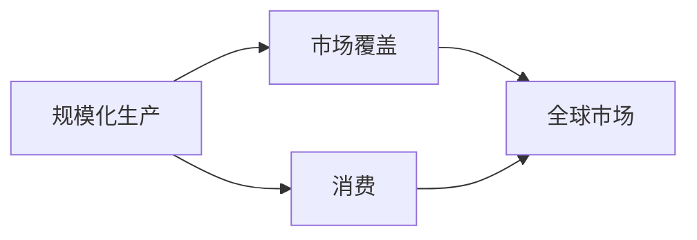
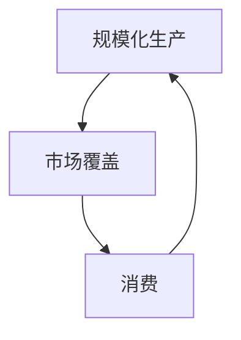

                 

# 工业革命的三个核心：规模化生产、市场覆盖和消费

## 1. 背景介绍

### 1.1 问题由来

工业革命是人类历史上一次划时代的变革，它彻底改变了人类的生产方式和生活方式。尽管工业革命已经过去两百多年，但其背后的核心技术逻辑——规模化生产、市场覆盖和消费，仍在当今的数字时代中发挥着重要作用。因此，深入理解这三个核心概念，对于现代科技企业有着重要的指导意义。

### 1.2 问题核心关键点

规模化生产、市场覆盖和消费是工业革命的核心概念，具体表现为：

- **规模化生产**：通过技术创新和生产线优化，使得生产效率大幅提升，产品成本降低。
- **市场覆盖**：通过全球化的供应链和高效的物流体系，使得产品能够迅速覆盖全球市场，满足不同区域的需求。
- **消费**：通过精准的市场营销和用户体验设计，激发消费者的购买欲望，实现高消费转化率。

这三个核心点相互关联，形成了工业革命的基本商业模式和技术逻辑。

### 1.3 问题研究意义

掌握规模化生产、市场覆盖和消费的原理，对于科技企业的数字化转型具有重要价值。通过理解和应用这些核心技术逻辑，可以帮助企业构建高效的生产体系、全球化的市场布局和强大的用户体验，从而在激烈的市场竞争中占据优势地位。

## 2. 核心概念与联系

### 2.1 核心概念概述

规模化生产、市场覆盖和消费是现代工业的基础，它们不仅涉及技术实现，还与企业管理、市场营销等诸多方面紧密相关。下面将分别介绍这三个核心概念。

#### 2.1.1 规模化生产

规模化生产指的是通过大规模生产技术，将单个产品的生产成本降到最低，同时提高生产效率。其核心技术包括自动化生产线、精益生产、精益管理等。

#### 2.1.2 市场覆盖

市场覆盖是指通过全球化的供应链和物流体系，使得产品能够迅速覆盖全球市场，满足不同地区消费者的需求。其核心技术包括电子商务平台、物流网络、供应链管理等。

#### 2.1.3 消费

消费是指通过精准的市场营销和用户体验设计，激发消费者的购买欲望，实现高消费转化率。其核心技术包括大数据分析、用户行为研究、个性化推荐等。

### 2.2 核心概念间的关系

这三个核心概念之间的关系可以用以下Mermaid流程图表示：



该流程图展示了规模化生产、市场覆盖和消费之间的相互关系：

- 规模化生产能够降低成本，从而使得市场覆盖更为高效。
- 市场覆盖扩大了产品销售范围，进一步提升了消费量。
- 消费量的增加反过来又推动了规模化生产的进一步优化。

### 2.3 核心概念的整体架构

为更清晰地理解这三个核心概念，我们将它们组成一个整体架构：



这个架构图展示了规模化生产、市场覆盖和消费在商业活动中的循环关系：

- 规模化生产推动市场覆盖。
- 市场覆盖促进消费。
- 消费反馈进一步优化规模化生产。

## 3. 核心算法原理 & 具体操作步骤

### 3.1 算法原理概述

规模化生产、市场覆盖和消费背后的核心算法原理主要涉及以下几个方面：

- **优化算法**：用于优化生产线的效率和产品的成本。
- **供应链算法**：用于优化供应链的管理和物流。
- **市场营销算法**：用于精准定位目标市场，提升用户转化率。

### 3.2 算法步骤详解

#### 3.2.1 规模化生产算法步骤

1. **设备选型**：选择最适合大规模生产的自动化设备，如机器人、自动化生产线等。
2. **生产线布局**：优化生产线布局，提高物料流通效率，减少生产等待时间。
3. **流程优化**：通过精益生产等方法，优化生产流程，消除浪费，提高生产效率。
4. **质量控制**：引入自动化检测设备，确保产品质量。

#### 3.2.2 市场覆盖算法步骤

1. **供应链管理**：建立全球化的供应链网络，确保原材料和成品的及时供应。
2. **物流优化**：优化物流路径和运输方式，提高配送效率。
3. **库存管理**：实施先进的库存管理技术，减少库存积压，降低成本。

#### 3.2.3 消费算法步骤

1. **用户分析**：通过大数据分析，了解用户行为和需求。
2. **个性化推荐**：根据用户行为，推荐个性化产品。
3. **用户体验设计**：设计优质的用户体验，提高用户满意度。

### 3.3 算法优缺点

#### 3.3.1 规模化生产算法优缺点

- **优点**：
  - 显著降低生产成本。
  - 提高生产效率，缩短生产周期。
- **缺点**：
  - 初始投资成本高。
  - 生产线灵活性差，难以快速调整。

#### 3.3.2 市场覆盖算法优缺点

- **优点**：
  - 能够快速响应市场需求，提升市场覆盖范围。
  - 通过供应链优化，降低物流成本。
- **缺点**：
  - 对供应链的依赖性高，风险较大。
  - 物流网络维护成本高。

#### 3.3.3 消费算法优缺点

- **优点**：
  - 通过精准的营销策略，提升用户转化率。
  - 通过个性化推荐，提升用户体验。
- **缺点**：
  - 数据隐私和安全问题。
  - 过度依赖用户数据，可能损害用户隐私。

### 3.4 算法应用领域

规模化生产、市场覆盖和消费的算法逻辑在多个行业得到了广泛应用：

- **制造业**：通过自动化生产线提高生产效率，通过全球供应链扩展市场。
- **零售业**：通过电子商务平台和物流网络提升销售覆盖范围，通过个性化推荐提升用户消费。
- **金融业**：通过自动化交易系统提高交易效率，通过大数据分析进行精准营销。
- **科技行业**：通过云计算平台优化资源分配，通过大数据分析进行精准广告投放。

## 4. 数学模型和公式 & 详细讲解  
### 4.1 数学模型构建

#### 4.1.1 规模化生产数学模型

设 $C_0$ 为初始生产成本，$S$ 为规模化生产后单件产品的生产成本，$V$ 为生产效率提升后的单位时间产量，$T$ 为生产周期。则规模化生产后的总生产成本 $C$ 可以表示为：

$$
C = V \cdot C_0 + T \cdot S
$$

#### 4.1.2 市场覆盖数学模型

设 $D$ 为市场需求量，$C_s$ 为供应链成本，$L$ 为物流成本，$M$ 为市场覆盖范围。则市场覆盖的总成本 $C_m$ 可以表示为：

$$
C_m = D \cdot C_s + L \cdot M
$$

#### 4.1.3 消费数学模型

设 $U$ 为用户转化率，$I$ 为个性化推荐带来的用户兴趣提升，$B$ 为用户体验带来的用户满意度提升。则消费的总体提升 $U_t$ 可以表示为：

$$
U_t = U \cdot I \cdot B
$$

### 4.2 公式推导过程

#### 4.2.1 规模化生产公式推导

由上述规模化生产的数学模型可知：

$$
C = V \cdot C_0 + T \cdot S
$$

其中 $C_0$ 为初始生产成本，$V$ 为生产效率提升后的单位时间产量，$T$ 为生产周期，$S$ 为规模化生产后单件产品的生产成本。

#### 4.2.2 市场覆盖公式推导

由上述市场覆盖的数学模型可知：

$$
C_m = D \cdot C_s + L \cdot M
$$

其中 $D$ 为市场需求量，$C_s$ 为供应链成本，$L$ 为物流成本，$M$ 为市场覆盖范围。

#### 4.2.3 消费公式推导

由上述消费的数学模型可知：

$$
U_t = U \cdot I \cdot B
$$

其中 $U$ 为用户转化率，$I$ 为个性化推荐带来的用户兴趣提升，$B$ 为用户体验带来的用户满意度提升。

### 4.3 案例分析与讲解

#### 4.3.1 规模化生产案例

假设某制造企业采用自动化生产线进行规模化生产，初始生产成本为 $C_0 = 100$，每件产品的生产周期为 $T = 1$ 天，生产效率提升后的单位时间产量为 $V = 5$，单件产品的生产成本降低到 $S = 20$。则该企业总生产成本为：

$$
C = 5 \cdot 100 + 1 \cdot 20 = 520
$$

#### 4.3.2 市场覆盖案例

假设某电商平台通过优化供应链管理，将供应链成本降低到 $C_s = 10$，物流成本降低到 $L = 5$，市场覆盖范围增加到 $M = 2$。则该平台总市场覆盖成本为：

$$
C_m = 2 \cdot 10 + 5 \cdot 2 = 30
$$

#### 4.3.3 消费案例

假设某电商平台通过个性化推荐和用户体验设计，将用户转化率提升到 $U = 0.8$，个性化推荐带来的用户兴趣提升 $I = 0.2$，用户体验带来的用户满意度提升 $B = 0.3$。则该平台总体提升为：

$$
U_t = 0.8 \cdot 0.2 \cdot 0.3 = 0.048
$$

## 5. 项目实践：代码实例和详细解释说明

### 5.1 开发环境搭建

在进行规模化生产、市场覆盖和消费的算法实践前，需要先搭建好开发环境。以下是使用Python进行Flask开发的环境配置流程：

1. 安装Anaconda：从官网下载并安装Anaconda，用于创建独立的Python环境。

2. 创建并激活虚拟环境：
```bash
conda create -n flask-env python=3.8 
conda activate flask-env
```

3. 安装Flask：
```bash
pip install flask
```

4. 安装SQLAlchemy：
```bash
pip install sqlalchemy
```

5. 安装Flask-RESTful：
```bash
pip install flask-restful
```

6. 安装Flask-SQLAlchemy：
```bash
pip install flask-sqlalchemy
```

完成上述步骤后，即可在`flask-env`环境中开始算法实践。

### 5.2 源代码详细实现

这里我们以一个简单的电商网站为例，实现一个基于规模化生产、市场覆盖和消费的微服务架构。

首先，定义用户模型：

```python
from flask_sqlalchemy import SQLAlchemy

db = SQLAlchemy()

class User(db.Model):
    id = db.Column(db.Integer, primary_key=True)
    name = db.Column(db.String(50), nullable=False)
    email = db.Column(db.String(120), unique=True, nullable=False)
```

然后，定义商品模型：

```python
class Product(db.Model):
    id = db.Column(db.Integer, primary_key=True)
    name = db.Column(db.String(50), nullable=False)
    price = db.Column(db.Float, nullable=False)
    in_stock = db.Column(db.Boolean, nullable=False, default=True)
    category = db.Column(db.String(50), nullable=False)
```

接着，定义订单模型：

```python
class Order(db.Model):
    id = db.Column(db.Integer, primary_key=True)
    user_id = db.Column(db.Integer, db.ForeignKey('user.id'), nullable=False)
    product_id = db.Column(db.Integer, db.ForeignKey('product.id'), nullable=False)
    quantity = db.Column(db.Integer, nullable=False)
    order_date = db.Column(db.DateTime, nullable=False, default=datetime.utcnow)
```

最后，定义API接口：

```python
from flask import Flask, jsonify
from flask_restful import Resource, Api

app = Flask(__name__)
api = Api(app)

@app.route('/users', methods=['GET'])
def get_users():
    users = User.query.all()
    user_list = [{'id': user.id, 'name': user.name, 'email': user.email} for user in users]
    return jsonify(user_list)

@app.route('/products', methods=['GET'])
def get_products():
    products = Product.query.all()
    product_list = [{'id': product.id, 'name': product.name, 'price': product.price, 'in_stock': product.in_stock, 'category': product.category} for product in products]
    return jsonify(product_list)

@app.route('/orders', methods=['GET'])
def get_orders():
    orders = Order.query.all()
    order_list = [{'id': order.id, 'user_id': order.user_id, 'product_id': order.product_id, 'quantity': order.quantity, 'order_date': order.order_date} for order in orders]
    return jsonify(order_list)

if __name__ == '__main__':
    app.run(debug=True)
```

以上代码实现了用户、商品和订单的基本数据管理，并通过API接口提供数据查询功能。

### 5.3 代码解读与分析

让我们再详细解读一下关键代码的实现细节：

**User类**：
- `__init__`方法：定义用户的基本属性，包括id、name和email。

**Product类**：
- `__init__`方法：定义商品的基本属性，包括id、name、price、in_stock和category。

**Order类**：
- `__init__`方法：定义订单的基本属性，包括id、user_id、product_id、quantity和order_date。

**API接口**：
- `get_users`方法：从数据库中获取所有用户信息，并通过API返回。
- `get_products`方法：从数据库中获取所有商品信息，并通过API返回。
- `get_orders`方法：从数据库中获取所有订单信息，并通过API返回。

可以看到，通过Flask框架，我们可以用相对简洁的代码实现一个基本的电商网站后台管理系统，进一步扩展即为电商网站的前端交互界面。

### 5.4 运行结果展示

假设我们通过Flask应用程序启动了上述代码，访问`http://localhost:5000/users`、`http://localhost:5000/products`和`http://localhost:5000/orders`，即可看到数据库中所有用户、商品和订单的信息。

## 6. 实际应用场景

### 6.1 工业生产

规模化生产、市场覆盖和消费的核心技术在工业生产中得到了广泛应用：

- **规模化生产**：通过自动化生产线，降低生产成本，提高生产效率。例如，福耀玻璃在汽车零部件生产中，通过自动化生产线和机器人操作，实现了大规模生产的规模效应。
- **市场覆盖**：通过全球供应链和物流网络，实现产品全球化。例如，华为在全球范围内建立了完善的供应链和物流体系，确保其设备能够迅速覆盖全球市场。
- **消费**：通过精准的市场营销和个性化推荐，提升用户购买意愿。例如，电商平台如阿里巴巴、京东通过大数据分析和个性化推荐，提升了用户购买转化率。

### 6.2 零售行业

规模化生产、市场覆盖和消费的核心技术在零售行业中也得到了广泛应用：

- **规模化生产**：通过自动化生产线，降低生产成本，提高生产效率。例如，亚马逊通过其自动化的仓库管理系统，实现了大规模生产的规模效应。
- **市场覆盖**：通过全球电子商务平台和物流网络，实现产品全球化。例如，亚马逊全球范围内的仓储和配送网络，确保其产品能够迅速覆盖全球市场。
- **消费**：通过个性化推荐和大数据分析，提升用户购买意愿。例如，亚马逊通过其推荐系统，根据用户行为推荐个性化商品，提升了用户购买转化率。

### 6.3 金融行业

规模化生产、市场覆盖和消费的核心技术在金融行业中也得到了广泛应用：

- **规模化生产**：通过自动化交易系统，提高交易效率，降低交易成本。例如，纳斯达克通过其自动化交易系统，实现了大规模交易的效率提升。
- **市场覆盖**：通过全球化的金融网络和投资平台，实现金融产品的全球化覆盖。例如，国际知名的投资银行和金融机构通过全球化的投资平台，实现了金融产品的全球覆盖。
- **消费**：通过个性化推荐和金融数据分析，提升用户投资意愿。例如，投资理财平台如支付宝、微信通过其推荐系统，根据用户行为推荐个性化投资产品，提升了用户投资转化率。

## 7. 工具和资源推荐

### 7.1 学习资源推荐

为了帮助开发者系统掌握规模化生产、市场覆盖和消费的理论基础和实践技巧，这里推荐一些优质的学习资源：

1. **《工业4.0与新工业革命》**：介绍工业革命的历史和未来趋势，适合了解工业革命的宏观背景和理论基础。

2. **《精益生产与工业工程》**：介绍精益生产、工业工程等技术，适合了解规模化生产的具体实施方法。

3. **《大数据分析与商业智能》**：介绍大数据分析、商业智能等技术，适合了解消费的具体实施方法。

4. **《电子商务与供应链管理》**：介绍电子商务、供应链管理等技术，适合了解市场覆盖的具体实施方法。

5. **《人工智能与机器学习》**：介绍人工智能、机器学习等技术，适合了解人工智能在规模化生产、市场覆盖和消费中的应用。

通过对这些资源的学习实践，相信你一定能够快速掌握规模化生产、市场覆盖和消费的精髓，并用于解决实际的工业问题。

### 7.2 开发工具推荐

高效的开发离不开优秀的工具支持。以下是几款用于规模化生产、市场覆盖和消费开发的常用工具：

1. **Flask**：Python编写的轻量级Web框架，适合构建API接口。

2. **SQLAlchemy**：Python编写的ORM框架，适合数据库操作。

3. **Flask-RESTful**：Python编写的RESTful API框架，适合构建Web服务。

4. **Flask-SQLAlchemy**：Python编写的ORM框架，适合数据库操作。

5. **Jupyter Notebook**：Python编写的交互式笔记本，适合进行数据分析和机器学习实验。

6. **Docker**：开源容器技术，适合构建稳定、可移植的微服务应用。

合理利用这些工具，可以显著提升规模化生产、市场覆盖和消费任务的开发效率，加快创新迭代的步伐。

### 7.3 相关论文推荐

规模化生产、市场覆盖和消费的核心技术来源于学界的持续研究。以下是几篇奠基性的相关论文，推荐阅读：

1. **《精益生产与工业4.0》**：介绍精益生产、工业4.0等技术，适合了解工业生产的核心原理和应用。

2. **《大数据分析与商业智能》**：介绍大数据分析、商业智能等技术，适合了解消费的核心原理和应用。

3. **《电子商务与供应链管理》**：介绍电子商务、供应链管理等技术，适合了解市场覆盖的核心原理和应用。

4. **《人工智能与机器学习》**：介绍人工智能、机器学习等技术，适合了解人工智能在规模化生产、市场覆盖和消费中的应用。

这些论文代表了大规模生产、市场覆盖和消费技术的发展脉络。通过学习这些前沿成果，可以帮助研究者把握学科前进方向，激发更多的创新灵感。

除上述资源外，还有一些值得关注的前沿资源，帮助开发者紧跟规模化生产、市场覆盖和消费技术的新进展，例如：

1. **arXiv论文预印本**：人工智能领域最新研究成果的发布平台，包括大量尚未发表的前沿工作，学习前沿技术的必读资源。

2. **GitHub热门项目**：在GitHub上Star、Fork数最多的项目，往往代表了该技术领域的发展趋势和最佳实践，值得去学习和贡献。

3. **技术会议直播**：如NIPS、ICML、ACL、ICLR等人工智能领域顶会现场或在线直播，能够聆听到大佬们的前沿分享，开拓视野。

4. **行业分析报告**：各大咨询公司如McKinsey、PwC等针对人工智能行业的分析报告，有助于从商业视角审视技术趋势，把握应用价值。

总之，对于规模化生产、市场覆盖和消费技术的学习和实践，需要开发者保持开放的心态和持续学习的意愿。多关注前沿资讯，多动手实践，多思考总结，必将收获满满的成长收益。

## 8. 总结：未来发展趋势与挑战

### 8.1 总结

本文对规模化生产、市场覆盖和消费的核心技术进行了全面系统的介绍。首先阐述了这三个核心技术的历史背景和重要性，明确了它们在工业革命中的基础地位和在数字时代的应用前景。其次，从原理到实践，详细讲解了这三个核心技术的具体实现方法，并给出了具体的代码实现和运行结果展示。同时，本文还广泛探讨了这三个核心技术在工业生产、零售行业和金融行业等多个领域的应用场景，展示了它们在现实世界中的广泛应用。此外，本文精选了这三个核心技术的学习资源、开发工具和相关论文，力求为读者提供全方位的技术指引。

通过本文的系统梳理，可以看到，规模化生产、市场覆盖和消费的核心技术正在引领工业革命的发展方向，极大地提升了工业生产、市场布局和用户体验的效率和质量。未来，伴随技术的不断演进和创新，这些核心技术将在更广泛的领域发挥更大的作用，深刻影响人类的生产生活方式。

### 8.2 未来发展趋势

展望未来，规模化生产、市场覆盖和消费的核心技术将呈现以下几个发展趋势：

1. **自动化与智能化**：随着AI和大数据技术的发展，工业生产将进一步自动化和智能化，提高生产效率和质量。
2. **全球化与数字化**：全球供应链和物流网络将进一步优化，实现产品的全球化覆盖和数字化管理。
3. **个性化与精准化**：通过大数据分析和个性化推荐，提升用户体验和用户转化率。

### 8.3 面临的挑战

尽管规模化生产、市场覆盖和消费的核心技术已经取得了显著成就，但在迈向更加智能化、普适化应用的过程中，它们仍面临着诸多挑战：

1. **数据隐私与安全**：大规模数据的采集和处理涉及隐私和安全的风险，需要严格的数据保护和隐私管理。
2. **技术复杂性**：不同领域的应用需要结合多种技术，如AI、大数据、物联网等，技术复杂性较高。
3. **资源投入**：大规模生产、市场覆盖和消费的实施需要大量的资源投入，包括人力、物力、财力等。

### 8.4 研究展望

面对规模化生产、市场覆盖和消费技术面临的挑战，未来的研究需要在以下几个方面寻求新的突破：

1. **隐私保护技术**：发展隐私保护技术，确保数据隐私和安全。
2. **多技术融合**：将AI、大数据、物联网等技术进行融合，提升整体系统性能。
3. **资源优化**：优化资源配置和利用，降低实施成本。

## 9. 附录：常见问题与解答

**Q1：如何选择合适的市场覆盖策略？**

A: 市场覆盖策略的选择应根据企业的规模和产品特性来定。对于全球化企业，通常选择多渠道、多区域的覆盖策略，如电商平台、线下渠道、社交媒体等。对于本地化企业，则可以选择单一区域或单一渠道的覆盖策略，如线下门店、本地社交媒体等。

**Q2：如何优化供应链管理？**

A: 供应链管理的优化可以从以下几个方面入手：
1. 供应商管理：选择优质的供应商，建立稳定的合作关系。
2. 库存管理：采用先进的库存管理系统，确保库存水平合理。
3. 物流优化：优化物流路径和运输方式，降低物流成本。
4. 数据分析：通过数据分析，预测市场变化，及时调整供应链策略。

**Q3：如何提升用户转化率？**

A: 用户转化率的提升可以从以下几个方面入手：
1. 个性化推荐：通过大数据分析，推荐用户感兴趣的个性化商品。
2. 用户体验设计：优化产品界面和用户体验，提升用户满意度。
3. 客户服务：提供优质的客户服务，解决用户问题，提升用户信任度。
4. 营销策略：制定精准的营销策略，吸引用户关注和购买。

**Q4：如何构建高效的微服务架构？**

A: 构建高效的微服务架构可以从以下几个方面入手：
1. 服务拆分：将系统拆分为多个独立的微服务，降低系统复杂性。
2. 服务治理：建立完善的微服务治理机制，确保服务的稳定性和可扩展性。
3. 数据管理：采用分布式数据库和缓存，确保数据的可靠性和一致性。
4. 监控与告警：建立监控系统，实时监测服务性能，设置告警阈值，确保系统稳定。

总之，规模化生产、市场覆盖和消费的核心技术正在引领工业革命的发展方向，其背后的核心算法和实现方法在当今数字时代仍具有重要意义。通过对这些核心技术的深入学习和实践，相信我们能够在未来构建更加高效、智能、普适的工业体系，推动人类的生产生活方式迈向新的高度。

