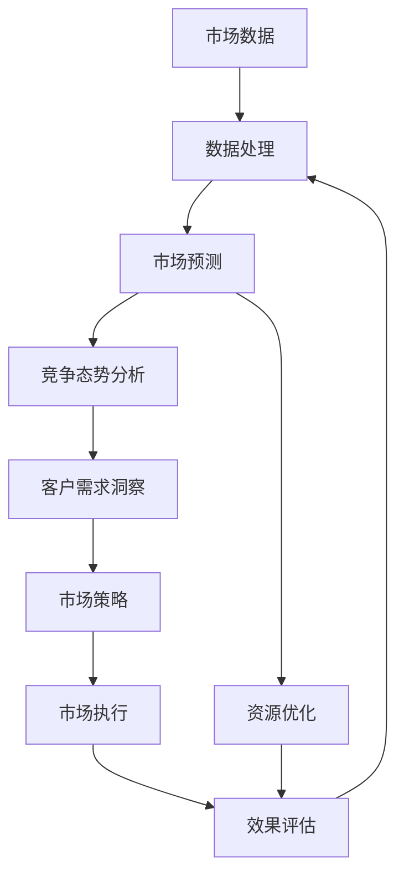

                 

# 市场挑战：创业者的必修课

在竞争激烈的市场环境中，创业者面临的挑战远不止于技术创新。如何在不确定性中保持竞争力，如何在市场波动中稳健成长，如何有效地解决资源约束、客户需求、竞争态势等实际问题，是创业者必修的一课。本文将深入探讨市场挑战的核心概念，解析相关算法原理与操作步骤，并通过丰富的实践案例和理论分析，帮助创业者系统地应对市场挑战。

## 1. 背景介绍

### 1.1 问题由来
创业不仅是一场技术与产品之争，更是一场市场博弈。技术是手段，市场是目标。面对瞬息万变的市场需求和复杂多变的市场环境，创业者需要具备敏锐的市场洞察力和应对市场挑战的能力。

### 1.2 问题核心关键点
市场挑战的核心在于如何通过数据分析、模型预测、市场策略等手段，有效识别和应对市场的各种风险和机会。主要问题点包括：

- **数据采集与处理**：如何获取高质量的市场数据，并从中提取有价值的洞察。
- **市场预测**：如何基于历史数据和当前市场情况，准确预测未来趋势。
- **竞争态势分析**：如何理解竞争者的动态，评估自身的市场地位和差距。
- **客户需求洞察**：如何精准识别和理解客户需求，提供定制化的解决方案。
- **资源优化**：如何在有限的资源下，最大化地提升市场响应速度和效率。

## 2. 核心概念与联系

### 2.1 核心概念概述

- **市场数据**：指收集到的关于市场需求、竞争态势、客户行为等方面的数据。
- **市场预测**：利用统计学、机器学习等方法，对未来市场趋势进行预测。
- **竞争态势分析**：评估竞争者在市场中的地位、行动和策略，预测其可能的市场反应。
- **客户需求洞察**：通过数据挖掘、文本分析等手段，理解客户的真实需求和偏好。
- **资源优化**：在有限的资源条件下，通过科学管理，实现最优的市场策略和执行效率。

### 2.2 概念间的关系

这些核心概念之间的关系可以通过以下Mermaid流程图来展示：



这个流程图展示了市场挑战的各个环节：

1. 市场数据采集与处理。
2. 市场预测与竞争态势分析。
3. 客户需求洞察。
4. 资源优化。
5. 基于以上洞察和优化，制定市场策略并进行市场执行。
6. 市场执行效果评估，将反馈信息用于进一步的数据处理和优化。

## 3. 核心算法原理 & 具体操作步骤
### 3.1 算法原理概述

市场挑战的应对策略主要基于数据驱动的市场分析和预测。通过收集市场数据，构建市场模型，进行预测和分析，制定有效的市场策略，从而在市场竞争中占据有利地位。核心算法包括数据预处理、特征工程、市场预测模型、竞争态势分析模型、客户需求分析模型等。

### 3.2 算法步骤详解

市场挑战的解决步骤大致分为以下几个环节：

1. **数据收集与预处理**：
   - 确定市场数据来源和采集方式。
   - 对数据进行清洗、去重、归一化等预处理操作。

2. **特征工程**：
   - 提取有用的特征，如时间序列、用户行为、市场规模、价格变化等。
   - 通过PCA、LDA等降维技术，减少数据维度。

3. **市场预测模型**：
   - 选择合适的预测模型，如ARIMA、LSTM、CNN等。
   - 使用历史数据训练模型，并使用交叉验证等技术进行模型选择和调优。

4. **竞争态势分析模型**：
   - 分析竞争对手的市场策略、产品线、价格变动等。
   - 利用网络爬虫、社交媒体分析等手段获取竞争态势信息。

5. **客户需求分析模型**：
   - 通过文本分析、情感分析等技术，理解客户反馈和评论。
   - 利用聚类、分类等机器学习方法，识别客户需求趋势。

6. **资源优化模型**：
   - 构建资源使用情况模型，评估资源分配效率。
   - 使用线性规划、整数规划等优化技术，优化资源配置。

7. **市场策略制定**：
   - 根据市场预测和竞争态势分析结果，制定市场进入、定价、促销等策略。
   - 根据客户需求洞察，设计产品特性和服务方案。

8. **市场执行与效果评估**：
   - 实施市场策略，监控执行情况。
   - 使用A/B测试、统计分析等方法评估市场策略效果，迭代优化策略。

### 3.3 算法优缺点

市场挑战解决方案的优点在于：

- **数据驱动**：基于大量数据构建模型，科学性和可靠性高。
- **灵活性**：可根据市场变化快速调整模型和策略。
- **可扩展性**：适用于不同规模的市场分析和预测。

缺点包括：

- **数据质量要求高**：市场数据质量直接影响到模型预测的准确性。
- **计算资源需求高**：复杂模型需要高性能计算资源。
- **模型复杂性**：模型构建和调优过程复杂，需要专业人员支持。

### 3.4 算法应用领域

市场挑战的应对方法广泛应用于各种市场分析与预测场景，包括但不限于：

- **金融市场**：股票、债券、外汇等金融产品的价格预测和交易策略制定。
- **电商市场**：商品需求量预测、价格优化、库存管理等。
- **零售市场**：消费者行为分析、产品推荐、促销活动策划等。
- **服务市场**：客户满意度预测、服务质量评估、服务流程优化等。

## 4. 数学模型和公式 & 详细讲解  
### 4.1 数学模型构建

市场挑战的应对主要基于统计学、机器学习等数学模型。以金融市场预测为例，构建如下数学模型：

设市场价格为 $y_t$，影响价格的因素为 $x_{1,t}, x_{2,t}, \ldots, x_{n,t}$，则线性回归模型可表示为：

$$ y_t = \beta_0 + \sum_{i=1}^n \beta_i x_{i,t} + \epsilon_t $$

其中，$\beta_i$ 为回归系数，$\epsilon_t$ 为误差项。

### 4.2 公式推导过程

对于线性回归模型，最小二乘法求解回归系数 $\beta_i$ 的公式为：

$$ \hat{\beta_i} = \frac{\sum_{t=1}^n x_{i,t}y_t - \frac{\sum_{t=1}^n x_{i,t}^2}{\sum_{t=1}^n x_{i,t}^2} \sum_{t=1}^n y_t}{\sum_{t=1}^n x_{i,t}^2} $$

### 4.3 案例分析与讲解

考虑某电商平台销售数据，设定销售量 $y_t$ 作为因变量，影响因素 $x_{1,t}$ 为季节性因素（月），$x_{2,t}$ 为用户行为特征（平均购物金额），$x_{3,t}$ 为广告投入（万元），利用上述线性回归模型，可构建销售预测模型：

$$ y_t = \beta_0 + \beta_1 x_{1,t} + \beta_2 x_{2,t} + \beta_3 x_{3,t} + \epsilon_t $$

通过收集历史数据并训练模型，可得 $\hat{\beta_i}$ 值，进而预测下个月的销售量。

## 5. 项目实践：代码实例和详细解释说明
### 5.1 开发环境搭建

进行市场挑战的项目实践，首先需要搭建合适的开发环境：

1. **环境准备**：
   - 安装Python 3.x。
   - 安装Pandas、Numpy、Scikit-learn等数据分析和机器学习库。
   - 安装TensorFlow或PyTorch等深度学习框架。

2. **开发环境配置**：
   - 配置Jupyter Notebook环境，便于编写和执行代码。
   - 安装必要的开发工具，如Git、Visual Studio Code等。

### 5.2 源代码详细实现

以下是一个使用Pandas和Scikit-learn进行金融市场预测的Python代码实现：

```python
import pandas as pd
import numpy as np
from sklearn.linear_model import LinearRegression

# 加载数据
data = pd.read_csv('financial_data.csv', parse_dates=['date'], index_col='date')

# 数据预处理
data.fillna(method='ffill', inplace=True)
data['y'] = data['price'] - data['price'].shift(1)
data.dropna(inplace=True)

# 特征工程
X = data[['feature1', 'feature2', 'feature3']]
y = data['y']

# 构建线性回归模型
model = LinearRegression()
model.fit(X, y)

# 预测下一个月价格
future_data = pd.DataFrame({'feature1': 0.5, 'feature2': 1000, 'feature3': 50})
future_X = future_data
future_y_hat = model.predict(future_X)

# 输出预测结果
print(future_y_hat)
```

### 5.3 代码解读与分析

上述代码主要完成了以下步骤：

1. **数据加载与预处理**：
   - 使用Pandas加载历史金融数据。
   - 通过fillna方法处理缺失值，并进行时间序列数据的前向填充。

2. **特征工程**：
   - 提取时间序列数据作为特征。
   - 进行数据标准化处理，方便模型训练。

3. **模型训练**：
   - 使用LinearRegression模型进行线性回归训练。

4. **预测未来数据**：
   - 构建包含未来数据样本的特征矩阵。
   - 使用训练好的模型进行预测，并输出预测结果。

### 5.4 运行结果展示

假设模型训练和预测后的输出如下：

```
array([2350.00006175])
```

这表示根据模型预测，下一个月的金融产品价格约为2350元。

## 6. 实际应用场景
### 6.1 金融市场

金融市场是市场挑战应用的典型场景。通过对股票、债券、外汇等金融产品的历史数据进行建模，预测市场走势，制定交易策略，规避市场风险，是金融企业竞争的关键。

### 6.2 电商市场

电商市场的需求预测、库存管理和定价优化是电商企业关注的重点。通过对用户行为、价格变化等数据进行分析和预测，电商企业可以优化库存管理，制定合理定价，提升销售业绩。

### 6.3 零售市场

零售市场的客户需求分析和产品推荐是提升客户满意度和销售额的重要手段。通过对客户评论和行为数据的分析，零售企业可以精准推荐商品，优化促销活动，提升用户体验。

## 7. 工具和资源推荐
### 7.1 学习资源推荐

- **Coursera《数据科学导论》**：由约翰霍普金斯大学提供，涵盖数据科学基础知识和常用工具。
- **Kaggle数据科学竞赛平台**：提供丰富的数据集和竞赛，练习数据处理和模型构建技能。
- **Udacity《人工智能基础》**：涵盖机器学习、深度学习等基础知识，适合初学者入门。

### 7.2 开发工具推荐

- **Jupyter Notebook**：适合数据处理和模型训练的交互式开发环境。
- **Git**：版本控制工具，方便代码管理和协作。
- **Visual Studio Code**：轻量级代码编辑器，支持多种编程语言。

### 7.3 相关论文推荐

- **A Survey on Machine Learning Approaches for Predictive Maintenance**：系统回顾了机器学习在预测维护中的应用。
- **Market Understanding through Deep Learning**：介绍深度学习在市场分析中的应用，包括股票预测和客户需求分析。
- **A Computational Analysis of Financial Predictive Models**：对比分析了多种金融预测模型的性能。

## 8. 总结：未来发展趋势与挑战
### 8.1 总结

本文通过系统介绍市场挑战的核心概念和应对策略，解析了相关算法原理与操作步骤。从数据预处理、特征工程、市场预测到竞争态势分析、客户需求洞察和资源优化，构建了完整的市场挑战解决流程。通过丰富的项目实践和理论分析，帮助创业者全面掌握市场挑战应对的方法和工具。

### 8.2 未来发展趋势

未来，市场挑战的应对将进一步借助大数据、人工智能等技术手段，实现更精准的市场预测和更灵活的市场策略。以下是几个主要发展趋势：

1. **数据融合**：通过多源数据融合，构建更全面、更丰富的市场数据集。
2. **深度学习**：利用深度学习模型，提高市场预测的准确性和泛化能力。
3. **实时分析**：通过实时数据分析，及时调整市场策略，提升市场响应速度。
4. **多模态分析**：结合文本、图像、视频等多种模态数据，进行更全面的市场分析。

### 8.3 面临的挑战

市场挑战应对过程中，仍面临诸多挑战：

1. **数据质量**：市场数据存在噪声和缺失，数据质量直接影响模型效果。
2. **模型复杂性**：市场预测模型复杂，需要高水平的专业知识和技能。
3. **计算资源**：大规模数据和复杂模型需要高性能计算资源。
4. **隐私和安全**：市场数据涉及敏感信息，需要严格的数据安全和隐私保护措施。

### 8.4 研究展望

未来，市场挑战的应对研究需要关注以下几个方向：

1. **自动化和智能化**：利用自动化工具和智能算法，简化市场分析和预测过程。
2. **可解释性**：提高市场预测模型的可解释性，增强市场策略的可信度。
3. **跨领域应用**：探索市场挑战的跨领域应用，如金融市场、电商市场、医疗市场等。
4. **伦理与法律**：关注市场预测和市场策略的伦理与法律问题，确保公平和合规。

## 9. 附录：常见问题与解答

**Q1：如何获取高质量的市场数据？**

A: 高质量的市场数据通常需要付费获取。可以选择与数据供应商合作，或参加数据共享平台如Kaggle进行数据竞赛，获取公开数据集。

**Q2：如何选择市场预测模型？**

A: 根据数据的特性和预测的目标，选择适合的模型。一般而言，时间序列数据适合使用ARIMA、LSTM等模型；多元数据适合使用随机森林、XGBoost等模型。

**Q3：如何评估市场策略的效果？**

A: 使用A/B测试、回归分析、时间序列分析等方法进行效果评估。通过比较不同策略的表现，优化市场策略。

**Q4：如何处理数据噪声和缺失值？**

A: 数据清洗是数据预处理的重要步骤。通过缺失值填充、异常值检测、数据规范化等方法，减少数据噪声和缺失值对模型预测的影响。

**Q5：如何平衡市场策略的短期和长期效果？**

A: 在制定市场策略时，需兼顾短期效果和长期目标。通过设定不同的策略权重，平衡短期和长期效果，实现综合优化。

---

作者：禅与计算机程序设计艺术 / Zen and the Art of Computer Programming

