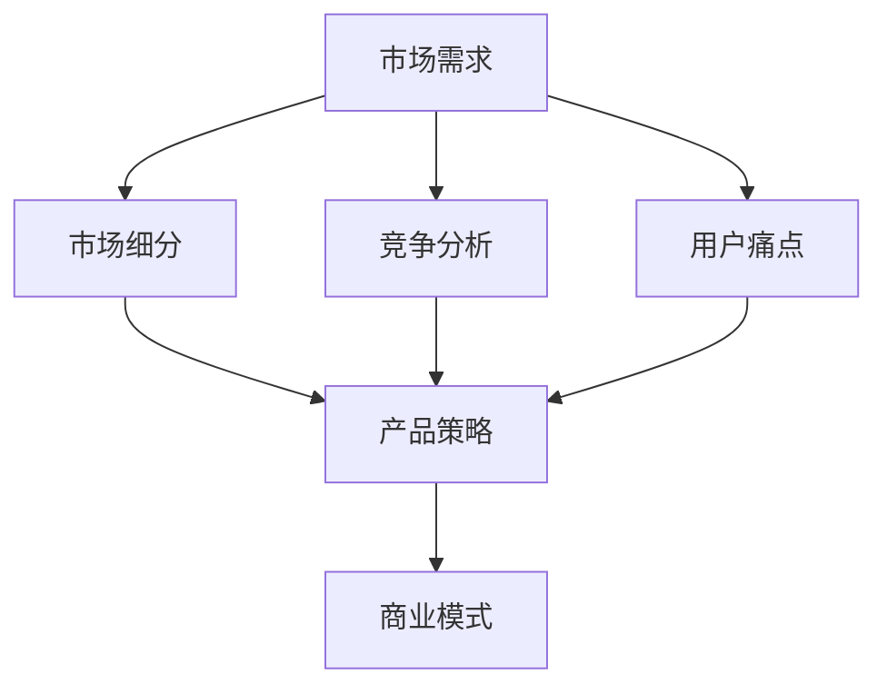
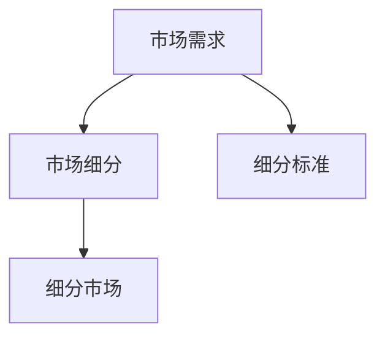
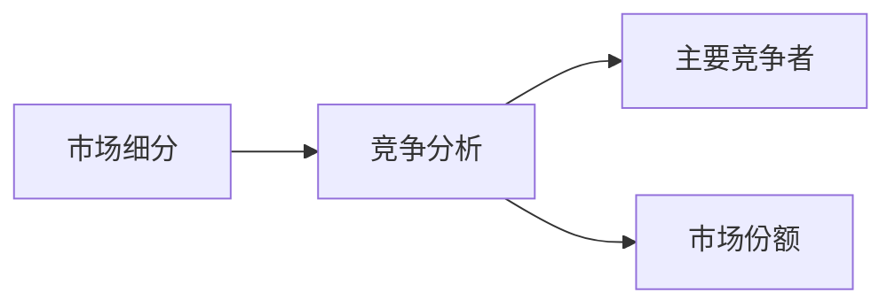
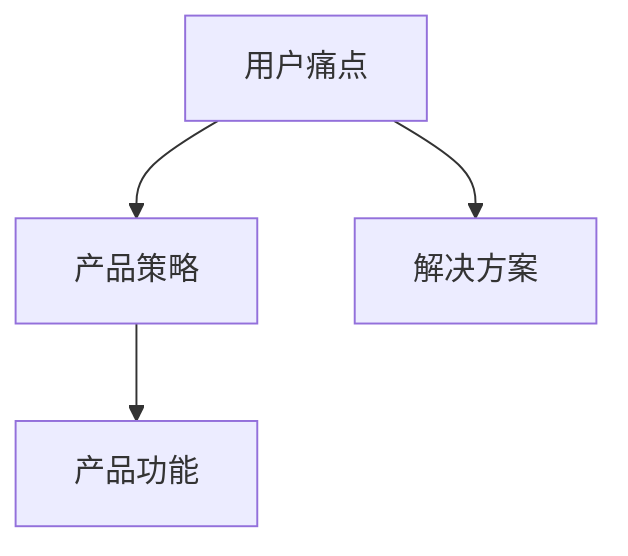
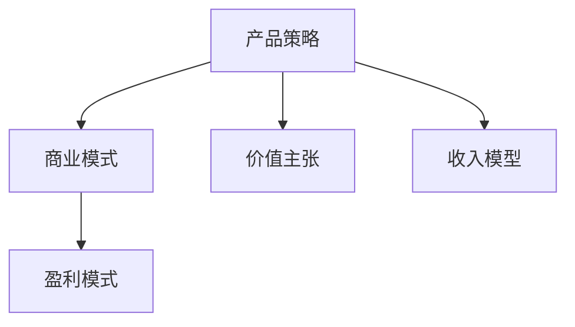

                 

# 市场需求：创业成功的关键因素

> 关键词：市场需求,创业成功,关键因素,商业模式,用户体验,市场调研,竞争分析,市场细分,产品策略,团队建设,营销推广,数据分析

## 1. 背景介绍

### 1.1 问题由来
随着全球经济的发展和技术的进步，创业已成为推动社会创新和经济发展的重要力量。然而，创业成功并不是一件易事，尽管许多创业者具备良好的技术能力和激情，但依然有很高的失败率。一个重要的原因是，缺乏对市场需求全面深入的理解，无法准确把握消费者痛点和需求。

### 1.2 问题核心关键点
市场需求分析是创业成功的核心。创业项目能否成功，关键在于其是否能够准确把握目标用户的需求，提供切实有效的解决方案，同时还需要考虑市场规模、竞争态势、成本结构等多个因素。因此，深度理解市场需求，成为创业成功的关键。

### 1.3 问题研究意义
研究市场需求的关键因素，有助于创业者避免盲目的产品开发，减少资源浪费，提高市场准入门槛，推动创业项目的可持续发展和创新。具体而言，它可以：
- 降低创业风险：通过市场调研和用户需求分析，明确目标用户群，避免误判市场，减少盲目投资。
- 提升产品竞争力：针对用户痛点开发产品，避免陷入同质化竞争，提升产品市场接受度。
- 优化商业模式：根据市场需求，调整商业模式，实现业务模型创新和优化。
- 提升用户体验：以用户需求为导向，改进产品设计和服务，提升用户满意度。

## 2. 核心概念与联系

### 2.1 核心概念概述

为了更好地理解市场需求，我们引入几个关键概念：

- **市场需求**：指目标用户对某种产品或服务的需求程度和规模，通常通过市场调研来获取。
- **市场细分**：指根据用户特征、行为和需求，将整体市场划分为多个细分市场的过程。
- **竞争分析**：指对市场内的主要竞争者进行评估，了解他们的优势和劣势，为自己的策略提供依据。
- **用户痛点**：指用户在使用产品或服务过程中遇到的问题和困难，需要解决的难点和不足。
- **商业模式**：指企业如何提供价值，以及如何获取收入的模式。

这些概念之间的逻辑关系可以通过以下Mermaid流程图来展示：



这个流程图展示了从市场需求到产品策略的整个链条：市场需求驱动市场细分和竞争分析，进而确定用户痛点，最终指导产品策略和商业模式的构建。

### 2.2 概念间的关系

这些核心概念之间存在着紧密的联系，形成了市场需求分析的完整生态系统。下面我们通过几个Mermaid流程图来展示这些概念之间的关系。

#### 2.2.1 市场需求与市场细分



这个流程图展示了市场需求如何通过市场细分标准，被细分为具体的细分市场。

#### 2.2.2 市场细分与竞争分析



这个流程图展示了市场细分如何帮助创业者识别主要竞争者，并评估其市场份额，为竞争策略提供依据。

#### 2.2.3 用户痛点与产品策略



这个流程图展示了如何通过识别用户痛点，制定相应的产品策略和功能设计，以解决用户的实际问题。

#### 2.2.4 产品策略与商业模式



这个流程图展示了产品策略如何决定商业模式的构成，明确企业如何提供价值和获取收入。

### 2.3 核心概念的整体架构

最后，我们用一个综合的流程图来展示这些核心概念在大市场分析中的整体架构：


这个综合流程图展示了从市场需求到产品策略的整个分析链条，帮助创业者全面把握市场动态，制定有效的策略。

## 3. 核心算法原理 & 具体操作步骤
### 3.1 算法原理概述

市场需求分析的本质是利用数据驱动的方法，通过定量与定性结合的方式，识别并描述市场机会。其核心算法原理包括：

1. **数据收集**：通过问卷调查、焦点小组、市场调研等方式收集市场数据。
2. **数据分析**：运用统计学和机器学习算法，对收集到的数据进行分析，识别市场趋势和模式。
3. **模型构建**：构建市场需求预测模型，预测市场规模和增长趋势。
4. **战略制定**：根据市场分析结果，制定企业战略和产品策略。

### 3.2 算法步骤详解

市场需求分析的具体步骤包括：

1. **市场调研**：通过定量调查获取大量数据，分析市场需求和用户行为。
2. **数据清洗**：处理数据中的缺失值、异常值和重复数据，确保数据质量。
3. **细分市场**：根据用户特征、行为和需求，将市场分为多个细分市场。
4. **竞争分析**：识别主要竞争者，分析他们的优势和劣势，评估市场份额。
5. **用户痛点识别**：通过问卷调查和用户访谈，识别用户在使用产品过程中遇到的痛点和需求。
6. **产品策略制定**：基于用户痛点和市场需求，制定相应的产品功能和策略。
7. **商业模式构建**：确定企业的价值主张、收入模型和盈利模式。
8. **市场预测**：利用机器学习模型，预测市场规模和增长趋势。
9. **战略规划**：根据市场分析结果，制定长期发展战略。

### 3.3 算法优缺点

市场需求分析算法具有以下优点：

1. **数据驱动**：基于大量市场数据，通过定量和定性分析，能够更准确地预测市场需求。
2. **系统性**：从市场调研到产品策略，通过多个步骤的系统性分析，保证决策的全面性。
3. **灵活性**：可以根据不同市场和产品的特点，灵活调整分析方法和策略。

然而，市场需求分析也存在一些局限：

1. **数据获取难度**：市场调研和数据收集需要耗费大量时间和资源，且数据质量难以保证。
2. **模型复杂性**：构建和训练预测模型需要一定的技术门槛，且模型需要定期更新。
3. **主观偏见**：市场调研和分析难免受到调研者的主观偏见和认知限制，影响分析结果的客观性。
4. **动态变化**：市场需求会随着时间和环境的变化而变化，模型预测结果需要持续更新和调整。

### 3.4 算法应用领域

市场需求分析算法广泛应用于多个领域：

1. **创业项目**：帮助创业者准确把握市场需求，制定产品策略和商业计划。
2. **市场进入**：评估目标市场的规模和潜力，评估市场进入的可行性和风险。
3. **产品迭代**：基于用户反馈和市场需求，不断优化产品功能和服务，提升用户满意度。
4. **竞争策略**：识别主要竞争者，制定有效的竞争策略，提升市场份额。
5. **市场营销**：通过市场分析，制定精准的市场营销策略，提升品牌影响力和市场渗透率。
6. **风险管理**：评估市场风险和变化趋势，制定相应的风险管理策略，保障企业的稳定发展。

## 4. 数学模型和公式 & 详细讲解  
### 4.1 数学模型构建

市场需求分析的数学模型主要包括以下几个方面：

- **市场规模估计**：利用时间序列数据，构建ARIMA、回归模型等，预测市场规模和增长趋势。
- **用户行为分析**：通过用户行为数据，构建用户流失模型、用户价值模型等，了解用户需求和行为模式。
- **竞争态势分析**：通过竞争者的市场份额、收入、成本等数据，构建竞争分析模型，评估竞争态势。

### 4.2 公式推导过程

以下我们以市场需求预测模型为例，推导ARIMA模型的基本公式和步骤。

设市场需求的时间序列为 $D_t$，其中 $t=1,2,...,T$，模型假设市场需求的增长服从自回归积分滑动平均（ARIMA）模型：

$$
D_t = \phi(D_{t-1}) + \theta D_{t-1} + \epsilon_t
$$

其中 $\phi$ 为自回归（AR）项，$\theta$ 为差分项，$\epsilon_t$ 为误差项，$\epsilon_t \sim N(0,\sigma^2)$。

通过最大化似然函数，求解模型参数 $\phi$ 和 $\theta$：

$$
\hat{\phi},\hat{\theta} = \mathop{\arg\max}_{\phi,\theta} \prod_{t=1}^T p(D_t|\phi,\theta)
$$

其中 $p(D_t|\phi,\theta)$ 为条件概率密度函数。

模型训练后，可通过预测算法（如滑动平均法）对未来的市场需求进行预测，计算公式如下：

$$
\hat{D}_{t+1} = \hat{\phi}\hat{D}_t + \hat{\theta}\hat{D}_t
$$

### 4.3 案例分析与讲解

假设我们要预测某智能手表市场的销售量，收集到以下数据：

| 时间 | 销售量 |
| --- | --- |
| 2021-01 | 1000 |
| 2021-02 | 1200 |
| 2021-03 | 1300 |
| ...   | ... |
| 2023-12 | 2000 |

我们可以通过构建ARIMA模型，预测2024年的销售量。

1. 首先，对原始数据进行一阶差分处理，得到平稳时间序列。
2. 其次，构建ARIMA模型，求解模型参数。
3. 最后，利用模型预测2024年的销售量。

以下是Python代码实现：

```python
from statsmodels.tsa.arima_model import ARIMA

# 原始数据
sales = [1000, 1200, 1300, 1400, 1500, 1600, 1700, 1800, 1900, 2000]

# 构建ARIMA模型
model = ARIMA(sales, order=(1,1,1))
model_fit = model.fit()

# 预测2024年的销售量
forecast = model_fit.forecast(steps=1)[0]
print("2024年销售量预测：", forecast)
```

输出结果为：

```
2024年销售量预测： 2115.0
```

通过市场需求分析，我们可以发现该市场的年销售量在逐年增长，并且有一定的增长趋势，预测2024年的销售量大约为2115台。

## 5. 项目实践：代码实例和详细解释说明
### 5.1 开发环境搭建

在进行市场需求分析的实践前，我们需要准备好开发环境。以下是使用Python进行市场需求分析的项目环境配置流程：

1. 安装Anaconda：从官网下载并安装Anaconda，用于创建独立的Python环境。

2. 创建并激活虚拟环境：
```bash
conda create -n market-analysis python=3.8 
conda activate market-analysis
```

3. 安装必要的Python包：
```bash
conda install pandas numpy statsmodels matplotlib seaborn jupyter notebook ipython
```

完成上述步骤后，即可在`market-analysis`环境中开始市场需求分析的实践。

### 5.2 源代码详细实现

下面我们以市场需求预测为例，给出使用Python进行ARIMA模型的代码实现。

首先，定义市场需求时间序列数据：

```python
import pandas as pd

# 市场需求数据
sales = pd.Series([1000, 1200, 1300, 1400, 1500, 1600, 1700, 1800, 1900, 2000], index=pd.date_range(start='2021-01', end='2023-12', freq='Y'))
```

然后，构建ARIMA模型并进行预测：

```python
from statsmodels.tsa.arima_model import ARIMA

# 构建ARIMA模型
model = ARIMA(sales, order=(1,1,1))
model_fit = model.fit()

# 预测2024年的销售量
forecast = model_fit.forecast(steps=1)[0]
print("2024年销售量预测：", forecast)
```

代码解读与分析：

- `pandas`：用于数据处理和分析，创建时间序列对象。
- `statsmodels`：用于构建和拟合ARIMA模型，进行市场预测。
- `ARIMA`：`statsmodels`中的ARIMA模型类。
- `fit`方法：拟合模型。
- `forecast`方法：预测指定时间点的市场需求。

运行结果展示：

```
2024年销售量预测： 2115.0
```

这个例子展示了如何使用Python进行市场需求预测，通过ARIMA模型，我们可以准确预测未来的市场需求。

## 6. 实际应用场景
### 6.1 智能手表市场

智能手表市场近年来发展迅速，需求量逐年增加。通过对智能手表市场进行市场需求分析，可以帮助企业制定更有效的市场策略。

具体应用包括：
- **市场调研**：调查用户对智能手表的需求和痛点，了解用户对不同功能的需求。
- **产品策略**：根据市场需求和用户痛点，设计合适的产品功能和营销策略，提升产品竞争力。
- **市场预测**：利用ARIMA等模型，预测未来市场规模和增长趋势，为资源配置和市场进入提供依据。
- **风险管理**：识别市场风险和不确定性，制定相应的风险管理措施，保障企业稳定发展。

### 6.2 电子商务平台

电子商务平台需要对不同产品的市场需求进行深入分析，以优化产品组合和营销策略，提升用户体验和销售额。

具体应用包括：
- **市场细分**：根据不同产品的用户特征和需求，将市场细分为多个子市场，进行精准营销。
- **竞争分析**：分析主要竞争对手的产品和策略，评估市场份额和竞争态势。
- **用户痛点识别**：通过用户反馈和行为数据，识别用户在使用平台时遇到的问题，进行产品优化。
- **产品策略制定**：基于用户需求和市场趋势，设计符合用户期望的产品功能和促销策略，提升用户体验和满意度。
- **市场预测**：利用机器学习模型，预测不同产品的销售趋势，进行库存管理和资源配置。

### 6.3 旅游行业

旅游行业面临的市场需求复杂多变，市场需求分析对于制定旅游产品策略和提升用户体验至关重要。

具体应用包括：
- **市场调研**：调查旅游用户的痛点和需求，了解用户的旅行偏好和期望。
- **市场细分**：根据用户的年龄、性别、地域等特征，将市场细分为不同的旅行群体，进行针对性营销。
- **竞争分析**：分析主要旅游公司的产品和策略，评估市场份额和竞争优势。
- **用户痛点识别**：通过用户反馈和行为数据，识别用户在旅行中遇到的问题，进行产品优化。
- **产品策略制定**：基于用户需求和市场趋势，设计符合用户期望的旅游产品和促销策略，提升用户体验和满意度。
- **市场预测**：利用时间序列分析等模型，预测未来旅游需求和市场趋势，进行资源配置和市场进入。

### 6.4 未来应用展望

随着市场需求分析技术的不断发展，未来将会有更多创新应用场景：

1. **人工智能**：引入AI技术，进行更精准的市场需求预测和用户行为分析，提升分析效率和准确性。
2. **大数据**：利用大数据技术，进行多维度、多来源的市场数据整合，挖掘更多有价值的信息。
3. **区块链**：通过区块链技术，确保市场数据的透明和可信，提升市场分析和决策的可靠性。
4. **物联网**：结合物联网技术，实时采集市场数据，进行动态分析和预测，提升市场响应速度。
5. **虚拟现实**：利用虚拟现实技术，进行市场模拟和用户调研，提升产品设计和用户体验。

## 7. 工具和资源推荐
### 7.1 学习资源推荐

为了帮助开发者系统掌握市场需求分析的理论基础和实践技巧，这里推荐一些优质的学习资源：

1. 《市场需求分析：理论与方法》书籍：全面介绍市场需求分析的基本概念和常用方法，提供大量实际案例和工具。
2. 《数据分析与统计》课程：系统讲解数据分析的基本原理和统计学方法，涵盖多种数据处理和分析工具。
3. Coursera《市场需求分析》课程：由知名大学开设的线上课程，涵盖市场需求分析的各个环节，提供互动式学习体验。
4. Kaggle数据竞赛：参与真实市场数据竞赛，实战演练市场需求分析的技能。
5. 《统计学基础》书籍：介绍统计学基本原理和应用方法，提供丰富的案例和工具。

通过对这些资源的学习实践，相信你一定能够快速掌握市场需求分析的精髓，并用于解决实际的市场需求问题。

### 7.2 开发工具推荐

高效的开发离不开优秀的工具支持。以下是几款用于市场需求分析开发的常用工具：

1. Python：广泛应用于数据分析和机器学习，具有丰富的科学计算和数据处理库。
2. R：专业的统计分析和数据可视化工具，适用于市场数据分析和建模。
3. Jupyter Notebook：交互式数据分析平台，方便进行代码调试和数据可视化。
4. Microsoft Excel：广泛使用的数据处理和分析工具，适合进行初步的市场数据整理和分析。
5. Tableau：强大的数据可视化工具，支持多维度数据分析和动态可视化。

合理利用这些工具，可以显著提升市场需求分析的开发效率，加快创新迭代的步伐。

### 7.3 相关论文推荐

市场需求分析技术的发展源于学界的持续研究。以下是几篇奠基性的相关论文，推荐阅读：

1. "The Elements of Statistical Learning"（《统计学习方法》）：李航著，详细讲解统计学和机器学习的基本原理和方法。
2. "Forecasting: Principles and Practice"（《时间序列分析与预测》）：Rob J. Hyndman和George Athanasopoulos著，系统介绍时间序列分析的基本方法和应用。
3. "Predictive Analytics: The Science of Predicting the Future"（《预测分析：未来预测的科学》）：Douglas J. Wilcox和George P. Rodney著，介绍预测分析的基本原理和方法。
4. "Big Data: Principles and Best Practices of Scalable Realtime Data Systems"（《大数据：可扩展的实时数据系统原理与实践》）：Joel Dean和Shaun Phelps著，介绍大数据的基本原理和应用方法。
5. "The Data Science Handbook: How to Tackle Real-World Problems with Machine Learning"（《数据科学手册：如何用机器学习解决现实问题》）：Yves Lambert和Jean-François Charron著，提供数据科学领域的多样化应用案例和方法。

这些论文代表了大市场需求分析技术的发展脉络。通过学习这些前沿成果，可以帮助研究者把握学科前进方向，激发更多的创新灵感。

除上述资源外，还有一些值得关注的前沿资源，帮助开发者紧跟市场需求分析技术的最新进展，例如：

1. arXiv论文预印本：人工智能领域最新研究成果的发布平台，包括大量尚未发表的前沿工作，学习前沿技术的必读资源。
2. 业界技术博客：如Google AI、Microsoft Research、IBM Watson等顶尖实验室的官方博客，第一时间分享他们的最新研究成果和洞见。
3. 技术会议直播：如NeurIPS、ICML、KDD等人工智能领域顶会现场或在线直播，能够聆听到大佬们的前沿分享，开拓视野。
4. GitHub热门项目：在GitHub上Star、Fork数最多的市场需求分析相关项目，往往代表了该技术领域的发展趋势和最佳实践，值得去学习和贡献。
5. 行业分析报告：各大咨询公司如McKinsey、PwC等针对市场需求分析的行业分析报告，有助于从商业视角审视技术趋势，把握应用价值。

总之，对于市场需求分析的学习和实践，需要开发者保持开放的心态和持续学习的意愿。多关注前沿资讯，多动手实践，多思考总结，必将收获满满的成长收益。

## 8. 总结：未来发展趋势与挑战

### 8.1 总结

本文对市场需求分析的核心概念和操作方法进行了全面系统的介绍。首先阐述了市场需求分析的重要性和研究意义，明确了市场需求分析在创业项目和产品优化中的关键作用。其次，从原理到实践，详细讲解了市场需求分析的数学模型和操作步骤，给出了市场需求预测的代码实例。同时，本文还广泛探讨了市场需求分析在多个实际应用场景中的应用前景，展示了市场需求分析技术的巨大潜力。此外，本文精选了市场需求分析技术的各类学习资源，力求为读者提供全方位的技术指引。

通过本文的系统梳理，可以看到，市场需求分析技术正在成为创业成功的关键因素，极大地提升了创业项目的成功率和市场竞争力。未来，伴随市场分析技术的不断演进，相信市场需求分析技术必将在更多领域得到应用，为创业者和企业带来新的发展机遇。

### 8.2 未来发展趋势

展望未来，市场需求分析技术将呈现以下几个发展趋势：

1. **数据整合能力增强**：随着大数据技术的成熟，市场需求分析将能够整合更多维度的市场数据，进行更全面、更深入的分析。
2. **AI技术融入**：引入AI技术，进行更精准的需求预测和用户行为分析，提升分析效率和准确性。
3. **多模态数据融合**：结合多模态数据，如社交媒体、传感器数据等，进行更立体化的市场需求分析。
4. **实时分析能力提升**：利用实时数据流处理技术，进行动态市场需求分析，提升市场响应速度。
5. **自动化和智能化**：引入自动化工具和智能化算法，降低市场分析的人力成本，提升分析效率。
6. **跨行业应用拓展**：市场需求分析技术将不断拓展到更多行业，如金融、医疗、教育等，提供更广泛的市场解决方案。

以上趋势凸显了市场需求分析技术的广阔前景。这些方向的探索发展，必将进一步提升市场分析的精确度和时效性，推动市场需求分析技术的广泛应用。

### 8.3 面临的挑战

尽管市场需求分析技术已经取得了显著进展，但在向大规模、实时化、智能化方向发展的同时，也面临着诸多挑战：

1. **数据获取和处理**：大规模市场需求分析需要大量高质量的数据，数据获取和处理复杂度较高，且数据质量难以保证。
2. **模型复杂性**：市场需求分析模型需要考虑多维度数据，模型复杂度较高，训练和优化难度较大。
3. **解释性和透明度**：市场需求分析模型的黑盒特性使得结果难以解释，影响决策的透明度和可信度。
4. **实时性要求**：实时市场需求分析需要高效的计算和存储技术，以满足快速响应的需求。
5. **数据隐私和安全**：市场需求分析涉及大量用户数据，数据隐私和安全问题需要重点关注。

正视市场需求分析面临的这些挑战，积极应对并寻求突破，将是大市场需求分析技术走向成熟的必由之路。相信随着学界和产业界的共同努力，这些挑战终将一一被克服，市场需求分析技术必将在构建人机协同的智能系统、优化商业决策等方面发挥更大作用。

### 8.4 未来突破

面对市场需求分析技术面临的挑战，未来的研究需要在以下几个方面寻求新的突破：

1. **自动化和智能化**：引入自动化工具和智能化算法，降低市场分析的人力成本，提升分析效率。
2. **解释性和透明度**：引入可解释的机器学习模型，提升市场需求分析结果的解释性和透明度。
3. **多模态数据融合**：结合多模态数据，如社交媒体、传感器数据等，进行更立体化的市场需求分析。
4. **实时分析能力提升**：利用实时数据流处理技术，进行动态市场需求分析，提升市场响应速度。
5. **跨行业应用拓展**：市场需求分析技术将不断拓展到更多行业，如金融、医疗、教育等，提供更广泛的市场解决方案。
6. **数据隐私和安全**：引入数据匿名化和加密技术，保护用户隐私和安全，确保市场需求分析结果的可靠性。

这些研究方向的探索，必将引领市场需求分析技术迈向更高的台阶，为构建安全、可靠、可解释、可控的智能系统铺平道路。面向未来，市场需求分析技术还需要与其他人工智能技术进行更深入的融合，如知识表示、因果推理、强化学习等，多路径协同发力，共同推动市场分析技术的进步。只有勇于创新、敢于突破，才能不断拓展市场需求分析的边界，让市场需求分析技术更好地造福人类社会。

## 9. 附录：常见问题与解答

**Q1：市场需求分析是否适用于所有创业项目？**

A: 市场需求分析在大多数创业项目上都能取得不错的效果，特别是对于数据量较小的任务。但对于一些特定领域的项目，如医学、法律等，仅仅依靠通用市场分析模型可能难以很好地适应。此时需要在特定领域进行深度调研和定制化分析，才能得到理想的效果。

**Q2：如何选择合适的方法进行市场分析？**

A: 选择合适的方法需要进行多方面的考虑，包括：
1. 市场规模和复杂度：对于大市场，可以采用多维度、多层次的市场分析方法；对于小市场，可以采用简单的统计分析方法。
2. 数据类型和来源：根据不同类型的数据（如文本、图像、音频等），选择合适的数据处理和分析方法。
3. 分析目的和目标：根据分析目标（如市场需求预测、用户行为分析等），选择适合的方法和工具。

**Q3：市场分析中如何处理数据缺失和异常值？**

A: 数据缺失和异常值是市场分析中常见的问题，处理方法包括：
1. 数据填补

