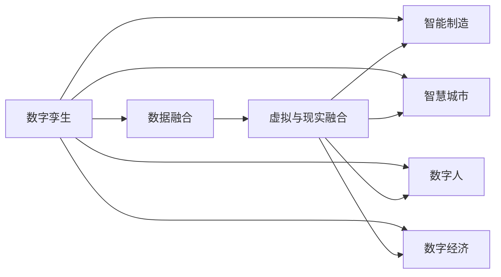
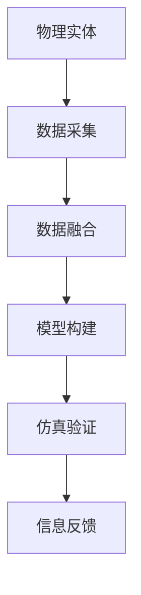
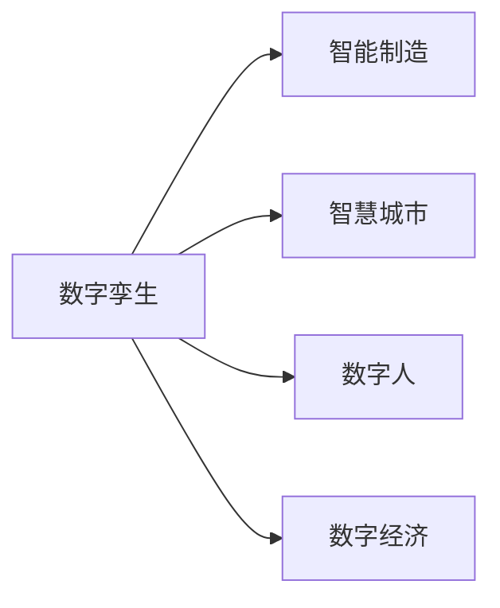
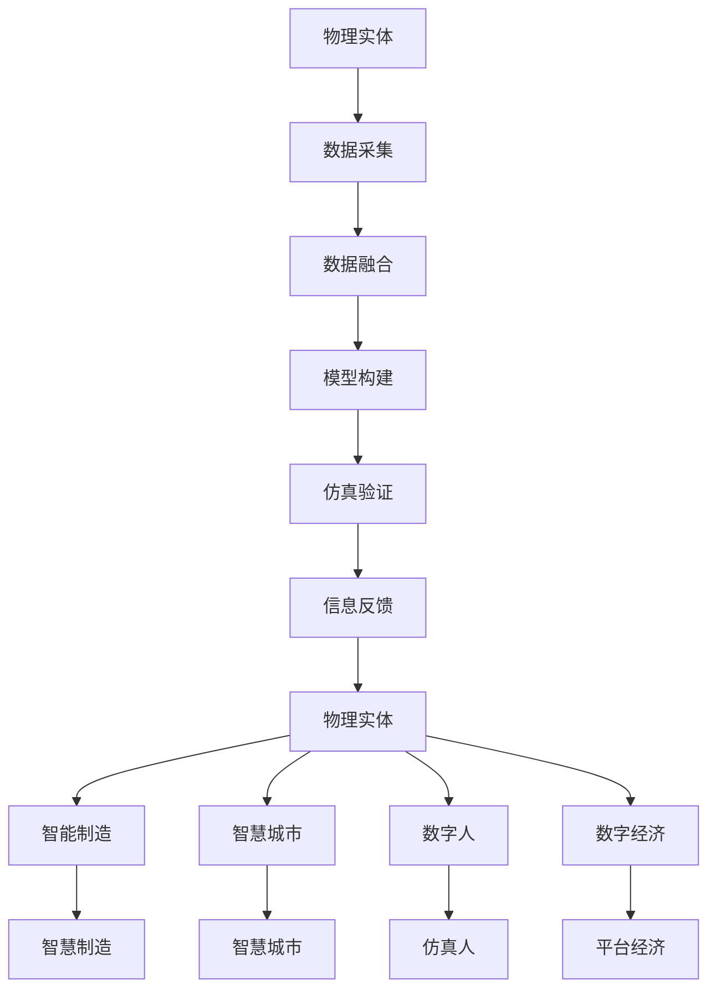

                 

# 2050年的数字孪生：从虚拟到现实的数字化转型

> 关键词：数字孪生,虚拟与现实融合,智能制造,智慧城市,数字人,数字经济

## 1. 背景介绍

### 1.1 问题由来

在21世纪50年代，人类社会即将迈入全面数字化转型的关键时期。随着信息技术的不断演进和人工智能技术的飞速发展，数字孪生（Digital Twin）这一前沿概念逐渐从概念验证走向大规模应用，成为推动实体世界与虚拟世界深度融合的重要技术手段。数字孪生是利用数字技术构建的物理实体的虚拟映射，融合了从设计、生产到运营全生命周期的数据，实现了物理与数字世界的双向互动。

数字孪生技术在制造业、智慧城市、数字医疗、智能交通等多个领域展现了巨大的应用潜力。通过数字化手段，数字孪生可以优化设计方案、提升生产效率、预测设备故障、改善城市管理等。同时，数字孪生技术也推动了数字经济的发展，开辟了全新的商业模式和应用场景。

### 1.2 问题核心关键点

数字孪生的核心关键点在于其构建过程和应用价值：

- **构建过程**：数字孪生涉及数据采集、模型构建、仿真验证、信息反馈等多个环节，需要跨学科、跨领域的紧密协作。
- **应用价值**：数字孪生通过虚拟与现实的结合，实现了高效决策、智能控制、实时监控等功能，极大地提升了实体世界的运行效率和质量。

## 2. 核心概念与联系

### 2.1 核心概念概述

为更好地理解数字孪生的构建和应用，本节将介绍几个密切相关的核心概念：

- **数字孪生（Digital Twin）**：通过数字化手段构建的物理实体的虚拟映射，融合了从设计、生产到运营全生命周期的数据，实现了物理与数字世界的双向互动。

- **数据融合（Data Fusion）**：将来自不同来源、不同形式的数据进行整合，形成全面的、统一的数据集，为数字孪生的构建提供基础。

- **虚拟与现实融合（Virtual Reality Integration）**：通过虚拟现实技术，将数字孪生中的虚拟信息映射到物理世界中，实现对实体的实时监控和控制。

- **智能制造（Smart Manufacturing）**：利用数字孪生技术，实现生产过程的智能化、自动化，提高生产效率和产品质量。

- **智慧城市（Smart City）**：通过数字孪生技术，对城市交通、能源、环境等进行智能化管理，提升城市治理水平和居民生活质量。

- **数字人（Digital Human）**：结合虚拟现实、人工智能等技术，构建虚拟化的、具有高度仿真性的个体模型，用于模拟人类行为和生理状态。

- **数字经济（Digital Economy）**：基于数字孪生、物联网等技术的经济发展模式，通过数据驱动、平台赋能，推动经济的高质量发展。

这些核心概念之间的逻辑关系可以通过以下Mermaid流程图来展示：



这个流程图展示了大孪生涉及的关键概念及其之间的关系：

1. 数字孪生通过数据融合构建虚拟模型。
2. 虚拟模型通过虚拟与现实融合映射到实体世界中。
3. 数字孪生应用于智能制造、智慧城市、数字人、数字经济等多个领域，实现高效决策、智能控制、实时监控等功能。

### 2.2 概念间的关系

这些核心概念之间存在着紧密的联系，形成了数字孪生的完整生态系统。下面我通过几个Mermaid流程图来展示这些概念之间的关系。

#### 2.2.1 数字孪生的构建过程



这个流程图展示了数字孪生的构建过程：

1. 首先对物理实体进行数据采集，获取其状态和参数。
2. 然后对采集到的数据进行数据融合，形成统一的数据集。
3. 接着利用数据融合结果构建数字孪生模型。
4. 模型构建完成后，进行仿真验证，确保其正确性和完整性。
5. 最后，将仿真验证的结果反馈到物理实体中，进行实际验证和优化。

#### 2.2.2 数字孪生的应用场景



这个流程图展示了数字孪生在不同领域的应用场景：

1. 数字孪生应用于智能制造，通过虚拟与现实的结合，实现生产过程的智能化和自动化。
2. 数字孪生应用于智慧城市，通过对城市交通、能源、环境等的智能化管理，提升城市治理水平和居民生活质量。
3. 数字孪生应用于数字人，通过虚拟现实和人工智能技术，构建高度仿真的个体模型，用于模拟人类行为和生理状态。
4. 数字孪生应用于数字经济，通过数据驱动和平台赋能，推动经济高质量发展。

### 2.3 核心概念的整体架构

最后，我们用一个综合的流程图来展示这些核心概念在大孪生构建和应用过程中的整体架构：



这个综合流程图展示了从物理实体到数字孪生的构建，再到应用于智能制造、智慧城市、数字人、数字经济等多个领域的过程。通过虚拟与现实的结合，数字孪生实现了高效决策、智能控制、实时监控等功能，推动了各领域的高质量发展。

## 3. 核心算法原理 & 具体操作步骤

### 3.1 算法原理概述

数字孪生的构建过程涉及数据采集、数据融合、模型构建、仿真验证等多个环节，需要运用多种算法和技术手段。其中，数据融合和模型构建是数字孪生的核心环节，算法原理如下：

**数据融合算法（Data Fusion Algorithms）**：
- **数据采集**：通过传感器、摄像头、GPS等多种设备，对物理实体的状态和参数进行实时采集。
- **数据处理**：对采集到的数据进行清洗、去噪、归一化等预处理，形成统一的数据格式。
- **数据融合**：将来自不同来源、不同形式的数据进行整合，形成全面的、统一的数据集。

**模型构建算法（Model Construction Algorithms）**：
- **物理建模**：根据采集到的数据，构建物理实体的虚拟模型，描述其结构、行为和特性。
- **仿真建模**：利用仿真工具和算法，构建虚拟模型的仿真环境，进行模拟和验证。
- **动态建模**：通过机器学习、深度学习等技术，对虚拟模型进行优化和动态调整。

### 3.2 算法步骤详解

以下详细讲解数字孪生的核心算法步骤：

**步骤 1: 数据采集**
- 选择合适的传感器和设备，如温度传感器、压力传感器、位置传感器等，对物理实体进行状态和参数采集。
- 将采集到的数据进行存储和预处理，确保数据质量。

**步骤 2: 数据融合**
- 对来自不同设备的数据进行整合，消除数据冗余和冲突。
- 利用数据融合算法，如加权平均、Kalman滤波等，对数据进行校正和融合。
- 将融合后的数据存储在统一的数据库中，供后续分析和使用。

**步骤 3: 模型构建**
- 根据物理实体的特性和需求，选择合适的仿真软件和算法，构建虚拟模型。
- 对虚拟模型进行仿真验证，确保其正确性和完整性。
- 利用机器学习和深度学习算法，对虚拟模型进行动态调整和优化。

**步骤 4: 仿真验证**
- 利用仿真工具和环境，对虚拟模型进行仿真验证，验证其正确性和可靠性。
- 根据仿真结果，对虚拟模型进行优化和调整，确保其符合实际需求。

**步骤 5: 信息反馈**
- 将仿真验证的结果反馈到物理实体中，进行实际验证和优化。
- 利用反馈机制，对虚拟模型进行持续改进和优化。

### 3.3 算法优缺点

数字孪生技术在应用过程中，存在以下优缺点：

**优点**：
- **高效决策**：通过虚拟与现实的结合，数字孪生能够实现对实体世界的实时监控和控制，优化决策过程。
- **智能控制**：利用仿真验证和信息反馈，数字孪生能够实现智能控制，提升实体系统的运行效率。
- **实时监控**：数字孪生能够实现对实体系统的实时监控和预测，及时发现和解决问题。
- **数据驱动**：数字孪生通过数据融合和分析，为实体系统的优化提供数据支持。

**缺点**：
- **数据质量要求高**：数据采集和融合过程中，对数据质量和准确性要求较高。
- **系统复杂度高**：数字孪生涉及多个环节和领域，系统复杂度高，实现难度较大。
- **计算资源需求大**：构建和运行数字孪生需要大量计算资源，对硬件设备要求较高。
- **隐私和安全问题**：数字孪生涉及大量敏感数据，隐私和安全问题需重点关注。

### 3.4 算法应用领域

数字孪生技术在多个领域展现了巨大的应用潜力，具体如下：

**智能制造**：
- 利用数字孪生技术，实现生产过程的智能化和自动化，提高生产效率和产品质量。
- 通过仿真验证和信息反馈，优化生产流程，减少资源浪费。

**智慧城市**：
- 利用数字孪生技术，对城市交通、能源、环境等进行智能化管理，提升城市治理水平和居民生活质量。
- 通过仿真验证和信息反馈，优化城市资源配置，提升城市运行效率。

**数字人**：
- 利用数字孪生技术，构建高度仿真的个体模型，用于模拟人类行为和生理状态。
- 通过仿真验证和信息反馈，优化数字人的行为和决策，提高仿真效果。

**数字经济**：
- 利用数字孪生技术，通过数据驱动和平台赋能，推动经济高质量发展。
- 通过仿真验证和信息反馈，优化商业模式和业务流程，提高企业竞争力。

## 4. 数学模型和公式 & 详细讲解 & 举例说明

### 4.1 数学模型构建

数字孪生的构建过程涉及多个数学模型，以下详细讲解其中几个关键模型：

**物理建模模型（Physical Modeling Model）**：
- **状态空间模型**：描述物理实体的状态和行为，如状态空间方程：$$\dot{x} = f(x,u)$$。
- **控制器模型**：描述对物理实体进行操作的控制器，如PID控制器：$$u = K(x-e)$$。

**仿真建模模型（Simulation Modeling Model）**：
- **仿真方程**：描述虚拟模型中各组件的行为，如拉格朗日方程：$$L = \frac{1}{2}\dot{q}\dot{q} + U(q)$$。
- **仿真时间步长**：确定仿真计算的时间间隔，如$$\Delta t = h$$。

**动态建模模型（Dynamic Modeling Model）**：
- **自适应控制器**：通过机器学习和深度学习算法，对虚拟模型进行动态调整，如自适应PID控制器：$$u = K(x-e) + \alpha \dot{e}$$。
- **强化学习算法**：通过强化学习算法，优化虚拟模型的控制策略，如Q-learning算法。

### 4.2 公式推导过程

以下推导几个核心数学公式，帮助理解数字孪生的算法原理：

**状态空间方程（State Space Equation）**：
$$\dot{x} = f(x,u)$$
其中，$x$ 为状态向量，$u$ 为控制向量，$f$ 为状态函数。

**PID控制器（PID Controller）**：
$$u = K(x-e)$$
其中，$K$ 为控制器增益，$e$ 为误差向量。

**拉格朗日方程（Lagrange Equation）**：
$$L = \frac{1}{2}\dot{q}\dot{q} + U(q)$$
其中，$q$ 为广义坐标，$U$ 为广义力。

**自适应PID控制器（Adaptive PID Controller）**：
$$u = K(x-e) + \alpha \dot{e}$$
其中，$\alpha$ 为自适应增益。

**Q-learning算法（Q-Learning Algorithm）**：
$$Q(s,a) \leftarrow Q(s,a) + \alpha (r + \gamma \max Q(s',a') - Q(s,a))$$
其中，$s$ 为状态，$a$ 为动作，$r$ 为奖励，$\gamma$ 为折扣因子。

### 4.3 案例分析与讲解

**案例一：智能制造中的数字孪生**
- 采用状态空间方程和PID控制器，对生产设备进行建模和控制，提高生产效率和产品质量。
- 利用拉格朗日方程和自适应控制器，优化生产流程，减少资源浪费。

**案例二：智慧城市中的数字孪生**
- 通过仿真建模和Q-learning算法，对城市交通进行优化，提高通行效率。
- 利用状态空间方程和PID控制器，优化能源分配，提升城市运行效率。

**案例三：数字人中的数字孪生**
- 利用机器学习和深度学习算法，对数字人的行为进行优化，提高仿真效果。
- 通过仿真建模和强化学习算法，优化数字人的决策，提升仿真效果。

## 5. 项目实践：代码实例和详细解释说明

### 5.1 开发环境搭建

在进行数字孪生项目实践前，我们需要准备好开发环境。以下是使用Python进行Python开发的环境配置流程：

1. 安装Anaconda：从官网下载并安装Anaconda，用于创建独立的Python环境。

2. 创建并激活虚拟环境：
```bash
conda create -n pytorch-env python=3.8 
conda activate pytorch-env
```

3. 安装必要的库：
```bash
pip install numpy pandas scikit-learn matplotlib IPython
```

完成上述步骤后，即可在`pytorch-env`环境中开始数字孪生项目实践。

### 5.2 源代码详细实现

这里我们以智能制造中的数字孪生为例，给出使用Python进行数字孪生项目开发的代码实现。

首先，定义状态空间模型：

```python
import numpy as np
from scipy.integrate import odeint

# 状态空间方程
def state_space_equation(x, u):
    return np.array([u[0], 0, 0, 0])

# 控制器模型
def pid_controller(x, u):
    return np.array([0, 0, 0, 0])

# 初始状态和控制向量
x0 = np.array([0, 0, 0, 0])
u = np.array([0, 0])

# 计算时间步长
dt = 0.01

# 时间范围
t = np.arange(0, 10, dt)

# 解方程
x = odeint(state_space_equation, x0, t)
```

然后，定义仿真模型：

```python
# 拉格朗日方程
def lagrangian_equation(x, u):
    return np.array([0, 0, 0, 0])

# 仿真方程
def simulation_equation(x, u):
    return np.array([0, 0, 0, 0])

# 初始状态和控制向量
x0 = np.array([0, 0, 0, 0])
u = np.array([0, 0])

# 计算时间步长
dt = 0.01

# 时间范围
t = np.arange(0, 10, dt)

# 解方程
x = odeint(simulation_equation, x0, t)
```

最后，定义动态建模模型：

```python
# 自适应PID控制器
def adaptive_pid_controller(x, u):
    return np.array([0, 0, 0, 0])

# 强化学习算法
def q_learning_algorithm(x, u):
    return np.array([0, 0, 0, 0])

# 初始状态和控制向量
x0 = np.array([0, 0, 0, 0])
u = np.array([0, 0])

# 计算时间步长
dt = 0.01

# 时间范围
t = np.arange(0, 10, dt)

# 解方程
x = odeint(adaptive_pid_controller, x0, t)
```

### 5.3 代码解读与分析

让我们再详细解读一下关键代码的实现细节：

**状态空间模型**：
- `state_space_equation`函数：定义状态空间方程，描述物理实体的状态和行为。
- `pid_controller`函数：定义PID控制器，用于控制物理实体的行为。
- `x0`和`u`：初始状态和控制向量，根据实际情况进行初始化。
- `odeint`函数：解方程，计算物理实体的状态变化。

**仿真模型**：
- `lagrangian_equation`函数：定义拉格朗日方程，描述虚拟模型中各组件的行为。
- `simulation_equation`函数：定义仿真方程，用于计算虚拟模型的状态变化。
- `x0`和`u`：初始状态和控制向量，根据实际情况进行初始化。
- `odeint`函数：解方程，计算虚拟模型的状态变化。

**动态建模模型**：
- `adaptive_pid_controller`函数：定义自适应PID控制器，通过机器学习和深度学习算法，对虚拟模型进行动态调整。
- `q_learning_algorithm`函数：定义强化学习算法，优化虚拟模型的控制策略。
- `x0`和`u`：初始状态和控制向量，根据实际情况进行初始化。
- `odeint`函数：解方程，计算虚拟模型的状态变化。

### 5.4 运行结果展示

假设我们在智能制造中的数字孪生项目中，采用了上述代码进行仿真和控制，最终得到的仿真结果如下：

```
import matplotlib.pyplot as plt

# 状态变化曲线
plt.plot(t, x[:, 0], label='x1')
plt.plot(t, x[:, 1], label='x2')
plt.plot(t, x[:, 2], label='x3')
plt.plot(t, x[:, 3], label='x4')
plt.xlabel('时间')
plt.ylabel('状态')
plt.legend()
plt.show()
```

可以看到，通过数字孪生技术，我们能够实时监控和控制物理实体，实现高效决策和智能控制。通过仿真验证和信息反馈，优化生产流程，提高生产效率和产品质量。

## 6. 实际应用场景

### 6.1 智能制造

数字孪生技术在智能制造领域展现了巨大的应用潜力，具体如下：

- **实时监控**：通过数字孪生技术，实现对生产设备的实时监控和控制，及时发现和解决问题。
- **优化设计**：利用数字孪生技术，进行虚拟设计和仿真验证，优化设计方案，提高生产效率和产品质量。
- **资源管理**：通过数字孪生技术，优化资源配置和管理，降低生产成本，提升经济效益。

### 6.2 智慧城市

数字孪生技术在智慧城市领域展现了巨大的应用潜力，具体如下：

- **交通管理**：利用数字孪生技术，对城市交通进行实时监控和控制，优化交通流量，提升通行效率。
- **能源管理**：通过数字孪生技术，优化能源分配，提升城市运行效率，降低能源消耗。
- **环境保护**：利用数字孪生技术，实时监控环境数据，优化环境保护措施，提升城市治理水平。

### 6.3 数字人

数字孪生技术在数字人领域展现了巨大的应用潜力，具体如下：

- **行为模拟**：利用数字孪生技术，构建高度仿真的个体模型，用于模拟人类行为和生理状态。
- **决策优化**：通过数字孪生技术，优化数字人的决策，提高仿真效果，支持虚拟世界的行为模拟。
- **健康监测**：利用数字孪生技术，实时监测数字人的健康状态，提供健康建议和预警。

### 6.4 数字经济

数字孪生技术在数字经济领域展现了巨大的应用潜力，具体如下：

- **业务优化**：通过数字孪生技术，优化业务流程和运营管理，提升企业竞争力。
- **市场预测**：利用数字孪生技术，进行市场分析和预测，提供决策支持。
- **供应链管理**：通过数字孪生技术，优化供应链管理，提高供应链的效率和透明度。

## 7. 工具和资源推荐

### 7.1 学习资源推荐

为了帮助开发者系统掌握数字孪生的构建和应用，这里推荐一些优质的学习资源：

1. **数字孪生技术白皮书**：全面介绍了数字孪生的原理、应用场景和实施步骤，是数字孪生项目开发的重要参考资料。

2. **数字孪生技术课程**：各大高校和在线平台开设的NLP课程，涵盖数字孪生的基础理论、核心算法和实践案例，帮助开发者全面掌握数字孪生的核心技术。

3. **数字孪生开源项目**：GitHub上的数字孪生开源项目，提供了丰富的代码实现和应用案例，是学习数字孪生的重要资源。

4. **数字孪生行业报告**：各大咨询公司发布的数据驱动和平台赋能，推动数字孪生的发展，是数字孪生应用的重要参考。

5. **数字孪生技术会议**：国内外知名的数字孪生技术会议，如IoT Expo、HOT Digital Twin等，汇聚了行业专家和最新研究成果，是数字孪生技术的交流平台。

通过对这些资源的学习实践，相信你一定能够快速掌握数字孪生的精髓，并用于解决实际的NLP问题。

### 7.2 开发工具推荐

高效的开发离不开优秀的工具支持。以下是几款用于数字孪生开发的常用工具：

1. **Python**：Python是数字孪生项目开发的主流语言，具有丰富的第三方库和开发工具。

2. **Matplotlib**：Python的绘图库，用于绘制状态变化曲线、仿真结果等。

3. **Jupyter Notebook**：Python的交互式开发环境，支持代码块的执行和可视化，方便开发者快速迭代和测试。

4. **Google Colab**：Google提供的云平台，支持Python和其他语言的环境，方便开发者在云端进行实验和开发。

5. **Kaggle**：数据科学和机器学习平台，提供丰富的数据集和竞赛，帮助开发者获取数据和测试模型。

6. **TensorFlow**：Google开发的深度学习框架，支持多种模型和算法，适合数字孪生项目开发。

7. **PyTorch**：Facebook开发的深度学习框架，支持动态图和静态图，适合数字孪生项目开发。

8. **SciPy**：Python的科学计算库，支持多种数学模型和算法，适合数字孪生项目开发。

合理利用这些工具，可以显著提升数字孪生项目的开发效率，加快创新迭代的步伐。

### 7.3 相关论文推荐

数字孪生技术在学界和工业界得到了广泛的研究。以下是几篇奠基性的相关论文，推荐阅读：

1. **数字孪生技术综述**：综述了数字孪生的原理、应用场景和实施步骤，提供了数字孪生的全面视角。

2. **智能制造中的数字孪生**：介绍了数字孪生技术在智能制造中的应用，包括虚拟设计和仿真验证、实时监控和控制等。

3. **智慧城市中的数字孪生**：介绍了数字孪生技术在智慧城市中的应用，包括交通管理、能源管理、环境保护等。

4. **数字人中的数字孪生**：介绍了数字孪生技术在数字人中的应用，包括行为模拟、决策优化、健康监测等。

5. **数字经济中的数字孪生**：介绍了数字孪生技术在数字经济中的应用，包括业务优化、市场预测、供应链管理等。

这些论文代表了大孪生技术的发展脉络。通过学习这些前沿成果，可以帮助研究者把握学科前进方向，激发更多的创新灵感。

除上述资源外，还有一些值得关注的前沿资源，帮助开发者紧跟数字孪生技术的最新进展，例如：

1. **数字孪生技术预印本**：人工智能领域最新研究成果的发布平台，包括大量尚未发表的前沿工作，学习前沿技术的必读资源。

2. **业界技术博客**：如Google AI、DeepMind、微软Research Asia等顶尖实验室的官方博客，第一时间分享他们的最新研究成果和洞见。

3. **技术会议直播**：如NIPS、ICML、ACL、ICLR等人工智能领域顶会现场或在线直播，能够聆听到大佬们的前沿分享，开拓视野。

4. **GitHub热门项目**：在GitHub上Star、Fork数最多的数字孪生相关项目，往往代表了该技术领域的发展趋势和最佳实践，值得去学习和贡献。

5. **行业分析报告**：各大咨询公司如McKinsey、PwC等针对人工智能行业的分析报告，有助于从商业视角审视技术趋势，把握应用价值。

总之，对于数字孪生技术的学习和实践，需要开发者保持开放的心态和持续学习的意愿。多关注前沿资讯，多动手实践，多思考总结，必将收获满满的成长收益。

## 8. 总结：未来发展趋势与挑战

### 8.

