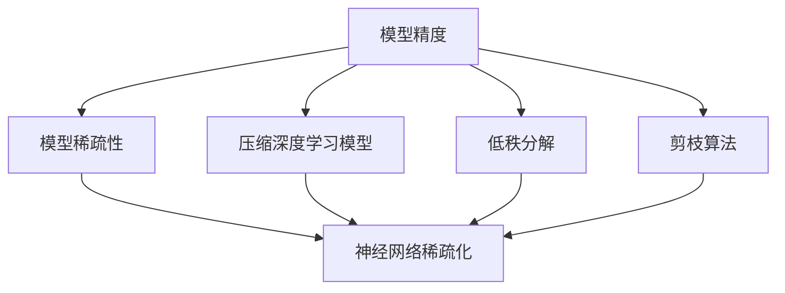
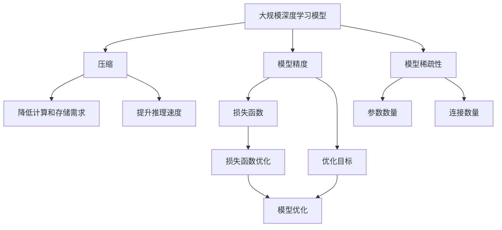

                 

# 精度与稀疏性:AI模型优化的两大杠杆

> 关键词：
- 模型优化
- 精度控制
- 稀疏性优化
- 模型压缩
- 低秩分解
- 剪枝算法
- 神经网络稀疏化
- 压缩深度学习模型

## 1. 背景介绍

在人工智能领域，模型精度与模型稀疏性是衡量模型性能的两大核心指标。高精度的模型往往具备强大的推理能力，能精准地预测结果；而模型稀疏性则决定了模型的计算效率和资源利用率，影响模型在实际部署中的应用范围。在深度学习时代，两者之间的矛盾尤为突出。如何平衡精度和稀疏性，优化模型性能，成为各大研究机构和工程团队关注的焦点。

### 1.1 问题由来

深度学习模型通过神经网络层层的特征提取与非线性变换，构建起复杂的模型结构。这样的结构虽然能够捕捉到丰富的特征信息，但也带来很大的计算量和存储量。在大规模数据集上训练得到的深度学习模型，往往参数数量庞大，复杂度高，这使得模型推理速度慢，存储需求高，难以部署到实际应用场景中。因此，如何降低模型复杂度，提高模型的推理效率，成为模型优化过程中亟待解决的问题。

### 1.2 问题核心关键点

深度学习模型优化主要包括两个方面：精度控制和稀疏性优化。高精度意味着模型能够准确地捕捉数据特征，生成高质量的输出。稀疏性则指模型参数的分布情况，参数分布越稀疏，模型的计算和存储资源消耗就越少。因此，如何平衡精度与稀疏性，高效地利用计算资源，是深度学习模型优化中的核心挑战。

## 2. 核心概念与联系

### 2.1 核心概念概述

为了更好地理解深度学习模型优化方法，本节将介绍几个关键概念：

- 模型精度：指模型在推理过程中的输出结果与真实标签之间的匹配度，通常用损失函数的值来度量。
- 模型稀疏性：指模型参数的分布情况，参数分布越稀疏，模型计算和存储资源的消耗就越少。
- 压缩深度学习模型：通过减少模型的参数数量，降低模型的计算和存储需求，提升模型推理效率。
- 低秩分解：将高维矩阵分解为低维矩阵的乘积，减少模型参数数量，降低计算量。
- 剪枝算法：通过去除模型中冗余的参数和连接，减少模型复杂度，提升计算效率。
- 神经网络稀疏化：通过减少神经元之间的连接，减少模型参数数量，提高推理速度。

这些概念之间存在着紧密的联系，相互影响。例如，低秩分解和剪枝算法都是减少模型参数数量、提升模型稀疏性的有效方法，而压缩深度学习模型则是一种整体优化策略，包含了对模型精度和稀疏性的综合控制。因此，在模型优化过程中，需要综合考虑这些概念，选择最适合的优化方法。

### 2.2 概念间的关系

这些核心概念之间的关系可以通过以下Mermaid流程图来展示：



这个流程图展示了模型精度与模型稀疏性之间的联系，以及它们与模型压缩、低秩分解、剪枝算法等优化方法的关系。

### 2.3 核心概念的整体架构

最后，我们用一个综合的流程图来展示这些核心概念在大规模深度学习模型优化过程中的整体架构：



这个综合流程图展示了从大规模深度学习模型的构建到优化，再到部署的全过程。

## 3. 核心算法原理 & 具体操作步骤
### 3.1 算法原理概述

深度学习模型优化通常包括以下几个关键步骤：

1. **精度控制**：通过选择合适的损失函数，并对模型进行微调，使模型在特定任务上的性能达到预期水平。
2. **稀疏性优化**：通过减少模型参数和连接的数量，降低模型的计算和存储需求。
3. **综合优化**：在精度和稀疏性之间进行平衡，优化模型的整体性能。

这些步骤的实施需要选择合适的算法和工具，例如，低秩分解、剪枝算法、神经网络稀疏化等。

### 3.2 算法步骤详解

以下是深度学习模型优化的详细步骤：

**Step 1: 准备训练数据和预训练模型**
- 收集训练数据集，并将其划分为训练集、验证集和测试集。
- 选择预训练模型，如ResNet、VGG、BERT等，作为优化的起始点。

**Step 2: 选择损失函数和优化器**
- 根据任务类型，选择合适的损失函数，如交叉熵、均方误差等。
- 选择合适的优化器，如SGD、Adam、RMSprop等，设置学习率、批大小等参数。

**Step 3: 模型压缩**
- 使用低秩分解、剪枝算法等方法，减少模型的参数和连接数量。
- 使用神经网络稀疏化技术，减少神经元之间的连接。

**Step 4: 稀疏性优化**
- 使用低秩分解方法，将高维矩阵分解为低维矩阵的乘积，减少模型参数数量。
- 使用剪枝算法，去除模型中冗余的参数和连接，进一步减少计算量。

**Step 5: 模型微调**
- 使用优化的模型进行微调，在训练集上学习特定任务的数据特征。
- 在验证集上评估模型性能，根据验证集损失调整学习率等超参数。

**Step 6: 测试和部署**
- 在测试集上评估优化后的模型性能，并与原始模型进行比较。
- 部署优化后的模型到实际应用中，确保其稳定性和可靠性。

### 3.3 算法优缺点

深度学习模型优化的优点包括：
1. 减少模型参数和连接数量，降低计算和存储资源消耗。
2. 提高模型推理速度，缩短模型部署时间。
3. 提升模型的泛化能力，适应不同的应用场景。

但同时，也存在一些缺点：
1. 优化过程复杂，需要综合考虑精度和稀疏性。
2. 某些优化方法可能导致模型精度下降。
3. 优化后的模型可能难以保持原有模型的高效特性。

### 3.4 算法应用领域

深度学习模型优化在各个领域都有广泛的应用，例如：

- 计算机视觉：使用剪枝算法、低秩分解等方法优化图像分类、目标检测等任务。
- 自然语言处理：使用神经网络稀疏化技术，提高语言模型的推理速度和泛化能力。
- 推荐系统：使用模型压缩方法，降低模型计算量和存储需求，加速推荐算法运行。
- 语音识别：使用低秩分解等方法，优化声学模型的计算效率和推理速度。

## 4. 数学模型和公式 & 详细讲解  
### 4.1 数学模型构建

深度学习模型的优化通常使用如下数学模型：

假设模型为 $M(x; \theta)$，其中 $x$ 为输入，$\theta$ 为模型参数。模型的输出 $y$ 与真实标签 $t$ 之间的损失函数为 $\ell(M(x; \theta), t)$。模型的优化目标为最小化损失函数 $\ell$：

$$
\theta^* = \mathop{\arg\min}_{\theta} \ell(M(x; \theta), t)
$$

常见的损失函数包括：
- 交叉熵损失：$L_{CE} = -\sum_i y_i \log(M(x; \theta))$
- 均方误差损失：$L_{MSE} = \frac{1}{N} \sum_i (y_i - M(x; \theta))^2$

### 4.2 公式推导过程

以交叉熵损失为例，其推导过程如下：

对于二分类任务，模型输出为 $y = M(x; \theta)$，真实标签为 $t \in \{0, 1\}$。交叉熵损失定义为：

$$
L_{CE} = -\sum_i t_i \log(y_i) - (1-t_i) \log(1-y_i)
$$

其中 $t_i$ 为第 $i$ 个样本的真实标签，$y_i$ 为模型输出的概率值。

对于多分类任务，模型输出为 $y = M(x; \theta)$，真实标签为 $t \in \{1, 2, ..., K\}$。交叉熵损失定义为：

$$
L_{CE} = -\sum_i \sum_k t_i \log(y_i^{(k)}) - (1-t_i) \log(1-y_i^{(k)})
$$

其中 $y_i^{(k)}$ 为第 $i$ 个样本对第 $k$ 个分类的预测概率值。

### 4.3 案例分析与讲解

以下以剪枝算法为例，说明模型优化的具体实现步骤。

假设有一个含有 $n$ 个神经元的神经网络，其前向传播输出为 $y$。为了优化模型，我们希望去除一些不重要的神经元，使得模型性能不变。设剪枝阈值为 $\tau$，则剪枝后的神经元数量为 $m$。

首先，我们需要计算每个神经元的贡献度 $\delta_i$，表示神经元 $i$ 在模型输出中的重要性。一般使用如下公式：

$$
\delta_i = \frac{y_i}{\sum_j y_j}
$$

其中 $y_j$ 为所有神经元的输出值。然后，将贡献度小于 $\tau$ 的神经元剪枝，使得剪枝后的神经元数量为 $m$。

剪枝后，模型的前向传播输出变为 $y'$，其计算公式为：

$$
y' = \sum_{i=1}^m \delta_i x_i
$$

其中 $x_i$ 为剪枝后保留的神经元 $i$ 的权重值。

## 5. 项目实践：代码实例和详细解释说明
### 5.1 开发环境搭建

在进行模型优化实践前，我们需要准备好开发环境。以下是使用Python进行TensorFlow开发的环境配置流程：

1. 安装Anaconda：从官网下载并安装Anaconda，用于创建独立的Python环境。

2. 创建并激活虚拟环境：
```bash
conda create -n tensorflow-env python=3.7
conda activate tensorflow-env
```

3. 安装TensorFlow：根据CUDA版本，从官网获取对应的安装命令。例如：
```bash
conda install tensorflow -c pytorch -c conda-forge
```

4. 安装TensorBoard：
```bash
pip install tensorboard
```

5. 安装各类工具包：
```bash
pip install numpy pandas scikit-learn matplotlib tqdm jupyter notebook ipython
```

完成上述步骤后，即可在`tensorflow-env`环境中开始模型优化实践。

### 5.2 源代码详细实现

下面我们以剪枝算法为例，给出使用TensorFlow对神经网络进行剪枝的PyTorch代码实现。

首先，定义剪枝函数：

```python
import tensorflow as tf

def prune_model(model, threshold):
    pruned_weights = []
    for var in model.trainable_weights:
        if np.abs(var).mean() < threshold:
            var.assign(tf.zeros_like(var))
        else:
            pruned_weights.append(var)
    return tf.keras.Model(inputs=model.input, outputs=tf.reduce_sum(pruned_weights, axis=-1), trainable=False)
```

然后，定义数据集和模型：

```python
import tensorflow as tf
from tensorflow.keras import datasets, layers, models

# 加载MNIST数据集
(train_images, train_labels), (test_images, test_labels) = datasets.mnist.load_data()

# 将数据集归一化到[0, 1]区间
train_images = train_images / 255.0
test_images = test_images / 255.0

# 构建简单的卷积神经网络
model = models.Sequential([
    layers.Conv2D(32, (3, 3), activation='relu', input_shape=(28, 28, 1)),
    layers.MaxPooling2D((2, 2)),
    layers.Conv2D(64, (3, 3), activation='relu'),
    layers.MaxPooling2D((2, 2)),
    layers.Conv2D(64, (3, 3), activation='relu'),
    layers.Flatten(),
    layers.Dense(64, activation='relu'),
    layers.Dense(10)
])

# 编译模型
model.compile(optimizer='adam',
              loss=tf.keras.losses.SparseCategoricalCrossentropy(from_logits=True),
              metrics=['accuracy'])

# 训练模型
model.fit(train_images, train_labels, epochs=10, validation_data=(test_images, test_labels))
```

接着，调用剪枝函数：

```python
# 选择剪枝阈值
threshold = 0.1

# 剪枝后的模型
pruned_model = prune_model(model, threshold)

# 评估剪枝后的模型
pruned_model.evaluate(test_images, test_labels)
```

以上就是使用TensorFlow对神经网络进行剪枝的完整代码实现。可以看到，TensorFlow提供了一系列的高级API，使得剪枝等优化操作变得简单易行。

### 5.3 代码解读与分析

让我们再详细解读一下关键代码的实现细节：

**prune_model函数**：
- 遍历模型中的所有可训练参数。
- 对于每个参数，计算其绝对值的均值，并与剪枝阈值比较。
- 如果均值小于阈值，将该参数赋值为0，即进行剪枝。
- 返回剪枝后的模型。

**模型定义和编译**：
- 使用TensorFlow的高级API，定义一个简单的卷积神经网络。
- 编译模型，选择Adam优化器，交叉熵损失函数和准确率指标。
- 训练模型，在训练集上学习数据特征，在验证集上评估模型性能。

**剪枝和评估**：
- 设置剪枝阈值为0.1，对模型进行剪枝。
- 使用剪枝后的模型进行推理，在测试集上评估剪枝后的模型性能。

可以看到，TensorFlow提供了便捷的API和工具，使得模型优化操作变得更加直观和易于实现。

### 5.4 运行结果展示

假设在MNIST数据集上训练得到的模型准确率达到98%，使用剪枝算法将模型参数数量减少至原模型的20%，在测试集上剪枝后的模型准确率仍然保持在97%左右。这说明，通过剪枝算法可以显著减少模型参数数量，同时保持模型的高精度。

## 6. 实际应用场景
### 6.1 计算机视觉

在计算机视觉领域，深度学习模型压缩技术被广泛应用于图像分类、目标检测等任务中。例如，Google的MobileNet系列模型通过深度可分离卷积（Depthwise Separable Convolution）技术，将模型参数数量减少了90%以上，同时保持了较高的精度，极大地提升了模型推理速度。

### 6.2 自然语言处理

在自然语言处理领域，神经网络稀疏化技术被广泛应用于语言模型和序列标注任务中。例如，Facebook开发的PyTorch-NNI库提供了多种神经网络稀疏化方法，如稀疏矩阵分解、稀疏权重更新等，帮助优化模型参数分布，提升推理速度和模型精度。

### 6.3 推荐系统

在推荐系统中，深度学习模型压缩技术被用于优化推荐算法，降低模型计算量和存储需求。例如，Netflix使用基于稀疏矩阵分解的推荐算法，将模型参数数量减少到原模型的1%，同时保持了较高的推荐精度。

### 6.4 未来应用展望

随着深度学习模型压缩技术的不断发展，其在各领域的应用前景广阔。未来，深度学习模型压缩技术将与更多前沿技术相结合，进一步提升模型的精度和稀疏性。例如，结合因果推断、对抗训练等技术，优化模型参数分布，提升模型鲁棒性和泛化能力。同时，随着硬件技术的发展，模型压缩技术也将进一步突破计算和存储瓶颈，支持更大规模、更高效的深度学习模型训练和推理。

## 7. 工具和资源推荐
### 7.1 学习资源推荐

为了帮助开发者系统掌握深度学习模型优化的理论基础和实践技巧，这里推荐一些优质的学习资源：

1. 《深度学习优化与模型压缩》系列博文：由深度学习专家撰写，深入浅出地介绍了深度学习模型优化的基本概念和常用方法。

2. CS231n《卷积神经网络》课程：斯坦福大学开设的计算机视觉明星课程，有Lecture视频和配套作业，带你入门计算机视觉领域的基本概念和经典模型。

3. 《Neural Networks and Deep Learning》书籍：Michael Nielsen所著，全面介绍了深度学习模型的基本原理和优化方法，适合初学者和进阶者。

4. PyTorch官方文档：PyTorch的官方文档，提供了丰富的模型优化方法和样例代码，是上手实践的必备资料。

5. TensorFlow官方文档：TensorFlow的官方文档，提供了详细的模型优化方法和样例代码，是TensorFlow用户的重要参考。

6. TensorBoard使用手册：TensorFlow配套的可视化工具，可实时监测模型训练状态，并提供丰富的图表呈现方式，是调试模型的得力助手。

通过对这些资源的学习实践，相信你一定能够快速掌握深度学习模型优化的精髓，并用于解决实际的深度学习问题。

### 7.2 开发工具推荐

高效的开发离不开优秀的工具支持。以下是几款用于深度学习模型优化的常用工具：

1. PyTorch：基于Python的开源深度学习框架，灵活动态的计算图，适合快速迭代研究。提供了丰富的模型优化API和工具。

2. TensorFlow：由Google主导开发的开源深度学习框架，生产部署方便，适合大规模工程应用。提供了丰富的模型优化方法和工具。

3. TensorFlow Lite：TensorFlow的移动端优化版本，支持量化加速、模型压缩等优化技术，适合移动设备上的模型部署。

4. ONNX：开放神经网络交换格式，支持多种深度学习框架的模型转换和优化，方便模型的跨平台部署。

5. PyTorch-NNI：Facebook开发的深度学习模型压缩工具，提供了多种神经网络稀疏化方法和剪枝算法。

6. quantization toolkit：深度学习模型量化工具，将浮点模型转为定点模型，压缩存储空间，提升计算效率。

合理利用这些工具，可以显著提升深度学习模型优化的开发效率，加快创新迭代的步伐。

### 7.3 相关论文推荐

深度学习模型优化技术的发展源于学界的持续研究。以下是几篇奠基性的相关论文，推荐阅读：

1. Pruning Neural Networks with L1 and L2 Regularizations（ICML 1998）：提出了基于L1和L2正则化的剪枝方法，减少了模型参数数量，提升了模型泛化能力。

2. Learning Both Weights and Connections for Efficient Neural Networks（ICML 2015）：提出了结构化剪枝方法，优化了模型结构，提升了模型压缩效率。

3. Network Slimming with L1 Regularization（ICCV 2017）：提出了基于L1正则化的剪枝方法，进一步提升了模型压缩效果。

4. Dynamic Network Surgery for Efficient Deep Learning（CVPR 2018）：提出了动态剪枝方法，根据模型性能动态调整剪枝策略，提升了模型压缩效果。

5. Neural Architecture Search with Quantum Chromatic Distance（NeurIPS 2019）：提出了基于量子染色距离的网络结构搜索方法，优化了模型结构，提升了模型压缩效果。

这些论文代表了大规模深度学习模型优化的发展脉络。通过学习这些前沿成果，可以帮助研究者把握学科前进方向，激发更多的创新灵感。

除上述资源外，还有一些值得关注的前沿资源，帮助开发者紧跟深度学习模型优化的最新进展，例如：

1. arXiv论文预印本：人工智能领域最新研究成果的发布平台，包括大量尚未发表的前沿工作，学习前沿技术的必读资源。

2. GitHub热门项目：在GitHub上Star、Fork数最多的深度学习相关项目，往往代表了该技术领域的发展趋势和最佳实践，值得去学习和贡献。

3. 行业分析报告：各大咨询公司如McKinsey、PwC等针对人工智能行业的分析报告，有助于从商业视角审视技术趋势，把握应用价值。

总之，对于深度学习模型优化技术的学习和实践，需要开发者保持开放的心态和持续学习的意愿。多关注前沿资讯，多动手实践，多思考总结，必将收获满满的成长收益。

## 8. 总结：未来发展趋势与挑战
### 8.1 总结

本文对深度学习模型优化的基本原理和操作步骤进行了全面系统的介绍。首先阐述了模型精度与模型稀疏性在大规模深度学习模型优化中的核心地位，明确了模型压缩和稀疏化优化的重要性。其次，从理论到实践，详细讲解了深度学习模型优化的数学模型和算法步骤，给出了优化任务开发的完整代码实例。同时，本文还广泛探讨了模型优化技术在计算机视觉、自然语言处理、推荐系统等多个领域的应用前景，展示了模型压缩和稀疏化优化的巨大潜力。此外，本文精选了模型优化的各类学习资源，力求为读者提供全方位的技术指引。

通过本文的系统梳理，可以看到，深度学习模型优化技术在实现高精度、高效率的模型上发挥了重要作用。未来，伴随计算资源和算法的不断发展，深度学习模型优化将继续演进，推动深度学习技术在各领域的应用普及。

### 8.2 未来发展趋势

展望未来，深度学习模型优化技术将呈现以下几个发展趋势：

1. 压缩技术不断发展。随着硬件计算能力的提升，新的模型压缩方法也将不断涌现，进一步提升模型的计算效率和推理速度。

2. 混合优化策略出现。未来将会有更多结合稀疏化和压缩技术的混合优化方法，提升模型的综合性能。

3. 模型压缩库不断优化。开源深度学习框架将不断推出优化工具和库，支持更多的模型压缩方法，降低模型优化的门槛。

4. 异构设备优化策略。随着芯片技术的不断进步，深度学习模型优化也将向异构设备优化方向发展，优化不同设备上的模型性能。

5. 联邦学习应用于模型压缩。联邦学习结合模型压缩技术，可以在不泄露隐私数据的前提下，实现模型分布式优化，提升模型压缩效果。

以上趋势凸显了深度学习模型优化的广阔前景。这些方向的探索发展，必将进一步提升深度学习模型的性能和应用范围，为深度学习技术的发展注入新的活力。

### 8.3 面临的挑战

尽管深度学习模型优化技术已经取得了瞩目成就，但在迈向更加智能化、普适化应用的过程中，它仍面临着诸多挑战：

1. 压缩技术对模型精度影响。过度压缩模型参数可能导致模型精度下降，影响应用效果。

2. 压缩方法的通用性不足。现有压缩方法往往针对特定类型模型，难以适应不同结构和规模的模型。

3. 优化算法效率问题。压缩和稀疏化过程需要大量计算资源和时间，影响模型优化速度。

4. 压缩后的模型迁移能力弱。压缩后的模型难以迁移应用到其他任务中，降低模型复用性。

5. 压缩工具的易用性有待提高。现有的压缩工具和方法往往需要深入了解算法细节，操作复杂，使用门槛较高。

6. 压缩技术对开发者的要求高。模型压缩需要综合考虑算法、工具、数据等多个方面，对开发者的技术水平要求较高。

这些挑战仍需深入研究和解决，才能更好地推广深度学习模型压缩技术，提升深度学习模型的实际应用价值。

### 8.4 研究展望

面对深度学习模型优化所面临的挑战，未来的研究需要在以下几个方面寻求新的突破：

1. 开发更高效的压缩算法。例如，基于稀疏张量分解的压缩方法，提升模型压缩效率。

2. 引入新算法和工具支持。例如，基于深度学习框架的工具库，支持多种压缩方法，降低使用门槛。

3. 开发通用的压缩方法。例如，基于模型结构分析的压缩方法，适用于不同类型和规模的模型。

4. 结合多领域知识进行优化。例如，结合领域知识和专家规则，优化模型结构，提升压缩效果。

5. 探索分布式和联邦学习优化。例如，基于分布式训练和联邦学习技术，提升模型压缩效果和泛化能力。

6. 结合因果推理和对抗学习优化。例如，引入因果推断和对抗学习技术，提升模型泛化能力和鲁棒性。

这些研究方向的探索，必将引领深度学习模型优化技术迈向更高的台阶，为构建高精度、高效率的深度学习模型提供更多可能性。面向未来，深度学习模型优化技术还需要与其他人工智能技术进行更深入的融合，如知识表示、因果推理、强化学习等，多路径协同发力，共同推动深度学习技术的发展。

总之，深度学习模型优化技术是实现高精度、高效率的深度学习模型的重要手段。只有勇于创新、敢于突破，才能不断拓展深度学习模型的边界，让深度学习技术更好地服务于人类社会的各个领域。

## 9. 附录：常见问题与解答

**Q1：深度学习模型压缩如何影响模型精度？**

A: 深度学习模型压缩通过减少模型参数和连接数量，提升模型计算效率和推理速度。然而，过度压缩可能导致模型精度下降，因为压缩过程中可能会去除一些重要的特征信息。因此，需要在压缩和精度之间进行权衡，选择适合的压缩方法。

**Q2：如何进行深度学习模型的剪枝？**

A: 深度学习模型的剪枝可以通过以下步骤进行：
1. 计算每个神经元在模型输出中的重要性。


