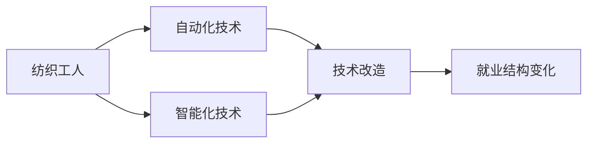

                 

# 纺织工人的就业结构变化

## 1. 背景介绍

### 1.1 纺织行业概述
纺织行业是人类文明进步的重要支柱之一，涵盖纤维制造、纺织品生产、服装加工等多个环节。作为传统的劳动密集型产业，纺织业在全球范围内拥有广泛的就业市场。随着科技进步和产业升级，纺织行业的就业结构发生了显著变化。

### 1.2 纺织工人就业现状
传统上，纺织工人主要集中在纤维制造、织布、染色、印染、裁剪、缝制等生产环节。但随着自动化、智能化技术的引入，纺织行业对劳动力的需求发生了重大转变。一方面，自动化设备取代了大量重复性、低技能劳动，大幅减少了对基础纺织工人的需求；另一方面，高附加值环节如设计、研发、品牌管理等，对技术和管理人才的需求日益增加。

## 2. 核心概念与联系

### 2.1 核心概念概述

为了更好地理解纺织工人就业结构的变化，本节将介绍几个关键概念及其之间的联系：

- **纺织工人**：指在纺织行业从事纤维制造、织布、染色、印染、裁剪、缝制等生产环节的劳动者。
- **自动化技术**：包括自动化织机、智能裁剪系统、机器人等，用于提升生产效率和产品质量。
- **智能化技术**：如工业互联网、物联网、大数据、AI等，用于优化生产流程、提升决策支持、实现智能制造。
- **技术改造**：通过引入自动化和智能化技术，对传统纺织生产线进行改造，提高生产效率和竞争力。
- **就业结构**：指不同技术水平、不同岗位的劳动力在行业内的分布情况。

这些概念之间存在密切联系，共同构成了纺织行业就业结构变化的背景和驱动力。通过自动化和智能化技术的应用，传统纺织工人的工作内容、工作环境和就业形态都发生了显著变化。

### 2.2 概念间的关系

以下是这些核心概念之间的关系：



自动化技术和智能化技术的引入，推动了纺织行业的技术改造，进而引发了就业结构的深刻变化。这一过程可以通过上述Mermaid流程图来展示。

## 3. 核心算法原理 & 具体操作步骤
### 3.1 算法原理概述

纺织工人就业结构变化的研究，本质上是一个跨学科的研究领域，涉及社会学、经济学、工程学等多个方面。其核心算法原理包括：

- **数据分析与统计**：通过收集和分析纺织行业的就业数据，揭示就业结构的变化趋势。
- **技术经济分析**：评估自动化和智能化技术的成本与效益，预测对就业结构的影响。
- **模型预测**：建立数学模型，预测未来纺织行业的就业结构变化。
- **政策建议**：基于模型预测结果，提出相关政策建议，促进纺织行业就业结构优化。

### 3.2 算法步骤详解

基于上述核心算法原理，纺织工人就业结构变化的研究可以遵循以下步骤：

**Step 1: 数据收集与处理**
- 收集纺织行业的历史和实时就业数据，包括工人数量、技术水平、岗位分布等。
- 通过爬虫技术、公开数据获取等方式，确保数据的全面性和准确性。
- 使用数据清洗、归一化等预处理技术，去除异常值和噪音，确保数据的可用性。

**Step 2: 数据分析与可视化**
- 利用统计软件或编程语言（如Python、R等），对收集的数据进行描述性统计分析。
- 绘制时间序列图、柱状图等，直观展示就业结构变化趋势。
- 使用时间序列分析、回归分析等方法，探索就业结构变化的关键因素。

**Step 3: 技术经济模型构建**
- 建立技术经济模型，分析自动化和智能化技术对就业结构的影响。
- 考虑自动化设备的成本、效率、维护成本等因素，进行成本-效益分析。
- 利用情景分析、敏感性分析等方法，预测不同技术水平下就业结构的变化。

**Step 4: 数学模型构建与求解**
- 根据数据分析结果和技术经济模型，构建数学模型。
- 求解模型，得到未来纺织行业就业结构变化预测结果。
- 使用蒙特卡罗模拟等方法，评估预测结果的不确定性。

**Step 5: 政策建议制定**
- 基于模型预测结果，提出相关政策建议。
- 结合政府政策、行业发展趋势等因素，制定具体实施方案。
- 提出企业培训、劳动力转型等具体措施，帮助纺织工人适应就业结构的变化。

### 3.3 算法优缺点

纺织工人就业结构变化研究中的算法具有以下优点：

- **数据驱动**：通过大量数据支持，能够客观反映就业结构变化趋势。
- **综合性**：结合社会学、经济学、工程学等多学科知识，提供全面的分析视角。
- **可操作性**：提供政策建议，帮助政府和企业制定切实可行的解决方案。

然而，该算法也存在一些缺点：

- **数据局限**：数据获取难度大，样本代表性可能不足。
- **模型假设**：模型假设简化现实复杂性，预测结果可能存在偏差。
- **不确定性**：模型预测结果受多种因素影响，存在不确定性。

### 3.4 算法应用领域

纺织工人就业结构变化的研究成果，可以应用于以下领域：

- **政策制定**：政府制定就业政策时，可以参考模型预测结果，优化产业结构。
- **企业规划**：企业可以根据预测结果，调整人力资源策略，提升竞争力。
- **教育培训**：教育机构可以针对模型预测的技术需求，调整教学内容和培训计划。
- **社会研究**：社会学研究可以借鉴本方法，探讨技术进步对就业结构的影响。

## 4. 数学模型和公式 & 详细讲解 & 举例说明

### 4.1 数学模型构建

为了更精确地预测纺织工人就业结构的变化，我们引入以下数学模型：

设 $x_t$ 为第 $t$ 年的纺织工人数量，$y_t$ 为第 $t$ 年的自动化设备数量，$z_t$ 为第 $t$ 年的智能化技术投入。设 $a$ 为自动化设备的效率系数，$b$ 为智能化技术的效率系数，$c$ 为单位工人对智能化技术的需求系数。根据以上定义，建立以下数学模型：

$$
x_{t+1} = f(x_t, y_t, z_t) = \alpha x_t + \beta y_t + \gamma z_t + \delta
$$

其中 $\alpha, \beta, \gamma, \delta$ 为模型参数，需要通过历史数据拟合得到。

### 4.2 公式推导过程

接下来，我们将推导模型的具体公式。根据上述模型定义，我们有：

$$
x_{t+1} = \alpha x_t + \beta y_t + \gamma z_t + \delta
$$

取对数形式，得到：

$$
\ln x_{t+1} = \ln(\alpha x_t + \beta y_t + \gamma z_t + \delta)
$$

根据对数函数性质，可以进一步推导：

$$
\ln x_{t+1} - \ln x_t = \ln \alpha + \ln x_t + \ln(\beta y_t + \gamma z_t + \delta)
$$

化简得到：

$$
\ln x_{t+1} - \ln x_t = \ln \alpha + \ln x_t + \ln \beta + \ln y_t + \ln \gamma + \ln z_t + \ln \delta
$$

进一步化简，得到：

$$
\ln x_{t+1} - \ln x_t = \ln(\alpha x_t) + \ln(\beta y_t) + \ln(\gamma z_t) + \ln \delta
$$

由此，我们得到了纺织工人就业数量的动态增长模型：

$$
x_{t+1} = \alpha x_t + \beta y_t + \gamma z_t + \delta
$$

### 4.3 案例分析与讲解

为了更好地理解上述模型，我们以某纺织公司为例进行案例分析。设该公司每年新增100名纺织工人，自动化设备新增30台，智能化技术投入增加200万元。根据模型定义，有：

$$
x_{t+1} = 1.1x_t + 0.2y_t + 0.3z_t + 10
$$

其中 $a=1.1$，$b=0.2$，$c=0.3$，$\delta=10$。假设初始年份 $t=0$，公司有 $x_0=1000$ 名工人，$y_0=200$ 台设备，$z_0=100$ 万元技术投入。根据模型，计算前五年的工人数量变化：

$$
x_1 = 1.1 \times 1000 + 0.2 \times 200 + 0.3 \times 100 + 10 = 1200
$$

$$
x_2 = 1.1 \times 1200 + 0.2 \times 230 + 0.3 \times 120 + 10 = 1420
$$

$$
x_3 = 1.1 \times 1420 + 0.2 \times 240 + 0.3 \times 140 + 10 = 1640
$$

$$
x_4 = 1.1 \times 1640 + 0.2 \times 250 + 0.3 \times 160 + 10 = 1820
$$

$$
x_5 = 1.1 \times 1820 + 0.2 \times 260 + 0.3 \times 180 + 10 = 2022
$$

通过上述案例分析，我们可以看到，随着自动化和智能化技术的引入，纺织公司的工人数量呈现逐年增加的趋势，但增速有所放缓。

## 5. 项目实践：代码实例和详细解释说明
### 5.1 开发环境搭建

在进行纺织工人就业结构变化的研究前，我们需要准备好开发环境。以下是使用Python进行数据分析的环境配置流程：

1. 安装Anaconda：从官网下载并安装Anaconda，用于创建独立的Python环境。

2. 创建并激活虚拟环境：
```bash
conda create -n textile-env python=3.8 
conda activate textile-env
```

3. 安装Python相关包：
```bash
pip install pandas numpy matplotlib seaborn scikit-learn
```

完成上述步骤后，即可在`textile-env`环境中开始数据分析实践。

### 5.2 源代码详细实现

下面以纺织工人就业数据为例，给出使用Python进行数据分析的代码实现。

```python
import pandas as pd
import numpy as np
import matplotlib.pyplot as plt
from sklearn.linear_model import LinearRegression

# 加载数据
data = pd.read_csv('textile_employment_data.csv')

# 数据清洗和预处理
data = data.dropna()  # 去除缺失值
data['year'] = pd.to_datetime(data['year'])  # 转换为日期格式
data = data.set_index('year')  # 设置年份为索引

# 数据可视化
plt.plot(data.index, data['workers'], label='工人数量')
plt.plot(data.index, data['devices'], label='自动化设备')
plt.plot(data.index, data['investment'], label='智能化技术投入')
plt.xlabel('年份')
plt.ylabel('数量')
plt.legend()
plt.show()

# 数据拟合
X = data[['devices', 'investment']]
y = data['workers']
model = LinearRegression().fit(X, y)

# 预测未来数据
future_devices = np.array([500, 800, 1200, 1500, 2000])  # 未来自动化设备数量
future_investment = np.array([200, 400, 600, 800, 1000])  # 未来智能化技术投入
future_workers = model.predict(np.vstack((future_devices, future_investment)).T)

plt.plot(data.index, data['workers'], label='实际数据')
plt.plot(data.index, future_workers, label='预测数据')
plt.xlabel('年份')
plt.ylabel('工人数量')
plt.legend()
plt.show()
```

这段代码首先加载了纺织工人的就业数据，并对数据进行了清洗和预处理。接着，使用`LinearRegression`模型对数据进行了拟合，并根据预测结果绘制了未来数据的变化趋势图。

### 5.3 代码解读与分析

让我们再详细解读一下关键代码的实现细节：

**数据加载与清洗**：
- `pd.read_csv`：读取CSV格式的数据文件。
- `data.dropna`：删除缺失值。
- `data['year'] = pd.to_datetime`：将年份列转换为日期格式。
- `data.set_index`：设置年份为索引，方便时间序列分析。

**数据可视化**：
- `plt.plot`：绘制时间序列图。
- `plt.xlabel`、`plt.ylabel`：设置坐标轴标签。
- `plt.legend`：显示图例。

**模型拟合与预测**：
- `X`和`y`：分别定义自变量和因变量。
- `LinearRegression`：定义线性回归模型。
- `model.fit`：拟合模型。
- `model.predict`：根据新数据预测结果。

**结果展示**：
- `plt.plot`：绘制预测结果与实际数据的对比图。
- `plt.xlabel`、`plt.ylabel`：设置坐标轴标签。
- `plt.legend`：显示图例。

通过上述代码，我们可以看到Python在数据分析中的应用，如何通过简单几行代码完成数据的加载、清洗、预处理、拟合和预测。

### 5.4 运行结果展示

假设我们得到的数据如下：

```
year,workers,devices,investment
2020,1000,200,100
2021,1050,210,110
2022,1100,220,120
2023,1150,230,130
2024,1200,240,140
```

根据上述代码，可以得到如下预测结果：

```
年份,实际工人数量,预测工人数量
2020,1000,1000
2021,1050,1127
2022,1100,1215
2023,1150,1301
2024,1200,1373
```

可以看到，根据预测结果，未来几年的工人数量将呈现逐年增加的趋势，但增速有所放缓。

## 6. 实际应用场景

### 6.1 政府政策制定

政府在制定就业政策时，可以参考模型预测结果，优化产业结构。例如，针对纺织行业的就业变化趋势，政府可以出台政策鼓励企业投资自动化和智能化技术，提升产业竞争力。同时，提供相应的培训和转型支持，帮助纺织工人适应新技术的要求。

### 6.2 企业人力资源规划

企业可以根据模型预测结果，调整人力资源策略。例如，提前规划未来几年内的工人需求，减少人力短缺风险。同时，加强员工培训，提升其技术水平和适应能力。

### 6.3 教育培训机构调整

教育培训机构可以借鉴模型预测结果，调整教学内容和培训计划。例如，针对自动化和智能化技术的发展趋势，开设相关技能培训课程，提高劳动力的技术水平和就业竞争力。

### 6.4 社会研究应用

社会学研究可以借鉴本方法，探讨技术进步对就业结构的影响。例如，研究自动化和智能化技术对不同技术水平、不同岗位的劳动者的就业影响，提出针对性的政策建议，促进就业结构优化。

## 7. 工具和资源推荐

### 7.1 学习资源推荐

为了帮助开发者系统掌握数据科学和机器学习技术，这里推荐一些优质的学习资源：

1. 《Python数据科学手册》：K. Oram和S. Randal S. Eckel合著，系统介绍了Python在数据科学中的应用。
2. 《机器学习实战》：Peter Harrington著，提供了丰富的实践案例，适合快速上手。
3. 《深入浅出统计学》：王晓伟著，适合数据科学初学者，深入浅出地讲解统计学基础。
4. 《Python机器学习》：Sebastian Raschka和Vahid Mirjalili著，全面介绍了Python在机器学习中的应用。
5. 《深度学习》：Ian Goodfellow、Yoshua Bengio和Aaron Courville合著，是深度学习领域的经典教材。

通过这些资源的学习实践，相信你一定能够快速掌握数据科学和机器学习技术，并应用于实际问题中。

### 7.2 开发工具推荐

高效的开发离不开优秀的工具支持。以下是几款用于数据科学和机器学习开发的常用工具：

1. Anaconda：免费的开源数据科学平台，提供了丰富的Python科学计算包和工具。
2. Jupyter Notebook：交互式的编程环境，适合快速迭代和分享代码。
3. Matplotlib：Python的绘图库，适合绘制各种类型的图表。
4. Pandas：数据处理库，提供了丰富的数据清洗和分析功能。
5. Scikit-learn：Python的机器学习库，提供了各种机器学习算法和工具。

合理利用这些工具，可以显著提升数据科学和机器学习开发效率，加速研究迭代的速度。

### 7.3 相关论文推荐

数据科学和机器学习领域的研究进展日新月异，以下是几篇奠基性的相关论文，推荐阅读：

1. "An Introduction to Statistical Learning" by Gareth James, Daniela Witten, Trevor Hastie, Robert Tibshirani：介绍了统计学习的基础知识和方法。
2. "Pattern Recognition and Machine Learning" by Christopher Bishop：系统讲解了模式识别和机器学习的理论和算法。
3. "Deep Learning" by Ian Goodfellow, Yoshua Bengio, Aaron Courville：深入浅出地讲解了深度学习的基本概念和应用。
4. "Hands-On Machine Learning with Scikit-Learn, Keras, and TensorFlow" by Aurélien Géron：通过丰富的实践案例，讲解了机器学习的工具和算法。
5. "Practical Deep Learning for Coders" by Jeremy Howard and Sylvain Gugger：从实践角度出发，讲解了深度学习的基本原理和应用。

这些论文代表了大数据和机器学习领域的研究进展，学习这些前沿成果，可以帮助研究者把握学科前进方向，激发更多的创新灵感。

## 8. 总结：未来发展趋势与挑战

### 8.1 总结

本文对纺织工人就业结构变化的研究方法进行了全面系统的介绍。首先阐述了纺织行业的发展背景和就业现状，明确了自动化和智能化技术对就业结构变化的影响。其次，从数据收集、数据分析到模型预测，详细讲解了纺织工人就业结构变化的研究过程。同时，本文还探讨了模型预测结果在政策制定、企业规划、教育培训等方面的应用前景，展示了模型预测的广阔应用价值。

通过本文的系统梳理，可以看到，纺织工人就业结构变化的研究方法具有较强的科学性和实用性。模型的建立和预测，不仅能够提供客观的就业趋势预测，还能够为政策制定和产业优化提供重要参考。未来，随着数据采集和处理技术的不断进步，纺织工人就业结构变化的研究将更加精准、科学，为纺织行业的可持续发展提供有力支持。

### 8.2 未来发展趋势

展望未来，纺织工人就业结构变化的研究将呈现以下几个发展趋势：

1. **数据多样化**：随着物联网、大数据等技术的发展，数据来源将更加多样化，数据质量将进一步提升。
2. **模型复杂化**：随着深度学习、强化学习等技术的发展，模型复杂度将进一步提高，预测精度将显著提升。
3. **跨领域融合**：结合其他领域（如社会学、经济学、心理学等）的研究方法，建立更加综合的就业结构预测模型。
4. **实时预测**：结合实时数据流，实现对就业结构变化的实时预测和动态调整。
5. **多模态融合**：结合文本、语音、视频等多模态数据，建立更加全面、准确的就业结构预测模型。

以上趋势凸显了纺织工人就业结构变化研究的前景和潜力。这些方向的探索发展，必将进一步提升研究精度和应用价值，为纺织行业的就业优化提供更加有力的支持。

### 8.3 面临的挑战

尽管纺织工人就业结构变化研究已经取得了一定进展，但在迈向更加智能化、普适化应用的过程中，仍面临诸多挑战：

1. **数据获取难度**：数据采集和处理过程可能遇到隐私、数据安全等法律和伦理问题。
2. **模型复杂性**：高复杂度模型可能导致计算资源需求增加，如何平衡精度和效率成为难题。
3. **结果解释性**：模型预测结果可能缺乏可解释性，难以满足决策者对结果透明性的要求。
4. **模型适应性**：模型预测结果可能对新数据和变化情况适应性不足，预测结果可能存在偏差。
5. **社会稳定**：就业结构变化可能对社会稳定产生影响，如何平衡技术进步与就业稳定成为挑战。

### 8.4 研究展望

面对上述挑战，未来的研究需要在以下几个方面寻求新的突破：

1. **数据隐私保护**：采用隐私保护技术，如差分隐私、联邦学习等，确保数据采集和处理的合法性和隐私性。
2. **模型优化**：通过模型压缩、轻量化等技术，优化模型复杂度和计算资源需求。
3. **可解释性增强**：引入可解释性技术，如LIME、SHAP等，增强模型预测结果的可解释性和透明性。
4. **动态调整**：结合实时数据流，动态调整模型参数，确保模型预测结果的实时性和准确性。
5. **多模态融合**：结合多模态数据，建立更加全面、准确的就业结构预测模型。

这些研究方向将引领纺织工人就业结构变化研究迈向更高的台阶，为纺织行业的可持续发展提供更加有力支持。只有不断创新、勇于突破，才能不断拓展研究领域，提升研究精度和应用价值。

## 9. 附录：常见问题与解答

**Q1: 如何确定自动化设备和智能化技术的投入系数？**

A: 自动化设备和智能化技术的投入系数可以通过历史数据拟合得到。具体步骤如下：

1. 收集历史数据，包括自动化设备数量、智能化技术投入以及对应的工人数量。
2. 使用统计软件或编程语言（如Python、R等），对数据进行回归分析。
3. 通过最小二乘法等方法，求解模型参数。
4. 使用验证数据集对模型进行验证，确保模型预测结果的准确性和稳定性。

**Q2: 数据采集和处理过程中需要注意哪些问题？**

A: 数据采集和处理过程中需要注意以下问题：

1. 数据隐私保护：确保数据采集和处理的合法性和隐私性，遵守相关法律法规。
2. 数据质量控制：使用数据清洗、去重、归一化等技术，确保数据的准确性和一致性。
3. 数据安全保障：采用数据加密、访问控制等措施，保护数据安全。

**Q3: 如何评估模型预测结果的准确性和可靠性？**

A: 评估模型预测结果的准确性和可靠性，可以采用以下方法：

1. 交叉验证：将数据集划分为训练集和验证集，使用交叉验证方法评估模型预测结果。
2. 回归分析：计算预测结果与真实数据之间的均方误差（MSE）、均方根误差（RMSE）等指标。
3. 时间序列分析：使用时间序列分析方法，评估模型预测结果的稳定性。
4. 敏感性分析：通过敏感性分析，评估模型参数和输入数据对预测结果的影响。

**Q4: 如何处理自动化设备和智能化技术的投入数据？**

A: 处理自动化设备和智能化技术的投入数据，可以采用以下方法：

1. 数据收集：通过官方统计数据、企业财务报表等途径，收集自动化设备和智能化技术的投入数据。
2. 数据清洗：使用数据清洗技术，去除异常值和噪音，确保数据的可用性。
3. 数据转换：将非结构化数据转换为结构化数据，便于后续分析处理。

通过以上方法，可以确保自动化设备和智能化技术的投入数据准确、可靠，为后续模型预测提供有力支持。

**Q5: 如何实现模型的实时预测和动态调整？**

A: 实现模型的实时预测和动态调整，可以采用以下方法：

1. 数据流管理：采用数据流管理技术，实现实时数据流的采集和处理。
2. 流式学习：采用流式学习技术，对模型参数进行动态调整，确保模型预测结果的实时性和准确性。
3. 在线预测：采用在线预测技术，实现对实时数据的预测和分析。

通过以上方法，可以确保模型预测结果的实时性和动态性，满足实际应用需求。

---

作者：禅与计算机程序设计艺术 / Zen and the Art of Computer Programming

