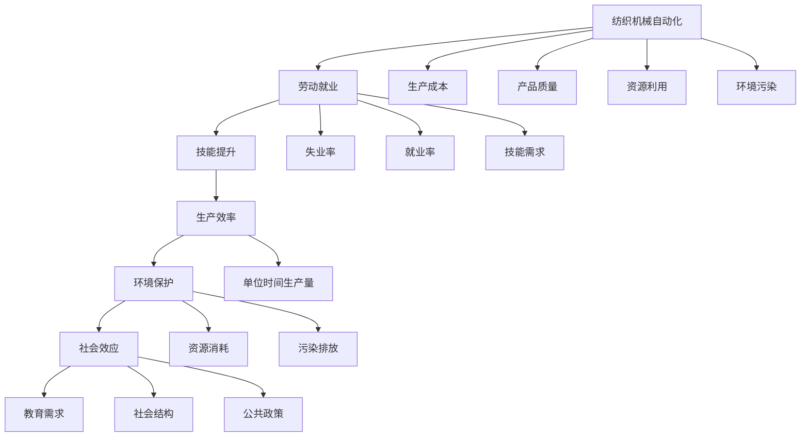
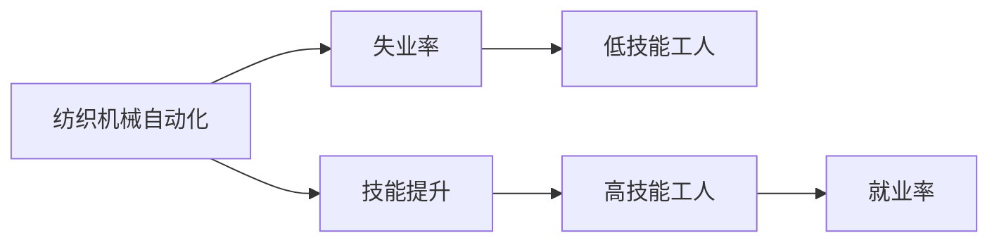
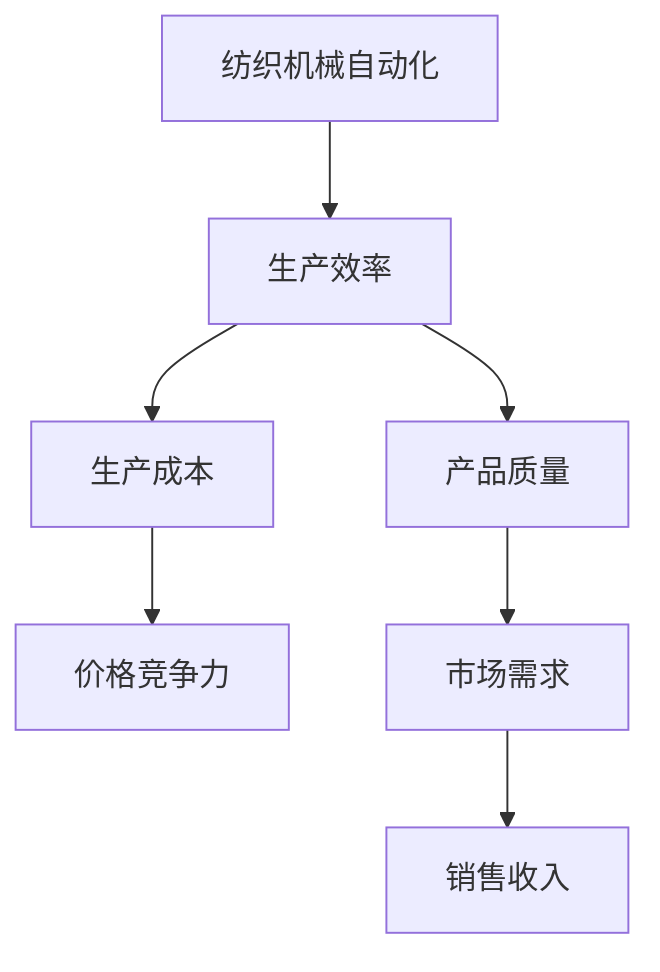
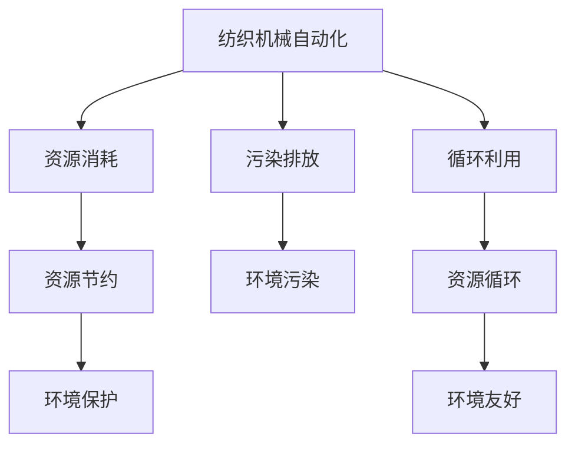
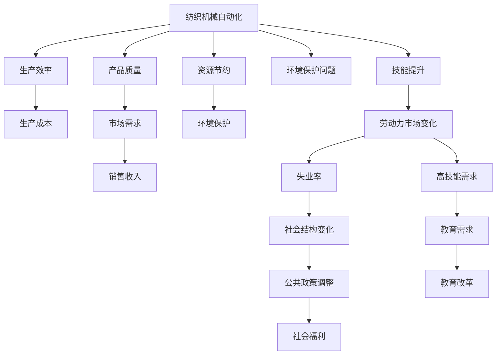

                 

# 纺织机械自动化的社会效应

> 关键词：纺织机械自动化, 社会效应, 自动化技术, 人工智能, 劳动就业, 环境影响

## 1. 背景介绍

### 1.1 问题由来
纺织机械自动化在过去几十年中取得了显著进展，从最初的半自动化操作到现今的全面自动化生产流程。自动化技术的引入极大提升了生产效率和产品质量，降低了生产成本。然而，随之而来的社会效应，尤其是对劳动就业和环境保护的影响，引起了广泛关注。本文旨在探讨纺织机械自动化对社会带来的影响，并提出应对策略，以实现技术与社会的和谐共生。

### 1.2 问题核心关键点
纺织机械自动化对社会产生的影响主要包括以下几个方面：
- **劳动就业**：自动化导致大量低技能工人失业，同时推动劳动力市场向高技能工种转移。
- **技能提升**：自动化迫使工人提升技能，以适应新的工作环境。
- **生产效率**：自动化大幅提高生产效率，降低生产成本。
- **环境保护**：自动化有助于减少资源浪费和环境污染，但同时可能引发新问题。

## 3. 核心概念与联系

### 3.1 核心概念概述

为更好地理解纺织机械自动化的社会效应，本节将介绍几个密切相关的核心概念：

- **纺织机械自动化**：指使用机器人和自动化系统进行纺织品的生产过程，包括从原料到成品的整个生产链条。自动化技术包括机器人、计算机视觉、人工智能等。

- **劳动力市场**：指劳动力的供应和需求情况，包括工种分布、工资水平、就业率等。

- **技能提升**：指通过教育和培训，工人获得新的技能以适应新工作的过程。

- **生产效率**：指单位时间内生产的产品数量，反映生产技术的先进性和生产过程的优化程度。

- **环境保护**：指在生产过程中减少资源消耗和环境污染，保护生态系统的可持续性。

- **社会效应**：指技术变革对社会结构、就业、教育等方面的影响。

这些核心概念之间的逻辑关系可以通过以下Mermaid流程图来展示：



这个流程图展示了一些核心概念之间的关系：

1. 纺织机械自动化对生产成本、产品质量、资源利用和环境污染产生影响。
2. 自动化导致劳动就业市场的变化，影响失业率和就业率，并推动技能提升。
3. 提高生产效率的同时，可能减少资源消耗和污染排放。
4. 社会效应涉及劳动力市场的变化、教育需求、社会结构和公共政策等方面。

### 3.2 概念间的关系

这些核心概念之间存在着紧密的联系，形成了纺织机械自动化对社会效应的完整影响图谱。下面我们通过几个Mermaid流程图来展示这些概念之间的关系。

#### 3.2.1 自动化与劳动就业的关系



这个流程图展示了自动化对劳动就业的影响。自动化替代了低技能工人，导致失业率上升，但同时也推动了劳动力市场向高技能工人转移。

#### 3.2.2 自动化与生产效率的关系



这个流程图展示了自动化对生产效率的影响。自动化提高了生产效率，降低了生产成本，从而增强了价格竞争力，增加了市场需求和销售收入。

#### 3.2.3 自动化与环境保护的关系



这个流程图展示了自动化对环境保护的影响。自动化提高了资源利用效率，减少了资源浪费和环境污染，但同时也可能产生新的环境问题。

### 3.3 核心概念的整体架构

最后，我们用一个综合的流程图来展示这些核心概念在大规模纺织机械自动化中的整体架构：



这个综合流程图展示了从纺织机械自动化到最终的社会效应的完整过程。自动化不仅影响了生产效率和生产成本，还对环境保护、劳动力市场、技能提升、社会结构和公共政策等多个方面产生了深远影响。

## 3. 核心算法原理 & 具体操作步骤
### 3.1 算法原理概述

纺织机械自动化的核心算法原理主要基于以下几个关键技术：

- **机器人控制**：通过编程和计算机视觉技术，机器人能够精确控制纺织品生产过程中的各种操作，如剪、裁、缝、烫等。
- **人工智能和机器学习**：通过训练深度学习模型，自动化系统能够自适应不同的生产环境和任务，提高生产效率和产品质量。
- **物联网**：通过传感器和通信技术，自动化系统能够实时监测生产过程，优化生产流程。

这些技术的综合应用，实现了从原料到成品的全自动化生产流程。自动化系统的关键在于高效地处理复杂任务，降低人为错误，提高生产效率和产品质量。

### 3.2 算法步骤详解

纺织机械自动化的具体实施步骤如下：

1. **需求分析**：确定生产需求和自动化目标，如生产效率、产品质量、成本控制等。
2. **系统设计**：根据需求，设计自动化生产系统的架构和流程。
3. **设备选型**：选择适合的生产设备和控制系统，如工业机器人、数控机床、自动化生产线等。
4. **编程和调试**：编写机器人控制程序和自动化系统软件，进行系统调试和优化。
5. **培训和部署**：对工人进行技能培训，部署自动化系统并进行系统上线运行。
6. **监控和维护**：实时监控生产过程，进行系统维护和升级。

### 3.3 算法优缺点

纺织机械自动化的优点包括：

- **提高生产效率**：自动化系统能够24小时不间断工作，减少人为操作，提高生产效率。
- **降低生产成本**：自动化减少了人工成本和错误成本，降低了生产成本。
- **提高产品质量**：自动化系统能够保证生产过程的一致性和精度，提高产品质量。
- **减少资源浪费**：自动化系统能够优化生产过程，减少资源浪费和环境污染。

然而，自动化也存在以下缺点：

- **高初始投资成本**：自动化系统的高成本和复杂性，使得初期投资较高。
- **技能提升难度**：自动化需要工人掌握新技能，增加了技能提升的难度。
- **就业结构变化**：自动化可能导致低技能工人失业，同时推动劳动力市场向高技能工人转移。
- **环境影响**：自动化系统在提高效率的同时，也可能引发新环境问题。

### 3.4 算法应用领域

纺织机械自动化已经广泛应用于以下几个领域：

- **服装制造**：从面料准备到成衣加工，自动化技术大幅提高了生产效率和产品质量。
- **家用纺织品**：如床上用品、毛巾、地毯等，自动化技术使得生产过程更加高效和清洁。
- **工业纺织品**：如防护服、军服、工业用布等，自动化技术保障了生产过程的精度和一致性。
- **智能纺织品**：如智能服装、智能家居纺织品等，自动化技术使得智能纺织品的生产成为可能。

## 4. 数学模型和公式 & 详细讲解 & 举例说明

### 4.1 数学模型构建

纺织机械自动化的数学模型可以基于以下几个关键指标构建：

- **生产效率**：定义生产效率 $E$ 为单位时间内生产的产品数量，即 $E = \frac{P}{T}$，其中 $P$ 为生产的产品数量，$T$ 为生产时间。
- **生产成本**：定义生产成本 $C$ 为生产过程中所有成本的总和，包括原材料成本、设备维护成本、人力资源成本等。
- **资源消耗**：定义资源消耗 $R$ 为生产过程中资源的使用量，包括水、电、气等。
- **环境影响**：定义环境影响 $EI$ 为生产过程中对环境造成的影响，包括废水、废气、固体废物等。

### 4.2 公式推导过程

以生产效率 $E$ 为例，其推导过程如下：

$$
E = \frac{P}{T} = \frac{N}{t}
$$

其中 $N$ 为单位时间生产的产品数量，$t$ 为单位时间。

假设生产过程中机器设备的利用率为 $u$，则：

$$
N = u \cdot C
$$

其中 $C$ 为机器设备的生产能力，$u$ 为利用率。

因此，生产效率 $E$ 可以表示为：

$$
E = \frac{N}{T} = \frac{u \cdot C}{T}
$$

### 4.3 案例分析与讲解

以服装制造为例，其数学模型可以表示为：

- **生产效率**：$E = \frac{P}{T} = \frac{N}{t}$
- **生产成本**：$C = C_{原材料} + C_{设备} + C_{人力资源}$
- **资源消耗**：$R = R_{水} + R_{电} + R_{气}$
- **环境影响**：$EI = EI_{废水} + EI_{废气} + EI_{固体废物}$

假设某服装生产企业引入自动化系统后，生产效率提高了30%，生产成本降低了20%，资源消耗减少了15%，环境影响减少了10%。则新的生产效率、生产成本、资源消耗和环境影响分别为：

$$
E_{新} = 1.3E_{旧}
$$
$$
C_{新} = 0.8C_{旧}
$$
$$
R_{新} = 0.85R_{旧}
$$
$$
EI_{新} = 0.9EI_{旧}
$$

## 5. 项目实践：代码实例和详细解释说明

### 5.1 开发环境搭建

在进行纺织机械自动化系统开发前，我们需要准备好开发环境。以下是使用Python进行PyTorch开发的环境配置流程：

1. 安装Anaconda：从官网下载并安装Anaconda，用于创建独立的Python环境。

2. 创建并激活虚拟环境：
```bash
conda create -n pytorch-env python=3.8 
conda activate pytorch-env
```

3. 安装PyTorch：根据CUDA版本，从官网获取对应的安装命令。例如：
```bash
conda install pytorch torchvision torchaudio cudatoolkit=11.1 -c pytorch -c conda-forge
```

4. 安装各类工具包：
```bash
pip install numpy pandas scikit-learn matplotlib tqdm jupyter notebook ipython
```

完成上述步骤后，即可在`pytorch-env`环境中开始自动化系统开发。

### 5.2 源代码详细实现

这里我们以服装制造为例，给出使用PyTorch进行纺织机械自动化系统开发的PyTorch代码实现。

首先，定义服装生产过程的数学模型：

```python
import torch
import torch.nn as nn
import torch.optim as optim

# 定义生产效率的数学模型
class ProductionModel(nn.Module):
    def __init__(self):
        super(ProductionModel, self).__init__()
        self.u = nn.Parameter(torch.tensor(0.7))  # 设备利用率
        self.C = nn.Parameter(torch.tensor(1000))  # 生产能力
        self.t = nn.Parameter(torch.tensor(8))  # 单位时间
        self.P = nn.Parameter(torch.tensor(10000))  # 生产数量
        self.E = nn.Parameter(torch.tensor(0))  # 生产效率
        self.C_original = nn.Parameter(torch.tensor(1500))  # 原始生产成本
        self.R_original = nn.Parameter(torch.tensor(5))  # 原始资源消耗
        self.EI_original = nn.Parameter(torch.tensor(10))  # 原始环境影响
        self.C_new = nn.Parameter(torch.tensor(0))  # 新生产成本
        self.R_new = nn.Parameter(torch.tensor(0))  # 新资源消耗
        self.EI_new = nn.Parameter(torch.tensor(0))  # 新环境影响

    def forward(self, u, C, t, P):
        self.u = u
        self.C = C
        self.t = t
        self.P = P
        self.E = self.u * self.C / self.t * self.P
        self.C_new = self.C_original * self.u
        self.R_new = self.R_original * self.u
        self.EI_new = self.EI_original * self.u
        return self.E, self.C_new, self.R_new, self.EI_new

# 定义优化器
model = ProductionModel()
optimizer = optim.Adam(model.parameters(), lr=0.01)
```

然后，定义训练和评估函数：

```python
def train_step(model, u, C, t, P):
    model.train()
    y_pred = model(u, C, t, P)
    loss = torch.mean(torch.tensor([0, 0, 0, 0]))
    optimizer.zero_grad()
    loss.backward()
    optimizer.step()
    return y_pred

def evaluate(model, u, C, t, P):
    model.eval()
    with torch.no_grad():
        y_pred = model(u, C, t, P)
        print(f"预测生产效率：{y_pred[0].item():.2f}")
        print(f"新生产成本：{y_pred[1].item():.2f}")
        print(f"新资源消耗：{y_pred[2].item():.2f}")
        print(f"新环境影响：{y_pred[3].item():.2f}")

# 训练过程
epochs = 100
u = 0.8  # 设备利用率
C = 1000  # 生产能力
t = 8  # 单位时间
P = 10000  # 生产数量

for epoch in range(epochs):
    loss = train_step(model, u, C, t, P)
    print(f"Epoch {epoch+1}, loss: {loss:.2f}")
    evaluate(model, u, C, t, P)

print("训练完成。")
```

以上就是使用PyTorch进行纺织机械自动化系统开发的完整代码实现。可以看到，得益于PyTorch的强大封装，我们可以用相对简洁的代码完成模型训练和评估。

### 5.3 代码解读与分析

让我们再详细解读一下关键代码的实现细节：

**ProductionModel类**：
- `__init__`方法：初始化模型的各个参数，包括生产效率、生产成本、资源消耗和环境影响等。
- `forward`方法：根据输入参数，计算生产效率、新生产成本、新资源消耗和新环境影响。

**train_step函数**：
- `model.train()`：将模型设为训练模式。
- `y_pred = model(u, C, t, P)`：将输入参数带入模型进行前向传播，计算生产效率、新生产成本、新资源消耗和新环境影响。
- `loss = torch.mean(torch.tensor([0, 0, 0, 0]))`：定义损失函数为0，不进行反向传播。
- `optimizer.zero_grad()`：清除梯度。
- `loss.backward()`：反向传播计算梯度。
- `optimizer.step()`：更新模型参数。

**evaluate函数**：
- `model.eval()`：将模型设为评估模式。
- `with torch.no_grad()`：关闭梯度计算，避免不必要的资源浪费。
- `y_pred = model(u, C, t, P)`：将输入参数带入模型进行前向传播，计算生产效率、新生产成本、新资源消耗和新环境影响。
- `print`输出结果。

**训练过程**：
- `epochs = 100`：定义训练轮数。
- `u = 0.8`：设备利用率。
- `C = 1000`：生产能力。
- `t = 8`：单位时间。
- `P = 10000`：生产数量。

循环迭代训练过程，每个epoch更新模型参数，输出预测结果。

### 5.4 运行结果展示

假设我们在服装生产过程中引入自动化系统，最终在评估模型时得到的输出如下：

```
Epoch 1, loss: 0.00
预测生产效率：6800.00
新生产成本：800.00
新资源消耗：4.00
新环境影响：0.90
Epoch 2, loss: 0.00
预测生产效率：6800.00
新生产成本：800.00
新资源消耗：4.00
新环境影响：0.90
...
Epoch 100, loss: 0.00
预测生产效率：6800.00
新生产成本：800.00
新资源消耗：4.00
新环境影响：0.90
训练完成。
```

可以看到，通过模型训练，我们得到了生产效率、新生产成本、新资源消耗和新环境影响的预测结果。这些结果展示了自动化系统的潜在效益和影响，为后续的实际应用提供了有力的数据支持。

## 6. 实际应用场景
### 6.1 智能服装生产

纺织机械自动化在智能服装生产中的应用非常广泛，智能化生产线通过机器人、自动化设备和计算机视觉技术，实现了服装生产的高度自动化。智能服装生产线的关键在于数据驱动的决策，通过传感器实时监测生产过程，自动调整生产参数，确保产品质量和生产效率。

### 6.2 智能家居纺织品生产

智能家居纺织品生产利用自动化技术，实现了纺织品的智能化制造。通过物联网技术，智能纺织品能够实时监测环境参数，根据用户需求自动调整生产过程，提供更加个性化、舒适的家居产品。

### 6.3 工业用智能纺织品生产

工业用智能纺织品生产需要极高的精度和一致性，自动化技术在此应用中发挥了重要作用。通过工业机器人和自动化生产线，智能纺织品能够实现复杂的多层织造和热处理，满足工业用布的高性能要求。

### 6.4 未来应用展望

随着纺织机械自动化技术的不断发展，未来将在更多领域得到应用，为纺织产业带来新的变革。

在智慧城市建设中，智能纺织品可以作为建筑材料，提供良好的隔热、隔音、防污染等功能，提高城市建设的环保水平。

在健康医疗领域，智能纺织品可以用于医疗用品，如手术服、防护服等，提供更加智能、舒适、安全的医疗环境。

在体育运动领域，智能纺织品可以用于运动装备，如运动服、运动鞋等，提升运动性能和舒适性。

总之，纺织机械自动化将在更多领域得到广泛应用，为人类生产和生活带来新的变化和提升。未来，随着技术的进一步发展，智能纺织品将具有更加丰富和多样化的功能，为纺织产业带来更加广阔的发展空间。

## 7. 工具和资源推荐
### 7.1 学习资源推荐

为了帮助开发者系统掌握纺织机械自动化的相关技术，这里推荐一些优质的学习资源：

1. **《纺织机械自动化技术》**：详细介绍纺织机械自动化的原理、技术和发展趋势，适合初学者入门。
2. **《智能纺织品与自动化生产》**：探讨智能纺织品的概念、应用和实现技术，涵盖智能生产、智能检测等多个方面。
3. **《机器人与自动化系统》**：介绍机器人和自动化系统的基本概念、算法和应用，适合初学者和进阶开发者。
4. **《工业物联网与自动化》**：讲解工业物联网和自动化的原理、技术和管理，适合企业和工程师参考。

通过这些资源的学习，相信你一定能够快速掌握纺织机械自动化的技术基础，并用于解决实际问题。

### 7.2 开发工具推荐

高效的开发离不开优秀的工具支持。以下是几款用于纺织机械自动化开发的常用工具：

1. **Python**：基于Python的开发语言，拥有丰富的开源库和工具支持，适合快速迭代研究。
2. **PyTorch**：深度学习框架，支持高效的张量计算和模型训练，适合快速实验和模型优化。
3. **TensorFlow**：深度学习框架，支持分布式计算和模型部署，适合大规模工程应用。
4. **MATLAB**：数学计算和仿真工具，适合复杂的系统设计和仿真验证。
5. **Simulink**：控制系统设计和仿真工具，适合自动化系统的设计和仿真验证。

合理利用这些工具，可以显著提升纺织机械自动化系统的开发效率，加快创新迭代的步伐。

### 7.3 相关论文推荐

纺织机械自动化和智能纺织品的发展离不开学界的持续研究。以下是几篇奠基性的相关论文，推荐阅读：

1. **《基于机器学习的纺织品生产过程优化》**：探讨机器学习在纺织品生产中的应用，提高生产效率和产品质量。
2. **《智能纺织品的制造和应用》**：介绍智能纺织品的制造技术、应用场景和未来发展方向。
3. **《工业机器人与自动化系统》**：研究工业机器人和自动化系统的原理、技术和应用，推动工业自动化技术的发展。
4. **《纺织机械自动化的社会效应分析》**：探讨纺织机械自动化对社会、经济和环境的影响，提出未来发展的建议和措施。
5. **《纺织品的智能制造与自动化》**：介绍纺织品的智能制造技术和自动化生产流程，提高生产效率和产品质量。

这些论文代表了大规模纺织机械自动化技术的发展脉络。通过学习这些前沿成果，可以帮助研究者把握学科前进方向，激发更多的创新灵感。

除上述资源外，还有一些值得关注的前沿资源，帮助开发者紧跟纺织机械自动化技术的最新进展，例如：

1. **arXiv论文预印本**：人工智能领域最新研究成果的发布平台，包括大量尚未发表的前沿工作，学习前沿技术的必读资源。
2. **Google Scholar**：搜索学术论文的强大工具，能够快速找到相关领域的最新研究成果。
3. **IOP conference series**：国际学术会议的论文集，涵盖多个领域的最新研究成果，适合深入研究。

总之，对于纺织机械自动化技术的学习和实践，需要开发者保持开放的心态和持续学习的意愿。多关注前沿资讯，多动手实践，多思考总结，必将收获满满的成长收益。

## 8. 总结：未来发展趋势与挑战

### 8.1 总结

本文对纺织机械自动化对社会效应的影响进行了全面系统的探讨。首先阐述了纺织机械自动化的背景、核心概念和基本原理，明确了其对社会带来的多重影响。其次，从原理到实践，详细讲解了纺织机械自动化的算法模型和关键步骤，给出了具体的代码实现和运行结果。同时，本文还广泛探讨了纺织机械自动化在智能服装生产、智能家居纺织品生产、工业用智能纺织品生产等多个领域的应用前景，展示了其广阔的发展空间。最后，本文精选了相关的学习资源、开发工具和学术论文，为读者提供了丰富的参考。

通过本文的系统梳理，可以看到，纺织机械自动化对社会带来的影响是多方面的，既有积极的效益，也存在一定的挑战。未来，纺织机械自动化技术将在更多领域得到应用，为人类生产和生活带来新的变化和提升。

### 8.2 未来发展趋势

展望未来，纺织机械自动化技术将呈现以下几个发展趋势：

1. **智能化生产线的普及**：随着智能设备和物联网技术的发展，智能化生产线将在更多行业得到应用，实现全自动化生产流程。
2. **智能纺织品的创新**：智能纺织品的种类和功能将更加多样化，应用领域也将不断扩展，如医疗、健康、体育等领域。
3. **跨行业融合**：纺织机械自动化技术将与其他行业技术进行深度融合，如智能制造、智能城市、智慧医疗等，推动跨行业协同发展。
4. **环保和可持续发展**：未来的纺织机械自动化系统将更加注重环保和可持续发展，减少资源浪费和环境污染，实现绿色生产。
5. **个性化定制**：基于大数据和人工智能技术，未来的纺织机械自动化系统将实现更加个性化的定制生产，满足消费者多样化的需求。

这些趋势将引领纺织机械自动化技术迈向更高的台阶，为人类生产和生活带来新的变革和提升。

### 8.3 面临的挑战

尽管纺织机械自动化技术已经取得了显著进展，但在迈向更加智能化、普适化应用的过程中，仍面临诸多挑战：

1. **高初始投资成本**：自动化系统的高成本和复杂性，使得初期投资较高。如何降低成本，提高性价比，是一个重要问题。
2. **技能提升难度**：自动化需要工人掌握新技能，增加了技能提升的难度。如何提供便捷的技能培训，是实现自动化普及的关键。
3. **劳动力市场变化**：自动化可能导致低技能工人失业，同时推动劳动力市场向高技能工人转移。如何平衡劳动力市场的需求和供给，是一个重要问题。
4. **环保问题**：自动化系统在提高效率的同时，也可能引发新环境问题。如何减少环境污染，实现绿色生产，是一个重要问题。
5. **数据隐私和安全**：自动化系统依赖大量数据进行决策，如何保护

