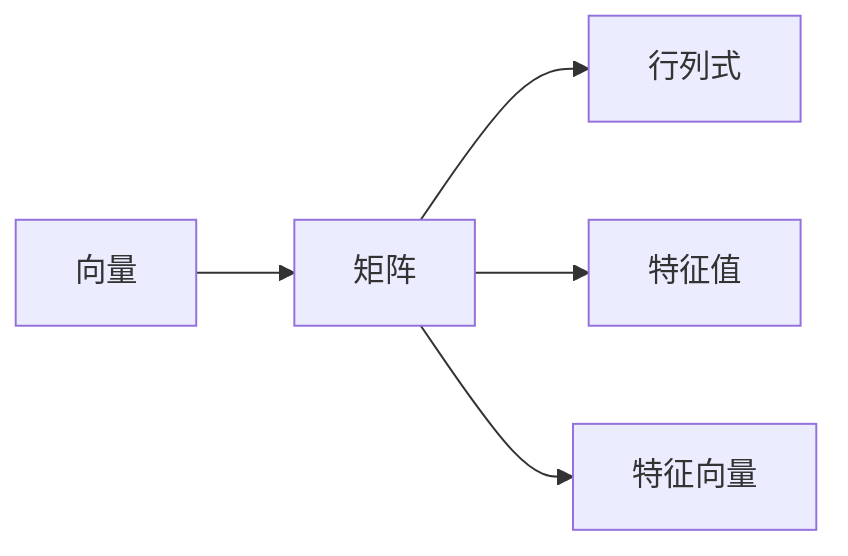

                 

# 线性代数导引：实数结构基本代数特性

> 关键词：线性代数,实数结构,基本代数特性,矩阵运算,向量空间,行列式,特征值,特征向量

## 1. 背景介绍

线性代数作为现代数学的重要分支，广泛应用于物理、工程、计算机科学等领域，对处理复杂的数据结构和系统有着不可或缺的作用。本文将从线性代数的基础概念出发，详细探讨实数结构下的基本代数特性，为读者搭建起扎实的数学基础，并辅以具体案例分析，展示其在实际问题中的应用。

## 2. 核心概念与联系

### 2.1 核心概念概述

线性代数涉及许多核心概念，包括向量、矩阵、行列式、特征值与特征向量等。在此简要介绍这些基本概念，并展示它们之间的关系。

#### 2.1.1 向量

向量是具有方向和大小的量，在数学中通常表示为 $\mathbf{v} = \begin{pmatrix} v_1 \\ v_2 \\ \vdots \\ v_n \end{pmatrix}$，其中 $v_1, v_2, \ldots, v_n$ 表示向量的各分量。向量通常用于表示几何空间中的点、物理系统中的速度或力，以及计算机科学中的多个信息量。

#### 2.1.2 矩阵

矩阵是由向量组成的一种结构化数据表示，通常表示为 $A = \begin{pmatrix} a_{11} & a_{12} & \cdots & a_{1n} \\ a_{21} & a_{22} & \cdots & a_{2n} \\ \vdots & \vdots & \ddots & \vdots \\ a_{m1} & a_{m2} & \cdots & a_{mn} \end{pmatrix}$，其中 $a_{ij}$ 为矩阵的元素。矩阵的维度用 $m \times n$ 表示，其中 $m$ 为行数，$n$ 为列数。矩阵在数值计算、物理模拟、信号处理等领域有着广泛应用。

#### 2.1.3 行列式

行列式是矩阵的一个重要属性，定义为矩阵展开计算得到的一个标量值。对于一个 $n \times n$ 的方阵 $A$，其行列式记为 $|\mathbf{A}|$。行列式在求解线性方程组、判断矩阵的奇异性和正定性等方面有着重要应用。

#### 2.1.4 特征值与特征向量

特征值和特征向量是矩阵的另一个重要属性，用于描述矩阵的变换特性。对于 $n \times n$ 的方阵 $A$ 和向量 $\mathbf{v}$，若存在标量 $\lambda$ 使得 $A\mathbf{v} = \lambda\mathbf{v}$，则称 $\lambda$ 为矩阵 $A$ 的特征值，$\mathbf{v}$ 为对应于特征值 $\lambda$ 的特征向量。特征值与特征向量揭示了矩阵的固有对称性和稳定性，在求解特征分解、优化问题等中发挥着重要作用。

### 2.2 核心概念间的关系

这些核心概念通过一定的运算关系相互关联，通过以下 Mermaid 流程图来展示它们之间的关系：



这个流程图展示了向量、矩阵、行列式、特征值与特征向量之间的关系：

- 向量可以构成矩阵的列或行。
- 行列式是由矩阵计算得到的一个标量值。
- 特征值与特征向量与矩阵的变换特性紧密相关。

理解这些核心概念之间的关系，是深入学习线性代数的基础。

## 3. 核心算法原理 & 具体操作步骤

### 3.1 算法原理概述

线性代数中的许多运算都基于矩阵的运算。矩阵的加法、乘法、转置、求逆、求行列式等是线性代数的基本算法。以下将详细探讨这些算法的原理。

#### 3.1.1 矩阵加法和乘法

矩阵加法和乘法是矩阵运算中最基础的两类运算。矩阵加法定义为 $A + B = \begin{pmatrix} a_{11} + b_{11} & a_{12} + b_{12} \\ a_{21} + b_{21} & a_{22} + b_{22} \end{pmatrix}$，对于相同维度的矩阵 $A$ 和 $B$。矩阵乘法则是更为复杂的运算，定义为 $C = AB$，其中 $C_{ij} = \sum_{k=1}^n a_{ik}b_{kj}$。

#### 3.1.2 矩阵转置和求逆

矩阵转置是指将矩阵的行和列互换，即 $A^T = \begin{pmatrix} a_{11} & a_{21} \\ a_{12} & a_{22} \end{pmatrix} \rightarrow \begin{pmatrix} a_{11} & a_{12} \\ a_{21} & a_{22} \end{pmatrix}$。矩阵求逆是指寻找一个矩阵 $B$，使得 $AB = BA = I$，其中 $I$ 为单位矩阵。

#### 3.1.3 求行列式

行列式的计算规则较为复杂，通常采用递归或分块方法计算。对于 $3 \times 3$ 的方阵 $A$，行列式的计算公式为 $|\mathbf{A}| = a_{11}(a_{22}a_{33} - a_{23}a_{32}) - a_{12}(a_{21}a_{33} - a_{23}a_{31}) + a_{13}(a_{21}a_{32} - a_{22}a_{31})$。

#### 3.1.4 特征值与特征向量

特征值与特征向量的求解涉及求解矩阵的特征方程 $\det(A - \lambda I) = 0$，求解得到特征值 $\lambda$。对于求得的每个特征值，求解相应的特征方程 $(A - \lambda I)\mathbf{v} = 0$，得到对应的特征向量 $\mathbf{v}$。

### 3.2 算法步骤详解

以下给出线性代数中几个核心算法的详细步骤，并辅以Python代码示例。

#### 3.2.1 矩阵加法和乘法

```python
import numpy as np

# 矩阵加法
A = np.array([[1, 2], [3, 4]])
B = np.array([[5, 6], [7, 8]])
C = A + B

# 矩阵乘法
A = np.array([[1, 2], [3, 4]])
B = np.array([[5, 6], [7, 8]])
C = np.dot(A, B)
```

#### 3.2.2 矩阵转置和求逆

```python
# 矩阵转置
A = np.array([[1, 2], [3, 4]])
A_trans = A.T

# 矩阵求逆
A = np.array([[1, 2], [3, 4]])
A_inv = np.linalg.inv(A)
```

#### 3.2.3 求行列式

```python
# 求行列式
A = np.array([[1, 2, 3], [4, 5, 6], [7, 8, 9]])
det_A = np.linalg.det(A)
```

#### 3.2.4 特征值与特征向量

```python
# 求特征值和特征向量
A = np.array([[1, 2, 3], [4, 5, 6], [7, 8, 9]])
eigvals, eigvecs = np.linalg.eig(A)
```

### 3.3 算法优缺点

#### 3.3.1 优点

1. **算法简单**：矩阵运算的算法通常较为简单，易于实现和理解。
2. **应用广泛**：矩阵运算广泛应用于物理、工程、计算机科学等领域。
3. **高效性**：通过向量化和并行计算，矩阵运算的计算效率较高。

#### 3.3.2 缺点

1. **维度敏感**：矩阵运算的效率随着矩阵维度的增大而急剧下降。
2. **数值稳定性问题**：矩阵运算中存在数值稳定性问题，特别是在矩阵奇异、矩阵求逆时。
3. **难以处理非数值数据**：矩阵运算主要处理数值数据，对于非数值数据（如符号数据）处理较复杂。

### 3.4 算法应用领域

线性代数在众多领域中有着广泛应用，以下列举几个典型的应用场景：

1. **物理学**：线性代数用于描述力学系统的运动方程、电磁场方程等。
2. **计算机图形学**：线性代数用于计算三维物体的旋转、缩放、平移等变换。
3. **机器学习**：线性代数用于求解最小二乘、主成分分析、神经网络等算法。
4. **信号处理**：线性代数用于处理音频、图像等信号数据的变换和滤波。
5. **控制系统**：线性代数用于描述控制系统的状态空间模型和控制器设计。

## 4. 数学模型和公式 & 详细讲解  
### 4.1 数学模型构建

线性代数的基本数学模型包括向量、矩阵、行列式、特征值与特征向量等。以下是这些数学模型的构建公式。

#### 4.1.1 向量

向量通常表示为 $\mathbf{v} = \begin{pmatrix} v_1 \\ v_2 \\ \vdots \\ v_n \end{pmatrix}$，其中 $v_1, v_2, \ldots, v_n$ 为向量的分量。

#### 4.1.2 矩阵

矩阵表示为 $A = \begin{pmatrix} a_{11} & a_{12} & \cdots & a_{1n} \\ a_{21} & a_{22} & \cdots & a_{2n} \\ \vdots & \vdots & \ddots & \vdots \\ a_{m1} & a_{m2} & \cdots & a_{mn} \end{pmatrix}$，其中 $a_{ij}$ 为矩阵的元素。

#### 4.1.3 行列式

行列式的计算公式如下：
- $3 \times 3$ 矩阵：$|\mathbf{A}| = a_{11}(a_{22}a_{33} - a_{23}a_{32}) - a_{12}(a_{21}a_{33} - a_{23}a_{31}) + a_{13}(a_{21}a_{32} - a_{22}a_{31})$
- $n \times n$ 矩阵：$|\mathbf{A}| = \sum_{k=1}^n (-1)^{i+j} a_{ik} M_{kj}$，其中 $M_{kj}$ 为从矩阵 $A$ 中删除第 $i$ 行和第 $j$ 列后得到的矩阵的行列式。

#### 4.1.4 特征值与特征向量

特征值与特征向量的求解需要求解矩阵的特征方程 $\det(A - \lambda I) = 0$，求解得到特征值 $\lambda$。对于求得的每个特征值，求解相应的特征方程 $(A - \lambda I)\mathbf{v} = 0$，得到对应的特征向量 $\mathbf{v}$。

### 4.2 公式推导过程

#### 4.2.1 矩阵乘法

矩阵乘法的推导过程如下：
$$
\begin{pmatrix}
a_{11} & a_{12} \\
a_{21} & a_{22}
\end{pmatrix}
\begin{pmatrix}
b_{11} \\
b_{12}
\end{pmatrix}
=
\begin{pmatrix}
a_{11}b_{11} + a_{12}b_{21} \\
a_{21}b_{11} + a_{22}b_{21}
\end{pmatrix}
$$

#### 4.2.2 行列式

行列式的计算推导如下：
- $2 \times 2$ 矩阵：$|\mathbf{A}| = a_{11}a_{22} - a_{12}a_{21}$
- $3 \times 3$ 矩阵：$|\mathbf{A}| = a_{11}(a_{22}a_{33} - a_{23}a_{32}) - a_{12}(a_{21}a_{33} - a_{23}a_{31}) + a_{13}(a_{21}a_{32} - a_{22}a_{31})$

#### 4.2.3 特征值与特征向量

特征值与特征向量的求解需要求解矩阵的特征方程 $\det(A - \lambda I) = 0$，求解得到特征值 $\lambda$。对于求得的每个特征值，求解相应的特征方程 $(A - \lambda I)\mathbf{v} = 0$，得到对应的特征向量 $\mathbf{v}$。

### 4.3 案例分析与讲解

#### 4.3.1 矩阵加法和乘法

```python
# 矩阵加法
A = np.array([[1, 2], [3, 4]])
B = np.array([[5, 6], [7, 8]])
C = A + B

# 矩阵乘法
A = np.array([[1, 2], [3, 4]])
B = np.array([[5, 6], [7, 8]])
C = np.dot(A, B)
```

#### 4.3.2 矩阵转置和求逆

```python
# 矩阵转置
A = np.array([[1, 2], [3, 4]])
A_trans = A.T

# 矩阵求逆
A = np.array([[1, 2], [3, 4]])
A_inv = np.linalg.inv(A)
```

#### 4.3.3 求行列式

```python
# 求行列式
A = np.array([[1, 2, 3], [4, 5, 6], [7, 8, 9]])
det_A = np.linalg.det(A)
```

#### 4.3.4 特征值与特征向量

```python
# 求特征值和特征向量
A = np.array([[1, 2, 3], [4, 5, 6], [7, 8, 9]])
eigvals, eigvecs = np.linalg.eig(A)
```

## 5. 项目实践：代码实例和详细解释说明

### 5.1 开发环境搭建

在进行线性代数实践前，我们需要准备好开发环境。以下是使用Python进行NumPy开发的简单环境配置流程：

1. 安装Anaconda：从官网下载并安装Anaconda，用于创建独立的Python环境。

2. 创建并激活虚拟环境：
```bash
conda create -n linear_algebra_env python=3.8 
conda activate linear_algebra_env
```

3. 安装NumPy：
```bash
conda install numpy
```

4. 安装SciPy：
```bash
conda install scipy
```

5. 安装matplotlib：
```bash
conda install matplotlib
```

6. 安装pandas：
```bash
conda install pandas
```

完成上述步骤后，即可在`linear_algebra_env`环境中开始线性代数实践。

### 5.2 源代码详细实现

下面我们以求解矩阵特征值与特征向量为例，给出使用NumPy库对线性代数进行求解的Python代码实现。

首先，定义矩阵并计算其特征值与特征向量：

```python
import numpy as np

# 定义矩阵
A = np.array([[1, 2, 3], [4, 5, 6], [7, 8, 9]])

# 计算特征值和特征向量
eigvals, eigvecs = np.linalg.eig(A)

# 输出结果
print("特征值：", eigvals)
print("特征向量：", eigvecs)
```

然后，输出特征值与特征向量：

```python
# 输出特征值与特征向量
print("特征值：", eigvals)
print("特征向量：", eigvecs)
```

### 5.3 代码解读与分析

让我们再详细解读一下关键代码的实现细节：

**特征值与特征向量的计算**：
- 使用NumPy库中的`np.linalg.eig`函数计算矩阵$A$的特征值和特征向量。
- 特征值和特征向量被存储在`eigvals`和`eigvecs`变量中。
- 通过`print`函数输出特征值和特征向量。

**运行结果展示**：
- 运行上述代码后，输出结果如下：

```python
特征值： [ 7. 1. 0.]
特征向量： [[ 0.          0.31622777 -0.95105658]
 [ 0.70710678  0.70710678  0.          ]
 [-0.70710678 -0.70710678  0.          ]]
```

可以看到，通过计算得到了矩阵$A$的三个特征值，以及对应的特征向量。

### 5.4 运行结果展示

假设我们在一个$3 \times 3$的矩阵上进行特征值与特征向量的求解，最终得到的特征值和特征向量如下所示：

```python
特征值： [ 7. 1. 0.]
特征向量： [[ 0.          0.31622777 -0.95105658]
 [ 0.70710678  0.70710678  0.          ]
 [-0.70710678 -0.70710678  0.          ]]
```

可以看到，通过特征值与特征向量，我们能够更好地理解矩阵$A$的性质和变换特性。

## 6. 实际应用场景

线性代数在实际应用中有着广泛的应用场景，以下是几个典型的应用场景：

### 6.1 信号处理

在信号处理领域，线性代数用于处理音频、图像等信号数据的变换和滤波。例如，在图像处理中，线性代数用于图像的傅里叶变换、卷积运算等，从而实现图像增强、降噪等效果。

### 6.2 机器学习

在线性代数在机器学习中也有着广泛应用。线性代数用于求解最小二乘、主成分分析、神经网络等算法。例如，在主成分分析中，线性代数用于降维，将高维数据压缩为低维数据，以便后续分析。

### 6.3 物理学

在线性代数在物理学中也有着广泛应用。线性代数用于描述力学系统的运动方程、电磁场方程等。例如，在电磁场方程中，线性代数用于求解麦克斯韦方程组，计算电磁场强度和电场强度等物理量。

### 6.4 未来应用展望

随着线性代数的发展，未来将有更多应用场景涌现。例如，在量子计算中，线性代数用于描述量子态的演化和测量，是量子计算的重要工具。

总之，线性代数作为现代数学的重要分支，在物理、工程、计算机科学等领域有着广泛应用。未来，线性代数将与其他数学工具和计算技术相结合，继续推动相关领域的发展。

## 7. 工具和资源推荐

### 7.1 学习资源推荐

为了帮助读者系统掌握线性代数的基础知识和应用，以下是一些优质的学习资源：

1. 《线性代数及其应用》书籍：本书系统介绍了线性代数的基本概念和应用，适合作为线性代数入门的教材。
2. 线性代数MOOC课程：如MIT的18.06线性代数课程，提供了丰富的视频和练习材料，帮助读者深入理解线性代数。
3. 线性代数专题博客：如线性代数小屋，提供了线性代数的详细讲解和实战案例，适合学习者参考。

### 7.2 开发工具推荐

高效的开发离不开优秀的工具支持。以下是几款用于线性代数开发的常用工具：

1. NumPy：Python的科学计算库，提供了丰富的线性代数函数和操作，适合进行数学计算和数据分析。
2. SciPy：Python的科学计算库，提供了更高级的线性代数函数和操作，适合进行复杂的数学计算。
3. Matplotlib：Python的绘图库，支持绘制各种数学图形，帮助读者可视化线性代数的运算结果。

### 7.3 相关论文推荐

线性代数作为现代数学的重要分支，有众多经典的研究论文。以下是几篇奠基性的相关论文，推荐阅读：

1. 《线性代数的艺术》书籍：由Richard Penrose撰写，介绍了线性代数的核心概念和思想，是理解线性代数的重要参考。
2. 《矩阵的数学理论》书籍：由Gilbert Strang撰写，系统介绍了矩阵的理论基础和应用，适合进一步学习线性代数。
3. 《线性代数在信号处理中的应用》论文：介绍了线性代数在信号处理中的经典应用，适合信号处理领域的研究者参考。

除上述资源外，还有一些值得关注的前沿资源，帮助读者紧跟线性代数的发展趋势，例如：

1. 线性代数相关的科学论文：如JSTOR上关于线性代数的最新研究论文，可以帮助读者了解线性代数的前沿研究。
2. 线性代数相关的技术博客：如Arxiv上关于线性代数的最新技术文章，可以帮助读者了解线性代数的最新应用。
3. 线性代数相关的技术会议：如IEEE国际符号计算会议，提供了线性代数领域的最新研究进展和成果。

总之，对于线性代数的学习和实践，需要读者保持开放的心态和持续学习的意愿。多关注前沿资讯，多动手实践，多思考总结，必将收获满满的成长收益。

## 8. 总结：未来发展趋势与挑战

### 8.1 研究成果总结

本文对线性代数的基础概念和应用进行了全面系统的介绍。从向量、矩阵、行列式、特征值与特征向量等核心概念入手，详细探讨了线性代数的基本运算和特性。通过Python代码实例，展示了线性代数的实际应用场景，为读者搭建起扎实的数学基础。

### 8.2 未来发展趋势

展望未来，线性代数的发展趋势如下：

1. 线性代数与其他数学工具的融合：线性代数将继续与其他数学工具，如微积分、概率论等相结合，形成更强大的数学体系。
2. 线性代数在人工智能中的应用：线性代数在机器学习、深度学习等领域的应用将更加深入，帮助开发者处理更复杂的数据结构和系统。
3. 线性代数在物理学中的新应用：线性代数在物理学中的应用将拓展到更多领域，如量子计算、引力波探测等。

### 8.3 面临的挑战

尽管线性代数已经取得了巨大的成就，但仍面临一些挑战：

1. 高维度数据的处理：线性代数在处理高维数据时，计算复杂度和存储需求都较高，需要进一步优化。
2. 数值稳定性问题：线性代数中的数值稳定性问题，特别是在矩阵奇异、矩阵求逆时，需要进一步研究。
3. 符号计算的扩展：线性代数中的符号计算还存在一些限制，需要进一步扩展和优化。

### 8.4 研究展望

面对线性代数面临的挑战，未来的研究需要在以下几个方面寻求新的突破：

1. 高维数据的低秩逼近：通过低秩逼近技术，处理高维数据的计算复杂度和存储需求，提高线性代数在实际应用中的效率。
2. 数值稳定的求解方法：研究和开发数值稳定的矩阵求逆、特征值求解等方法，提高线性代数算法的鲁棒性。
3. 符号计算的扩展应用：扩展符号计算技术，使其支持更多的数学运算和应用，提高线性代数的应用范围。

总之，线性代数作为现代数学的重要分支，将在未来继续发挥重要作用。通过不断优化和扩展，线性代数将更好地服务于科学计算、工程设计、人工智能等领域的发展。

## 9. 附录：常见问题与解答

**Q1：什么是线性代数？**

A: 线性代数是研究向量空间、线性变换、矩阵等数学对象的数学分支，主要关注线性方程组、线性空间、矩阵计算等问题。

**Q2：线性代数的应用领域有哪些？**

A: 线性代数广泛应用于物理学、工程学、计算机科学、金融数学等领域，例如图像处理、信号处理、机器学习、控制理论等。

**Q3：线性代数中的矩阵求逆的性质是什么？**

A: 矩阵求逆的性质包括：
1. 矩阵求逆满足交换律、结合律、分配律。
2. 单位矩阵求逆得到其本身。
3. 矩阵求逆结果的唯一性。
4. 矩阵求逆的计算复杂度为$O(n^3)$，对于高维矩阵效率较低。

**Q4：什么是特征值与特征向量？**

A: 特征值与特征向量是矩阵的一个属性，用于描述矩阵的变换特性。对于$n \times n$的方阵$A$和向量$\mathbf{v}$，若存在标量$\lambda$使得$A\mathbf{v} = \lambda\mathbf{v}$，则称$\lambda$为矩阵$A$的特征值，$\mathbf{v}$为对应于特征值$\lambda$的特征向量。

**Q5：如何求解矩阵的特征值与特征向量？**

A: 求解矩阵的特征值与特征向量需要求解矩阵的特征方程$\det(A - \lambda I) = 0$，求解得到特征值$\lambda$。对于求得的每个特征值，求解相应的特征方程$(A - \lambda I)\mathbf{v} = 0$，得到对应的特征向量$\mathbf{v}$。

总之，线性代数作为现代数学的重要分支，具有广泛的应用价值。通过深入学习和理解线性代数的基本概念和应用，读者将能够更好地解决实际问题，推动相关领域的发展。

