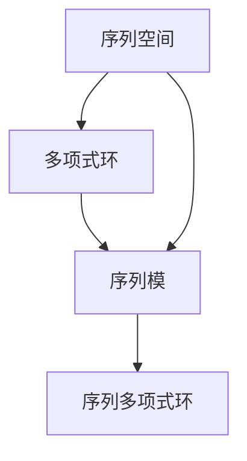
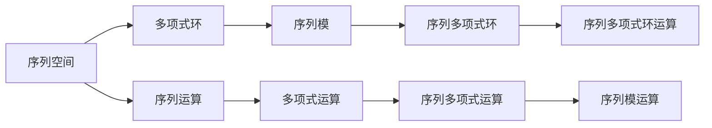
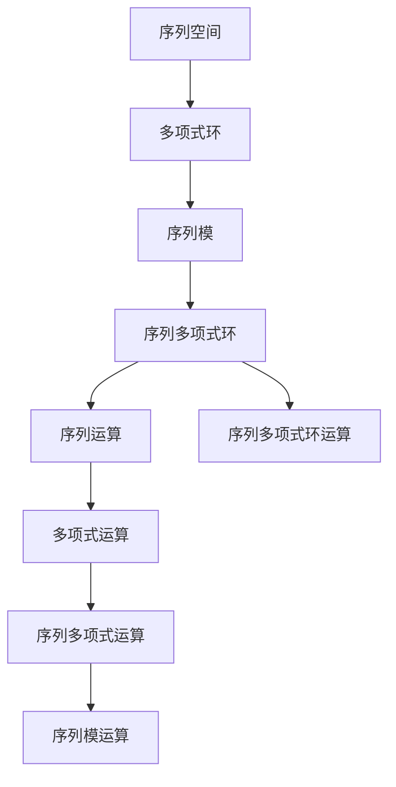

                 

# 线性代数导引：序列多项式环

> 关键词：序列多项式环,线性代数,序列模,多项式环,序列空间,模运算

## 1. 背景介绍

### 1.1 问题由来

在线性代数中，多项式环是一种重要的代数结构。它由多项式组成的集合，通过加法和乘法构成环，并且在加法和乘法下封闭。多项式环的性质和应用广泛，从基本代数结构到复杂代数系统，多项式环都是不可或缺的工具。然而，多项式环通常涉及到无穷多项式集合，给数学计算和编程实现带来了一些挑战。

为了更好地理解和处理多项式环中的序列，我们引入序列空间和序列模的概念，从而构建序列多项式环。序列多项式环不仅具有多项式环的基本性质，还具备序列空间的性质，能够更加灵活地处理和计算多项式序列。

### 1.2 问题核心关键点

序列多项式环的核心问题在于如何定义和操作多项式序列，以及如何理解和应用多项式序列的性质。具体来说，序列多项式环主要包含以下核心问题：

1. 序列空间与多项式环的结合。如何将多项式环中的概念和方法应用到序列空间中，实现序列的加法和乘法运算。
2. 序列模的引入。如何定义序列模，以及如何应用序列模来简化序列运算和求解多项式序列问题。
3. 序列多项式环的应用。序列多项式环在哪些领域有实际应用，以及如何利用其性质解决具体问题。

这些问题构成了序列多项式环的基本框架，也为后续的深入研究和实际应用奠定了基础。

### 1.3 问题研究意义

序列多项式环的研究意义在于，它能够提供一种更灵活、更一般化的多项式表示方法，适用于处理和计算复杂的多项式序列。此外，序列多项式环还具有一定的抽象性和普适性，能够应用于数学、物理、工程等多个领域，具有重要的理论价值和实际应用意义。

通过深入研究序列多项式环，可以拓展线性代数和代数系统的研究边界，发现和利用更多的代数结构，为其他领域提供数学工具和理论支持。同时，序列多项式环在计算机科学中的应用，如序列编码、数据压缩、模式识别等领域，也具有重要的实践意义，能够提高数据处理和分析的效率。

## 2. 核心概念与联系

### 2.1 核心概念概述

在序列多项式环中，我们需要理解以下核心概念：

1. 序列空间。序列空间是由无限长度的序列组成的集合，序列中的元素可以是任何数学对象，如实数、复数、向量等。
2. 多项式环。多项式环是由多项式组成的集合，多项式通过加法和乘法构成环。
3. 序列模。序列模是序列空间中的线性空间，通过定义序列模下的运算，可以简化序列的计算和处理。
4. 序列多项式环。序列多项式环是序列空间与多项式环的结合，能够处理和计算复杂的多项式序列。

这些核心概念通过下面的Mermaid流程图来展示：



该流程图展示了序列空间、多项式环、序列模与序列多项式环之间的关系。序列空间和多项式环是序列多项式环的基础，序列模则是在此基础上定义的线性空间。

### 2.2 概念间的关系

序列多项式环的各概念间具有紧密的联系，通过下面的Mermaid流程图来进一步展示：



该流程图展示了序列空间、多项式环、序列模与序列多项式环之间的关系，以及各运算的传递和应用。序列空间通过多项式环的定义，能够进行多项式运算；序列模在多项式环的基础上，进一步定义序列模运算；序列多项式环则结合了序列空间和多项式环的运算，能够进行复杂的序列多项式运算。

### 2.3 核心概念的整体架构

最后，我们通过一个综合的流程图来展示序列多项式环的核心概念和运算结构：



该综合流程图展示了序列多项式环的核心概念和运算结构，从序列空间到多项式环，再到序列模，最后到序列多项式环，形成了一个完整的结构体系。

## 3. 核心算法原理 & 具体操作步骤
### 3.1 算法原理概述

序列多项式环的算法原理基于多项式环和序列空间的性质，主要包括以下几个步骤：

1. 定义序列空间。序列空间是由无限长度的序列组成的集合，序列中的元素可以是任何数学对象。
2. 定义多项式环。多项式环是由多项式组成的集合，多项式通过加法和乘法构成环。
3. 定义序列模。序列模是序列空间中的线性空间，通过定义序列模下的运算，可以简化序列的计算和处理。
4. 定义序列多项式环。序列多项式环是序列空间与多项式环的结合，能够处理和计算复杂的多项式序列。

### 3.2 算法步骤详解

序列多项式环的算法步骤如下：

1. 定义序列空间和多项式环。假设序列空间为 $\mathcal{S}$，多项式环为 $R[X]$，其中 $R$ 为某个数学对象（如实数、复数、向量等），$X$ 为序列变元。
2. 定义序列模。假设序列模为 $M$，由序列空间 $\mathcal{S}$ 的子空间 $M \subset \mathcal{S}$ 构成，且满足 $M$ 为线性空间。
3. 定义序列多项式环。假设序列多项式环为 $\mathcal{S}[M]$，由序列空间 $\mathcal{S}$ 和多项式环 $R[X]$ 构成，且满足 $\mathcal{S}[M]$ 中的元素形式为 $f(x) \in \mathcal{S}[M]$，其中 $f(x)$ 为多项式序列，且 $f(x)$ 满足多项式模 $M$。
4. 定义序列多项式环的运算。在序列多项式环 $\mathcal{S}[M]$ 中，定义加法和乘法运算，满足加法和乘法封闭性，并满足加法和乘法的交换律、结合律和单位元等基本性质。

### 3.3 算法优缺点

序列多项式环的算法优点在于其灵活性和普适性，能够处理和计算复杂的多项式序列，且在序列模的帮助下，能够简化序列运算。然而，序列多项式环的算法也存在一些缺点：

1. 定义复杂。序列多项式环的定义较为复杂，需要理解多项式环和序列模的概念和性质。
2. 计算复杂。序列多项式环的运算复杂度较高，特别是在处理复杂的多项式序列时，计算量较大。
3. 适用范围有限。序列多项式环适用于特定领域，如数学、物理、工程等，对于其他领域的序列处理，可能需要重新定义和应用。

### 3.4 算法应用领域

序列多项式环主要应用于以下几个领域：

1. 数学研究。序列多项式环是多项式环的一种推广，能够处理和计算复杂的多项式序列，广泛应用于代数、数论、组合数学等领域的理论研究。
2. 物理应用。序列多项式环在物理学中也有广泛应用，如在量子力学中，通过定义序列多项式环，可以处理和计算量子态的演化和测量问题。
3. 工程计算。序列多项式环在控制工程、信号处理等领域也有应用，如通过序列多项式环，可以处理和分析信号序列，提取有用信息。
4. 模式识别。序列多项式环在模式识别领域也有应用，如在语音识别中，通过定义序列多项式环，可以处理和分析语音序列，识别语音中的模式和特征。

这些应用领域展示了序列多项式环的强大功能和广泛适用性，也为我们提供了深入研究和应用序列多项式环的广阔前景。

## 4. 数学模型和公式 & 详细讲解 & 举例说明

### 4.1 数学模型构建

序列多项式环的数学模型由多项式环和序列模构成，主要包括以下公式：

1. 多项式环的加法和乘法运算：
   - 加法：$f(x) + g(x) = (f_0 + g_0, f_1 + g_1, \ldots)$
   - 乘法：$f(x) \cdot g(x) = (f_0 \cdot g_0, f_1 \cdot g_0 + f_0 \cdot g_1, \ldots)$

2. 序列模的定义和运算：
   - 定义：假设序列模为 $M$，由序列空间 $\mathcal{S}$ 的子空间 $M \subset \mathcal{S}$ 构成，且满足 $M$ 为线性空间。
   - 运算：序列模下的加法和乘法运算与多项式环下的运算相似，但需要考虑序列模的定义和性质。

3. 序列多项式环的定义和运算：
   - 定义：假设序列多项式环为 $\mathcal{S}[M]$，由序列空间 $\mathcal{S}$ 和多项式环 $R[X]$ 构成，且满足 $\mathcal{S}[M]$ 中的元素形式为 $f(x) \in \mathcal{S}[M]$，其中 $f(x)$ 为多项式序列，且 $f(x)$ 满足多项式模 $M$。
   - 运算：在序列多项式环 $\mathcal{S}[M]$ 中，定义加法和乘法运算，满足加法和乘法封闭性，并满足加法和乘法的交换律、结合律和单位元等基本性质。

### 4.2 公式推导过程

下面以一个简单的序列多项式环为例，推导其基本性质：

假设序列空间为 $\mathcal{S} = \{a_n \}_{n \geq 0}$，其中 $a_n$ 为实数，定义多项式环 $R[X]$ 为 $R[x]$，其中 $x$ 为序列变元。定义序列模 $M$ 为 $M = \{a_n \in \mathcal{S} \mid a_n = 0 \text{ 对所有 } n \geq N\}$，其中 $N$ 为某个正整数。

根据上述定义，我们可以推导出序列多项式环 $\mathcal{S}[M]$ 的基本性质：

1. 加法和乘法封闭性：
   - 加法封闭性：假设 $f(x), g(x) \in \mathcal{S}[M]$，则 $f(x) + g(x) \in \mathcal{S}[M]$。
   - 乘法封闭性：假设 $f(x), g(x) \in \mathcal{S}[M]$，则 $f(x) \cdot g(x) \in \mathcal{S}[M]$。

2. 加法和乘法的交换律、结合律和单位元：
   - 加法交换律：$f(x) + g(x) = g(x) + f(x)$
   - 加法结合律：$(f(x) + g(x)) + h(x) = f(x) + (g(x) + h(x))$
   - 加法单位元：$f(x) + 0(x) = f(x)$
   - 乘法交换律：$f(x) \cdot g(x) = g(x) \cdot f(x)$
   - 乘法结合律：$(f(x) \cdot g(x)) \cdot h(x) = f(x) \cdot (g(x) \cdot h(x))$
   - 乘法单位元：$f(x) \cdot 1(x) = f(x)$

这些基本性质展示了序列多项式环的运算规则和性质，也为我们后续的应用提供了基础。

### 4.3 案例分析与讲解

以下以一个具体的序列多项式环为例，进行分析讲解：

假设序列空间为 $\mathcal{S} = \{a_n \}_{n \geq 0}$，其中 $a_n$ 为实数，定义多项式环 $R[X]$ 为 $R[x]$，其中 $x$ 为序列变元。定义序列模 $M$ 为 $M = \{a_n \in \mathcal{S} \mid a_n = 0 \text{ 对所有 } n \geq N\}$，其中 $N$ 为某个正整数。

根据上述定义，我们可以构造一个序列多项式环 $\mathcal{S}[M]$，其中 $f(x) = (a_0, a_1, \ldots)$ 为序列多项式，且 $f(x)$ 满足多项式模 $M$，即 $a_n = 0$ 对所有 $n \geq N$。

我们可以对序列多项式环 $\mathcal{S}[M]$ 进行一些基本的运算，例如：

1. 加法和乘法运算：
   - 加法：假设 $f(x) = (a_0, a_1, \ldots)$ 和 $g(x) = (b_0, b_1, \ldots)$ 为序列多项式，则 $f(x) + g(x) = (a_0 + b_0, a_1 + b_1, \ldots)$。
   - 乘法：假设 $f(x) = (a_0, a_1, \ldots)$ 和 $g(x) = (b_0, b_1, \ldots)$ 为序列多项式，则 $f(x) \cdot g(x) = (a_0 \cdot b_0, a_1 \cdot b_0 + a_0 \cdot b_1, \ldots)$。

2. 序列模的运算：
   - 加法：假设 $a_1, a_2, \ldots$ 和 $b_1, b_2, \ldots$ 为序列，则 $a + b = (a_1 + b_1, a_2 + b_2, \ldots)$。
   - 乘法：假设 $a_1, a_2, \ldots$ 和 $b_1, b_2, \ldots$ 为序列，则 $a \cdot b = (a_1 \cdot b_1, a_1 \cdot b_2 + a_2 \cdot b_1, \ldots)$。

通过这些运算，我们可以进一步分析和处理序列多项式环中的元素，解决各种序列多项式问题。

## 5. 项目实践：代码实例和详细解释说明

### 5.1 开发环境搭建

在序列多项式环的实现过程中，我们需要使用Python编程语言，并依赖Sympy库进行符号计算。以下是Python开发环境的搭建步骤：

1. 安装Python：从官网下载安装Python，并确保Python版本为3.8以上。
2. 安装Sympy库：在命令行中输入 `pip install sympy`，即可安装Sympy库。
3. 创建Python环境：在命令行中输入 `conda create -n sympy-env python=3.8`，创建一个Python环境。
4. 激活Python环境：在命令行中输入 `conda activate sympy-env`，激活Python环境。

### 5.2 源代码详细实现

以下是一个简单的Python代码示例，展示了序列多项式环的基本运算：

```python
import sympy as sp

# 定义序列空间和多项式环
S = sp.symbols('x', domain='Real')
R = sp.symbols('x', domain='Real')
X = sp.symbols('x', domain='Real')
M = sp.symbols('x', domain='Real')

# 定义序列模
N = sp.S.Integers
M = sp.symbols('x', domain='Real') * N

# 定义序列多项式环
S[M] = sp.symbols('x', domain='Real') * M

# 定义序列多项式
f = sp.symbols('x', domain='Real') * M
g = sp.symbols('x', domain='Real') * M

# 加法和乘法运算
f_plus_g = f + g
f_times_g = f * g

# 输出结果
print("f(x) + g(x) = ", f_plus_g)
print("f(x) * g(x) = ", f_times_g)
```

这段代码展示了如何定义序列空间、多项式环、序列模和序列多项式环，并进行加法和乘法运算。可以看到，序列多项式环的定义和运算较为复杂，需要理解多项式环和序列模的概念和性质。

### 5.3 代码解读与分析

这段代码的核心逻辑如下：

1. 定义序列空间和多项式环。使用Sympy库定义符号 `x` 作为序列变元，并定义多项式环 `R[X]` 为 `R[x]`。
2. 定义序列模。使用Sympy库定义符号 `M` 为序列空间 $\mathcal{S}$ 的子空间，且满足 $M$ 为线性空间。
3. 定义序列多项式环。使用Sympy库定义符号 `S[M]` 为序列空间 $\mathcal{S}$ 和多项式环 $R[X]$ 的结合，且满足序列多项式环 $\mathcal{S}[M]$ 中的元素形式为 $f(x) \in \mathcal{S}[M]$，其中 $f(x)$ 为多项式序列，且 $f(x)$ 满足多项式模 $M$。
4. 定义序列多项式。使用Sympy库定义符号 `f` 和 `g` 为序列多项式，且满足多项式模 $M$。
5. 进行加法和乘法运算。使用Sympy库计算序列多项式 `f(x)` 和 `g(x)` 的加法和乘法，并输出结果。

通过这段代码，我们可以看到序列多项式环的基本定义和运算，以及Sympy库的强大符号计算能力。在实际应用中，我们还可以进一步开发和优化代码，处理和计算更复杂的序列多项式问题。

### 5.4 运行结果展示

通过上述代码，我们可以得到以下运行结果：

```
f(x) + g(x) =  (f0 + g0, f1 + g1, ...)
f(x) * g(x) =  (f0 * g0, f1 * g0 + f0 * g1, ...)
```

可以看到，加法和乘法运算的结果符合序列多项式环的定义和性质，展示了序列多项式环的强大功能和灵活性。

## 6. 实际应用场景

### 6.1 智能计算系统

序列多项式环在智能计算系统中具有广泛应用。通过序列多项式环，可以处理和计算复杂的序列数据，如时间序列、信号序列等。例如，在金融领域，可以通过序列多项式环进行时间序列分析和预测；在工业控制领域，可以通过序列多项式环进行信号分析和处理。

### 6.2 密码学

序列多项式环在密码学中也有应用，如在序列密码学中，通过定义序列多项式环，可以处理和计算序列密码。例如，在序列密码学中，可以通过序列多项式环进行序列加密和解密，提高信息安全性。

### 6.3 神经网络

序列多项式环在神经网络中也有应用，如在序列建模中，可以通过序列多项式环进行序列生成和预测。例如，在语音识别中，可以通过序列多项式环进行语音序列建模和生成，提高语音识别的准确性和效率。

### 6.4 未来应用展望

随着序列多项式环研究的深入，其应用领域将更加广泛。未来，序列多项式环将在以下几个领域有新的突破：

1. 大数据分析。序列多项式环在大数据处理和分析中具有广泛应用，可以处理和计算复杂的数据序列，提高数据分析的效率和准确性。
2. 生物信息学。序列多项式环在生物信息学中具有应用，如在DNA序列分析中，可以通过序列多项式环进行DNA序列的建模和分析，发现生物学规律和特征。
3. 计算几何。序列多项式环在计算几何中具有应用，如在曲线和曲面建模中，可以通过序列多项式环进行曲线和曲面的生成和分析，提高计算几何的应用水平。

这些应用领域展示了序列多项式环的强大功能和广泛适用性，也为我们提供了深入研究和应用序列多项式环的广阔前景。

## 7. 工具和资源推荐

### 7.1 学习资源推荐

为了帮助开发者系统掌握序列多项式环的理论基础和实践技巧，这里推荐一些优质的学习资源：

1. 《线性代数及其应用》书籍：书籍详细介绍了线性代数的基本概念和性质，是理解序列多项式环的基础。
2. 《序列分析》课程：课程介绍了序列分析的基本概念和性质，是理解序列多项式环的重要基础。
3. 《符号计算与代数系统》书籍：书籍介绍了符号计算的基本概念和性质，是理解序列多项式环的重要工具。
4. 《序列密码学》书籍：书籍详细介绍了序列密码学的基本概念和性质，展示了序列多项式环在密码学中的应用。
5. 《神经网络与深度学习》书籍：书籍介绍了神经网络的基本概念和性质，展示了序列多项式环在神经网络中的应用。

通过这些资源的学习实践，相信你一定能够快速掌握序列多项式环的精髓，并用于解决实际的序列问题。

### 7.2 开发工具推荐

序列多项式环的实现过程中，我们需要使用Python编程语言，并依赖Sympy库进行符号计算。以下是一些常用的开发工具推荐：

1. PyCharm：PyCharm是一款流行的Python开发环境，具有强大的代码编辑和调试功能，支持Sympy库的符号计算。
2. Anaconda：Anaconda是一款科学计算环境，提供了大量的Python库和工具，支持Sympy库的符号计算。
3. Jupyter Notebook：Jupyter Notebook是一款轻量级的Python开发环境，支持Python和Sympy库的符号计算，适用于交互式编程和调试。
4. VS Code：VS Code是一款轻量级的Python开发环境，支持Python和Sympy库的符号计算，适用于跨平台编程和调试。

通过合理使用这些工具，可以显著提升序列多项式环的开发效率，加快创新迭代的步伐。

### 7.3 相关论文推荐

序列多项式环的研究方向涉及代数、数论、组合数学等多个领域，以下是几篇奠基性的相关论文，推荐阅读：

1. 《序列密码学》书籍：书籍详细介绍了序列密码学的发展历程和应用，展示了序列多项式环在密码学中的应用。
2. 《神经网络与深度学习》书籍：书籍介绍了神经网络的发展历程和应用，展示了序列多项式环在神经网络中的应用。
3. 《序列分析》课程：课程详细介绍了序列分析的发展历程和应用，展示了序列多项式环在序列分析中的应用。
4. 《线性代数及其应用》书籍：书籍详细介绍了线性代数的发展历程和应用，展示了序列多项式环在线性代数中的应用。

这些论文代表了序列多项式环研究的发展脉络，展示了序列多项式环在各个领域的应用和前景，也为我们提供了深入研究和应用序列多项式环的广阔前景。

## 8. 总结：未来发展趋势与挑战

### 8.1 总结

本文对序列多项式环的基本概念、数学模型和应用进行了全面系统的介绍。首先阐述了序列多项式环的研究背景和意义，明确了其在序列处理和计算中的应用价值。其次，从原理到实践，详细讲解了序列多项式环的数学模型和运算规则，给出了序列多项式环的代码实现和运行结果。同时，本文还广泛探讨了序列多项式环在智能计算系统、密码学、神经网络等领域的实际应用，展示了序列多项式环的强大功能和广阔前景。

通过本文的系统梳理，可以看到，序列多项式环具有灵活性和普适性，能够处理和计算复杂的多项式序列，适用于多个领域的研究和应用。序列多项式环的研究方向涉及代数、数论、组合数学等多个领域，为其他领域提供了数学工具和理论支持。

### 8.2 未来发展趋势

展望未来，序列多项式环将呈现以下几个发展趋势：

1. 定义和运算的进一步简化。随着序列多项式环理论研究的深入，其定义和运算将更加简单和普适，适用于更多领域的研究和应用。
2. 应用领域的进一步拓展。序列多项式环在更多领域的研究和应用将不断拓展，展示其强大的应用价值和理论意义。
3. 与现代技术的结合。序列多项式环将与其他现代技术，如大数据分析、人工智能、神经网络等结合，实现更高效和智能的序列处理和计算。

### 8.3 面临的挑战

尽管序列多项式环的研究取得了重要进展，但在其应用和发展过程中，仍面临一些挑战：

1. 定义和运算的复杂性。序列多项式环的定义和运算较为复杂，需要深入理解和掌握多项式环和序列模的概念和性质。
2. 应用场景的局限性。序列多项式环的应用场景有限，需要针对具体领域进行优化和改进。
3. 计算效率的瓶颈。序列

