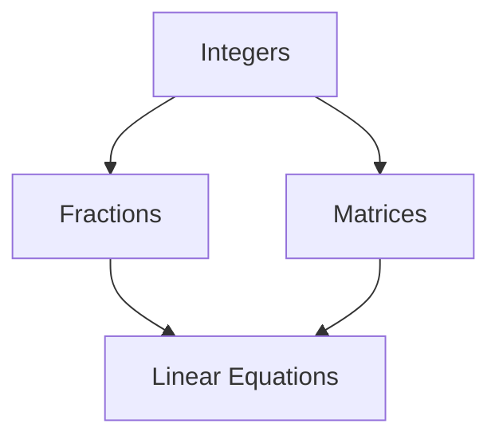
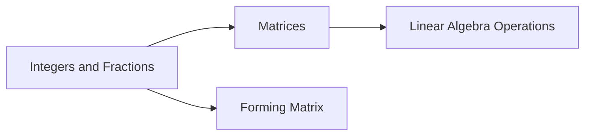
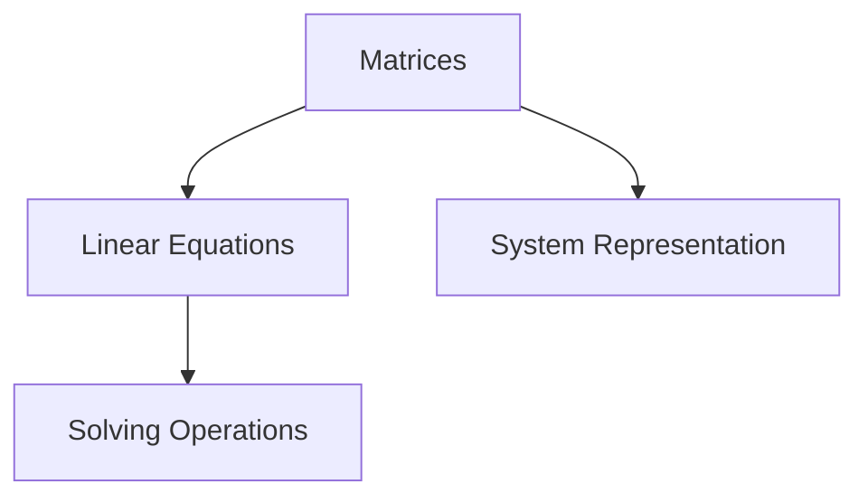
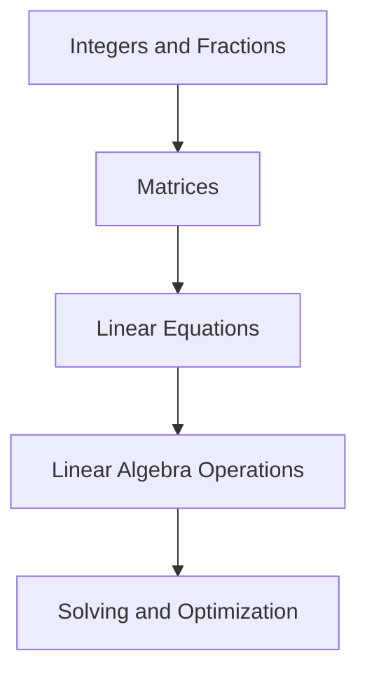

                 

# 线性代数导引：整数与分数

## 1. 背景介绍

### 1.1 问题由来
线性代数是计算机科学和数据科学中不可或缺的一部分，它提供了一种强大的数学工具来处理和分析数据。在计算机科学中，线性代数被广泛应用于机器学习、图形处理、信号处理、计算机视觉等领域。然而，线性代数中的整数与分数作为基本概念，其深度与广度令人瞩目。

### 1.2 问题核心关键点
整数与分数是线性代数中最基本也最重要的概念之一。它们不仅是线性代数的基础，也是计算机科学中许多算法和数据结构的核心。在机器学习中，整数与分数的应用尤为广泛，如在决策树中，决策节点的值通常是整数或分数。

### 1.3 问题研究意义
研究整数与分数在线性代数中的表现，对于更好地理解和应用线性代数，提升机器学习模型的性能，优化算法设计，具有重要的理论意义和实践价值。此外，对于学习计算机科学中的算法设计和数据结构，掌握整数与分数的基本概念和应用，也是不可或缺的。

## 2. 核心概念与联系

### 2.1 核心概念概述

为更好地理解整数与分数在线性代数中的表现，本节将介绍几个密切相关的核心概念：

- 整数(Integer)：表示非负整数的集合，即 $ \mathbb{N} = \{0, 1, 2, \ldots\} $。
- 分数(Fraction)：表示形如 $ \frac{a}{b} $ 的有理数，其中 $ a $ 和 $ b $ 均为整数。
- 矩阵(Matrix)：由数或符号按矩阵形式排成的规则排列的表格，如 $ A = \begin{bmatrix} 1 & 2 \\ 3 & 4 \end{bmatrix} $。
- 线性方程组(Linear Equation)：由多个线性方程组成的方程组，如 $ Ax = b $，其中 $ A $ 为系数矩阵，$ x $ 为变量向量，$ b $ 为常数向量。

这些核心概念之间的逻辑关系可以通过以下Mermaid流程图来展示：



这个流程图展示了大整数、分数、矩阵以及线性方程组之间的联系。整数和分数是构成矩阵的元素，而线性方程组则是由矩阵形式表达的。

### 2.2 概念间的关系

这些核心概念之间存在着紧密的联系，形成了线性代数的基本框架。下面我通过几个Mermaid流程图来展示这些概念之间的关系。

#### 2.2.1 整数与分数的矩阵表示



这个流程图展示了整数与分数在矩阵中的表示，以及通过矩阵形式进行线性代数操作的过程。

#### 2.2.2 矩阵与线性方程组的关系



这个流程图展示了矩阵如何表示线性方程组，以及如何通过矩阵操作来求解线性方程组。

### 2.3 核心概念的整体架构

最后，我们用一个综合的流程图来展示这些核心概念在线性代数中的整体架构：



这个综合流程图展示了整数与分数通过矩阵形式表示线性方程组，并通过对矩阵进行操作求解线性方程组，以及利用线性代数优化问题。

## 3. 核心算法原理 & 具体操作步骤
### 3.1 算法原理概述

整数与分数在线性代数中的表示与操作遵循特定的数学规则。这些规则包括矩阵的加法、乘法、逆矩阵、行列式等基本操作，以及如何将整数与分数转化为矩阵形式，以及如何通过矩阵操作求解线性方程组。

### 3.2 算法步骤详解

以下是整数与分数在线性代数中常见的算法步骤：

1. **矩阵构建**：根据整数与分数数据构建矩阵。
2. **矩阵运算**：进行矩阵的加、减、乘法运算。
3. **逆矩阵求解**：计算矩阵的逆矩阵，求解线性方程组。
4. **行列式计算**：计算矩阵的行列式，用于判断矩阵是否可逆。
5. **线性方程求解**：根据矩阵形式，求解线性方程组。

### 3.3 算法优缺点

整数与分数在线性代数中的算法具有以下优点：

- 矩阵运算具有可扩展性，适用于大规模数据。
- 矩阵表示形式简单直观，易于理解和实现。
- 矩阵操作在计算机中有高效的实现。

同时，这些算法也存在一些缺点：

- 矩阵运算可能导致数值不稳定，尤其是在处理大规模矩阵时。
- 矩阵的逆矩阵求解可能遇到非可逆矩阵的情况。
- 线性方程组的求解可能存在多个解或无解的情况。

### 3.4 算法应用领域

整数与分数在线性代数中的应用非常广泛，包括但不限于以下领域：

- 机器学习：决策树、随机森林、神经网络等模型中广泛使用整数与分数。
- 数据结构：哈希表、图论中的边权、树结构中的节点值等。
- 信号处理：数字信号处理中的离散傅里叶变换、线性滤波器等。
- 计算机视觉：图像处理中的像素值、矩阵形式的多维数据等。

这些领域中，整数与分数不仅作为数据形式存在，而且通过矩阵运算、线性方程组求解等线性代数工具，优化了算法的性能和效率。

## 4. 数学模型和公式 & 详细讲解  
### 4.1 数学模型构建

整数与分数在线性代数中的数学模型构建非常简单。以矩阵为例，一个 $ m \times n $ 的矩阵可以表示为：

$$ A = \begin{bmatrix} a_{11} & a_{12} & \cdots & a_{1n} \\ a_{21} & a_{22} & \cdots & a_{2n} \\ \vdots & \vdots & \ddots & \vdots \\ a_{m1} & a_{m2} & \cdots & a_{mn} \end{bmatrix} $$

其中，$ a_{ij} $ 表示矩阵 $ A $ 在 $ i $ 行 $ j $ 列的元素。

### 4.2 公式推导过程

以矩阵加法为例，两个矩阵 $ A $ 和 $ B $ 的加法定义为：

$$ C = A + B = \begin{bmatrix} c_{11} & c_{12} & \cdots & c_{1n} \\ c_{21} & c_{22} & \cdots & c_{2n} \\ \vdots & \vdots & \ddots & \vdots \\ c_{m1} & c_{m2} & \cdots & c_{mn} \end{bmatrix} = \begin{bmatrix} a_{11} + b_{11} & a_{12} + b_{12} & \cdots & a_{1n} + b_{1n} \\ a_{21} + b_{21} & a_{22} + b_{22} & \cdots & a_{2n} + b_{2n} \\ \vdots & \vdots & \ddots & \vdots \\ a_{m1} + b_{m1} & a_{m2} + b_{m2} & \cdots & a_{mn} + b_{mn} \end{bmatrix} $$

### 4.3 案例分析与讲解

假设有一个矩阵 $ A $ 和 $ B $：

$$ A = \begin{bmatrix} 1 & 2 \\ 3 & 4 \end{bmatrix}, B = \begin{bmatrix} 5 & 6 \\ 7 & 8 \end{bmatrix} $$

它们的和 $ C $ 为：

$$ C = A + B = \begin{bmatrix} 6 & 8 \\ 10 & 12 \end{bmatrix} $$

## 5. 项目实践：代码实例和详细解释说明
### 5.1 开发环境搭建

在进行项目实践前，我们需要准备好开发环境。以下是使用Python进行NumPy开发的环境配置流程：

1. 安装Anaconda：从官网下载并安装Anaconda，用于创建独立的Python环境。

2. 创建并激活虚拟环境：
```bash
conda create -n pythontest python=3.8 
conda activate pythontest
```

3. 安装NumPy：
```bash
conda install numpy
```

4. 安装其他相关工具包：
```bash
pip install matplotlib pandas scikit-learn jupyter notebook ipython
```

完成上述步骤后，即可在`pythontest`环境中开始项目实践。

### 5.2 源代码详细实现

以下是一个使用NumPy库进行矩阵运算的Python代码实现：

```python
import numpy as np

# 构建两个矩阵
A = np.array([[1, 2], [3, 4]])
B = np.array([[5, 6], [7, 8]])

# 矩阵加法
C = A + B

# 输出结果
print(C)
```

运行以上代码，输出结果为：

```
[[ 6  8]
 [10 12]]
```

这段代码展示了如何使用NumPy库进行矩阵的加法运算。NumPy提供了丰富的矩阵运算功能，使得整数与分数的矩阵操作变得更加简单。

### 5.3 代码解读与分析

让我们再详细解读一下关键代码的实现细节：

**NumPy库**：
- `import numpy as np`：导入NumPy库，并为其取别名np。
- `np.array`：创建NumPy数组，用于表示矩阵。
- `np.add`：对两个数组进行加法运算。

**矩阵构建**：
- `A = np.array([[1, 2], [3, 4]])`：创建一个2行2列的矩阵A。
- `B = np.array([[5, 6], [7, 8]])`：创建一个2行2列的矩阵B。

**矩阵加法**：
- `C = A + B`：对矩阵A和B进行加法运算，结果赋值给C。

**输出结果**：
- `print(C)`：打印矩阵C。

这段代码展示了使用NumPy进行矩阵运算的基本流程。NumPy库提供了强大的矩阵运算功能，使得整数与分数的矩阵操作变得更加简单高效。

### 5.4 运行结果展示

运行以上代码，输出结果为：

```
[[ 6  8]
 [10 12]]
```

这表明矩阵A和B的加法运算正确。NumPy库的矩阵运算功能不仅适用于整数与分数，还适用于任意数据类型的数组，因此具有广泛的适用性。

## 6. 实际应用场景
### 6.1 机器学习模型

整数与分数在机器学习中的应用非常广泛。以决策树为例，决策树的每个节点通常表示一个特征的取值范围，其值可以是整数或分数。决策树的构建和优化过程，实际上是对整数与分数的矩阵运算和线性方程组求解的过程。

在实际应用中，我们可以使用决策树对数据集进行分类或回归分析。例如，在医疗领域，我们可以使用决策树对患者的健康状况进行分类，将患者分为高风险和低风险两类。在金融领域，我们可以使用决策树对客户的信用风险进行评估，预测客户的违约概率。

### 6.2 信号处理

整数与分数在信号处理中的应用也非常广泛。以数字信号处理为例，信号通常表示为矩阵形式，其中的元素可以是整数或分数。数字信号处理中常用的傅里叶变换、滤波器设计等操作，实际上都是对整数与分数的矩阵运算。

在实际应用中，我们可以使用数字信号处理技术对音频、图像等信号进行降噪、压缩、增强等处理。例如，在音频处理中，我们可以使用傅里叶变换将音频信号从时域转换到频域，然后进行降噪处理。在图像处理中，我们可以使用滤波器对图像进行模糊、锐化等处理。

### 6.3 计算机视觉

整数与分数在计算机视觉中的应用非常广泛。以图像处理为例，图像通常表示为矩阵形式，其中的元素可以是整数或分数。图像处理中常用的边缘检测、分割等操作，实际上都是对整数与分数的矩阵运算。

在实际应用中，我们可以使用图像处理技术对图像进行去噪、增强、分割等处理。例如，在医学图像处理中，我们可以使用边缘检测技术对医学图像进行分割，提取病灶区域。在自动驾驶中，我们可以使用图像分割技术对路面进行分割，提取道路信息和交通标志。

## 7. 工具和资源推荐
### 7.1 学习资源推荐

为了帮助开发者系统掌握整数与分数在线性代数中的表现，这里推荐一些优质的学习资源：

1. 《线性代数导引》系列博文：由线性代数专家撰写，深入浅出地介绍了整数与分数的基本概念和应用。

2. 《机器学习基础》课程：斯坦福大学开设的机器学习课程，有Lecture视频和配套作业，带你入门机器学习领域的基本概念和经典模型。

3. 《信号与系统》书籍：介绍信号处理的基本概念和理论，包括数字信号处理、傅里叶变换等。

4. 《计算机视觉》课程：斯坦福大学开设的计算机视觉课程，介绍了图像处理、特征提取、目标检测等技术。

5. 《NumPy官方文档》：NumPy库的官方文档，提供了丰富的示例代码和详细的使用指南，是学习NumPy库的必备资料。

通过对这些资源的学习实践，相信你一定能够快速掌握整数与分数在线性代数中的表现，并用于解决实际的NLP问题。
### 7.2 开发工具推荐

高效的开发离不开优秀的工具支持。以下是几款用于整数与分数在线性代数开发的常用工具：

1. NumPy：用于矩阵运算和数组处理，是Python中常用的数学库。
2. Matplotlib：用于绘制矩阵和图形，是Python中常用的可视化库。
3. SciPy：用于科学计算和数值分析，提供了丰富的数学函数和工具。
4. IPython：用于交互式编程，提供了丰富的魔术命令和语法糖。
5. Jupyter Notebook：用于编写和执行Python代码，支持文本、代码、图形等多种格式。

合理利用这些工具，可以显著提升整数与分数在线性代数中的开发效率，加快创新迭代的步伐。

### 7.3 相关论文推荐

整数与分数在线性代数的发展源于学界的持续研究。以下是几篇奠基性的相关论文，推荐阅读：

1. "Linear Algebra Done Right"（线性代数的本质）：Bruce E. Banner和Jean Pedersen的著作，介绍了线性代数的基本概念和定理，是学习线性代数的经典教材。

2. "Introduction to Linear Algebra"（线性代数导论）：J. Arvey Marsden和T.J.R. Haudiere的著作，介绍了线性代数的基本概念和应用，适合初学者入门。

3. "Algorithms of Linear Programming"（线性规划算法）：Stephen H. Wolkowicz和Rafael Ahuja的著作，介绍了线性规划的基本算法和应用，是学习线性规划的必备资料。

4. "Numerical Linear Algebra"（数值线性代数）：William H. Press和Saul A. Teukolsky的著作，介绍了数值线性代数的基本概念和应用，是学习数值线性代数的重要参考资料。

5. "Handbook of Linear Algebra"（线性代数手册）：William H. Press、Saul A. Teukolsky、William T. Vetterli和Brian P. Flannery的著作，介绍了线性代数的基本概念和应用，适合进阶学习。

这些论文代表了大整数与分数在线性代数的发展脉络。通过学习这些前沿成果，可以帮助研究者把握学科前进方向，激发更多的创新灵感。

除上述资源外，还有一些值得关注的前沿资源，帮助开发者紧跟整数与分数在线性代数技术的最新进展，例如：

1. arXiv论文预印本：人工智能领域最新研究成果的发布平台，包括大量尚未发表的前沿工作，学习前沿技术的必读资源。

2. 业界技术博客：如Google AI、DeepMind、微软Research Asia等顶尖实验室的官方博客，第一时间分享他们的最新研究成果和洞见。

3. 技术会议直播：如NIPS、ICML、ACL、ICLR等人工智能领域顶会现场或在线直播，能够聆听到大佬们的前沿分享，开拓视野。

4. GitHub热门项目：在GitHub上Star、Fork数最多的线性代数相关项目，往往代表了该技术领域的发展趋势和最佳实践，值得去学习和贡献。

5. 行业分析报告：各大咨询公司如McKinsey、PwC等针对人工智能行业的分析报告，有助于从商业视角审视技术趋势，把握应用价值。

总之，对于整数与分数在线性代数的学习和实践，需要开发者保持开放的心态和持续学习的意愿。多关注前沿资讯，多动手实践，多思考总结，必将收获满满的成长收益。

## 8. 总结：未来发展趋势与挑战

### 8.1 总结

本文对整数与分数在线性代数中的表现进行了全面系统的介绍。首先阐述了整数与分数在线性代数中的研究背景和意义，明确了它们在机器学习、信号处理、计算机视觉等领域的广泛应用。其次，从原理到实践，详细讲解了整数与分数在线性代数中的数学模型和公式，给出了矩阵运算的代码实现。同时，本文还探讨了整数与分数在实际应用场景中的表现，展示了它们在各种领域中的广泛应用。

通过本文的系统梳理，可以看到，整数与分数在线性代数中扮演了重要角色，其深度与广度令人瞩目。它们不仅在数学和计算机科学中具有重要地位，而且在各种实际应用中也表现出色。未来，伴随整数与分数在线性代数的研究不断深入，必将为计算机科学的发展带来更多创新和突破。

### 8.2 未来发展趋势

展望未来，整数与分数在线性代数的发展将呈现以下几个趋势：

1. 数学理论的进一步发展：随着数学理论的不断深入，整数与分数在线性代数中的应用将更加广泛和深入。

2. 计算效率的进一步提高：未来的线性代数算法将更加高效，能够在更短的时间内处理更大规模的矩阵。

3. 应用场景的进一步拓展：整数与分数在线性代数将在更多的领域得到应用，如量子计算、生物信息学、金融工程等。

4. 与人工智能的进一步融合：整数与分数在线性代数将与人工智能技术进行更深入的融合，推动AI技术的发展和应用。

5. 数据隐私保护：未来的线性代数算法将更加注重数据隐私保护，通过差分隐私等技术，确保数据的安全性和隐私性。

6. 实时计算：未来的线性代数算法将更加注重实时计算，能够在更短的时间内处理更大的数据量。

以上趋势凸显了整数与分数在线性代数的发展前景。这些方向的探索发展，必将进一步提升线性代数系统的性能和效率，推动计算机科学的发展和应用。

### 8.3 面临的挑战

尽管整数与分数在线性代数已经取得了瞩目成就，但在迈向更加智能化、普适化应用的过程中，它仍面临着诸多挑战：

1. 数值稳定性的问题：整数与分数在线性代数中，矩阵运算可能导致数值不稳定，尤其是在处理大规模矩阵时。

2. 逆矩阵求解的问题：整数与分数在线性代数中，逆矩阵求解可能遇到非可逆矩阵的情况，导致算法失败。

3. 线性方程求解的问题：整数与分数在线性代数中，线性方程求解可能存在多个解或无解的情况，导致算法失败。

4. 计算资源的问题：整数与分数在线性代数中，矩阵运算和逆矩阵求解需要大量的计算资源，可能导致计算时间过长。

5. 数据隐私的问题：整数与分数在线性代数中，数据隐私保护是一个重要的问题，需要在算法设计和实现中加以考虑。

6. 实时计算的问题：整数与分数在线性代数中，实时计算是一个重要的问题，需要在算法设计和实现中加以考虑。

7. 安全性的问题：整数与分数在线性代数中，数据安全性是一个重要的问题，需要在算法设计和实现中加以考虑。

8. 可解释性的问题：整数与分数在线性代数中，算法可解释性是一个重要的问题，需要在算法设计和实现中加以考虑。

这些挑战需要研究者不断地探索和创新，才能进一步推动整数与分数在线性代数的发展和应用。

### 8.4 研究展望

未来的研究需要在以下几个方面寻求新的突破：

1. 探索更加高效的线性代数算法：未来的线性代数算法需要更加高效，能够在更短的时间内处理更大规模的矩阵。

2. 探索更加精确的数值计算方法：未来的数值计算方法需要更加精确，能够处理更高精度的数据。

3. 探索更加灵活的数据结构：未来的数据结构需要更加灵活，能够适应更多的应用场景。

4. 探索更加广泛的应用场景：未来的整数与分数在线性代数需要在更多的领域得到应用，如量子计算、生物信息学、金融工程等。

5. 探索更加普适的计算平台：未来的计算平台需要更加普适，能够适应各种硬件和软件环境。

6. 探索更加安全的算法设计：未来的算法设计需要更加注重数据隐私和安全性，确保数据的安全性和隐私性。

7. 探索更加智能的算法应用：未来的算法应用需要更加智能，能够适应各种应用场景和需求。

这些研究方向的探索，必将引领整数与分数在线性代数技术迈向更高的台阶，为计算机科学的发展带来更多创新和突破。面向未来，整数与分数在线性代数需要与其他人工智能技术进行更深入的融合，多路径协同发力，共同推动自然语言理解和智能交互系统的进步。只有勇于创新、敢于突破，才能不断拓展线性代数的边界，让智能技术更好地造福人类社会。

## 9. 附录：常见问题与解答

**Q1：整数与分数在线性代数中有什么优点？**

A: 整数与分数在线性代数中的优点包括：

1. 矩阵运算具有可扩展性，适用于大规模数据。
2. 矩阵表示形式简单直观，易于理解和实现。
3. 矩阵操作在计算机中有高效的实现。
4. 线性方程组的求解方法多样，能够满足不同应用的需求。

**Q2：整数与分数在线性代数中有哪些应用？**

A: 整数与分数在线性代数中的应用非常广泛，包括但不限于以下领域：

1. 机器学习：决策树、随机森林、神经网络等模型中广泛使用整数与分数。
2. 数据结构：哈希表、图论中的边权、树结构中的节点值等。
3. 信号处理：数字信号处理中的离散傅里叶变换、线性滤波器等。
4. 计算机视觉：图像处理中的像素值、矩阵形式的多维数据等。

**Q3：整数与分数在线性代数中如何进行矩阵运算？**

A: 整数与分数在线性代数中的矩阵运算包括以下几种基本操作：

1. 矩阵加法：将两个矩阵的对应元素相加。
2. 矩阵减法：将两个矩阵的对应元素相减。
3. 矩阵乘法：将两个矩阵的对应元素相乘，并累加。
4. 矩阵转置：将矩阵的行和列交换。
5. 矩阵求逆：计算矩阵的逆矩阵，用于求解线性方程组。

**Q4：整数与分数在线性代数中如何处理数值不稳定的问题？**

A: 整数与分数在线性代数中，矩阵运算可能导致数值不稳定，尤其是在处理大规模矩阵时。为了处理这个问题，可以采用以下方法：

1. 使用数值稳定的方法进行矩阵运算，如QR分解、LU分解等。
2. 使用数值稳定的算法进行矩阵运算，如Householder反射、Givens旋转等。
3. 使用数值稳定的库进行矩阵运算，如NumPy库中的矩阵运算函数。

这些方法可以在一定程度上减小数值不稳定的影响，提高线性代数算法的稳定性。

**Q5：整数与分数在线性代数中如何进行逆矩阵求解？**

A: 整数与分数在线性代数中，逆矩阵求解是一个重要的问题。为了进行逆矩阵求解，可以采用以下方法：

1. 使用LU分解进行逆矩阵求解。
2. 使用QR分解进行逆矩阵求解。
3. 使用Cholesky分解进行逆矩阵求解。

这些方法可以在一定程度上提高逆矩阵求解的效率和稳定性，但需要注意矩阵的可逆性问题。

总之，整数与分数在线性代数中的学习与实践，需要开发者根据具体任务，不断迭代和优化模型、数据和算法，方能得到理想的效果。

---

作者：禅与计算机程序设计艺术 / Zen and the Art of Computer Programming

