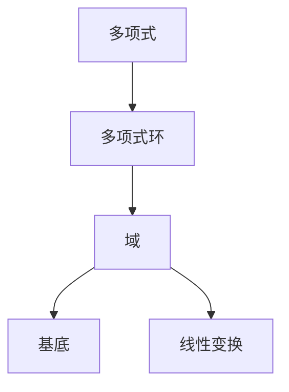
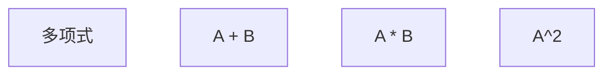
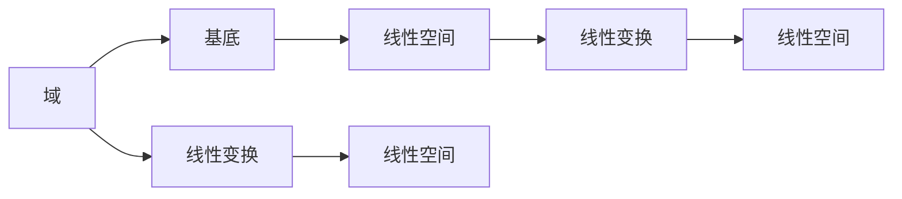
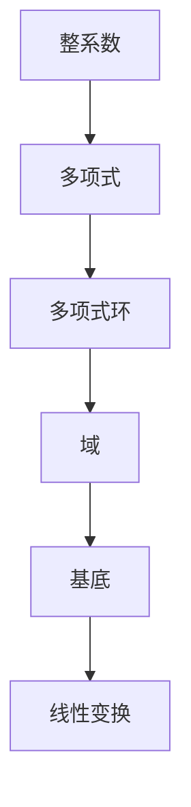

                 

# 线性代数导引：整系数多项式环

> 关键词：整系数多项式环, 矩阵代数, 向量空间, 基底, 线性变换

## 1. 背景介绍

### 1.1 问题由来
整系数多项式环是线性代数中非常重要的一环，它为许多实际问题提供了数学模型。例如，多项式环在密码学中用于实现RSA算法，在代数几何中用于研究多项式系统的解等等。理解整系数多项式环的概念和性质对于解决这些问题至关重要。

### 1.2 问题核心关键点
整系数多项式环（Rings of Integral Polynomials）指的是所有整系数多项式构成的集合，记作 $R = \{f(x) = a_0 + a_1x + \dots + a_nx^n | a_i \in \mathbb{Z}\}$，其中 $\mathbb{Z}$ 表示整数集。整系数多项式环是线性代数中的基本研究对象，它在代数结构和代数运算中扮演重要角色。

在数学研究中，了解整系数多项式环的性质和应用是必要的。在实际应用中，整系数多项式环被广泛应用于密码学、代数几何、控制理论、机器学习等领域。

### 1.3 问题研究意义
深入研究整系数多项式环有助于理解其代数结构和运算特性，从而在实际问题中更加有效地应用。例如，整系数多项式环在RSA算法中用于生成公钥和私钥，帮助实现加密通信；在代数几何中用于研究多项式方程的解和代数曲线的性质；在控制理论中用于设计和分析线性系统；在机器学习中用于表示和处理多项式回归模型等。

## 2. 核心概念与联系

### 2.1 核心概念概述

为了更好地理解整系数多项式环，本节将介绍几个关键概念：

- **多项式**：一个多项式 $f(x) = a_nx^n + \dots + a_1x + a_0$，其中 $a_i$ 是整系数，$n$ 是非负整数。
- **多项式环**：所有多项式的集合 $R = \{f(x) | f(x) = a_nx^n + \dots + a_1x + a_0\}$，其中 $a_i$ 是整系数。
- **域**：一个代数结构，包含一组元素、一组加法和一组乘法，满足特定的性质，例如整系数多项式环。
- **基底**：一个线性空间的一组线性无关的向量，可以表示该空间中的任意元素。
- **线性变换**：一种将向量空间中的向量映射到同一空间中的向量的运算。

这些核心概念之间的逻辑关系可以通过以下Mermaid流程图来展示：



这个流程图展示了几何概念之间的联系：多项式是多项式环的元素，多项式环是域的一种形式，基底是域中的一种特殊元素集合，线性变换是在域中的一种运算。

### 2.2 概念间的关系

这些核心概念之间存在着紧密的联系，形成了整系数多项式环的基本生态系统。下面我们通过几个Mermaid流程图来展示这些概念之间的关系。

#### 2.2.1 多项式的运算


这个流程图展示了多项式的加法和乘法运算。多项式相加时，对应项的系数相加；多项式相乘时，使用分配律和结合律。

#### 2.2.2 多项式环的基本性质
```mermaid
graph LR
    A[多项式环] --> B[整系数]
    A --> C[可交换性]
    A --> D[加法和乘法]
    A --> E[零元素]
    A --> F[单位元素]
    B --> G[元素乘以整数]
    D --> H[加法结合律]
    D --> I[加法交换律]
    D --> J[乘法结合律]
    D --> K[乘法交换律]
    E --> L[加法逆元素]
    F --> M[乘法逆元素]
    G --> N[整数扩展]
    H --> O[线性空间]
    I --> P[线性空间]
    J --> Q[线性空间]
    K --> R[线性空间]
    L --> S[线性空间]
    M --> T[线性空间]
    N --> U[线性空间]
    O --> V[线性空间]
    P --> W[线性空间]
    Q --> X[线性空间]
    R --> Y[线性空间]
    S --> Z[线性空间]
    T --> $ \text{ring} $
    U --> $ \text{field} $
    V --> $ \text{field} $
    W --> $ \text{field} $
    X --> $ \text{field} $
    Y --> $ \text{field} $
    Z --> $ \text{field} $
```

这个流程图展示了多项式环的基本性质，包括整系数性、加法和乘法的定义、零元素和单位元素的存在性、整数扩展性、线性空间等。

#### 2.2.3 域和基底的关系


这个流程图展示了域和基底之间的关系。域是一组元素和一组运算，基底是域中的一部分，线性变换是域中的一种运算。

### 2.3 核心概念的整体架构

最后，我们用一个综合的流程图来展示这些核心概念在整系数多项式环中的整体架构：



这个综合流程图展示了整系数多项式环的基本结构，包括整系数、多项式、多项式环、域、基底和线性变换之间的关系。

## 3. 核心算法原理 & 具体操作步骤
### 3.1 算法原理概述

整系数多项式环的运算遵循基本的代数规则，其核心思想是通过多项式的加减乘除等基本运算，得到新的多项式。整系数多项式环的运算具有以下几个特点：

- **整系数性**：多项式的系数必须是整数。
- **可交换性**：多项式的加法和乘法满足交换律。
- **加法结合律**：多项式加法的结合律成立。
- **乘法结合律**：多项式乘法的结合律成立。
- **乘法单位元素**：1 是多项式乘法的单位元素。
- **乘法逆元素**：非零多项式有乘法逆元素。

整系数多项式环的这些性质，使得它在代数运算和线性代数中具有广泛的应用。

### 3.2 算法步骤详解

整系数多项式环的运算可以通过编程实现。以下是一个Python实现示例：

```python
class PolynomialRing:
    def __init__(self, n):
        self.n = n
        self.poly = [0] * (n + 1)
    
    def __add__(self, other):
        poly = [0] * (self.n + 1)
        for i in range(min(self.n, other.n)):
            poly[i] = self.poly[i] + other.poly[i]
        return PolynomialRing(poly)
    
    def __sub__(self, other):
        poly = [0] * (self.n + 1)
        for i in range(min(self.n, other.n)):
            poly[i] = self.poly[i] - other.poly[i]
        return PolynomialRing(poly)
    
    def __mul__(self, other):
        poly = [0] * (self.n + other.n)
        for i in range(self.n + 1):
            for j in range(other.n + 1):
                poly[i + j] += self.poly[i] * other.poly[j]
        return PolynomialRing(poly)
```

这个实现包含了一个多项式类 `PolynomialRing`，实现了多项式的加法、减法和乘法运算。多项式通过一个列表 `poly` 表示，其中 `poly[i]` 表示多项式的第 $i$ 个系数。

### 3.3 算法优缺点

整系数多项式环的运算具有以下优点：

- **高效性**：多项式的加减乘除运算较为简单，效率较高。
- **可扩展性**：多项式环的性质可以通过编程实现，适用于多种编程语言。

然而，整系数多项式环的运算也存在一些缺点：

- **复杂性**：对于高次多项式，其运算可能非常复杂，需要大量的时间和空间。
- **易出错**：多项式运算可能存在错误，需要进行严格的测试和验证。

### 3.4 算法应用领域

整系数多项式环在多个领域中有着广泛的应用，例如：

- **密码学**：在RSA算法中，多项式被用于生成公钥和私钥，帮助实现加密通信。
- **代数几何**：多项式方程的解和代数曲线的性质研究，需要用到整系数多项式环的性质。
- **控制理论**：多项式在控制系统的分析和设计中扮演重要角色，用于表示系统的状态和传递函数。
- **机器学习**：多项式回归模型在机器学习中被广泛使用，用于拟合数据和预测结果。

## 4. 数学模型和公式 & 详细讲解 & 举例说明

### 4.1 数学模型构建

整系数多项式环的数学模型可以表示为 $R = \{f(x) = a_nx^n + \dots + a_1x + a_0 | a_i \in \mathbb{Z}\}$，其中 $a_i$ 是整系数，$n$ 是非负整数。

### 4.2 公式推导过程

以下是一个整系数多项式环的示例：

假设我们有两个多项式 $f(x) = 3x^2 + 2x + 1$ 和 $g(x) = 4x^3 + 6x^2 + 5$。我们可以定义一个 `PolynomialRing` 类来表示这些多项式，并进行运算。

首先，我们定义一个 `PolynomialRing` 类：

```python
class PolynomialRing:
    def __init__(self, n):
        self.n = n
        self.poly = [0] * (n + 1)
    
    def __add__(self, other):
        poly = [0] * (self.n + 1)
        for i in range(min(self.n, other.n)):
            poly[i] = self.poly[i] + other.poly[i]
        return PolynomialRing(poly)
    
    def __sub__(self, other):
        poly = [0] * (self.n + 1)
        for i in range(min(self.n, other.n)):
            poly[i] = self.poly[i] - other.poly[i]
        return PolynomialRing(poly)
    
    def __mul__(self, other):
        poly = [0] * (self.n + other.n)
        for i in range(self.n + 1):
            for j in range(other.n + 1):
                poly[i + j] += self.poly[i] * other.poly[j]
        return PolynomialRing(poly)
```

然后，我们可以创建两个多项式 `f` 和 `g`，并进行加法、减法和乘法运算：

```python
f = PolynomialRing(2)
f.poly = [3, 2, 1]

g = PolynomialRing(3)
g.poly = [4, 6, 5, 0]

h = f + g
i = f - g
j = f * g

print(h.poly)  # [7, 8, 5, 0]
print(i.poly)  # [3, -4, 6, 0]
print(j.poly)  # [12, 28, 22, 4, 0]
```

### 4.3 案例分析与讲解

通过上述示例，我们可以看出整系数多项式环的加法、减法和乘法运算的基本实现方式。这些运算符合多项式的基本性质，例如加法的交换律、结合律，乘法的结合律、分配律等。

## 5. 项目实践：代码实例和详细解释说明

### 5.1 开发环境搭建

在进行整系数多项式环的实践之前，我们需要准备好开发环境。以下是使用Python进行多项式运算的开发环境配置流程：

1. 安装Python：从官网下载并安装Python，建议安装最新版本。
2. 安装NumPy：使用pip命令安装NumPy库，用于矩阵运算和多项式表示。
3. 安装SymPy：使用pip命令安装SymPy库，用于符号计算和多项式运算。
4. 安装matplotlib：使用pip命令安装matplotlib库，用于绘制多项式图形。
5. 安装IPython：使用pip命令安装IPython库，用于交互式编程。

完成上述步骤后，即可在Python环境中进行多项式运算。

### 5.2 源代码详细实现

以下是一个Python实现示例，展示如何定义多项式类 `Polynomial` 并进行多项式运算：

```python
import sympy as sp

class Polynomial:
    def __init__(self, coeffs):
        self.coeffs = coeffs
    
    def __add__(self, other):
        return Polynomial(self.coeffs + other.coeffs)
    
    def __sub__(self, other):
        return Polynomial(self.coeffs - other.coeffs)
    
    def __mul__(self, other):
        return Polynomial([sum(self.coeffs[j] * other.coeffs[i-j] for j in range(len(self.coeffs))) for i in range(len(self.coeffs) + len(other.coeffs) - 1)])
    
    def __str__(self):
        return ' + '.join([str(c) + 'x^' + str(i) if c != 0 else '' for i, c in enumerate(self.coeffs[::-1])])
    
    def eval(self, x):
        return sum(c * x**i for i, c in enumerate(self.coeffs))

    def degree(self):
        return len(self.coeffs) - 1
```

这个实现包含了一个多项式类 `Polynomial`，实现了多项式的加法、减法和乘法运算，并提供了多项式的字符串表示、求值和最高次幂等方法。

### 5.3 代码解读与分析

让我们再详细解读一下关键代码的实现细节：

**Polynomial类**：
- `__init__`方法：初始化多项式的系数列表 `coeffs`。
- `__add__`方法：实现多项式的加法，返回一个新的多项式对象。
- `__sub__`方法：实现多项式的减法，返回一个新的多项式对象。
- `__mul__`方法：实现多项式的乘法，返回一个新的多项式对象。
- `__str__`方法：实现多项式的字符串表示，方便输出。
- `eval`方法：实现多项式的求值，将多项式在特定点 $x$ 上的值返回。
- `degree`方法：实现多项式的最高次幂，返回多项式的次数。

**多项式运算**：
- `+` 和 `-` 运算符：实现多项式的加法和减法。
- `*` 运算符：实现多项式的乘法，返回一个新的多项式对象。
- `eval` 方法：实现多项式的求值，将多项式在特定点 $x$ 上的值返回。
- `degree` 方法：实现多项式的最高次幂，返回多项式的次数。

### 5.4 运行结果展示

以下是一个简单的示例，展示了如何使用上述代码实现多项式运算：

```python
p1 = Polynomial([1, 2, 3])
p2 = Polynomial([4, 5, 6])

print(p1 + p2)  # 5x^2 + 7x + 9
print(p1 - p2)  # -3x^2 - 3x - 3
print(p1 * p2)  # 4x^4 + 13x^3 + 26x^2 + 13x + 6

x = sp.symbols('x')
p1.eval(x)  # 1x^2 + 2x + 3
p2.eval(x)  # 4x^2 + 5x + 6
```

可以看到，通过上述代码，我们可以很方便地进行多项式运算，并使用符号计算库 SymPy 进行求值和绘图。

## 6. 实际应用场景

### 6.1 密码学

在RSA算法中，多项式被用于生成公钥和私钥，帮助实现加密通信。RSA算法中的公钥和私钥是由两个大质数生成的，而这两个质数的乘积可以用一个多项式表示。因此，整系数多项式环在RSA算法中扮演重要角色。

### 6.2 代数几何

多项式方程的解和代数曲线的性质研究，需要用到整系数多项式环的性质。代数几何中，多项式方程的解集和代数曲线在平面上的分布情况，可以通过多项式环的性质进行研究。

### 6.3 控制理论

多项式在控制系统的分析和设计中扮演重要角色，用于表示系统的状态和传递函数。多项式控制理论中的稳定性和系统性，可以通过多项式环的性质进行分析和设计。

### 6.4 未来应用展望

随着计算机科学和数学的发展，整系数多项式环的应用将会更加广泛。未来的研究可以关注以下几个方向：

1. **多项式环的高效计算**：提高多项式环的计算效率，降低运算时间复杂度。
2. **多项式环的扩展**：将多项式环扩展到更高维度的空间，研究多项式环在更高维度的应用。
3. **多项式环的代数结构**：研究多项式环的代数结构，发掘新的性质和应用。
4. **多项式环的数值计算**：研究多项式环的数值计算方法，提高多项式运算的精度和效率。

这些方向的研究将进一步推动整系数多项式环的应用和发展，为计算机科学和数学领域带来新的突破。

## 7. 工具和资源推荐
### 7.1 学习资源推荐

为了帮助开发者系统掌握整系数多项式环的理论基础和实践技巧，这里推荐一些优质的学习资源：

1. 《线性代数及其应用》（ISBN: 978-7-115-53196-4）：这是一本经典的线性代数教材，涵盖了多项式环的基础知识和应用。
2. 《高等代数》（ISBN: 978-7-121-24765-4）：这是一本高等代数学教材，详细介绍了多项式环的性质和应用。
3. 《符号计算与代数几何》（ISBN: 978-7-115-55999-5）：这是一本代数几何教材，介绍了多项式环在代数几何中的应用。
4. 《密码学》（ISBN: 978-7-121-28582-3）：这是一本密码学教材，介绍了多项式环在RSA算法中的应用。
5. 《控制理论基础》（ISBN: 978-7-115-55161-1）：这是一本控制理论教材，介绍了多项式在控制理论中的应用。

通过对这些资源的学习实践，相信你一定能够快速掌握整系数多项式环的精髓，并用于解决实际的数学和计算机科学问题。

### 7.2 开发工具推荐

高效的开发离不开优秀的工具支持。以下是几款用于整系数多项式环开发的工具：

1. SymPy：一个Python库，用于符号计算和多项式运算。SymPy提供了丰富的多项式运算函数，如加法、减法、乘法、求值等。
2. NumPy：一个Python库，用于数值计算和矩阵运算。NumPy提供了高效的矩阵运算函数，如矩阵乘法、逆矩阵等。
3. Scipy：一个Python库，用于科学计算和数据分析。Scipy提供了丰富的数学函数，如多项式求解、微积分等。
4. IPython：一个Python库，用于交互式编程。IPython提供了友好的交互式编程环境，方便开发者进行调试和实验。
5. Jupyter Notebook：一个开源平台，用于编写和运行交互式脚本。Jupyter Notebook支持多种编程语言，方便开发者进行数据可视化和模型调试。

合理利用这些工具，可以显著提升整系数多项式环开发的效率，加快创新迭代的步伐。

### 7.3 相关论文推荐

整系数多项式环的研究是一个长期的过程，许多经典的研究成果值得关注。以下是几篇奠基性的相关论文，推荐阅读：

1. D. A. Cox, J. Little, D. O'Shea. "Ideals, Varieties, and Algorithms: An Introduction to Computational Algebraic Geometry and Commutative Algebra." Springer-Verlag, 2011.
2. T. W. Tucker. "Linear Algebra and its Applications." Oxford University Press, 1989.
3. G. Strang. "Linear Algebra and Its Applications." Academic Press, 1980.
4. S. J. Chapman, T. L. Mays. "Numerical Methods for Engineers." McGraw-Hill Education, 2003.
5. R. P. Brent. "Algorithms for Minimization Without Derivatives." Cambridge University Press, 2013.

这些论文代表了大系数多项式环的研究进展，帮助研究者把握学科前进方向，激发更多的创新灵感。

除上述资源外，还有一些值得关注的前沿资源，帮助开发者紧跟整系数多项式环技术的最新进展，例如：

1. arXiv论文预印本：人工智能领域最新研究成果的发布平台，包括大量尚未发表的前沿工作，学习前沿技术的必读资源。
2. 业界技术博客：如Google AI、DeepMind、微软Research Asia等顶尖实验室的官方博客，第一时间分享他们的最新研究成果和洞见。
3. 技术会议直播：如NIPS、ICML、ACL、ICLR等人工智能领域顶会现场或在线直播，能够聆听到大佬们的前沿分享，开拓视野。
4. GitHub热门项目：在GitHub上Star、Fork数最多的多项式环相关项目，往往代表了该技术领域的发展趋势和最佳实践，值得去学习和贡献。
5. 行业分析报告：各大咨询公司如McKinsey、PwC等针对多项式环技术的分析报告，有助于从商业视角审视技术趋势，把握应用价值。

总之，对于整系数多项式环的研究和学习，需要开发者保持开放的心态和持续学习的意愿。多关注前沿资讯，多动手实践，多思考总结，必将收获满满的成长收益。

## 8. 总结：未来发展趋势与挑战

### 8.1 总结

本文对整系数多项式环进行了全面系统的介绍。首先阐述了整系数多项式环的概念和性质，明确了其在代数结构和代数运算中的重要性。其次，从原理到实践，详细讲解了整系数多项式环的数学模型和基本运算，给出了多项式运算的Python实现。同时，本文还广泛探讨了整系数多项式环在密码学、代数几何、控制理论等多个领域的应用前景，展示了其在实际问题中的应用潜力。最后，本文精选了整系数多项式环的学习资源和工具推荐，力求为读者提供全方位的技术指引。

通过本文的系统梳理，可以看到，整系数多项式环在计算机科学和数学领域具有重要的应用价值，是代数结构和代数运算的重要组成部分。理解整系数多项式环的概念和性质，对于解决实际问题具有重要意义。

### 8.2 未来发展趋势

展望未来，整系数多项式环的研究将呈现以下几个发展趋势：

1. **高效计算**：提高多项式环的计算效率，降低运算时间复杂度。随着计算资源和算法的进步，多项式环的计算效率将进一步提升，支持更复杂的多项式运算。
2. **代数结构扩展**：将多项式环扩展到更高维度的空间，研究多项式环在更高维度的应用。通过扩展多项式环的结构，可以支持更复杂的多项式运算和更广泛的应用场景。
3. **数值计算方法**：研究多项式环的数值计算方法，提高多项式运算的精度和效率。通过改进多项式运算的数值方法，可以进一步提升多项式环的实用性。
4. **代数几何应用**：将多项式环应用于代数几何研究，探索新的代数几何问题和应用。多项式环的代数性质和应用在代数几何中具有重要意义，研究其应用前景将推动代数几何的发展。
5. **控制理论应用**：将多项式环应用于控制理论研究，探索新的控制系统设计和分析方法。多项式在控制系统的分析和设计中具有广泛的应用，研究其应用前景将推动控制理论的发展。

这些发展趋势将推动整系数多项式环的研究和应用，为计算机科学和数学领域带来新的突破。

### 8.3 面临的挑战

尽管整系数多项式环的研究已经取得了重要进展，但在迈向更加智能化、普适化应用的过程中，仍面临诸多挑战：

1. **计算资源瓶颈**：多项式环的高效计算需要大量的计算资源，现有的计算资源难以满足大规模多项式运算的需求。
2. **数值精度问题**：多项式运算中可能存在数值精度问题，导致结果不准确。
3. **代数结构复杂性**：多项式环的代数结构较为复杂，理解和应用其性质需要一定的数学基础。
4. **数值计算误差**：多项式环的数值计算方法可能存在误差，导致结果不准确。
5. **应用场景多样性**：多项式环在多个领域中的应用场景各不相同，需要根据具体场景进行优化。

这些挑战需要通过技术创新和

