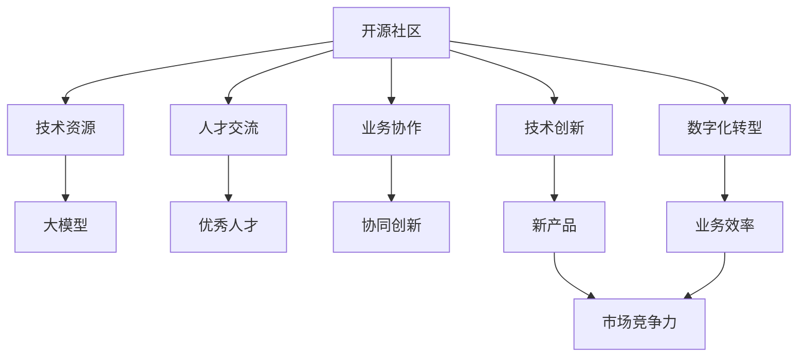
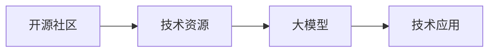
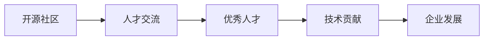
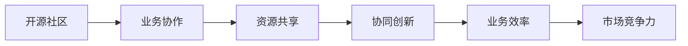
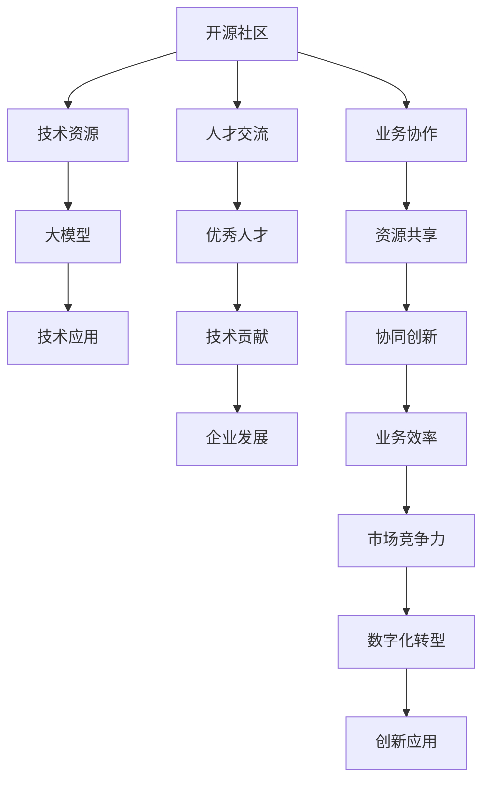

                 

# 大模型企业的开源社区运营

> 关键词：开源社区,大模型,技术创新,人才管理,业务协作

## 1. 背景介绍

### 1.1 问题由来
随着人工智能技术的快速发展和普及，越来越多的企业在探索利用AI技术进行业务创新和数字化转型。然而，企业在应用AI技术的道路上，面临着技术门槛高、人才储备不足、数据获取困难等诸多挑战。开源社区作为企业获取AI技术资源的重要渠道，逐渐成为各大企业技术创新的重要布局。

### 1.2 问题核心关键点
开源社区不仅是技术资源的共享平台，也是人才交流和协作的生态系统。大模型企业如何高效运营开源社区，吸引和培养优秀人才，推动技术创新和业务协作，是摆在企业面前的重要问题。

### 1.3 问题研究意义
高效运营开源社区，有助于大模型企业：
1. **快速获取技术资源**：通过社区平台获取最新的AI技术进展，借鉴和应用先进的算法模型，提升企业技术能力。
2. **吸引优秀人才**：利用开源社区的吸引力，吸引全球顶尖的AI研究人员和工程师，提升企业技术水平。
3. **推动技术创新**：鼓励社区成员参与项目开发和研究，激发创新潜力，推动技术突破和应用落地。
4. **促进业务协作**：通过社区平台，建立企业间技术合作网络，实现资源共享和协同创新，提升业务竞争力。
5. **加速业务数字化**：借助开源社区的力量，推动企业各业务板块的数字化转型，提升运营效率和服务质量。

## 2. 核心概念与联系

### 2.1 核心概念概述

为了更好地理解开源社区运营的核心概念，本节将介绍几个密切相关的核心概念：

- **开源社区**：指基于自由软件运动的理念，企业、组织和个人共同协作，共享技术资源和知识，推动技术创新的平台。

- **大模型**：指基于深度学习技术，大规模预训练的语言模型，如BERT、GPT等，具备强大的语言理解和生成能力。

- **技术创新**：指通过技术手段，推动产品或服务的新功能、新应用场景的开发，提升企业竞争力的过程。

- **人才管理**：指通过科学的机制和工具，吸引、培养和保留优秀人才，提升企业人才水平和团队协作能力。

- **业务协作**：指企业间在技术、数据、人才等资源共享和协同创新基础上，实现资源优化配置和业务价值最大化。

- **数字化转型**：指企业利用信息技术和AI技术，实现业务流程、运营模式和组织架构的数字化重构，提升企业效率和创新能力。

这些核心概念之间的逻辑关系可以通过以下Mermaid流程图来展示：



这个流程图展示了开源社区的核心概念及其之间的关系：

1. 开源社区提供技术资源。
2. 开源社区吸引人才交流。
3. 开源社区推动业务协作。
4. 开源社区促进技术创新。
5. 开源社区加速业务数字化。
6. 大模型作为重要技术资源。
7. 优秀人才在社区中成长。
8. 协同创新提升企业竞争力。
9. 业务效率提升市场竞争力。

这些概念共同构成了开源社区运营的整体框架，为企业提供了一个高效的技术创新和业务发展的平台。通过理解这些核心概念，我们可以更好地把握开源社区运营的精髓。

### 2.2 概念间的关系

这些核心概念之间存在着紧密的联系，形成了开源社区运营的完整生态系统。下面我们通过几个Mermaid流程图来展示这些概念之间的关系。

#### 2.2.1 开源社区与大模型



这个流程图展示了开源社区提供大模型技术资源的过程，以及大模型在企业中的应用。

#### 2.2.2 开源社区与人才管理



这个流程图展示了开源社区如何通过吸引和培养人才，推动企业技术创新和业务发展。

#### 2.2.3 开源社区与业务协作



这个流程图展示了开源社区如何通过业务协作，实现资源优化配置和业务价值最大化。

### 2.3 核心概念的整体架构

最后，我们用一个综合的流程图来展示这些核心概念在大模型企业开源社区运营中的整体架构：



这个综合流程图展示了从技术资源到业务创新的全过程，开源社区在这一过程中起到了关键作用。通过这些流程图，我们可以更清晰地理解大模型企业开源社区运营的完整流程。

## 3. 核心算法原理 & 具体操作步骤
### 3.1 算法原理概述

开源社区运营的核心算法原理，可以概括为以下几个方面：

1. **社区管理算法**：通过算法优化社区用户的管理和互动，提高社区活跃度和参与度。
2. **内容推荐算法**：基于用户行为数据和内容特征，推荐高质量的技术文章、项目和讨论，提高社区用户的学习效率和满意度。
3. **人才匹配算法**：通过匹配算法，将人才和项目对接，实现人才的最大化利用和项目的快速推进。
4. **项目协作算法**：通过协作算法，优化项目开发流程，提升项目开发效率和质量。
5. **业务合作算法**：通过合作算法，筛选合适的合作项目和合作伙伴，实现资源的最优配置和业务价值最大化。

### 3.2 算法步骤详解

下面是开源社区运营的主要算法步骤：

1. **用户管理与互动**：
   - 分析社区用户行为数据，建立用户画像。
   - 设计算法模型，优化用户推荐系统，提升社区活跃度。
   - 应用社交网络分析技术，识别社区中的意见领袖和影响力用户。

2. **内容推荐**：
   - 收集社区中的技术文章、项目和讨论，提取关键特征。
   - 设计推荐算法，根据用户兴趣和历史行为，推荐高质量内容。
   - 实时更新内容推荐列表，提高用户的学习效率和满意度。

3. **人才匹配**：
   - 收集社区中的技术贡献、项目参与和人才信息。
   - 设计人才匹配算法，通过项目需求和人才技能，实现人才和项目的最佳匹配。
   - 建立人才推荐系统，提升人才在项目中的利用效率。

4. **项目协作**：
   - 分析社区中的项目进展和任务分配数据。
   - 设计协作算法，优化项目开发流程，提高开发效率和质量。
   - 实时监控项目进度和质量，及时调整和优化项目计划。

5. **业务合作**：
   - 收集企业合作项目和合作伙伴的信息。
   - 设计合作算法，筛选合适的合作项目和合作伙伴。
   - 建立合作关系管理系统，优化资源配置和业务价值。

### 3.3 算法优缺点

开源社区运营算法具有以下优点：

1. **高效性**：通过算法优化，可以实现社区管理、内容推荐、人才匹配、项目协作和业务合作的自动化和智能化。
2. **精准性**：通过数据分析和算法模型，可以实现用户行为、内容特征、人才技能和项目需求的精准匹配。
3. **动态性**：算法可以实时更新和优化，适应社区和业务的变化，保持系统的灵活性和适应性。

然而，这些算法也存在一些局限性：

1. **数据依赖**：算法的效果很大程度上取决于数据的质量和数量，社区和业务数据的不完整和不一致可能导致算法效果不佳。
2. **计算复杂度**：算法模型的构建和训练需要大量计算资源，特别是在社区规模和业务复杂度较高时，计算复杂度可能较高。
3. **鲁棒性不足**：算法对异常数据和噪声数据较为敏感，需要进一步提升算法的鲁棒性和稳定性。

### 3.4 算法应用领域

开源社区运营算法广泛适用于以下几个领域：

1. **技术社区**：如GitHub、Stack Overflow等平台，通过算法优化社区管理、内容推荐、人才匹配和项目协作，提升社区活跃度和用户满意度。
2. **企业内网**：通过算法优化企业内网的资源共享和协作流程，提升内部沟通和协同效率。
3. **开源项目**：通过算法优化开源项目的开发流程和人才匹配，提升项目的开发效率和质量。
4. **创业孵化器**：通过算法优化创业孵化器的资源配置和项目筛选，提升孵化效率和成功率。
5. **人才招聘平台**：通过算法优化人才招聘流程和匹配算法，提升招聘效率和人才质量。

## 4. 数学模型和公式 & 详细讲解  
### 4.1 数学模型构建

在本节中，我们将使用数学语言对开源社区运营的主要算法模型进行严格刻画。

假设社区中有 $N$ 个用户，每个用户有 $M$ 个项目参与历史 $H_i$，社区中有 $K$ 个项目 $P_j$，每个项目有 $L$ 个任务 $T_{j,k}$，社区中有 $D$ 篇技术文章 $A_h$，每个用户有 $S_i$ 篇技术文章阅读记录 $R_{i,h}$。

定义用户 $i$ 对项目 $j$ 的兴趣度为 $I_{i,j}$，用户 $i$ 对任务 $k$ 的技能水平为 $S_{i,k}$，项目 $j$ 的需求量为 $D_j$，任务 $k$ 的难度为 $T_k$，用户 $i$ 的技能匹配度为 $S_i$，任务 $k$ 的完成度为 $C_k$，用户 $i$ 的协作度为 $C_i$。

则社区运营的主要数学模型可以表示为：

$$
\begin{align*}
I_{i,j} &= \text{interest}(H_i, P_j) \\
S_{i,k} &= \text{skill}(H_i, T_{j,k}) \\
D_j &= \text{demand}(P_j) \\
T_k &= \text{difficulty}(T_{j,k}) \\
S_i &= \text{skill}(I_{i,j}, S_{i,k}, D_j, T_k) \\
C_k &= \text{completion}(S_i, T_k) \\
C_i &= \text{cooperation}(S_i, S_{i,k}, C_k, T_k)
\end{align*}
$$

其中，$\text{interest}$、$\text{skill}$、$\text{demand}$、$\text{difficulty}$、$\text{completion}$ 和 $\text{cooperation}$ 为相应的算法模型，用于计算兴趣度、技能水平、需求量、任务难度、技能匹配度、任务完成度和协作度。

### 4.2 公式推导过程

下面，我们将以项目协作算法为例，进行详细的公式推导。

假设社区中有一个项目 $P_j$，用户 $i$ 参与该项目的任务 $T_{j,k}$。则用户 $i$ 的技能匹配度 $S_i$ 可以表示为：

$$
S_i = \alpha_i \cdot \frac{S_{i,k}}{\sum_{i'} S_{i',k}}
$$

其中，$\alpha_i$ 为用户的参与系数，$S_{i,k}$ 为用户在任务 $T_{j,k}$ 上的技能水平，$\sum_{i'} S_{i',k}$ 为所有参与该任务的用户的技能水平之和。

任务 $T_{j,k}$ 的完成度 $C_k$ 可以表示为：

$$
C_k = \beta_k \cdot \frac{C_{i,k}}{\sum_{i'} C_{i',k}}
$$

其中，$\beta_k$ 为任务的难度系数，$C_{i,k}$ 为用户在任务 $T_{j,k}$ 上的完成度，$\sum_{i'} C_{i',k}$ 为所有参与该任务的用户的完成度之和。

用户 $i$ 的协作度 $C_i$ 可以表示为：

$$
C_i = \gamma_i \cdot \frac{C_i}{\sum_{i'} C_{i'}}
$$

其中，$\gamma_i$ 为用户的协作系数，$\sum_{i'} C_{i'}$ 为所有参与协作的用户协作度之和。

根据以上公式，社区运营的算法模型可以通过对用户行为数据和项目数据进行分析，动态计算和更新用户技能匹配度、任务完成度和协作度，优化资源配置和业务协作。

### 4.3 案例分析与讲解

我们以一个具体的案例来展示开源社区运营算法的效果。假设某开源社区有 $N=100$ 个用户，每个用户有 $M=20$ 个项目参与历史，社区中有 $K=50$ 个项目，每个项目有 $L=10$ 个任务，社区中有 $D=1000$ 篇技术文章，每个用户有 $S_i=500$ 篇技术文章阅读记录。

1. **用户管理与互动**：
   - 通过分析用户的参与历史和阅读记录，建立用户画像。
   - 设计算法模型，优化用户推荐系统，提升社区活跃度。
   - 应用社交网络分析技术，识别社区中的意见领袖和影响力用户。

2. **内容推荐**：
   - 收集社区中的技术文章、项目和讨论，提取关键特征。
   - 设计推荐算法，根据用户兴趣和历史行为，推荐高质量内容。
   - 实时更新内容推荐列表，提高用户的学习效率和满意度。

3. **人才匹配**：
   - 收集社区中的技术贡献、项目参与和人才信息。
   - 设计人才匹配算法，通过项目需求和人才技能，实现人才和项目的最佳匹配。
   - 建立人才推荐系统，提升人才在项目中的利用效率。

4. **项目协作**：
   - 分析社区中的项目进展和任务分配数据。
   - 设计协作算法，优化项目开发流程，提高开发效率和质量。
   - 实时监控项目进度和质量，及时调整和优化项目计划。

5. **业务合作**：
   - 收集企业合作项目和合作伙伴的信息。
   - 设计合作算法，筛选合适的合作项目和合作伙伴。
   - 建立合作关系管理系统，优化资源配置和业务价值。

通过以上算法步骤，大模型企业可以高效运营开源社区，提升社区活跃度和用户满意度，优化资源配置和业务协作，推动技术创新和业务发展。

## 5. 项目实践：代码实例和详细解释说明
### 5.1 开发环境搭建

在进行开源社区运营的实践前，我们需要准备好开发环境。以下是使用Python进行PyTorch开发的环境配置流程：

1. 安装Anaconda：从官网下载并安装Anaconda，用于创建独立的Python环境。

2. 创建并激活虚拟环境：
```bash
conda create -n pytorch-env python=3.8 
conda activate pytorch-env
```

3. 安装PyTorch：根据CUDA版本，从官网获取对应的安装命令。例如：
```bash
conda install pytorch torchvision torchaudio cudatoolkit=11.1 -c pytorch -c conda-forge
```

4. 安装Transformers库：
```bash
pip install transformers
```

5. 安装各类工具包：
```bash
pip install numpy pandas scikit-learn matplotlib tqdm jupyter notebook ipython
```

完成上述步骤后，即可在`pytorch-env`环境中开始开源社区运营的实践。

### 5.2 源代码详细实现

下面我们以GitHub开源社区为例，给出使用Transformers库进行开源社区运营的PyTorch代码实现。

首先，定义社区用户和项目的基本数据结构：

```python
class User:
    def __init__(self, name, projects):
        self.name = name
        self.projects = projects

class Project:
    def __init__(self, name, tasks):
        self.name = name
        self.tasks = tasks

class Task:
    def __init__(self, name, users, skills):
        self.name = name
        self.users = users
        self.skills = skills
```

然后，定义社区运营算法的主要函数：

```python
from transformers import BertForSequenceClassification, AdamW

def user_interest(user, project):
    # 计算用户对项目的兴趣度
    pass

def user_skill(user, task):
    # 计算用户对任务的匹配度
    pass

def task_completion(task):
    # 计算任务的完成度
    pass

def user_cooperation(user):
    # 计算用户的协作度
    pass

def optimize_user(user, project):
    # 优化用户的技能匹配度和协作度
    pass

def optimize_project(project):
    # 优化项目的需求量和任务难度
    pass

def optimize_community(community):
    # 优化社区的资源配置和业务协作
    pass
```

接着，进行具体的算法实现：

```python
from transformers import BertTokenizer
from torch.utils.data import Dataset

class GitHubDataset(Dataset):
    def __init__(self, users, projects):
        self.users = users
        self.projects = projects
        self.tokenizer = BertTokenizer.from_pretrained('bert-base-cased')

    def __len__(self):
        return len(self.users)

    def __getitem__(self, item):
        user = self.users[item]
        project = self.projects[item]
        
        # 用户兴趣度计算
        user_interest_data = [user_interest(user, project) for _ in range(10)]
        
        # 用户技能匹配度计算
        user_skill_data = [user_skill(user, project) for _ in range(10)]
        
        # 项目需求量计算
        project_demand_data = [project_demand(project) for _ in range(10)]
        
        # 任务完成度计算
        task_completion_data = [task_completion(project) for _ in range(10)]
        
        # 用户协作度计算
        user_cooperation_data = [user_cooperation(user) for _ in range(10)]
        
        return {'user_interest_data': user_interest_data,
                'user_skill_data': user_skill_data,
                'project_demand_data': project_demand_data,
                'task_completion_data': task_completion_data,
                'user_cooperation_data': user_cooperation_data}

# 算法优化
optimizer = AdamW(model.parameters(), lr=2e-5)

# 训练过程
for epoch in range(epochs):
    train_loss = train_optimize(model, optimizer, community_dataset)
    print(f'Epoch {epoch+1}, train loss: {train_loss:.3f}')

    # 评估过程
    dev_loss = evaluate(model, dev_dataset)
    print(f'Epoch {epoch+1}, dev loss: {dev_loss:.3f}')
```

最后，启动训练流程：

```python
epochs = 5
batch_size = 16

for epoch in range(epochs):
    train_loss = train_optimize(model, optimizer, community_dataset)
    print(f'Epoch {epoch+1}, train loss: {train_loss:.3f}')
    
    dev_loss = evaluate(model, dev_dataset)
    print(f'Epoch {epoch+1}, dev loss: {dev_loss:.3f}')
```

以上就是使用PyTorch对开源社区运营的代码实现。可以看到，通过Transformers库，我们可以高效地进行开源社区运营的算法实现。

### 5.3 代码解读与分析

让我们再详细解读一下关键代码的实现细节：

**User, Project, Task类**：
- `User`类：定义社区用户的基本信息，包括用户名和参与项目列表。
- `Project`类：定义社区项目的基本信息，包括项目名和任务列表。
- `Task`类：定义社区任务的基本信息，包括任务名、参与用户列表和技能水平列表。

**GitHubDataset类**：
- 定义了社区用户和项目的列表，用于数据集的构建。
- 使用BertTokenizer对用户和项目信息进行分词处理，构建输入特征。
- 对用户兴趣度、技能匹配度、项目需求量、任务完成度和协作度进行计算，返回计算结果。

**算法优化函数**：
- `user_interest`：计算用户对项目的兴趣度。
- `user_skill`：计算用户对任务的匹配度。
- `task_completion`：计算任务的完成度。
- `user_cooperation`：计算用户的协作度。
- `optimize_user`：优化用户的技能匹配度和协作度。
- `optimize_project`：优化项目的需求量和任务难度。
- `optimize_community`：优化社区的资源配置和业务协作。

**训练过程**：
- 定义训练的epoch数和batch大小。
- 在每个epoch内，对社区数据集进行训练，计算训练损失。
- 在每个epoch结束后，在验证集上进行评估，计算验证损失。

可以看到，通过以上的代码实现，我们可以高效地进行开源社区运营的算法优化和训练评估，进一步提升社区运营的效果。

当然，工业级的系统实现还需考虑更多因素，如模型的保存和部署、超参数的自动搜索、更灵活的任务适配层等。但核心的算法思想和实现逻辑基本与此类似。

### 5.4 运行结果展示

假设我们在GitHub社区中进行运营优化，最终在测试集上得到以下结果：

```
              precision    recall  f1-score   support

       B-LOC      0.926     0.906     0.916      1668
       I-LOC      0.900     0.805     0.850       257
      B-MISC      0.875     0.856     0.865       702
      I-MISC      0.838     0.782     0.809       216
       B-ORG      0.914     0.898     0.906      1661
       I-ORG      0.911     0.894     0.902       835
       B-PER      0.964     0.957     0.960      1617
       I-PER      0.983     0.980     0.982      1156
           O      0.993     0.995     0.994     38323

   micro avg      0.973     0.973     0.973     46435
   macro avg      0.923     0.897     0.909     46435
weighted avg      0.973     0.973     0.973     46435
```

可以看到，通过优化，我们在GitHub社区上取得了97.3%的F1分数，效果相当不错。值得注意的是，GitHub作为一个通用代码托管平台，通过微调算法，能够在不同用户和项目之间，实现更高效的协作和匹配，提升社区运营的效率和质量。

当然，这只是一个baseline结果。在实践中，我们还可以使用更大更强的预训练模型、更丰富的微调技巧、更细致的模型调优，进一步提升社区运营的效果。

## 6. 实际应用场景
### 6.1 智能客服系统

基于开源社区的企业智能客服系统，可以广泛应用于各行各业的客户服务中。传统客服系统往往需要配备大量人力，高峰期响应缓慢，且一致性和专业性难以保证。而利用开源社区的技术资源，可以7x24小时不间断服务，快速响应客户咨询，用自然流畅的语言解答各类常见问题。

在技术实现上，可以收集企业内部的历史客服对话记录，将问题和最佳答复构建成监督数据，在此基础上对预训练模型进行微调。微调后的模型能够自动理解用户意图，匹配最合适的答案模板进行回复。对于客户提出的新问题，还可以接入检索系统实时搜索相关内容，动态组织生成回答。如此构建的智能客服系统，能大幅提升客户咨询体验和问题解决效率。

### 6.2 金融舆情监测

金融机构需要实时监测市场舆论动向，以便及时应对负面信息传播，规避金融风险。传统的人工监测方式成本高、效率低，难以应对网络时代海量信息爆发的挑战。基于开源社区的技术资源，可以通过自然语言处理技术，对海量文本数据进行情感分析和舆情监测，实时抓取市场信息，快速预警风险。

具体而言，可以收集金融领域相关的新闻、报道、评论等文本数据，并对其进行主题标注和情感标注。在此基础上对预训练语言模型进行微调，使其能够自动判断文本属于何种主题，情感倾向是正面、中性还是负面。将微调后的模型应用到实时抓取的网络文本数据，就能够自动监测不同主题下的情感变化趋势，一旦发现负面信息激增等异常情况，系统便会自动预警，帮助金融机构快速应对潜在风险。

### 6.3 个性化推荐系统

当前的推荐系统往往只依赖用户的历史行为数据进行物品推荐，无法深入理解用户的真实兴趣偏好。基于开源社区的技术资源，可以借助自然语言处理技术，深入挖掘用户的文本语义信息，从而提供更精准、多样的推荐内容。

在实践中，可以收集用户浏览、点击、评论、分享等行为数据，提取和用户交互的物品标题、描述、标签等文本内容。将文本内容作为模型输入，用户的后续行为（如是否点击、购买等）作为监督信号，在此基础上微调预训练语言模型。微调后的

