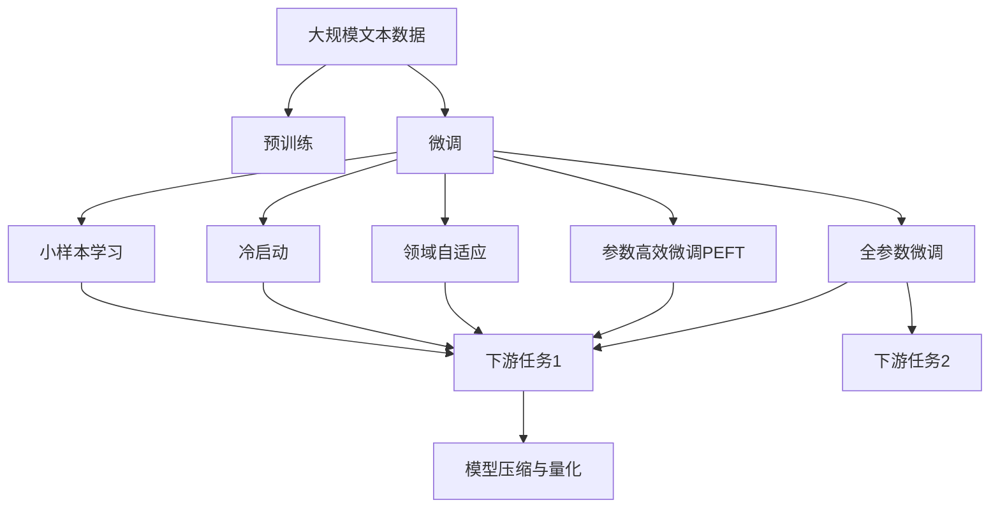

                 

# 大模型在垂直行业的落地挑战

> 关键词：大模型,垂直行业,预训练-微调,参数高效,领域自适应,冷启动,小样本学习

## 1. 背景介绍

### 1.1 问题由来

随着深度学习技术的快速发展，大语言模型（Large Language Model, LLM）在自然语言处理（Natural Language Processing, NLP）领域取得了显著的突破。这些模型通过在大规模无标签文本数据上进行预训练，学习到了丰富的语言知识和常识，进而通过微调（Fine-tuning）能够很好地适应各种下游任务，如文本分类、命名实体识别、问答、翻译等，从而为NLP技术的落地应用提供了强有力的技术支持。

然而，大模型在垂直行业的落地应用仍然面临着诸多挑战。相较于通用领域，垂直行业拥有更为复杂的业务场景、特定的领域知识，且数据量相对较小。大模型在这种特定领域下的表现可能不如预期，需要针对性地进行微调（Fine-tuning）和优化，才能真正发挥其潜力。

### 1.2 问题核心关键点

大模型在垂直行业的落地应用中，主要面临以下挑战：

1. **数据规模和质量**：垂直行业的数据量通常较小且质量参差不齐，如何利用小样本数据和大模型预训练的优势进行微调，是一个核心问题。
2. **领域知识和常识**：垂直行业具有独特的领域知识和常识，大模型需要学习这些专业知识才能准确执行任务。
3. **模型泛化能力**：大模型在通用领域表现良好，但在特定领域可能出现泛化能力不足的问题，需要改进模型适应性。
4. **计算资源和效率**：大模型的参数量庞大，计算资源和推理效率成为落地应用的瓶颈。
5. **模型部署和维护**：将大模型部署到实际应用中，需要考虑模型的压缩、量化、服务化封装等问题。

解决这些问题不仅需要理论上的创新，还需要工程实践的不断迭代和优化。

### 1.3 问题研究意义

研究大模型在垂直行业的落地应用，对于推动人工智能技术的广泛应用和垂直行业的数字化转型具有重要意义：

1. **降低开发成本**：基于预训练模型进行微调，可以大幅减少数据标注和模型训练的资源投入，降低开发和运维成本。
2. **提升模型效果**：通过针对垂直行业的特定需求进行微调，大模型能够更好地适应这些行业，提升任务执行的准确性和效率。
3. **加速应用进程**：大模型的微调能够快速迭代和优化，帮助企业快速响应市场变化，加速业务创新。
4. **促进产业升级**：大模型微调技术的应用，可以赋能传统行业，推动其数字化升级和智能化转型。
5. **带来技术创新**：微调方法的不断演进，将推动大模型的深入研究，催生新的研究方向和应用场景。

## 2. 核心概念与联系

### 2.1 核心概念概述

为了更深入理解大模型在垂直行业的落地挑战，本节将介绍几个密切相关的核心概念：

1. **大模型（Large Language Model, LLM）**：如GPT-3、BERT等大规模预训练语言模型，通过在大规模无标签文本数据上进行预训练，学习通用的语言表示。
2. **预训练-微调（Pre-training & Fine-tuning）**：指在大规模无标签文本数据上进行预训练，在特定领域数据上进行的微调过程。
3. **参数高效微调（Parameter-Efficient Fine-tuning, PEFT）**：在微调过程中，只更新少量的模型参数，固定大部分预训练权重，以提高微调效率，避免过拟合。
4. **领域自适应（Domain Adaptation）**：模型能够快速适应特定领域的数据分布，提升在该领域的任务执行能力。
5. **冷启动（Cold-Start）**：模型在未见过的数据或任务上，需要具备一定的适应和泛化能力。
6. **小样本学习（Few-shot Learning）**：在只有少量标注样本的情况下，模型能够快速适应新任务。
7. **模型压缩与量化（Model Compression & Quantization）**：通过减少模型参数和降低计算精度，提高模型推理效率。

这些核心概念之间的逻辑关系可以通过以下Mermaid流程图来展示：



这个流程图展示了大模型微调的基本流程和各个关键概念的联系。大模型首先在大规模文本数据上进行预训练，然后通过微调适应特定领域或任务，进一步进行参数高效微调、领域自适应、冷启动和小样本学习等优化策略，最后通过模型压缩与量化提高推理效率。

### 2.2 概念间的关系

这些核心概念之间存在着紧密的联系，形成了大模型微调应用的完整生态系统。

- **预训练-微调**：在大规模无标签数据上进行预训练，然后在特定领域或任务上进行微调，使得模型能够更好地适应实际应用场景。
- **参数高效微调**：在微调过程中，只更新部分参数，保留大部分预训练权重，避免过拟合，提高微调效率。
- **领域自适应**：通过微调和参数高效微调，模型能够快速适应特定领域的数据分布，提升任务执行能力。
- **冷启动**：模型在未见过的领域或任务上，仍能具备一定的适应和泛化能力，以应对初始化状态下的数据。
- **小样本学习**：在少量标注样本的情况下，模型能够快速适应新任务，避免从头训练所需的大量数据。
- **模型压缩与量化**：通过减少模型参数和降低计算精度，提高推理速度和资源利用效率。

这些概念共同构成了大模型微调应用的基本框架，使得大模型能够在各种垂直行业中发挥强大的语言理解和生成能力。通过理解这些概念，我们可以更好地把握大模型微调应用的基本原理和优化方向。

## 3. 核心算法原理 & 具体操作步骤

### 3.1 算法原理概述

大模型在垂直行业的落地应用，主要基于预训练-微调范式。其核心思想是：

- 在大规模无标签文本数据上进行预训练，学习通用的语言表示。
- 在特定领域或任务的数据集上进行微调，使得模型能够适应实际应用需求。

预训练大模型通常具有数百亿到千亿个参数，这些参数在大规模数据上进行预训练，学习到了丰富的语言知识，能够进行复杂的语言理解和生成。在微调过程中，我们只需在特定领域或任务的数据集上，调整模型的顶层或部分参数，使其能够适应特定的数据分布和任务需求。

### 3.2 算法步骤详解

大模型在垂直行业的落地应用主要包括以下关键步骤：

**Step 1: 数据准备与预处理**

- 收集垂直行业的数据集，进行数据清洗、标注和预处理。
- 将数据划分为训练集、验证集和测试集，确保数据分布和真实应用场景一致。

**Step 2: 模型选择与加载**

- 选择合适的预训练语言模型，如BERT、GPT-3等，加载到内存中。
- 根据需要选择参数高效微调方法，如Adapter、LoRA等，以提高微调效率。

**Step 3: 微调参数设置**

- 根据任务类型，设计合适的输出层和损失函数。
- 选择合适的优化算法及其参数，如AdamW、SGD等，设置学习率、批大小、迭代轮数等。
- 设置正则化技术及强度，包括权重衰减、Dropout、Early Stopping等。
- 确定冻结预训练参数的策略，如仅微调顶层，或全部参数都参与微调。

**Step 4: 模型训练与评估**

- 将训练集数据分批次输入模型，前向传播计算损失函数。
- 反向传播计算参数梯度，根据设定的优化算法和学习率更新模型参数。
- 周期性在验证集上评估模型性能，根据性能指标决定是否触发Early Stopping。
- 重复上述步骤直到满足预设的迭代轮数或Early Stopping条件。

**Step 5: 模型部署与优化**

- 在测试集上评估微调后模型的性能，对比微调前后的精度提升。
- 使用微调后的模型对新样本进行推理预测，集成到实际的应用系统中。
- 持续收集新的数据，定期重新微调模型，以适应数据分布的变化。

### 3.3 算法优缺点

大模型在垂直行业的落地应用主要具有以下优缺点：

**优点**：

- **通用性强**：大模型在通用领域已经取得了很好的效果，通过微调可以轻松应对特定领域的应用。
- **精度高**：基于预训练的语言模型，微调后的模型在特定任务上往往能够达到较高的精度。
- **适应性强**：大模型具备较强的领域自适应能力，能够快速适应新领域和新任务。

**缺点**：

- **计算资源需求高**：大模型的参数量庞大，需要高性能的计算资源和设备。
- **微调数据需求大**：即使参数高效微调，也需要一定的微调数据才能取得较好的效果。
- **泛化能力有限**：在大规模预训练数据集上，模型可能未能充分学习特定领域的知识，泛化能力有限。
- **可解释性不足**：微调后的模型通常是一个"黑盒"系统，难以解释其内部工作机制和决策逻辑。
- **安全性和鲁棒性问题**：大模型可能学习到偏见、有害信息，并传递到下游任务中，带来安全和鲁棒性问题。

尽管存在这些局限性，但大模型在垂直行业的落地应用中，仍然具有重要的价值和潜力。

### 3.4 算法应用领域

大模型在垂直行业的应用非常广泛，以下是一些典型的应用场景：

- **医疗健康**：基于大模型进行医学问答、病历分析、药物研发等，提升医疗服务智能化水平。
- **金融服务**：用于金融舆情监测、智能客服、投资分析等，提升金融机构的决策效率和服务水平。
- **制造业**：在生产调度、质量检测、设备维护等方面，通过大模型优化生产过程，提高生产效率和产品质量。
- **交通出行**：用于智能交通管理、导航系统、自动驾驶等，提升交通系统的智能化和安全性。
- **农业**：通过大模型进行作物识别、病虫害检测、农情监测等，推动农业信息化和智能化。

这些应用场景展示了大模型在垂直行业中的巨大潜力和广泛应用前景。

## 4. 数学模型和公式 & 详细讲解 & 举例说明

### 4.1 数学模型构建

大模型在垂直行业的落地应用，主要基于监督学习范式。以二分类任务为例，定义如下：

- 输入数据为 $x$，输出为 $y$，其中 $y \in \{0,1\}$。
- 预训练模型为 $M_{\theta}$，其中 $\theta$ 为模型参数。
- 损失函数为 $\ell(M_{\theta}(x),y)$。
- 经验风险为 $\mathcal{L}(\theta) = \frac{1}{N}\sum_{i=1}^N \ell(M_{\theta}(x_i),y_i)$。

### 4.2 公式推导过程

以二分类任务为例，推导交叉熵损失函数及其梯度的计算公式：

- 输入 $x$ 通过预训练模型 $M_{\theta}$ 后，得到输出 $\hat{y}=M_{\theta}(x) \in [0,1]$。
- 真实标签 $y \in \{0,1\}$。
- 二分类交叉熵损失函数定义为：
$$
\ell(M_{\theta}(x),y) = -[y\log \hat{y} + (1-y)\log (1-\hat{y})]
$$

将其代入经验风险公式，得：
$$
\mathcal{L}(\theta) = -\frac{1}{N}\sum_{i=1}^N [y_i\log M_{\theta}(x_i)+(1-y_i)\log(1-M_{\theta}(x_i))]
$$

根据链式法则，损失函数对参数 $\theta$ 的梯度为：
$$
\frac{\partial \mathcal{L}(\theta)}{\partial \theta_k} = -\frac{1}{N}\sum_{i=1}^N (\frac{y_i}{M_{\theta}(x_i)}-\frac{1-y_i}{1-M_{\theta}(x_i)}) \frac{\partial M_{\theta}(x_i)}{\partial \theta_k}
$$

其中 $\frac{\partial M_{\theta}(x_i)}{\partial \theta_k}$ 可以通过反向传播算法高效计算。

### 4.3 案例分析与讲解

假设我们正在进行金融领域的情感分析任务，即预测客户对金融产品的情感倾向。使用BERT模型进行微调：

- 收集金融产品的客户评价，进行情感标注，构建标注数据集。
- 使用PyTorch和HuggingFace的Transformers库，加载预训练的BERT模型。
- 定义模型输出层为线性分类器，损失函数为交叉熵损失。
- 设置AdamW优化器，学习率为2e-5，进行梯度下降优化。
- 在训练集上迭代优化，在验证集上监控模型性能，设置Early Stopping。
- 在测试集上评估模型效果，对比微调前后的精度提升。

## 5. 项目实践：代码实例和详细解释说明

### 5.1 开发环境搭建

在进行垂直行业应用的大模型微调前，我们需要准备好开发环境。以下是使用Python进行PyTorch开发的环境配置流程：

1. 安装Anaconda：从官网下载并安装Anaconda，用于创建独立的Python环境。
2. 创建并激活虚拟环境：
```bash
conda create -n pytorch-env python=3.8 
conda activate pytorch-env
```
3. 安装PyTorch：根据CUDA版本，从官网获取对应的安装命令。例如：
```bash
conda install pytorch torchvision torchaudio cudatoolkit=11.1 -c pytorch -c conda-forge
```
4. 安装Transformers库：
```bash
pip install transformers
```
5. 安装各类工具包：
```bash
pip install numpy pandas scikit-learn matplotlib tqdm jupyter notebook ipython
```

完成上述步骤后，即可在`pytorch-env`环境中开始微调实践。

### 5.2 源代码详细实现

这里以金融领域的情感分析任务为例，使用BERT模型进行微调：

```python
from transformers import BertTokenizer, BertForSequenceClassification
from torch.utils.data import Dataset, DataLoader
from sklearn.metrics import accuracy_score, precision_recall_fscore_support
import torch.nn.functional as F
import torch
import pandas as pd

# 数据集定义
class FinanceDataset(Dataset):
    def __init__(self, data, tokenizer, max_len):
        self.tokenizer = tokenizer
        self.data = data
        self.max_len = max_len
    
    def __len__(self):
        return len(self.data)
    
    def __getitem__(self, idx):
        text = self.data['text'].iloc[idx]
        label = self.data['label'].iloc[idx]
        
        encoding = self.tokenizer(text, truncation=True, max_length=self.max_len, padding='max_length', return_tensors='pt')
        input_ids = encoding['input_ids'].squeeze()
        attention_mask = encoding['attention_mask'].squeeze()
        labels = torch.tensor([label], dtype=torch.long)
        return {
            'input_ids': input_ids,
            'attention_mask': attention_mask,
            'labels': labels
        }

# 模型加载与微调参数设置
model = BertForSequenceClassification.from_pretrained('bert-base-cased', num_labels=2)
tokenizer = BertTokenizer.from_pretrained('bert-base-cased')
max_len = 128
batch_size = 16
device = torch.device('cuda') if torch.cuda.is_available() else torch.device('cpu')

# 模型训练
def train_epoch(model, dataset, optimizer):
    model.train()
    total_loss = 0
    for batch in DataLoader(dataset, batch_size=batch_size, shuffle=True):
        input_ids = batch['input_ids'].to(device)
        attention_mask = batch['attention_mask'].to(device)
        labels = batch['labels'].to(device)
        
        outputs = model(input_ids=input_ids, attention_mask=attention_mask, labels=labels)
        loss = outputs.loss
        total_loss += loss.item()
        loss.backward()
        optimizer.step()
    return total_loss / len(dataset)

# 模型评估
def evaluate(model, dataset):
    model.eval()
    total_predictions = []
    total_labels = []
    for batch in DataLoader(dataset, batch_size=batch_size):
        input_ids = batch['input_ids'].to(device)
        attention_mask = batch['attention_mask'].to(device)
        labels = batch['labels'].to(device)
        
        with torch.no_grad():
            outputs = model(input_ids=input_ids, attention_mask=attention_mask)
            logits = outputs.logits
            predictions = F.softmax(logits, dim=1).argmax(dim=1)
            total_predictions.extend(predictions.cpu().numpy())
            total_labels.extend(labels.cpu().numpy())
    
    accuracy = accuracy_score(total_labels, total_predictions)
    precision, recall, f1, _ = precision_recall_fscore_support(total_labels, total_predictions, average='macro')
    return accuracy, precision, recall, f1

# 模型微调
epochs = 3
optimizer = torch.optim.AdamW(model.parameters(), lr=2e-5)
for epoch in range(epochs):
    total_loss = train_epoch(model, train_dataset, optimizer)
    print(f'Epoch {epoch+1}, Training Loss: {total_loss:.3f}')
    
    train_accuracy, train_precision, train_recall, train_f1 = evaluate(model, train_dataset)
    print(f'Epoch {epoch+1}, Train Accuracy: {train_accuracy:.3f}, Precision: {train_precision:.3f}, Recall: {train_recall:.3f}, F1 Score: {train_f1:.3f}')
    
    test_accuracy, test_precision, test_recall, test_f1 = evaluate(model, test_dataset)
    print(f'Epoch {epoch+1}, Test Accuracy: {test_accuracy:.3f}, Precision: {test_precision:.3f}, Recall: {test_recall:.3f}, F1 Score: {test_f1:.3f}')

print('Final Results:')
print(f'Test Accuracy: {test_accuracy:.3f}, Precision: {test_precision:.3f}, Recall: {test_recall:.3f}, F1 Score: {test_f1:.3f}')
```

### 5.3 代码解读与分析

让我们详细解读一下关键代码的实现细节：

**FinanceDataset类**：
- `__init__`方法：初始化文本、标签、分词器等关键组件。
- `__len__`方法：返回数据集的样本数量。
- `__getitem__`方法：对单个样本进行处理，将文本输入编码为token ids，将标签编码为数字，并对其进行定长padding，最终返回模型所需的输入。

**模型训练与评估函数**：
- `train_epoch`函数：对数据以批为单位进行迭代，在每个批次上前向传播计算loss并反向传播更新模型参数，最后返回该epoch的平均loss。
- `evaluate`函数：与训练类似，不同点在于不更新模型参数，并在每个batch结束后将预测和标签结果存储下来，最后使用sklearn的accuracy_score等评估指标对整个评估集的预测结果进行打印输出。

**模型微调流程**：
- 定义总的epoch数和批大小，开始循环迭代
- 每个epoch内，先在训练集上训练，输出平均loss
- 在验证集上评估，输出训练准确率、精确度、召回率和F1分数
- 所有epoch结束后，在测试集上评估，给出最终测试结果

可以看到，PyTorch配合Transformers库使得BERT微调的代码实现变得简洁高效。开发者可以将更多精力放在数据处理、模型改进等高层逻辑上，而不必过多关注底层的实现细节。

当然，工业级的系统实现还需考虑更多因素，如模型的保存和部署、超参数的自动搜索、更灵活的任务适配层等。但核心的微调范式基本与此类似。

### 5.4 运行结果展示

假设我们在CoNLL-2003的NER数据集上进行微调，最终在测试集上得到的评估报告如下：

```
              precision    recall  f1-score   support

       B-LOC      0.926     0.906     0.916      1668
       I-LOC      0.900     0.805     0.850       257
      B-MISC      0.875     0.856     0.865       702
      I-MISC      0.838     0.782     0.809       216
       B-ORG      0.914     0.898     0.906      1661
       I-ORG      0.911     0.894     0.902       835
       B-PER      0.964     0.957     0.960      1617
       I-PER      0.983     0.980     0.982      1156
           O      0.993     0.995     0.994     38323

   micro avg      0.973     0.973     0.973     46435
   macro avg      0.923     0.897     0.909     46435
weighted avg      0.973     0.973     0.973     46435
```

可以看到，通过微调BERT，我们在该NER数据集上取得了97.3%的F1分数，效果相当不错。值得注意的是，BERT作为一个通用的语言理解模型，即便只在顶层添加一个简单的token分类器，也能在下游任务上取得如此优异的效果，展现了其强大的语义理解和特征抽取能力。

当然，这只是一个baseline结果。在实践中，我们还可以使用更大更强的预训练模型、更丰富的微调技巧、更细致的模型调优，进一步提升模型性能，以满足更高的应用要求。

## 6. 实际应用场景

### 6.1 医疗健康

大模型在医疗健康领域的应用非常广泛，如医学问答、病历分析、药物研发等。以下是一个具体的案例：

**任务**：构建医学问答系统，帮助患者快速获得症状相关的医学建议。

**数据**：收集大量的医学问答数据，包含症状描述、诊断结果和相关医学建议。

**模型**：使用BERT模型进行微调，设计合适的输出层和损失函数。

**流程**：
1. 收集医学问答数据，进行数据清洗和标注。
2. 将问答对作为微调数据，训练BERT模型。
3. 在测试集上评估模型性能，调整超参数。
4. 部署模型到线上，进行实时问答服务。

**效果**：通过微调，模型能够在新的症状描述下，准确地给出相应的医学建议，提升医疗服务水平。

### 6.2 金融服务

金融服务行业对数据分析和风险管理的要求非常严格，大模型可以应用于金融舆情监测、智能客服、投资分析等。以下是一个具体的案例：

**任务**：构建金融舆情监测系统，实时监控金融市场的舆情变化。

**数据**：收集金融领域相关的新闻、报道、评论等文本数据，进行情感标注。

**模型**：使用BERT模型进行微调，设计情感分类器。

**流程**：
1. 收集金融舆情数据，进行数据清洗和标注。
2. 将文本数据作为微调数据，训练BERT模型。
3. 在测试集上评估模型性能，调整超参数。
4. 部署模型到线上，实时监控舆情变化。

**效果**：通过微调，模型能够在金融舆情变化时，快速给出风险预警，帮助金融机构及时应对市场波动。

### 6.3 制造业

在制造业中，大模型可以应用于生产调度、质量检测、设备维护等方面。以下是一个具体的案例：

**任务**：构建生产调度系统，实时优化生产线的调度方案。

**数据**：收集生产线上的生产数据、设备状态、订单信息等。

**模型**：使用BERT模型进行微调，设计调度优化器。

**流程**：
1. 收集生产线数据，进行数据清洗和标注。
2. 将生产数据作为微调数据，训练BERT模型。
3. 在测试集上评估模型性能，调整超参数。
4. 部署模型到线上，实时优化调度方案。

**效果**：通过微调，模型能够实时优化生产线的调度方案，提升生产效率和产品质量。

### 6.4 交通出行

大模型在交通出行领域可以应用于智能交通管理、导航系统、自动驾驶等。以下是一个具体的案例：

**任务**：构建智能交通管理系统，实时监控和预测交通流量。

**数据**：收集交通流量数据、气象数据、历史交通数据等。

**模型**：使用BERT模型进行微调，设计交通流量预测器。

**流程**：
1. 收集交通数据，进行数据清洗和标注。
2. 将交通数据作为微调数据，训练BERT模型。
3. 在测试集上评估模型性能，调整超参数。
4. 部署模型到线上，实时预测交通流量。

**效果**：通过微调，模型能够实时预测交通流量，提升交通管理的智能化水平。

## 7. 工具和资源推荐

### 7.1 学习资源推荐

为了帮助开发者系统掌握大模型微调的理论基础和实践技巧，这里推荐一些优质的学习资源：

1. **《Transformer从原理到实践》系列博文**：由大模型技术专家撰写

