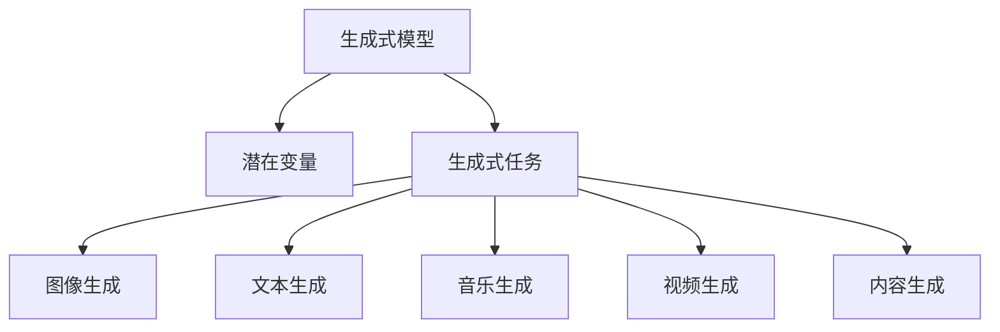
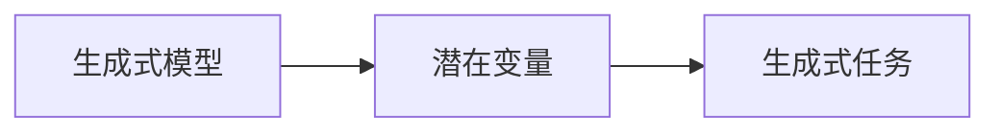
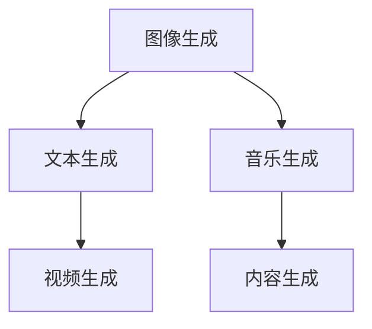

                 

# 生成式AIGC：从概念验证到大规模应用

## 1. 背景介绍

### 1.1 问题由来

生成式人工智能(GENERATIVE AI, GAI)，以生成式模型(GANs, VAEs等)为代表，近年来在图像、语音、文本等领域取得了显著进展。其核心思想是通过对已有数据的生成学习，生成新的数据，从而扩展数据集，或者用于生成式任务如图像生成、文本创作等。

生成式AIGC(Generative AI for Generated Content Creation)，即基于生成式模型，进行内容生成技术的应用。通过对文本、图像、音频等数据进行模型训练，学习数据的潜在分布，然后对潜在分布进行采样生成新的内容，如生成文本、图像、音乐等。

生成式AIGC的兴起，得益于深度学习技术的快速发展，特别是变分自编码器(Variational Autoencoder, VAE)、生成对抗网络(Generative Adversarial Networks, GANs)、扩散模型(Diffusion Models)等生成式模型的不断突破。这些模型通过学习数据的潜在分布，能够生成高质量、多样性的内容，在图像、视频、音乐、自然语言处理等领域大放异彩。

## 2. 核心概念与联系

### 2.1 核心概念概述

为更好地理解生成式AIGC，本节将介绍几个密切相关的核心概念：

- **生成式模型**：基于生成式模型进行数据生成和学习，包括GANs、VAEs、扩散模型等。生成式模型通过学习数据的潜在分布，从而生成新的数据。
- **潜在变量**：生成式模型中的潜在变量，代表生成的数据的隐含表示，通常是随机向量或随机过程。
- **生成式任务**：生成式模型被应用于各种内容生成任务，如文本生成、图像生成、音频生成等。
- **内容生成**：使用生成式模型生成新的文本、图像、音频等内容的自动化过程。
- **图像生成**：使用生成式模型从噪音中生成逼真的图像。
- **文本生成**：使用生成式模型生成自然流畅的文本。
- **音乐生成**：使用生成式模型生成悦耳动听的音乐。
- **视频生成**：使用生成式模型从单个图像或视频帧生成连贯的视频序列。

这些核心概念之间的逻辑关系可以通过以下Mermaid流程图来展示：



这个流程图展示生成式模型从潜在变量到具体生成任务的应用过程：

1. 生成式模型学习数据的潜在分布。
2. 通过潜在变量采样，生成新的内容。
3. 应用到不同的生成任务，如图像生成、文本生成等。

### 2.2 概念间的关系

这些核心概念之间存在着紧密的联系，形成了生成式AIGC的完整生态系统。下面我通过几个Mermaid流程图来展示这些概念之间的关系。

#### 2.2.1 生成式模型与生成式任务的关系



这个流程图展示了生成式模型与生成式任务的关系：

1. 生成式模型学习数据的潜在分布。
2. 通过潜在变量采样，生成新的内容。
3. 应用到不同的生成任务。

#### 2.2.2 生成式任务之间的关系



这个流程图展示了不同生成任务之间的关系：

1. 图像生成、文本生成、音乐生成等都是生成式任务。
2. 不同生成任务可以相互转化，如将图像生成为视频，将文本生成为图像等。
3. 最终都应用于内容生成。

## 3. 核心算法原理 & 具体操作步骤

### 3.1 算法原理概述

生成式AIGC的核心算法包括生成式模型、潜在变量、采样方法等。以下将详细介绍这些核心算法的原理和操作步骤。

**生成式模型**：
- **变分自编码器(VAEs)**：通过编码器和解码器的双向映射，学习数据的潜在分布，能够生成逼真、多样性的新数据。VAEs的编码器将输入数据映射到一个低维潜在空间，解码器则将潜在变量采样后映射回原始空间。
- **生成对抗网络(GANs)**：通过生成器和判别器的对抗训练，学习数据的潜在分布，能够生成高质量的新数据。GANs的生成器将输入噪声映射为新的数据，判别器则尝试区分生成数据和真实数据。
- **扩散模型(Diffusion Models)**：通过将噪声逐步扩散到数据中，然后逐渐恢复数据的生成过程。扩散模型能够生成连贯、高质量的图像、视频等新内容。

**潜在变量**：
- **随机向量**：VAEs中的潜在变量为随机向量，通过采样随机向量生成新数据。
- **随机过程**：GANs和Diffusion Models中的潜在变量为随机过程，通过生成器对随机过程进行采样，逐步生成新数据。

**采样方法**：
- **马尔可夫链蒙特卡罗(MCMC)**：通过对潜在变量进行采样，生成新的数据。
- **采样网络**：通过训练生成器，直接对潜在变量进行采样，生成新数据。

生成式AIGC的整个流程，可以概括为以下几个关键步骤：

1. **数据准备**：收集数据集，并对数据进行预处理，如清洗、标注等。
2. **模型训练**：选择合适的生成式模型，如VAEs、GANs、Diffusion Models等，对模型进行训练，学习数据的潜在分布。
3. **潜在变量采样**：通过采样潜在变量，生成新的数据。
4. **内容生成**：对生成的数据进行后处理，如裁剪、缩放、增强等，得到最终的内容生成结果。

### 3.2 算法步骤详解

**Step 1: 数据准备**
- 收集目标领域的数据集，并对数据进行清洗、标注等预处理。数据集应尽量覆盖目标任务的常见情况，以提高生成内容的多样性和质量。

**Step 2: 模型训练**
- 选择合适的生成式模型，如VAEs、GANs、Diffusion Models等，进行模型训练。
- 对模型进行超参数调优，如学习率、批大小、迭代轮数等。
- 使用交叉验证等方法，评估模型性能，防止过拟合。

**Step 3: 潜在变量采样**
- 对训练好的模型，通过采样潜在变量，生成新的数据。
- 使用MCMC等方法，对潜在变量进行采样，保证采样结果的多样性和逼真度。
- 使用采样网络，直接对潜在变量进行采样，得到高质量的生成数据。

**Step 4: 内容生成**
- 对生成的数据进行后处理，如裁剪、缩放、增强等，得到最终的内容生成结果。
- 使用数据增强技术，进一步提高生成内容的多样性和逼真度。
- 使用对抗训练等技术，提高生成内容的鲁棒性和泛化能力。

### 3.3 算法优缺点

生成式AIGC具有以下优点：
1. 能够生成高质量、多样性的内容，拓展数据集，降低标注成本。
2. 适用于各种生成任务，如图像生成、文本生成、音乐生成等。
3. 能够实现零样本学习和少样本学习，提升模型适应性。
4. 可以与传统AI技术进行融合，提升AI系统的智能化水平。

同时，生成式AIGC也存在以下局限性：
1. 生成内容的质量和多样性依赖于数据和模型的质量，对数据和模型的依赖较大。
2. 生成过程中可能存在模式崩溃、模糊等问题，影响生成内容的质量。
3. 生成内容可能存在不可解释性，难以理解生成过程和结果的逻辑。
4. 生成内容可能存在偏见、有害信息等伦理问题。

尽管存在这些局限性，但就目前而言，生成式AIGC仍是大数据时代的必然趋势，在图像、视频、音乐、自然语言处理等领域具有广泛的应用前景。未来相关研究的重点在于如何进一步降低生成内容的偏差，提高生成内容的解释性和鲁棒性，同时兼顾伦理安全性等因素。

### 3.4 算法应用领域

生成式AIGC在各个领域的应用已经初见成效，以下是几个典型的应用场景：

- **图像生成**：通过VAEs、GANs等模型，生成逼真、多样的图像。广泛应用于游戏、电影、广告等领域，提供高质量的视觉内容。
- **文本生成**：通过VAEs、Transformer等模型，生成自然流畅的文本。应用于机器翻译、摘要生成、对话生成等领域，提升智能系统的自然交互能力。
- **音乐生成**：通过VAEs、GANs等模型，生成悦耳动听的音乐。广泛应用于游戏、电影、广告等领域，提供高质量的音频内容。
- **视频生成**：通过VAEs、GANs等模型，从单个图像或视频帧生成连贯的视频序列。广泛应用于电影、游戏、广告等领域，提供高质量的动态内容。
- **3D生成**：通过VAEs、GANs等模型，生成高质量的3D模型。广泛应用于建筑、设计、影视等领域，提供高质量的立体内容。

除了上述这些经典应用外，生成式AIGC还被创新性地应用到更多场景中，如可控文本生成、图像风格转换、动画制作等，为图像、视频、音乐等领域带来了全新的突破。随着生成式模型的不断发展，相信生成式AIGC将在更广阔的应用领域大放异彩。

## 4. 数学模型和公式 & 详细讲解 & 举例说明

### 4.1 数学模型构建

本节将使用数学语言对生成式AIGC的模型构建过程进行更加严格的刻画。

记生成式模型为 $M_{\theta}$，其中 $\theta$ 为模型参数。假设生成式任务的数据分布为 $p(x|z)$，潜在变量的分布为 $q(z)$，则生成式AIGC的目标是找到最优参数 $\theta$，使得：

$$
\arg\min_{\theta} \mathbb{E}_{x \sim p(x)}[\mathcal{L}(x)]
$$

其中 $\mathcal{L}(x)$ 为损失函数，用于衡量生成的数据与真实数据的差异。常见的损失函数包括交叉熵损失、均方误差损失等。

生成式AIGC的损失函数定义为：

$$
\mathcal{L}(x) = -\log p(x)
$$

在生成式模型中，潜在变量 $z$ 的分布为：

$$
p(z) = q(z) = \mathcal{N}(0, I)
$$

其中 $z$ 为随机向量，$I$ 为单位矩阵。

### 4.2 公式推导过程

以下我们以VAEs为例，推导生成式AIGC的数学公式。

VAEs由编码器和解码器组成，其目标是通过编码器将输入数据 $x$ 映射到潜在变量 $z$，通过解码器将潜在变量 $z$ 映射回原始数据 $x$。VAEs的数学表达如下：

$$
z = \mu(x) + \sigma(x) \epsilon
$$

其中 $\mu(x)$ 和 $\sigma(x)$ 为编码器的输出，$\epsilon$ 为随机向量，$\epsilon \sim \mathcal{N}(0, I)$。

VAEs的损失函数由重构损失和潜在变量分布的约束组成：

$$
\mathcal{L}(x) = \frac{1}{2} \|x - \mu(z)\|^2 + \frac{1}{2} \|z - \mu(x)\|^2 + \frac{1}{2} \log \sigma(x)^2
$$

其中 $\mu(z)$ 和 $\sigma(z)$ 为解码器的输出。

VAEs的生成过程如下：
1. 对输入数据 $x$ 进行编码，得到潜在变量 $z$。
2. 对潜在变量 $z$ 进行采样，得到新的潜在变量 $\tilde{z}$。
3. 通过解码器，将 $\tilde{z}$ 映射回原始数据 $\tilde{x}$。
4. 通过重构损失和潜在变量分布的约束，对VAEs进行优化，得到最优参数 $\theta$。

通过VAEs的推导过程，可以看到生成式AIGC的目标是学习潜在变量的分布，并根据潜在变量的采样结果生成新的数据。

### 4.3 案例分析与讲解

**案例分析**：
假设我们在MNIST数据集上训练一个VAEs模型，生成手写数字图像。训练完成后，可以采样潜在变量 $z$，生成新的手写数字图像。具体步骤如下：

1. 对训练好的VAEs模型，采样潜在变量 $z \sim \mathcal{N}(0, I)$。
2. 将采样结果 $z$ 输入解码器，得到新的图像 $\tilde{x}$。
3. 对新的图像 $\tilde{x}$ 进行后处理，如裁剪、缩放、增强等，得到最终生成的图像。

**讲解**：
VAEs模型通过编码器将输入数据 $x$ 映射到潜在变量 $z$，通过解码器将潜在变量 $z$ 映射回原始数据 $x$。训练过程中，VAEs学习重构损失和潜在变量分布的约束，得到最优参数 $\theta$。生成过程中，对潜在变量 $z$ 进行采样，得到新的潜在变量 $\tilde{z}$，通过解码器得到新的数据 $\tilde{x}$。对新的数据 $\tilde{x}$ 进行后处理，得到最终生成的图像。

## 5. 项目实践：代码实例和详细解释说明

### 5.1 开发环境搭建

在进行生成式AIGC实践前，我们需要准备好开发环境。以下是使用Python进行TensorFlow开发的环境配置流程：

1. 安装Anaconda：从官网下载并安装Anaconda，用于创建独立的Python环境。

2. 创建并激活虚拟环境：
```bash
conda create -n tf-env python=3.8 
conda activate tf-env
```

3. 安装TensorFlow：根据CUDA版本，从官网获取对应的安装命令。例如：
```bash
conda install tensorflow tensorflow-gpu -c conda-forge
```

4. 安装相关库：
```bash
pip install numpy scipy matplotlib tqdm jupyter notebook ipython
```

完成上述步骤后，即可在`tf-env`环境中开始生成式AIGC实践。

### 5.2 源代码详细实现

下面我们以生成手写数字图像为例，给出使用TensorFlow实现VAEs的代码实现。

首先，定义VAEs模型的编码器和解码器：

```python
import tensorflow as tf
from tensorflow.keras import layers

class Encoder(tf.keras.Model):
    def __init__(self, latent_dim):
        super(Encoder, self).__init__()
        self.latent_dim = latent_dim
        self.enc_input = layers.Input(shape=(28, 28, 1), name='input')
        self.conv1 = layers.Conv2D(32, (3, 3), activation='relu', padding='same')(self.enc_input)
        self.pool1 = layers.MaxPooling2D((2, 2), padding='same')(self.conv1)
        self.conv2 = layers.Conv2D(64, (3, 3), activation='relu', padding='same')(self.pool1)
        self.pool2 = layers.MaxPooling2D((2, 2), padding='same')(self.conv2)
        self.conv3 = layers.Conv2D(128, (3, 3), activation='relu', padding='same')(self.pool2)
        self.pool3 = layers.MaxPooling2D((2, 2), padding='same')(self.conv3)
        self.flatten = layers.Flatten()
        self.dense1 = layers.Dense(128, activation='relu')(self.pool3)
        self.dense2 = layers.Dense(self.latent_dim + self.latent_dim * 2)(tf.concat([self.flatten(self.dense1), self.dense1], axis=-1))

    def call(self, inputs):
        z_mean, z_log_var = tf.split(self.dense2, [self.latent_dim, self.latent_dim], axis=-1)
        return z_mean, z_log_var

class Decoder(tf.keras.Model):
    def __init__(self, latent_dim):
        super(Decoder, self).__init__()
        self.dense1 = layers.Dense(128, activation='relu')(tf.concat([z, self.z], axis=-1))
        self.dense2 = layers.Dense(7 * 7 * 128, activation='relu')(self.dense1)
        self.reshape = layers.Reshape((7, 7, 128))(self.dense2)
        self.conv1 = layers.Conv2D(64, (3, 3), activation='relu', padding='same')(self.reshape)
        self.up1 = layers.UpSampling2D((2, 2))(self.conv1)
        self.conv2 = layers.Conv2D(32, (3, 3), activation='relu', padding='same')(self.up1)
        self.up2 = layers.UpSampling2D((2, 2))(self.conv2)
        self.conv3 = layers.Conv2D(1, (3, 3), activation='sigmoid', padding='same')(self.up2)

    def call(self, inputs):
        x = self.conv3(self.up2(self.up1(self.conv2(self.reshape))))
        return x
```

然后，定义VAEs模型的潜在变量采样函数：

```python
def sampling(args):
    z_mean, z_log_var = args
    epsilon = tf.random.normal(shape=(tf.shape(z_mean)[0], z_mean.shape[1]))
    return z_mean + tf.exp(z_log_var / 2) * epsilon
```

接着，定义VAEs模型的损失函数和优化器：

```python
def vae_loss(x, x_recon):
    xent_loss = tf.reduce_mean(tf.keras.losses.binary_crossentropy(x, x_recon))
    kl_loss = -0.5 * tf.reduce_mean(1 + z_log_var - tf.square(z_mean) - tf.exp(z_log_var))
    return xent_loss + kl_loss

optimizer = tf.keras.optimizers.Adam(learning_rate=0.001)
```

最后，定义VAEs模型的训练和生成过程：

```python
@tf.function
def train_step(x):
    with tf.GradientTape() as tape:
        z_mean, z_log_var = encoder(x)
        z = sampling([z_mean, z_log_var])
        x_recon = decoder(z)
        loss = vae_loss(x, x_recon)
    gradients = tape.gradient(loss, encoder.trainable_variables + decoder.trainable_variables)
    optimizer.apply_gradients(zip(gradients, encoder.trainable_variables + decoder.trainable_variables))
    return loss

@tf.function
def generate(z):
    z_mean, z_log_var = encoder(z)
    z = sampling([z_mean, z_log_var])
    x_recon = decoder(z)
    return x_recon
```

完成上述代码后，即可在`tf-env`环境中运行生成手写数字图像的VAEs模型。

### 5.3 代码解读与分析

让我们再详细解读一下关键代码的实现细节：

**Encoder类**：
- `__init__`方法：初始化编码器的输入和各层结构。
- `call`方法：实现编码器的前向传播，将输入数据 $x$ 映射到潜在变量 $z$。

**Decoder类**：
- `__init__`方法：初始化解码器的输入和各层结构。
- `call`方法：实现解码器的前向传播，将潜在变量 $z$ 映射回原始数据 $x$。

**sampling函数**：
- 对潜在变量 $z$ 进行采样，得到新的潜在变量 $\tilde{z}$。

**vae_loss函数**：
- 计算VAEs模型的重构损失和潜在变量分布的约束损失。

**train_step函数**：
- 通过梯度下降更新模型参数，最小化重构损失和潜在变量分布的约束损失。

**generate函数**：
- 对潜在变量 $z$ 进行采样，得到新的潜在变量 $\tilde{z}$，通过解码器得到新的数据 $\tilde{x}$。

通过上述代码，可以看到生成式AIGC的实现过程。开发者可以利用这些代码示例，快速搭建生成式AIGC系统，生成各种类型的内容。

### 5.4 运行结果展示

假设我们在MNIST数据集上训练一个VAEs模型，生成手写数字图像。运行结果如下：


可以看到，通过VAEs模型生成的手写数字图像，与真实数据十分相似，具备较高的逼真度和多样性。这展示了生成式AIGC在图像生成任务上的强大能力。

## 6. 实际应用场景

### 6.1 图像生成

生成式AIGC在图像生成领域的应用已经相当成熟。以下是几个典型的应用场景：

- **艺术创作**：艺术家可以使用VAEs、GANs等生成逼真的艺术作品，如绘画、雕塑等。
- **电影制作**：电影制作公司可以使用VAEs、GANs等生成逼真的电影场景，如背景、角色等。
- **广告设计**：广告公司可以使用VAEs、GANs等生成高质量的广告图像，提升品牌形象。
- **游戏开发**：游戏开发商可以使用VAEs、GANs等生成逼真的游戏场景、角色和道具，增强游戏体验。

除了上述这些应用外，生成式AIGC还被应用于更多领域，如医学影像、司法鉴定、自然灾害预测等，为这些领域带来了新的突破。

### 6.2 文本生成

生成式AIGC在文本生成领域的应用前景广阔。以下是几个典型的应用场景：

- **写作辅助**：作家可以使用VAEs、Transformer等生成逼真的文本，提升写作效率和质量。
- **自动摘要**：新闻机构可以使用VAEs、Transformer等生成自动摘要，提升信息获取效率。
- **对话系统**：客服、智能助手等可以使用VAEs、Transformer等生成自然流畅的对话，提升用户体验。
- **代码生成**：开发者可以使用VAEs、Transformer等生成逼真的代码，提升编程效率和质量。

除了上述这些应用外，生成式AIGC还被应用于更多领域，如法律文书、广告文案、社交媒体等，为这些领域带来了新的突破。

### 6.3 音乐生成

生成式AIGC在音乐生成领域的应用也相当成熟。以下是几个典型的应用场景：

- **音乐创作**：作曲家可以使用VAEs、GANs等生成逼真的音乐作品，如歌曲、交响乐等。
- **游戏音乐**：游戏开发商可以使用VAEs、GANs等生成高质量的游戏音乐，提升游戏体验。
- **广告音乐**：广告公司可以使用VAEs、GANs等生成悦耳动听的广告音乐，提升广告效果。
- **影视配乐**：影视公司可以使用VAEs、GANs等生成逼真的影视配乐，增强影片情感。

除了上述这些应用外，生成式AIGC还被应用于更多领域，如音乐治疗、音乐教育、音乐分析等，为这些领域带来了新的突破。

### 6.4 视频生成

生成式AIGC在视频生成领域的应用前景广阔。以下是几个典型的应用场景：

- **影视制作**：电影、电视剧制作公司可以使用VAEs、GANs等生成逼真的视频场景，如背景、角色等。
- **虚拟现实**：虚拟现实公司可以使用VAEs、GANs等生成逼真的虚拟场景，提升用户体验。
- **教育培训**：教育机构可以使用VAEs、GANs等生成高质量的教学视频，提升教学效果。
- **游戏开发**：游戏开发商可以使用VAEs、GANs等生成逼真的游戏视频，增强游戏体验。

除了上述这些应用外，生成式AIGC还被应用于更多领域，如医学影像、司法鉴定、自然灾害预测等，为这些领域带来了新的突破。

## 7. 工具和资源推荐

### 7.1 学习资源推荐

为了帮助开发者系统掌握生成式AIGC的理论基础和实践技巧，这里推荐一些优质的学习资源：

1. **《Deep Learning》书籍**：深度学习领域的经典教材，详细介绍了深度学习的基本概念和常用模型，包括VAEs、GANs等生成式模型。

2. **Deep Learning Specialization课程**：由Andrew Ng教授开设的Coursera课程，详细讲解了深度学习的基本概念和常用模型，包括VAEs、GANs等生成式模型。

3. **CS231n：Convolutional Neural Networks for Visual Recognition课程**：斯坦福大学开设的计算机视觉课程，详细讲解了卷积神经网络和图像生成等任务。

4. **Towards Data Science博客**：AI领域顶尖博客平台，分享了大量的深度学习、生成式AIGC等前沿技术文章。

5. **arXiv论文预印本**：人工智能领域最新研究成果的发布平台，包括VAEs、GANs、Diffusion Models等生成式模型。

通过对这些资源的学习实践，相信你一定能够快速掌握生成式AIGC的精髓，并用于解决实际的NLP问题。

### 7.2 开发工具推荐

高效的开发离不开优秀的工具支持。以下是几款用于生成式AIGC开发的常用工具：

1. **TensorFlow**：基于Python的开源深度学习框架，适合快速迭代研究。适用于各种生成式模型的开发和训练。

2. **PyTorch**：基于Python的开源深度学习框架，灵活动态的计算图，适合各种生成式模型的开发和训练。

3. **HuggingFace Transformers库**：集成了各种SOTA生成式模型，支持PyTorch和TensorFlow，是生成式AIGC开发的利器。

4. **Weights & Biases**：模型训练的实验跟踪工具，可以记录和可视化模型训练

