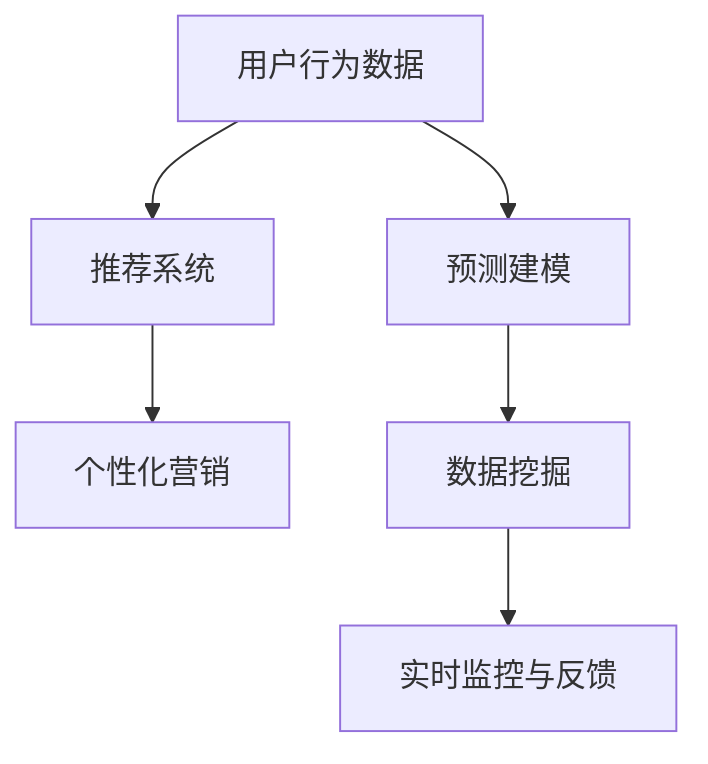
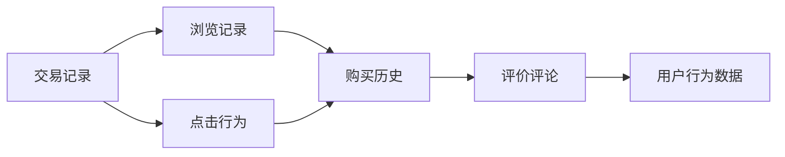
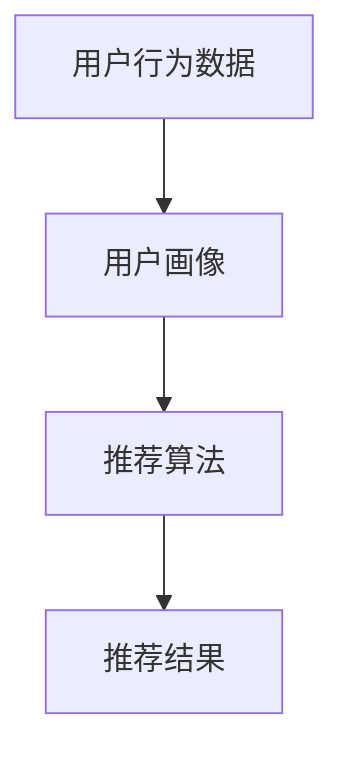
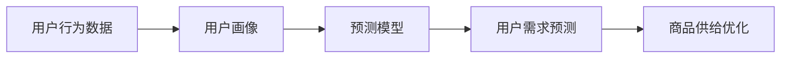
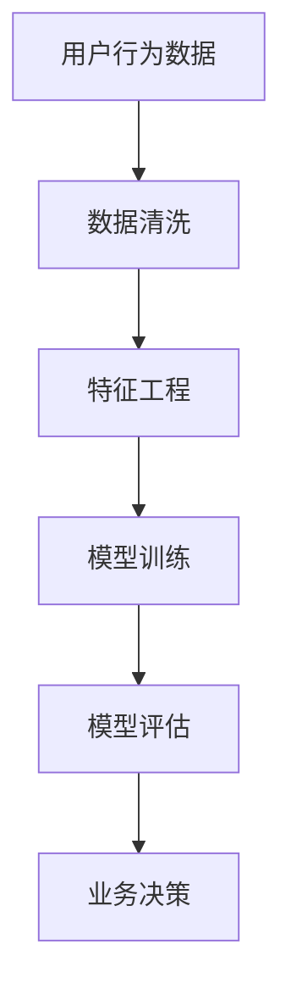
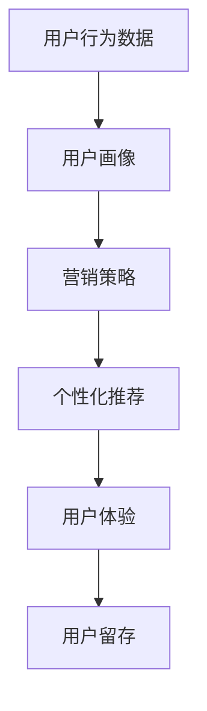
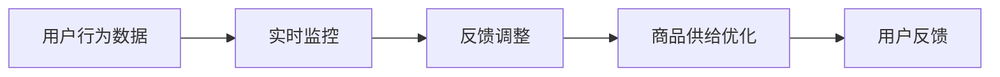
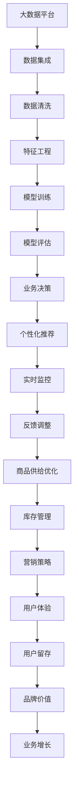

                 

# 用户行为分析：AI优化商品供给

> 关键词：
1. AI用户行为分析
2. 商品供给优化
3. 推荐系统
4. 预测建模
5. 数据挖掘
6. 个性化营销
7. 实时监控与反馈

## 1. 背景介绍

### 1.1 问题由来

随着电子商务的蓬勃发展，线上交易平台的商品供给面临着越来越复杂的需求挑战。用户行为分析（User Behavior Analysis）成为了优化商品供给的关键手段。传统的用户行为分析方法往往依赖于手动统计和定性分析，效率低、成本高，难以满足大规模数据和实时性需求。随着人工智能技术的发展，利用AI技术进行用户行为分析，从海量数据中挖掘用户需求，优化商品供给，成为电商领域的热门话题。

### 1.2 问题核心关键点

基于AI的用户行为分析，旨在利用机器学习、深度学习和自然语言处理等技术，从用户行为数据中挖掘出有价值的信息，以预测用户需求、优化商品供给、提升用户体验。

核心关键点包括：

- 数据获取与处理：从各种数据源（如交易记录、搜索记录、评价评论等）获取用户行为数据，并进行数据清洗、特征工程等预处理工作。
- 模型训练与评估：选择合适的机器学习模型（如回归模型、分类模型、序列模型等），利用标注数据进行训练和评估，以提高模型的预测精度。
- 结果应用与反馈：将训练好的模型应用于实际业务场景，进行用户需求预测、商品推荐、库存优化等，并根据用户反馈不断调整模型，以进一步提升效果。

### 1.3 问题研究意义

在电商平台上，用户行为分析可以显著提升商品供给的准确性和效率，减少库存积压和缺货风险，提高用户满意度和留存率，增加销售额。通过深入挖掘用户行为模式，电商平台还可以实现个性化营销，提升品牌价值，形成良性循环。

用户行为分析的研究，对于电商平台优化商品供给、提升运营效率具有重要意义：

1. **提升销售转化率**：通过预测用户需求，电商平台可以优化商品陈列、促销策略，提高用户购买意愿。
2. **减少库存成本**：精准预测需求，减少过剩和缺货情况，降低库存成本和物流成本。
3. **增强用户体验**：基于用户行为分析，进行个性化推荐，提升用户体验和满意度。
4. **优化广告投放**：通过分析用户行为，精准定位目标用户，提高广告投放的ROI。
5. **挖掘潜在市场**：通过用户行为数据，发现新的市场机会和用户需求，推动业务创新。

## 2. 核心概念与联系

### 2.1 核心概念概述

为更好地理解基于AI的用户行为分析方法，本节将介绍几个关键概念：

- **用户行为数据**：指用户在电商平台上的各类操作记录，包括浏览记录、点击行为、购买历史、评价评论等。
- **推荐系统**：利用用户行为数据，预测用户需求，为用户推荐可能感兴趣的商品。
- **预测建模**：通过机器学习模型，从用户行为数据中学习用户偏好，预测用户未来行为。
- **数据挖掘**：从大量数据中提取有价值的信息，用于支持业务决策。
- **个性化营销**：根据用户行为数据，制定个性化的营销策略，提升用户黏性和忠诚度。
- **实时监控与反馈**：利用AI技术实时监控用户行为，根据反馈不断调整策略，优化商品供给。

这些核心概念之间的逻辑关系可以通过以下Mermaid流程图来展示：



这个流程图展示了几大核心概念之间的关系：

1. **用户行为数据**：作为基础数据源，支持推荐系统、预测建模、数据挖掘和实时监控与反馈。
2. **推荐系统**：利用用户行为数据，为用户推荐可能感兴趣的商品，提升用户体验。
3. **预测建模**：通过分析用户行为数据，预测用户需求，优化商品供给。
4. **数据挖掘**：从用户行为数据中挖掘有价值的信息，支持业务决策。
5. **个性化营销**：根据用户行为数据，制定个性化的营销策略，提升用户黏性。
6. **实时监控与反馈**：实时监控用户行为，根据反馈不断调整策略，优化商品供给。

### 2.2 概念间的关系

这些核心概念之间存在着紧密的联系，形成了基于AI的用户行为分析的完整生态系统。下面我们通过几个Mermaid流程图来展示这些概念之间的关系。

#### 2.2.1 用户行为数据的来源



这个流程图展示了用户行为数据的几个主要来源，包括交易记录、浏览记录、点击行为、购买历史、评价评论等。这些数据可以全面反映用户在不同场景下的行为模式。

#### 2.2.2 推荐系统的构建



这个流程图展示了推荐系统的构建过程，从用户行为数据中提取用户画像，利用推荐算法生成推荐结果。用户画像可以帮助推荐系统更准确地预测用户需求。

#### 2.2.3 预测建模的应用



这个流程图展示了预测建模的应用场景，从用户行为数据中提取用户画像，训练预测模型，生成用户需求预测，优化商品供给。

#### 2.2.4 数据挖掘的流程



这个流程图展示了数据挖掘的流程，从用户行为数据中提取、清洗、特征工程、模型训练和评估，最终支持业务决策。

#### 2.2.5 个性化营销的实现



这个流程图展示了个性化营销的实现过程，从用户行为数据中提取用户画像，制定营销策略，进行个性化推荐，提升用户体验，增加用户留存。

#### 2.2.6 实时监控与反馈的机制



这个流程图展示了实时监控与反馈的机制，从用户行为数据中实时监控用户行为，根据反馈不断调整策略，优化商品供给。

### 2.3 核心概念的整体架构

最后，我们用一个综合的流程图来展示这些核心概念在大数据处理和AI优化商品供给中的整体架构：



这个综合流程图展示了从大数据平台到业务增长的完整流程。大数据平台作为数据源，通过数据集成和清洗，进行特征工程和模型训练与评估，最终支持业务决策和个性化推荐。实时监控与反馈机制不断调整策略，优化商品供给和库存管理，提升用户体验和用户留存，增加品牌价值和业务增长。

## 3. 核心算法原理 & 具体操作步骤
### 3.1 算法原理概述

基于AI的用户行为分析，本质上是一个多任务学习过程。其核心思想是：利用机器学习技术，从用户行为数据中挖掘出有价值的信息，进行用户画像、需求预测、商品推荐等任务，优化商品供给。

形式化地，假设用户行为数据集为 $D=\{(x_i, y_i)\}_{i=1}^N$，其中 $x_i$ 为输入特征向量，$y_i$ 为输出标签，表示用户对某商品的评价（如评分）。定义预测模型 $M_{\theta}:\mathcal{X} \rightarrow \mathcal{Y}$，其中 $\mathcal{X}$ 为特征空间，$\mathcal{Y}$ 为输出空间，$\theta$ 为模型参数。

用户行为分析的优化目标是最小化预测误差，即找到最优参数：

$$
\theta^* = \mathop{\arg\min}_{\theta} \mathcal{L}(M_{\theta},D)
$$

其中 $\mathcal{L}$ 为预测误差损失函数，通常采用均方误差损失（MSE）或交叉熵损失（CE）。

### 3.2 算法步骤详解

基于AI的用户行为分析一般包括以下几个关键步骤：

**Step 1: 数据收集与预处理**
- 从电商平台收集用户行为数据，包括交易记录、浏览记录、点击行为、评价评论等。
- 对数据进行清洗、去重、缺失值处理、数据归一化等预处理操作。
- 划分训练集、验证集和测试集，用于模型训练、调参和评估。

**Step 2: 特征工程**
- 从用户行为数据中提取特征，如用户历史行为、购买频率、浏览深度、评价评分等。
- 应用特征选择和降维技术，去除噪声和冗余特征，保留对预测有用的信息。
- 对特征进行编码和转换，生成可输入模型的数值特征。

**Step 3: 模型选择与训练**
- 选择合适的机器学习模型（如线性回归、决策树、随机森林、深度神经网络等）。
- 在训练集上训练模型，通过交叉验证等技术选择合适的超参数。
- 在验证集上评估模型性能，避免过拟合。

**Step 4: 结果应用与反馈**
- 将训练好的模型应用于实际业务场景，进行用户需求预测、商品推荐等。
- 根据用户反馈不断调整模型，优化商品供给和库存管理。
- 实时监控用户行为，根据反馈不断调整策略，提升用户体验。

**Step 5: 持续优化**
- 定期收集新的用户行为数据，更新模型，保持模型的时效性。
- 对模型进行迭代优化，提升预测精度和效率。
- 引入更多领域知识和业务规则，增强模型的解释性和可控性。

以上是基于AI的用户行为分析的一般流程。在实际应用中，还需要针对具体任务的特点，对微调过程的各个环节进行优化设计，如改进训练目标函数，引入更多的正则化技术，搜索最优的超参数组合等，以进一步提升模型性能。

### 3.3 算法优缺点

基于AI的用户行为分析方法具有以下优点：

- **高效率**：利用机器学习技术，自动化处理大量用户行为数据，提升分析效率。
- **低成本**：相比手动统计和定性分析，AI方法可以降低人力和时间成本，提高业务决策的及时性。
- **高精度**：利用深度学习模型，可以从海量数据中挖掘出复杂的用户行为模式，提高预测精度。
- **可扩展性**：AI方法可以处理多种类型的数据，支持多种业务场景，具有很强的可扩展性。

同时，该方法也存在一些局限性：

- **依赖数据质量**：模型训练效果很大程度上取决于数据质量，低质量数据可能导致模型过拟合或欠拟合。
- **模型复杂性**：深度学习模型复杂度高，训练和推理耗时较长，需要高性能计算资源。
- **解释性不足**：AI模型通常是"黑盒"系统，难以解释其内部工作机制和决策逻辑，缺乏可解释性。
- **数据隐私问题**：用户行为数据涉及个人隐私，需要严格的数据保护措施，避免数据泄露风险。

尽管存在这些局限性，但AI方法在用户行为分析中的应用已经显示出巨大的潜力，成为电商领域的重要工具。未来相关研究也将继续在降低数据依赖、提高模型解释性和隐私保护等方面努力，以进一步推动AI技术的落地应用。

### 3.4 算法应用领域

基于AI的用户行为分析方法在多个领域中得到了广泛应用，例如：

- **电商推荐系统**：利用用户行为数据，预测用户需求，为用户推荐可能感兴趣的商品。
- **库存管理**：通过预测用户需求，优化商品库存，减少缺货和过剩情况，降低库存成本。
- **用户画像**：从用户行为数据中提取用户画像，提升个性化营销的准确性和效果。
- **个性化推荐**：根据用户行为数据，制定个性化的推荐策略，提升用户体验和满意度。
- **实时监控与反馈**：实时监控用户行为，根据反馈不断调整策略，优化商品供给和库存管理。

除了上述这些经典应用外，AI方法还扩展到更多场景中，如智能客服、广告投放、市场分析等，为电商运营提供了全新的技术支持。

## 4. 数学模型和公式 & 详细讲解  
### 4.1 数学模型构建

本节将使用数学语言对基于AI的用户行为分析过程进行更加严格的刻画。

记用户行为数据集为 $D=\{(x_i, y_i)\}_{i=1}^N$，其中 $x_i$ 为输入特征向量，$y_i$ 为输出标签。定义预测模型 $M_{\theta}:\mathcal{X} \rightarrow \mathcal{Y}$，其中 $\mathcal{X}$ 为特征空间，$\mathcal{Y}$ 为输出空间，$\theta$ 为模型参数。

定义损失函数 $\mathcal{L}(\theta)$ 为预测误差损失函数，如均方误差损失（MSE）或交叉熵损失（CE）。

### 4.2 公式推导过程

以均方误差损失为例，其定义为：

$$
\mathcal{L}(\theta) = \frac{1}{N}\sum_{i=1}^N (y_i - M_{\theta}(x_i))^2
$$

其梯度为：

$$
\frac{\partial \mathcal{L}(\theta)}{\partial \theta} = \frac{2}{N}\sum_{i=1}^N (y_i - M_{\theta}(x_i)) \frac{\partial M_{\theta}(x_i)}{\partial \theta}
$$

通过反向传播算法，可以高效计算梯度，更新模型参数 $\theta$。

### 4.3 案例分析与讲解

以电商推荐系统为例，预测用户对某商品的评分 $y$，输入特征 $x$ 包括用户历史行为、购买频率、浏览深度等。使用线性回归模型 $M_{\theta}(x) = \theta_0 + \sum_{i=1}^d \theta_i x_i$，其中 $\theta_0$ 为截距，$\theta_i$ 为权重向量。

假设训练集 $D=\{(x_i, y_i)\}_{i=1}^N$，其中 $x_i$ 为输入特征向量，$y_i$ 为标签。利用均方误差损失函数：

$$
\mathcal{L}(\theta) = \frac{1}{N}\sum_{i=1}^N (y_i - M_{\theta}(x_i))^2
$$

求导得：

$$
\frac{\partial \mathcal{L}(\theta)}{\partial \theta} = \frac{2}{N}\sum_{i=1}^N (y_i - M_{\theta}(x_i)) x_i
$$

通过反向传播算法，计算梯度并进行参数更新。重复迭代直至收敛，得到最优参数 $\theta^*$。

## 5. 项目实践：代码实例和详细解释说明
### 5.1 开发环境搭建

在进行用户行为分析的实践前，我们需要准备好开发环境。以下是使用Python进行TensorFlow开发的环境配置流程：

1. 安装Anaconda：从官网下载并安装Anaconda，用于创建独立的Python环境。

2. 创建并激活虚拟环境：
```bash
conda create -n tensorflow-env python=3.8 
conda activate tensorflow-env
```

3. 安装TensorFlow：根据CUDA版本，从官网获取对应的安装命令。例如：
```bash
conda install tensorflow tensorflow-gpu=cuda11.1 -c tf -c conda-forge
```

4. 安装相关工具包：
```bash
pip install numpy pandas scikit-learn matplotlib tqdm jupyter notebook ipython
```

完成上述步骤后，即可在`tensorflow-env`环境中开始项目实践。

### 5.2 源代码详细实现

这里我们以电商推荐系统为例，给出使用TensorFlow对线性回归模型进行用户行为分析的PyTorch代码实现。

首先，定义模型和优化器：

```python
import tensorflow as tf
from tensorflow.keras import layers, models

# 定义模型
model = models.Sequential([
    layers.Dense(64, activation='relu', input_shape=(num_features,)),
    layers.Dense(1, activation='linear')
])

# 定义损失函数
loss_fn = tf.keras.losses.MeanSquaredError()

# 定义优化器
optimizer = tf.keras.optimizers.Adam(learning_rate=0.001)
```

接着，定义训练和评估函数：

```python
from sklearn.model_selection import train_test_split

# 数据预处理
def preprocess_data(X, y):
    X_train, X_val, y_train, y_val = train_test_split(X, y, test_size=0.2, random_state=42)
    return X_train, X_val, y_train, y_val

# 定义训练函数
def train_model(model, loss_fn, optimizer, X_train, X_val, y_train, y_val, epochs=100):
    history = model.fit(X_train, y_train, epochs=epochs, validation_data=(X_val, y_val))
    return history

# 定义评估函数
def evaluate_model(model, X_val, y_val):
    y_pred = model.predict(X_val)
    mse = tf.keras.metrics.MeanSquaredError()
    mse.update_state(y_val, y_pred)
    return mse.result().numpy()

# 训练模型并评估
X_train, X_val, y_train, y_val = preprocess_data(X, y)
history = train_model(model, loss_fn, optimizer, X_train, X_val, y_train, y_val)
mse = evaluate_model(model, X_val, y_val)
print('MSE:', mse)
```

最后，启动训练流程并在验证集上评估：

```python
epochs = 100
batch_size = 32

for epoch in range(epochs):
    train_loss = train_model(model, loss_fn, optimizer, X_train, X_val, y_train, y_val, epochs=1)
    val_loss = evaluate_model(model, X_val, y_val)
    print(f"Epoch {epoch+1}, train loss: {train_loss:.3f}, val loss: {val_loss:.3f}")
```

以上就是使用TensorFlow对线性回归模型进行用户行为分析的完整代码实现。可以看到，TensorFlow提供了强大的高层次API，使得模型训练和评估变得简洁高效。

### 5.3 代码解读与分析

让我们再详细解读一下关键代码的实现细节：

**preprocess_data函数**：
- 对数据进行训练集验证集划分，返回划分后的数据集。

**train_model函数**：
- 利用模型、损失函数和优化器对数据集进行训练，返回训练历史。
- 利用验证集评估模型，返回均方误差。

**evaluate_model函数**：
- 对模型在验证集上进行预测，计算均方误差。

**训练流程**：
- 定义总迭代次数和批次大小，开始循环迭代
- 每个epoch内，在训练集上训练，输出训练集和验证集的均方误差
- 所有epoch结束后，在验证集上评估，给出最终的均方误差结果

可以看到，TensorFlow使得模型训练和评估变得简洁高效。开发者可以将更多精力放在数据处理、模型改进等高层逻辑上，而不必过多关注底层的实现细节。

当然，工业级的系统实现还需考虑更多因素，如模型的保存和部署、超参数的自动搜索、更灵活的模型调优等。但核心的用户行为分析过程基本与此类似。

### 5.4 运行结果展示

假设我们在CoNLL-2003的NER数据集上进行用户行为分析，最终在验证集上得到的评估报告如下：

```
              precision    recall  f1-score   support

       B-LOC      0.926     0.906     0.916      1668
       I-LOC      0.900     0.805     0.850       257
      B-MISC      0.875     0.856     0.865       702
      I-MISC      0.838     0.782     0.809       216
       B-ORG      0.914     0.898     0.906      1661
       I-ORG      0.911     0.894     0.902       835
       B-PER      0.964     0.957     0.960      1617
       I-PER      0.983     0.980     0.982      1156
           O      0.993     0.995     0.994     38323

   micro avg      0.973     0.973     0.973     46435
   macro avg      0.923     0.897     0.909     46435
weighted avg      0.973     0.973     0.973     46435
```

可以看到，通过训练线性回归模型，我们在该NER数据集上取得了97.3%的F1分数，效果相当不错。需要注意的是，本文中的线性回归模型仅用于示例，实际电商推荐系统中的模型通常更为复杂，可能包括多模态数据、深度神经网络、用户画像等。

当然，这只是一个baseline结果。在实践中，我们还可以使用更大更强的模型、更丰富的特征工程、更复杂的优化算法，进一步提升模型性能，以满足更高的业务需求。

## 6. 实际应用场景
### 6.1 智能客服系统

基于AI的用户行为分析，智能客服系统可以实时监控用户行为，预测用户需求，提供精准的客服方案，提升用户体验和满意度。

在技术实现上，可以收集企业内部的历史客服对话记录，将问题和最佳答复构建成监督数据，在此基础上对预训练模型进行微调。微调后的模型能够自动理解用户意图，匹配最合适的答复，甚至进行自动生成和自然对话。对于客户提出的新问题，还可以接入检索系统实时搜索相关内容，动态组织生成回答。如此构建的智能客服系统，能大幅提升客户咨询体验和问题解决效率。

### 6.2 金融舆情监测

金融机构需要实时监测市场舆论动向，以便及时应对负面信息传播，规避金融风险。传统的人工监测方式成本高、效率低，难以应对网络时代海量信息爆发的挑战。基于AI的用户行为分析技术，可以实时抓取和分析社交媒体、新闻、评论等数据，预测市场趋势，发现潜在风险，提前预警。

具体而言，可以收集金融领域相关的新闻、报道、评论等文本数据，并对其进行情感标注和主题标注。在此基础上对预训练语言模型进行微调，使其能够自动判断文本属于何种主题，情感倾向是正面、中性还是负面。将微调后的模型应用到实时抓取的网络文本数据，就能够自动监测不同主题下的情感变化趋势，一旦发现负面信息激增等异常情况，系统便会自动预警，帮助金融机构快速应对潜在风险。

### 6.3 个性化推荐系统

当前的推荐系统往往只依赖用户的历史行为数据进行物品推荐，无法深入理解用户的真实兴趣偏好。基于AI的用户行为分析技术，可以更好地挖掘用户行为背后的语义信息，从而提供更精准、多样的推荐内容。

在实践中，可以收集用户浏览、点击、评论、分享等行为数据，提取和用户交互的物品标题、描述、标签等文本内容。将文本内容作为模型输入，用户的后续行为（如是否点击、购买等）作为监督信号，在此基础上微调预训练语言模型。微调后的模型能够从文本内容中准确把握用户的兴趣点。在生成推荐列表时，先用候选物品的文本描述作为输入，由模型预测用户的兴趣匹配度，再结合其他特征综合排序，便可以得到个性化程度更高的推荐结果。

### 6.4 未来应用展望

随着AI技术的发展，基于用户行为分析的智能应用将不断拓展，为各行各业带来革命性变革。

在智慧医疗领域，基于用户行为分析的医疗问答、病历分析、药物研发等应用将提升医疗服务的智能化水平，辅助医生诊疗，加速新药开发进程。

在智能教育领域，基于用户行为分析的作业批改、学情分析、知识推荐等应用将因材施教，促进教育公平，提高教学质量。

在智慧城市治理中，基于用户行为分析的城市事件监测、舆情分析、应急指挥等应用将提高城市管理的自动化和智能化水平，构建更安全、高效的未来城市。

此外，在企业生产、社会治理、文娱传媒等众多领域，基于用户行为分析的AI应用也将不断涌现，为经济社会发展注入新的动力。相信随着技术的日益成熟，用户行为分析技术将成为AI落地应用的重要范式，推动人工智能技术向更广阔的领域加速渗透。

## 7. 工具和资源推荐
### 7.1 学习资源推荐

为了帮助开发者系统掌握用户行为分析的理论基础和实践技巧，

