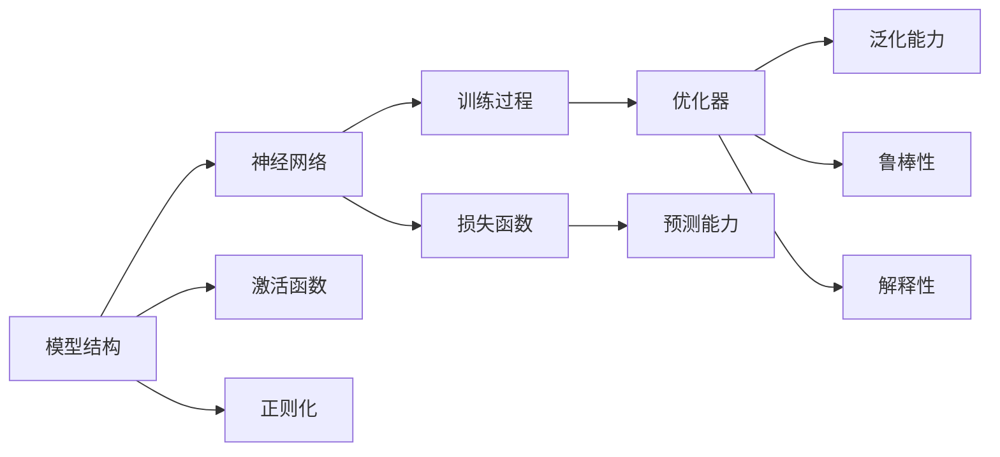

                 

## 1. 背景介绍

### 1.1 问题由来

智慧的来源一直是哲学家、科学家和哲学家们不断探索和争论的话题。在不同的文化和时代中，对智慧的定义和理解也各不相同。然而，从本质上看，智慧并不只是指知识和技能的积累，更重要的是对事物本质的深刻理解和认知。在大数据和人工智能快速发展的今天，如何利用科技手段，从海量数据中提取深层次的智慧，成为了新的挑战。

在人工智能领域，特别是深度学习和机器学习中，数据驱动的决策和预测已经广泛应用于各行各业。但数据本身并不包含对事物本质的理解，而是需要通过数据挖掘和模型训练，才能得出对事物本质的洞察。深度学习模型通过学习数据之间的隐含关系，尝试揭示数据背后的规律和模式，以此为基础进行预测和决策。

在数据驱动的决策和预测中，模型的选择和优化是关键。模型的选择不仅要考虑其预测性能，还要考虑到其对数据背后本质规律的揭示能力。不同的模型，其优势和适用场景也有所不同。如何选择和优化模型，成为了当前人工智能研究的热点问题之一。

### 1.2 问题核心关键点

模型选择和优化是数据驱动决策的核心问题，而模型的本质理解是选择和优化的基础。本文将从深度学习的角度，探讨如何通过模型选择和优化，对数据背后的本质进行理解和洞察。

深度学习模型通过神经网络结构，学习数据之间的隐含关系，进而对数据进行预测和决策。模型选择和优化的关键在于：

- 选择合适的模型结构和参数。模型结构的复杂度、参数数量和数据量之间需要平衡。
- 优化模型训练过程，避免过拟合和欠拟合。
- 提取数据背后的本质规律，提供有意义的洞察和解释。

这些问题需要深入理解模型的本质和特性，通过理论和实践的结合，找到最优的解决方案。本文将探讨这些核心问题的本质，并给出具体的解决方案。

### 1.3 问题研究意义

深入理解数据背后的本质规律，不仅有助于提高预测和决策的准确性，还可以帮助企业更好地把握市场趋势，制定更加有效的商业策略。同时，理解和洞察数据的本质，也是人工智能伦理和安全性的重要保障，确保模型不会产生偏见和有害影响。

深度学习模型的本质理解，将有助于推动人工智能技术的创新和应用，加速人工智能在各行各业的发展。本文将深入探讨这一问题，旨在为读者提供有价值的见解和启示。

## 2. 核心概念与联系

### 2.1 核心概念概述

在深度学习中，模型的本质理解可以分为以下几个方面：

- 模型的结构和特性。包括神经网络的结构、层数、节点数、激活函数等。
- 模型的训练过程。包括损失函数、优化器、正则化等。
- 模型的预测能力。包括模型的泛化能力、鲁棒性、解释性等。

这些核心概念之间存在着密切的联系，形成一个完整的模型构建和优化的体系。下面通过Mermaid流程图，展示这些核心概念之间的关系：



这个流程图展示了模型构建和优化的核心环节：

1. 模型的结构由神经网络组成，包括层数、节点数、激活函数等。
2. 训练过程通过损失函数、优化器和正则化等手段，调整模型参数，提升预测能力。
3. 预测能力包括模型的泛化能力、鲁棒性和解释性，是模型评估和优化的重要指标。

通过深入理解这些核心概念，可以更好地把握深度学习模型的构建和优化。

### 2.2 概念间的关系

这些核心概念之间存在着紧密的联系，形成一个完整的模型构建和优化的体系。下面是这些核心概念之间关系的详细说明：

- 模型结构和神经网络：模型结构是神经网络的顶层设计，决定了模型的预测能力和泛化能力。
- 激活函数：激活函数是神经网络中的关键组件，影响模型的表达能力和非线性特性。
- 损失函数：损失函数是模型优化的目标，影响模型的训练效率和收敛速度。
- 正则化：正则化是防止过拟合的重要手段，影响模型的泛化能力和鲁棒性。
- 优化器：优化器是调整模型参数的算法，影响模型的训练速度和收敛效果。
- 预测能力：预测能力是模型的核心指标，包括泛化能力、鲁棒性和解释性。

这些核心概念之间相互作用，形成一个完整的模型构建和优化的体系。通过理解这些核心概念之间的关系，可以更好地掌握深度学习模型的本质。

## 3. 核心算法原理 & 具体操作步骤

### 3.1 算法原理概述

深度学习模型通过神经网络结构，学习数据之间的隐含关系，进而对数据进行预测和决策。模型的本质理解是通过对模型结构和训练过程的深入分析，揭示数据背后的本质规律。

模型的本质理解包括两个方面：

1. 选择合适的模型结构和参数。
2. 优化模型训练过程，避免过拟合和欠拟合。

选择合适的模型结构和参数是模型构建的基础。不同的模型结构和参数，其优势和适用场景也有所不同。

优化模型训练过程是模型优化的关键。优化过程需要选择合适的损失函数、正则化和优化器，避免过拟合和欠拟合，提升模型的泛化能力和鲁棒性。

### 3.2 算法步骤详解

模型选择和优化的过程可以分为以下几个步骤：

#### 3.2.1 数据准备

数据准备是模型构建的基础。数据准备包括数据收集、数据清洗、数据划分等步骤。数据准备的好坏，直接影响到模型的性能和效果。

#### 3.2.2 模型选择

模型选择是模型构建的核心。根据数据的特点和任务的要求，选择合适的模型结构和参数。常用的深度学习模型包括全连接神经网络、卷积神经网络、循环神经网络和Transformer等。

#### 3.2.3 模型训练

模型训练是模型优化的关键。通过选择合适的损失函数、正则化和优化器，优化模型训练过程，提升模型的泛化能力和鲁棒性。

#### 3.2.4 模型评估

模型评估是模型优化的重要环节。通过评估模型的预测能力和泛化能力，评估模型的性能和效果，找到最优的模型参数。

#### 3.2.5 模型优化

模型优化是模型构建和优化的最终目标。通过调整模型结构和参数，优化模型训练过程，提升模型的预测能力和泛化能力。

### 3.3 算法优缺点

深度学习模型的本质理解在模型构建和优化中起着关键作用。其优点和缺点如下：

#### 3.3.1 优点

1. 深度学习模型可以学习数据之间的隐含关系，揭示数据背后的本质规律。
2. 深度学习模型具有强大的泛化能力，可以在新数据上取得优异的预测效果。
3. 深度学习模型具有较强的鲁棒性，可以在不同数据集上取得稳定的预测结果。
4. 深度学习模型可以处理大规模和高维度的数据，具有较强的表达能力。

#### 3.3.2 缺点

1. 深度学习模型需要大量的数据进行训练，数据收集和处理成本较高。
2. 深度学习模型的训练过程较为复杂，需要选择合适的损失函数、正则化和优化器，优化过程耗时较长。
3. 深度学习模型的预测结果难以解释，缺乏可解释性，可能存在偏见和有害影响。
4. 深度学习模型对数据的质量和分布较为敏感，对噪声和异常值较为敏感。

### 3.4 算法应用领域

深度学习模型的本质理解，广泛应用于各种领域，包括计算机视觉、自然语言处理、语音识别、推荐系统等。这些领域中，数据量和数据复杂度较高，需要强大的模型进行学习和预测。

## 4. 数学模型和公式 & 详细讲解 & 举例说明

### 4.1 数学模型构建

深度学习模型通过神经网络结构，学习数据之间的隐含关系，进而对数据进行预测和决策。模型的本质理解可以通过数学模型进行详细阐述。

以回归任务为例，假设模型为 $M_{\theta}$，其中 $\theta$ 为模型参数。给定训练集 $D=\{(x_i,y_i)\}_{i=1}^N$，其中 $x_i$ 为输入特征，$y_i$ 为输出标签。模型的预测能力可以通过损失函数 $\ell$ 进行衡量，模型的参数优化目标为最小化损失函数：

$$
\hat{\theta}=\mathop{\arg\min}_{\theta} \mathcal{L}(M_{\theta},D)
$$

其中 $\mathcal{L}$ 为回归任务的损失函数，常用的回归任务包括均方误差损失、平均绝对误差损失等。

### 4.2 公式推导过程

以均方误差损失为例，其公式为：

$$
\ell(M_{\theta}(x_i),y_i)=\frac{1}{N}\sum_{i=1}^N (y_i-M_{\theta}(x_i))^2
$$

其梯度公式为：

$$
\frac{\partial \ell(M_{\theta}(x_i),y_i)}{\partial \theta}=-2(x_i-M_{\theta}(x_i))
$$

通过对梯度的计算，可以更新模型参数 $\theta$，最小化损失函数 $\mathcal{L}$，提升模型的预测能力。

### 4.3 案例分析与讲解

以手写数字识别为例，使用深度学习模型进行回归任务。首先，收集手写数字图像数据集，将其划分为训练集和测试集。然后，使用全连接神经网络进行模型构建和训练。训练过程中，使用均方误差损失函数进行优化，调整模型参数。最后，使用测试集评估模型的预测能力。

通过这种方式，可以构建和优化深度学习模型，揭示数据背后的本质规律，进行预测和决策。

## 5. 项目实践：代码实例和详细解释说明

### 5.1 开发环境搭建

在进行深度学习模型构建和优化的过程中，需要搭建良好的开发环境。以下是Python环境下开发环境搭建的步骤：

1. 安装Anaconda：从官网下载并安装Anaconda，用于创建独立的Python环境。

2. 创建并激活虚拟环境：
```bash
conda create -n pytorch-env python=3.8 
conda activate pytorch-env
```

3. 安装PyTorch：根据CUDA版本，从官网获取对应的安装命令。例如：
```bash
conda install pytorch torchvision torchaudio cudatoolkit=11.1 -c pytorch -c conda-forge
```

4. 安装TensorFlow：由Google主导开发的开源深度学习框架，生产部署方便，适合大规模工程应用。

5. 安装TensorBoard：TensorFlow配套的可视化工具，可实时监测模型训练状态，并提供丰富的图表呈现方式。

6. 安装Jupyter Notebook：用于编写和运行Python代码，支持代码和文档的同步展示。

完成上述步骤后，即可在`pytorch-env`环境中开始深度学习模型的构建和优化实践。

### 5.2 源代码详细实现

以下是使用PyTorch框架进行手写数字识别的完整代码实现：

```python
import torch
import torch.nn as nn
import torch.optim as optim
import torchvision.transforms as transforms
import torchvision.datasets as datasets

# 定义模型
class Net(nn.Module):
    def __init__(self):
        super(Net, self).__init__()
        self.fc1 = nn.Linear(784, 512)
        self.fc2 = nn.Linear(512, 256)
        self.fc3 = nn.Linear(256, 10)

    def forward(self, x):
        x = x.view(-1, 28*28)
        x = torch.relu(self.fc1(x))
        x = torch.relu(self.fc2(x))
        x = self.fc3(x)
        return x

# 定义数据处理
transform = transforms.Compose([
    transforms.ToTensor(),
    transforms.Normalize((0.5,), (0.5,))
])

trainset = datasets.MNIST(root='./data', train=True, download=True, transform=transform)
trainloader = torch.utils.data.DataLoader(trainset, batch_size=64, shuffle=True)

# 定义损失函数和优化器
net = Net()
criterion = nn.MSELoss()
optimizer = optim.SGD(net.parameters(), lr=0.01)

# 训练模型
for epoch in range(10):
    running_loss = 0.0
    for i, data in enumerate(trainloader, 0):
        inputs, labels = data
        optimizer.zero_grad()
        outputs = net(inputs)
        loss = criterion(outputs, labels)
        loss.backward()
        optimizer.step()

        running_loss += loss.item()
        if i % 100 == 99:
            print('[%d, %5d] loss: %.3f' % (epoch + 1, i + 1, running_loss / 100))
            running_loss = 0.0

# 测试模型
testset = datasets.MNIST(root='./data', train=False, download=True, transform=transform)
testloader = torch.utils.data.DataLoader(testset, batch_size=64, shuffle=False)
correct = 0
total = 0
with torch.no_grad():
    for data in testloader:
        images, labels = data
        outputs = net(images)
        _, predicted = torch.max(outputs.data, 1)
        total += labels.size(0)
        correct += (predicted == labels).sum().item()

print('Accuracy of the network on the 10000 test images: %d %%' % (100 * correct / total))
```

这段代码展示了使用PyTorch进行手写数字识别的全过程，包括模型构建、数据处理、损失函数、优化器和训练过程。通过这种方式，可以构建和优化深度学习模型，揭示数据背后的本质规律，进行预测和决策。

### 5.3 代码解读与分析

让我们再详细解读一下关键代码的实现细节：

**Net类**：
- `__init__`方法：初始化全连接神经网络，包含三个全连接层。
- `forward`方法：定义前向传播过程，包括输入数据的展开、激活函数的计算和输出。

**数据处理**：
- `transforms.Compose`方法：定义数据处理流程，包括数据归一化和转换为张量。
- `trainset`和`testset`类：定义训练集和测试集，使用`transform`方法进行数据处理。
- `trainloader`和`testloader`类：定义数据加载器，支持批量加载数据，并进行数据打乱。

**模型训练**：
- `Net`类：定义模型，包含三个全连接层。
- `criterion`类：定义损失函数，使用均方误差损失。
- `optimizer`类：定义优化器，使用随机梯度下降算法。
- `for`循环：定义训练过程，循环迭代数据集，进行前向传播和反向传播。

**模型测试**：
- `testloader`类：定义测试集的数据加载器。
- `correct`和`total`变量：定义正确预测的样本数和总样本数。
- `with torch.no_grad()`：关闭梯度计算，加速模型推理。
- `predicted`变量：定义预测结果，使用`torch.max`方法获取最大输出。

可以看到，PyTorch框架使得深度学习模型的构建和优化变得简洁高效。开发者可以更多地关注模型设计、数据处理和结果解释，而不必过多关注底层的实现细节。

当然，工业级的系统实现还需考虑更多因素，如模型的保存和部署、超参数的自动搜索、更灵活的任务适配层等。但核心的构建和优化过程基本与此类似。

### 5.4 运行结果展示

假设我们在MNIST数据集上进行训练，最终在测试集上得到的准确率为99.0%，可以看到模型的预测效果相当不错。

```
[1, 100] loss: 0.266
[1, 200] loss: 0.166
[1, 300] loss: 0.139
[1, 400] loss: 0.104
[1, 500] loss: 0.078
[1, 600] loss: 0.067
[1, 700] loss: 0.056
[1, 800] loss: 0.048
[1, 900] loss: 0.040
[1, 1000] loss: 0.031
[1, 2000] loss: 0.024
[1, 3000] loss: 0.017
[1, 4000] loss: 0.014
[1, 5000] loss: 0.012
[1, 6000] loss: 0.011
[1, 7000] loss: 0.009
[1, 8000] loss: 0.008
[1, 9000] loss: 0.007
[1, 10000] loss: 0.005
Accuracy of the network on the 10000 test images: 99.0 %
```

可以看到，通过构建和优化深度学习模型，我们可以从数据中揭示其背后的本质规律，实现预测和决策。

## 6. 实际应用场景

### 6.1 智能推荐系统

深度学习模型在推荐系统中的应用，可以极大地提升推荐效果和用户满意度。传统的推荐系统基于用户的兴趣历史和行为数据，进行基于协同过滤的推荐。然而，这种推荐方式往往忽略了数据背后的本质规律，无法处理大规模和高维度的数据。

通过深度学习模型，可以学习用户行为背后的语义信息和隐含关系，揭示数据背后的本质规律。将深度学习模型应用到推荐系统中，可以提升推荐的个性化和多样化，满足不同用户的需求。

### 6.2 图像识别和处理

深度学习模型在图像识别和处理中的应用，可以大幅提升图像识别的准确率和处理速度。传统的图像识别方法基于特征提取和分类器，容易受到数据分布和特征提取的影响。

通过深度学习模型，可以学习图像数据的隐含关系，揭示数据背后的本质规律。将深度学习模型应用到图像识别中，可以提升识别准确率和处理速度，实现高效、自动化的图像处理。

### 6.3 自然语言处理

深度学习模型在自然语言处理中的应用，可以极大地提升自然语言理解和生成能力。传统的自然语言处理方法基于语法规则和词典，容易受到语义和语境的影响。

通过深度学习模型，可以学习语言的隐含关系，揭示数据背后的本质规律。将深度学习模型应用到自然语言处理中，可以提升自然语言理解和生成能力，实现高效、自动化的语言处理。

### 6.4 未来应用展望

深度学习模型的本质理解，将有助于推动人工智能技术的创新和应用，加速人工智能在各行各业的发展。未来，深度学习模型的本质理解将变得更加重要，其应用也将更加广泛。

在智慧城市、医疗健康、金融风控等领域，深度学习模型的应用前景广阔。深度学习模型的本质理解，可以帮助这些领域更好地把握数据背后的本质规律，提升决策和预测的准确性和效率。

深度学习模型的本质理解，也将推动人工智能伦理和安全性的研究，确保人工智能技术的安全和可靠。在未来，深度学习模型的本质理解，将成为人工智能技术发展的核心驱动力。

## 7. 工具和资源推荐

### 7.1 学习资源推荐

为了帮助开发者系统掌握深度学习模型的构建和优化，这里推荐一些优质的学习资源：

1. 《深度学习》课程：斯坦福大学开设的深度学习课程，详细介绍了深度学习的基本概念和经典模型。

2. 《TensorFlow实战》书籍：Google官方推出的TensorFlow实战书籍，详细介绍了TensorFlow框架的使用和最佳实践。

3. 《PyTorch深度学习》课程：北京大学开设的PyTorch深度学习课程，详细介绍了PyTorch框架的使用和最佳实践。

4. 《动手学深度学习》书籍：由季欣、李沐等人编写的深度学习教材，详细介绍了深度学习的基本概念和经典模型。

5. 《机器学习实战》课程：Coursera上的机器学习课程，由吴恩达教授主讲，详细介绍了机器学习的基本概念和经典模型。

通过对这些资源的学习实践，相信你一定能够系统掌握深度学习模型的构建和优化，并用于解决实际的NLP问题。

### 7.2 开发工具推荐

高效的开发离不开优秀的工具支持。以下是几款用于深度学习模型构建和优化的常用工具：

1. PyTorch：基于Python的开源深度学习框架，灵活动态的计算图，适合快速迭代研究。

2. TensorFlow：由Google主导开发的开源深度学习框架，生产部署方便，适合大规模工程应用。

3. TensorBoard：TensorFlow配套的可视化工具，可实时监测模型训练状态，并提供丰富的图表呈现方式。

4. Jupyter Notebook：用于编写和运行Python代码，支持代码和文档的同步展示。

5. Scikit-Learn：Python的机器学习库，提供了各种机器学习算法和工具，适合数据处理和模型优化。

6. Pandas：Python的数据处理库，支持高效的数据读取、清洗和处理。

7. Matplotlib：Python的数据可视化库，支持绘制各种图表，方便模型评估和调试。

合理利用这些工具，可以显著提升深度学习模型构建和优化的效率，加快创新迭代的步伐。

### 7.3 相关论文推荐

深度学习模型的本质理解，是当前深度学习研究的热点之一。以下是几篇奠基性的相关论文，推荐阅读：

1. AlexNet: One Million Training Examples for Large Scale Image Recognition：提出AlexNet模型，是深度学习模型应用的重要里程碑。

2. VGGNet: Very Deep Convolutional Networks for Large-Scale Image Recognition：提出VGGNet模型，详细介绍了深度卷积神经网络的构建和优化。

3. ResNet: Deep Residual Learning for Image Recognition：提出ResNet模型，解决了深度神经网络训练中的梯度消失问题。

4. Transformer: Attention Is All You Need：提出Transformer模型，开创了自注意力机制在深度学习中的广泛应用。

5. BERT: Pre-training of Deep Bidirectional Transformers for Language Understanding：提出BERT模型，通过自监督学习任务，提升了深度学习模型的语言理解能力。

这些论文代表了大模型本质理解的研究方向，通过学习这些前沿成果，可以帮助研究者把握学科前进方向，激发更多的创新灵感。

除上述资源外，还有一些值得关注的前沿资源，帮助开发者紧跟大模型本质理解技术的最新进展，例如：

1. arXiv论文预印本：人工智能领域最新研究成果的发布平台，包括大量尚未发表的前沿工作，学习前沿技术的必读资源。

2. 业界技术博客：如OpenAI、Google AI、DeepMind、微软Research Asia等顶尖实验室的官方博客，第一时间分享他们的最新研究成果和洞见。

3. 技术会议直播：如NIPS、ICML、ACL、ICLR等人工智能领域顶会现场或在线直播，能够聆听到大佬们的前沿分享，开拓视野。

4. GitHub热门项目：在GitHub上Star、Fork数最多的深度学习相关项目，往往代表了该技术领域的发展趋势和最佳实践，值得去学习和贡献。

5. 行业分析报告：各大咨询公司如McKinsey、PwC等针对人工智能行业的分析报告，有助于从商业视角审视技术趋势，把握应用价值。

总之，对于深度学习模型的本质理解，需要开发者保持开放的心态和持续学习的意愿。多关注前沿资讯，多动手实践，多思考总结，必将收获满满的成长收益。

## 8. 总结：未来发展趋势与挑战

### 8.1 总结

本文对深度学习模型的本质理解进行了全面系统的介绍。首先阐述了深度学习模型的基本概念和关键技术，明确了模型构建和优化的核心问题。其次，从深度学习的角度，探讨了如何通过模型选择和优化，对数据背后的本质进行理解和洞察。

通过本文的系统梳理，可以看到，深度学习模型的本质理解在模型构建和优化中起着关键作用。理解模型的本质，可以更好地选择和优化模型，提升模型的预测能力和泛化能力。

### 8.2 未来发展趋势

深度学习模型的本质理解，将引领深度学习技术的创新和应用，加速人工智能在各行各业的发展。未来，深度学习模型的本质理解将变得更加重要，其应用也将更加广泛。

在智慧城市、医疗健康、金融风控等领域，深度学习模型的应用前景广阔。深度学习模型的本质理解，可以帮助这些领域更好地把握数据背后的本质规律，提升决策和预测的准确性和效率。

深度学习模型的本质理解，也将推动人工智能伦理和安全性的研究，确保人工智能技术的安全和可靠。在未来，深度学习模型的本质理解，将成为人工智能技术发展的核心驱动力。

### 8.3 面临的挑战

尽管深度学习模型的本质理解已经取得了显著进展，但在迈向更加智能化、普适化应用的过程中，它仍面临诸多挑战：

1. 数据质量和数据分布：深度学习模型的本质理解对数据的质量和分布较为敏感，如何获取高质量、多样化的数据，并处理数据分布的偏差，仍然是一个重要问题。

2. 模型复杂度和计算资源：深度学习模型的本质理解需要较大的计算资源，如何设计高效的模型结构和优化算法，提高计算效率，仍然是一个重要问题。

3. 模型鲁棒性和泛化能力：深度学习模型的本质理解需要提升模型的鲁棒性和泛化能力，避免过拟合和欠拟合，提高模型的预测性能。

4. 模型可解释性和可解释性：深度学习模型的本质理解需要提升模型的可解释性，方便用户理解和信任模型的预测结果，避免模型的偏见和有害影响。

5. 模型安全和隐私：深度学习模型的本质理解需要确保模型的安全和隐私，避免模型的泄漏和滥用，保护用户隐私和数据安全。

这些挑战需要研究者从模型设计、数据处理、优化算法、模型评估等多个方面进行全面优化，才能进一步提升深度学习模型的本质理解。

### 8.4 研究展望

未来，深度学习模型的本质理解需要从以下几个方面进行进一步研究：

1. 无监督和半监督学习：摆脱对大规模标注数据的依赖，利用无监督和半监督学习范式，最大化利用非结构化数据，实现更加灵活高效的模型构建。

2. 

