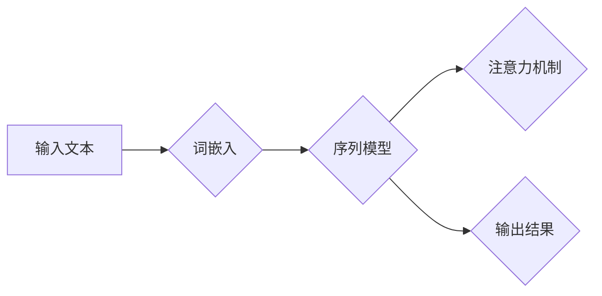

# 一切皆是映射：利用深度学习进行自然语言处理

> 关键词：深度学习，自然语言处理，映射学习，词嵌入，序列模型，注意力机制，Transformer，预训练，微调

## 1. 背景介绍

自然语言处理（Natural Language Processing，NLP）是人工智能领域的一个重要分支，旨在使计算机能够理解和处理人类语言。随着深度学习技术的快速发展，NLP领域取得了显著的进展，使得计算机能够更有效地处理和分析自然语言文本。本文将探讨如何利用深度学习中的映射学习原理来进行自然语言处理。

### 1.1 问题的由来

传统的NLP方法，如基于规则的方法和基于统计的方法，在处理复杂任务时往往效果不佳。深度学习的兴起为NLP带来了新的突破，其中映射学习成为理解自然语言的关键。

### 1.2 研究现状

近年来，深度学习在NLP领域的应用越来越广泛，其中基于映射学习的模型如词嵌入、序列模型和注意力机制等取得了显著的成果。预训练和微调技术使得模型能够从海量数据中学习到丰富的语言知识，并在各种NLP任务上取得优异成绩。

### 1.3 研究意义

深入研究映射学习在NLP中的应用，有助于我们更好地理解自然语言的本质，提高NLP模型在各类任务上的性能，推动NLP技术的发展。

### 1.4 本文结构

本文将分为以下几个部分：
- 第2部分介绍映射学习的基本概念和原理。
- 第3部分阐述映射学习在NLP中的应用，包括词嵌入、序列模型和注意力机制等。
- 第4部分详细讲解Transformer模型的原理和实现。
- 第5部分探讨预训练和微调技术在NLP中的应用。
- 第6部分分析映射学习在NLP中的实际应用场景。
- 第7部分展望映射学习在NLP领域的未来发展趋势与挑战。
- 第8部分总结全文，并对相关资源进行推荐。

## 2. 核心概念与联系

### 2.1 核心概念原理和架构的 Mermaid 流程图



### 2.2 核心概念解析

- **词嵌入（Word Embedding）**：将单词映射为一个密集的向量表示，捕捉单词的语义和语法信息。
- **序列模型（Sequence Model）**：处理序列数据，如文本、语音等，捕捉序列中元素之间的关系。
- **注意力机制（Attention Mechanism）**：使模型关注序列中的重要信息，提高模型对关键信息的识别能力。
- **输出结果**：根据输入文本生成标签、摘要、翻译等。

## 3. 核心算法原理 & 具体操作步骤

### 3.1 算法原理概述

深度学习在NLP中的核心是映射学习，即将输入文本映射到高维向量空间，通过学习这些向量之间的复杂关系来进行文本处理。

### 3.2 算法步骤详解

1. **词嵌入**：将文本中的每个单词映射为一个固定大小的向量。
2. **序列模型**：对词嵌入向量进行序列处理，捕捉序列中单词之间的顺序关系。
3. **注意力机制**：在序列模型中引入注意力机制，使模型关注序列中的重要信息。
4. **输出层**：根据序列模型和注意力机制的输出，生成最终结果。

### 3.3 算法优缺点

- **优点**：
  - 能够有效地捕捉文本中的语义和语法信息。
  - 在各种NLP任务上取得了显著的成果。
- **缺点**：
  - 计算量较大。
  - 需要大量训练数据。

### 3.4 算法应用领域

深度学习在NLP中的应用领域包括：

- 文本分类
- 情感分析
- 命名实体识别
- 机器翻译
- 文本摘要

## 4. 数学模型和公式 & 详细讲解 & 举例说明

### 4.1 数学模型构建

深度学习在NLP中的数学模型主要基于神经网络，以下是一个简单的神经网络模型：

$$
y = f(W \cdot x + b)
$$

其中 $x$ 为输入向量，$W$ 为权重矩阵，$b$ 为偏置项，$f$ 为激活函数。

### 4.2 公式推导过程

以下以词嵌入为例，说明深度学习中常见的公式推导过程：

1. **词嵌入**：
$$
e_{word} = W_{word} \cdot e_{emb}
$$

其中 $e_{word}$ 为单词的向量表示，$W_{word}$ 为词嵌入矩阵，$e_{emb}$ 为嵌入层参数。

2. **序列模型**：
$$
h_t = \sigma(W_h \cdot [h_{t-1}, x_t] + b_h)
$$

其中 $h_t$ 为t时刻的隐藏状态，$W_h$ 为序列模型权重矩阵，$x_t$ 为t时刻的输入，$b_h$ 为偏置项，$\sigma$ 为激活函数。

3. **注意力机制**：
$$
a_t = \frac{e^{W_a \cdot [h_{t-1}, x_t] + b_a}}{\sum_{t'} e^{W_a \cdot [h_{t'-1}, x_{t'}] + b_a}}
$$

其中 $a_t$ 为t时刻的注意力权重，$W_a$ 为注意力机制权重矩阵，$b_a$ 为偏置项。

### 4.3 案例分析与讲解

以情感分析任务为例，我们将使用一个简单的神经网络模型来分析一段文本的情感倾向。

1. **输入文本**：这是一段描述产品优缺点的评论。
2. **词嵌入**：将文本中的单词映射为向量表示。
3. **序列模型**：对词嵌入向量进行序列处理，捕捉单词之间的顺序关系。
4. **注意力机制**：使模型关注文本中的重要信息，如表示正面或负面情感的词汇。
5. **输出层**：根据序列模型和注意力机制的输出，判断文本的情感倾向。

通过以上步骤，我们可以得到文本的情感分析结果。

## 5. 项目实践：代码实例和详细解释说明

### 5.1 开发环境搭建

1. 安装Python 3.6以上版本。
2. 安装TensorFlow或PyTorch等深度学习框架。
3. 安装NLP相关的库，如NLTK、spaCy等。

### 5.2 源代码详细实现

以下是一个简单的情感分析代码实例：

```python
import tensorflow as tf
from tensorflow.keras.layers import Embedding, LSTM, Dense
from tensorflow.keras.models import Sequential

# 创建模型
model = Sequential()
model.add(Embedding(input_dim=vocab_size, output_dim=embedding_dim, input_length=max_length))
model.add(LSTM(units=128, return_sequences=True))
model.add(LSTM(units=128))
model.add(Dense(units=2, activation='softmax'))

# 编译模型
model.compile(optimizer='adam', loss='categorical_crossentropy', metrics=['accuracy'])

# 训练模型
model.fit(x_train, y_train, epochs=5, batch_size=32, validation_data=(x_val, y_val))

# 预测
predictions = model.predict(x_test)
```

### 5.3 代码解读与分析

- `Embedding` 层将文本中的单词映射为向量表示。
- `LSTM` 层对词嵌入向量进行序列处理，捕捉单词之间的顺序关系。
- `Dense` 层输出最终的分类结果。

### 5.4 运行结果展示

运行上述代码，我们可以在验证集上得到情感分析模型的准确率。通过不断优化模型结构和超参数，我们可以提高模型的性能。

## 6. 实际应用场景

深度学习在NLP领域的应用场景非常广泛，以下列举一些常见的应用场景：

- **文本分类**：对文本进行分类，如新闻分类、垃圾邮件过滤等。
- **情感分析**：分析文本的情感倾向，如商品评论情感分析、社交媒体情绪分析等。
- **命名实体识别**：识别文本中的实体，如人名、地点、组织等。
- **机器翻译**：将一种语言的文本翻译成另一种语言。
- **文本摘要**：生成文本的摘要，如新闻摘要、论文摘要等。

## 7. 工具和资源推荐

### 7.1 学习资源推荐

- 《深度学习》（Goodfellow et al.）
- 《神经网络与深度学习》（邱锡鹏）
- 《动手学深度学习》（花轮）
- TensorFlow官网文档
- PyTorch官网文档

### 7.2 开发工具推荐

- TensorFlow
- PyTorch
- Keras
- spaCy
- NLTK

### 7.3 相关论文推荐

- Word2Vec: A Method for Learning Word Representations（Mikolov et al.）
- Efficient Estimation of Word Representations in Vector Space（Mikolov et al.）
- Recurrent Neural Networks for Language Modeling（Liu et al.）
- Long Short-Term Memory（Hochreiter and Schmidhuber）
- Attention Is All You Need（Vaswani et al.）

## 8. 总结：未来发展趋势与挑战

### 8.1 研究成果总结

本文介绍了深度学习在自然语言处理中的应用，包括映射学习、序列模型、注意力机制等。通过预训练和微调技术，深度学习模型在NLP任务上取得了显著的成果。

### 8.2 未来发展趋势

- **预训练模型将更加通用**：未来的预训练模型将能够处理更多种类的语言和任务，降低对领域特定数据的需求。
- **模型将更加高效**：通过模型压缩、量化等技术，模型将更加轻量级，适合在移动设备和嵌入式设备上运行。
- **可解释性将得到提升**：随着研究的深入，模型的决策过程将更加透明，有助于理解和信任模型的输出。

### 8.3 面临的挑战

- **数据质量问题**：高质量标注数据的获取仍然是一个难题。
- **模型可解释性**：如何提高模型的可解释性，使其决策过程更加透明。
- **计算资源消耗**：深度学习模型需要大量的计算资源，如何降低计算资源消耗是一个重要挑战。

### 8.4 研究展望

深度学习在自然语言处理领域的应用前景广阔。未来，随着技术的不断发展，深度学习将在NLP领域取得更加显著的成果，为人类带来更多便利。

## 9. 附录：常见问题与解答

**Q1：什么是词嵌入？**

A：词嵌入是将单词映射为一个固定大小的向量表示，捕捉单词的语义和语法信息。

**Q2：什么是序列模型？**

A：序列模型是处理序列数据的模型，如文本、语音等，捕捉序列中元素之间的关系。

**Q3：什么是注意力机制？**

A：注意力机制是使模型关注序列中的重要信息的机制，提高模型对关键信息的识别能力。

**Q4：深度学习在NLP中有哪些应用？**

A：深度学习在NLP中的应用包括文本分类、情感分析、命名实体识别、机器翻译、文本摘要等。

**Q5：如何提高深度学习模型的性能？**

A：提高深度学习模型性能的方法包括：
- 使用更大的预训练模型。
- 调整超参数。
- 使用更多的训练数据。
- 改进模型结构。

---

作者：禅与计算机程序设计艺术 / Zen and the Art of Computer Programming