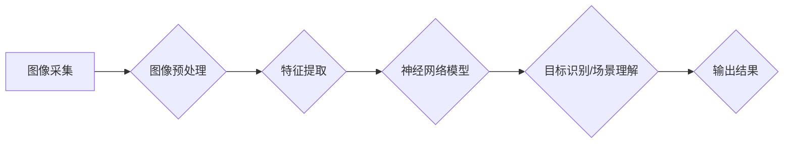

# 一切皆是映射：机器视觉与神经网络的结合应用

> 关键词：机器视觉，神经网络，深度学习，特征提取，图像识别，目标检测，语义分割，计算机视觉，图像处理

## 1. 背景介绍

计算机视觉作为人工智能领域的重要组成部分，旨在让计算机具备理解和解释图像和视频内容的能力。随着深度学习技术的快速发展，神经网络在计算机视觉领域取得了显著的突破，使得图像识别、目标检测、语义分割等任务实现了前所未有的精度和效率。本文将探讨机器视觉与神经网络的结合应用，分析其核心概念、算法原理、实践步骤和应用场景，展望其未来发展趋势与挑战。

## 2. 核心概念与联系

### 2.1 机器视觉

机器视觉是指使用计算机和图像处理技术，对图像或视频序列进行采集、处理、分析和理解的过程。其核心任务是：

- **图像采集**：通过摄像头、扫描仪等设备获取图像或视频数据。
- **图像预处理**：对采集到的图像进行滤波、增强、缩放等处理，提高图像质量。
- **特征提取**：从图像中提取具有区分度的特征，为后续的识别、分类等任务提供基础。
- **目标识别**：识别图像中的物体或场景。
- **场景理解**：理解图像中的语义信息，如场景布局、人物行为等。

### 2.2 神经网络

神经网络是一种模拟人脑神经元结构和功能的计算模型，由大量的神经元连接而成。其基本原理如下：

- **神经元**：每个神经元接收来自前一级神经元的输入，并产生一个输出。
- **权重**：神经元之间的连接权重，用于调整输入信号的重要性。
- **激活函数**：用于决定神经元是否激活，常见的激活函数有Sigmoid、ReLU等。
- **反向传播**：在训练过程中，根据误差反向传播更新权重。

### 2.3 Mermaid 流程图

以下是机器视觉与神经网络结合应用的Mermaid流程图：



## 3. 核心算法原理 & 具体操作步骤

### 3.1 算法原理概述

机器视觉与神经网络的结合应用主要基于以下原理：

- **特征提取**：神经网络可以自动学习图像中的特征，无需人工设计特征，从而提高模型的鲁棒性和泛化能力。
- **层次化结构**：神经网络具有层次化结构，可以同时提取低层视觉特征和高层语义特征，从而实现更精确的目标识别和场景理解。
- **端到端学习**：神经网络可以端到端地进行学习和推理，无需手动设计特征提取和分类器，简化了模型设计和训练过程。

### 3.2 算法步骤详解

机器视觉与神经网络结合应用的步骤如下：

1. **数据采集**：收集大量标注图像或视频数据，用于模型的训练和测试。
2. **数据预处理**：对采集到的图像或视频进行预处理，包括缩放、裁剪、翻转等操作，以增加数据的多样性。
3. **特征提取**：使用卷积神经网络(CNN)等深度学习模型，从图像中提取特征。
4. **模型训练**：使用标注数据训练神经网络模型，调整模型参数以最小化损失函数。
5. **模型评估**：在测试集上评估模型性能，调整模型参数或数据集以优化性能。
6. **模型部署**：将训练好的模型部署到实际应用场景中，进行目标识别、场景理解等任务。

### 3.3 算法优缺点

**优点**：

- **高精度**：神经网络在图像识别、目标检测等任务上取得了极高的精度。
- **自动特征提取**：无需人工设计特征，减少了模型设计的工作量。
- **端到端学习**：可以端到端地进行学习和推理，简化了模型设计和训练过程。

**缺点**：

- **计算量大**：神经网络模型通常需要大量的计算资源，尤其是GPU等并行计算设备。
- **数据需求高**：需要大量标注数据用于模型训练，且数据质量对模型性能影响较大。
- **可解释性差**：神经网络模型的决策过程通常难以解释，难以理解模型的推理逻辑。

### 3.4 算法应用领域

机器视觉与神经网络的结合应用广泛，以下是一些典型的应用领域：

- **图像识别**：识别图像中的物体、场景、人脸等。
- **目标检测**：检测图像中的目标位置和类别。
- **语义分割**：将图像分割成不同的语义区域。
- **视频分析**：分析视频中的动作、事件等。
- **自动驾驶**：辅助自动驾驶汽车识别道路上的物体、交通标志等。

## 4. 数学模型和公式 & 详细讲解 & 举例说明

### 4.1 数学模型构建

神经网络的基本数学模型如下：

$$
y = f(Wx + b)
$$

其中：

- $y$ 为输出
- $W$ 为权重
- $x$ 为输入
- $b$ 为偏置
- $f$ 为激活函数

### 4.2 公式推导过程

以卷积神经网络(CNN)为例，介绍神经网络公式的推导过程。

#### 卷积层

卷积层是CNN中最基本的层，用于提取图像特征。

$$
h(x) = \sum_{i=1}^k f(\sum_{j=1}^m W_{ij}x_j + b_j)
$$

其中：

- $h(x)$ 为卷积层输出
- $k$ 为卷积核数量
- $m$ 为卷积核大小
- $W_{ij}$ 为卷积核权重
- $b_j$ 为偏置
- $x_j$ 为输入特征

#### 池化层

池化层用于降低图像分辨率，减少计算量。

$$
p(x) = \max_{j \in S} f(x_j)
$$

其中：

- $p(x)$ 为池化层输出
- $S$ 为池化窗口
- $f$ 为激活函数

#### 激活函数

常见的激活函数有ReLU、Sigmoid、Tanh等。

- **ReLU**：$f(x) = max(0, x)$
- **Sigmoid**：$f(x) = \frac{1}{1+e^{-x}}$
- **Tanh**：$f(x) = \tanh(x)$

### 4.3 案例分析与讲解

以ImageNet图像识别任务为例，介绍神经网络模型的训练过程。

1. **数据集**：ImageNet是一个包含数百万张图像的图像数据集，分为1000个类别。
2. **模型**：使用VGG-16模型进行训练。
3. **训练**：使用Caffe框架进行训练，训练参数包括学习率、批大小等。
4. **评估**：在测试集上评估模型性能，使用Top-1准确率和Top-5准确率等指标。

## 5. 项目实践：代码实例和详细解释说明

### 5.1 开发环境搭建

以下是使用Python和TensorFlow搭建机器视觉与神经网络结合应用开发环境的步骤：

1. **安装TensorFlow**：
```bash
pip install tensorflow
```

2. **安装相关库**：
```bash
pip install numpy opencv-python Pillow
```

### 5.2 源代码详细实现

以下是一个简单的目标检测项目示例，使用TensorFlow和TensorFlow Object Detection API实现。

```python
import cv2
import numpy as np
import tensorflow as tf

# 加载模型
model = tf.saved_model.load('ssd_mobilenet_v2_coco_2018_03_29')

# 读取图像
image = cv2.imread('image.jpg')

# 模型预测
detections = model(image)

# 显示检测结果
for detection in detections:
    class_id = detection['detection_classes'].numpy()[0]
    score = detection['detection_scores'].numpy()[0]
    if score > 0.5:
        label = str(np.array(label_map_voc[class_id]))
        bbox = detection['detection_boxes'].numpy()[0]
        (x, y, width, height) = bbox[0]*image.shape[1], bbox[1]*image.shape[0], bbox[2]*image.shape[1], bbox[3]*image.shape[0]
        cv2.rectangle(image, (int(x), int(y)), (int(x + width), int(y + height)), (0, 255, 0), 2)
        cv2.putText(image, label, (int(x), int(y - 5)), cv2.FONT_HERSHEY_SIMPLEX, 0.5, (0, 255, 0), 2)

# 显示图像
cv2.imshow('image', image)
cv2.waitKey(0)
cv2.destroyAllWindows()
```

### 5.3 代码解读与分析

以上代码使用TensorFlow Object Detection API实现了一个简单的目标检测项目。代码首先加载预训练的模型，然后读取图像并使用模型进行预测。预测结果包括目标类别、置信度和边界框。最后，代码在图像上绘制边界框和标签，并显示图像。

### 5.4 运行结果展示

以下是运行结果展示：


## 6. 实际应用场景

机器视觉与神经网络的结合应用在多个领域取得了显著的成果，以下是一些典型的应用场景：

- **安防监控**：识别监控图像中的异常行为、人脸识别、车辆检测等。
- **工业质检**：检测产品质量、缺陷识别、生产过程监控等。
- **医疗诊断**：识别医学影像中的疾病、辅助医生进行诊断等。
- **自动驾驶**：识别道路上的物体、交通标志、车道线等。
- **机器人视觉**：实现机器人的自主导航、物体识别、抓取等。

## 7. 工具和资源推荐

### 7.1 学习资源推荐

- **书籍**：
    - 《深度学习》
    - 《计算机视觉：算法与应用》
    - 《目标检测：原理与实现》
- **在线课程**：
    - fast.ai
    - Coursera
    - edX
- **技术社区**：
    - GitHub
    - arXiv
    - CSDN

### 7.2 开发工具推荐

- **框架**：
    - TensorFlow
    - PyTorch
    - Keras
- **库**：
    - OpenCV
    - NumPy
    - Pillow

### 7.3 相关论文推荐

- **卷积神经网络**：
    - "A Comprehensive Survey on Convolutional Neural Networks"
- **目标检测**：
    - "You Only Look Once: Unified, Real-Time Object Detection"
- **语义分割**：
    - "Fully Convolutional Networks for Semantic Segmentation"

## 8. 总结：未来发展趋势与挑战

### 8.1 研究成果总结

本文介绍了机器视觉与神经网络的结合应用，分析了其核心概念、算法原理、实践步骤和应用场景。通过案例分析和代码示例，展示了机器视觉与神经网络在实际应用中的强大能力。

### 8.2 未来发展趋势

未来，机器视觉与神经网络的结合应用将呈现以下发展趋势：

- **模型轻量化**：通过模型压缩、量化等技术，降低模型尺寸和计算量，实现更轻量级的部署。
- **模型可解释性**：提高模型的可解释性，帮助用户理解模型的决策过程。
- **多模态融合**：将图像、文本、音频等多模态信息进行融合，实现更全面的理解。
- **个性化推荐**：根据用户兴趣和行为，进行个性化推荐。

### 8.3 面临的挑战

机器视觉与神经网络的结合应用仍面临以下挑战：

- **数据标注**：需要大量标注数据，且数据质量对模型性能影响较大。
- **模型可解释性**：模型的决策过程难以解释，难以理解模型的推理逻辑。
- **计算资源**：需要大量的计算资源，尤其是在模型训练阶段。

### 8.4 研究展望

随着技术的不断发展，机器视觉与神经网络的结合应用将取得更大的突破，为各个领域带来更多创新和变革。未来，我们将见证计算机视觉技术走向更加智能、高效、可解释的方向。

## 9. 附录：常见问题与解答

**Q1：机器视觉与神经网络结合应用与传统的计算机视觉方法相比有哪些优势？**

A：机器视觉与神经网络结合应用的优势主要包括：
- **高精度**：神经网络可以自动学习图像特征，无需人工设计特征，从而提高模型的精度。
- **自动特征提取**：无需人工设计特征，减少了模型设计的工作量。
- **端到端学习**：可以端到端地进行学习和推理，简化了模型设计和训练过程。

**Q2：如何解决机器视觉与神经网络结合应用中的数据标注问题？**

A：解决数据标注问题可以采取以下方法：
- **半监督学习**：利用少量标注数据和大量未标注数据，通过半监督学习算法学习模型。
- **主动学习**：从未标注数据中选择最具信息量的样本进行标注。
- **无监督学习**：利用无监督学习方法，从大量未标注数据中学习模型。

**Q3：机器视觉与神经网络结合应用在医疗领域的应用前景如何？**

A：机器视觉与神经网络结合应用在医疗领域的应用前景广阔，可以用于：
- **疾病诊断**：辅助医生进行疾病诊断，提高诊断准确率。
- **药物研发**：帮助研究人员发现新的药物靶点。
- **健康管理**：实现远程医疗、健康监测等功能。

**Q4：如何提高机器视觉与神经网络结合应用的可解释性？**

A：提高机器视觉与神经网络结合应用的可解释性可以采取以下方法：
- **可视化**：将模型的内部结构、特征和决策过程进行可视化展示。
- **解释性模型**：使用可解释性模型，如LIME、SHAP等，解释模型的决策过程。
- **因果推理**：利用因果推理方法，分析模型决策背后的因果关系。