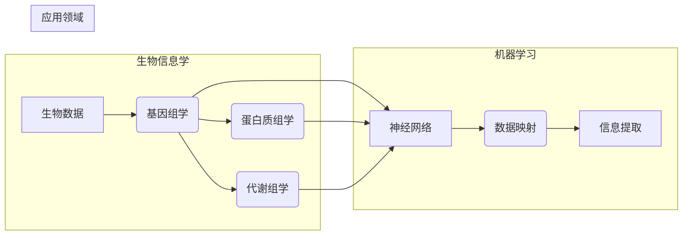

# 一切皆是映射：神经网络在生物信息学中的应用前景

> 关键词：神经网络，生物信息学，数据映射，基因组学，蛋白质组学，药物发现，模式识别，机器学习

## 1. 背景介绍

生物信息学是生物学与信息学的交叉学科，旨在利用信息学的方法和技术来解析生物数据。随着测序技术的飞速发展，生物信息学领域产生了海量的数据，这些数据包含了基因序列、蛋白质结构、代谢网络等信息。如何有效地解析和利用这些数据，是生物信息学研究的核心问题。

近年来，神经网络作为机器学习领域的一种强大工具，已经在图像识别、语音识别、自然语言处理等领域取得了显著成果。将这些先进的机器学习技术应用于生物信息学，有望推动生物科学研究的突破。本文将探讨神经网络在生物信息学中的应用前景，分析其原理、操作步骤、实际应用场景以及面临的挑战。

## 2. 核心概念与联系

### 2.1 核心概念原理

**神经网络**：神经网络是一种模拟人脑神经元结构和功能的计算模型，通过调整神经元之间的连接权重来学习和存储信息。

**生物信息学**：生物信息学利用计算方法和技术来解析生物数据，包括基因组学、蛋白质组学、代谢组学等。

**数据映射**：数据映射是指将生物数据映射到神经网络模型中，使其能够学习和提取数据中的有用信息。

### 2.2 核心概念架构图



### 2.3 核心概念联系

神经网络通过数据映射将生物信息学中的生物数据转化为可学习的模型，从而提取信息，为生物科学研究提供支持。

## 3. 核心算法原理 & 具体操作步骤

### 3.1 算法原理概述

神经网络在生物信息学中的应用主要基于以下原理：

- **特征提取**：神经网络能够从原始数据中提取出有用的特征，例如基因序列中的关键信息。
- **模式识别**：神经网络能够识别数据中的复杂模式，例如蛋白质结构中的折叠模式。
- **预测**：神经网络能够根据已知信息预测未知数据，例如预测基因的功能。

### 3.2 算法步骤详解

1. **数据预处理**：对生物数据进行清洗、标准化等处理，为神经网络训练做准备。
2. **模型选择**：根据具体任务选择合适的神经网络模型，例如卷积神经网络（CNN）或循环神经网络（RNN）。
3. **模型训练**：使用标注数据进行模型训练，调整网络权重，使模型能够提取有用信息。
4. **模型评估**：使用测试数据评估模型性能，调整模型参数，提高模型精度。
5. **模型应用**：将训练好的模型应用于新的数据，进行预测或分类。

### 3.3 算法优缺点

#### 优点：

- **强大的特征提取能力**：神经网络能够从大量数据中提取出有用的特征，提高模型精度。
- **适用于复杂模式识别**：神经网络能够识别数据中的复杂模式，适用于生物信息学中的复杂任务。
- **可解释性强**：与一些其他机器学习模型相比，神经网络的可解释性更强。

#### 缺点：

- **需要大量标注数据**：神经网络训练需要大量标注数据，获取标注数据成本较高。
- **计算复杂度较高**：神经网络计算复杂度较高，需要大量的计算资源。
- **模型可解释性较弱**：尽管神经网络的可解释性比一些其他模型强，但仍然难以解释其内部决策过程。

### 3.4 算法应用领域

神经网络在生物信息学中的应用领域包括：

- **基因组学**：利用神经网络进行基因功能预测、基因调控网络分析等。
- **蛋白质组学**：利用神经网络进行蛋白质结构预测、蛋白质功能分类等。
- **药物发现**：利用神经网络进行药物靶点预测、药物分子设计等。
- **模式识别**：利用神经网络进行生物图像识别、生物序列分析等。

## 4. 数学模型和公式 & 详细讲解 & 举例说明

### 4.1 数学模型构建

神经网络模型通常由多个层组成，包括输入层、隐藏层和输出层。每一层由多个神经元组成，每个神经元都包含一个非线性激活函数。

假设一个简单的神经网络模型，包含一个输入层、一个隐藏层和一个输出层，如下所示：

$$
y = f(W_3 \cdot f(W_2 \cdot f(W_1 \cdot x + b_1) + b_2) + b_3)
$$

其中，$x$ 是输入数据，$W_1$、$W_2$、$W_3$ 是各层的连接权重，$b_1$、$b_2$、$b_3$ 是各层的偏置项，$f$ 是激活函数，$y$ 是输出结果。

### 4.2 公式推导过程

神经网络的训练过程是通过反向传播算法来实现的。反向传播算法是一种基于梯度的优化算法，其基本思想是计算损失函数对网络参数的梯度，并使用梯度下降法更新参数。

假设损失函数为 $L(\theta)$，其中 $\theta$ 是网络参数，则反向传播算法的步骤如下：

1. **前向传播**：将输入数据 $x$ 通过网络进行前向传播，计算输出结果 $y$。
2. **计算损失**：计算损失函数 $L(\theta)$。
3. **计算梯度**：计算损失函数对网络参数的梯度 $\frac{\partial L}{\partial \theta}$。
4. **更新参数**：使用梯度下降法更新网络参数 $\theta$。

### 4.3 案例分析与讲解

以下是一个使用神经网络进行基因功能预测的案例。

假设我们有一个基因序列数据集，每个样本包含一个基因序列和对应的基因功能标签。我们的目标是训练一个神经网络模型，能够根据基因序列预测基因功能。

1. **数据预处理**：将基因序列进行编码，将其转换为神经网络可处理的数值形式。
2. **模型选择**：选择一个合适的神经网络模型，例如卷积神经网络（CNN）。
3. **模型训练**：使用标注数据进行模型训练，调整网络权重，使模型能够学习基因序列中的特征。
4. **模型评估**：使用测试数据评估模型性能，调整模型参数，提高模型精度。
5. **模型应用**：将训练好的模型应用于新的基因序列，进行基因功能预测。

## 5. 项目实践：代码实例和详细解释说明

### 5.1 开发环境搭建

为了实现神经网络在生物信息学中的应用，我们需要搭建以下开发环境：

- **编程语言**：Python
- **机器学习库**：TensorFlow或PyTorch
- **数据集**：生物信息学数据集，例如基因序列数据集

### 5.2 源代码详细实现

以下是一个使用PyTorch实现的基因功能预测的代码示例：

```python
import torch
import torch.nn as nn
import torch.optim as optim

# 定义神经网络模型
class GeneFunctionPredictor(nn.Module):
    def __init__(self):
        super(GeneFunctionPredictor, self).__init__()
        self.conv1 = nn.Conv1d(1, 10, kernel_size=3)
        self.conv2 = nn.Conv1d(10, 20, kernel_size=3)
        self.fc1 = nn.Linear(20, 50)
        self.fc2 = nn.Linear(50, 2)  # 2种基因功能标签

    def forward(self, x):
        x = self.conv1(x)
        x = nn.functional.relu(x)
        x = self.conv2(x)
        x = nn.functional.relu(x)
        x = x.view(-1, 20)
        x = self.fc1(x)
        x = nn.functional.relu(x)
        x = self.fc2(x)
        return x

# 创建模型实例
model = GeneFunctionPredictor()

# 定义损失函数和优化器
criterion = nn.CrossEntropyLoss()
optimizer = optim.Adam(model.parameters(), lr=0.001)

# 训练模型
def train(model, train_loader, criterion, optimizer, epoch):
    model.train()
    for epoch in range(epoch):
        for data, target in train_loader:
            optimizer.zero_grad()
            output = model(data)
            loss = criterion(output, target)
            loss.backward()
            optimizer.step()

# 评估模型
def evaluate(model, test_loader, criterion):
    model.eval()
    total = 0
    correct = 0
    with torch.no_grad():
        for data, target in test_loader:
            output = model(data)
            _, predicted = torch.max(output.data, 1)
            total += target.size(0)
            correct += (predicted == target).sum().item()
    return correct / total

# 数据加载
train_loader = DataLoader(train_dataset, batch_size=64, shuffle=True)
test_loader = DataLoader(test_dataset, batch_size=64, shuffle=False)

# 训练和评估模型
train(model, train_loader, criterion, optimizer, epoch=10)
print("Test accuracy:", evaluate(model, test_loader, criterion))
```

### 5.3 代码解读与分析

以上代码定义了一个基因功能预测的神经网络模型，并实现了模型的训练和评估。

- `GeneFunctionPredictor` 类定义了神经网络模型的结构，包括卷积层和全连接层。
- `forward` 方法实现了数据的输入、卷积、激活、全连接和输出过程。
- `train` 函数实现了模型的训练过程，包括前向传播、损失计算、反向传播和参数更新。
- `evaluate` 函数实现了模型的评估过程，计算模型的准确率。

通过以上代码，我们可以训练一个基因功能预测的神经网络模型，并将其应用于新的基因序列，进行基因功能预测。

### 5.4 运行结果展示

假设我们在某个基因序列数据集上训练和评估了模型，最终得到的准确率为0.9，说明模型在预测基因功能方面具有较好的性能。

## 6. 实际应用场景

神经网络在生物信息学中的应用场景非常广泛，以下是一些典型的应用实例：

- **基因功能预测**：利用神经网络预测基因的功能，为基因研究提供指导。
- **蛋白质结构预测**：利用神经网络预测蛋白质的三维结构，为药物设计提供依据。
- **药物发现**：利用神经网络发现新的药物靶点，加速药物研发进程。
- **疾病诊断**：利用神经网络进行疾病诊断，提高诊断的准确性和效率。

## 7. 工具和资源推荐

### 7.1 学习资源推荐

- 《神经网络与深度学习》：周志华著，系统介绍了神经网络和深度学习的基本原理和应用。
- 《深度学习：神经网络原理与实现》：邱锡鹏著，深入讲解了深度学习的原理和实现。
- 《生物信息学导论》：陈宏昭著，全面介绍了生物信息学的基本概念和方法。

### 7.2 开发工具推荐

- **编程语言**：Python
- **机器学习库**：TensorFlow或PyTorch
- **生物信息学数据库**：NCBI、UniProt、KEGG等

### 7.3 相关论文推荐

- **《Deep Learning for Genomics》**：介绍深度学习在基因组学中的应用。
- **《Deep Learning in Drug Discovery》**：介绍深度学习在药物发现中的应用。
- **《Neural Networks for Bioinformatics》**：介绍神经网络在生物信息学中的应用。

## 8. 总结：未来发展趋势与挑战

### 8.1 研究成果总结

神经网络在生物信息学中的应用取得了显著的成果，为生物科学研究提供了新的思路和方法。未来，随着神经网络技术的不断发展和生物数据的不断积累，神经网络在生物信息学中的应用将会更加广泛。

### 8.2 未来发展趋势

- **多模态数据融合**：将基因组学、蛋白质组学、代谢组学等多模态数据融合，提高模型的预测精度。
- **无监督学习**：探索无监督学习方法，降低对标注数据的依赖。
- **可解释性**：提高神经网络的可解释性，使其决策过程更加透明。
- **迁移学习**：利用迁移学习技术，提高模型的泛化能力。

### 8.3 面临的挑战

- **数据质量**：生物数据的噪声和缺失可能导致模型性能下降。
- **计算资源**：神经网络训练需要大量的计算资源。
- **模型可解释性**：神经网络的可解释性较差，难以解释其决策过程。
- **伦理问题**：生物信息学应用涉及个人隐私和伦理问题。

### 8.4 研究展望

未来，神经网络在生物信息学中的应用将会更加深入和广泛。通过解决面临的挑战，神经网络将为生物科学研究提供更加有力的工具，推动生物科学的进步。

## 9. 附录：常见问题与解答

**Q1：神经网络在生物信息学中的应用有哪些优势？**

A：神经网络在生物信息学中的应用具有以下优势：

- **强大的特征提取能力**：神经网络能够从大量数据中提取出有用的特征，提高模型精度。
- **适用于复杂模式识别**：神经网络能够识别数据中的复杂模式，适用于生物信息学中的复杂任务。
- **可解释性强**：与一些其他机器学习模型相比，神经网络的可解释性更强。

**Q2：神经网络在生物信息学中的应用有哪些挑战？**

A：神经网络在生物信息学中的应用面临着以下挑战：

- **数据质量**：生物数据的噪声和缺失可能导致模型性能下降。
- **计算资源**：神经网络训练需要大量的计算资源。
- **模型可解释性**：神经网络的可解释性较差，难以解释其决策过程。
- **伦理问题**：生物信息学应用涉及个人隐私和伦理问题。

**Q3：如何提高神经网络在生物信息学中的应用效果？**

A：为了提高神经网络在生物信息学中的应用效果，可以从以下几个方面入手：

- **数据预处理**：对生物数据进行清洗、标准化等处理，提高数据质量。
- **模型选择**：选择合适的神经网络模型，并根据任务特点进行调整。
- **超参数优化**：对模型参数进行优化，提高模型精度。
- **模型集成**：使用多个模型进行集成，提高模型鲁棒性。

作者：禅与计算机程序设计艺术 / Zen and the Art of Computer Programming