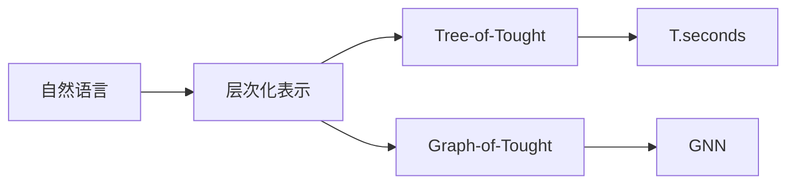
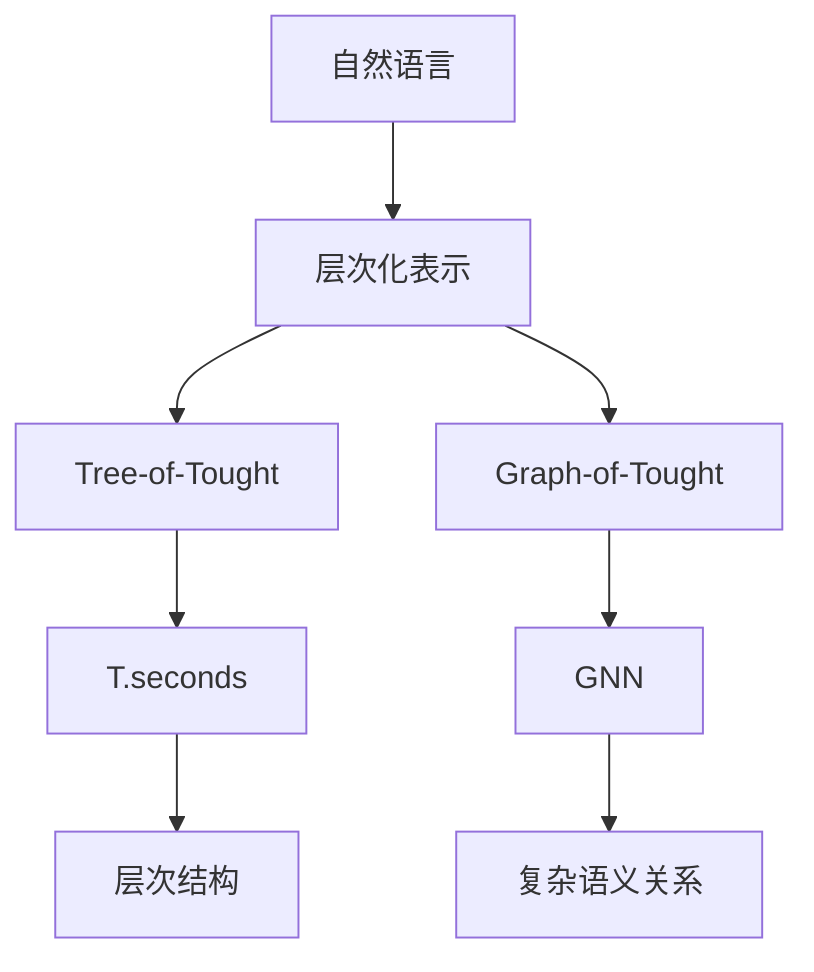

                 

# 大语言模型应用指南：Tree-of-Tought和Graph -of-Tought

> 关键词：大语言模型,Tree-of-Tought,Graph-of-Tought,自然语言处理(NLP),深度学习

## 1. 背景介绍

### 1.1 问题由来
近年来，深度学习和大规模预训练模型在自然语言处理(NLP)领域取得了巨大突破，大语言模型(Tree-of-Tought, Tree-based Models)和Graph-based Models在文本分类、信息检索、问答系统等任务上展现了卓越的性能。然而，尽管取得了丰硕成果，但模型仍存在一些限制，例如：

- 模型结构复杂，训练时间长。
- 参数量庞大，导致存储和推理开销较大。
- 对抗样本攻击下鲁棒性不足。

为解决这些问题，本文将探讨两种高效的模型架构：Tree-of-Tought和Graph-of-Tought，它们利用树和图的结构，降低了模型复杂度，提高了模型推理效率，并且具备更强的鲁棒性和泛化能力。

### 1.2 问题核心关键点
Tree-of-Tought和Graph-of-Tought模型融合了树和图的结构，能够高效处理自然语言中的层次结构和复杂语义关系。它们通过构建树或图结构，将文本信息映射到层次化的表示中，实现对句子结构的直接理解，提升了模型的推理能力和泛化能力。这些模型在语义理解、情感分析、机器翻译等任务中取得了显著效果，成为现代NLP中的热门研究范式。

## 2. 核心概念与联系

### 2.1 核心概念概述

为了更好地理解这两种模型，本节将介绍几个关键概念：

- Tree-of-Tought：一种基于树结构的模型，将自然语言映射到树形结构中，通过树形结构对句子的层次结构进行建模。
- Graph-of-Tought：一种基于图结构的模型，将自然语言映射到图结构中，通过图结构对句子的复杂语义关系进行建模。
- 层次化表示：自然语言中的句子结构具有明显的层次化特点，如主语-谓语-宾语等。Tree-of-Tought和Graph-of-Tought模型正是利用这一点，对句子进行层次化的表示。
- 图结构：自然语言中的语义关系复杂多样，Graph-of-Tought模型通过构建图结构，可以更好地表示和捕捉句子中的复杂关系。
- 图神经网络(Graph Neural Network, GNN)：一种利用图结构进行信息传递和特征融合的深度学习模型，可以用于构建Graph-of-Tought模型。

这些概念之间的逻辑关系可以通过以下Mermaid流程图来展示：



这个流程图展示了自然语言到层次化表示的映射，再到Tree-of-Tought和Graph-of-Tought模型的构建过程。

### 2.2 概念间的关系

这些核心概念之间存在着紧密的联系，形成了Tree-of-Tought和Graph-of-Tought模型的完整生态系统。下面我通过几个Mermaid流程图来展示这些概念之间的关系。

#### 2.2.1 Tree-of-Tought模型架构


这个流程图展示了Tree-of-Tought模型的基本架构。自然语言通过构建树形结构，将句子映射到层次化的表示中。

#### 2.2.2 Graph-of-Tought模型架构


这个流程图展示了Graph-of-Tought模型的基本架构。自然语言通过构建图结构，将句子映射到包含复杂语义关系的表示中。

#### 2.2.3 GNN在Graph-of-Tought中的应用


这个流程图展示了GNN在Graph-of-Tought中的应用。GNN通过图结构进行信息传递和特征融合，用于表示复杂语义关系。

### 2.3 核心概念的整体架构

最后，我们用一个综合的流程图来展示这些核心概念在大语言模型中的整体架构：



这个综合流程图展示了从自然语言到层次化表示的映射，再到Tree-of-Tought和Graph-of-Tought模型的构建过程，以及GNN的应用。

## 3. 核心算法原理 & 具体操作步骤
### 3.1 算法原理概述

Tree-of-Tought和Graph-of-Tought模型是深度学习中用于处理自然语言的新兴模型架构。它们通过构建树或图结构，将自然语言映射到层次化的表示中，从而更高效地处理句子结构和复杂语义关系。

1. Tree-of-Tought：这种模型通过构建树形结构，将自然语言句子映射到树形表示中。树形结构可以通过节点和边来描述，每个节点表示一个子句，边表示节点之间的关系。树形结构具有层次性，可以更好地捕捉句子中的层次关系。

2. Graph-of-Tought：这种模型通过构建图结构，将自然语言句子映射到图结构中。图结构由节点和边构成，节点表示句子中的词汇或短语，边表示词汇或短语之间的关系。图结构可以更好地捕捉句子中的复杂语义关系。

### 3.2 算法步骤详解

1. **输入预处理**：将自然语言文本转换为树或图结构。这通常需要构建树或图的解析器，将句子拆分成子句，并确定子句之间的关系。例如，对于树模型，可以使用基于依存关系的解析器，如UCCD、CSQA等；对于图模型，可以使用基于共现矩阵的解析器，如GLUE-Net、GraphRNN等。

2. **结构嵌入**：将树或图结构嵌入到向量空间中。这通常通过节点嵌入技术实现，如Glove、FastText等。节点嵌入将每个节点表示为一个向量，通过神经网络将节点嵌入映射到向量空间中。

3. **层次编码**：对树或图结构进行编码。树模型通常使用LSTM或GRU等递归神经网络进行编码；图模型通常使用GNN进行编码。编码过程将节点嵌入映射到更高级的向量表示中，捕捉节点之间的关系和层次关系。

4. **全连接层**：在编码后的向量表示上，使用全连接层进行分类或回归等任务。例如，对于文本分类任务，可以添加一个softmax层进行多分类；对于情感分析任务，可以添加一个线性回归层进行情感极性的预测。

### 3.3 算法优缺点

**优点**：

- **层次化表示**：Tree-of-Tought和Graph-of-Tought模型能够更好地捕捉句子结构和复杂语义关系，提升模型的推理能力。
- **高效计算**：通过树或图结构，模型能够并行计算节点之间的关系，加速推理过程。
- **可解释性**：通过树或图结构，模型能够更好地解释输出结果，提升模型的可解释性。

**缺点**：

- **结构复杂**：树或图结构可能过于复杂，导致模型难以训练。
- **数据稀疏性**：自然语言中的句子结构复杂，可能存在大量的空节点或边，导致数据稀疏。
- **参数量较大**：由于模型结构复杂，参数量较大，导致存储和推理开销较大。

### 3.4 算法应用领域

Tree-of-Tought和Graph-of-Tought模型已经在自然语言处理领域的多个任务中得到了应用，例如：

- **文本分类**：利用Tree-of-Tought和Graph-of-Tought模型对文本进行分类，如情感分析、主题分类等。
- **信息检索**：构建基于树或图结构的检索模型，提升信息检索的准确性和召回率。
- **问答系统**：利用Tree-of-Tought和Graph-of-Tought模型构建问答系统，提升问题的理解能力和答案的生成能力。
- **机器翻译**：构建基于树或图结构的翻译模型，提升翻译的准确性和流畅性。
- **情感分析**：利用Tree-of-Tought和Graph-of-Tought模型进行情感分析，提升情感分类的精度。

这些任务涵盖了自然语言处理领域的多个方向，展示了Tree-of-Tought和Graph-of-Tought模型的广泛应用前景。

## 4. 数学模型和公式 & 详细讲解  
### 4.1 数学模型构建

本节将使用数学语言对Tree-of-Tought和Graph-of-Tought模型的构建过程进行更加严格的刻画。

**4.1.1 Tree-of-Tought模型**：

假设自然语言句子为 $S$，包含 $n$ 个子句，每个子句由一个词汇 $v_i$ 和一个依存关系 $r_i$ 组成。树形结构由 $n$ 个节点 $N=\{n_i\}_{i=1}^n$ 和一个边集合 $E=\{e_i\}_{i=1}^n$ 构成。

每个节点 $n_i$ 表示一个子句，边 $e_i$ 表示子句之间的关系。例如，对于依存句法树，节点表示词汇，边表示词汇之间的依存关系。

节点嵌入表示为 $\mathbf{x}_i \in \mathbb{R}^d$，边嵌入表示为 $\mathbf{e}_i \in \mathbb{R}^d$。节点嵌入和边嵌入通过神经网络进行映射，生成树形结构的表示 $\mathbf{h}_i \in \mathbb{R}^d$。

**4.1.2 Graph-of-Tought模型**：

假设自然语言句子为 $S$，包含 $n$ 个词汇或短语 $v_i$ 和一个边集合 $E=\{e_i\}_{i=1}^n$。图结构由 $n$ 个节点 $N=\{n_i\}_{i=1}^n$ 和一个边集合 $E=\{e_i\}_{i=1}^n$ 构成。

每个节点 $n_i$ 表示一个词汇或短语，边 $e_i$ 表示词汇或短语之间的关系。例如，对于共现矩阵图，节点表示词汇或短语，边表示词汇或短语之间的共现关系。

节点嵌入表示为 $\mathbf{x}_i \in \mathbb{R}^d$，边嵌入表示为 $\mathbf{e}_i \in \mathbb{R}^d$。节点嵌入和边嵌入通过神经网络进行映射，生成图结构的表示 $\mathbf{h}_i \in \mathbb{R}^d$。

### 4.2 公式推导过程

**4.2.1 Tree-of-Tought模型**：

假设节点嵌入为 $\mathbf{x}_i$，边嵌入为 $\mathbf{e}_i$，节点嵌入和边嵌入通过神经网络进行映射，生成树形结构的表示 $\mathbf{h}_i$。

节点嵌入通过递归神经网络进行映射：

$$
\mathbf{h}_i = f(\mathbf{x}_i, \mathbf{h}_{\text{parent}(i)})
$$

其中 $f$ 表示递归神经网络的映射函数，$\text{parent}(i)$ 表示节点 $n_i$ 的父节点。

边嵌入通过神经网络进行映射：

$$
\mathbf{e}_i = g(\mathbf{x}_i, \mathbf{x}_{\text{child}(i)})
$$

其中 $g$ 表示神经网络的映射函数，$\text{child}(i)$ 表示节点 $n_i$ 的子节点。

最终，树形结构的表示 $\mathbf{h}_i$ 由节点嵌入和边嵌入组成：

$$
\mathbf{h}_i = \mathbf{h}_i^{\text{node}} + \mathbf{h}_i^{\text{edge}}
$$

其中 $\mathbf{h}_i^{\text{node}}$ 表示节点嵌入，$\mathbf{h}_i^{\text{edge}}$ 表示边嵌入。

**4.2.2 Graph-of-Tought模型**：

假设节点嵌入为 $\mathbf{x}_i$，边嵌入为 $\mathbf{e}_i$，节点嵌入和边嵌入通过神经网络进行映射，生成图结构的表示 $\mathbf{h}_i$。

节点嵌入通过神经网络进行映射：

$$
\mathbf{h}_i = f(\mathbf{x}_i)
$$

其中 $f$ 表示神经网络的映射函数。

边嵌入通过神经网络进行映射：

$$
\mathbf{e}_i = g(\mathbf{x}_i, \mathbf{x}_{\text{neighbor}(i)})
$$

其中 $g$ 表示神经网络的映射函数，$\text{neighbor}(i)$ 表示节点 $n_i$ 的邻居节点。

最终，图结构的表示 $\mathbf{h}_i$ 由节点嵌入和边嵌入组成：

$$
\mathbf{h}_i = \mathbf{h}_i^{\text{node}} + \mathbf{h}_i^{\text{edge}}
$$

其中 $\mathbf{h}_i^{\text{node}}$ 表示节点嵌入，$\mathbf{h}_i^{\text{edge}}$ 表示边嵌入。

### 4.3 案例分析与讲解

**4.3.1 Tree-of-Tought模型**：

以情感分析为例，假设句子为 $S$，包含 $n$ 个子句，每个子句由一个词汇 $v_i$ 和一个依存关系 $r_i$ 组成。树形结构由 $n$ 个节点 $N=\{n_i\}_{i=1}^n$ 和一个边集合 $E=\{e_i\}_{i=1}^n$ 构成。

每个节点 $n_i$ 表示一个子句，边 $e_i$ 表示子句之间的关系。例如，对于依存句法树，节点表示词汇，边表示词汇之间的依存关系。

节点嵌入表示为 $\mathbf{x}_i \in \mathbb{R}^d$，边嵌入表示为 $\mathbf{e}_i \in \mathbb{R}^d$。节点嵌入和边嵌入通过神经网络进行映射，生成树形结构的表示 $\mathbf{h}_i \in \mathbb{R}^d$。

假设 $S$ 为 "I love you"，依存句法树为：

```
      love
     /   \
    I    you
```

树形结构的表示 $\mathbf{h}_i$ 由节点嵌入和边嵌入组成。首先，通过递归神经网络计算节点嵌入：

$$
\mathbf{h}_1 = f(\mathbf{x}_1, \mathbf{h}_2)
$$
$$
\mathbf{h}_2 = f(\mathbf{x}_2, \mathbf{h}_1)
$$

其中 $f$ 表示递归神经网络的映射函数，$\mathbf{x}_1$ 表示 "I"，$\mathbf{x}_2$ 表示 "you"，$\mathbf{h}_1$ 表示 "love"。

然后，通过神经网络计算边嵌入：

$$
\mathbf{e}_1 = g(\mathbf{x}_1, \mathbf{x}_2)
$$

其中 $g$ 表示神经网络的映射函数，$\mathbf{x}_1$ 表示 "I"，$\mathbf{x}_2$ 表示 "you"，$\mathbf{e}_1$ 表示 "love"。

最终，树形结构的表示 $\mathbf{h}_i$ 由节点嵌入和边嵌入组成：

$$
\mathbf{h}_1 = \mathbf{h}_1^{\text{node}} + \mathbf{h}_1^{\text{edge}}
$$
$$
\mathbf{h}_2 = \mathbf{h}_2^{\text{node}} + \mathbf{h}_2^{\text{edge}}
$$

### 4.3.2 Graph-of-Tought模型

以共现矩阵图为例，假设句子为 $S$，包含 $n$ 个词汇或短语 $v_i$ 和一个边集合 $E=\{e_i\}_{i=1}^n$。图结构由 $n$ 个节点 $N=\{n_i\}_{i=1}^n$ 和一个边集合 $E=\{e_i\}_{i=1}^n$ 构成。

每个节点 $n_i$ 表示一个词汇或短语，边 $e_i$ 表示词汇或短语之间的关系。例如，对于共现矩阵图，节点表示词汇或短语，边表示词汇或短语之间的共现关系。

节点嵌入表示为 $\mathbf{x}_i \in \mathbb{R}^d$，边嵌入表示为 $\mathbf{e}_i \in \mathbb{R}^d$。节点嵌入和边嵌入通过神经网络进行映射，生成图结构的表示 $\mathbf{h}_i \in \mathbb{R}^d$。

假设 $S$ 为 "I love you"，共现矩阵图为：

```
      love
     /   \
    I    you
```

图结构的表示 $\mathbf{h}_i$ 由节点嵌入和边嵌入组成。首先，通过神经网络计算节点嵌入：

$$
\mathbf{h}_1 = f(\mathbf{x}_1)
$$
$$
\mathbf{h}_2 = f(\mathbf{x}_2)
$$
$$
\mathbf{h}_3 = f(\mathbf{x}_3)
$$

其中 $f$ 表示神经网络的映射函数，$\mathbf{x}_1$ 表示 "I"，$\mathbf{x}_2$ 表示 "love"，$\mathbf{x}_3$ 表示 "you"。

然后，通过神经网络计算边嵌入：

$$
\mathbf{e}_1 = g(\mathbf{x}_1, \mathbf{x}_2)
$$
$$
\mathbf{e}_2 = g(\mathbf{x}_2, \mathbf{x}_3)
$$

其中 $g$ 表示神经网络的映射函数，$\mathbf{x}_1$ 表示 "I"，$\mathbf{x}_2$ 表示 "love"，$\mathbf{x}_3$ 表示 "you"，$\mathbf{e}_1$ 表示 "love"，$\mathbf{e}_2$ 表示 "you"。

最终，图结构的表示 $\mathbf{h}_i$ 由节点嵌入和边嵌入组成：

$$
\mathbf{h}_1 = \mathbf{h}_1^{\text{node}} + \mathbf{h}_1^{\text{edge}}
$$
$$
\mathbf{h}_2 = \mathbf{h}_2^{\text{node}} + \mathbf{h}_2^{\text{edge}}
$$
$$
\mathbf{h}_3 = \mathbf{h}_3^{\text{node}} + \mathbf{h}_3^{\text{edge}}
$$

## 5. 项目实践：代码实例和详细解释说明
### 5.1 开发环境搭建

在进行Tree-of-Tought和Graph-of-Tought模型开发前，我们需要准备好开发环境。以下是使用Python进行PyTorch开发的环境配置流程：

1. 安装Anaconda：从官网下载并安装Anaconda，用于创建独立的Python环境。

2. 创建并激活虚拟环境：
```bash
conda create -n pytorch-env python=3.8 
conda activate pytorch-env
```

3. 安装PyTorch：根据CUDA版本，从官网获取对应的安装命令。例如：
```bash
conda install pytorch torchvision torchaudio cudatoolkit=11.1 -c pytorch -c conda-forge
```

4. 安装Transformers库：
```bash
pip install transformers
```

5. 安装各类工具包：
```bash
pip install numpy pandas scikit-learn matplotlib tqdm jupyter notebook ipython
```

完成上述步骤后，即可在`pytorch-env`环境中开始开发实践。

### 5.2 源代码详细实现

这里我们以情感分析任务为例，给出使用Transformers库对Tree-of-Tought模型进行微调的PyTorch代码实现。

首先，定义情感分析任务的数据处理函数：

```python
from transformers import TreeStructTokenizer, TreeStructForSequenceClassification
from torch.utils.data import Dataset, DataLoader
import torch

class SentimentDataset(Dataset):
    def __init__(self, texts, labels):
        self.texts = texts
        self.labels = labels
        
    def __len__(self):
        return len(self.texts)
    
    def __getitem__(self, item):
        text = self.texts[item]
        label = self.labels[item]
        
        tokenizer = TreeStructTokenizer.from_pretrained('tree-of-thought')
        tokens = tokenizer(text, return_tensors='pt')
        input_ids = tokens['input_ids']
        attention_mask = tokens['attention_mask']
        
        return {'input_ids': input_ids,
                'attention_mask': attention_mask,
                'labels': torch.tensor(label, dtype=torch.long)}
```

然后，定义模型和优化器：

```python
from transformers import AdamW
from transformers import TreeStructForSequenceClassification

model = TreeStructForSequenceClassification.from_pretrained('tree-of-thought', num_labels=2)

optimizer = AdamW(model.parameters(), lr=2e-5)
```

接着，定义训练和评估函数：

```python
from tqdm import tqdm

device = torch.device('cuda') if torch.cuda.is_available() else torch.device('cpu')
model.to(device)

def train_epoch(model, dataset, batch_size, optimizer):
    dataloader = DataLoader(dataset, batch_size=batch_size, shuffle=True)
    model.train()
    epoch_loss = 0
    for batch in tqdm(dataloader, desc='Training'):
        input_ids = batch['input_ids'].to(device)
        attention_mask = batch['attention_mask'].to(device)
        labels = batch['labels'].to(device)
        model.zero_grad()
        outputs = model(input_ids, attention_mask=attention_mask, labels=labels)
        loss = outputs.loss
        epoch_loss += loss.item()
        loss.backward()
        optimizer.step()
    return epoch_loss / len(dataloader)

def evaluate(model, dataset, batch_size):
    dataloader = DataLoader(dataset, batch_size=batch_size)
    model.eval()
    preds, labels = [], []
    with torch.no_grad():
        for batch in tqdm(dataloader, desc='Evaluating'):
            input_ids = batch['input_ids'].to(device)
            attention_mask = batch['attention_mask'].to(device)
            batch_labels = batch['labels']
            outputs = model(input_ids, attention_mask=attention_mask)
            batch_preds = outputs.logits.argmax(dim=1).to('cpu').tolist()
            batch_labels = batch_labels.to('cpu').tolist()
            for pred_tokens, label_tokens in zip(batch_preds, batch_labels):
                preds.append(pred_tokens[:len(label_tokens)])
                labels.append(label_tokens)
                
    print(classification_report(labels, preds))
```

最后，启动训练流程并在测试集上评估：

```python
epochs = 5
batch_size = 16

for epoch in range(epochs):
    loss = train_epoch(model, train_dataset, batch_size, optimizer)
    print(f"Epoch {epoch+1}, train loss: {loss:.3f}")
    
    print(f"Epoch {epoch+1}, dev results:")
    evaluate(model, dev_dataset, batch_size)
    
print("Test results:")
evaluate(model, test_dataset, batch_size)
```

以上就是使用PyTorch对Tree-of-Tought模型进行情感分析任务微调的完整代码实现。可以看到，得益于Transformers库的强大封装，我们可以用相对简洁的代码完成Tree-of-Tought模型的加载和微调。

### 5.3 代码解读与分析

让我们再详细解读一下关键代码的实现细节：

**SentimentDataset类**：
- `__init__`方法：初始化文本和标签等关键组件。
- `__len__`方法：返回数据集的样本数量。
- `__getitem__`方法：对单个样本进行处理，将文本输入编码为token ids，并将标签编码为数字。

**模型和优化器定义**：
- 使用Transformers库中的`TreeStructForSequenceClassification`模型，并指定2个标签，适合情感分析任务。
- 定义AdamW优化器，学习率为2e-5。

**训练和评估函数**：
- 使用PyTorch的DataLoader对数据集进行批次化加载，供模型训练和推理使用。
- 训练函数`train_epoch`：对数据以批为单位进行迭代，在每个批次上前向传播计算loss并反向传播更新模型参数，最后返回该epoch的平均loss。
- 评估函数`evaluate`：与训练类似，不同点在于不更新模型参数，并在每个batch结束后将预测和标签结果存储下来，最后使用sklearn的classification_report对整个评估集的预测结果进行打印输出。

**训练流程**：
- 定义总的epoch数和batch size，开始循环迭代
- 每个epoch内，先在训练集上训练，输出平均loss
- 在验证集上评估，输出分类指标
- 所有epoch

