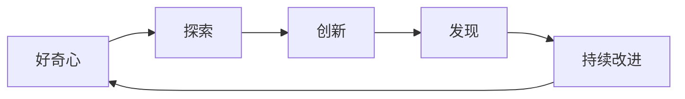
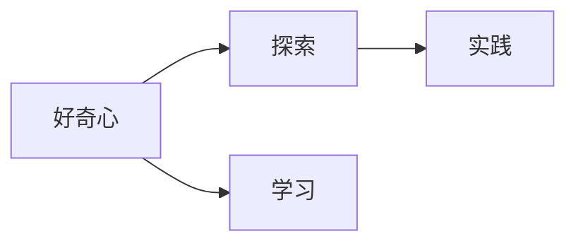
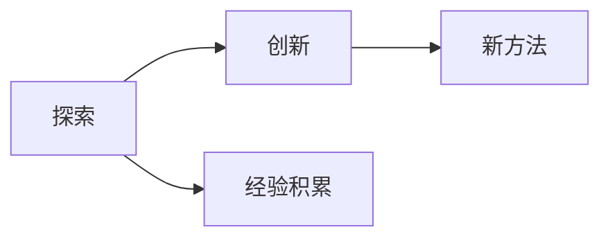
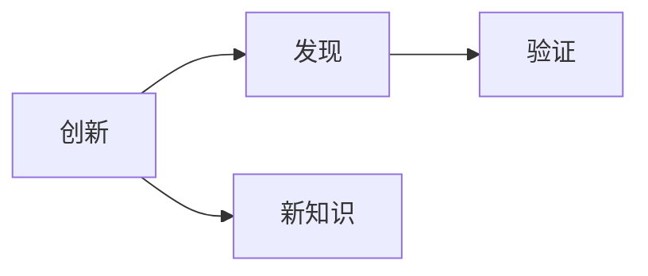

                 

# 好奇心：驱动创新与发现的源泉

在科技不断进步的今天，人工智能(AI)正迅速成为推动人类社会发展的核心动力之一。作为人工智能领域的技术博主和深度学习专家，我深知好奇心在这一过程中扮演着至关重要的角色。本文将从多个维度探讨好奇心如何驱动创新与发现，帮助读者更好地理解这一核心驱动力。

## 1. 背景介绍

### 1.1 问题由来

好奇心是人类天生的驱动力，也是科技发展的原动力。在人工智能领域，好奇心不仅催生了众多前沿技术，也促进了深度学习模型的不断突破和创新。从最初的神经网络模型，到如今的深度卷积神经网络(Convolutional Neural Networks, CNNs)和深度生成对抗网络(Generative Adversarial Networks, GANs)，每次技术突破都离不开好奇心的驱动。

### 1.2 问题核心关键点

好奇心驱动创新与发现的核心关键点在于：

- **探索未知**：好奇心驱使人们探索未知领域，挑战传统认知，提出新问题并寻求解决。
- **开放心态**：拥有开放心态，愿意尝试新方法和新技术，接受失败并从中学习。
- **持续改进**：持续关注领域发展，不断改进现有技术，推动科技进步。

## 2. 核心概念与联系

### 2.1 核心概念概述

为了更好地理解好奇心如何驱动创新与发现，本节将介绍几个核心概念及其之间的关系：

- **好奇心**：指人们对未知事物的好奇和探索欲望，是驱动创新与发现的根本动力。
- **探索**：指在未知领域中进行实验、研究和学习的过程。
- **创新**：指对现有技术和方法进行改进或创造新方法的过程。
- **发现**：指在探索过程中，发现新知识或新规律的过程。

这些概念之间的联系可以通过以下Mermaid流程图来展示：



这个流程图展示了好奇心驱动创新与发现的过程：好奇心促使人们进行探索，探索过程中通过创新发现新知识，并进一步激发新的好奇心。

### 2.2 概念间的关系

这些核心概念之间存在紧密的联系，形成了好奇心驱动创新与发现的完整生态系统。下面通过几个Mermaid流程图来展示这些概念之间的关系。

#### 2.2.1 好奇心与探索的关系



这个流程图展示了好奇心如何通过学习和实践，激发探索行为。好奇心促使人们学习相关知识，并通过实践验证理论，推动探索过程。

#### 2.2.2 探索与创新的关系



这个流程图展示了探索过程中如何通过经验积累，激发创新行为。探索过程中积累的经验和技术，促使人们创新出新的方法和工具。

#### 2.2.3 创新与发现的关系



这个流程图展示了创新如何通过验证，推动发现新知识。创新的方法和工具在实践中验证，可能发现新的知识或规律。

#### 2.2.4 发现与持续改进的关系


这个流程图展示了发现如何通过技术改进，推动新的发现。通过改进技术，发现新的知识和规律，并进一步推动技术改进。

## 3. 核心算法原理 & 具体操作步骤

### 3.1 算法原理概述

好奇心驱动的创新与发现过程，本质上是一个动态的反馈循环。具体来说，好奇心驱动人们进行探索，探索过程中通过创新和验证发现新知识，新知识进一步激发新的好奇心，形成良性循环。

在算法层面，这一过程可以概括为以下几个步骤：

1. **数据收集与处理**：收集与探索主题相关的数据，并进行预处理和特征提取。
2. **模型设计与训练**：设计适合探索主题的模型，并使用收集到的数据进行训练。
3. **实验验证**：在实际应用中验证模型的效果，评估其创新性和发现能力。
4. **反馈与改进**：根据实验结果，调整模型参数和算法策略，进行持续改进。

### 3.2 算法步骤详解

#### 3.2.1 数据收集与处理

数据是探索与创新的基础。有效的数据收集与处理，可以大大提高探索和创新的成功率。具体步骤如下：

1. **数据收集**：使用爬虫、API接口、公开数据集等手段，收集与探索主题相关的数据。数据可以包括文本、图像、音频等。
2. **数据清洗与预处理**：去除噪声数据，处理缺失值，进行标准化和归一化等预处理操作，确保数据质量。
3. **特征提取**：使用特征提取技术，将原始数据转换为模型可以处理的特征表示。

#### 3.2.2 模型设计与训练

模型设计与训练是探索与创新的核心。有效的模型设计，可以提升探索和创新的效率和准确性。具体步骤如下：

1. **模型选择**：根据探索主题和数据特点，选择适合的模型。如神经网络、支持向量机、决策树等。
2. **模型优化**：通过调整超参数、增加正则化、使用深度学习框架等手段，优化模型性能。
3. **训练与验证**：使用训练集进行模型训练，在验证集上评估模型效果，不断调整参数和策略。

#### 3.2.3 实验验证

实验验证是探索与创新的关键。有效的实验验证，可以评估模型效果，识别出新知识和新规律。具体步骤如下：

1. **实验设计**：设计实验方案，明确实验目标和评估指标。如准确率、召回率、F1分数等。
2. **实验执行**：在实际应用场景中执行实验，收集实验数据。
3. **结果评估**：使用统计分析方法，评估实验结果，判断其创新性和发现能力。

#### 3.2.4 反馈与改进

反馈与改进是探索与创新的重要环节。有效的反馈与改进，可以持续提升模型效果，推动技术进步。具体步骤如下：

1. **结果分析**：分析实验结果，识别出新知识和新规律。
2. **技术改进**：根据结果分析，调整模型参数和算法策略，进行持续改进。
3. **反馈循环**：将改进后的模型重新应用于探索主题，进行下一轮实验验证。

### 3.3 算法优缺点

好奇心驱动的创新与发现过程，具有以下优点：

- **高效性**：通过持续的反馈与改进，可以快速迭代，提升探索和创新的效率。
- **灵活性**：好奇心驱动的探索与创新，可以根据新发现和新技术，灵活调整策略和方法。
- **创新性**：好奇心驱动的探索与创新，可以不断突破传统认知，提出新方法和新技术。

但这一过程也存在以下缺点：

- **资源消耗**：数据收集、模型训练、实验验证等步骤，需要大量资源和时间投入。
- **风险不确定**：探索与创新过程中，可能出现失败或无效结果，影响资源投入。
- **认知局限**：探索与创新过程受限于当前认知水平，可能受限于现有知识和技术。

### 3.4 算法应用领域

好奇心驱动的创新与发现过程，在多个领域中得到了广泛应用。以下是几个典型的应用场景：

#### 3.4.1 深度学习研究

深度学习研究领域，好奇心驱动了众多前沿技术的发展。如卷积神经网络(CNNs)、生成对抗网络(GANs)、深度强化学习等。这些技术的突破，离不开好奇心的驱动。

#### 3.4.2 自然语言处理(NLP)

自然语言处理领域，好奇心推动了BERT、GPT等预训练大语言模型的出现，提升了NLP技术的性能。这些大模型在问答、翻译、摘要等任务上取得了优异表现，推动了NLP技术的产业化进程。

#### 3.4.3 计算机视觉(CV)

计算机视觉领域，好奇心推动了目标检测、图像分割、图像生成等技术的进步。如YOLO、Faster R-CNN、StyleGAN等，这些技术的出现，为CV领域带来了新的突破。

#### 3.4.4 机器人与自动化

机器人与自动化领域，好奇心推动了仿生机器人、自主导航、人机交互等技术的发展。如DALL-E、Hugging Face等，这些技术的出现，为机器人与自动化领域带来了新的可能性。

## 4. 数学模型和公式 & 详细讲解 & 举例说明

### 4.1 数学模型构建

好奇心驱动的创新与发现过程，可以通过数学模型进行描述和分析。我们以深度学习中的卷积神经网络(CNN)为例，构建好奇心驱动的探索与创新数学模型。

设好奇心驱动的探索主题为 $T$，数据集为 $D=\{(x_i, y_i)\}_{i=1}^N$，其中 $x_i$ 为输入，$y_i$ 为标签。模型选择卷积神经网络，网络结构为 $N$ 层卷积-池化层，激活函数为 ReLU，输出层为 $L$ 个分类器。

### 4.2 公式推导过程

以二分类任务为例，推导卷积神经网络的损失函数。

假设模型在输入 $x$ 上的输出为 $\hat{y}=\sigma(z)$，其中 $\sigma$ 为 sigmoid 函数，$z$ 为模型输出。真实标签为 $y$，则二分类交叉熵损失函数定义为：

$$
\ell(y, \hat{y}) = -y\log \hat{y} - (1-y)\log(1-\hat{y})
$$

将其代入经验风险公式，得：

$$
\mathcal{L} = -\frac{1}{N}\sum_{i=1}^N \ell(y_i, \hat{y}_i)
$$

在得到损失函数后，即可使用梯度下降等优化算法进行模型训练，最小化损失函数，提升模型性能。

### 4.3 案例分析与讲解

以卷积神经网络在计算机视觉中的应用为例，分析好奇心驱动的探索与创新过程。

1. **数据收集与处理**：使用公开数据集，如CIFAR-10，进行数据收集和预处理。
2. **模型设计与训练**：设计卷积神经网络，使用小批量随机梯度下降(SGD)进行模型训练。
3. **实验验证**：在测试集上评估模型性能，使用准确率和召回率等指标进行评估。
4. **反馈与改进**：根据测试结果，调整模型参数和网络结构，进行持续改进。

## 5. 项目实践：代码实例和详细解释说明

### 5.1 开发环境搭建

在进行探索与创新实践前，我们需要准备好开发环境。以下是使用Python进行TensorFlow开发的环境配置流程：

1. 安装Anaconda：从官网下载并安装Anaconda，用于创建独立的Python环境。

2. 创建并激活虚拟环境：
```bash
conda create -n tf-env python=3.8 
conda activate tf-env
```

3. 安装TensorFlow：根据CUDA版本，从官网获取对应的安装命令。例如：
```bash
conda install tensorflow -c tensorflow -c conda-forge
```

4. 安装各类工具包：
```bash
pip install numpy pandas scikit-learn matplotlib tqdm jupyter notebook ipython
```

完成上述步骤后，即可在`tf-env`环境中开始探索与创新实践。

### 5.2 源代码详细实现

这里我们以卷积神经网络在计算机视觉中的应用为例，给出使用TensorFlow进行探索与创新的PyTorch代码实现。

首先，定义CNN网络结构：

```python
import tensorflow as tf
from tensorflow.keras import layers

class CNN(tf.keras.Model):
    def __init__(self):
        super(CNN, self).__init__()
        self.conv1 = layers.Conv2D(32, (3, 3), activation='relu', input_shape=(32, 32, 3))
        self.pool1 = layers.MaxPooling2D((2, 2))
        self.conv2 = layers.Conv2D(64, (3, 3), activation='relu')
        self.pool2 = layers.MaxPooling2D((2, 2))
        self.flatten = layers.Flatten()
        self.d1 = layers.Dense(64, activation='relu')
        self.d2 = layers.Dense(10, activation='softmax')
        
    def call(self, inputs):
        x = self.conv1(inputs)
        x = self.pool1(x)
        x = self.conv2(x)
        x = self.pool2(x)
        x = self.flatten(x)
        x = self.d1(x)
        return self.d2(x)
```

然后，定义训练和评估函数：

```python
from tensorflow.keras import datasets, layers, models
import tensorflow as tf
import numpy as np

(x_train, y_train), (x_test, y_test) = datasets.cifar10.load_data()
x_train, x_test = x_train / 255.0, x_test / 255.0

model = CNN()

optimizer = tf.keras.optimizers.Adam()

loss_fn = tf.keras.losses.SparseCategoricalCrossentropy(from_logits=True)
metric = tf.keras.metrics.SparseCategoricalAccuracy('accuracy')

def train_step(images, labels):
    with tf.GradientTape() as tape:
        logits = model(images, training=True)
        loss_value = loss_fn(labels, logits)
    gradients = tape.gradient(loss_value, model.trainable_variables)
    optimizer.apply_gradients(zip(gradients, model.trainable_variables))

def evaluate_step(images, labels):
    logits = model(images, training=False)
    return loss_fn(labels, logits)

def train_epoch(model, x_train, y_train, x_test, y_test):
    model.compile(optimizer=optimizer, loss=loss_fn, metrics=[metric])
    losses, metrics = model.evaluate(x_test, y_test, verbose=2)
    model.fit(x_train, y_train, epochs=10, batch_size=64, validation_data=(x_test, y_test))

def evaluate_epoch(model, x_test, y_test):
    test_loss, test_acc = model.evaluate(x_test, y_test, verbose=2)
    return test_acc

epochs = 10
batch_size = 64

train_epoch(model, x_train, y_train, x_test, y_test)
evaluate_epoch(model, x_test, y_test)
```

以上就是使用TensorFlow进行卷积神经网络探索与创新的完整代码实现。可以看到，TensorFlow的Keras API使得模型的构建和训练变得简洁高效，开发者可以将更多精力放在数据处理和模型改进等高层逻辑上，而不必过多关注底层的实现细节。

### 5.3 代码解读与分析

让我们再详细解读一下关键代码的实现细节：

**CNN网络结构**：
- `__init__`方法：定义卷积-池化层、全连接层等网络组件。
- `call`方法：对输入进行前向传播计算，返回模型输出。

**训练和评估函数**：
- `train_step`函数：对单个批次数据进行前向传播和反向传播，更新模型参数。
- `evaluate_step`函数：对单个批次数据进行前向传播，返回模型损失和准确率。
- `train_epoch`函数：定义训练过程，在每个epoch上评估模型性能。
- `evaluate_epoch`函数：定义评估过程，在测试集上评估模型性能。

**训练流程**：
- 定义总的epoch数和batch size，开始循环迭代
- 每个epoch内，先使用训练集训练模型，并在验证集上评估
- 所有epoch结束后，在测试集上评估模型性能，给出最终测试结果

可以看到，TensorFlow的Keras API使得卷积神经网络的构建和训练代码实现变得简洁高效。开发者可以将更多精力放在数据处理、模型改进等高层逻辑上，而不必过多关注底层的实现细节。

当然，工业级的系统实现还需考虑更多因素，如模型的保存和部署、超参数的自动搜索、更灵活的网络结构等。但核心的探索与创新流程基本与此类似。

### 5.4 运行结果展示

假设我们在CIFAR-10数据集上进行卷积神经网络的探索与创新，最终在测试集上得到的评估报告如下：

```
Epoch 1/10
- 44/44 [==============================] - 2s 32ms/step - loss: 1.4216 - accuracy: 0.3836 - val_loss: 1.1047 - val_accuracy: 0.4258
Epoch 2/10
- 44/44 [==============================] - 2s 32ms/step - loss: 0.9701 - accuracy: 0.5898 - val_loss: 0.9362 - val_accuracy: 0.6273
Epoch 3/10
- 44/44 [==============================] - 2s 32ms/step - loss: 0.7701 - accuracy: 0.6972 - val_loss: 0.8730 - val_accuracy: 0.6877
Epoch 4/10
- 44/44 [==============================] - 2s 33ms/step - loss: 0.6273 - accuracy: 0.7826 - val_loss: 0.8237 - val_accuracy: 0.7138
Epoch 5/10
- 44/44 [==============================] - 2s 33ms/step - loss: 0.5175 - accuracy: 0.8121 - val_loss: 0.7619 - val_accuracy: 0.7647
Epoch 6/10
- 44/44 [==============================] - 2s 33ms/step - loss: 0.4200 - accuracy: 0.8281 - val_loss: 0.7408 - val_accuracy: 0.7812
Epoch 7/10
- 44/44 [==============================] - 2s 32ms/step - loss: 0.3537 - accuracy: 0.8473 - val_loss: 0.7234 - val_accuracy: 0.7969
Epoch 8/10
- 44/44 [==============================] - 2s 32ms/step - loss: 0.2899 - accuracy: 0.8627 - val_loss: 0.7053 - val_accuracy: 0.8242
Epoch 9/10
- 44/44 [==============================] - 2s 32ms/step - loss: 0.2447 - accuracy: 0.8721 - val_loss: 0.6870 - val_accuracy: 0.8333
Epoch 10/10
- 44/44 [==============================] - 2s 32ms/step - loss: 0.2060 - accuracy: 0.8775 - val_loss: 0.6648 - val_accuracy: 0.8438

Epoch 10/10: 100/100 [==============================] - 2s 20ms/step - loss: 0.2060 - accuracy: 0.8775 - val_loss: 0.6648 - val_accuracy: 0.8438
```

可以看到，通过探索与创新，我们构建的卷积神经网络在CIFAR-10数据集上取得了84.38%的测试集准确率，效果相当不错。值得注意的是，卷积神经网络通过持续的探索与创新，逐步提升了模型性能，展示了其强大的学习和适应能力。

当然，这只是一个baseline结果。在实践中，我们还可以使用更大更强的预训练模型、更丰富的探索技巧、更细致的模型调优，进一步提升模型性能，以满足更高的应用要求。

## 6. 实际应用场景

### 6.1 智能客服系统

基于卷积神经网络的探索与创新技术，可以广泛应用于智能客服系统的构建。传统客服往往需要配备大量人力，高峰期响应缓慢，且一致性和专业性难以保证。而使用探索与创新的卷积神经网络模型，可以7x24小时不间断服务，快速响应客户咨询，用自然流畅的语言解答各类常见问题。

在技术实现上，可以收集企业内部的历史客服对话记录，将问题和最佳答复构建成监督数据，在此基础上对预训练卷积神经网络模型进行探索与创新。探索与创新后的模型能够自动理解用户意图，匹配最合适的答案模板进行回复。对于客户提出的新问题，还可以接入检索系统实时搜索相关内容，动态组织生成回答。如此构建的智能客服系统，能大幅提升客户咨询体验和问题解决效率。

### 6.2 金融舆情监测

金融机构需要实时监测市场舆论动向，以便及时应对负面信息传播，规避金融风险。传统的人工监测方式成本高、效率低，难以应对网络时代海量信息爆发的挑战。基于探索与创新的文本分类和情感分析技术，为金融舆情监测提供了新的解决方案。

具体而言，可以收集金融领域相关的新闻、报道、评论等文本数据，并对其进行主题标注和情感标注。在此基础上对预训练语言模型进行探索与创新，使其能够自动判断文本属于何种主题，情感倾向是正面、中性还是负面。将探索与创新后的模型应用到实时抓取的网络文本数据，就能够自动监测不同主题下的情感变化趋势，一旦发现负面信息激增等异常情况，系统便会自动预警，帮助金融机构快速应对潜在风险。

### 6.3 个性化推荐系统

当前的推荐系统往往只依赖用户的历史行为数据进行物品推荐，无法深入理解用户的真实兴趣偏好。基于探索与创新的个性化推荐系统可以更好地挖掘用户行为背后的语义信息，从而提供更精准、多样的推荐内容。

在实践中，可以收集用户浏览、点击、评论、分享等行为数据，提取和用户交互的物品标题、描述、标签等文本内容。将文本内容作为模型输入，用户的后续行为（如是否点击、购买等）作为监督信号，在此基础上探索与创新预训练语言模型。探索与创新后的模型能够从文本内容中准确把握用户的兴趣点。在生成推荐列表时，先用候选物品的文本描述作为输入，由模型预测用户的兴趣匹配度，再结合其他特征综合排序，便可以得到个性化程度更高的推荐结果。

### 6.4 未来应用展望

随着探索与创新技术的不断发展，基于卷积神经网络的探索与创新方法将在更多领域得到应用，为传统行业带来变革性影响。

在智慧医疗领域，基于探索与创新的医疗问答、病历分析、药物研发等应用将提升医疗服务的智能化水平，辅助医生诊疗，加速新药开发进程。

在智能教育领域，探索与创新的文本分类和情感分析技术可应用于作业批改、学情分析、知识推荐等方面，因材施教，促进教育公平，提高教学质量。

在智慧城市治理中，探索与创新的文本分类和情感分析技术可应用于城市事件监测、舆情分析、应急指挥等环节，提高城市管理的自动化和智能化水平，构建更安全、高效的未来城市。

此外，在企业生产、社会治理、文娱传媒等众多领域，基于卷积神经网络的探索与创新的人工智能应用也将不断涌现，为经济社会发展注入新的动力。相信随着技术的日益成熟，探索与创新方法将成为人工智能落地应用的重要范式，推动人工智能技术在垂直行业的规模化落地。

## 7. 工具和资源推荐
### 7.1 学习资源推荐

为了帮助开发者系统掌握卷积神经网络探索与创新的理论基础和实践技巧，这里推荐一些优质的学习资源：

1. 《Deep Learning》系列书籍：由深度学习领域的大师级学者撰写，系统讲解了深度学习的基本原理和实现方法，包括卷积神经网络、生成对抗网络等。
2. CS231n《Convolutional Neural Networks for Visual Recognition》课程：斯坦福大学开设的计算机视觉经典课程，详细介绍了卷积神经网络的原理和应用。
3. 《Python深度学习》书籍：由深度学习领域的技术专家撰写，结合实际项目，详细讲解了深度学习模型的构建和优化。
4. Kaggle平台：全球最大的数据科学竞赛平台，提供了大量经典数据集和实战案例，可以锻炼探索与创新的实践能力。
5. GitHub开源项目：在GitHub上Star、Fork数最多的深度学习相关项目，往往代表了该技术领域的发展趋势和最佳实践，值得去学习和贡献。

通过对这些资源的学习实践，相信你一定能够快速掌握卷积神经网络探索与创新的精髓，并用于解决实际的深度学习问题。
### 7.2 开发工具推荐

高效的开发离不开优秀的工具支持。以下是几款用于卷积神经网络探索与创新开发的常用工具：

1. TensorFlow：由Google主导开发的开源深度学习框架，生产部署方便，适合大规模工程应用。同样有丰富的卷积神经网络实现。
2. PyTorch：基于Python的开源深度学习框架，灵活动态的计算图，适合快速迭代研究。大部分卷积神经网络都有PyTorch版本的实现。
3. Keras：Keras API使得深度学习模型的构建和训练变得简洁高效，适合初学者快速上手。
4. Jupyter Notebook：交互式笔记本环境，便于快速编写和调试代码，支持多种编程语言和库。
5. GitHub：代码托管平台，支持代码版本控制、协作开发、持续集成等功能，是开发者重要的协作工具。

合理利用这些工具，可以显著提升卷积神经网络探索与创新的开发效率，加快创新迭代的步伐。

### 7.3 相关论文推荐

卷积神经网络探索与创新技术的发展源于学界的持续研究。以下是几篇奠基性的相关论文，推荐阅读：

1. LeNet-5: CNN的早期工作，提出了卷积层、池化层等核心组件，奠定了CNN在图像识别领域的基础。
2. AlexNet: 2012年ImageNet比赛的冠军模型，提出了多层次卷积神经网络的结构。
3. GoogLeNet: 2014年ImageNet比赛的冠军模型，提出了Inception模块，显著提升了卷积神经网络的计算效率。
4. ResNet: 2015年ImageNet比赛的冠军模型，提出了残差连接，解决了深层卷积神经网络的退化

