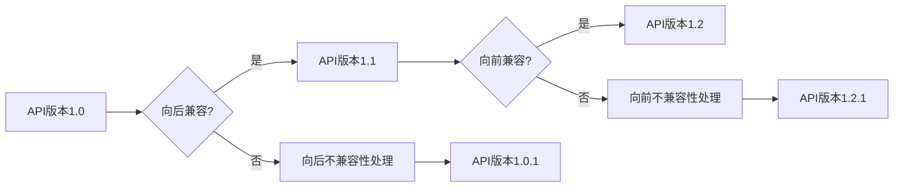

# API 版本控制的基本原则

> 关键词：API版本控制，向后兼容性，向前兼容性，语义化版本控制，向后不兼容性，变更管理，API进化，最佳实践

## 1. 背景介绍

随着互联网和软件行业的快速发展，API（应用程序编程接口）成为了连接不同系统和服务的桥梁。API使得开发者能够轻松地集成第三方的服务和功能，构建出更加丰富和功能齐全的应用程序。然而，随着API的持续迭代和进化，如何管理API版本，确保系统的向后兼容性和向前兼容性，成为了软件开发中的一个重要课题。

## 2. 核心概念与联系

### 2.1 核心概念

- **API版本控制**：指管理和追踪API的变化，包括添加新功能、修改现有功能或删除功能的过程。
- **向后兼容性**：指新版本的API在向后兼容旧版本的情况下仍然能够正常工作。
- **向前兼容性**：指旧版本的客户端可以与新的API版本无缝交互。
- **向后不兼容性**：指新版本的API无法与旧版本的客户端兼容。
- **变更管理**：指对API变更进行规划、实施和监控的过程。
- **API进化**：指API随着时间的推移而逐渐发展和完善。

### 2.2 Mermaid 流程图



### 2.3 核心概念联系

API版本控制是确保向后兼容性和向前兼容性的关键。向后兼容性保证了现有服务的稳定性，而向前兼容性则允许客户端在不修改代码的情况下，使用新的API功能。当必须进行向后不兼容或向前不兼容的变更时，需要进行妥善处理，以确保系统的平滑过渡。

## 3. 核心算法原理 & 具体操作步骤

### 3.1 算法原理概述

API版本控制的核心原理是基于语义化版本控制的变更管理。语义化版本控制（SemVer）是一种对API版本进行标记和管理的规范，它通过版本号的不同部分来表示变更的类型和影响。

### 3.2 算法步骤详解

1. **版本号格式**：遵循SemVer格式，版本号通常由主版本号、次版本号和修订号组成，例如`1.2.3`。
2. **向后兼容变更**：增加新的API端点或功能，但不应破坏现有端点或功能的语义。
3. **向后不兼容变更**：添加新端点或功能，或修改现有端点或功能，可能导致旧客户端无法使用。
4. **向前兼容变更**：添加新的API端点或功能，旧客户端可以继续使用旧端点或功能。
5. **向前不兼容变更**：删除现有端点或功能，或修改现有端点或功能的语义，可能导致旧客户端无法使用。
6. **文档更新**：在每次版本变更时，及时更新API文档，包括版本号、变更说明、新功能、已废弃功能等信息。
7. **通知客户端**：通过邮件、API通知等方式，告知客户端API的变更情况。

### 3.3 算法优缺点

#### 优点

- **清晰的管理**：SemVer提供了一种清晰和一致的方式来管理API版本。
- **透明性**：变更管理和文档更新确保了所有利益相关者都能了解API的当前状态和未来方向。
- **灵活性**：允许在不影响现有客户端的情况下添加新功能。

#### 缺点

- **复杂性**：管理API版本和变更可能变得复杂，特别是对于大型API集合。
- **文档更新**：需要定期更新API文档，以保持其准确性和相关性。

### 3.4 算法应用领域

API版本控制适用于所有使用API的系统，包括Web服务、移动应用、桌面应用程序等。

## 4. 数学模型和公式 & 详细讲解 & 举例说明

### 4.1 数学模型构建

API版本控制可以通过以下数学模型来表示：

- \$ V = MA + MI + MB \$

其中：
- \$ V \$ 是版本号。
- \$ MA \$ 是主版本号。
- \$ MI \$ 是次版本号。
- \$ MB \$ 是修订号。

### 4.2 公式推导过程

版本号的每个部分都有特定的含义：
- 主版本号：表示重大功能或架构的变化。
- 次版本号：表示非重大功能或优化。
- 修订号：表示修复错误。

### 4.3 案例分析与讲解

假设我们有一个API版本`1.2.3`，以下是可能的变更：

- 添加了新的API端点`/v1/users/profile`，次版本号增加，变为`1.3.0`。
- 修改了`/v1/users/login`端点的参数，但不影响功能，修订号增加，变为`1.2.4`。
- 删除了`/v1/users/logout`端点，因为已经不再使用，主版本号增加，变为`2.0.0`。

## 5. 项目实践：代码实例和详细解释说明

### 5.1 开发环境搭建

为了演示API版本控制，我们可以使用一个简单的Python Flask应用程序。

### 5.2 源代码详细实现

```python
from flask import Flask, jsonify, request

app = Flask(__name__)

# 版本1.0
@app.route('/v1/users/profile', methods=['GET'])
def get_user_profile_v1():
    return jsonify({"name": "John Doe", "age": 30})

# 版本1.1
@app.route('/v1/users/profile', methods=['GET'])
def get_user_profile_v1():
    return jsonify({"name": "John Doe", "age": 30, "email": "john.doe@example.com"})

# 版本2.0
@app.route('/v2/users/profile', methods=['GET'])
def get_user_profile_v2():
    return jsonify({"name": "John Doe", "age": 30, "email": "john.doe@example.com"})

if __name__ == '__main__':
    app.run(debug=True)
```

### 5.3 代码解读与分析

在上面的代码中，我们模拟了API版本的控制。在版本1.0中，我们只提供了用户的基本信息。在版本1.1中，我们添加了用户的电子邮件信息。在版本2.0中，我们删除了旧版本的`/v1/users/profile`端点，并引入了新的端点`/v2/users/profile`。

### 5.4 运行结果展示

运行上述代码后，可以通过访问`/v1/users/profile`和`/v2/users/profile`来查看不同版本的API响应。

## 6. 实际应用场景

API版本控制在以下场景中非常有用：

- **Web服务**：在RESTful API中，版本控制确保了服务能够向后兼容。
- **移动应用**：移动应用的API版本控制可以帮助开发者在不影响现有用户的情况下，添加新功能。
- **桌面应用程序**：桌面应用程序的API版本控制可以确保新版本的应用程序能够与旧版本的应用程序兼容。

### 6.4 未来应用展望

随着API变得越来越复杂，API版本控制将变得更加重要。未来的API版本控制可能包括以下趋势：

- **自动化版本控制**：通过自动化工具来管理API版本和变更。
- **智能版本控制**：使用机器学习来预测API变更的影响。
- **社区驱动的版本控制**：鼓励开发者参与API的版本控制过程。

## 7. 工具和资源推荐

### 7.1 学习资源推荐

- 《RESTful API设计最佳实践》
- 《API版本控制与文档》

### 7.2 开发工具推荐

- **Swagger**：用于API设计和文档的工具。
- **Postman**：用于API测试和调试的工具。

### 7.3 相关论文推荐

- 《RESTful API设计指南》

## 8. 总结：未来发展趋势与挑战

### 8.1 研究成果总结

本文介绍了API版本控制的基本原则，包括向后兼容性、向前兼容性、向后不兼容性和向前不兼容性。我们讨论了API版本控制的核心概念和联系，并提供了具体的操作步骤和数学模型。

### 8.2 未来发展趋势

API版本控制将变得更加自动化、智能化和社区驱动的。

### 8.3 面临的挑战

API版本控制面临的挑战包括复杂性、文档更新和自动化。

### 8.4 研究展望

未来的研究将集中在如何自动化API版本控制、如何使用机器学习来预测变更影响以及如何鼓励社区参与API版本控制等方面。

## 9. 附录：常见问题与解答

**Q1：什么是向后兼容性？**

A：向后兼容性是指新版本的API在向后兼容旧版本的情况下仍然能够正常工作。

**Q2：为什么API版本控制很重要？**

A：API版本控制确保了系统的稳定性和可维护性，同时允许开发者在不影响现有用户的情况下添加新功能。

**Q3：如何处理向后不兼容的变更？**

A：在处理向后不兼容的变更时，需要提供清晰的文档和迁移指南，以帮助客户端适应新的API。

**Q4：API版本控制和API文档有什么区别？**

A：API版本控制管理API的变化，而API文档描述API的功能和用法。

**Q5：如何自动化API版本控制？**

A：可以使用自动化工具来管理API版本和变更，例如Swagger或Postman。

作者：禅与计算机程序设计艺术 / Zen and the Art of Computer Programming