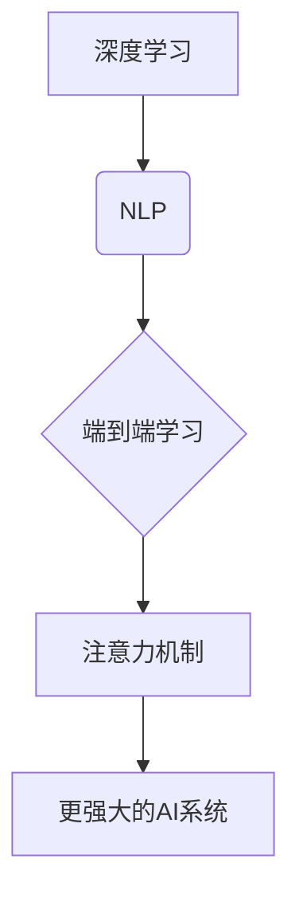

> 人工智能，未来战略，Andrej Karpathy，深度学习，自然语言处理，计算资源，人机交互

---

# Andrej Karpathy：人工智能的未来发展策略

在人工智能领域，Andrej Karpathy是一位备受尊敬的专家和思想家。他的工作在自然语言处理(NLP)和深度学习领域产生了深远的影响。在这篇文章中，我们将探讨Andrej Karpathy对人工智能未来发展的策略，包括核心概念、算法原理、实际应用和面临的挑战。

## 1. 背景介绍

Andrej Karpathy是一位在人工智能领域有着广泛影响力的技术专家。他在Google Brain和OpenAI等顶级研究机构工作过，并在斯坦福大学获得了博士学位。他的工作主要集中在NLP和深度学习领域，特别是在序列模型、注意力机制和端到端学习方面。

Karpathy的博客和文章经常探讨人工智能的未来发展方向，提供深入见解和前瞻性的思考。他的工作对理解人工智能的发展趋势和潜在挑战具有重要意义。

## 2. 核心概念与联系

### 2.1 核心概念原理

在人工智能领域，有几个核心概念对于理解Andrej Karpathy的未来发展策略至关重要：

- **深度学习**：一种通过多层神经网络进行数据学习的机器学习技术，能够从大量数据中学习复杂的模式。
- **自然语言处理(NLP)**：人工智能的一个子领域，专注于使计算机能够理解和生成人类语言。
- **端到端学习**：一种机器学习方法，其中模型直接从原始数据（如文本或图像）学习到最终输出，而不需要中间步骤。
- **注意力机制**：一种神经网络架构，能够使模型关注输入数据的特定部分，从而提高性能。

### 2.2 架构的 Mermaid 流程图

以下是一个简化的Mermaid流程图，展示了这些概念之间的关系：



## 3. 核心算法原理 & 具体操作步骤

### 3.1 算法原理概述

Andrej Karpathy的策略主要集中在以下几个方面：

- **数据驱动**：通过收集和分析大量数据来训练和优化模型。
- **模型复用**：利用预训练模型作为起点，通过微调适应特定任务。
- **端到端学习**：构建能够直接从输入数据学习到输出的模型。
- **注意力机制**：使模型能够关注输入数据的特定部分，提高性能。

### 3.2 算法步骤详解

1. **数据收集**：收集大量相关数据，包括文本、图像、声音等。
2. **数据预处理**：清洗、标注和转换数据，使其适合模型训练。
3. **模型选择**：选择合适的预训练模型，如BERT或GPT。
4. **模型微调**：使用特定任务的数据对预训练模型进行微调。
5. **模型评估**：在验证集上评估模型性能，并进行必要的调整。
6. **模型部署**：将微调后的模型部署到实际应用中。

### 3.3 算法优缺点

**优点**：

- 提高效率：端到端学习和模型复用可以显著加快开发速度。
- 提高性能：注意力机制和微调可以显著提高模型性能。
- 减少成本：数据驱动的方法可以减少对专家知识的依赖。

**缺点**：

- 数据依赖：需要大量高质量的数据。
- 计算资源：训练深度学习模型需要大量的计算资源。
- 过度拟合：模型可能过度拟合训练数据，导致泛化能力差。

### 3.4 算法应用领域

Andrej Karpathy的策略在以下领域应用广泛：

- 文本生成
- 文本摘要
- 机器翻译
- 图像识别
- 语音识别

## 4. 数学模型和公式 & 详细讲解 & 举例说明

### 4.1 数学模型构建

在深度学习模型中，一个典型的数学模型可能包括以下部分：

- **激活函数**：如ReLU、Sigmoid或Tanh，用于引入非线性。
- **损失函数**：如交叉熵损失，用于衡量预测结果与真实标签之间的差异。
- **优化器**：如Adam或SGD，用于更新模型参数。

### 4.2 公式推导过程

以下是一个简单的神经网络模型，包括一个输入层、一个隐藏层和一个输出层：

$$
y = f(W_3 \cdot f(W_2 \cdot f(W_1 \cdot x + b_1) + b_2) + b_3)
$$

其中，$W_1, W_2, W_3$ 是权重矩阵，$b_1, b_2, b_3$ 是偏置项，$f$ 是激活函数。

### 4.3 案例分析与讲解

以BERT模型为例，它是一种基于Transformer的自回归语言模型。BERT模型通过在大量无标注文本上进行预训练，学习到了丰富的语言知识。在微调阶段，BERT可以用于各种NLP任务，如文本分类、命名实体识别和问答系统。

## 5. 项目实践：代码实例和详细解释说明

### 5.1 开发环境搭建

为了进行人工智能项目实践，你需要以下开发环境：

- Python
- TensorFlow或PyTorch
- GPU或TPU

### 5.2 源代码详细实现

以下是一个使用PyTorch实现BERT模型微调的简单示例：

```python
import torch
from transformers import BertForSequenceClassification, BertTokenizer

# 加载预训练的BERT模型和分词器
model = BertForSequenceClassification.from_pretrained('bert-base-uncased')
tokenizer = BertTokenizer.from_pretrained('bert-base-uncased')

# 处理文本数据
encoded_input = tokenizer("Hello, my dog is cute", return_tensors='pt')

# 将数据传递给模型
outputs = model(**encoded_input)

# 获取预测结果
predictions = torch.nn.functional.softmax(outputs.logits, dim=-1)
```

### 5.3 代码解读与分析

这个简单的示例展示了如何加载预训练的BERT模型，处理文本数据，并获取模型的预测结果。在实际应用中，你需要收集和预处理大量的文本数据，并根据你的具体任务对模型进行调整和优化。

### 5.4 运行结果展示

在这个例子中，BERT模型会输出一个概率分布，表示每个类别的可能性。你可以根据这个分布选择最可能的类别作为预测结果。

## 6. 实际应用场景

Andrej Karpathy的策略在以下实际应用场景中取得了成功：

- **问答系统**：使用BERT模型构建问答系统，能够自动回答用户的问题。
- **聊天机器人**：利用BERT模型构建聊天机器人，能够与用户进行自然对话。
- **文本摘要**：使用BERT模型生成文本摘要，提取文本中的关键信息。
- **机器翻译**：使用BERT模型进行机器翻译，提高翻译的准确性和流畅性。

## 7. 工具和资源推荐

### 7.1 学习资源推荐

- 《Deep Learning with Python》
- 《Neural Networks and Deep Learning》
- Hugging Face Transformers库

### 7.2 开发工具推荐

- PyTorch
- TensorFlow
- Google Colab

### 7.3 相关论文推荐

- "Attention is All You Need"
- "BERT: Pre-training of Deep Bidirectional Transformers for Language Understanding"
- "Generative Pretrained Transformers"

## 8. 总结：未来发展趋势与挑战

### 8.1 研究成果总结

Andrej Karpathy的工作展示了深度学习和NLP的巨大潜力。他的策略强调了数据驱动、模型复用、端到端学习和注意力机制的重要性。

### 8.2 未来发展趋势

未来，人工智能将在以下方面取得进展：

- 模型规模将进一步扩大
- 计算资源将更加丰富
- 模型将更加可解释和可靠
- 人机交互将更加自然

### 8.3 面临的挑战

尽管人工智能取得了巨大进步，但仍面临以下挑战：

- 数据隐私和安全
- 模型偏见和歧视
- 技术可解释性和可靠性
- 伦理和社会影响

### 8.4 研究展望

未来，人工智能的研究将更加注重以下方面：

- 可解释性和可靠性
- 伦理和社会影响
- 跨学科合作
- 开放式研究和共享

## 9. 附录：常见问题与解答

**Q1：Andrej Karpathy的主要研究领域是什么？**

A1：Andrej Karpathy的主要研究领域是自然语言处理和深度学习，特别是序列模型、注意力机制和端到端学习。

**Q2：如何开始学习人工智能？**

A2：开始学习人工智能，可以从Python编程、机器学习和深度学习基础开始。推荐资源包括《Deep Learning with Python》和《Neural Networks and Deep Learning》。

**Q3：BERT模型是如何工作的？**

A3：BERT模型是一种基于Transformer的自回归语言模型，通过在大量无标注文本上进行预训练，学习到了丰富的语言知识。在微调阶段，BERT可以用于各种NLP任务。

**Q4：人工智能的未来发展趋势是什么？**

A4：人工智能的未来发展趋势包括模型规模扩大、计算资源丰富、模型可解释性和可靠性提高、人机交互更加自然。

**Q5：人工智能对社会的影响是什么？**

A5：人工智能对社会的影响是双刃剑。它既带来了许多便利和机遇，也带来了数据隐私、偏见和伦理等问题。

---

作者：禅与计算机程序设计艺术 / Zen and the Art of Computer Programming