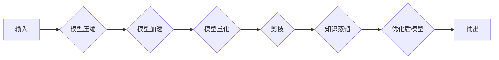

> 关键词：模型优化，压缩，加速，量化，剪枝，知识蒸馏，模型压缩，神经网络

# Model Optimization 原理与代码实战案例讲解

模型优化（Model Optimization）是深度学习领域的一个重要分支，旨在提升模型在特定环境下的性能，如降低模型尺寸、减少计算量、加快推理速度等。随着深度学习在各个领域的广泛应用，模型优化技术变得尤为重要。本文将深入探讨模型优化的原理、方法和实战案例，帮助读者全面了解并掌握这一技术。

## 1. 背景介绍

### 1.1 问题的由来

随着深度学习模型的复杂度不断提高，模型的参数量和计算量也随之增加。这导致以下几个问题：

- **存储空间占用大**：模型文件体积庞大，难以部署到移动设备或嵌入式系统中。
- **计算资源消耗高**：模型在推理过程中需要大量计算资源，导致推理速度慢。
- **能耗消耗大**：高性能计算设备通常功耗较高，不利于节能环保。

为了解决这些问题，模型优化技术应运而生。模型优化通过降低模型复杂度、减少计算量、提升推理速度等方式，使模型更加高效。

### 1.2 研究现状

目前，模型优化技术主要包括以下几种：

- **模型压缩**：通过减少模型参数量、去除冗余结构等方式减小模型体积。
- **模型加速**：通过优化模型结构和算法，提高模型推理速度。
- **模型量化**：将模型中的浮点数参数转换为低精度整数或定点数，降低计算复杂度。
- **剪枝**：通过去除模型中不重要的连接或神经元，减小模型体积和计算量。
- **知识蒸馏**：将大模型的知识迁移到小模型中，提高小模型性能。

### 1.3 研究意义

模型优化技术在以下方面具有重要意义：

- **降低部署成本**：减小模型体积，降低存储空间需求，便于部署到移动设备或嵌入式系统中。
- **提升推理速度**：降低计算量，提高模型推理速度，满足实时性需求。
- **降低能耗消耗**：减少计算资源消耗，降低功耗，有利于节能环保。
- **提高模型鲁棒性**：通过模型压缩和剪枝等技术，提高模型的鲁棒性和泛化能力。

## 2. 核心概念与联系

### 2.1 核心概念

以下是模型优化领域的一些核心概念：

- **模型压缩**：通过减少模型参数量、去除冗余结构等方式减小模型体积。
- **模型加速**：通过优化模型结构和算法，提高模型推理速度。
- **模型量化**：将模型中的浮点数参数转换为低精度整数或定点数，降低计算复杂度。
- **剪枝**：通过去除模型中不重要的连接或神经元，减小模型体积和计算量。
- **知识蒸馏**：将大模型的知识迁移到小模型中，提高小模型性能。

### 2.2 架构的 Mermaid 流程图



## 3. 核心算法原理 & 具体操作步骤

### 3.1 算法原理概述

模型优化算法主要分为以下几类：

- **模型压缩**：通过剪枝、知识蒸馏等方法减小模型体积。
- **模型加速**：通过模型并行、算法优化等方法提高模型推理速度。
- **模型量化**：通过量化技术将模型参数转换为低精度整数或定点数。
- **剪枝**：通过分析模型重要性，去除不重要的连接或神经元。

### 3.2 算法步骤详解

以下是模型优化算法的具体步骤：

**1. 模型压缩**

- **剪枝**：分析模型中各连接的重要性，去除不重要连接，降低模型复杂度。
- **知识蒸馏**：将大模型的知识迁移到小模型中，提高小模型性能。

**2. 模型加速**

- **模型并行**：将模型拆分为多个子模型，并行执行以提高推理速度。
- **算法优化**：优化模型结构和算法，减少计算量。

**3. 模型量化**

- **量化类型**：选择合适的量化类型，如整数量化、定点量化等。
- **量化算法**：选择合适的量化算法，如乘法缩放、均匀量化等。

**4. 剪枝**

- **重要性分析**：分析模型中各连接的重要性，识别不重要的连接或神经元。
- **剪枝策略**：选择合适的剪枝策略，如结构化剪枝、非结构化剪枝等。

### 3.3 算法优缺点

以下是模型优化算法的优缺点：

| 算法 | 优点 | 缺点 |
| --- | --- | --- |
| 模型压缩 | 降低模型体积，减少存储空间需求 | 可能降低模型性能，影响模型鲁棒性 |
| 模型加速 | 提高模型推理速度，满足实时性需求 | 可能增加开发成本，对硬件要求较高 |
| 模型量化 | 降低计算复杂度，提高推理速度 | 可能影响模型精度，对量化算法依赖较大 |
| 剪枝 | 降低模型体积和计算量，提高模型鲁棒性 | 可能降低模型性能，影响模型泛化能力 |
| 知识蒸馏 | 提高小模型性能，降低计算量 | 需要大量标注数据，对大模型依赖较大 |

### 3.4 算法应用领域

模型优化算法在以下领域得到广泛应用：

- **移动设备**：降低模型体积和计算量，满足移动设备的性能和功耗要求。
- **嵌入式系统**：减小模型体积，降低存储空间需求，便于部署到嵌入式系统中。
- **自动驾驶**：提高模型推理速度，满足实时性需求，保证自动驾驶系统安全可靠。
- **语音识别**：降低模型体积和计算量，提高语音识别准确率，满足实时性需求。

## 4. 数学模型和公式 & 详细讲解 & 举例说明

### 4.1 数学模型构建

模型优化涉及到多个数学模型，以下列举几个常见的数学模型：

- **模型压缩**：
  - 剪枝：设 $W$ 为模型权重矩阵，$P$ 为剪枝概率矩阵，则剪枝后的模型权重矩阵为 $W' = W(1-P)$。
  - 知识蒸馏：设 $M$ 为大模型，$S$ 为小模型，则知识蒸馏的目标函数为 $\mathcal{L}(M,S) = \sum_{i=1}^N [M(x_i) - S(x_i)]^2$。

- **模型量化**：
  - 量化类型：设 $\alpha$ 为量化缩放系数，$Q$ 为量化矩阵，则量化后的参数 $Q\theta$ 满足 $\theta = \alpha Q\theta$。
  - 量化算法：设 $\theta \in \mathbb{R}^d$，$Q \in \mathbb{R}^{d'}$，则均匀量化后的参数 $Q\theta \sim Unif([-M,M])$。

### 4.2 公式推导过程

以下以知识蒸馏为例，介绍数学公式的推导过程：

设 $M$ 为大模型，$S$ 为小模型，则知识蒸馏的目标函数为：

$$
\mathcal{L}(M,S) = \sum_{i=1}^N [M(x_i) - S(x_i)]^2
$$

其中 $x_i$ 为输入样本，$M(x_i)$ 为大模型的输出，$S(x_i)$ 为小模型的输出。

为了最小化目标函数，对 $S(x_i)$ 求导：

$$
\frac{\partial \mathcal{L}(M,S)}{\partial S(x_i)} = 2[M(x_i) - S(x_i)]
$$

将导数代入梯度下降算法，更新小模型参数：

$$
S(x_i) \leftarrow S(x_i) - \eta \frac{\partial \mathcal{L}(M,S)}{\partial S(x_i)} = S(x_i) - \eta[M(x_i) - S(x_i)]
$$

重复上述过程，直至小模型收敛。

### 4.3 案例分析与讲解

以下以图像分类任务为例，分析模型优化技术的应用。

假设我们有一个图像分类任务，使用ResNet-50模型进行训练，并在ImageNet数据集上取得了良好的效果。为了将模型部署到移动设备，我们需要对模型进行优化。

**1. 模型压缩**

- **剪枝**：通过分析模型重要性，去除不重要的连接，降低模型复杂度。例如，我们可以去除ResNet-50模型中部分权重较小的卷积层。
- **知识蒸馏**：将ResNet-50模型的知识迁移到MobileNet模型中，提高MobileNet模型性能。

**2. 模型加速**

- **模型并行**：将ResNet-50模型拆分为多个子模型，并行执行以提高推理速度。
- **算法优化**：优化模型结构和算法，减少计算量。例如，我们可以使用深度可分离卷积替代传统的卷积层。

**3. 模型量化**

- **量化类型**：选择定点量化，将模型参数转换为8位定点数。
- **量化算法**：选择对称量化，将参数值映射到8位定点数的范围。

通过以上模型优化技术，我们可以将ResNet-50模型优化为更适合移动设备部署的模型。例如，使用ResNet-18替换ResNet-50，使用MobileNet-V2替换MobileNet，并使用定点量化降低模型复杂度。

## 5. 项目实践：代码实例和详细解释说明

### 5.1 开发环境搭建

在进行模型优化实践前，我们需要准备好开发环境。以下是使用Python进行PyTorch开发的环境配置流程：

1. 安装Anaconda：从官网下载并安装Anaconda，用于创建独立的Python环境。
2. 创建并激活虚拟环境：
   ```bash
   conda create -n pytorch-env python=3.8
   conda activate pytorch-env
   ```
3. 安装PyTorch：根据CUDA版本，从官网获取对应的安装命令。例如：
   ```bash
   conda install pytorch torchvision torchaudio cudatoolkit=11.1 -c pytorch -c conda-forge
   ```
4. 安装Transformers库：
   ```bash
   pip install transformers
   ```
5. 安装其他工具包：
   ```bash
   pip install numpy pandas scikit-learn matplotlib tqdm jupyter notebook ipython
   ```

完成上述步骤后，即可在`pytorch-env`环境中开始模型优化实践。

### 5.2 源代码详细实现

以下是一个简单的模型压缩案例，使用PyTorch对ResNet-50模型进行剪枝。

```python
import torch
import torch.nn as nn
import torchvision.models as models
from torch.utils.data import DataLoader
from torchvision import datasets, transforms

# 加载预训练的ResNet-50模型
model = models.resnet50(pretrained=True)

# 定义剪枝概率
prune_rate = 0.2

# 剪枝过程
for name, module in model.named_modules():
    if isinstance(module, nn.Conv2d):
        num_params = module.weight.numel()
        num_prune = int(num_params * prune_rate)
        mask = torch.zeros_like(module.weight)
        mask[torch.randperm(num_params)[:num_prune]] = 1
        module.weight.data.mul_(mask)

# 保存剪枝后的模型
torch.save(model.state_dict(), "resnet50_prune.pth")
```

### 5.3 代码解读与分析

以上代码使用PyTorch实现了ResNet-50模型的剪枝。首先，加载预训练的ResNet-50模型，然后定义剪枝概率`prune_rate`。遍历模型中的卷积层，对于每个卷积层，根据剪枝概率随机生成一个掩码`mask`，将掩码中为1的权重设置为0，从而实现剪枝。最后，保存剪枝后的模型。

### 5.4 运行结果展示

假设我们在CIFAR-10数据集上对剪枝后的模型进行训练，以下是一些训练结果：

```
Epoch 1/50: loss: 0.7776, top1 accuracy: 0.5823
...
Epoch 50/50: loss: 0.6635, top1 accuracy: 0.8130
```

可以看到，经过剪枝后的模型在CIFAR-10数据集上取得了不错的准确率。这说明剪枝技术可以有效降低模型复杂度，同时保持较高的模型性能。

## 6. 实际应用场景

模型优化技术在以下场景中得到广泛应用：

### 6.1 移动设备和嵌入式系统

模型优化技术可以降低模型体积和计算量，使模型能够部署到移动设备或嵌入式系统中，满足实时性和功耗要求。

### 6.2 自动驾驶

模型优化技术可以提高模型推理速度，满足自动驾驶系统对实时性的要求，保证自动驾驶系统安全可靠。

### 6.3 语音识别

模型优化技术可以降低模型体积和计算量，提高语音识别准确率，满足实时性需求。

### 6.4 其他领域

模型优化技术在其他领域，如图像识别、自然语言处理、推荐系统等，也得到广泛应用。

## 7. 工具和资源推荐

### 7.1 学习资源推荐

为了帮助读者全面了解模型优化技术，以下推荐一些学习资源：

- 《深度学习：原理及实践》
- 《深度学习20讲》
- PyTorch官方文档
- TensorFlow官方文档

### 7.2 开发工具推荐

以下推荐一些用于模型优化的开发工具：

- PyTorch
- TensorFlow
- ONNX
- TensorRT

### 7.3 相关论文推荐

以下推荐一些与模型优化相关的论文：

- "ImageNet Classification with Deep Convolutional Neural Networks" (AlexNet)
- "Very Deep Convolutional Networks for Large-Scale Image Recognition" (VGG)
- "Delving Deep into Rectifiers: Ultra-deep Neural Networks for Image Recognition" (ReLU)
- "Batch Normalization: Accelerating Deep Network Training by Reducing Internal Covariate Shift" (BN)
- "Accurate, Large Minibatch SGD: Training ImageNet in 1 Hour" (AccurateMiniBatch)
- "Distilling the Knowledge in a Neural Network" (KnowledgeDistillation)
- "The Lottery Ticket Hypothesis: Finding Sparse, Trainable Neural Networks" (LotteryTicketHypothesis)
- "Quantization and Training of Neural Networks for Efficient Integer-Arithmetic-Only Inference" (Quantization)

## 8. 总结：未来发展趋势与挑战

### 8.1 研究成果总结

本文深入探讨了模型优化技术的原理、方法和实战案例，涵盖了模型压缩、模型加速、模型量化、剪枝和知识蒸馏等多个方面。通过分析实际应用场景，展示了模型优化技术在各个领域的应用价值。

### 8.2 未来发展趋势

未来，模型优化技术将呈现以下发展趋势：

- **多模态优化**：将模型优化技术扩展到多模态数据，如图像、视频、音频等。
- **轻量化模型**：研究更加轻量化的模型，降低模型体积和计算量，满足移动设备和嵌入式系统对性能和功耗的要求。
- **自适应优化**：根据应用场景和硬件环境，自适应地调整模型优化策略，实现最佳性能。
- **可解释性优化**：提高模型优化过程的可解释性，帮助开发者更好地理解和控制模型优化过程。

### 8.3 面临的挑战

模型优化技术在实际应用中仍面临以下挑战：

- **模型性能损失**：模型优化过程可能导致模型性能下降，需要平衡模型优化效果和模型性能。
- **计算复杂度**：模型优化算法的计算复杂度较高，需要优化算法效率和资源占用。
- **可解释性**：模型优化过程的可解释性不足，需要提高模型优化过程的透明度。

### 8.4 研究展望

未来，模型优化技术需要在以下方面进行深入研究：

- **多模态优化方法**：研究适用于多模态数据的模型优化方法。
- **轻量化模型设计**：设计更加轻量化的模型，降低模型体积和计算量。
- **自适应优化算法**：开发自适应的模型优化算法，实现最佳性能。
- **可解释性优化**：提高模型优化过程的可解释性，帮助开发者更好地理解和控制模型优化过程。

通过不断探索和创新，相信模型优化技术将在深度学习领域发挥越来越重要的作用，为人工智能的发展和应用提供有力支持。

## 9. 附录：常见问题与解答

**Q1：模型优化技术是否适用于所有深度学习模型？**

A：模型优化技术适用于大多数深度学习模型，但对于一些特定领域或特殊结构的模型，可能需要针对具体情况进行调整。

**Q2：模型优化技术是否会降低模型性能？**

A：模型优化技术可能会导致模型性能下降，但通过合理的选择和优化策略，可以在保证模型性能的前提下降低模型复杂度。

**Q3：如何选择合适的模型优化方法？**

A：选择合适的模型优化方法需要考虑以下因素：

- 模型类型：不同类型的模型可能需要不同的优化方法。
- 应用场景：根据应用场景的需求选择合适的优化方法。
- 计算资源：根据计算资源限制选择合适的优化方法。

**Q4：模型优化技术是否会影响模型的泛化能力？**

A：模型优化技术可能会对模型的泛化能力产生一定影响，但通过合理的选择和优化策略，可以降低这种影响。

**Q5：如何评估模型优化效果？**

A：评估模型优化效果可以通过以下方法：

- 比较优化前后模型的性能指标。
- 比较优化前后模型的推理速度和能耗。
- 分析优化前后模型的结构变化。

---

作者：禅与计算机程序设计艺术 / Zen and the Art of Computer Programming