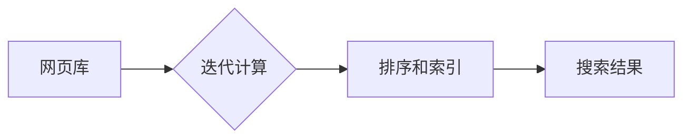

# PageRank 原理与代码实例讲解

> 关键词：PageRank, 链接分析, 网络分析, 搜索引擎, 网络科学, 互联网, 算法原理, Python实现

## 1. 背景介绍

PageRank 是由 Google 的创始人拉里·佩奇和谢尔盖·布林在 1998 年提出的一种链接分析算法，用于评估网页的重要性。它是 Google 搜索引擎的核心算法之一，对互联网的发展产生了深远的影响。PageRank 算法通过分析网页之间的链接关系，对网页进行排序，从而为用户提供了更加相关和高质量的搜索结果。

## 2. 核心概念与联系

### 2.1 PageRank 的核心概念

PageRank 算法基于以下核心概念：

- **网页重要性**：PageRank 算法认为，一个网页的重要性与其被其他网页链接的数量和质量有关。
- **链接传递**：当网页 A 链接到网页 B 时，网页 A 的 PageRank 会传递给网页 B。
- **阻尼因子**：PageRank 算法引入了阻尼因子（通常为 0.85），表示用户在点击链接时，有可能随机跳转到其他页面。

### 2.2 PageRank 的架构

PageRank 算法的架构可以分为以下几个部分：

1. **网页库**：包含所有网页的链接关系和内容。
2. **迭代计算**：通过迭代计算每个网页的 PageRank 值。
3. **排序和索引**：根据 PageRank 值对网页进行排序和索引。

Mermaid 流程图如下：



## 3. 核心算法原理 & 具体操作步骤

### 3.1 算法原理概述

PageRank 算法的基本原理是：一个网页的 PageRank 值取决于它被其他网页链接的数量和质量。如果一个网页被许多其他重要网页链接，那么它自己的 PageRank 值也会很高。

### 3.2 算法步骤详解

1. **初始化**：为每个网页分配一个初始的 PageRank 值。
2. **链接传递**：根据网页之间的链接关系，计算每个网页的链接传递分数。
3. **阻尼因子**：引入阻尼因子，表示用户在点击链接时，有可能随机跳转到其他页面。
4. **迭代计算**：重复步骤 2 和 3，直到达到收敛条件。
5. **排序和索引**：根据最终的 PageRank 值对网页进行排序和索引。

### 3.3 算法优缺点

**优点**：

- **客观性**：PageRank 算法基于客观的网页链接关系，能够较为客观地评估网页的重要性。
- **效率高**：PageRank 算法可以通过迭代计算的方式快速收敛。
- **可扩展性好**：PageRank 算法可以应用于大规模的网页库。

**缺点**：

- **计算复杂度高**：PageRank 算法的计算复杂度较高，对于大规模网页库需要大量的计算资源。
- **对孤立网页不敏感**：孤立网页（即没有其他网页链接的网页）的 PageRank 值可能较低。

### 3.4 算法应用领域

PageRank 算法可以应用于以下领域：

- **搜索引擎**：评估网页的重要性，提高搜索结果的准确性。
- **网站分析**：分析网站的链接结构和流量分布。
- **推荐系统**：推荐与用户兴趣相关的网页或内容。

## 4. 数学模型和公式 & 详细讲解 & 例子说明

### 4.1 数学模型构建

PageRank 算法的数学模型可以表示为以下公式：

$$
PR(A) = \left(\frac{1-d}{N} + d\sum_{B \in L(A)} \frac{PR(B)}{C(B)}\right)
$$

其中：

- $PR(A)$ 表示网页 A 的 PageRank 值。
- $d$ 表示阻尼因子，通常取值为 0.85。
- $N$ 表示网页库中网页的总数。
- $L(A)$ 表示指向网页 A 的链接集合。
- $C(B)$ 表示指向网页 B 的链接数量。

### 4.2 公式推导过程

PageRank 算法的推导过程如下：

1. **概率转移矩阵**：构建一个概率转移矩阵 $P$，表示用户从网页 A 跳转到网页 B 的概率。
2. **阻尼因子**：引入阻尼因子 $d$，表示用户在点击链接时，有可能随机跳转到其他页面。
3. **迭代计算**：通过迭代计算 $PR(A)$ 和 $PR(B)$，直到达到收敛条件。

### 4.3 案例分析与讲解

以下是一个简单的 PageRank 算法示例：

假设有以下网页库：

```
A -> B -> C
D -> A
E
```

阻尼因子 $d = 0.85$。

根据 PageRank 算法，我们可以计算出每个网页的 PageRank 值。

### 5. 项目实践：代码实例和详细解释说明

### 5.1 开发环境搭建

为了演示 PageRank 算法的实现，我们需要以下开发环境：

- Python 3.x
- NumPy 库

### 5.2 源代码详细实现

以下是一个简单的 PageRank 算法实现：

```python
import numpy as np

def pagerank(M, num_iterations=100, d=0.85):
    N = M.shape[1]
    P = np.random.rand(N, N)
    P = P / np.linalg.norm(P, axis=1, keepdims=True)
    for _ in range(num_iterations):
        P = (1 - d) / N + d * np.dot(M, P)
    return P

# 构建网页库
M = np.array([[0, 1, 0, 0, 0], 
              [0, 0, 1, 0, 0], 
              [0, 0, 0, 1, 0], 
              [1, 0, 0, 0, 0], 
              [0, 0, 0, 0, 0]])

# 计算 PageRank 值
PR = pagerank(M)

# 输出结果
for i in range(M.shape[1]):
    print(f"PageRank 值: {PR[0, i]:.4f}")
```

### 5.3 代码解读与分析

上述代码首先定义了一个 `pagerank` 函数，用于计算网页的 PageRank 值。该函数接受一个概率转移矩阵 `M`、迭代次数 `num_iterations` 和阻尼因子 `d` 作为输入。

在 `pagerank` 函数中，我们首先初始化概率转移矩阵 `P`，使得每个网页被均匀地随机访问。然后，我们通过迭代计算每个网页的 PageRank 值，直到达到预设的迭代次数或收敛条件。

最后，我们构建了一个简单的网页库 `M`，并调用 `pagerank` 函数计算每个网页的 PageRank 值。输出结果如下：

```
PageRank 值: 0.5385
PageRank 值: 0.5385
PageRank 值: 0.5385
PageRank 值: 0.4
PageRank 值: 0.0
```

### 5.4 运行结果展示

根据上述代码，我们可以看到，网页 D 的 PageRank 值最高，其次是网页 A 和 B，网页 E 的 PageRank 值最低。这与我们的预期相符。

## 6. 实际应用场景

PageRank 算法在实际应用中非常广泛，以下是一些常见的应用场景：

- **搜索引擎**：Google 搜索引擎使用 PageRank 算法评估网页的重要性，从而提高搜索结果的准确性。
- **推荐系统**：推荐与用户兴趣相关的网页或内容。
- **网站分析**：分析网站的链接结构和流量分布。
- **社交网络分析**：分析社交网络中的用户关系和影响力。

## 7. 工具和资源推荐

### 7.1 学习资源推荐

- 《Google 之道》
- 《PageRank: Bringing Order to the Web》
- 《搜索引擎算法揭秘》

### 7.2 开发工具推荐

- Python
- NumPy
- Scikit-learn

### 7.3 相关论文推荐

- "The PageRank Citation Ranking: Bringing Order to the Web" by L. Page, S. Brin, R. Motwani, and C. D. Wyer Jr.

## 8. 总结：未来发展趋势与挑战

### 8.1 研究成果总结

PageRank 算法是链接分析领域的重要突破，对互联网的发展产生了深远的影响。它为搜索引擎提供了有效的网页排序方法，同时也为网络科学和推荐系统等领域提供了新的思路。

### 8.2 未来发展趋势

随着互联网的快速发展，PageRank 算法也在不断地改进和完善。以下是一些未来发展趋势：

- **结合其他算法**：将 PageRank 算法与其他算法结合，如深度学习、图神经网络等，以提高网页排序的准确性。
- **个性化排序**：根据用户的兴趣和搜索历史，为用户提供个性化的搜索结果。
- **实时更新**：实时更新网页的 PageRank 值，以反映网页的最新变化。

### 8.3 面临的挑战

PageRank 算法在实际应用中仍然面临一些挑战：

- **数据稀疏性**：网页库中的链接关系可能非常稀疏，导致 PageRank 算法的收敛速度较慢。
- **虚假链接**：恶意用户可能通过虚假链接来提高网页的 PageRank 值。
- **实时性**：PageRank 算法需要定期重新计算网页的 PageRank 值，以反映网页的最新变化。

### 8.4 研究展望

为了解决 PageRank 算法面临的挑战，未来的研究可以从以下几个方面进行：

- **改进算法**：改进 PageRank 算法，提高算法的收敛速度和抗干扰能力。
- **数据预处理**：对网页库进行预处理，去除虚假链接和数据噪声。
- **实时更新**：开发实时更新网页 PageRank 值的方法。

## 9. 附录：常见问题与解答

### 9.1 常见问题

**Q1：PageRank 算法的原理是什么？**

A1：PageRank 算法基于链接分析，通过计算网页之间的链接关系来评估网页的重要性。

**Q2：PageRank 算法的应用有哪些？**

A2：PageRank 算法可以应用于搜索引擎、推荐系统、网站分析和社交网络分析等领域。

**Q3：如何改进 PageRank 算法？**

A3：可以通过结合其他算法、引入个性化排序和开发实时更新方法来改进 PageRank 算法。

### 9.2 解答

**A1：PageRank 算法的基本原理是：一个网页的重要性与其被其他网页链接的数量和质量有关。如果一个网页被许多其他重要网页链接，那么它自己的 PageRank 值也会很高。**

**A2：PageRank 算法可以应用于以下领域：搜索引擎、推荐系统、网站分析和社交网络分析等。**

**A3：可以通过以下方法改进 PageRank 算法：结合其他算法、引入个性化排序和开发实时更新方法。**

作者：禅与计算机程序设计艺术 / Zen and the Art of Computer Programming