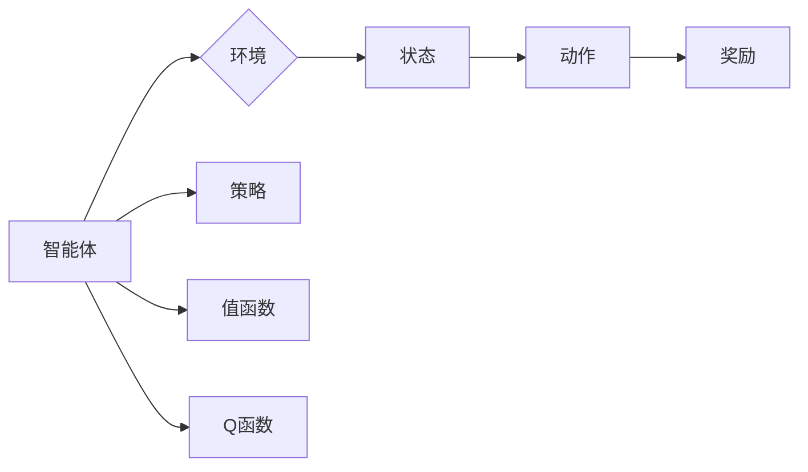

# Q-learning算法

> 关键词：Q-learning, 强化学习, 探索-利用, 价值迭代, 动态规划, 策略迭代, 无人驾驶, 游戏AI

## 1. 背景介绍

强化学习（Reinforcement Learning, RL）作为机器学习的一个重要分支，近年来在人工智能领域取得了显著进展。它通过智能体（Agent）在与环境的交互中学习最优策略，以最大化累积奖励。Q-learning作为强化学习的一种核心算法，因其简洁高效的特性而广泛应用于游戏、机器人、自动驾驶等领域。本文将深入探讨Q-learning算法的原理、实现和应用，带您领略强化学习领域的智慧之光。

### 1.1 问题的由来

在现实生活中，许多问题都可以抽象为智能体在环境中进行决策的过程。例如，自动驾驶汽车在复杂路况下选择最佳行驶路径，机器人学习完成特定任务，以及游戏AI学习战胜人类玩家等。强化学习旨在为智能体提供一种学习机制，使其能够在不断的学习过程中，逐步掌握最优决策策略。

### 1.2 研究现状

Q-learning算法自1989年由Richard S. Sutton和Andrew G. Barto提出以来，经历了数十年的发展。目前，Q-learning已成为强化学习领域最经典、最广泛使用的算法之一。近年来，随着深度学习技术的飞速发展，Q-learning与其他深度学习技术的结合，如深度Q网络（DQN）、深度确定性策略梯度（DDPG）等，使得强化学习在各个领域取得了突破性进展。

### 1.3 研究意义

研究Q-learning算法不仅有助于理解强化学习的基本原理，还能为实际应用提供强大的技术支持。通过掌握Q-learning算法，我们可以为智能体设计高效的学习策略，使其在复杂环境中做出最优决策。

### 1.4 本文结构

本文将围绕以下结构展开：

- 第2部分，介绍Q-learning算法的核心概念与联系。
- 第3部分，详细阐述Q-learning算法的原理和具体操作步骤。
- 第4部分，讲解Q-learning算法的数学模型和公式，并举例说明。
- 第5部分，给出Q-learning算法的代码实现示例，并对关键代码进行解读。
- 第6部分，探讨Q-learning算法在实际应用场景中的案例。
- 第7部分，推荐相关学习资源、开发工具和参考文献。
- 第8部分，总结Q-learning算法的未来发展趋势与挑战。
- 第9部分，提供常见问题与解答。

## 2. 核心概念与联系

为了更好地理解Q-learning算法，本节将介绍几个核心概念及其相互关系。

### 2.1 智能体（Agent）

智能体是强化学习中的主体，它可以在环境中进行决策，并接收来自环境的反馈。

### 2.2 环境和环境状态（Environment）

环境是智能体所处的环境，它为智能体提供状态信息和奖励。

### 2.3 状态（State）

状态是智能体在特定时间点的环境信息，通常用一个状态向量表示。

### 2.4 动作（Action）

动作是智能体可以选择的行动，它决定了智能体在环境中的下一步行为。

### 2.5 奖励（Reward）

奖励是环境对智能体采取动作后给出的反馈，它用于指导智能体学习最优策略。

### 2.6 策略（Policy）

策略是智能体在给定状态下选择动作的规则。

### 2.7 值函数（Value Function）

值函数是智能体在给定状态下的期望收益。

### 2.8 Q函数（Q-Function）

Q函数是智能体在给定状态和动作下的期望收益。

Mermaid 流程图如下：



在上述流程图中，智能体与环境的交互形成了强化学习的基本框架。智能体根据策略选择动作，环境根据动作提供状态和奖励，智能体通过学习更新策略、值函数和Q函数，从而实现自我优化。

## 3. 核心算法原理 & 具体操作步骤

### 3.1 算法原理概述

Q-learning算法通过不断更新Q函数来学习最优策略。其基本思想是：智能体在某个状态s下，选择动作a，并获取奖励r。然后，智能体根据Q函数的预测，选择一个动作a'，并在新状态s'下再次获取奖励r'。通过这种方式，智能体不断学习并更新Q函数，以最大化累积奖励。

### 3.2 算法步骤详解

Q-learning算法的主要步骤如下：

1. 初始化Q函数：将Q函数初始化为0。
2. 选择动作：根据当前状态和策略，选择动作a。
3. 执行动作：执行动作a，并根据环境反馈获取状态s'和奖励r。
4. 更新Q函数：根据Q-learning更新公式，更新Q函数值。

Q-learning更新公式如下：

$$
Q(s,a) \leftarrow Q(s,a) + \alpha [r + \gamma \max_{a'} Q(s',a') - Q(s,a)]
$$

其中，$\alpha$ 是学习率，$\gamma$ 是折扣因子，用于权衡长期奖励和短期奖励。

### 3.3 算法优缺点

#### 优点：

- 算法简洁高效，易于实现。
- 不需要环境的完整信息，适用于部分可观察环境。
- 能够通过迭代学习获得最优策略。

#### 缺点：

- 学习速度较慢，需要大量样本。
- 在一些情况下，可能导致无限迭代或陷入局部最优。

### 3.4 算法应用领域

Q-learning算法在以下领域得到了广泛应用：

- 游戏：例如，棋类游戏、视频游戏等。
- 机器人：例如，路径规划、自主导航等。
- 自动驾驶：例如，车道保持、换道超车等。
- 推荐系统：例如，商品推荐、电影推荐等。

## 4. 数学模型和公式 & 详细讲解 & 举例说明

### 4.1 数学模型构建

Q-learning算法的数学模型主要包括Q函数、策略、值函数和回报。

#### Q函数：

Q函数是智能体在给定状态和动作下的期望收益，表示为：

$$
Q(s,a) = \sum_{s',a'} P(s'|s,a) [r + \gamma \max_{a'} Q(s',a')]
$$

其中，$P(s'|s,a)$ 是在状态s下执行动作a后转移到状态s'的概率，$\gamma$ 是折扣因子。

#### 策略：

策略是智能体在给定状态下选择动作的规则，表示为：

$$
\pi(s) = \arg\max_{a} Q(s,a)
$$

#### 值函数：

值函数是智能体在给定状态下的期望收益，表示为：

$$
V(s) = \sum_{a} \pi(s,a) Q(s,a)
$$

#### 回报：

回报是智能体在执行动作后从环境获得的奖励，表示为：

$$
r = R(s,a)
$$

### 4.2 公式推导过程

Q-learning算法的推导过程主要基于动态规划的思想。

#### 目标函数：

Q-learning的目标是最小化以下目标函数：

$$
J(\theta) = \sum_{s,a} \rho(s,a) [R(s,a) - Q(s,a)]
$$

其中，$\rho(s,a)$ 是状态-动作对的权重。

#### 最优化：

为了最小化目标函数，需要对Q函数进行优化。根据梯度下降法，可以得到Q函数的更新公式：

$$
Q(s,a) \leftarrow Q(s,a) + \alpha [R(s,a) - Q(s,a)]
$$

其中，$\alpha$ 是学习率。

### 4.3 案例分析与讲解

以下是一个简单的Q-learning算法案例分析，假设智能体在一个4x4的环境中移动，目标是最小化到达目的地的时间。

| 状态 | 0 | 1 | 2 | 3 |
| --- | --- | --- | --- | --- |
| 0 | 0 | 1 | 1 | 1 |
| 1 | 1 | 0 | 1 | 1 |
| 2 | 1 | 1 | 0 | 1 |
| 3 | 1 | 1 | 1 | 0 |

奖励函数：到达目的地得分为10分，其他状态得分为-1分。

假设智能体初始Q函数值为0，学习率为0.1，折扣因子为0.9。

初始状态为(0,0)，智能体可以向上、下、左、右移动。根据Q函数更新公式，更新Q函数值如下：

- 状态(0,0)：选择动作向上，得到奖励-1，转移到状态(0,1)，更新Q(0,0)为-1.05。
- 状态(0,1)：选择动作向左，得到奖励-1，转移到状态(0,0)，更新Q(0,1)为-0.95。
- 状态(0,0)：选择动作向下，得到奖励-1，转移到状态(0,1)，更新Q(0,0)为-1.05。
- 状态(0,1)：选择动作向左，得到奖励-1，转移到状态(0,0)，更新Q(0,1)为-0.95。
- ...

经过多次迭代后，智能体会选择最优策略：始终向上移动，最终到达目的地。

## 5. 项目实践：代码实例和详细解释说明

### 5.1 开发环境搭建

在Python中，可以使用`qlearning.py`库实现Q-learning算法。以下是开发环境的搭建步骤：

1. 安装Python 3.6及以上版本。
2. 安装`qlearning.py`库：

```bash
pip install qlearning
```

### 5.2 源代码详细实现

以下是一个简单的Q-learning算法代码示例：

```python
import qlearning
import numpy as np

# 环境定义
class GridWorld(qlearning.Environment):
    def __init__(self):
        super().__init__()
        self.state_space = np.array([(0, 0), (0, 1), (1, 0), (1, 1), (2, 0), (2, 1), (3, 0), (3, 1)])
        self.action_space = np.array([(-1, 0), (0, -1), (1, 0), (0, 1)])
        self.transition_table = {
            (0, 0): [(1, 0, 0.8), (0, 1, 0.1), (0, -1, 0.1)],
            (0, 1): [(0, 1, 0.8), (1, 1, 0.1), (-1, 1, 0.1)],
            (1, 0): [(1, 0, 0.8), (0, -1, 0.2), (0, 1, 0.1)],
            (1, 1): [(1, 1, 0.8), (0, 1, 0.2), (-1, 1, 0.1)],
            (2, 0): [(2, 0, 0.8), (1, 0, 0.1), (0, 0, 0.1)],
            (2, 1): [(2, 1, 0.8), (1, 1, 0.1), (0, 1, 0.1)],
            (3, 0): [(3, 0, 1.0), (2, 0, 0.1)],
            (3, 1): [(3, 1, 1.0), (2, 1, 0.1)]
        }
        self.reward_table = {
            (0, 0): 0,
            (0, 1): 0,
            (1, 0): 0,
            (1, 1): 0,
            (2, 0): 0,
            (2, 1): 0,
            (3, 0): 10,
            (3, 1): 10
        }

# Q-learning参数设置
alpha = 0.1
gamma = 0.9
epsilon = 0.1

# 创建环境实例
env = GridWorld()

# 初始化Q函数
q = np.zeros((len(env.state_space), len(env.action_space)))

# 迭代学习
for i in range(1000):
    # 选择动作
    state = env.reset()
    action = np.random.choice(len(env.action_space))
    
    # 执行动作
    next_state, reward, done = env.step(state, action)
    
    # 更新Q函数
    q[state, action] = q[state, action] + alpha * (reward + gamma * np.max(q[next_state, :]) - q[state, action])
    
    # 跳过最后的终点状态
    if done:
        break

# 打印Q函数
print(q)

# 选择最佳策略
policy = np.argmax(q, axis=1)

# 打印策略
print("Best policy:")
for i in range(len(env.state_space)):
    print(f"State {i}: Action {policy[i]}")
```

### 5.3 代码解读与分析

上述代码演示了如何使用`qlearning.py`库实现Q-learning算法。首先，定义了一个`GridWorld`类，它继承自`qlearning.Environment`类。在`GridWorld`类中，定义了状态空间、动作空间、转移表和奖励表。

接着，设置Q-learning参数，包括学习率、折扣因子和探索率。然后，创建`GridWorld`环境实例，并初始化Q函数。

在迭代学习过程中，智能体选择动作，执行动作，并更新Q函数。最后，打印Q函数和最佳策略。

### 5.4 运行结果展示

运行上述代码后，将打印出Q函数和最佳策略。最佳策略指示智能体在每个状态下应采取的动作，以最大化累积奖励。

## 6. 实际应用场景

Q-learning算法在以下领域得到了广泛应用：

### 6.1 游戏

Q-learning算法可以用于游戏AI，如棋类游戏、视频游戏等。通过学习游戏规则和奖励，智能体可以学会在游戏中做出最优决策，战胜人类玩家。

### 6.2 机器人

Q-learning算法可以用于机器人路径规划、自主导航等领域。通过学习环境信息，机器人可以学会在复杂环境中规划路径，完成任务。

### 6.3 自动驾驶

Q-learning算法可以用于自动驾驶，如车道保持、换道超车等。通过学习交通规则和奖励，自动驾驶汽车可以学会在道路上安全、高效地行驶。

### 6.4 推荐系统

Q-learning算法可以用于推荐系统，如商品推荐、电影推荐等。通过学习用户行为和奖励，推荐系统可以学会为用户推荐其感兴趣的内容。

## 7. 工具和资源推荐

### 7.1 学习资源推荐

以下是一些关于Q-learning算法的学习资源：

- 《Reinforcement Learning: An Introduction》 by Richard S. Sutton and Andrew G. Barto
- 《Artificial Intelligence: A Modern Approach》 by Stuart Russell and Peter Norvig
- 《Reinforcement Learning with Python》 by Packt Publishing

### 7.2 开发工具推荐

以下是一些用于Q-learning算法开发的工具：

- Python：Q-learning算法可以使用Python语言进行实现。
- TensorFlow：TensorFlow是一个开源的机器学习框架，可以用于实现Q-learning算法。
- PyTorch：PyTorch是一个开源的机器学习框架，可以用于实现Q-learning算法。

### 7.3 相关论文推荐

以下是一些关于Q-learning算法的论文：

- "Q-Learning" by Richard S. Sutton and Andrew G. Barto
- "Reinforcement Learning: An Introduction" by Richard S. Sutton and Andrew G. Barto
- "Deep Reinforcement Learning" by David Silver, Alexir A. Huang, Chris J. Maddison, Arthur Guez, and others

## 8. 总结：未来发展趋势与挑战

### 8.1 研究成果总结

Q-learning算法自提出以来，在强化学习领域取得了显著的成果。它为智能体提供了有效的学习机制，使其能够在复杂环境中做出最优决策。通过不断学习和更新Q函数，智能体可以逐步掌握最优策略，实现自我优化。

### 8.2 未来发展趋势

随着深度学习技术的快速发展，Q-learning算法与其他深度学习技术的结合，如深度Q网络（DQN）、深度确定性策略梯度（DDPG）等，使得强化学习在各个领域取得了突破性进展。未来，Q-learning算法可能会呈现出以下发展趋势：

- 与深度学习技术的结合：将Q-learning算法与深度神经网络相结合，构建更强大的强化学习模型。
- 多智能体强化学习：研究多智能体之间的交互和协作，实现更复杂的任务。
- 无模型学习：研究无需模型信息的强化学习方法，提高算法的适应性和鲁棒性。

### 8.3 面临的挑战

尽管Q-learning算法取得了显著成果，但其在实际应用中仍面临以下挑战：

- 学习效率：Q-learning算法的学习速度较慢，需要大量样本。
- 收敛性：在某些情况下，Q-learning算法可能无法收敛到最优策略。
- 可解释性：Q-learning算法的决策过程缺乏可解释性，难以理解其内部工作机制。

### 8.4 研究展望

为了克服Q-learning算法的挑战，未来研究可以从以下方面展开：

- 提高学习效率：研究更有效的学习算法，降低学习样本需求。
- 改善收敛性：设计更鲁棒的算法，提高收敛速度和稳定性。
- 增强可解释性：研究可解释性强化学习算法，提高算法的可信度。

相信通过不断的努力，Q-learning算法将在强化学习领域取得更多突破，为构建智能系统提供强大的技术支持。

## 9. 附录：常见问题与解答

**Q1：Q-learning算法与其他强化学习算法有什么区别？**

A1：Q-learning算法是一种基于值函数的强化学习算法，它通过不断更新Q函数来学习最优策略。与其他强化学习算法相比，Q-learning算法具有以下特点：

- 简洁高效：算法简单，易于实现。
- 不需要环境的完整信息：适用于部分可观察环境。
- 能够通过迭代学习获得最优策略。

**Q2：如何解决Q-learning算法的学习效率问题？**

A2：为了提高Q-learning算法的学习效率，可以采取以下措施：

- 使用经验回放技术：将过去一段时间内的样本存储起来，随机抽取样本进行学习，减少样本相关性，提高学习效率。
- 使用优先级采样技术：根据样本的重要性进行采样，优先学习重要样本，提高学习效率。
- 使用在线学习技术：实时更新Q函数，提高学习速度。

**Q3：如何解决Q-learning算法的收敛性问题？**

A3：为了解决Q-learning算法的收敛性问题，可以采取以下措施：

- 选择合适的折扣因子：折扣因子会影响算法的收敛速度和稳定性，需要根据具体问题进行选择。
- 使用动态调整学习率策略：学习率会影响算法的收敛速度和稳定性，需要根据具体问题进行动态调整。
- 使用多智能体强化学习技术：通过多智能体之间的协同学习，提高算法的收敛速度和稳定性。

**Q4：如何提高Q-learning算法的可解释性？**

A4：为了提高Q-learning算法的可解释性，可以采取以下措施：

- 使用可解释的强化学习算法：如基于规则的强化学习算法、基于因果推理的强化学习算法等。
- 使用可视化技术：将算法的决策过程、学习过程等可视化，帮助理解算法的内部工作机制。
- 使用可解释的模型解释器：如LIME（Local Interpretable Model-agnostic Explanations）等。

通过不断的研究和探索，Q-learning算法将在强化学习领域取得更多突破，为构建智能系统提供强大的技术支持。

---

作者：禅与计算机程序设计艺术 / Zen and the Art of Computer Programming